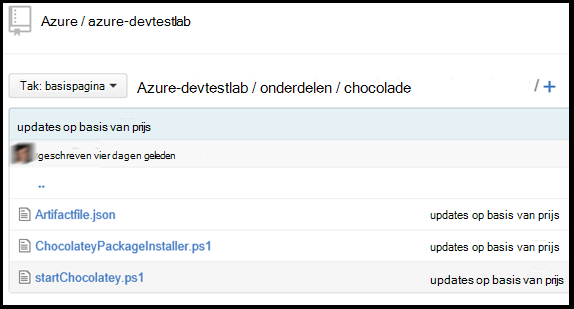

<properties 
    pageTitle="Aangepaste onderdelen maken voor uw DevTest Labs VM | Microsoft Azure"
    description="Leer hoe u uw eigen onderdelen voor gebruik met DevTest Labs van de auteur"
    services="devtest-lab,virtual-machines"
    documentationCenter="na"
    authors="tomarcher"
    manager="douge"
    editor=""/>

<tags
    ms.service="devtest-lab"
    ms.workload="na"
    ms.tgt_pltfrm="na"
    ms.devlang="na"
    ms.topic="article"
    ms.date="08/25/2016"
    ms.author="tarcher"/>

#Aangepaste onderdelen maken voor uw DevTest Labs VM

> [AZURE.VIDEO how-to-author-custom-artifacts] 

## Overzicht
**Onderdelen** worden gebruikt om te implementeren en configureren van uw toepassing nadat een VM is ingericht. Een onderdeel bestaat uit een definitiebestand onderdeel en andere scriptbestanden die zijn opgeslagen in een map in een bibliotheek cijfer. Onderdeel definitiebestanden bestaan uit JSON en expressies die u gebruiken kunt om op te geven wat u wilt installeren op een VM. U kunt bijvoorbeeld de naam van het onderdeel, opdracht om uit te voeren en parameters die beschikbaar zijn wanneer de opdracht wordt uitgevoerd definiëren. U kunt ook verwijzen naar andere scriptbestanden binnen het onderdeel definitiebestand door naam.

##Onderdeel Definitie-bestandsindeling
Het volgende voorbeeld ziet u de secties waaruit de basisstructuur van een definitiebestand.

    {
      "$schema": "https://raw.githubusercontent.com/Azure/azure-devtestlab/master/schemas/2015-01-01/dtlArtifacts.json",
      "title": "",
      "description": "",
      "iconUri": "",
      "targetOsType": "",
      "parameters": {
        "<parameterName>": {
          "type": "",
          "displayName": "",
          "description": ""
        }
      },
      "runCommand": {
        "commandToExecute": ""
      }
    }

| De elementnaam van het | Vereist? | Beschrijving
| ------------ | --------- | -----------
| $schema      | Nee        | Locatie van de JSON-schemabestand die helpt bij het testen van de geldigheid van het definitiebestand.
| titel        | Ja       | Naam van het onderdeel weergegeven in een testomgeving.
| Beschrijving  | Ja       | Beschrijving van het onderdeel weergegeven in een testomgeving.
| iconUri      | Nee        | URI van het pictogram weergegeven in de testomgeving.
| targetOsType | Ja       | Het besturingssysteem van VM waar onderdeel wordt geïnstalleerd. Ondersteunde opties zijn: Windows en Linux.
| parameters   | Nee        | Waarden die beschikbaar zijn wanneer onderdelen installeren opdracht op een computer wordt uitgevoerd. Dit helpt bij het aanpassen van uw onderdeel.
| OpdrachtUitvoeren   | Ja       | Onderdeel installeren opdracht die wordt uitgevoerd op een VM.

###Onderdeel parameters

In de sectie parameters van het definitiebestand opgeven u welke waarden van een gebruiker invoeren kan tijdens de installatie van een onderdeel. U kunt deze waarden in het onderdeel installeren opdracht verwijzen.

U definieert de structuur van de volgende parameters is.

    "parameters": {
        "<parameterName>": {
          "type": "<type-of-parameter-value>",
          "displayName": "<display-name-of-parameter>",
          "description": "<description-of-parameter>"
        }
      }

| De elementnaam van het | Vereist? | Beschrijving
| ------------ | --------- | -----------
| type         | Ja       | Type parameterwaarde op te geven. Zie de onderstaande voor de toegestane typen:
| Weergavenaam Ja       | Naam van de parameter weer die aan een gebruiker in een testomgeving wordt weergegeven.
| Beschrijving  | Ja       | Beschrijving van de parameter weer die wordt weergegeven in de testomgeving.

De toegestane typen zijn:

- tekenreeks – elke geldige JSON-tekenreeks
- int – elke geldige JSON integer
- BOOL – elke geldige JSON Booleaanse
- matrix-een geldige JSON-matrix

##Onderdeel expressies en functies

U kunt expressie gebruiken en functies om het onderdeel te installeren opdracht.
Expressies zijn ingesloten met vierkante haken ([en]), en worden geëvalueerd als het onderdeel is geïnstalleerd. Expressies kunnen plaatsen in een tekenreekswaarde JSON en altijd terugkeren een andere JSON-waarde. Als u wilt gebruiken een letterlijke tekenreeks die met een haak openen begint [, moet u twee vierkante haken [[.
Meestal u expressies gebruiken met functies om een waarde te maken. Net als in JavaScript, zijn functie oproepen opgemaakt als functionName(arg1,arg2,arg3)

De volgende lijst bevat algemene functies.

- parameters(parameterName) - retourneert de parameterwaarde van een die is opgegeven als de opdracht onderdeel is uitgevoerd.
- samenvoegen (arg1, arg2, arg3,...) - combineert meerdere tekenreekswaarden. Deze functie kan een of meer argumenten duren.

Het volgende voorbeeld ziet hoe u functies en expressie gebruiken om een waarde te maken.

    runCommand": {
         "commandToExecute": "[concat('powershell.exe -File startChocolatey.ps1'
    , ' -RawPackagesList ', parameters('packages')
    , ' -Username ', parameters('installUsername')
    , ' -Password ', parameters('installPassword'))]"
    }

##Een aangepaste onderdeel maken

Uw aangepaste onderdeel maken door onderstaande stappen volgen:

1. Installeer een editor JSON - moet u een JSON-editor om te werken met bestanden die onderdeel definitie. Het is raadzaam om met behulp van [Visual Studio-Code](https://code.visualstudio.com/), die beschikbaar is voor Windows, Linux en OS X.

1. Een voorbeeld artifactfile.json worden - uitchecken de onderdelen die zijn gemaakt door Azure DevTest Labs team bij onze [GitHub opslagplaats](https://github.com/Azure/azure-devtestlab) waarin we hebben gemaakt een uitgebreide bibliotheek van onderdelen waarmee u kunt uw eigen onderdelen maken. Een onderdeel definitiebestand downloadt en wijzigingen aanbrengen in het maken van uw eigen onderdelen.

1. Gebruik maken van IntelliSense - middelen IntelliSense om geldige elementen die kunnen worden gebruikt voor het maken van een bestand van de definitie onderdeel weer te geven. U kunt ook de opties voor waarden van een element bekijken. Bijvoorbeeld IntelliSense u de twee opties weergeven van Windows of Linux bij het bewerken van het element **targetOsType** .

1. Store het onderdeel in een cijfer opslagplaats
    1. Maak een aparte map voor elk onderdeel waar de mapnaam hetzelfde als de naam van het onderdeel is.
    1. Sla het bestand in het onderdeel definition Language (artifactfile.json) in de map die u hebt gemaakt.
    1. Sla de scripts waarnaar wordt verwezen met de opdracht van onderdeel installeren.

    Hier volgt een voorbeeld van een map onderdeel mogelijk als volgt uitzien:

    

1. De bibliotheek onderdelen toevoegen aan een testomgeving - raadpleegt u het artikel, [toevoegen een cijfer onderdeel opslagplaats naar een laboratorium](devtest-lab-add-artifact-repo.md).

[AZURE.INCLUDE [devtest-lab-try-it-out](../../includes/devtest-lab-try-it-out.md)]

## Gerelateerde blogberichten
- [Problemen met verbroken onderdelen in AzureDevTestLabs](http://www.visualstudiogeeks.com/blog/DevOps/How-to-troubleshoot-failing-artifacts-in-AzureDevTestLabs)
- [Deelnemen aan een VM naar bestaande AD-domein ARM sjabloon gebruiken in Azure ontwikkelaar-testomgeving](http://www.visualstudiogeeks.com/blog/DevOps/Join-a-VM-to-existing-AD-domain-using-ARM-template-AzureDevTestLabs)

## Volgende stappen

- Leer hoe u [een cijfer onderdeel bibliotheek naar een laboratorium toevoegen](devtest-lab-add-artifact-repo.md).
