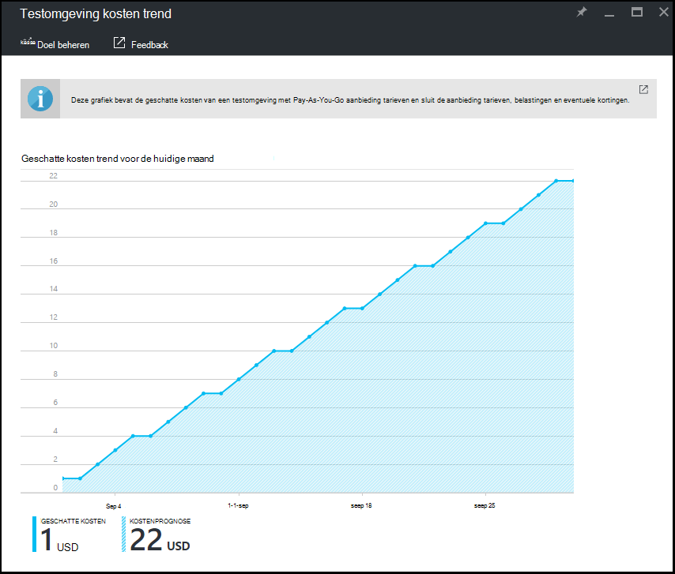

<properties
    pageTitle="De maandelijkse geschatte testomgeving kosten trend in Azure DevTest Labs bekijken | Microsoft Azure"
    description="Meer informatie over de Azure DevTest Labs maandelijkse geschatte kosten trend grafiek."
    services="devtest-lab,virtual-machines"
    documentationCenter="na"
    authors="tomarcher"
    manager="douge"
    editor=""/>

<tags
    ms.service="devtest-lab"
    ms.workload="na"
    ms.tgt_pltfrm="na"
    ms.devlang="na"
    ms.topic="article"
    ms.date="09/06/2016"
    ms.author="tarcher"/>

# De maandelijkse geschatte testomgeving kosten trend in Azure DevTest Labs bekijken

De functie kostenbeheer van DevTest Labs kunt u de kosten van uw testomgeving bijhouden. Dit artikel wordt beschreven hoe u de **Maandelijkse geschatte kosten Trend** -grafiek met de huidige kalendermaand geschatte kosten-tot-datum en de kostenprognose einde van de maand voor de huidige maand uit de agenda weergeven. In dit artikel leert u hoe u kunt de maandelijkse geschatte kosten trend grafiek weergeven in de portal van Azure.

## De maandelijkse geschatte kosten Trend grafiek weergeven

Als u wilt weergeven in de grafiek maandelijkse geschatte kosten Trend, als volgt te werk: 

1. Meld u aan bij de [portal van Azure](http://go.microsoft.com/fwlink/p/?LinkID=525040).

1. Selecteer **Meer Services**en selecteer vervolgens **DevTest Labs** in de lijst.

1. In de lijst met labs, selecteer de gewenste testomgeving.   

1. Klik op van de testomgeving blade, selecteer **kosten-instellingen**.

1. Selecteer op van de testomgeving **kosten instellingen** blade, **testomgeving kosten trend**.

1. De volgende schermafbeelding ziet u een voorbeeld van een grafiek kosten. 

    

De **geschatte** kostenwaarde is de huidige kalendermaand geschatte kosten-tot-datum. De **kosten van gepland** is de geschatte kosten voor de hele huidige kalendermaand, berekend met behulp van de kosten testomgeving voor de afgelopen vijf dagen.
 
De kostenbedragen worden naar boven afgerond op het dichtstbijzijnde gehele getal. Bijvoorbeeld: 

- 5.01 Rondt tot 6 
- 5.50 Rondt tot 6
- 5.99 Rondt tot 6

Als deze boven de grafiek wordt aangegeven, zijn de kosten die u in de grafiek ziet *geschatte* kosten [Pay-As-You-Go](https://azure.microsoft.com/offers/ms-azr-0003p/) met tarieven bieden.
Bovendien het volgende worden *niet* opgenomen in de berekening van de kosten:

- Abonnementen CSP en Dreamspark worden momenteel niet ondersteund terwijl Azure DevTest Labs de [Azure billing API's](../billing-usage-rate-card-overview.md) gebruikt om te berekenen van de kosten testomgeving, waarvoor geen ondersteuning biedt voor CSP of Dreamspark abonnementen.
- Uw tarieven aanbieding. We zijn op dit moment niet gebruikmaken van uw aanbieding tarieven (weergegeven onder uw abonnement) dat u hebt gebruikt met Microsoft of Microsoft partners. We gebruiken Pay-As-You-Go tarieven.
- Uw belastingen
- Uw kortingen
- Valuta op de factuur. De kosten testomgeving wordt momenteel alleen in valuta USD weergegeven.

[AZURE.INCLUDE [devtest-lab-try-it-out](../../includes/devtest-lab-try-it-out.md)]

## Gerelateerde blogberichten

- [Twee zaken die u kunt uw kosten houden op in DevTest Labs](https://blogs.msdn.microsoft.com/devtestlab/2016/06/21/keep-your-cost-on-track/)
- [Waarom kosten drempelwaarden?](https://blogs.msdn.microsoft.com/devtestlab/2016/04/11/why-cost-thresholds/)

## Volgende stappen

Hier zijn enkele dingen om te proberen het volgende:

- [Definiëren testomgeving beleidsregels](./devtest-lab-set-lab-policy.md) - informatie over het instellen van de verschillende beleidsregels gebruikt om te bepalen hoe uw testomgeving en de VMs worden gebruikt. 
- [Aangepaste afbeelding maken](./devtest-lab-create-template.md) : wanneer u een VM maakt, kunt u opgeven een base, die een aangepaste afbeelding of een afbeelding Marketplace kan zijn. Dit artikel wordt beschreven hoe u een aangepaste afbeelding uit een bestand VHD maken.
- [Afbeeldingen op Marketplace configureren](./devtest-lab-configure-marketplace-images.md) - DevTest Labs ondersteunt VMs op basis van Azure Marketplace-afbeeldingen maken. In dit artikel ziet u hoe u bepaalt welke eventuele Azure Marketplace afbeeldingen kunnen worden gebruikt bij het maken van VMs in een laboratorium.
- [Maken een VM in een laboratorium](./devtest-lab-add-vm-with-artifacts.md) - ziet u hoe u een VM maken op basis van de afbeelding van een grondtal (beide aangepast of Marketplace), en het werken met onderdelen in uw VM.