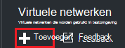
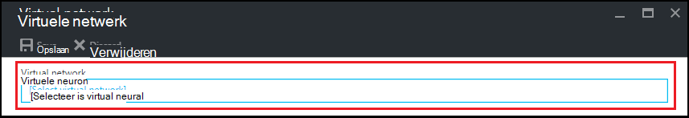
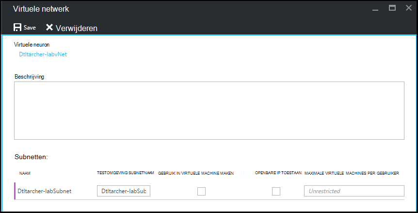

<properties
    pageTitle="Een virtueel netwerk configureren in Azure DevTest Labs | Microsoft Azure"
    description="Leer hoe u een bestaande virtuele netwerk en subnet configureren en gebruiken in een VM met Azure DevTest Labs"
    services="devtest-lab,virtual-machines"
    documentationCenter="na"
    authors="tomarcher"
    manager="douge"
    editor=""/>

<tags
    ms.service="devtest-lab"
    ms.workload="na"
    ms.tgt_pltfrm="na"
    ms.devlang="na"
    ms.topic="article"
    ms.date="09/06/2016"
    ms.author="tarcher"/>

# Een virtueel netwerk ter Azure DevTest Labs configureren

Zoals in het artikel [toevoegen een VM met onderdelen aan een laboratorium](devtest-lab-add-vm-with-artifacts.md), wanneer u een VM in een laboratorium maakt, kunt u een geconfigureerde virtueel netwerk opgeven. In één scenario hiervoor is als u nodig hebt voor toegang tot uw resources corpnet vanaf uw VMs met het virtuele netwerk dat is geconfigureerd met ExpressRoute of VPN van site-naar-site. De volgende secties illustreren het toevoegen van uw bestaande virtual netwerk in de virtuele netwerkinstellingen van een laboratorium zodat deze beschikbaar is om te kiezen bij het maken van VMs is.

## Een virtuele netwerk configureren voor een laboratorium met behulp van de Azure portal
De volgende stappen begeleiden u begeleid bij het toevoegen van een bestaande virtuele netwerk (en subnet) naar een laboratorium, zodat deze kan worden gebruikt bij het maken van een VM in een dezelfde testomgeving. 

1. Meld u aan bij de [portal van Azure](http://go.microsoft.com/fwlink/p/?LinkID=525040).

1. Selecteer **Meer Services**en selecteer vervolgens **DevTest Labs** in de lijst.

1. In de lijst met labs, selecteer de gewenste testomgeving. 

1. Klik op van de testomgeving blade, selecteer **configuratie**.

1. Selecteer op van de testomgeving **configuratie** blade, **virtuele netwerken**.

1. Op het blad **virtuele netwerken** ziet u een lijst met virtuele netwerken die zijn geconfigureerd voor de huidige testomgeving, evenals de standaard virtuele netwerk dat wordt gemaakt voor uw testomgeving. 

1. Selecteer **+ toevoegen**.

    
    
1. Selecteer op het blad **virtuele netwerk** **[Selecteer virtueel netwerk]**.

    
    
1. Selecteer het gewenste virtuele netwerk op het blad **virtueel netwerk kiezen** . Het blad ziet u de virtuele netwerken die onder hetzelfde gebied in het abonnement als de testomgeving zijn.  

1. Als u een virtueel netwerk, gaat u terug naar het blad **virtuele netwerk** en verschillende velden zijn ingeschakeld.  

    

1. Geef een beschrijving voor uw virtuele netwerk / testomgeving combinatie.

1. Als u wilt toestaan dat een subnet moet worden gebruikt in testomgeving VM maken, selecteert u **Gebruiken IN virtuele MACHINE maken**.

1. Als u wilt toestaan dat openbare IP-adressen in een subnet, selecteert u **Openbare IP toestaan**.

1. Geef in het veld **Maximale virtuele MACHINES PER gebruiker** , de maximale VMs per gebruiker voor elk subnet. Als u een onbeperkte aantal VMs wilt, laat u dit veld leeg.

1. Selecteer **Opslaan**.

1. Nu dat het virtuele netwerk is geconfigureerd, kan deze kan worden geselecteerd bij het maken van een VM. Om te zien hoe een VM maken en geef een virtueel netwerk, raadpleegt u het artikel [een VM met onderdelen aan een laboratorium toevoegen](devtest-lab-add-vm-with-artifacts.md). 

[AZURE.INCLUDE [devtest-lab-try-it-out](../../includes/devtest-lab-try-it-out.md)]

## Volgende stappen

Wanneer u het gewenste virtuele netwerk aan uw testomgeving hebt toegevoegd, wordt de volgende stap is [een VM naar uw testomgeving](devtest-lab-add-vm-with-artifacts.md)toevoegen.