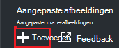
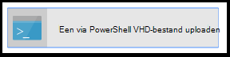
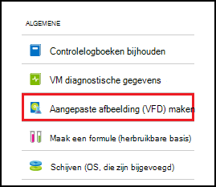
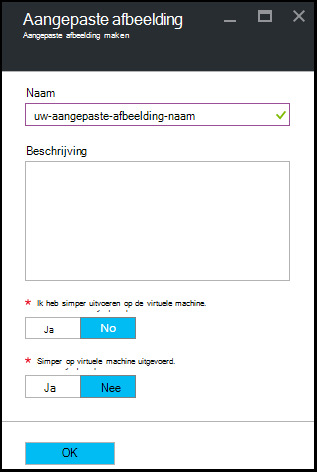

<properties
    pageTitle="Aangepaste afbeeldingen van de Azure DevTest Labs als u wilt maken van VMs beheren | Microsoft Azure"
    description="Informatie over het maken van een aangepaste afbeelding vanuit een VHD-bestand of een bestaande VM in Azure DevTest Labs"
    services="devtest-lab,virtual-machines"
    documentationCenter="na"
    authors="tomarcher"
    manager="douge"
    editor=""/>

<tags
    ms.service="devtest-lab"
    ms.workload="na"
    ms.tgt_pltfrm="na"
    ms.devlang="na"
    ms.topic="article"
    ms.date="09/07/2016"
    ms.author="tarcher"/>

# Aangepaste afbeeldingen van de Azure DevTest Labs als u wilt maken van VMs beheren

In Azure DevTest Labs kunnen aangepaste afbeeldingen u snel VMs maken zonder te wachten op de vereiste software op de doelcomputer zijn geïnstalleerd. Aangepaste afbeeldingen kunnen u de software die u nodig in een bestand VHD hebt vooraf installeren en gebruik vervolgens de VHD-bestand maken van een VM. Omdat de software al is geïnstalleerd, wordt de aanmaaktijd van VM de focus. Daarnaast worden aangepaste afbeeldingen gebruikt om te klonen VMs door een aangepaste afbeelding maken op basis van een VM en vervolgens VMs van die aangepaste afbeelding te maken.

In dit artikel leert u hoe u:

- [Een aangepaste afbeelding uit een bestand VHD maken](#create-a-custom-image-from-a-vhd-file) zodat u vervolgens een VM vanuit die aangepaste afbeelding maken kunt. 
- [Een aangepaste afbeelding uit een VM maken](#create-a-custom-image-from-a-vm) voor snelle VM klonen.

## Een aangepaste afbeelding uit een VHD-bestand maken

In deze sectie ziet u hoe u een aangepaste afbeelding uit een bestand VHD maken.
Moet u toegang tot een geldige VHD-bestand om uit te voeren van alle stappen in deze sectie.   

1. Meld u aan bij de [portal van Azure](http://go.microsoft.com/fwlink/p/?LinkID=525040).

1. Selecteer **meer services**en selecteer vervolgens **DevTest Labs** in de lijst.

1. In de lijst met labs, selecteer de gewenste testomgeving.  

1. Klik op van de testomgeving blade, selecteer **configuratie**. 

1. Selecteer op het blad testomgeving **configuratie** , **aangepaste afbeeldingen**.

1. Selecteer **+ aangepaste afbeelding**op het blad **aangepaste afbeeldingen** .

    

1. Voer de naam van de aangepaste afbeelding. Deze naam wordt weergegeven in de lijst met grondtal afbeeldingen bij het maken van een VM.

1. Voer de beschrijving van de aangepaste afbeelding. Deze beschrijving wordt weergegeven in de lijst met grondtal afbeeldingen bij het maken van een VM.

1. Selecteer **VHD-bestand**.

1. Als u toegang tot een VHD-bestand dat niet wordt vermeld hebt, voeg deze toe door de instructies in de sectie [een VHD-bestand uploaden](#upload-a-vhd-file) en hier retourneren wanneer u klaar bent.

1. Selecteer het gewenste VHD-bestand.

1. Selecteer **OK** om te sluiten van het blad **VHD-bestand** .

1. Selecteer **OS configuratie**.

1. Selecteer op het tabblad **Configuratie van het besturingssysteem** **Windows** of **Linux**.

1. Als **Windows** is geselecteerd, geeft u via het selectievakje in of *Sysprep* is uitgevoerd op de computer.

1. Selecteer **OK** om te sluiten van het blad **OS configuratie** .

1. Selecteer **OK** om de aangepaste afbeelding te maken.

1. Ga naar de sectie van de [Volgende stappen](#next-steps) .

###Een VHD-bestand uploaden

Als u wilt een aangepaste afbeelding hebt toegevoegd, moet u toegang hebt tot een VHD-bestand.

1. Klik op het blad **VHD-bestand** , selecteer **een via PowerShell VHD-bestand uploaden**.

    

1. Het volgende blad wordt instructies voor het wijzigen van en uitvoeren van een PowerShell-script die een VHD-bestand wordt geüpload naar uw Azure abonnement weergegeven. 
**Notitie:** Dit proces kan zijn afhankelijk van de grootte van het VHD-bestand en uw verbindingssnelheid lange.

## Een aangepaste afbeelding uit een VM maken
Als er een VM die al is geconfigureerd, kunt u een aangepaste afbeelding maken van deze VM en achteraf die aangepaste afbeelding gebruiken om te maken van andere identieke VMs. De volgende stappen illustreren hoe u een aangepaste afbeelding maakt van een VM:

1. Meld u aan bij de [portal van Azure](http://go.microsoft.com/fwlink/p/?LinkID=525040).

1. Selecteer **meer services**en selecteer vervolgens **DevTest Labs** in de lijst.

1. In de lijst met labs, selecteer de gewenste testomgeving.  

1. Selecteer **Mijn virtuele machines**op van de testomgeving blade.
 
1. Selecteer de VM waaruit u wilt maken van de aangepaste afbeelding op het blad **Mijn virtuele machines** .

1. Selecteer op de de VM blade, **aangepaste afbeelding maken (VHD)**.

    

1. Voer een naam en beschrijving voor uw aangepaste afbeelding op het blad **afbeelding maken** . Deze informatie wordt weergegeven in de lijst met grondtal wanneer u een VM maakt.

    

1. Selecteer of sysprep is uitgevoerd op de VM. Als de sysprep niet op de VM uitvoert is, Geef op of u sysprep wordt uitgevoerd wanneer een VM is gemaakt op basis van deze aangepaste afbeelding.

1. Selecteer **OK** wanneer u klaar bent om de aangepaste afbeelding te maken.

[AZURE.INCLUDE [devtest-lab-try-it-out](../../includes/devtest-lab-try-it-out.md)]

## Gerelateerde blogberichten

- [Aangepaste afbeeldingen of formules?](https://blogs.msdn.microsoft.com/devtestlab/2016/04/06/custom-images-or-formulas/)
- [Aangepaste afbeeldingen tussen Azure DevTest Labs kopiëren](http://www.visualstudiogeeks.com/blog/DevOps/How-To-Move-CustomImages-VHD-Between-AzureDevTestLabs#copying-custom-images-between-azure-devtest-labs)

##Volgende stappen

Zodra u hebt een eigen afbeelding voor gebruik toegevoegd bij het maken van een VM, is de volgende stap om toe te [voegen een VM naar uw testomgeving](./devtest-lab-add-vm-with-artifacts.md).