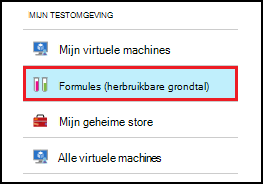

<properties
    pageTitle="Formules in Azure DevTest Labs maken VMs beheren | Microsoft Azure"
    description="Informatie over het maken, bijwerken, en verwijderen van Azure DevTest Labs formules en hiermee te maken van nieuwe VMs."
    services="devtest-lab,virtual-machines"
    documentationCenter="na"
    authors="tomarcher"
    manager="douge"
    editor=""/>

<tags
    ms.service="devtest-lab"
    ms.workload="na"
    ms.tgt_pltfrm="na"
    ms.devlang="na"
    ms.topic="article"
    ms.date="08/30/2016"
    ms.author="tarcher"/>

# DevTest Labs formules als u wilt maken van VMs beheren

Een formule in Azure DevTest Labs is een lijst met standaardwaarden voor eigenschap gebruikt om te maken van een virtuele machine (VM). Wanneer u een VM maakt van een formule, de standaardwaarden kunnen worden gebruikt als-is of gewijzigd. Formules bieden, zoals [aangepaste afbeeldingen](./devtest-lab-create-template.md) en [afbeeldingen op Marketplace](./devtest-lab-configure-marketplace-images.md), een methode voor het snel VM inrichten.  

In dit artikel leert u hoe u de volgende taken uitvoeren:

- [Een formule maken](#create-a-formula)
- [Een formule gebruiken voor het inrichten van een VM](#use-a-formula-to-provision-a-vm)
- [Een formule wijzigen](#modify-a-formula)
- [Een formule verwijderen](#delete-a-formula)

> [AZURE.NOTE] Formules - zoals [aangepaste afbeeldingen](./devtest-lab-create-template.md) - kunnen u de afbeelding van een grondtal maken vanuit een VHD-bestand. De afbeelding kan vervolgens worden gebruikt voor het inrichten van een nieuwe VM. Om te bepalen welke is geschikt voor uw specifieke omgeving, raadpleegt u het artikel, [aangepaste afbeeldingen van vergelijking en formules in DevTest Labs](./devtest-lab-comparing-vm-base-image-types.md).

## Een formule maken
Iedereen met DevTest Labs *gebruikers* machtigingen kan maken met behulp van een formule als basis VMs. Er zijn twee manieren om formules te maken: 

- Gebruik van een basis - wanneer u wilt de kenmerken van de formule definiëren.
- Vanuit een bestaande testomgeving VM - Gebruik deze optie wanneer u wilt maken van een formule op basis van de instellingen van een bestaande VM.

### Een formule maken van een basis
De volgende stappen helpt u bij het proces van een formule maken op basis van een aangepaste afbeelding, Marketplace-afbeelding of een andere formule.

1. Meld u aan bij de [portal van Azure](http://go.microsoft.com/fwlink/p/?LinkID=525040).

1. Selecteer **Meer Services**en selecteer vervolgens **DevTest Labs** in de lijst.

1. In de lijst met labs, selecteer de gewenste testomgeving.  

1. Klik op van de testomgeving blade, **formules (herbruikbare grondtal)**te selecteren.

    

1. Selecteer op het blad **testomgeving formules** **+ toevoegen**.

    

1. Klik op het blad **kiezen een base** , selecteert u de basis (aangepaste afbeelding, Marketplace afbeelding of formule) waaruit u wilt maken van de formule.

    

1. Geef op het blad **formule maken** de volgende waarden:

    - **De naam van de te000126961** - Voer een naam voor de formule. Deze waarde wordt in de lijst met grondtal afbeeldingen worden weergegeven wanneer u een VM maakt. De naam is gevalideerd terwijl u typt u het en indien ongeldig is, een bericht geeft aan de vereisten voor een geldige naam.
    - **Beschrijving** - Voer een zinvolle beschrijving voor de formule. Deze waarde is beschikbaar in het contextmenu van de formule wanneer u een VM maakt.
    - **Gebruikersnaam in te voeren** - Typ de naam van een gebruiker dat beheerdersbevoegdheden wordt verleend.
    - **Wachtwoord** - Voer - of Selecteer in de vervolgkeuzelijst - een waarde die is gekoppeld aan het geheim (wachtwoord) die u wilt gebruiken voor de opgegeven gebruiker.  
    - **Afbeelding** : dit veld geeft de naam van de afbeelding die u hebt geselecteerd in het vorige blad. 
    - **VM grootte** - Selecteer een van de vooraf gedefinieerde items die Geef de processorcores, RAM grootte en de grootte van de harde schijf van de VM maken.
    - **Virtuele netwerk** - Geef de gewenste virtueel netwerk.
    - **Subnet** - Geef de gewenste subnet.
    - **Openbare IP-adres** - als het beleid testomgeving is ingesteld op toestaan openbare IP-adressen voor het geselecteerde subnet, Geef op of u het IP-adres als public door **Ja** of **Nee**te selecteren. Anders is deze optie uitgeschakeld en als **geen**hebt geselecteerd.
    - **Onderdelen** - selecteren en configureren van de onderdelen die u wilt toevoegen aan de afbeelding. Secure tekenreeks waarden niet met de formule opgeslagen worden. Onderdeel parameters die beveiligd tekenreeksen zijn worden niet weergegeven. 

        

1. Selecteer **maken** om de formule te maken.

### Een formule maken van een VM
De volgende stappen helpen u bij het maken van een formule op basis van een bestaande VM. 

> [AZURE.NOTE] Als u wilt een formule maken van een VM, moet de VM zijn gemaakt na 30 maart 2016. 

1. Meld u aan bij de [portal van Azure](http://go.microsoft.com/fwlink/p/?LinkID=525040).

1. Selecteer **Meer Services**en selecteer vervolgens **DevTest Labs** in de lijst.

1. In de lijst met labs, selecteer de gewenste testomgeving.  

1. Op van de testomgeving **Overzicht** blade, selecteert u de VM waaruit u wilt maken van de formule.

    

1. Selecteer de **formule (herbruikbare basis) maken**op van de VM blade.

    

1. Voer een **naam** en **Beschrijving** voor de nieuwe formule op het blad **formule maken** .

    

1. Selecteer **OK** om de formule te maken.

## Een formule gebruiken voor het inrichten van een VM
Wanneer u een formule hebt gemaakt, kunt u een VM op basis van die formule maken. De sectie [toevoegen een VM met onderdelen](devtest-lab-add-vm-with-artifacts.md#add-a-vm-with-artifacts) begeleidt u bij het proces.

## Een formule wijzigen
Als u wilt een formule wijzigen, als volgt te werk:

1. Meld u aan bij de [portal van Azure](http://go.microsoft.com/fwlink/p/?LinkID=525040).

1. Selecteer **Meer Services**en selecteer vervolgens **DevTest Labs** in de lijst.

1. In de lijst met labs, selecteer de gewenste testomgeving.  

1. Klik op van de testomgeving blade, **formules (herbruikbare grondtal)**te selecteren.

    

1. Klik op het blad **testomgeving formules** , selecteert u de formule die u wilt wijzigen.

1. Klik op het blad **formule bijwerkt** , breng de gewenste wijzigingen aan en schakel **bijwerken**.

## Een formule verwijderen 
Als u wilt verwijderen van een formule, de volgende stappen uit:

1. Meld u aan bij de [portal van Azure](http://go.microsoft.com/fwlink/p/?LinkID=525040).

1. Selecteer **Meer Services**en selecteer vervolgens **DevTest Labs** in de lijst.

1. In de lijst met labs, selecteer de gewenste testomgeving.  

1. Klik op het blad testomgeving **Instellingen** , **formules**te selecteren.

    

1. Klik op het blad **testomgeving formules** , selecteert u de drie puntjes aan de rechterkant van de formule die u wilt verwijderen.

    

1. In het contextmenu van de formule, selecteert u **verwijderen**.

    

1. Selecteer **Ja** in het dialoogvenster voor het bevestigen van verwijderen.

[AZURE.INCLUDE [devtest-lab-try-it-out](../../includes/devtest-lab-try-it-out.md)]

## Gerelateerde blogberichten

- [Aangepaste afbeeldingen of formules?](https://blogs.msdn.microsoft.com/devtestlab/2016/04/06/custom-images-or-formulas/)

## Volgende stappen
Zodra u een formule voor gebruik gemaakt hebt bij het maken van een VM, is de volgende stap om toe te [voegen een VM naar uw testomgeving](./devtest-lab-add-vm-with-artifacts.md).