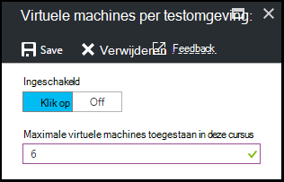

<properties
    pageTitle="Beleidsregels voor testomgeving definiëren in Azure DevTest Labs | Microsoft Azure"
    description="Informatie over het definiëren van beleidsregels voor testomgeving zoals VM formaten, maximum VMs per gebruiker en afsluiten automatisering."
    services="devtest-lab,virtual-machines"
    documentationCenter="na"
    authors="tomarcher"
    manager="douge"
    editor=""/>

<tags
    ms.service="devtest-lab"
    ms.workload="na"
    ms.tgt_pltfrm="na"
    ms.devlang="na"
    ms.topic="article"
    ms.date="09/12/2016"
    ms.author="tarcher"/>

# Beleidsregels voor testomgeving definiëren in Azure DevTest Labs

> [AZURE.VIDEO how-to-set-vm-policies-in-a-devtest-lab]

Azure DevTest Labs kunt u belangrijke beleidsregels die u helpen bij het bepalen van de kosten en minimaliseren indien in uw labs opgeven. Dit beleid testomgeving opnemen het maximum aantal VMs gemaakt per gebruiker en per testomgeving en verschillende opties voor automatisch afsluiten en automatisch wordt gestart. 

## Toegang krijgen tot het beleid van een laboratorium in Azure DevTest Labs

De volgende stappen begeleiden u bij het instellen van beleidsregels voor een laboratorium in Azure DevTest Labs:

Als u wilt weergeven (en wijzigen) op het beleid voor een laboratorium, als volgt te werk:

1. Meld u aan bij de [portal van Azure](http://go.microsoft.com/fwlink/p/?LinkID=525040).

1. Selecteer **meer services**en selecteer vervolgens **DevTest Labs** in de lijst.

1. In de lijst met labs, selecteer de gewenste testomgeving.   

1. Selecteer **beleidsinstellingen**.

1. Het blad **beleidsinstellingen** bevat een menu met de instellingen die u kunt opgeven: 

    

    Meer informatie over het instellen van een beleid, selecteert u deze in de volgende lijst:

    - [Toegestane VM grootte](#set-allowed-virtual-machine-sizes) - Selecteer de lijst met VM formaten toegestaan in een testomgeving. Een gebruiker kan VMs alleen uit deze lijst maken.

    - [Virtuele machines per gebruiker](#set-virtual-machines-per-user) - Geef het maximum aantal VMs die kan worden gemaakt door een gebruiker. 

    - [Virtuele machines per testomgeving](#set-virtual-machines-per-lab) - Geef het maximum aantal VMs die kunnen worden gemaakt voor een laboratorium. 

    - [Automatisch afsluiten](#set-auto-shutdown) - Geef de tijd waarop de huidige testomgeving VMs automatisch afgesloten van.

    - [Automatisch wordt gestart](#set-auto-start) - Geef de tijd waarop de huidige testomgeving VMs omhoog automatisch gestart.

## Instellen dat is virtual machine grootten toegestaan

Het beleid voor het instellen van de toegestane VM-grootte kunt u testomgeving afvalstoffen doordat u opgeven welke groottes VM zijn toegestaan in een testomgeving minimaliseren. Als dit beleid is geactiveerd, kunnen alleen VM formaten uit deze lijst worden gebruikt om te maken van VMs.

1. Selecteer **toegestane virtuele machines grootte**op van de testomgeving **beleidsinstellingen** blade.

    
 
1. Selecteer **op** dit beleid inschakelen en **uit** te schakelen.

1. Als u dit beleid inschakelt, selecteert u een of meer VM puntgrootten die kunnen worden gemaakt in uw testomgeving.

1. Selecteer **Opslaan**.

## Set virtuele machines per gebruiker

Het beleid voor **virtuele machines per gebruiker** kunt u het maximum aantal VMs die kan worden gemaakt door een individuele gebruiker opgeven. Als een gebruiker probeert te maken van een VM wanneer de gebruikerslimiet van de is voldaan, wordt een foutbericht wordt aangegeven dat de VM kan niet worden gemaakt. 

1. Selecteer op de de testomgeving **beleidsinstellingen** blade, **virtuele machines per gebruiker**.

    

1. Selecteer **op** dit beleid inschakelen en **uit** te schakelen.

1. Als u dit beleid inschakelt, voert u een numerieke waarde die aangeeft dat het maximum aantal VMs die kan worden gemaakt door een gebruiker. Als u een getal invoert dat ongeldig is, wordt het maximum aantal toegestaan voor dit veld weergegeven in de gebruikersinterface.

1. Selecteer **Opslaan**.

## Set virtuele machines per testomgeving

Het beleid voor **virtuele machines per testomgeving** kunt u het maximum aantal VMs die kunnen worden gemaakt voor de huidige testomgeving opgeven. Als een gebruiker probeert te maken van een VM wanneer de limiet van testomgeving is voldaan, wordt een foutbericht wordt aangegeven dat de VM kan niet worden gemaakt. 

1. Selecteer op de de testomgeving **beleidsinstellingen** blade, **virtuele machines per testomgeving**.

    

1. Selecteer **op** dit beleid inschakelen en **uit** te schakelen.

1. Als u dit beleid inschakelt, voert u een numerieke waarde die aangeeft dat het maximum aantal VMs die kunnen worden gemaakt voor de huidige testomgeving. Als u een getal invoert dat ongeldig is, wordt het maximum aantal toegestaan voor dit veld weergegeven in de gebruikersinterface.

1. Selecteer **Opslaan**.

## Set auto-afsluiten

Het beleid automatisch afsluiten helpt te minimaliseren ten testomgeving afvalstoffen doordat u om op te geven van de tijd van deze cursus VMs afgesloten.

1. Klik op van de testomgeving **beleidsinstellingen** blade, selecteer **Auto-afsluiten**.

    

1. Selecteer **op** dit beleid inschakelen en **uit** te schakelen.

1. Als u dit beleid inschakelt, geef de lokale tijd af alle VMs in de huidige testomgeving te sluiten.

1. Selecteer **Opslaan**.

1. Standaard eenmaal is ingeschakeld, dit beleid is van toepassing op alle VMs in de huidige testomgeving. Als u wilt verwijderen met deze instelling uit een specifieke VM, van de VM blade openen en wijzigen van de instelling **automatisch afsluiten** 

## Set automatisch starten

Het beleid automatisch wordt gestart, kunt u opgeven wanneer de VMs in de huidige testomgeving moeten worden gestart.  

1. Selecteer op de de testomgeving **beleidsinstellingen** blade, **automatisch wordt gestart**.

    

1. Selecteer **op** dit beleid inschakelen en **uit** te schakelen.

1. Als u dit beleid inschakelt, geef het lokale gepland begintijd en de dagen van de week waarop de tijd van toepassing is. 

1. Selecteer **Opslaan**.

1. Eenmaal is ingeschakeld, wordt dit beleid niet automatisch toegepast op elke VMs in de huidige testomgeving. Als u wilt deze instelling toepassen op een specifieke VM, van de VM blade openen en wijzigen van de instelling **automatisch wordt gestart** 

[AZURE.INCLUDE [devtest-lab-try-it-out](../../includes/devtest-lab-try-it-out.md)]

## Volgende stappen

Zodra u hebt gedefinieerd en de verschillende VM beleidsinstellingen voor uw testomgeving toegepast, volgen hier enkele dingen die u kunt proberen het volgende:

- [Kostenbeheer configureren](./devtest-lab-configure-cost-management.md) - ziet u hoe u de grafiek **Maandelijkse geschatte kosten Trend**  
Als u wilt bekijken van de huidige maand bevindt zich geschatte kosten-tot-datum en de kostenprognose einde van de maand.
- [Aangepaste afbeelding maken](./devtest-lab-create-template.md) : wanneer u een VM maakt, kunt u opgeven een base, die een aangepaste afbeelding of een afbeelding Marketplace kan zijn. Dit artikel wordt beschreven hoe u een aangepaste afbeelding uit een bestand VHD maken.
- [Afbeeldingen op Marketplace configureren](./devtest-lab-configure-marketplace-images.md) - Azure DevTest Labs ondersteunt VMs op basis van Azure Marketplace-afbeeldingen maken. In dit artikel ziet u hoe u bepaalt welke eventuele Azure Marketplace afbeeldingen kunnen worden gebruikt bij het maken van VMs in een laboratorium.
- [Maken een VM in een laboratorium](./devtest-lab-add-vm-with-artifacts.md) - ziet u hoe u een VM maken op basis van de afbeelding van een grondtal (beide aangepast of Marketplace), en het werken met onderdelen in uw VM.
