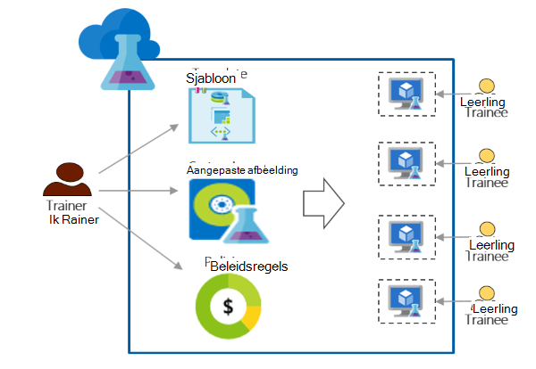

<properties
    pageTitle="Azure DevTest Labs gebruiken voor training | Microsoft Azure"
    description="Informatie over het gebruik van Azure DevTest Labs voor training scenario's."
    services="devtest-lab,virtual-machines"
    documentationCenter="na"
    authors="steved0x"
    manager="douge"
    editor=""/>

<tags
    ms.service="devtest-lab"
    ms.workload="na"
    ms.tgt_pltfrm="na"
    ms.devlang="na"
    ms.topic="article"
    ms.date="09/12/2016"
    ms.author="sdanie"/>

# Azure DevTest Labs gebruiken voor training

Azure DevTest Labs kan worden gebruikt om u te veel belangrijke scenario's behalve de ontwikkelaar/testen implementeren. Een van de scenario's is voor het instellen van een laboratorium trainingen. Azure DevTest Labs kunt u een testomgeving waarin u aangepaste sjablonen die elke leerling gebruiken kunt om te maken van identieke en geïsoleerd omgevingen trainingen kunt geven maken. U kunt ervoor zorgen dat training omgevingen beschikbaar voor elke leerling zijn alleen wanneer ze deze nodig hebt en voldoende resources - zoals virtuele machines - vereist voor de training bevatten. Tot slot kunt u eenvoudig een testomgeving delen met stagiairs, die ze op één klik kunnen openen.   

Azure DevTest Labs voldoet aan de volgende vereisten die zijn vereist om te trainen in een virtuele omgeving: 

-   Stagiairs zien VMs gemaakt door andere stagiairs niet
-   Elke computer training zijn identiek
-   Stagiairs kunnen snel inrichten van hun omgevingen training
-   Kosten bepalen door ervoor te zorgen dat stagiairs meer VMs dan ze nodig hebben om de training en ook afsluiten VMs wanneer ze deze niet gebruikt is niet gevonden
-   Eenvoudig delen van een testomgeving training met elke leerling
-   Opnieuw een testomgeving training opnieuw gebruiken

In dit artikel leert u over de verschillende functies van Azure DevTest Labs die kunnen worden gebruikt om te voldoen aan de vereisten van de hierboven beschreven training en gedetailleerde stappen die u volgen kunt als u een laboratorium Trainingen wilt instellen.  

## Training met Azure DevTest Labs implementeren

1. **Een testomgeving maken** 

    Labs zijn het beginpunt in Azure DevTest Labs. Nadat u een laboratorium hebt gemaakt, kunt u taken uitvoeren zoals zoals gebruikers (stagiairs) toevoegen aan een testomgeving, beleid instellen voor het bepalen van de kosten en geef VM afbeeldingen die snel kunnen maken en meer.   

    Meer leren door te klikken op de koppelingen in de volgende tabel:

  	| Taak                                                            | Wat u hebt geleerd                                                    |
|-----------------------------------------------------------------|----------------------------------------------------------------------|
| [Een laboratorium in Azure DevTest Labs maken](devtest-lab-create-lab.md) | Informatie over het maken van een laboratorium in Azure DevTest Labs in de portal van Azure. |

2. **Training VMs in minuten met reeds marketplace afbeeldingen en aangepaste afbeeldingen maken** 
    
    U kunt kiezen kant-en-afbeeldingen vanuit een breed scala van afbeeldingen in de Azure Marketplace en beschikbaar maken voor de deelnemers in een testomgeving. Als de kant-en-afbeeldingen niet aan uw vereisten voldoet, kunt u een aangepaste afbeelding maken door te maken van een laboratorium VM door een kant-en-afbeelding van Azure Marketplace, installatie van de software die u nodig voor de training en de VM op te slaan als aangepaste afbeelding in een testomgeving hebt. 

    Meer leren door te klikken op de koppelingen in de volgende tabel:

  	| Taak                                                                              | Wat u hebt geleerd                                                                                                                                  |
|-----------------------------------------------------------------------------------|-------------------------------------------------------------------------------------------------------------------------------------------------|
| [Afbeeldingen van Azure Marketplace configureren](devtest-lab-configure-marketplace-images.md) | Leer hoe u kunt "witte" lijst Azure Marketplace afbeeldingen; beschikbaar maken voor selectie alleen de afbeeldingen die u wilt voor de training.                 |
| [Een aangepaste afbeelding maken](devtest-lab-create-template.md)                           | Maak een aangepaste afbeelding door vooraf installeren van de software die u nodig voor de training hebt zodat stagiairs kunnen snel een VM met de aangepaste afbeelding maken. |

3. **Herbruikbare sjablonen voor training machines maken** 

    Een formule in Azure DevTest Labs is een lijst met standaardwaarden voor eigenschap gebruikt om te maken van een VM. U kunt een formule in een testomgeving maken met het kiezen van een afbeelding, de grootte van een VM (een combinatie van processor en RAM) en een virtueel netwerk. Elke leerling kan de formule in een testomgeving wordt weergegeven en deze gebruiken om u te maken van een VM. 

    Meer leren door te klikken op de koppelingen in de volgende tabel:

  	| Taak                                                                         | Wat u hebt geleerd                                                                                                          |
|------------------------------------------------------------------------------|-------------------------------------------------------------------------------------------------------------------------|
| [DevTest Labs formules als u wilt maken van VMs beheren](devtest-lab-manage-formulas.md) | Leer hoe u een formule met het kiezen van een afbeelding, VM grootte (combinatie van processor en RAM) en een virtueel netwerk kunt maken. |

4. **Besturingselement kosten**

    Azure DevTest Labs kunt u een beleid instellen in een testomgeving om het maximum aantal VMs die kan worden gemaakt met een leerling in een testomgeving opgeven. 

    Als u bent bezig met Meerdaags training en wilt stoppen met alle VMs op een bepaald tijdstip van de dag en automatisch start vervolgens de volgende dag, kunt u eenvoudig uitvoeren die door in te stellen automatisch afsluiten en automatisch wordt gestart beleidsregels in een testomgeving. 

    Ten slotte, als training voltooid is kunt u verwijderen alle VMs in één keer door een enkel PowerShell-script uit te voeren. 

    Meer leren door te klikken op de koppelingen in de volgende tabel:

  	| Taak                                                                                                                                    | Wat u hebt geleerd                                                      |
|-----------------------------------------------------------------------------------------------------------------------------------------|---------------------------------------------------------------------|
| [Testomgeving beleidsregels definiëren](devtest-lab-set-lab-policy.md)                                                                                    | Kosten beleid instellen in een testomgeving bepalen.                       |
| [Verwijder alle de testomgeving VMs met een PowerShell-script](devtest-lab-faq.md#how-can-i-automate-the-process-of-deleting-all-the-vms-in-my-lab) | Verwijder alle labs in één bewerking wanneer de training voltooid is. |

5. **Een testomgeving delen met elke leerling**

    Labs kunnen rechtstreeks worden geopend met een koppeling die u met uw stagiairs deelt. Uw stagiairs hoeft te hebben een Azure-account, zo lang maken als ze een [Microsoft-account](devtest-lab-faq.md#what-is-a-microsoft-account)hebt. Stagiairs zien niet VMs gemaakt door andere stagiairs.  

    Meer leren door te klikken op de koppelingen in de volgende tabel:

  	| Taak                                                                                                                                | Wat u hebt geleerd                                                   |
|-------------------------------------------------------------------------------------------------------------------------------------|------------------------------------------------------------------|
| [Een leerling toevoegen aan een laboratorium in Azure DevTest Labs](devtest-lab-add-devtest-user.md)                                                     | Gebruik de portal van Azure stagiairs toevoegen aan uw testomgeving training.       |
| [Stagiairs toevoegen aan een testomgeving met een PowerShell-script](devtest-lab-add-devtest-user.md#add-an-external-user-to-a-lab-using-powershell) | PowerShell gebruiken om te automatiseren toe te voegen stagiairs naar uw testomgeving training. |
| [Een koppeling naar een testomgeving](devtest-lab-faq.md#how-do-i-share-a-direct-link-to-my-lab)                                                  | Informatie over hoe een laboratorium kan rechtstreeks kan worden geraadpleegd via een hyperlink.        |

6. **Opnieuw een testomgeving opnieuw gebruiken** 

    U kunt automatiseren testomgeving maken, met inbegrip van aangepaste instellingen, door een Resource Manager-sjabloon maken en deze identieke labs opnieuw maken. 

    Meer leren door te klikken op de koppelingen in de volgende tabel:

  	| Taak                                                                                                                               | Wat u hebt geleerd                                                      |
|------------------------------------------------------------------------------------------------------------------------------------|---------------------------------------------------------------------|
| [Een laboratorium met een resourcemanager-sjabloon maken](devtest-lab-faq.md#how-do-i-create-a-lab-from-an-azure-resource-manager-template) | Maak labs in Azure DevTest Labs resourcemanager sjablonen gebruiken. |

[AZURE.INCLUDE [devtest-lab-try-it-out](../../includes/devtest-lab-try-it-out.md)]  

