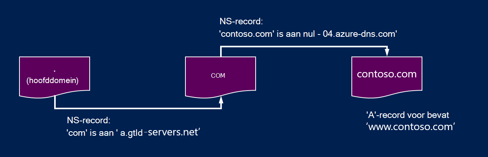
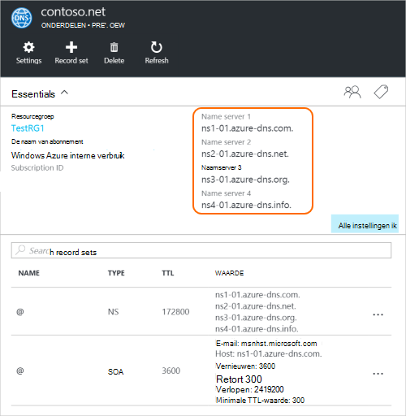

<properties
   pageTitle="Uw domein aan Azure DNS delegeren | Microsoft Azure"
   description="Meer informatie over het domein delegeren wijzigen en gebruiken van Azure DNS-naamservers te leveren domein hostingprovider."
   services="dns"
   documentationCenter="na"
   authors="sdwheeler"
   manager="carmonm"
   editor=""/>

<tags
   ms.service="dns"
   ms.devlang="na"
   ms.topic="get-started-article"
   ms.tgt_pltfrm="na"
   ms.workload="infrastructure-services"
   ms.date="06/30/2016"
   ms.author="sewhee"/>

# Een domein aan Azure DNS delegeren

Azure DNS kunt u een DNS-zone hosten en beheren van de DNS-records voor een domein in Azure wordt aangegeven. In de volgorde voor DNS-query's voor een domein Azure DNS bereiken, heeft het domein worden overgedragen aan Azure DNS vanuit het hoofddomein. Houd er rekening mee Azure DNS is niet de domeinregistrar. In dit artikel wordt uitgelegd hoe domein delegeren werkt en hoe aan gemachtigde met domeinen naar Azure DNS.

## De werking van DNS-delegering

### Domeinen en zones

De Domain Name System is een hiërarchie van domeinen. De hiërarchie begint van het domein 'wortel', waarvan de naam gewoon is**.**.  Hieronder volgt afkomstig zijn op het hoogste niveau domeinen, zoals 'com', 'netto', 'organigram', 'uk' of 'jp'.  Zijn onder de domeinen van de tweede niveau, zoals 'org.uk' of 'co.jp'.  Enzovoort. De domeinen in de DNS-hiërarchie worden gehost afzonderlijk DNS-zones gebruiken. Deze zones zijn globaal verdeeld, die worden gehost door DNS-naamservers overal ter wereld.

**DNS-zone**

Een domein is een unieke naam in het Domain Name System, bijvoorbeeld contoso.com. Een DNS-zone wordt gebruikt voor het hosten van de DNS-records voor een bepaald domein. Het domein 'contoso.com' kan bijvoorbeeld een aantal DNS-records, zoals 'mail.contoso.com' (voor een e-mailserver) en 'www.contoso.com' (voor een website) bevatten.

**Domeinregistrar**

Een domeinregistrar is een bedrijf die Internet domeinnamen kan geven. Ze controleert of als de internetdomein die u wilt gebruiken beschikbaar is en kunt u deze aanschaffen. Wanneer de naam van het domein is geregistreerd, bent u de eigenaar van de juridische voor de domeinnaam. Als u al een internetdomein, kunt u de huidige domeinregistrar wilt gebruiken voor het delegeren naar Azure DNS.

>[AZURE.NOTE] Voor meer informatie op wie de eigenaar van een bepaalde domeinnaam of voor meer informatie over hoe u een domein kopen, raadpleegt u [de domeinbeheer Internet in Azure AD](https://msdn.microsoft.com/library/azure/hh969248.aspx).

### Resolutie en machtigingen

Er zijn twee soorten DNS-servers:

- Een _gemachtigde_ DNS-server host de DNS-zones. Deze antwoorden DNS-query's voor records in die zones alleen.
- Een _recursieve_ DNS-server host geen DNS-zones. Deze vindt u antwoorden op alle DNS-query's door te bellen gezaghebbende DNS-servers om de vereiste gegevens verzamelen.

>[AZURE.NOTE] Azure DNS biedt een gezaghebbende DNS-service.  Biedt geen een recursieve DNS-service.

> Cloudservices en VMs in Azure wordt aangegeven worden automatisch geconfigureerd voor het gebruiken van een recursieve DNS-services die is verstrekt afzonderlijk als onderdeel van Azure-infrastructuur van.  Voor informatie over hoe u deze DNS-instellingen wijzigen, raadpleegt u [Naamresolutie in Azure wordt aangegeven](../virtual-network/virtual-networks-name-resolution-for-vms-and-role-instances.md#name-resolution-using-your-own-dns-server).

DNS-clients in pc's of mobiele apparaten belt u meestal een recursieve DNS-server als u wilt uitvoeren van DNS-query's die de clienttoepassingen nodig hebt.

Wanneer een recursieve DNS-server een query voor een DNS-record, zoals 'www.contoso.com' ontvangt, moet deze eerst de naamserver in de zone voor het domein 'contoso.com' hostingprovider vinden. Klik hiertoe deze begint op de naamservers van de hoofdmap en vanaf hier vindt u de naamservers van de zone 'com' hostingprovider. Vervolgens de naamservers van 'com' om te vinden van de naamservers van de zone 'contoso.com' hostingprovider-query's.  Het is ten slotte, kunnen deze naamservers voor 'www.contoso.com' query.

Dit heet het oplossen van de DNS-naam. Strikt genomen DNS-resolutie bevat extra stappen zoals de volgende CNAME-records, maar die niet belangrijk voor informatie over de werking van DNS-delegering.

Hoe een bovenliggende zone 'verwijst' naar de naamservers voor een onderliggende zone? Dit gebeurt via een speciaal type DNS-record, een zogeheten een NS-record (NS staat voor 'name server'). Bijvoorbeeld, de hoofdmap zone NS-records voor 'com' bevat en ziet u de naamservers voor de zone 'com'. De zone 'com' bevat de NS-records voor 'contoso.com', waarin de naamservers voor de zone 'contoso.com'. Instellen van de NS-records voor een onderliggende zone in een bovenliggende zone heet het delegeren van het domein.

Iedere delegatie daadwerkelijk heeft twee kopieën van de NS-records. een in de bovenliggende zone die wijst naar de onderliggende, en een andere in de onderliggende zone zelf. De zone 'contoso.com' bevat de NS-records voor 'contoso.com' (naast de NS-records in 'com'). Deze gezaghebbende NS-records worden genoemd en ze zich bevinden op de top van de onderliggende zone.

## Delegeren van een domein aan Azure-DNS

Nadat u uw DNS-zone in Azure DNS maakt, moet u de NS-records in de bovenliggende zone instellen om ervoor Azure DNS de gemachtigde bron voor naamresolutie voor uw zone. Voor domeinen hebt gekocht bij een domeinregistrar, wordt de optie voor het instellen van deze NS-records worden aangeboden door uw domeinregistrar.

>[AZURE.NOTE] U hoeft niet te eigenaar bent van een domein om te maken van een DNS-zone met die domeinnaam in Azure DNS. Echter, hoeft u de eigenaar bent van het domein dat voor het instellen van het delegeren naar Azure DNS met de domeinregistrar.

Stel dat u het domein 'contoso.com' aanschaffen en maakt een zone met de naam contoso.com in Azure DNS. Als de eigenaar van het domein dat biedt uw domeinregistrar u de optie voor het configureren van de adressen van naamservers (dat wil zeggen de NS-records) voor uw domein. De domeinregistrar, wordt deze NS-records opgeslagen in de bovenliggende-domein, in dit geval '.com'. Klanten over de hele wereld vervolgens doorgestuurd naar uw domein in Azure DNS-zone wanneer u probeert om op te lossen DNS-records in 'contoso.com'.

### De namen van de naam-server zoeken

Voordat u uw DNS-zone aan Azure DNS delegeren kunt, moet u eerst de namen van servers voor naam van uw zone weten. Azure DNS toegewezen naamservers uit een groep telkens wanneer die een zone wordt gemaakt.

De eenvoudigste manier om te zien van de domeinnaamservers zijn toegewezen aan de zone is via de portal van Azure.  In dit voorbeeld de zone 'contoso.net' is toegewezen naamservers ' ns1-01.azure-dns.com', 'ns2-01.azure-DNS-.net', ' ns3-01.azure-dns.org', en ' ns4-01.azure-dns.info':

 

Gezaghebbende NS-records Azure DNS automatisch gemaakt in de zone met de domeinnaamservers zijn toegewezen.  Als u wilt de namen van de naam van server via Azure PowerShell of Azure CLI wordt weergegeven, hoeft u deze records op te halen.

Azure PowerShell gebruikt, kunnen de gezaghebbende NS-records worden opgehaald als volgt. Houd er rekening mee dat de recordnaam van de “@” wordt gebruikt om te verwijzen naar records op de top van de zone.

    PS> $zone = Get-AzureRmDnsZone –Name contoso.net –ResourceGroupName MyResourceGroup
    PS> Get-AzureRmDnsRecordSet –Name “@” –RecordType NS –Zone $zone

    Name              : @
    ZoneName          : contoso.net
    ResourceGroupName : MyResourceGroup
    Ttl               : 3600
    Etag              : 5fe92e48-cc76-4912-a78c-7652d362ca18
    RecordType        : NS
    Records           : {ns1-01.azure-dns.com, ns2-01.azure-dns.net, ns3-01.azure-dns.org,
                        ns4-01.azure-dns.info}
    Tags              : {}

U kunt ook de platforms Azure CLI gebruiken voor het ophalen van de gezaghebbende NS-records en dus kennismaken met de naamservers die zijn toegewezen aan de zone:

    C:\> azure network dns record-set show MyResourceGroup contoso.net @ NS
    info:    Executing command network dns record-set show
        + Looking up the DNS Record Set "@" of type "NS"
    data:    Id                              : /subscriptions/.../resourceGroups/MyResourceGroup/providers/Microsoft.Network/dnszones/contoso.net/NS/@
    data:    Name                            : @
    data:    Type                            : Microsoft.Network/dnszones/NS
    data:    Location                        : global
    data:    TTL                             : 172800
    data:    NS records
    data:        Name server domain name     : ns1-01.azure-dns.com.
    data:        Name server domain name     : ns2-01.azure-dns.net.
    data:        Name server domain name     : ns3-01.azure-dns.org.
    data:        Name server domain name     : ns4-01.azure-dns.info.
    data:
    info:    network dns record-set show command OK

### Voor het instellen van machtigingen

Elk van de domeinregistrar heeft een eigen DNS-beheerprogramma's om te wijzigen van de naamserverrecords voor een domein. In de DNS-beheerpagina van de domeinregistrar, de NS-records te bewerken en de NS-records vervangen door de kleuren die Azure DNS gemaakt.

Wanneer het delegeren van een domein aan Azure DNS, moet u de servernamen naam is verstrekt door Azure DNS.  U moet altijd alle 4 naam servernamen, ongeacht de naam van uw domein gebruiken.  Domein delegeren hoeft niet de naam van de naam van server hetzelfde domein op het hoogste niveau gebruiken als uw domein.

Gebruik niet 'lijmen records' zodat deze verwijzen naar de DNS-records van Azure naamserver IP-adressen, omdat deze IP-adressen in toekomstige kunnen veranderen. Delegaties namen van servers voor naam gebruiken in uw eigen zone, ook wel genoemd 'aangepaste name servers', worden momenteel niet ondersteund in Azure DNS.

### Om te controleren of naamresolutie werkt

Na het voltooien van de delegatie, kunt u controleren of dat naamresolutie werkt met behulp van een hulpmiddel zoals 'nslookup' om query's in de SOA-record voor uw zone (dit wordt ook automatisch gemaakt wanneer de zone is gemaakt).

Houd er rekening mee dat er geen om op te geven van de DNS-Azure-naamservers, aangezien het normale DNS-resolutie proces u de naamservers automatisch vindt als de overdracht heeft correct is ingesteld.

    nslookup –type=SOA contoso.com

    Server: ns1-04.azure-dns.com
    Address: 208.76.47.4

    contoso.com
    primary name server = ns1-04.azure-dns.com
    responsible mail addr = msnhst.microsoft.com
    serial = 1
    refresh = 900 (15 mins)
    retry = 300 (5 mins)
    expire = 604800 (7 days)
    default TTL = 300 (5 mins)

## Delegerende subdomeinen in Azure-DNS

Als u instellen op een aparte onderliggende zone wilt, kunt u een subdomein in Azure DNS delegeren. Stel dat u wilt instellen op een aparte onderliggende zone, bijvoorbeeld ondervindt instellen en gedelegeerd 'contoso.com' in Azure DNS, 'partners.contoso.com'.

Instellen van een onderliggend domein een soortgelijke proces wordt gevolgd als een normale overdracht. De enige verschil is dat in stap 3 die de NS-records moeten worden gemaakt in de bovenliggende zone 'contoso.com' in Azure DNS, in plaats van via een domeinregistrar wordt ingesteld.

1. Maak de onderliggende zone 'partners.contoso.com' in Azure DNS.
2. De gezaghebbende NS-records in de onderliggende zone voor de naamservers van de onderliggende zone in Azure DNS-hostingprovider opzoeken.
3. De onderliggende zone delegeren door het configureren van NS-records in de bovenliggende zone die wijst naar de onderliggende zone.

### Een subdomein overdragen

Het volgende PowerShell-voorbeeld ziet hoe dit werkt. Dezelfde stappen kunnen worden uitgevoerd via de Portal Azure, of de platforms Azure CLI.

#### Stap 1. De bovenliggende en onderliggende zones maken

Maak eerst de bovenliggende en onderliggende zones. Dit kunnen zich in dezelfde resourcegroep of verschillende resourcegroepen.

    $parent = New-AzureRmDnsZone -Name contoso.com -ResourceGroupName RG1
    $child = New-AzureRmDnsZone -Name partners.contoso.com -ResourceGroupName RG1

#### Stap 2. Ophalen NS-records

We vervolgens ophalen de gezaghebbende NS-records uit onderliggende zone zoals wordt weergegeven in het volgende voorbeeld.  De naamservers die zijn toegewezen aan de onderliggende zone bevat deze optie.

    $child_ns_recordset = Get-AzureRmDnsRecordSet -Zone $child -Name "@" -RecordType NS

#### Stap 3. De onderliggende zone delegeren

Maak corresponderende NS-record instellen in de bovenliggende zone om te voltooien van de overdracht. Houd er rekening mee dat de recordset naam in de bovenliggende zone overeenkomt met de naam van het onderliggende-zone, in dit geval "partners".

    $parent_ns_recordset = New-AzureRmDnsRecordSet -Zone $parent -Name "partners" -RecordType NS -Ttl 3600
    $parent_ns_recordset.Records = $child_ns_recordset.Records
    Set-AzureRmDnsRecordSet -RecordSet $parent_ns_recordset

### Om te controleren of naamresolutie werkt

U kunt controleren dat alles is correct ingesteld door de SOA-record van de onderliggende zone opzoeken.

    nslookup –type=SOA partners.contoso.com

    Server: ns1-08.azure-dns.com
    Address: 208.76.47.8

    partners.contoso.com
        primary name server = ns1-08.azure-dns.com
        responsible mail addr = msnhst.microsoft.com
        serial = 1
        refresh = 900 (15 mins)
        retry = 300 (5 mins)
        expire = 604800 (7 days)
        default TTL = 300 (5 mins)

## Volgende stappen

[DNS-zones beheren](dns-operations-dnszones.md)

[DNS-records beheert](dns-operations-recordsets.md)

