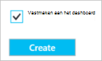

<properties
   pageTitle="Het maken en beheren van een DNS-zone, in de portal van Azure | Microsoft Azure"
   description="Informatie over het maken van DNS-zones voor Azure DNS. Dit is een stapsgewijze handleiding voor het maken en uw eerste DNS wordt beheerd en de hosting van uw DNS-domein met behulp van de Azure portal starten."
   services="dns"
   documentationCenter="na"
   authors="sdwheeler"
   manager="carmonm"
   editor=""
   tags="azure-resource-manager"/>

<tags
   ms.service="dns"
   ms.devlang="na"
   ms.topic="article"
   ms.tgt_pltfrm="na"
   ms.workload="infrastructure-services"
   ms.date="08/16/2016"
   ms.author="sewhee"/>

# Een DNS-zone maken in de portal van Azure

> [AZURE.SELECTOR]
- [Azure-Portal](dns-getstarted-create-dnszone-portal.md)
- [PowerShell](dns-getstarted-create-dnszone.md)
- [Azure CLI](dns-getstarted-create-dnszone-cli.md)

In dit artikel begeleidt u door de stappen voor het maken van een DNS-zone met behulp van de Azure-portal. U kunt ook een DNS-zone via PowerShell of CLI maken.

[AZURE.INCLUDE [dns-create-zone-about](../../includes/dns-create-zone-about-include.md)]

### Codes voor Azure DNS

Labels zijn van een lijst met naam-waardeparen en door Azure Resource Manager naar label bronnen voor factuur- of groepeerniveau worden gebruikt. Zie het artikel [werken met tags om u te organiseren van uw Azure resources](../resource-group-using-tags.md)voor meer informatie over Tags.

U kunt labels in de portal van Azure toevoegen met behulp van het blad **Instellingen** voor uw DNS-zone.

## Een DNS-zone maken

1. Meld u aan bij de portal van Azure

2. Klik in het menu Hub op en klikt u op **Nieuw > netwerk >** en klik vervolgens op **DNS-zone** om te openen van het DNS-zone-blad.

    

3. Klik op het blad **DNS-zone** , klikt u op **maken** onder. Hiermee opent u het **maken van DNS-zone** -blad.

    

4. Klik op het blad **maken DNS-zone** , naam toewijzen aan uw DNS-zone. Bijvoorbeeld *contoso.com*. Zie [Informatie over DNS-zonenamen](#names) in de sectie hierboven.

5. Geef vervolgens de resourcegroep die u wilt gebruiken. U kunt een nieuwe resourcegroep maken, of Selecteer een die al bestaat.

6. Geef de locatie van de resourcegroep in de vervolgkeuzelijst **locatie** . Houd er rekening mee dat deze instelling naar de locatie van de resourcegroep, niet de locatie voor DNS-zone verwijst. De werkelijke DNS-zone resource is automatisch "globale" en is niet iets dat u kunt (of moet) opgeven in de portal.

7. Laat u het selectievakje **vastmaken aan het dashboard** is ingeschakeld als u wilt zoeken eenvoudig naar de nieuwe zone op uw dashboard. Klik vervolgens op **maken**.

    

8. Nadat u op maken, ziet u uw nieuwe zone worden geconfigureerd op het dashboard.

    

9. Wanneer uw nieuwe zone is gemaakt, wordt het blad voor uw nieuwe zone wordt geopend op het dashboard.

## Records weergeven

De volgende records maken van een DNS-zone ook worden gemaakt:

- De record "starten van" (Start of Authority). De SOA is aanwezig zijn in de hoofdmap van elke DNS-zone.
- De naamserver serverrecords (Domeinnaamserver). Deze weergeven in welke naamservers host de zone. Azure DNS maakt gebruik van een groep naamservers en dus andere naamservers kunnen zijn aangewezen om verschillende zones in Azure DNS. Zie [gemachtigde een domein aan Azure DNS](dns-domain-delegation.md) voor meer informatie.

U kunt de records van de Azure portal weergeven

1. Klik op **alle instellingen** te openen van de **Instellingen blade** voor de DNS-zone van uw **DNS-zone** -blade.

    

2. In het onderste gedeelte van het deelvenster Essentials ziet u dat de record wordt ingesteld voor de DNS-zone.

    

## Test

U kunt uw DNS-zone testen met behulp van DNS-hulpprogramma's zoals nslookup, graven of de [DNS-oplossen-naam PowerShell-cmdlet](https://technet.microsoft.com/library/jj590781.aspx).

Als u uw domein voor het gebruik van de nieuwe zone in Azure DNS nog niet hebt overgedragen, moet u de DNS-query rechtstreeks naar een van de naamservers voor uw zone verwijzen. De naamservers voor uw zone staan vermeld in de NS-records, zoals aangegeven per `Get-AzureRmDnsRecordSet` hierboven. Moet de SUBSTITUEREN de juiste waarden voor uw tijdzone in de onderstaande opdracht.

    nslookup
    > set type=SOA
    > server ns1-01.azure-dns.com
    > contoso.com

    Server: ns1-01.azure-dns.com
    Address:  208.76.47.1

    contoso.com
            primary name server = ns1-01.azure-dns.com
            responsible mail addr = msnhst.microsoft.com
            serial  = 1
            refresh = 900 (15 mins)
            retry   = 300 (5 mins)
            expire  = 604800 (7 days)
            default TTL = 300 (5 mins)

## Een DNS-zone verwijderen

U kunt de DNS-zone verwijderen rechtstreeks vanuit de portal. Voordat u verwijdert een DNS-zone in Azure DNS, moet u alle records sets, behalve voor de NS- en SOA-records in de hoofdmap van de zone die automatisch zijn gemaakt wanneer de zone is gemaakt verwijderen.

1. Zoek het blad **DNS-zone** voor de zone die u wilt verwijderen en klik op **verwijderen** aan de bovenkant van het blad.

2. Er verschijnt een laten weten dat u alle records sets, behalve de NS- en SOA-records die zijn automatisch gemaakt moet verwijderen. Als u uw record sets hebt verwijderd, klikt u op **Ja**. Houd er rekening mee dat wanneer u een DNS-zone verwijdert uit de portal, de resourcegroep dat de DNS-zone is gekoppeld aan niet worden verwijderd.

## Volgende stappen

Na het maken van een DNS-zone, maken [Recordsets en records](dns-getstarted-create-recordset-portal.md) om te beginnen met het omzetten van namen voor uw domein Internet.
