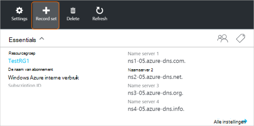
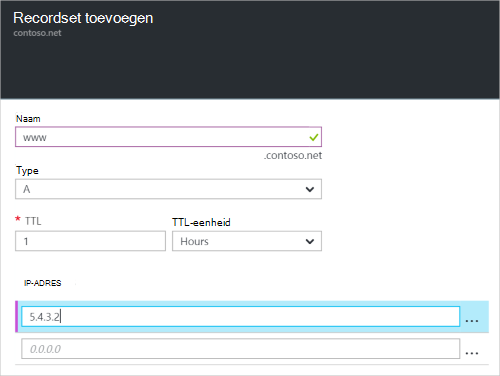

<properties
   pageTitle="Een recordset en records voor een DNS-Zone met behulp van de Azure portal maken | Microsoft Azure"
   description="Het maken van hostrecords voor Azure DNS en record sets en records met behulp van de Azure portal maken"
   services="dns"
   documentationCenter="na"
   authors="sdwheeler"
   manager="carmonm"
   editor=""
   tags="azure-resource-manager"/>

<tags
   ms.service="dns"
   ms.devlang="na"
   ms.topic="article"
   ms.tgt_pltfrm="na"
   ms.workload="infrastructure-services"
   ms.date="08/16/2016"
   ms.author="sewhee"/>

# DNS-record sets en records maken met behulp van de Azure-portal

> [AZURE.SELECTOR]
- [Azure-Portal](dns-getstarted-create-recordset-portal.md)
- [PowerShell](dns-getstarted-create-recordset.md)
- [Azure CLI](dns-getstarted-create-recordset-cli.md)

In dit artikel begeleidt u bij het proces van het maken van records en records sets met behulp van de Azure-portal. Nadat u uw DNS-zone hebt gemaakt, kunt u de DNS-records toevoegen voor uw domein. Hiervoor moet u eerst meer informatie over DNS-records en record sets.

[AZURE.INCLUDE [dns-about-records-include](../../includes/dns-about-records-include.md)]

## Maken van een recordset en de record

Het volgende voorbeeld begeleidt u bij het proces van het maken van een recordset en de record met behulp van de Azure-portal. We gebruiken de record van het type DNS-'A'.

1. Meld u aan bij de portal.

2. Ga naar het **DNS-zone** blad waarin u wilt maken van een recordset.

3. Aan de bovenkant van het blad **DNS-zone** , selecteer de **Record instellen** op het openen van het blad **Add record instellen** .

    

4. Klik op het blad **Add record instellen** , Geef een naam uw recordset. U kunt uw recordset '**www**' bijvoorbeeld kan naam.

    

5. Selecteer het type record dat u wilt maken. Selecteer bijvoorbeeld **A**.

6. Stel de **TTL**. De standaardtijd voor live in de portal is één uur.

7. De IP-adressen, één IP-adres per regel toevoegen. Wanneer u de naam van de voorgestelde Recordset en de record van het type hierboven hebt gebruikt, kunt u de IPv4-adressen toevoegen aan de **A** -record voor de recordset www.

8. Nadat u klaar bent met het IP-adressen toevoegen, selecteert u **OK** onderaan in het blad. Het instellen van DNS-record wordt gemaakt.

## Volgende stappen

Als u wilt uw recordset en records beheren, raadpleegt u [Manage DNS-records en record sets met behulp van de Azure-portal](dns-operations-recordsets-portal.md).

Zie voor meer informatie over DNS Azure [Azure DNS-overzicht](dns-overview.md).
