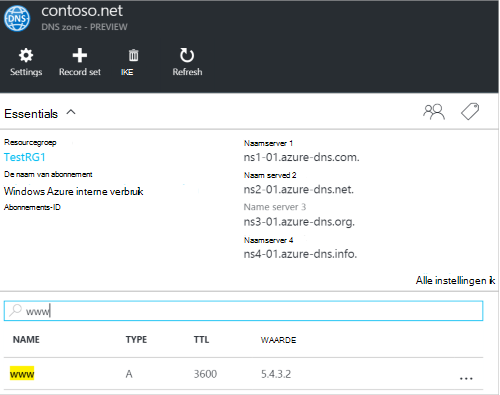
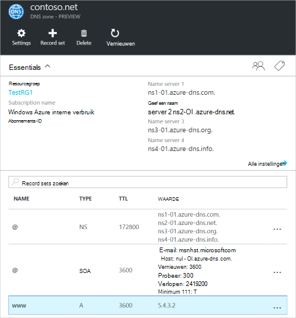
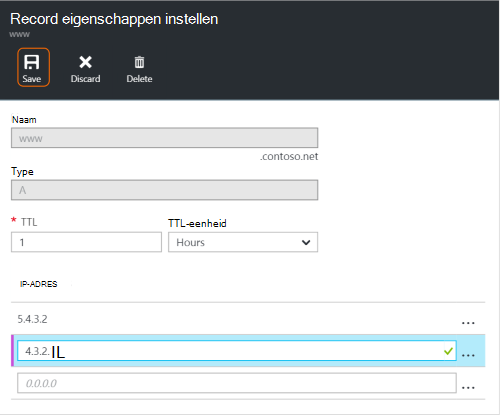
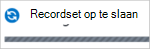
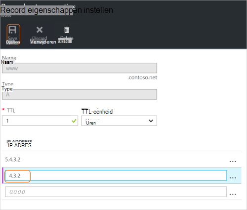
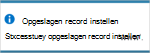
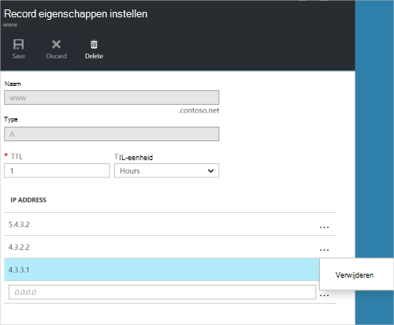
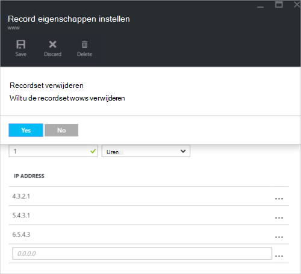

<properties
   pageTitle="DNS-record sets en records met behulp van de Azure-portal beheren | Microsoft Azure"
   description="Beheer van DNS-record wordt ingesteld en records wanneer uw domein op Azure DNS-hostingprovider."
   services="dns"
   documentationCenter="na"
   authors="sdwheeler"
   manager="carmonm"
   editor=""
   tags="azure-resource-manager"/>

<tags
   ms.service="dns"
   ms.devlang="na"
   ms.topic="article"
   ms.tgt_pltfrm="na"
   ms.workload="infrastructure-services"
   ms.date="08/16/2016"
   ms.author="sewhee"/>

# DNS-records beheert en record wordt ingesteld met behulp van de Azure-portal

> [AZURE.SELECTOR]
- [Azure-Portal](dns-operations-recordsets-portal.md)
- [Azure CLI](dns-operations-recordsets-cli.md)
- [PowerShell](dns-operations-recordsets.md)

Dit artikel leest u hoe u de recordsets en records voor uw DNS-zone beheren met behulp van de Azure-portal.

Het is belangrijk is voor meer informatie over het verschil tussen de DNS-record sets en afzonderlijke DNS-records. Een recordset is een verzameling records in een zone met dezelfde naam hebben zijn hetzelfde type. Zie [maken DNS-record sets en records met behulp van de Azure-portal](dns-getstarted-create-recordset-portal.md)voor meer informatie.

## Maak een nieuwe recordset en de record

Zie [DNS-records maken met behulp van de Azure-portal](dns-getstarted-create-recordset-portal.md)maken van een record in de portal van Azure instellen.

## Een recordset weergeven

1. Ga naar het **DNS-zone** -blad in de portal Azure.

2. Zoeken naar de recordset en selecteer deze. Hiermee opent u de eigenschappen Recordset.

    

## Een nieuwe record toevoegen aan een Recordset

U kunt maximaal 20 records toevoegen aan een recordset. Een recordset mogen geen twee identieke records bevatten. Lege record sets (met nul records) kunnen worden gemaakt, maar worden niet weergegeven op de Azure DNS-naamservers. Record sets van het type CNAME kunnen maximaal één record bevatten.

1. Klik op het blad **Record eigenschappen instellen** voor uw DNS-zone, op de set record die u wilt een record wilt toevoegen.

    

2. Geef dat de record eigenschappen instellen door in de velden te vullen.

    

2. Klik op **Opslaan** aan de bovenkant van het blad als uw instellingen wilt opslaan. Sluit het blad.

3. In de hoek ziet u dat de record wordt opgeslagen.

    

Nadat de record is opgeslagen, worden de waarden in het **DNS-zone** blad de nieuwe record doorgevoerd.

## Een record wordt bijgewerkt

De velden die u kunt bijwerken wanneer u een record in een bestaande recordset bijwerkt, zijn afhankelijk van het type record waarmee u werkt.

1. Klik op het blad **Record eigenschappen instellen** voor uw recordset, zoekt u de record.

2. De record wijzigen. Wanneer u een record wijzigt, kunt u de beschikbare instellingen voor de record. In het volgende voorbeeld wordt het veld **IP-adres** is geselecteerd en het IP-adres wordt worden gewijzigd.

    

3. Klik op **Opslaan** aan de bovenkant van het blad als uw instellingen wilt opslaan. In de rechterbovenhoek ziet u de melding dat de record is opgeslagen.

    

Nadat de record is opgeslagen, worden de waarden voor de record die is ingesteld op het blad **DNS-zone** de bijgewerkte record doorgevoerd.

## Een record verwijderen uit een Recordset

U kunt de portal van Azure records verwijderen uit een recordset. Houd er rekening mee dat de laatste record verwijderen uit een recordset de recordset verwijdert.

1. Klik op het blad **Record eigenschappen instellen** voor uw recordset, zoekt u de record.

2. Klik op de record die u wilt verwijderen. Selecteer vervolgens **verwijderen**.

    

3. Klik op **Opslaan** aan de bovenkant van het blad als uw instellingen wilt opslaan.

3. Nadat u de record hebt verwijderd, worden de waarden voor de record op het blad **DNS-zone** de verwijdering doorgevoerd.

## Verwijderen van een Recordset

1. Klik op de **Record eigenschappen instellen** blade voor uw record instellen, klikt u op **verwijderen**.

    

2. Een bericht gevraagd of u wilt verwijderen van de recordset.

3. Controleer of dat de naam overeenkomt met de recordset die u wilt verwijderen en klik vervolgens op **Ja**.

4. Controleer op het blad **DNS-zone** , of dat de recordset niet meer zichtbaar is.

## Werken met NS en SOA-records

NS en SOA-records die automatisch worden gemaakt, worden anders worden beheerd met andere recordtypen.

### SOA-records wijzigen

U niet kunt toevoegen of verwijderen van records uit de automatisch gemaakte SOA-record instellen op de zone Top (naam = "@"). Echter, kunt u een van de parameters binnen de SOA-record (behalve "Host") en de record set TTL.

### NS-records op de top zone wijzigen

U kunt geen toevoegen, verwijderen of wijzigen van de records in de automatisch gemaakte NS-record instellen op de zone-Top (naam = "@"). De enige wijziging dat wel toegestaan is voor het wijzigen van de recordset TTL.

### SOA of NS-record sets verwijderen

U kunt de SOA niet verwijderen en NS-record die is ingesteld op de zone Top (naam = "@") die automatisch worden gemaakt wanneer de zone is gemaakt. Ze worden automatisch verwijderd wanneer u de zone verwijdert.

## Volgende stappen

-   Zie voor meer informatie over DNS Azure [Azure DNS-overzicht](dns-overview.md).
-   Zie [maken van DNS-zones en record wilt instellen met de .NET SDK](dns-sdk.md)voor meer informatie over het automatiseren van DNS.
-   Zie voor meer informatie over het omgekeerde DNS-records [beheren omgekeerde DNS-records voor uw services die via PowerShell](dns-reverse-dns-record-operations-ps.md).
