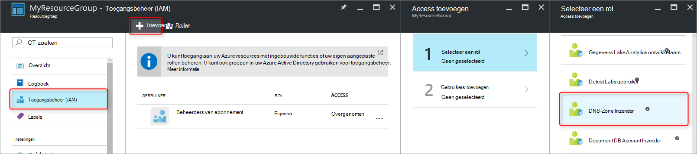
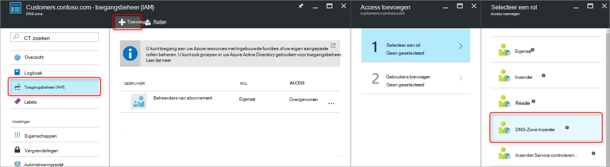
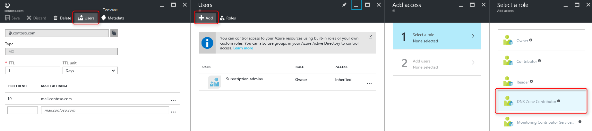
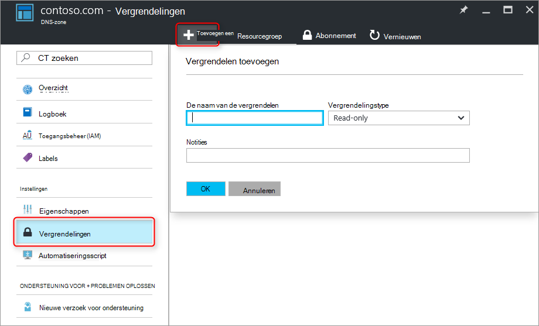

<properties 
   pageTitle="DNS-Zones en Records beveiligen | Microsoft Azure" 
   description="Hoe u DNS-zones en record beveiligen Hiermee stelt u in Microsoft Azure DNS." 
   services="dns" 
   documentationCenter="na" 
   authors="jtuliani" 
   manager="carmonm" 
   editor=""/>

<tags
   ms.service="dns"
   ms.devlang="na"
   ms.topic="article"
   ms.tgt_pltfrm="na"
   ms.workload="infrastructure-services" 
   ms.date="10/20/2016"
   ms.author="jtuliani"/>

# Hoe u DNS-zones en records beveiligen

DNS-zones en records zijn kritieke bronnen. Een DNS-zone of zelfs slechts één DNS-record verwijdert, kan dit resulteren in een servicestoring totale.  Het is dus belangrijk dat kritieke DNS-zones en records zijn beveiligd tegen ongeoorloofde of per ongeluk wijzigingen.

In dit artikel wordt uitgelegd hoe Azure DNS zorgt ervoor dat u uw DNS-zones en records tegen deze wijzigingen beveiligen.  We twee krachtige beveiligingsfuncties door Azure Resource Manager toepassen: [Rolgebaseerd toegangsbeheer](../active-directory/role-based-access-control-what-is.md) en [vergrendelingen van de resource](../resource-group-lock-resources.md).

## Toegangsbeheer op basis van rollen

Azure Rolgebaseerd Access besturingselement RBAC () kunt fijnmazige toegangsbeheer voor Azure gebruikers, groepen en resources. RBAC gebruikt, kunt u verlenen precies het bedrag van access die gebruikers nodig hebben om uit te voeren hun taken. Zie [Wat is toegangsbeheer op basis van rollen](../active-directory/role-based-access-control-what-is.md)voor meer informatie over hoe RBAC helpt u bij het beheren van access.

### De rol 'DNS-Zone Inzender'

De rol 'DNS-Zone Inzender' is een ingebouwde rol Azure gekregen voor het beheer van DNS-resources.  DNS-Zone Inzender machtigingen toewijzen aan een gebruiker of groep, kunt die groep voor het beheren van DNS-resources, maar niet de resources van een ander type.

Stel dat de resource groep 'myzones' bevat vijf zones voor Contoso Corporation. Het verlenen van de DNS-beheerder 'DNS-Zone Inzender' toegangsmachtigingen voor die resourcegroep, kunt volledige controle over deze DNS-zones. Ook wordt voorkomen machtigingen onnodige, bijvoorbeeld de DNS-beheerder kan worden gemaakt of virtuele Machines stoppen.

De eenvoudigste manier om RBAC machtigingen toewijzen is [via de portal van Azure](../active-directory/role-based-access-control-configure.md).  Het blad toegangsbeheer (IAM) voor de resourcegroep openen, klikt u vervolgens klikt u op 'Toevoegen', selecteer de rol 'DNS-Zone Inzender' en selecteert u de vereiste gebruikers of groepen machtigingen verlenen.

Machtigingen kunnen ook worden [verleend via Azure PowerShell](../active-directory/role-based-access-control-manage-access-powershell.md):

    # Grant 'DNS Zone Contributor' permissions to all zones in a resource group
    New-AzureRmRoleAssignment -SignInName <user email address> -RoleDefinitionName "DNS Zone Contributor" -ResourceGroupName <resource group name>

De opdracht equivalente is ook [beschikbaar via de CLI Azure](../active-directory/role-based-access-control-manage-access-azure-cli.md):

    # Grant 'DNS Zone Contributor' permissions to all zones in a resource group
    azure role assignment create --signInName  <user email address> --roleName "DNS Zone Contributor" --resourceGroup <resource group name>

### Zone niveau RBAC

Azure RBAC regels kunnen worden toegepast op een abonnement, een resourcegroep of een individuele resource. In het geval van Azure DNS, worden deze resource kan zijn een afzonderlijke DNS-zone of een afzonderlijke Recordset.

Stel dat de resource groep 'myzones' bevat de zone contoso.com en een subzone 'customers.contoso.com' waarin de CNAME-records die zijn gemaakt voor elke klantaccount.  Het account waarmee deze CNAME-records beheert machtigingen om records te maken in de zone 'customers.contoso.com' alleen moet worden toegewezen, moet deze geen toegang heeft tot de andere zones.

Zone-niveau RBAC machtigingen kunnen worden toegekend via de portal van Azure.  Open het blad toegangsbeheer (IAM) voor de zone, klikt u vervolgens klikt u op 'Toevoegen', selecteer de rol 'DNS-Zone Inzender' en selecteert u de vereiste gebruikers of groepen machtigingen.

Machtigingen kunnen ook worden [verleend via Azure PowerShell](../active-directory/role-based-access-control-manage-access-powershell.md):

    # Grant 'DNS Zone Contributor' permissions to a specific zone
    New-AzureRmRoleAssignment -SignInName <user email address> -RoleDefinitionName "DNS Zone Contributor" -ResourceGroupName <resource group name> -ResourceName <zone name> -ResourceType Microsoft.Network/DNSZones

De opdracht equivalente is ook [beschikbaar via de CLI Azure](../active-directory/role-based-access-control-manage-access-azure-cli.md):

    # Grant 'DNS Zone Contributor' permissions to a specific zone
    azure role assignment create --signInName <user email address> --roleName "DNS Zone Contributor" --resource-name <zone name> --resource-type Microsoft.Network/DNSZones --resource-group <resource group name>

### Record niveau RBAC instellen

We kunnen een stap verder gaan. Houd rekening met het e-mailbeheerder voor Contoso Corporation, die nodig toegang tot de MX- en TXT records op de top van de zone 'contoso.com heeft'.  Zij nodig geen toegang tot eventuele andere MX- of TXT-records, of alle records van een ander type.  Azure DNS kunt u machtigingen op het niveau van de recordset toewijzen aan exact de records die de e-mailbeheerder toegang tot nodig heeft.  Het e-mailbeheerder is precies het besturingselement zij nodig heeft, en breng desgewenst andere wijzigingen kan niet worden verleend.
  
Machtigingen voor het record-set siteverzamelingsniveau RBAC kunnen worden geconfigureerd via de Azure-portal met de knop 'Users' in het blad Recordset:

Machtigingen voor het record-set siteverzamelingsniveau RBAC kunnen ook worden [verleend via Azure PowerShell](../active-directory/role-based-access-control-manage-access-powershell.md):

    # Grant permissions to a specific record set
    New-AzureRmRoleAssignment -SignInName <user email address> -RoleDefinitionName "DNS Zone Contributor" -Scope "/subscriptions/<subscription id>/resourceGroups/<resource group name>/providers/Microsoft.Network/dnszones/<zone name>/<record type>/<record name>" 

De opdracht equivalente is ook [beschikbaar via de CLI Azure](../active-directory/role-based-access-control-manage-access-azure-cli.md):

    # Grant permissions to a specific record set
    azure role assignment create --signInName <user email address> --roleName "DNS Zone Contributor" --scope "/subscriptions/<subscription id>/resourceGroups/<resource group name>/providers/Microsoft.Network/dnszones/<zone name>/<record type>/<record name>"

### Aangepaste rollen

De rol van de ingebouwde 'DNS-Zone Inzender' kunnen volledige controle over een resource DNS. Het is ook mogelijk te maken van uw eigen klant Azure rollen, zelfs fijnmaziger beheer te bieden.

Bekijk opnieuw het voorbeeld waarin een CNAME-record in de zone 'customers.contoso.com' is gemaakt voor elke klantaccount Contoso Corporation.  Het account dat is gebruikt voor het beheren van deze CNAME-records moet beschikken over de machtiging voor het beheren van de CNAME-records.  Is deze niet kunt wijzigen van de records van andere typen (zoals het wijzigen van MX-records) of zone niveau bewerkingen zoals zone verwijderen.

Het volgende voorbeeld ziet een aangepaste roldefinitie voor het beheer van de CNAME-records:

    {
        "Name": "DNS CNAME Contributor",
        "Id": "",
        "IsCustom": true,
        "Description": "Can manage DNS CNAME records only.",
        "Actions": [
            "Microsoft.Network/dnsZones/CNAME/*",
            "Microsoft.Network/dnsZones/read",
            "Microsoft.Authorization/*/read",
            "Microsoft.Insights/alertRules/*",
            "Microsoft.ResourceHealth/availabilityStatuses/read",
            "Microsoft.Resources/deployments/*",
            "Microsoft.Resources/subscriptions/resourceGroups/read",
            "Microsoft.Support/*"
        ],
        "NotActions": [
        ],
        "AssignableScopes": [
            "/subscriptions/ c276fc76-9cd4-44c9-99a7-4fd71546436e"
        ]
    }

De eigenschap acties definieert de volgende DNS-specifieke machtigingen:

- `Microsoft.Network/dnsZones/CNAME/*`verleent volledige controle over CNAME-records
- `Microsoft.Network/dnsZones/read`Geeft het recht te lezen van DNS-zones, maar niet kunnen wijzigen, zodat u kunt zien van de zone waarin de CNAME wordt gemaakt.

De overige acties worden gekopieerd van de [DNS-Zone Inzender ingebouwde rol](../active-directory/role-based-access-built-in-roles.md#dns-zone-contributor).

>[AZURE.NOTE] Een aangepaste RBAC rol gebruiken om te voorkomen dat record sets verwijderen terwijl nog steeds zodat ze kunnen worden bijgewerkt niet een effectieve besturingselement is. Deze recordsets voorkomt dat wordt verwijderd, maar deze niet voorkomt ze worden gewijzigd.  Toegestane wijzigingen omvatten het toevoegen en verwijderen van records van de recordset, inclusief alle records als u een 'lege' recordset wilt verwijderen. Dit heeft hetzelfde resultaat als u de instellen vanuit oogpunt resolutie DNS-record verwijdert.

Definities van aangepaste rol kunnen niet via de portal van Azure momenteel worden gedefinieerd. Een aangepaste rol op basis van de roldefinitie van deze kan worden gemaakt met behulp van Azure PowerShell:

    # Create new role definition based on input file
    New-AzureRmRoleDefinition -InputFile <file path>

Dit kan ook worden gemaakt via de CLI Azure:

    # Create new role definition based on input file
    azure role create –inputfile <file path>

De functie kan vervolgens worden toegewezen op dezelfde manier als ingebouwde functies, zoals eerder in dit artikel beschreven.

Voor meer informatie over het maken, beheren, en aangepaste rollen toewijzen, raadpleegt u [Aangepaste rollen in Azure RBAC](../active-directory/role-based-access-control-custom-roles.md).

## Resource-vergrendelingen

Azure resourcemanager ondersteunt naast RBAC, een ander type beveiliging besturingselement, namelijk de mogelijkheid om te 'vergrendelen' resources. Waar RBAC regels kunnen u bepalen welke acties van specifieke gebruikers en groepen, resource vergrendelingen zijn toegepast op de resource, en zijn handig voor alle gebruikers en rollen. Zie [vergrendelen resources met Azure resourcemanager](../resource-group-lock-resources.md)voor meer informatie.

Er zijn twee soorten resource vergrendelen: **DoNotDelete** als **alleen-lezen**. Deze kunnen worden toegepast naar een DNS-zone, of naar een afzonderlijke Recordset.  De volgende secties worden verschillende veelvoorkomende scenario's en ondersteuning van deze resource vergrendelingen gebruiken.

### Bescherming tegen alle wijzigingen

Als u wilt voorkomen dat eventuele wijzigingen, een alleen-lezen-vergrendelen van toepassing op de zone.  Hiermee voorkomt u dat sets van nieuwe record wordt gemaakt en de bestaande record sets wordt gewijzigd of verwijderd.

Zone niveau resource vergrendelingen kunnen worden gemaakt via de portal van Azure.  Klik in het blad DNS-zone, op 'Vergrendelingen', klikt u vervolgens 'toevoegen':

Zone-niveau resource vergrendelingen kunnen ook worden gemaakt via Azure PowerShell:

    # Lock a DNS zone
    New-AzureRmResourceLock -LockLevel <lock level> -LockName <lock name> -ResourceName <zone name> -ResourceType Microsoft.Network/DNSZones -ResourceGroupName <resource group name> 

Azure resource vergrendelingen configureren is momenteel niet ondersteund via de CLI Azure.

### Afzonderlijke records beveiligen
Als u wilt voorkomen dat een bestaande DNS-record instellen tegen wijziging, een alleen-lezen-vergrendeling van toepassing op de recordset.

>[AZURE.NOTE] Een slot DoNotDelete toepassen op een recordset is niet een effectieve besturingselement. Hiermee voorkomt u dat de record instellen wordt verwijderd, maar voorkomt niet dat dit niet meer worden gewijzigd.  Toegestane wijzigingen omvatten het toevoegen en verwijderen van records van de recordset, inclusief alle records als u een 'lege' recordset wilt verwijderen. Dit heeft hetzelfde resultaat als u de instellen vanuit oogpunt resolutie DNS-record verwijdert.

Recordset niveau resource vergrendelingen momenteel kunnen alleen worden geconfigureerd met behulp van Azure PowerShell.  Ze worden niet ondersteund in de portal van Azure of Azure CLI.

    # Lock a DNS record set
    New-AzureRmResourceLock -LockLevel <lock level> -LockName <lock name> -ResourceName <zone name>/<record set name> -ResourceType Microsoft.Network/DNSZones/<record type> -ResourceGroupName <resource group name> 

### Beveiligen tegen zone verwijderen

Wanneer een zone in Azure DNS wordt verwijderd, worden alle records sets in de zone worden ook verwijderd.  Deze bewerking kan niet ongedaan worden gemaakt.  Als u per ongeluk verwijdert een kritieke zone heeft kunnen aanzienlijke zakelijke gevolgen hebben.  Dus is het belangrijk om te beveiligen tegen ongeluk zone verwijderen.

Een slot DoNotDelete toepassen op een zone wordt voorkomen dat de zone wordt verwijderd.  Echter aangezien vergrendelingen worden overgenomen door alle onderliggende resources, ook niet meer elke record sets in de zone wordt verwijderd, die mogelijk ongewenste.  Bovendien zoals is beschreven in de bovenstaande notitie, is het ook niet effectief Aangezien records kunnen nog steeds worden verwijderd uit de bestaande record groepen.

Een alternatief, kunt u beter een slot DoNotDelete toepassen op een record in de zone, zoals de recordset SOA instellen.  Aangezien de zone kan niet worden verwijderd zonder ook verwijderen van de record paren, voorkomt hiermee u zone verwijdering, ACCDB record sets binnen de zone vrij worden gewijzigd. Als wordt geprobeerd om de zone te verwijderen, door Azure resourcemanager gedetecteerd dit ook de recordset SOA verwijderd en wordt de aanroep geblokkeerd omdat de SOA is vergrendeld.  Geen record sets worden verwijderd.

De volgende PowerShell-opdracht maakt een slot DoNotDelete ten opzichte van de SOA-record van de opgegeven zone:

    # Protect against zone delete with DoNotDelete lock on the record set
    New-AzureRmResourceLock -LockLevel DoNotDelete -LockName <lock name> -ResourceName <zone name>/@ -ResourceType Microsoft.Network/DNSZones/SOA -ResourceGroupName <resource group name> 

Een andere manier om te voorkomen dat per ongeluk zone verwijdering is met behulp van een aangepaste rol om ervoor te zorgen de operator en serviceaccounts gebruikt voor het beheren van uw zones ik heb geen zone machtigingen verwijderen. Wanneer u een zone verwijderen moet, kunt u het verwijderen van een twee stappen, eerste verlenen zone verwijdermachtigingen (aan de zone reikwijdte, om te voorkomen dat de verkeerde zone verwijderen) en tweede de zone verwijderen afdwingen.

Deze tweede methode heeft het voordeel werkt dit voor alle zones toegankelijk voor deze accounts, zonder dat u moet onthouden eventuele vergrendelingen maken. Dit is het nadeel dat uw accounts met machtigingen verwijderen zone, zoals de eigenaar van het abonnement, nog steeds per ongeluk een kritieke zone kunnen verwijderen.

Het is mogelijk beide methoden - resource vergrendelingen en aangepaste rollen - gebruik op hetzelfde moment, als een aanpak in ingrijpende op DNS-zone beveiliging.

## Volgende stappen

- Zie [aan de slag met toegangsbeheer in de portal van Azure](../active-directory/role-based-access-control-what-is.md)voor meer informatie over het werken met RBAC. 
- Zie voor meer informatie over het werken met resource vergrendelingen [vergrendelen resources met Azure Resource Manager](../resource-group-lock-resources.md).
- Zie voor meer informatie over het beveiligen van uw Azure bronnen, [Beveiligingsoverwegingen voor Azure resourcemanager](../best-practices-resource-manager-security.md).
