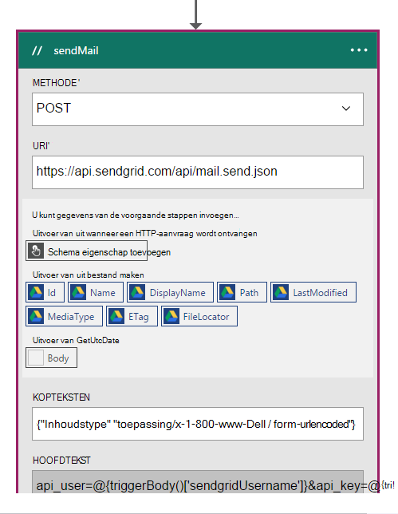
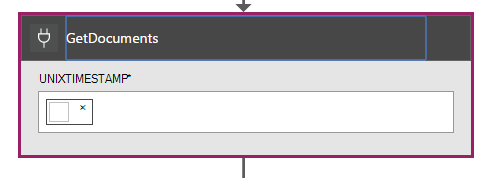

<properties 
    pageTitle="DocumentDB meldingen werken met logica Apps wijzigen | Microsoft Azure" 
    description="." 
    keywords="melding wijzigen"
    services="documentdb" 
    authors="hedidin" 
    manager="jhubbard" 
    editor="mimig" 
    documentationCenter=""/>

<tags 
    ms.service="documentdb" 
    ms.workload="data-services" 
    ms.tgt_pltfrm="na" 
    ms.devlang="rest-api" 
    ms.topic="article" 
    ms.date="09/23/2016" 
    ms.author="b-hoedid"/>

# <a name="notifications-for-new-or-changed-documentdb-resources-using-logic-apps"></a>Meldingen voor nieuwe of gewijzigde DocumentDB resources logica Apps gebruiken

In dit artikel komt over van een vraag die ik een van de community-forums van Azure DocumentDB geplaatst hebt gezien. De vraag is **DocumentDB biedt ondersteuning voor meldingen voor gewijzigde resources**?

Ik heb gewerkt met BizTalk Server jaren en dit is een zeer gebruikelijk als u de [WCF LOB-Adapter](https://msdn.microsoft.com/library/bb798128.aspx). Dus besloten ik om te zien als ik deze functionaliteit in DocumentDB voor nieuwe en/of gewijzigde documenten kan dupliceren.

Dit artikel bevat een overzicht van de onderdelen van de oplossing van de melding wijzigen, waaronder een [trigger](documentdb-programming.md#trigger) en een [Logica-App](../app-service-logic/app-service-logic-what-are-logic-apps.md). Belangrijke codefragmenten inline worden verstrekt en de volledige oplossing is beschikbaar op [GitHub](https://github.com/HEDIDIN/DocDbNotifications).

## <a name="use-case"></a>Gebruik van hoofdletters/kleine letters

Het volgende artikel is de use-case voor in dit artikel.

DocumentDB is de opslagplaats voor documenten van de servicestatus niveau zeven internationale (HL7) snel gezondheidszorg interoperabiliteit Resources (FHIR). Stel dat u dat uw database DocumentDB gecombineerd met de API en logica-App in de berekening van een HL7 FHIR-Server.  Een gezondheidszorg faciliteit is patiënten gegevens opslaat in de DocumentDB "Patiënten" database. Er zijn verschillende collecties binnen de patiënten database. Klinische, identificatie, enzovoort. Gegevens valt onder type identificatie.  U hebt een siteverzameling met de naam "Geduld".

De afdeling Cardiologische apparatuur bijhoudt persoonsgegevens heide- en oefening. Zoeken naar nieuwe of gewijzigde patiënten records is tijd in beslag nemen. Ze de IT-afdeling gevraagd als er een manier is dat ze een melding voor nieuwe of gewijzigde patiënten records kunnen ontvangen.  

De IT-afdeling zegt dat ze dit eenvoudig kunnen verlenen. Ook eigenaar zegt dat ze de documenten kunnen push met [Azure Blob Storage](https://azure.microsoft.com/services/storage/) zodat de afdeling Cardiologische apparatuur kan deze eenvoudig openen.

## <a name="how-the-it-department-solved-the-problem"></a>Hoe de IT-afdeling om het probleem opgelost

Om te maken van deze toepassing, willen de IT-afdeling deze eerst model.  Het leuke over het gebruik van Business Process Model and Notation (BPMN) is dat technische en niet-technische personen kunnen eenvoudig begrijpen deze. Dit meldingsproces hele wordt beschouwd als een bedrijfsproces. 

## <a name="high-level-view-of-notification-process"></a>Globaal overzicht gegeven van meldingen

1. U begint met een logica-App met een timer-trigger. Standaard wordt in de trigger elk uur wordt uitgevoerd.
2. U vervolgens uitvoeren een HTTP-bericht in de logica-App.
3. De App logica biedt al het werk.


### <a name="lets-take-a-look-at-what-this-logic-app-does"></a>Laten we eens kijken werking van deze App logica
Als u naar de volgende afbeelding kijken zijn er enkele stappen uitvoeren in de werkstroom LogicApp.


De stappen zijn als volgt:

1. U moet de huidige UTC-DateTime ophalen uit een API-App.  De standaardwaarde is één uur vorige.

2. De UTC-DateTime wordt geconverteerd naar een tijdstempel Unix-indeling. Dit is de standaardindeling voor tijdstempels in DocumentDB.

3. U de waarde posten naar een API-App, zoals een DocumentDB query. De waarde wordt in een query gebruikt.

    ```SQL
        SELECT * FROM Patients p WHERE (p._ts >= @unixTimeStamp)
    ```

    > [AZURE.NOTE] De _ts staat voor de metagegevens tijdstempel voor alle DocumentDB resources.

4. Als er documenten die zijn gevonden, wordt de hoofdtekst van het antwoord wordt verzonden naar uw Azure-blobopslag.

    > [AZURE.NOTE] Blobopslag vereist een Azure Storage-account. U moet inrichten van een Azure Blob storage-account en een nieuwe Blob benoemde patiënten toevoegen. Zie voor meer informatie [over Azure opslag accounts](../storage/storage-create-storage-account.md) en [aan de slag met Azure-blobopslag](../storage/storage-dotnet-how-to-use-blobs.md).

5. Ten slotte, wordt een e-mail gestuurd dat de geadresseerde van het aantal documenten die zijn gevonden krijgt. Als er geen documenten zijn gevonden, zou het e-mailbericht '0 documenten gevonden'. 

Nu dat u een idee hebt van de werking van de werkstroom, laten we eens kijken hoe u deze implementeert te nemen.

### <a name="lets-start-with-the-main-logic-app"></a>Laten we beginnen met de belangrijkste logica-App

Als u niet bekend met logica Apps bent, ze beschikbaar in de [Azure Marketplace zijn](https://portal.azure.com/)en u kunt meer informatie over deze in [Wat zijn de logica Apps?](../app-service-logic/app-service-logic-what-are-logic-apps.md)

Wanneer u een nieuwe logica-App maakt, wordt u gevraagd **Hoe wilt u starten?**

Wanneer u in het tekstvak klikt, hebt u een keuze van gebeurtenissen. Selecteer **handmatige - wanneer een HTTP-aanvraag is ontvangen** voor deze App logica, zoals hieronder wordt weergegeven.


### <a name="design-view-of-your-completed-logic-app"></a>De ontwerpweergave van de voltooide logica-App
Laten we gehandhaafd en kijkt u naar de weergave van de voltooide ontwerpen voor de logica-App DocDB heet.


Wanneer de acties in de ontwerpfunctie van de App logica bewerkt, hebt u de mogelijkheid **uitvoer** van de HTTP-aanvraag of van de vorige actie selecteren zoals wordt weergegeven in de onderstaande sendMail-actie.



Vóór elke actie in uw werkstroom, kunt u een beschikking; **Toevoegen een actie** of **een voorwaarde toevoegen** zoals wordt weergegeven in de volgende afbeelding.


Als u **een voorwaarde toevoegen**selecteert, verschijnt er met een formulier, zoals wordt weergegeven in de volgende afbeelding is uw logica invoeren.  Dit is in feite een bedrijfsregel.  Als u in een veld klikt, hebt u een keuze parameters selecteren uit de vorige actie. U kunt ook de waarden rechtstreeks invoeren.


> [AZURE.NOTE] U hebt ook de mogelijkheid om in te voeren alles in de codeweergave.

We even verder kijken bij de voltooide logica-App in de codeweergave.  

```JSON
   
    "$schema": "https://schema.management.azure.com/providers/Microsoft.Logic/schemas/2015-08-01-preview/workflowdefinition.json#",
    "actions": {
        "Conversion": {
            "conditions": [
                {
                    "dependsOn": "GetUtcDate"
                }
            ],
            "inputs": {
                "method": "post",
                "queries": {
                    "currentdateTime": "@{body('GetUtcDate')}"
                },
                "uri": "https://docdbnotificationapi-debug.azurewebsites.net/api/Conversion"
            },
            "metadata": {
                "apiDefinitionUrl": "https://docdbnotificationapi-debug.azurewebsites.net/swagger/docs/v1",
                "swaggerSource": "custom"
            },
            "type": "Http"
        },
        "Createfile": {
            "conditions": [
                {
                    "expression": "@greater(length(body('GetDocuments')), 0)"
                },
                {
                    "dependsOn": "GetDocuments"
                }
            ],
            "inputs": {
                "body": "@body('GetDocuments')",
                "host": {
                    "api": {
                        "runtimeUrl": "https://logic-apis-westus.azure-apim.net/apim/azureblob"
                    },
                    "connection": {
                        "name": "@parameters('$connections')['azureblob']['connectionId']"
                    }
                },
                "method": "post",
                "path": "/datasets/default/files",
                "queries": {
                    "folderPath": "/patients",
                    "name": "Patient_@{guid()}.json"
                }
            },
            "type": "ApiConnection"
        },
        "GetDocuments": {
            "conditions": [
                {
                    "dependsOn": "Conversion"
                }
            ],
            "inputs": {
                "method": "post",
                "queries": {
                    "unixTimeStamp": "@body('Conversion')"
                },
                "uri": "https://docdbnotificationapi-debug.azurewebsites.net/api/Patient"
            },
            "metadata": {
                "apiDefinitionUrl": "https://docdbnotificationapi-debug.azurewebsites.net/swagger/docs/v1",
                "swaggerSource": "custom"
            },
            "type": "Http"
        },
        "GetUtcDate": {
            "conditions": [],
            "inputs": {
                "method": "get",
                "queries": {
                    "hoursBack": "@{int(triggerBody()['GetUtcDate_HoursBack'])}"
                },
                "uri": "https://docdbnotificationapi-debug.azurewebsites.net/api/Authorization"
            },
            "metadata": {
                "apiDefinitionUrl": "https://docdbnotificationapi-debug.azurewebsites.net/swagger/docs/v1",
                "swaggerSource": "custom"
            },
            "type": "Http"
        },
        "sendMail": {
            "conditions": [
                {
                    "dependsOn": "GetDocuments"
                }
            ],
            "inputs": {
                "body": "api_user=@{triggerBody()['sendgridUsername']}&api_key=@{triggerBody()['sendgridPassword']}&from=@{parameters('fromAddress')}&to=@{triggerBody()['EmailTo']}&subject=@{triggerBody()['Subject']}&text=@{int(length(body('GetDocuments')))} Documents Found",
                "headers": {
                    "Content-type": "application/x-www-form-urlencoded"
                },
                "method": "POST",
                "uri": "https://api.sendgrid.com/api/mail.send.json"
            },
            "type": "Http"
        }
    },
    "contentVersion": "1.0.0.0",
    "outputs": {
        "Results": {
            "type": "String",
            "value": "@{int(length(body('GetDocuments')))} Records Found"
        }
    },
    "parameters": {
        "$connections": {
            "defaultValue": {},
            "type": "Object"
        },
        "fromAddress": {
            "defaultValue": "user@msn.com",
            "type": "String"
        },
        "toAddress": {
            "defaultValue": "XXXXX@XXXXXXX.net",
            "type": "String"
        }
    },
    "triggers": {
        "manual": {
            "inputs": {
                "schema": {
                    "properties": {},
                    "required": [],
                    "type": "object"
                }
            },
            "type": "Manual"
        }
    
```

Als u niet bekend bent met wat de verschillende secties in de code vertegenwoordigt, kunt u de documentatie [Logica App werkstroom Definition Language](http://aka.ms/logicappsdocs) weergeven.

U gebruikt een [HTTP Webhook Trigger](https://sendgrid.com/blog/whats-webhook/)voor deze werkstroom. Als u de bovenstaande code bekijkt, ziet u parameters zoals in het volgende voorbeeld.

```C#

    =@{triggerBody()['Subject']}

```

De `triggerBody()` de parameters die zijn opgenomen in de hoofdtekst van een REST posten naar de logica App REST API vertegenwoordigt. De `()['Subject']` het veld vertegenwoordigt. Alle deze parameters de JSON waaruit hoofdtekst opgemaakt. 

> [AZURE.NOTE] U kunt met behulp van een haakje Web, volledige toegang tot de koptekst en hoofdtekst van het verzoek van de trigger hebben. U wilt dat de hoofdtekst in deze toepassing.

Zoals eerder is vermeld, kunt u de ontwerpfunctie voor parameters toewijzen of dat te doen in de codeweergave.
Als u dit in de codeweergave doen, klikt u vervolgens definieert u welke eigenschappen vereisen een waarde, zoals wordt weergegeven in het volgende voorbeeld. 

```JSON

    "triggers": {
        "manual": {
            "inputs": {
            "schema": {
                "properties": {
            "Subject": {
                "type" : "String"   

            }
            },
                "required": [
            "Subject"
                 ],
                "type": "object"
            }
            },
            "type": "Manual"
        }
        }
```

Wat u doet, is een schema JSON die worden doorgegeven van de hoofdtekst van het bericht HTTP maken.
Als u wilt uw trigger fire, moet u de URL van een terugbellen.  Hier leert u hoe u deze later in deze zelfstudie te genereren.  

## <a name="actions"></a>Acties
Laten we eens kijken wat elke actie in onze App logica doet.

### <a name="getutcdate"></a>GetUTCDate

**Weergave met de ontwerpfunctie**


**Codeweergave**

```JSON

    "GetUtcDate": {
            "conditions": [],
            "inputs": {
            "method": "get",
            "queries": {
                "hoursBack": "@{int(triggerBody()['GetUtcDate_HoursBack'])}"
            },
            "uri": "https://docdbnotificationapi-debug.azurewebsites.net/api/Authorization"
            },
            "metadata": {
            "apiDefinitionUrl": "https://docdbnotificationapi-debug.azurewebsites.net/swagger/docs/v1"
            },
            "type": "Http"
        },

```

Deze actie in HTTP kunt u een GET-bewerking uitvoeren.  Deze aanroept de API APP GetUtcDate. De Uri de eigenschap gebruikt, 'GetUtcDate_HoursBack' in de hoofdtekst Trigger doorgegeven.  De waarde 'GetUtcDate_HoursBack' is ingesteld in de eerste logica-App. Verderop in deze zelfstudie leert u meer informatie over de Trigger logica-App.

Deze actie oproepen uw API-App als u wilt de UTC-datum-tekenreeks retourwaarde.

#### <a name="operations"></a>Bewerkingen

**Aanvragen**

```JSON

    {
        "uri": "https://docdbnotificationapi-debug.azurewebsites.net/api/Authorization",
        "method": "get",
        "queries": {
          "hoursBack": "24"
        }
    }

```

**Antwoord**

```JSON

    {
        "statusCode": 200,
        "headers": {
          "pragma": "no-cache",
          "cache-Control": "no-cache",
          "date": "Fri, 26 Feb 2016 15:47:33 GMT",
          "server": "Microsoft-IIS/8.0",
          "x-AspNet-Version": "4.0.30319",
          "x-Powered-By": "ASP.NET"
        },
        "body": "Fri, 15 Jan 2016 23:47:33 GMT"
    }

```

De volgende stap is het verschil met UTC DateTime-waarde converteren naar de tijdstempel Unix, dat wil een dubbele .NET-type zeggen.

### <a name="conversion"></a>Conversie

##### <a name="designer-view"></a>Weergave met de ontwerpfunctie


##### <a name="code-view"></a>Codeweergave

```JSON

    "Conversion": {
        "conditions": [
        {
            "dependsOn": "GetUtcDate"
        }
        ],
        "inputs": {
        "method": "post",
        "queries": {
            "currentDateTime": "@{body('GetUtcDate')}"
        },
        "uri": "https://docdbnotificationapi-debug.azurewebsites.net/api/Conversion"
        },
        "metadata": {
        "apiDefinitionUrl": "https://docdbnotificationapi-debug.azurewebsites.net/swagger/docs/v1"
        },
        "type": "Http"
    },

```

In deze stap geeft u in de waarde geretourneerd uit de GetUTCDate.  Er is een voorwaarde dependsOn, wat betekent dat de actie GetUTCDate moet voltooid. Als dat niet zo is, wordt deze actie is overgeslagen. 

Deze actie oproepen uw App API voor het verwerken van de conversie.

#### <a name="operations"></a>Bewerkingen

##### <a name="request"></a>Aanvragen

```JSON

    {
        "uri": "https://docdbnotificationapi-debug.azurewebsites.net/api/Conversion",
        "method": "post",
        "queries": {
        "currentDateTime": "Fri, 15 Jan 2016 23:47:33 GMT"
        }
    }   
```

##### <a name="response"></a>Antwoord

```JSON

    {
        "statusCode": 200,
        "headers": {
          "pragma": "no-cache",
          "cache-Control": "no-cache",
          "date": "Fri, 26 Feb 2016 15:47:33 GMT",
          "server": "Microsoft-IIS/8.0",
          "x-AspNet-Version": "4.0.30319",
          "x-Powered-By": "ASP.NET"
        },
        "body": 1452901653
    }
```

In de volgende actie doet u een POST-bewerking naar onze API-App.

### <a name="getdocuments"></a>GetDocuments 

##### <a name="designer-view"></a>Weergave met de ontwerpfunctie



##### <a name="code-view"></a>Codeweergave

```JSON

    "GetDocuments": {
        "conditions": [
        {
            "dependsOn": "Conversion"
        }
        ],
        "inputs": {
        "method": "post",
        "queries": {
            "unixTimeStamp": "@{body('Conversion')}"
        },
        "uri": "https://docdbnotificationapi-debug.azurewebsites.net/api/Patient"
        },
        "metadata": {
        "apiDefinitionUrl": "https://docdbnotificationapi-debug.azurewebsites.net/swagger/docs/v1"
        },
        "type": "Http"
    },

```

U gaat geven in de hoofdtekst van het antwoord van de conversie actie voor de actie GetDocuments. Dit is een parameter in de Uri:

 
```C#

    unixTimeStamp=@{body('Conversion')}

```

De actie QueryDocuments heeft een HTTP POST-bewerking bij de API-App. 

De methode met de naam is **QueryForNewPatientDocuments**.

#### <a name="operations"></a>Bewerkingen

##### <a name="request"></a>Aanvragen

```JSON

    {
        "uri": "https://docdbnotificationapi-debug.azurewebsites.net/api/Patient",
        "method": "post",
        "queries": {
        "unixTimeStamp": "1452901653"
        }
    }
```

##### <a name="response"></a>Antwoord

```JSON

    {
        "statusCode": 200,
        "headers": {
        "pragma": "no-cache",
        "cache-Control": "no-cache",
        "date": "Fri, 26 Feb 2016 15:47:35 GMT",
        "server": "Microsoft-IIS/8.0",
        "x-AspNet-Version": "4.0.30319",
        "x-Powered-By": "ASP.NET"
        },
        "body": [
        {
            "id": "xcda",
            "_rid": "vCYLAP2k6gAXAAAAAAAAAA==",
            "_self": "dbs/vCYLAA==/colls/vCYLAP2k6gA=/docs/vCYLAP2k6gAXAAAAAAAAAA==/",
            "_ts": 1454874620,
            "_etag": "\"00007d01-0000-0000-0000-56b79ffc0000\"",
            "resourceType": "Patient",
            "text": {
            "status": "generated",
            "div": "<div>\n      \n      <p>Henry Levin the 7th</p>\n    \n    </div>"
            },
            "identifier": [
            {
                "use": "usual",
                "type": {
                "coding": [
                    {
                    "system": "http://hl7.org/fhir/v2/0203",
                    "code": "MR"
                    }
                ]
                },
                "system": "urn:oid:2.16.840.1.113883.19.5",
                "value": "12345"
            }
            ],
            "active": true,
            "name": [
            {
                    "family": [
                        "Levin"
                    ],
                    "given": [
                        "Henry"
                    ]
                }
            ],
            "gender": "male",
            "birthDate": "1932-09-24",
            "managingOrganization": {
                "reference": "Organization/2.16.840.1.113883.19.5",
                "display": "Good Health Clinic"
            }
        },

```

De volgende actie is de documenten opslaan op de [opslag van Azure-Blog](https://azure.microsoft.com/services/storage/). 

> [AZURE.NOTE] Blobopslag vereist een Azure Storage-account. U moet inrichten van een Azure Blob storage-account en een nieuwe Blob benoemde patiënten toevoegen. Zie [aan de slag met Azure-blobopslag](../storage/storage-dotnet-how-to-use-blobs.md)voor meer informatie.

### <a name="create-file"></a>Bestand maken

##### <a name="designer-view"></a>Weergave met de ontwerpfunctie


##### <a name="code-view"></a>Codeweergave

```JSON

    {
    "host": {
        "api": {
            "runtimeUrl": "https://logic-apis-westus.azure-apim.net/apim/azureblob"
        },
        "connection": {
            "name": "subscriptions/fxxxxxc079-4e5d-b002-xxxxxxxxxx/resourceGroups/Api-Default-Central-US/providers/Microsoft.Web/connections/azureblob"
        }
    },
    "method": "post",
    "path": "/datasets/default/files",
    "queries": {
        "folderPath": "/patients",
        "name": "Patient_17513174-e61d-4b56-88cb-5cf383db4430.json"
    },
    "body": [
        {
            "id": "xcda",
            "_rid": "vCYLAP2k6gAXAAAAAAAAAA==",
            "_self": "dbs/vCYLAA==/colls/vCYLAP2k6gA=/docs/vCYLAP2k6gAXAAAAAAAAAA==/",
            "_ts": 1454874620,
            "_etag": "\"00007d01-0000-0000-0000-56b79ffc0000\"",
            "resourceType": "Patient",
            "text": {
                "status": "generated",
                "div": "<div>\n      \n      <p>Henry Levin the 7th</p>\n    \n    </div>"
            },
            "identifier": [
                {
                    "use": "usual",
                    "type": {
                        "coding": [
                            {
                                "system": "http://hl7.org/fhir/v2/0203",
                                "code": "MR"
                            }
                        ]
                    },
                    "system": "urn:oid:2.16.840.1.113883.19.5",
                    "value": "12345"
                }
            ],
            "active": true,
            "name": [
                {
                    "family": [
                        "Levin"
                    ],
                    "given": [
                        "Henry"
                    ]
                }
            ],
            "gender": "male",
            "birthDate": "1932-09-24",
            "managingOrganization": {
                "reference": "Organization/2.16.840.1.113883.19.5",
                "display": "Good Health Clinic"
            }
        },

```

De code is gegenereerd op basis van de actie in de ontwerpfunctie. U hoeft niet te wijzigen van de code.

Als u niet bekend bent met de Azure Blob-API gebruiken, raadpleegt u [aan de slag met Azure-blobopslag API](../connectors/connectors-create-api-azureblobstorage.md).

#### <a name="operations"></a>Bewerkingen

##### <a name="request"></a>Aanvragen

```JSON

    "host": {
        "api": {
            "runtimeUrl": "https://logic-apis-westus.azure-apim.net/apim/azureblob"
        },
        "connection": {
            "name": "subscriptions/fxxxxxc079-4e5d-b002-xxxxxxxxxx/resourceGroups/Api-Default-Central-US/providers/Microsoft.Web/connections/azureblob"
        }
    },
    "method": "post",
    "path": "/datasets/default/files",
    "queries": {
        "folderPath": "/patients",
        "name": "Patient_17513174-e61d-4b56-88cb-5cf383db4430.json"
    },
    "body": [
        {
            "id": "xcda",
            "_rid": "vCYLAP2k6gAXAAAAAAAAAA==",
            "_self": "dbs/vCYLAA==/colls/vCYLAP2k6gA=/docs/vCYLAP2k6gAXAAAAAAAAAA==/",
            "_ts": 1454874620,
            "_etag": "\"00007d01-0000-0000-0000-56b79ffc0000\"",
            "resourceType": "Patient",
            "text": {
                "status": "generated",
                "div": "<div>\n      \n      <p>Henry Levin the 7th</p>\n    \n    </div>"
            },
            "identifier": [
                {
                    "use": "usual",
                    "type": {
                        "coding": [
                            {
                                "system": "http://hl7.org/fhir/v2/0203",
                                "code": "MR"
                            }
                        ]
                    },
                    "system": "urn:oid:2.16.840.1.113883.19.5",
                    "value": "12345"
                }
            ],
            "active": true,
            "name": [
                {
                    "family": [
                        "Levin"
                    ],
                    "given": [
                        "Henry"
                    ]
                }
            ],
            "gender": "male",
            "birthDate": "1932-09-24",
            "managingOrganization": {
                "reference": "Organization/2.16.840.1.113883.19.5",
                "display": "Good Health Clinic"
            }
        },….


```

##### <a name="response"></a>Antwoord

```JSON

    {
        "statusCode": 200,
        "headers": {
        "pragma": "no-cache",
        "x-ms-request-id": "2b2f7c57-2623-4d71-8e53-45c26b30ea9d",
        "cache-Control": "no-cache",
        "date": "Fri, 26 Feb 2016 15:47:36 GMT",
        "set-Cookie": "ARRAffinity=29e552cea7db23196f7ffa644003eaaf39bc8eb6dd555511f669d13ab7424faf;Path=/;Domain=127.0.0.1",
        "server": "Microsoft-HTTPAPI/2.0",
        "x-AspNet-Version": "4.0.30319",
        "x-Powered-By": "ASP.NET"
        },
        "body": {
        "Id": "0B0nBzHyMV-_NRGRDcDNMSFAxWFE",
        "Name": "Patient_47a2a0dc-640d-4f01-be38-c74690d085cb.json",
        "DisplayName": "Patient_47a2a0dc-640d-4f01-be38-c74690d085cb.json",
        "Path": "/Patient/Patient_47a2a0dc-640d-4f01-be38-c74690d085cb.json",
        "LastModified": "2016-02-26T15:47:36.215Z",
        "Size": 65647,
        "MediaType": "application/octet-stream",
        "IsFolder": false,
        "ETag": "\"c-g_a-1OtaH-kNQ4WBoXLp3Zv9s/MTQ1NjUwMTY1NjIxNQ\"",
        "FileLocator": "0B0nBzHyMV-_NRGRDcDNMSFAxWFE"
        }
    }
```

De laatste stap is een e-mailbericht verzenden

### <a name="sendemail"></a>sendEmail

##### <a name="designer-view"></a>Weergave met de ontwerpfunctie


##### <a name="code-view"></a>Codeweergave

```JSON


    "sendMail": {
        "conditions": [
        {
            "dependsOn": "GetDocuments"
        }
        ],
        "inputs": {
        "body": "api_user=@{triggerBody()['sendgridUsername']}&api_key=@{triggerBody()['sendgridPassword']}&from=@{parameters('fromAddress')}&to=@{triggerBody()['EmailTo']}&subject=@{triggerBody()['Subject']}&text=@{int(length(body('GetDocuments')))} Documents Found",
        "headers": {
            "Content-type": "application/x-www-form-urlencoded"
        },
        "method": "POST",
        "uri": "https://api.sendgrid.com/api/mail.send.json"
        },
        "type": "Http"
    }
```

In deze actie moet u een e-mailbericht verzenden.  Gebruikt u [SendGrid](https://sendgrid.com/marketing/sendgrid-services?cvosrc=PPC.Bing.sendgrib&cvo_cid=SendGrid%20-%20US%20-%20Brand%20-%20&mc=Paid%20Search&mcd=BingAds&keyword=sendgrib&network=o&matchtype=e&mobile=&content=&search=1&utm_source=bing&utm_medium=cpc&utm_term=%5Bsendgrib%5D&utm_content=%21acq%21v2%2134335083397-8303227637-1649139544&utm_campaign=SendGrid+-+US+-+Brand+-+%28English%29).   

De code voor deze is gegenereerd met behulp van een sjabloon voor logica-App en SendGrid die zich in de [101-logica-app-sendgrid Github opslagplaats](https://github.com/Azure/azure-quickstart-templates/tree/master/101-logic-app-sendgrid).
 
De HTTP-bewerking is een bericht. 

De autorisatie parameters worden in de triggereigenschappen

```JSON

    },
        "sendgridPassword": {
             "type": "SecureString"
         },
         "sendgridUsername": {
            "type": "String"
         }

        In addition, other parameters are static values set in the Parameters section of the Logic App. These are:
        },
        "toAddress": {
            "defaultValue": "XXXX@XXXX.com",
            "type": "String"
        },
        "fromAddress": {
            "defaultValue": "XXX@msn.com",
            "type": "String"
        },
        "emailBody": {
            "defaultValue": "@{string(concat(int(length(actions('QueryDocuments').outputs.body)) Records Found),'/n', actions('QueryDocuments').outputs.body)}",
            "type": "String"
        },

```

Het aantal documenten die zijn geretourneerd door de query, die '0' of meer, samen met worden kan, 'Records gevonden' is het samenvoegen van de emailBody. De rest van de parameters van de Trigger parameters worden ingesteld.

Deze actie is afhankelijk van de actie **GetDocuments** .

#### <a name="operations"></a>Bewerkingen

##### <a name="request"></a>Aanvragen
```JSON

    {
        "uri": "https://api.sendgrid.com/api/mail.send.json",
        "method": "POST",
        "headers": {
        "Content-type": "application/x-www-form-urlencoded"
        },
        "body": "api_user=azureuser@azure.com&api_key=Biz@Talk&from=user@msn.com&to=XXXX@XXXX.com&subject=New Patients&text=37 Documents Found"
    }

```

##### <a name="response"></a>Antwoord

```JSON

    {
        "statusCode": 200,
        "headers": {
        "connection": "keep-alive",
        "x-Frame-Options": "DENY,DENY",
        "access-Control-Allow-Origin": "https://sendgrid.com",
        "date": "Fri, 26 Feb 2016 15:47:35 GMT",
        "server": "nginx"
        },
        "body": {
        "message": "success"
        }
    }
```

Ten slotte wilt u mogelijk de resultaten van uw App logica zien op de Azure-Portal. Als u wilt dat doet, kunt u een parameter toevoegen naar de sectie uitvoer van.


```JSON

    "outputs": {
        "Results": {
            "type": "String",
            "value": "@{int(length(actions('QueryDocuments').outputs.body))} Records Found"
        }

```

Hiermee retourneert de dezelfde waarde die in de hoofdtekst van het e-mailbericht is verzonden. De volgende afbeelding ziet u een voorbeeld waar '29 Records gevonden'.


## <a name="metrics"></a>Aan de doelstellingen
U kunt configureren voor de belangrijkste logica-App in de portal voor controle. Hiermee kunt u de latentie uitvoeren en andere gebeurtenissen zoals weergeven in de volgende afbeelding weergeven.


## <a name="docdb-trigger"></a>DocDb-Trigger

Deze App logica is de trigger waarmee de werkstroom voor uw belangrijkste logica-App worden gestart.

De volgende afbeelding ziet de weergave Designer.


```JSON

    {
        "$schema": "https://schema.management.azure.com/providers/Microsoft.Logic/schemas/2015-08-01-preview/workflowdefinition.json#",
        "actions": {
        "Http": {
            "conditions": [],
            "inputs": {
            "body": {
                "EmailTo": "XXXXXX@XXXXX.net",
                "GetUtcDate_HoursBack": "24",
                "Subject": "New Patients",
                "sendgridPassword": "********",
                "sendgridUsername": "azureuser@azure.com"
            },
            "method": "POST",
            "uri": "https://prod-01.westus.logic.azure.com:443/workflows/12a1de57e48845bc9ce7a247dfabc887/triggers/manual/run?api-version=2015-08-01-preview&sp=%2Ftriggers%2Fmanual%2Frun&sv=1.0&sig=ObTlihr529ATIuvuG-dhxOgBL4JZjItrvPQ8PV6973c"
            },
            "type": "Http"
        }
        },
        "contentVersion": "1.0.0.0",
        "outputs": {
        "Results": {
            "type": "String",
            "value": "@{body('Http')['status']}"
        }
        },
        "parameters": {},
        "triggers": {
        "recurrence": {
            "recurrence": {
            "frequency": "Hour",
            "interval": 24
            },
            "type": "Recurrence"
        }
        }
    }

```

De Trigger is ingesteld voor een terugkeerpatroon van 24 uur. De actie is een HTTP-POST die de terugbellen-URL voor de belangrijkste logica-App wordt gebruikt. De hoofdtekst bevat de parameters die zijn opgegeven in het Schema JSON. 

#### <a name="operations"></a>Bewerkingen

##### <a name="request"></a>Aanvragen

```JSON

    {
        "uri": "https://prod-01.westus.logic.azure.com:443/workflows/12a1de57e48845bc9ce7a247dfabc887/triggers/manual/run?api-version=2015-08-01-preview&sp=%2Ftriggers%2Fmanual%2Frun&sv=1.0&sig=ObTlihr529ATIuvuG-dhxOgBL4JZjItrvPQ8PV6973c",
        "method": "POST",
        "body": {
        "EmailTo": "XXXXXX@XXXXX.net",
        "GetUtcDate_HoursBack": "24",
        "Subject": "New Patients",
        "sendgridPassword": "********",
        "sendgridUsername": "azureuser@azure.com"
        }
    }

```

##### <a name="response"></a>Antwoord

```JSON

    {
        "statusCode": 202,
        "headers": {
        "pragma": "no-cache",
        "x-ms-ratelimit-remaining-workflow-writes": "7486",
        "x-ms-ratelimit-burst-remaining-workflow-writes": "1248",
        "x-ms-request-id": "westus:2d440a39-8ba5-4a9c-92a6-f959b8d2357f",
        "cache-Control": "no-cache",
        "date": "Thu, 25 Feb 2016 21:01:06 GMT"
        }
    }
```

Nu we de API-App bekijken.

## <a name="docdbnotificationapi"></a>DocDBNotificationApi

Hoewel er verschillende bewerkingen in de app zijn, gaat u slechts drie gebruiken.

* GetUtcDate
* ConvertToTimeStamp
* QueryForNewPatientDocuments

### <a name="docdbnotificationapi-operations"></a>DocDBNotificationApi bewerkingen
We gaan de Swagger-documentatie

> [AZURE.NOTE] Als u de bewerkingen extern bellen, moet u een CORS origin waarde van toegestaan toevoegen "*" (zonder de aanhalingstekens) in de instellingen van uw App API zoals wordt weergegeven in de volgende afbeelding.


#### <a name="getutcdate"></a>GetUtcDate


#### <a name="converttotimestamp"></a>ConvertToTimeStamp


#### <a name="queryfornewpatientdocuments"></a>QueryForNewPatientDocuments


We even verder kijken de code achter deze bewerking.

#### <a name="getutcdate"></a>GetUtcDate

```C#

    /// <summary>
    /// Gets the current UTC Date value
    /// </summary>
    /// <returns></returns>
    [H ttpGet]
    [Metadata("GetUtcDate", "Gets the current UTC Date value minus the Hours Back")]
    [SwaggerOperation("GetUtcDate")]
    [SwaggerResponse(HttpStatusCode.OK, type: typeof (string))]
    [SwaggerResponse(HttpStatusCode.InternalServerError, "Internal Server Operation Error")]
    public string GetUtcDate(
       [Metadata("Hours Back", "How many hours back from the current Date Time")] int hoursBack)
    {


        return DateTime.UtcNow.AddHours(-hoursBack).ToString("r");
    }
```

Deze bewerking wordt de geeft als resultaat de huidige UTC DateTime min de waarde HoursBack.

#### <a name="converttotimestamp"></a>ConvertToTimeStamp

``` C#

        /// <summary>
        ///     Converts DateTime to double
        /// </summary>
        /// <param name="currentdateTime"></param>
        /// <returns></returns>
        [Metadata("Converts Universal DateTime to number")]
        [SwaggerResponse(HttpStatusCode.OK, null, typeof (double))]
        [SwaggerResponse(HttpStatusCode.BadRequest, "DateTime is invalid")]
        [SwaggerResponse(HttpStatusCode.InternalServerError)]
        [SwaggerOperation(nameof(ConvertToTimestamp))]
        public double ConvertToTimestamp(
            [Metadata("currentdateTime", "DateTime value to convert")] string currentdateTime)
        {
            double result;

            try
            {
                var uncoded = HttpContext.Current.Server.UrlDecode(currentdateTime);

                var newDateTime = DateTime.Parse(uncoded);
                //create Timespan by subtracting the value provided from the Unix Epoch
                var span = newDateTime - new DateTime(1970, 1, 1, 0, 0, 0, 0).ToLocalTime();

                //return the total seconds (which is a UNIX timestamp)
                result = span.TotalSeconds;
            }
            catch (Exception e)
            {
                throw new Exception("unable to convert to Timestamp", e.InnerException);
            }

            return result;
        }

```

Deze bewerking wordt het antwoord van de bewerking GetUtcDate geconverteerd naar een dubbele waarde.

#### <a name="queryfornewpatientdocuments"></a>QueryForNewPatientDocuments

```C#

        /// <summary>
        ///     Query for new Patient Documents
        /// </summary>
        /// <param name="unixTimeStamp"></param>
        /// <returns>IList</returns>
        [Metadata("QueryForNewDocuments",
            "Query for new Documents where the Timestamp is greater than or equal to the DateTime value in the query parameters."
            )]
        [SwaggerOperation("QueryForNewDocuments")]
        [SwaggerResponse(HttpStatusCode.OK, type: typeof (Task<IList<Document>>))]
        [SwaggerResponse(HttpStatusCode.BadRequest, "The syntax of the SQL Statement is incorrect")]
        [SwaggerResponse(HttpStatusCode.NotFound, "No Documents were found")]
        [SwaggerResponse(HttpStatusCode.InternalServerError, "Internal Server Operation Error")]
        // ReSharper disable once ConsiderUsingAsyncSuffix
        public IList<Document> QueryForNewPatientDocuments(
            [Metadata("UnixTimeStamp", "The DateTime value used to search from")] double unixTimeStamp)
        {
            var context = new DocumentDbContext();
            var filterQuery = string.Format(InvariantCulture, "SELECT * FROM Patient p WHERE p._ts >=  {0}",
                unixTimeStamp);
            var options = new FeedOptions {MaxItemCount = -1};


            var collectionLink = UriFactory.CreateDocumentCollectionUri(DocumentDbContext.DatabaseId,
                DocumentDbContext.CollectionId);

            var response =
                context.Client.CreateDocumentQuery<Document>(collectionLink, filterQuery, options).AsEnumerable();

            return response.ToList();
    }

```

Deze bewerking wordt de [DocumentDB.NET SDK](documentdb-sdk-dotnet.md) om de query van een document te maken. 

```C#
     CreateDocumentQuery<Document>(collectionLink, filterQuery, options).AsEnumerable();
```

De reactie van de bewerking ConvertToTimeStamp (unixTimeStamp) wordt doorgegeven. De bewerking geeft als resultaat een lijst met documenten, `IList<Document>`.

Eerder we de CallbackURL hebben besproken. Om te beginnen de werkstroom in uw belangrijkste logica-App, moet u deze via het CallbackURL bellen.

## <a name="callbackurl"></a>CallbackURL

Als u wilt uitschakelen, moet u uw Azure AD-Token.  Het kan lastig zijn om deze tokens. Ik zoek een eenvoudige methode en Jeff Hollan, die de manager van een Azure logica App programma, wordt aanbevolen de [armclient](http://blog.davidebbo.com/2015/01/azure-resource-manager-client.html) in PowerShell gebruiken.  U kunt dit de instructies te volgen installeren.

De bewerkingen die u wilt gebruiken, zijn Login en ARM API bellen.
 
Login: U dezelfde referenties gebruiken voor het aanmelden bij de Portal Azure. 

De bewerking bellen ARM Api is degene die uw CallBackURL wordt gegenereerd.

In PowerShell belt u u deze als volgt:  

```powershell

    ArmClient.exe post https://management.azure.com/subscriptions/[YOUR SUBSCRIPTION ID/resourcegroups/[YOUR RESOURCE GROUP]/providers/Microsoft.Logic/workflows/[YOUR LOGIC APP NAME/triggers/manual/listcallbackurl?api-version=2015-08-01-preview

```

Het resultaat ziet er als volgt:

```powershell

    https://prod-02.westus.logic.azure.com:443/workflows/12a1de57e48845bc9ce7a247dfabc887/triggers/manual/run?api-version=2015-08-01-prevaiew&sp=%2Ftriggers%2Fmanual%2Frun&sv=1.0&sig=XXXXXXXXXXXXXXXXXXX

```

U kunt een hulpmiddel zoals [postman](http://www.getpostman.com/) test u belangrijkste logica App zoals wordt weergegeven in de volgende afbeelding.


De volgende tabel bevat de Trigger parameters waaruit de hoofdtekst van de App DocDB Trigger logica.

Parameter | Beschrijving 
--- | --- 
GetUtcDate_HoursBack | Gebruikt voor het instellen van het aantal uren voor de begindatum worden gepland zoeken
sendgridUsername | Gebruikt voor het instellen van het aantal uren voor de begindatum worden gepland zoeken
sendgridPassword | De gebruikersnaam voor e-mail verzenden raster
Mailals | Het e-mailadres dat de e-mailmelding ontvangt
Onderwerp | Het onderwerp voor het e-mailbericht

## <a name="viewing-the-patient-data-in-the-azure-blob-service"></a>De patiënten gegevens bekijken in de service Azure Blob

Ga naar uw opslagruimte van Azure-account en selecteer BLOB's onder services zoals wordt weergegeven in de volgende afbeelding.

 

Is mogelijk om weer te geven van de patiënten blob gegevens zoals hieronder wordt weergegeven.


## <a name="summary"></a>Overzicht

In dit scenario, hebt u hebt geleerd het volgende:

* Het is mogelijk meldingen implementeren in DocumentDB.
* Met de logica Apps gebruikt, kunt u het proces automatiseren.
* Door de logica Apps gebruikt, kunt u de tijd die nodig zijn voor het leveren van een toepassing verkleinen.
* Met behulp van HTTP kunt u eenvoudig een API-App binnen een App logica gebruiken.
* U kunt eenvoudig een CallBackURL die vervangt door de HTTP luisteraar ervan af maken.
* U kunt eenvoudig aangepaste werkstromen maken met logica Apps Designer.

De sleutel is voor vooruit te plannen en modelleren van de werkstroom.

## <a name="next-steps"></a>Volgende stappen
Downloaden en gebruiken van de logica App-code die u op [Github](https://github.com/HEDIDIN/DocDbNotifications). Ik heb uitgenodigd u over de toepassing maken en wijzigingen in de cessies‑retrocessies indienen. 

Meer informatie over DocumentDB, gaat u naar het [Leerpad](https://azure.microsoft.com/documentation/learning-paths/documentdb/).
