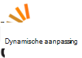

<properties
  pageTitle="DocumentDB community & nieuws | Microsoft Azure"
  description="Deelnemen aan de community Azure DocumentDB om relaties maken, presenteren van uw werk en hun vaardigheden te verbeteren."
  services="documentdb"
  documentationCenter=""
  authors="aliuy"
  manager="johnmac"
  editor="mimig"/>

<tags
  ms.service="documentdb"
  ms.devlang="na"
  ms.topic="article"
  ms.tgt_pltfrm="na"
  ms.workload="data-services"
  ms.date="09/26/2016"
  ms.author="andrl"/>

# Communityportal

## Community spotlight

Laat ons uw project promoten! Ons het prima project dat u met DocumentDB werkt waaraan weergeven en wij helpen uw genius delen met de wereld. Als u wilt verzenden van uw project, stuur ons een e-mailbericht op: [askdocdb@microsoft.com](mailto:askdocdb@microsoft.com).

### documentdb-lumenize

*door Larry Maccherone*

Aggregaties (-groeperen, draaitabel en N-dimensionaal kubus) en reeks transformaties als opgeslagen Procedures in DocumentDB afstemmen.

Het uitchecken van [Github](https://github.com/lmaccherone/documentdb-lumenize) en [npm](https://www.npmjs.com/package/lumenize).

### DocumentDB Studio

*door Ming Liu*

Een client management viewer/explorer voor DocumentDB van Microsoft Azure-service.

Het uitchecken op [Github](https://github.com/mingaliu/DocumentDBStudio).

### DoQmentDB

*door Ariel Mashraki*

DoQmentDB is een Node.js toegezegd-client, vindt u een laag MongoDB-achtige boven aan de DocumentDB.

Het uitchecken van [Github](https://github.com/a8m/doqmentdb) en [npm](https://www.npmjs.com/package/doqmentdb).

### Swagger REST API voor DocumentDB

*door Howard Edidin*

Een bestand voor DocumentDB REST API Swagger dat eenvoudig kan worden geïmplementeerd als een App-API.

Het uitchecken op [Github](https://github.com/HEDIDIN/DocumentDB-REST/tree/master/DocumentDBRestApi).

### Fluent-Plug-documentdb

*door Yoichi Kawasaki*

Fluent-Plug-documentdb is een invoegtoepassing Fluentd voor het uitvoeren van Azure DocumentDB.

Het uitchecken van [Github](https://github.com/yokawasa/fluent-plugin-documentdb) en [rubygems](https://rubygems.org/gems/fluent-plugin-documentdb).

*Meer geopende bron DocumentDB projecten op [GitHub](https://github.com/search?p=4&q=documentdb&type=Repositories)zoeken.*

## Nieuws, blogs en artikelen

U kunt de hoogte blijven van de laatste DocumentDB nieuws en functies die door de volgende [onze blog](https://azure.microsoft.com/blog/tag/documentdb/).

**Berichten van de community:**

- [**Meer doen met DocumentDB sociale**](https://blogs.msdn.microsoft.com/mvpawardprogram/2016/03/15/going-social-with-documentdb/) - *door Matias Quarantaas*

- [**UWP, Azure App Services en DocumentDB soep: een app voor het delen van foto's**](https://blogs.windows.com/buildingapps/2016/03/17/uwp-azure-app-services-and-documentdb-soup-a-photo-sharing-app/) - *door Eric Langland*

- [**Meldingen voor nieuwe of gewijzigde DocumentDB resources die werken met logica Apps**](documentdb-change-notification.md) - *door Howard Edidin*

- [**Het verzamelen van Logboeken in in Azure DocumentDB met fluent-Plug-documentdb**](http://unofficialism.info/posts/collecting-logs-into-azure-documentdb-using-fluent-plugin-documentdb/) - *door Yoichi Kawasaki*

- [**DocumentDB herzien deel 1/2 – de praktijk**](https://peterintheazuresky.wordpress.com/2016/02/19/documentdb-revisited-part-12-the-theory/) - *door Peter Mannerhult*

- [**Wat moet u al kent en hekel over van Azure DocumentDB**](http://blog.falafel.com/4-what-to-love-and-hate-about-azures-documentdb/) - *door George Saadeh*

- [**Azure DocumentDB serverzijde uitvoeren van scripts**](https://www.simple-talk.com/cloud/cloud-data/azure-documentdb-server-side-scripting/) - *door Robert Sheldon*

- [**DocumentDB als gegevens van Azure Stream analysegegevens vangen**](http://janatdevelopment.com/2015/12/11/documentdb-as-a-data-sink-for-azure-stream-analytics/?utm_source=twitterfeed&utm_medium=twitter) - *door Jan Hentschel*

- [**Azure DocumentDB in productie!** ](http://blog.nexapp.ca/2015/11/30/azure-documentdb-in-production/)  -  *door Alexandre Walsh en Marc Olivier Duval*

- [**Azure zoeken indexeerfuncties – DocumentDB query's (Spaans)**](http://www.ealsur.com.ar/wp/index.php/2015/11/19/azure-search-indexers-documentdb-queries/) - *door Matthias Quaranta*

- [**Azure DocumentDB SQL query basisbeginselen (Japans)**](http://beachside.hatenablog.com/entry/2015/12/06/000045) - *door Atsushi Yokohama*

- [**Gegevenspunten - Aurelia voldoet aan DocumentDB: Van een Matchmaker reis**](https://msdn.microsoft.com/magazine/mt620011.aspx) - *door Julie Lerman*

- [**Infrastructuur als Code en continue implementatie van een Node.js + Azure DocumentDB oplossing**](http://www.talmeida.net/blog/2015/10/26/infrastructure-as-code-and-continuous-deployment-of-a-nodejs-azure-documentdb-solution) - *door Thiago Almedia*

- [**Waarom DocumentDb goede zakelijke voor bepaalde projecten relevant**](http://www.iquestllc.com/blogs/read/405/why-documentdb-makes-good-business-sense-for-some-projects) - *door Samuel Uresin*

- [**Azure DocumentDB ontwikkeling zwevend voorwaarts – de ontwikkeling van de Client-klasse (1 van 2) (Japans)**](http://beachside.hatenablog.com/entry/2015/10/01/202734) - *door Atsushi Yokohama*

- [**Wat u nodig hebt om te weten wanneer het gebruik van Azure DocumentDB (Japans)**](http://beachside.hatenablog.com/entry/2015/10/01/202734) - *door Atsushi Yokohama*

- [**Omgaan met RequestRateTooLarge fouten in Azure DocumentDB en testen van prestaties**](http://blogs.msdn.com/b/bigdatasupport/archive/2015/09/02/dealing-with-requestratetoolarge-errors-in-azure-documentdb-and-testing-documentdb-performance.aspx) - *door Azim Sairaj*

- [**Gegevenspunten - een overzicht van Microsoft Azure DocumentDB**](https://msdn.microsoft.com/magazine/mt147238.aspx) - *door Julie Lerman*

- [**DocumentDB met F #**](https://jamessdixon.wordpress.com/2014/12/30/using-documentdb-with-f/) - *door Jan Dixon*

- [**Analyseren toepassing Logboeken met DocumentDB**](http://vincentlauzon.com/2015/09/06/analysing-application-logs-with-documentdb/) - *door Vincent-Philippe Lauzon*

- [**Azure DocumentDB – punt in tijd back-ups**](http://softwarejuancarlos.com/2015/09/06/azure-documentdb-point-in-time-backups/) - *door Juan Jeroen Sanchez*

*Hebt u een blogbericht, voorbeeld of casestudy die u wilt delen? [Laat het ons weten](mailto:askdocdb@microsoft.com)!*

## Evenementen en opnamen

### Recente en toekomstige gebeurtenissen

| De gebeurtenisnaam van de                                                                                                                 | Luidspreker                                                     | Locatie             | Datum                     | Hashtag |
| -------------------------------------------------------------------------------------------------------------------------- | ----------------------------------------------------------- | -------------------- | ------------------------ | ------- |
| [Ontbranden 2016](https://myignite.microsoft.com/sessions?q=documentdb)  [Keynote: Digitale transformatie gebruik van de rond effectiviteit van A.C.I.D met Joseph Sirosh inschakelen](https://myignite.microsoft.com/sessions/34953)  [Sessie: Azure DocumentDB op grote schaal: Customer success en een ontwerp patronen met Syam Kumar Nair en Andrew Liu](https://myignite.microsoft.com/sessions/3066)  [Sessie: IoT activa met Node.js en DocumentDB met Joshua Davis beheren](https://myignite.microsoft.com/sessions/39704)  [Sessie: Slimmer en scalable toepassingen met Microsoft Azure-Database Services Tara Jana- en Moshe Gutman maken](https://myignite.microsoft.com/sessions/2633)| Andrew Liu, Syam Kumar Nair en Tara Jana | Amsterdam, GA | September 26-30 onderneming 2016 | [#MSIgnite](https://twitter.com/MS_Ignite) |
| [Meetup bij Ignite: DocumentDB: geavanceerde functies voor grootschalige-Apps](http://www.meetup.com/Azure-in-the-ATL/events/234252070/) | Andrew Liu, Syam Kumar Nair |  Amsterdam, GA | 27 september 2016 | [#MSIgnite](https://twitter.com/MS_Ignite)[@FlatironCity](https://twitter.com/FlatironCity) |
| [Lagen + Hadoop wereld](http://conferences.oreilly.com/strata/hadoop-big-data-ny/?cmp=kn-data-confreg-home-stny16_bing_branded) | Kom Ga naar onze booth. | New York, za | September 26-29 2016 | [#StrataConf](https://twitter.com/strataconf) |
| [Groep kapitaal stad .NET-gebruikers](http://www.meetup.com/tally-dot-net/events/233768568/) | Santosh Hari | Tallahassee, UT | 3 november 2016 | n/b |

*U spreekt aan of een gebeurtenis hostingprovider? [Laat het ons weten](mailto:askdocdb@microsoft.com) hoe we u kunnen helpen!*

### Vorige evenementen en opnamen

| De gebeurtenisnaam van de                                                                                                                 | Luidspreker                                                     | Locatie             | Datum                   | Opname |
| -------------------------------------------------------------------------------------------------------------------------- | ----------------------------------------------------------- | -------------------- | ---------------------- | --------- |
| [DevTeach](http://devteach.com/) | Ken Cenerelli  | Montreal, Canada | 4-8 juli 2016 | [NoSQL, geen probleem, met Azure DocumentDB](http://www.slideshare.net/KenCenerelli) |
| [Integratie en IoT](http://www.btug.be/events) | Eldert Grootenboer | Kontich, België | 30 juni 2016 | n/b |
| [MongoDB wereld 2016](https://www.mongodb.com/world16) | Kirill Gavrylyuk | New York, New York | Juni 28-29 2016 | n/b |
| [Integratie van gebruiker groep](http://www.integrationusergroup.com/do-logic-apps-support-error-handling/) | Howard S. Edidin | Webcast | 20 juni 2016 | [Ondersteunen logica Apps foutafhandeling?](http://www.integrationusergroup.com/do-logic-apps-support-error-handling/) |
| [Meetup: Verenigd Koninkrijk Azure gebruiker groep](http://www.meetup.com/UKAzureUserGroup/events/229673468/)| Andrew Liu  | Londen, UK | 12 mei 2016 | n/b
|[Meetup: ONETUG - Gent .NET gebruiker groep](http://www.meetup.com/ONETUG/events/230797164/)| Santosh Hari| Gent, UT| 12 mei 2016| n/b 
| [SQLBits XV](https://sqlbits.com/)                                                                                         | Andrew Liu, Aravind Ramachandran                            | Liverpool, Verenigd Koninkrijk        | 4 tot en met 7 mei 2016            | n/b| 
| [Meetup: Groep tevens .NET-ontwikkelaars](http://www.meetup.com/NYC-NET-Developers/events/230396260/)                            | Leonard Lobel                                               | New York City, za    | 21 april 2016           | n/b |
| [Integratie van gebruiker groep](http://www.integrationusergroup.com/#)                                                            | Howard Edidin                                               | Webinar              | 25 april 2016           | n/b |
| [Globale Azure Bootcamp: SoCal](http://xprs.imcreator.com/free/vishalishere/gab2016)                                        | Leonard Lobel                                               | Oranje, CA           | 16 april 2016           | n/b |
| [Globale Azure Bootcamp: Redmond](https://www.eventbrite.com/e/2016-global-azure-bootcamp-redmond-wa-tickets-21387752343)   | David Makogon                                               | Amsterdam          | 16 april 2016           | n/b |
| [SQL-zaterdag #481 - Israël 2016](http://www.sqlsaturday.com/481/Sessions/Details.aspx?sid=40912)                          | Leonard Lobel                                               | HaMerkaz, Israël     | 04 april 2016         | n/b |
| [Opbouwen 2016](https://build.microsoft.com/)                                                                                 | John Macintyre                                              | San Francisco, CA    | 31 maart 2016         | [Maken van toepassingen op schaal met DocumentDB, van Azure NoSQL Document-Database](https://channel9.msdn.com/Events/Build/2016/B840)
| [SQL-zaterdag #505 - België 2016](http://www.sqlsaturday.com/505/Sessions/Details.aspx?sid=44217)                         | Mihail Mateev                                               | Antwerpen, België     | 19 maart 2016         | n/b |
| [Meetup: CloudTalk](http://www.meetup.com/CloudTalk/events/227963695/)                                                     | Kirat Pandya                                                | Bellevue, WA         | 3 maart 2016          | n/b |
| [Meetup: Azure assen](http://www.meetup.com/azureaustin/events/228209275/)                                                | Merwan Chinta                                               | Assen, TX           | 28 januari 2016       | n/b |
| [Meetup: msdevmtl](http://www.meetup.com/msdevmtl/events/223839818/)                                                       | Vincent-Philippe Lauzon                                     | Montreal, QC, Canada | 1 december 2015       | n/b |
| [Meetup: SeattleJS](http://www.meetup.com/seattlejs/events/220102664/)                                                     | David Makogon                                               | Seattle, WA          | 12 november 2015      | n/b |
| [DOORGEVEN Summit 2015](http://www.sqlpass.org/summit/2015/)                                                                    | Jeff Renz, Andrew Hoh, Aravind Ramachandran, John Macintyre | Seattle, WA          | Oktober 27-30 onderneming 2015    | [Moderne toepassingen op Azure ontwikkelen](https://www.youtube.com/watch?v=k5Z24HX-RyQ) |
| [CloudDevelop 2015](http://www.clouddevelop.org/)                                                                          | David Makogon, Joep Crawcour                                | Columbus, OH         | 23 oktober 2015       | n/b |
| [SQL-zaterdag #454 - Turijn 2015](http://www.sqlsaturday.com/454/Sessions/Details.aspx?sid=40130)                           | Macrowerkmap De Nittis                                             | Turijn, Italië         | 10 oktober 2015       | n/b |
| [SQL-zaterdag #430 - Sofia 2015](http://www.sqlsaturday.com/430/Sessions/Details.aspx?sid=36090)                           | Leonard Lobel                                               | Sofia, Bulgarije      | 10 oktober 2015       | n/b |
| [SQL-zaterdag #444 - Kansas City 2015](http://www.sqlsaturday.com/444/Sessions/Details.aspx?sid=38576)                     | Jeff Renz                                                   | Kansas City, ma      | 3 oktober 2015        | n/b |
| [SQL-zaterdag #429 - Porto georganiseerd 2015](http://www.sqlsaturday.com/429/Sessions/Details.aspx?sid=36089)                          | Leonard Lobel                                               | Porto georganiseerd, Portugal     | 3 oktober 2015        | n/b |
| [AzureCon](https://azure.microsoft.com/azurecon/)                                                                          | David Makogon, Joep Crawcour, John Macintyre                | Virtuele gebeurtenis        | 29 september 2015     | [Azure-gegevens en analyses platform](https://channel9.msdn.com/events/Microsoft-Azure/AzureCon-2015/ACON207) [Werken met gegevens van de NoSQL in DocumentDB](https://channel9.msdn.com/Events/Microsoft-Azure/AzureCon-2015/ACON338) |
| [SQL-zaterdag #434 - Holland 2015](http://www.sqlsaturday.com/434/Sessions/Details.aspx?sid=36413)                         | Leonard Lobel                                               | Utrecht, Nederland | 26 september 2015     | [Inleiding tot Azure DocumentDB](https://channel9.msdn.com/Blogs/Windows-Azure/SQL-Saturday-Holland-2015-Introduction-to-Azure-DocumentDB) |
| [SQL-zaterdag #441 - Denver 2015](http://www.sqlsaturday.com/441/Sessions/Details.aspx?sid=39191)                          | Jeff Renz                                                   | Denver, CO           | 19 september 2015     | n/b |
| [Meetup: San Francisco Bay gebied Azure ontwikkelaars](http://www.meetup.com/bayazure/events/223943785/)                        | Andrew Liu                                                  | San Francisco, CA    | 15 september 2015     | n/b |
| [Belarus Azure gebruiker groep vergaderen-omhoog](https://www.facebook.com/events/786540124800276/)                                       | Alex Zyl                                                    | Minsk, Belarus       | 9 september 2015      | [Inleiding tot DocumentDB concept overzicht, consistentie niveaus, sharding strategieën](https://www.youtube.com/watch?v=Uc_qwWzJKH8) |
| [NoSQL nu!](http://nosql2015.dataversity.net/)                                                                            | David Makogon, Joep Crawcour                                | San Jose, CA         | Augustus 18-20 2015     | n/b |
| [@ScaleSeattle](http://www.atscaleconference.com/)                                                                        | Dharma Shukla                                               | Seattle, WA          | 17 juni 2015          | [Schema Agnostic indexering met Azure DocumentDB](https://www.youtube.com/watch?v=VJQ_5qFFVP4) |
| [Technische vernieuwen 2015](https://channel9.msdn.com/Events/DXPortugal/Tech-Refresh-2015)                                         | Bruno Lopes                                                 | Lissabon, Portugal     | 15 juni 2015          | [DocumentDB 101](https://channel9.msdn.com/Events/DXPortugal/Tech-Refresh-2015/DPDEV01) |
| [SQL-zaterdag #417 - Srilankaanse 2015](http://www.sqlsaturday.com/417/Sessions/Details.aspx?sid=21415)                       | Mihail Mateev                                               | Colombo, Srilankaanse   | 06 juni 2015          | n/b |
| [Meetup: Seattle schaalbaarheid Meetup](http://www.meetup.com/Seattle-Scalability-Meetup/events/204010442/)                    | Dharma Shukla                                               | Seattle, WA          | 27 mei 2015           | n/b |
| [SQL-zaterdag #377 - Kiev 2015](http://www.sqlsaturday.com/377/Sessions/Details.aspx?sid=20322)                            | Mihail Mateev                                               | Kiev, Oekraïne        | 23 mei 2015           | n/b |
| [Database-maand](http://www.databasemonth.com/database/azure-documentdb)                                                   | Dharma Shukla                                               | New York, za         | 19 mei 2015           | [Azure DocumentDB: Sterk schaalbare, meerdere Tenant Document databaseservice](https://www.youtube.com/watch?v=iZsqBc3Dkbk) |
| [Meetup: Groep Londen SQL Server-gebruiker](http://www.meetup.com/London-SQL-Server-User-Group/events/221525058/)               | Allan Mitchell                                              | Londen, UK           | 19 mei 2015           | n/b |
| [DevIntersection](https://devintersection.com/)                                                                            | Andrew Liu                                                  | Scottsdale, AZ       | 18-21 mei 2015        | n/b |
| [Meetup: Groep voor ontwikkelaars Seattle Web App](http://www.meetup.com/Seattle-Web-App-Developers-Group/events/220591071/)       | Andrew Liu                                                  | Seattle, WA          | 14 mei 2015           | n/b |
| [Ontbranden](http://ignite.microsoft.com/)                                                                                     | Andrew Hoh, John Macintyre                                  | Chicago, IL          | 4-8 mei 2015          | [Selecteer nieuwste uit DocumentDB video](https://azure.microsoft.com/documentation/videos/microsoft-ignite-2015-select-latest-from-microsoft-azure-documentdb/) [DocumentDB en Azure HDInsight: beter samen video](https://azure.microsoft.com/documentation/videos/microsoft-ignite-2015-microsoft-azure-documentdb-and-azure-hdinsight-better-together/) |
| [Opbouwen 2015](http://www.buildwindows.com/)                                                                                 | Joep Crawcour                                               | San Francisco, CA    | 29 april - 1 mei 2015 | [Maken van de volgende groot dat met van Azure NoSQL-Service: DocumentDB](https://channel9.msdn.com/Events/Build/2015/2-729) |
| [Globale Azure Bootcamp 2015 - Spanje](http://azurebootcamp.es/)                                                             | Luis Ruiz Pavon, Roberto Gonzalez                           | Madrid, Spanje        | 25 april 2015         | [#DEAN DocumentDB Express + AngularJS + NodeJS waarop Azure](https://channel9.msdn.com/events/Developers-Spain-Events/Global-Azure-Bootcamp-2015/DEAN-DocumentDB--Express--AngularJS--NodeJS-running-on-Azure) |
| [Meetup: Azure Usergroup Denemarken](http://www.meetup.com/Azure-Usergroup-Denmark/events/221026670/)                         | Christian Holm Diget                                        | Kopenhagen  | 16 april 2015         | n/b |
| [Meetup: Charlotte Microsoft Cloud](http://www.meetup.com/Charlotte-Microsoft-Cloud/events/221503519/)                     | Jan Rance                                                 | Castricum        | 8 april 2015          | n/b |
| [SQL-zaterdag #375 - Silicon Valley 2015](http://www.sqlsaturday.com/375/Sessions/Details.aspx?sid=15289)                  | IKE Ellis                                                   | Mountain weergave, CA    | 28 maart 2015         | n/b |
| [Meetup: Istanboel Azure Meetup](http://www.meetup.com/istanbul-azure-meetup/events/220325538/)                             | Daron Yondem                                                | Istanbul, Turkije     | 7 maart 2015          | n/b |
| [Meetup: grote meren gebied .net gebruiker groep](http://www.meetup.com/Great-Lakes-Area-NET-User-Group-MIGANG/events/220364576/) | Michael Collier                                             | Southfield, MI       | 18 februari 2015      | n/b |
| [TechX Azure](https://www.youtube.com/channel/UCDRlI2E4z5qmHsBXTrFOE2Q)                                                    | Magnus Mårtensson                                           | Stockholm, Zweden    | 28-29 januari 2015    | [DocumentDB in Azure wordt aangegeven de nieuwe NoSQL optie voor de Cloud](https://www.youtube.com/watch?v=Hw7hDYoChNI) |

### Video's en Podcasts

| Weergeven                                        | Luidspreker                     | Datum               | Aflevering |
| ------------------------------------------- | --------------------------- | ------------------ | ------- |
| Kanaal 9: Microsoft + bron openen          | Jose Miguel Parrella         | 14 april 2016    | [Van gemiddelde naar DEAN in Azure wordt aangegeven met Bitnami, VM schaal Sets en DocumentDB](https://channel9.msdn.com/Blogs/Open/From-MEAN-to-DEAN-in-Azure-with-Bitnami-VM-Scale-Sets-and-DocumentDB) |
| Wired2WinWebinar                            | Sai Sankar Kunnathukuzhiyil | 9 maart 2016      | [Ontwikkelen van oplossingen met Azure DocumentDB](https://www.youtube.com/watch?v=xKttEwXv_bs)
| Integratie van gebruiker groep                      | Han Wong                    | 17 februari 2016  | [Analyseren en visualiseren van niet-relationele gegevens met DocumentDB + Power BI](http://www.integrationusergroup.com/analyze-visualize-non-relational-data-documentdb-power-bi/) |
| De Azure Podcast                           | Chaal Teeter                 | 14 januari 2016   | [Aflevering 110: Met behulp van DocumentDB zoeken](http://azpodcast.azurewebsites.net/post/Episode-110-Using-DocumentDB-Search) |
| Kanaal 9: Moderne toepassingen              | Tara Shankar Jana           | 13 december 2016  | [Een modern aanpak maken naar gegevens in uw apps](https://channel9.msdn.com/Series/Modern-Applications/Take-a-modern-approach-to-data-in-your-apps) |
| NinjaTips                                   | Miguel Quintero             | 10 december 2015  | [DocumentDB - Un vistazo algemeen](https://channel9.msdn.com/Series/Ninja-Tips/31-NinjaTips-Desarrollo-DocumentDB-1-Vistazo-general) |
| Integratie van gebruiker groep                      | Howard Edidin               | 9 november 2015   | [Azure DocumentDB voor gezondheidszorg integratie – deel 2](http://www.integrationusergroup.com/azure-documentdb-for-healthcare-integration-part-2/) |
| Integratie van gebruiker groep                      | Howard Edidin               | 5 oktober 2015    | [Azure DocumentDB voor gezondheidszorg integratie](http://www.integrationusergroup.com/?event=azure-documentdb-and-biztalk) |
| DX Italië - #TecHeroes                       | Alessandro Melchiori        | 2 oktober 2015    | [#TecHeroes - DocumentDB](https://channel9.msdn.com/Shows/TecHeroes/TecHeroes-DocumentDB) |
| Microsoft Cloud-weergeven - Podcast              | Andrew Liu                  | 30 september 2015 | [Aflevering 099 - Azure DocumentDB met Andrew Liu](http://www.microsoftcloudshow.com/podcast/Episodes/099-azure-documentdb-with-andrew-liu) |
| .NET rotsen!  -Podcast                      | Joep Crawcour               | 29 september 2015 | [Gegevens op DocumentDB met Flip CrawCour](https://www.dotnetrocks.com/?show=1197) |
| Gegevens die worden aangeboden                                | Joep Crawcour               | 28 september 2015 | [Wat is er nieuw met Azure DocumentDB sinds GA](https://channel9.msdn.com/Shows/Data-Exposed/Whats-New-with-Azure-DocumentDB-Since-GA) |
| De Azure Podcast                           | Chaal Teeter                 | 17 september 2015 | [Aflevering 94: azpodcast.com opnieuw-architectuur](http://azpodcast.azurewebsites.net/post/Episode-94-azpodcastcom-re-architecture) |
| Omslag van de cloud                                 | Joep Crawcour               | 4 september 2015  | [Aflevering 185: DocumentDB wordt bijgewerkt met Flip CrawCour](https://channel9.msdn.com/Shows/Cloud+Cover/Episode-185-DocDB-Updates-with-Ryan-CrawCour) |
| CodeChat 033                                | Greg Doerr                  | 28 juli 2015      | [Greg Doerr op Azure DocumentDB](https://channel9.msdn.com/Shows/codechat/033) |
| NoSql centraal                               | Koning Wilder                 | 25 mei 2015       | [Tracker voor Golf - een video-overzicht over het maken van een webtoepassing boven aan de AngularJS, WebApi 2 en DocumentDB.](http://www.nosqlcentral.net/Story/Details/videos/kahanu/1-documentdb-golf-tracker-overview) |
| In het geheugen technologieën keer virtuele hoofdstuk | Stephen Baron.               | 25 mei 2015       | [Hallo DocumentDB](https://www.youtube.com/watch?v=itFXQCd9-dI) |
| Gegevens die worden aangeboden                                | Joep Crawcour               | 8 april 2015      | [Algemene beschikbaarheid DocumentDB en wat is er nieuw!](https://channel9.msdn.com/Shows/Data-Exposed/DocumentDB-General-Availability-and-Whats-New) |
| Gegevens die worden aangeboden                                | Andrew Liu                  | 17 maart 2015     | [Java SDK voor DocumentDB](https://channel9.msdn.com/Shows/Data-Exposed/Java-SDK-for-DocumentDB) |
| #DevHangout                                 | Gustavo Alzate Sandoval     | 11 maart 2015     | [DocumentDB, la baseren de datos NoSql de Microsoft Azure](https://www.youtube.com/watch?v=8Ud3jB8KOBA) |
| Gegevens architectuur virtuele hoofdstuk keer      | IKE Ellis                   | 25 februari 2015  | [Inleiding tot DocumentDB](https://www.youtube.com/watch?v=7BQYdFUkz6s) |

### Online klassen

| Learning partner                                                                                                                                                                      | Beschrijving |
| ------------------------------------------------------------------------------------------------------------------------------------------------------------------------------------- | ----------- |
|  | [**Microsoft Virtual Academy**](https://mva.microsoft.com/en-US/training-courses/deploying-web-apps-to-azure-app-service-16629) biedt u training van de personen die u helpen Azure DocumentDB maken. |
|                                                       | [**Pluralsight**](http://www.pluralsight.com/courses/azure-documentdb-introduction) is een belangrijke Microsoft-partner Azure training aanbod. Als u een MSDN-abonnee bent, gebruikt u de voordelen van uw voor toegang tot Microsoft Azure-training. |
|                                                  | [**OpsGility**](https://www.opsgility.com/courses/player/introduction_to_azure_documentdb) biedt uitgebreide technische training op Microsoft Azure. Krijgen docent training ter plaatse of via een externe klaslokaal door hun trainers industrie bevestigd. |

## Discussie

### Twitter

Volg ons op twitter [@DocumentDB](https://twitter.com/DocumentDB) en up-to-date houden met de meest recente gesprek op het hashtag [#DocumentDB](https://twitter.com/hashtag/DocumentDB) .

### Online forums

| Forum-provider                                                                                                                  | Beschrijving |
| ------------------------------------------------------------------------------------------------------------------------------- | ----------- |
|  | Een taal-onafhankelijke bewerkt samen vraag en answer site voor programmeurs. Onze tag volgen: [azure-documentdb](http://stackoverflow.com/questions/tagged/azure-documentdb) |
|                                 | Een goede locatie voor ondersteuning en feedback over Microsoft Azure-functies en services zoals websites, DocumentDB, enzovoort. |

## Neem contact op met het team

Hebt u technische ondersteuning nodig? Hebt u vragen? Wilt u weten of NoSQL een goede geschikte optie voor u is? U kunt [een chatsessie 1:1 rechtstreeks met het technische team DocumentDB planning](http://www.askdocdb.com/). U kunt ook maakt u ons een [e-mail](mailto:askdocdb@microsoft.com) of tweet ons op [@DocumentDB](https://twitter.com/DocumentDB). 

## Bron openen projecten

Deze projecten worden actief ontwikkeld door het team Azure DocumentDB in samenwerking met onze community bron openen.

### SDK 's

| Platform | Github                                                                      | Pakket |
| -------- | --------------------------------------------------------------------------- | ------- |
| Node.js  | [Azure-documentdb-knooppunt](https://github.com/Azure/azure-documentdb-node)     | [npm](https://www.npmjs.com/package/documentdb) |
| Java     | [Azure-documentdb-java](https://github.com/Azure/azure-documentdb-java)     | [Maven](http://search.maven.org/#search%7Cga%7C1%7Ca%3A%22azure-documentdb%22) |
| Python   | [Azure-documentdb-python](https://github.com/Azure/azure-documentdb-python) | [PyPI](https://pypi.python.org/pypi/pydocumentdb) |

### Andere projecten

| Naam                | Github                                                                                            | Website |
| ------------------- | ------------------------------------------------------------------------------------------------- | ------- |
| Documentatie       | [Azure-inhoud](https://github.com/Azure/azure-content/tree/master/articles/documentdb)           | [Documentatie-website](https://azure.microsoft.com/documentation/services/documentdb/) |
| Hadoop-Connector    | [Azure-documentdb-hadoop](https://github.com/Azure/azure-documentdb-hadoop)                       | [Maven](http://search.maven.org/#search%7Cga%7C1%7Ca%3A%22azure-documentdb-hadoop%22) |
| Hulpprogramma voor migratie van gegevens | [Azure-documentdb-datamigrationtool](https://github.com/Azure/azure-documentdb-datamigrationtool) | [Microsoft Downloadcentrum](http://www.microsoft.com/en-us/download/details.aspx?id=46436) |

## DocumentDB Wizards

DocumentDB Wizards zijn community's die u hebt heeft een voorbeelden betrokkenheid getoond om te helpen die anderen u betere ervaring met Azure DocumentDB optimaal. Ze delen hun uitzonderlijke passie, concrete kennis en technische kennis kunnen met de community en met het team DocumentDB.

Wizard | Afbeelding 
 --- | --- 
 [Allan Mitchell](https://twitter.com/allansqlis) |  
 [Jen beugel](https://twitter.com/jenstirrup) |             
 [Lenni Lobel](https://twitter.com/lennilobel) |  |          
 [Mihail Mateev](https://twitter.com/mihailmateev) |  |
 [Larry Maccherone](https://twitter.com/lmaccherone) |  
 [Howard Edidin](https://twitter.com/hsedidin) |  
 [Santosh Hari](https://twitter.com/_s_hari) |  

Wilt u de Wizard van een DocumentDB worden? Er is geen referentiemateriaal voor dat u de Wizard van een DocumentDB, de criteria die we evalueren zijn onder meer de gevolgen van de vastgoedbevaks bijdragen aan online forums zoals StackOverflow en MSDN; Wiki's en online-inhoud; vergaderingen en gebruikersgroepen; Podcasts, websites, blogs en sociale media; en artikelen en boeken. U kunt uzelf of aan iemand anders benoemen door het [verzenden van een e-mailbericht](mailto:askdocdb@microsoft.com).
