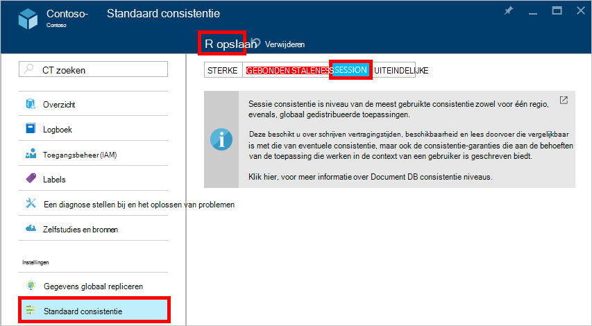

<properties
    pageTitle="Consistentie niveaus in DocumentDB | Microsoft Azure"
    description="DocumentDB heeft vier consistentie niveaus om te helpen balance '-eventuele consistentie, beschikbaarheid en latentie-voor-en nadelen."
    keywords="uiteindelijke consistentie, documentdb, azure, Microsoft azure"
    services="documentdb"
    authors="syamkmsft"
    manager="jhubbard"
    editor="cgronlun"
    documentationCenter=""/>

<tags
    ms.service="documentdb"
    ms.workload="data-services"
    ms.tgt_pltfrm="na"
    ms.devlang="na"
    ms.topic="article"
    ms.date="08/24/2016"
    ms.author="syamk"/>

# Consistentie niveaus in DocumentDB

Azure DocumentDB is ontworpen helemaal omhoog met globale kwadraatverdeling mee. Dit is bedoeld voor het aanbieden van overzichtelijk lage latentie garanties, een 99,99% beschikbaarheid SLA en meerdere goed gedefinieerde beperkte consistentie-modellen. Op dit moment DocumentDB vindt u vier consistentie niveaus: sterke gebonden-staleness, sessie, en eventuele. Naast de **sterke** en de **uiteindelijke consistentie** modellen meest aangeboden door andere databases NoSQL DocumentDB ook biedt twee zorgvuldig gecodeerd en geoperationaliseerd consistentie modellen – **gebonden staleness** en **sessie**, en hun bruikbaarheid ten opzichte van de echte wereld gebruik gevallen heeft gevalideerd. Deze vier consistentie niveaus inschakelen gezamenlijk u goed gemotiveerde voor-en nadelen tussen consistentie, beschikbaarheid en latentie. 

## Bereik van consistentie

De granulatie van consistentie is beperkt tot een aanvraag voor één gebruiker. Een verzoek om te schrijven mogelijk overeenkomen met een invoegen, vervangen, upsert of transactie (met of zonder de uitvoering van een gekoppeld vóór of na-trigger) verwijderen. Of een verzoek om te schrijven mogelijk overeenkomen met de transacties uitvoering van een JavaScript opgeslagen procedure gebruikmaakt van meerdere documenten binnen een partition. Net als met het schrijven, is ook een transactie gelezen/query beperkt tot een aanvraag voor één gebruiker. De gebruiker mogelijk moet pagineren boven een grote resultatenset, meerdere partities die in beslag nemen, maar elke transactie is beperkt tot één pagina en served uit binnen een enkel partition lezen.

## Consistentie niveaus

U kunt een niveau van de consistentie standaard configureren op uw databaseaccount dat is van toepassing op alle siteverzamelingen (in alle databases) onder het databaseaccount van uw. Standaard wordt alle lees- en query's uitgegeven ten opzichte van de gebruiker gedefinieerde bronnen het standaard consistentie niveau is opgegeven voor de databaseaccount gebruikt. U kunt echter het niveau van de consistentie van een verzoek voor een specifieke gelezen/query Ontspanning door het opgeven van de koptekst van de aanvraag [[x-ms-consistentie-niveau]](https://msdn.microsoft.com/library/azure/mt632096.aspx) . Er zijn vier typen consistentie-niveaus ondersteund door het DocumentDB replicatie-protocol waarmee een wissen verhouding tussen garanties op specifieke consistentie en prestaties, zoals hieronder beschreven.

![DocumentDB biedt meerdere, ook (beperkte) consistentie modellen waaruit u kunt kiezen gedefinieerd][1]

**Sterke**: 

- Sterke consistentie biedt een garantie [linearizability](https://aphyr.com/posts/313-strong-consistency-models) met het lezen gegarandeerd om terug te keren van de meest recente versie van een document. 
- Sterke consistentie zorgt ervoor dat een schrijven alleen zichtbaar is nadat deze blijvend door het meeste quorum van replica's wordt toegewezen. Een schrijven is al synchroon doorgevoerd blijvend door de primaire en het quorum van secundaire servers, of deze is afgebroken. Lees altijd door de meeste quorum lezen is bevestigd, een client een niet-doorgevoerde of gedeeltelijke schrijven nooit kan zien en altijd de meest recente erkende schrijven leesbaar is gegarandeerd. 
- DocumentDB-accounts die zijn geconfigureerd voor gebruik van sterke consistentie koppelen niet meer dan één Azure regio aan hun DocumentDB-account. 
- De kosten van een gelezen bewerking ( [verzoek eenheden](documentdb-request-units.md) verbruikt) met sterke consistentie is hoger zijn dan sessie en eventuele, maar hetzelfde als gebonden staleness.
 

**Dat wordt begrensd staleness**: 

- Gebonden staleness consistentie garanties die gelezen mogelijk vertraging achter schrijven door maximaal *K* versies of voorvoegsels voor eenheden van een document of de *t* -tijdsinterval. 
- Daarom bij het kiezen van gebonden staleness, kan de "staleness" kan worden geconfigureerd op twee manieren: 
    - Aantal versies *K* van het document waarop de leest vertraging achter het schrijven
    - Tijdsinterval *t* 
- Beperkt tot staleness aanbiedingen totale globale volgorde, behalve in het venster"staleness". Opmerking dat de monotone Lees bestaat in een gebied binnen en buiten de 'staleness venster'. 
- Gebonden staleness biedt een sterker consistentie garantie dan sessie of eventuele consistentie. Globaal gedistribueerde toepassingen, wordt u aangeraden dat u gebonden staleness gebruiken voor scenario's waar u naartoe wilt sterke consistentie hebt, maar ook wilt 99,99% beschikbaarheid en lage latentie. 
- DocumentDB-accounts die zijn geconfigureerd met gebonden staleness consistentie kunnen een willekeurig aantal Azure regio's koppelen aan hun DocumentDB-account. 
- De kosten van een gelezen bewerking (RUs verbruikt) met gebonden staleness is hoger zijn dan de sessie en eventuele consistentie, maar hetzelfde als sterke consistentie.

**Sessie**: 

- In tegenstelling tot de globale consistentie databasemodellen door sterke en gebonden staleness consistentie niveaus worden aangeboden is sessie consistentie beperkt tot een clientsessie. 
- Sessie consistentie is ideaal voor alle scenario's waarin een sessie apparaat of andere gebruiker is betrokken aangezien deze garandeert monotone leest, monotone schrijven en lezen garandeert van uw eigen schrijft (RYW). 
- Sessie consistentie consistentie overzichtelijk voor een sessie en maximum lezen doorvoer terwijl de laagste latentie schrijft en leest aanbod. 
- DocumentDB-accounts die zijn geconfigureerd met sessie consistentie kunnen een willekeurig aantal Azure regio's koppelen aan hun DocumentDB-account. 
- De kosten van een gelezen bewerking (RUs verbruikt) met niveau van de consistentie sessie is minder dan sterke en gebonden staleness, maar meer dan eventuele consistentie
 

**Uiteindelijke**: 

- Uiteindelijke consistentie zorgt ervoor dat geen eventuele verdere schrijft, de replica's binnen de groep wordt uiteindelijk samenkomen. 
- Uiteindelijke consistentie is de zwakste soort consistentie waar een client de waarden die ouder zijn dan de kleuren die deze had eerder kan ophalen.
- Uiteindelijke consistentie beschikt u over de zwakste gelezen consistentie maar biedt de laagste latentie voor lezen en schrijven.
- DocumentDB-accounts die zijn geconfigureerd met eventuele consistentie kunnen een willekeurig aantal Azure regio's koppelen aan hun DocumentDB-account. 
- De kosten van een gelezen bewerking (RUs verbruikt) met de uiteindelijke consistentie niveau is de laagste van alle DocumentDB consistentie niveaus.

## Consistentie garanties

De volgende tabel wordt vastgelegd verschillende consistentie garanties overeenkomt met de vier consistentie niveaus.

| Garantie                                                         |    Sterke                                       |    Gebonden Staleness                                                                           |    Sessie                                       |    Uiteindelijke                                 |
|----------------------------------------------------------|-------------------------------------------------|------------------------------------------------------------------------------------------------|--------------------------------------------------|--------------------------------------------------|
|    **Totale globale volgorde**                                |    Ja                                          |    Ja, buiten het venster"staleness"                                                      |    Nee, gedeeltelijke "sessie" volgorde                   |    Nee                                            |
|    **Consistente voorvoegsel garantie**                       |    Ja                                          |    Ja                                                                                         |    Ja                                           |    Ja                                           |
|    **Monotone lezen**                                   |    Ja                                          |    Ja, tussen regio's buiten het venster staleness en binnen een gebied altijd.     |    Ja, voor de sessie ertoe bijdraagt                    |    Nee                                            |
|    **Monotone schrijven**                                  |    Ja                                          |    Ja                                                                                         |    Ja                                           |    Ja                                           |
|    **Lees uw schrijven**                                  |    Ja                                          |    Ja                                                                                         |    Ja (in de regio schrijven)                      |    Nee                                            |

## Het niveau van de consistentie standaard configureren

1.  Klik in de [portal van Azure](https://portal.azure.com/)in de Jumpbar, klikt u op **DocumentDB (NoSQL)**.

2. Selecteer het databaseaccount te wijzigen in het blad **DocumentDB (NoSQL)** .

3. Klik in het blad account op **consistentie standaard**.

4. In het blad **Consistentie standaard** het niveau van de nieuwe consistentie en klik op **Opslaan**.

    

## Consistentie niveaus voor query 's

De standaardinstelling voor de gebruiker gedefinieerde resources, is het niveau van de consistentie voor query's hetzelfde als het niveau van de consistentie voor lezen. De index wordt standaard synchroon bijgewerkt op elke invoegen, vervangen of verwijderen van een document aan de collectie. Hiermee worden de query's ingaan op hetzelfde niveau als het document leest consistentie. Terwijl DocumentDB geoptimaliseerd schrijven is en continue hoeveelheden document schrijft, synchroon index onderhoud en consistente query's voor ondersteunt, kunt u bepaalde siteverzamelingen als u wilt bijwerken hun index lazily kunt configureren. Fikse indexeren verdere de prestaties schrijven en is ideaal voor het bulksgewijs opname scenario's als een werkbelasting hoofdzakelijk gelezen veel.  

Modus indexeren|  Leest|  Query 's  
-------------|-------|---------
Consistente (standaard)|   Selecteren vanaf de sterke, gebonden staleness, sessie, of eventuele|    Selecteren vanaf de sterke, gebonden staleness, sessie, of eventuele|
Fikse|   Selecteren vanaf de sterke, gebonden staleness, sessie, of eventuele|    Uiteindelijke  

Als kunt gelezen aanvragen, u het niveau van de consistentie van een queryverzoek voor een specifieke verlagen door het opgeven van de koptekst van de aanvraag [x-ms-consistentie-niveau](https://msdn.microsoft.com/library/azure/mt632096.aspx) .

## Volgende stappen

Als u dit doen meer lezen over consistentie niveaus en compromissen nodig zijn wilt, raden we aan de volgende bronnen:

-   Doug Terry. Gerepliceerde consistentie van de gegevens toegelicht door middel van honkbalcompetitie (video).   
[https://www.YouTube.com/watch?v=gluIh8zd26I](https://www.youtube.com/watch?v=gluIh8zd26I)
-   Doug Terry. Gerepliceerde consistentie van de gegevens toegelicht door middel van honkbalcompetitie.   
[http://Research.Microsoft.com/pubs/157411/ConsistencyAndBaseballReport.PDF](http://research.microsoft.com/pubs/157411/ConsistencyAndBaseballReport.pdf)
-   Doug Terry. Sessie garanties met betrekking tot zwak consistente gerepliceerde gegevens.   
[http://DL.ACM.org/Citation.cfm?id=383631](http://dl.acm.org/citation.cfm?id=383631)
-   Daniel Abadi. Consistentie compromissen nodig zijn in moderne Distributed systemen databaseontwerp: Initiaal is slechts een deel van het verhaal ".   
[http://computer.org/CSDL/mags/CO/2012/02/mco2012020037-ABS.HTML](http://computer.org/csdl/mags/co/2012/02/mco2012020037-abs.html)
-   Peter Bailis, Shivaram Venkataraman, Michael J. dus, Joseph M. Hellerstein, Ion Stoica. Probabilistische gebonden Staleness (PHONE) voor praktische gedeeltelijke quorum.   
[http://vldb.org/pvldb/vol5/p776_peterbailis_vldb2012.PDF](http://vldb.org/pvldb/vol5/p776_peterbailis_vldb2012.pdf)
-   Werner Vogels. Uiteindelijke consistente - herzien.    
[http://allthingsdistributed.com/2008/12/eventually_consistent.HTML](http://allthingsdistributed.com/2008/12/eventually_consistent.html)

[1]: ./media/documentdb-consistency-levels/consistency-tradeoffs.png
