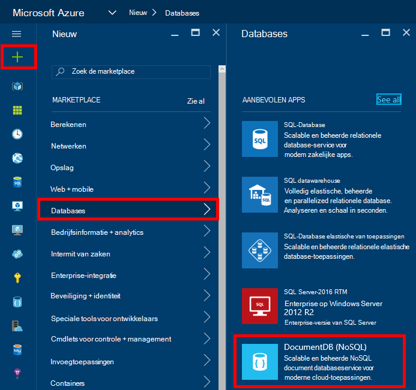
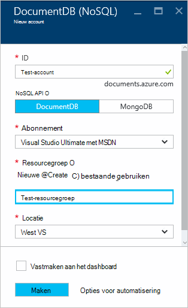
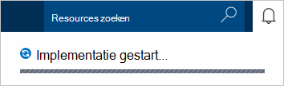
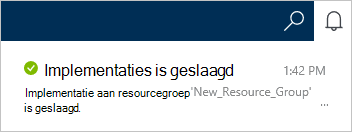
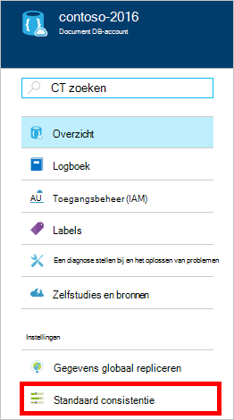
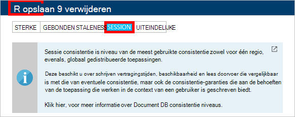

<properties
    pageTitle="Het maken van een account DocumentDB | Microsoft Azure"
    description="Een database NoSQL met Azure DocumentDB maken. Volg deze instructies om te maken van een DocumentDB-account en beginnen met het samenstellen van uw razendsnelle snelle, wereldwijde schaal NoSQL database." 
    keywords="een database maken"
    services="documentdb"
    documentationCenter=""
    authors="mimig1"
    manager="jhubbard"
    editor="monicar"/>

<tags
    ms.service="documentdb"
    ms.workload="data-services"
    ms.tgt_pltfrm="na"
    ms.devlang="na"
    ms.topic="get-started-article"
    ms.date="10/17/2016"
    ms.author="mimig"/>

# Het maken van een DocumentDB NoSQL-account met behulp van de Azure portal

> [AZURE.SELECTOR]
- [Azure-portal](documentdb-create-account.md)
- [Azure CLI en Azure resourcemanager](documentdb-automation-resource-manager-cli.md)

Als u een database maken met Microsoft Azure DocumentDB, moet u het volgende doen:

- Een Azure-account hebt. Als u nog niet hebt, kunt u een [gratis Azure-account](https://azure.microsoft.com/free) verkrijgen. 
- Maak een account DocumentDB.  

U kunt een DocumentDB-account met behulp van de Azure-portal, Azure resourcemanager sjablonen of Azure opdrachtregel-interface (CLI). In dit artikel leest hoe u een DocumentDB-account met behulp van de Azure portal maken. Zie maken van een account met behulp van Azure resourcemanager of Azure CLI [automatiseren DocumentDB database-account maken](documentdb-automation-resource-manager-cli.md).

Hebt u geen ervaring met DocumentDB? Bekijk [deze](https://azure.microsoft.com/documentation/videos/create-documentdb-on-azure/) video vier minuten door Scott Hanselman om te zien hoe u de meest voorkomende taken in de online-portal uitvoeren.

1.  Meld u aan bij de [portal van Azure](https://portal.azure.com/).
2.  In de Jumpbar, klikt u op **Nieuw**, klik op **Databases**en klik vervolgens op **DocumentDB (NoSQL)**. 

      

3. Geef in het blad **Nieuw account** op de gewenste configuratie voor het account DocumentDB.

    

    - Voer een naam voor het account DocumentDB in het vak **ID** .  Wanneer de **ID** is gevalideerd, wordt een groen vinkje weergegeven in het vak **ID** . De waarde **ID** wordt de hostnaam van de in de URI. De **ID** kan alleen kleine letters, cijfers bevatten en de '-' karakter en moet liggen tussen 3 en 50 tekens bevatten. Houd er rekening mee dat *documents.azure.com* wordt toegevoegd aan de naam van het die u kiest, het resultaat van de plaats waar uw DocumentDB account eindpunt verandert.

    - Selecteer in het vak **NoSQL API** het programmeren model gebruiken:
        - **DocumentDB**: DocumentDB om de API is beschikbaar via .NET, Java, Node.js, Python en JavaScript- [SDK's](documentdb-sdk-dotnet.md), evenals HTTP [REST](https://msdn.microsoft.com/library/azure/dn781481.aspx)en toegang tot alle DocumentDB functionaliteit biedt. 
       
        - **MongoDB**: DocumentDB ook [protocol niveau ondersteuning](documentdb-protocol-mongodb.md) biedt voor **MongoDB** API's. Als u de optie MongoDB API kiest, kunt u bestaande MongoDB SDK's en [hulpprogramma's voor](documentdb-mongodb-mongochef.md) wie u DocumentDB kunt. U kunt [verplaatsen](documentdb-import-data.md) uw bestaande MongoDB apps als u wilt gebruiken DocumentDB, met [geen codewijzigingen nodig](documentdb-connect-mongodb-account.md), en uw voordeel doen met een volledig beheerde database als een service, met onbeperkte schaal, globale herhaling en andere mogelijkheden.

    - Selecteer het Azure abonnement die u wilt gebruiken voor het account DocumentDB voor **abonnement**. Als uw account slechts één abonnement heeft, is dat account al dan niet standaard geselecteerd.

    - Selecteer in de **Resourcegroep**of een resourcegroep voor uw account DocumentDB maken.  Standaard is een nieuwe resourcegroep gemaakt. Zie [met behulp van de Azure portal als u wilt uw Azure resources beheren](../articles/azure-portal/resource-group-portal.md)voor meer informatie.

    - Met **locatie** kunt u de geografische locatie waarin u voor het hosten van uw account DocumentDB opgeven. 

4.  Nadat de nieuwe opties voor het account van DocumentDB zijn geconfigureerd, klikt u op **maken**. Om te controleren of er de status van de implementatie, schakelt u de hub meldingen.  

      

    

5.  Nadat het account DocumentDB is gemaakt, is het gereed voor gebruik met de standaardinstellingen. De standaard-consistentie van het DocumentDB-account is ingesteld op de **sessie**.  U kunt de standaard-consistentie aanpassen door te klikken op **Standaard consistentie** in het menu van de resource. Zie voor meer informatie over de consistentie niveaus aangeboden door DocumentDB, [consistentie niveaus in DocumentDB](documentdb-consistency-levels.md).

      

      

[How to: Create a DocumentDB account]: #Howto
[Next steps]: #NextSteps
[documentdb-manage]:../articles/documentdb/documentdb-manage.md

## Volgende stappen

Nu dat u een DocumentDB-account hebt, wordt de volgende stap is om een DocumentDB siteverzameling en de database te maken. 

U kunt een nieuwe siteverzameling en een database maken met behulp van een van de volgende opties:

- De Azure-portal, zoals is beschreven in [een DocumentDB verzameling met behulp van de Azure portal maken](documentdb-create-collection.md).
- De volledig zelfstudies, waaronder voorbeeldgegevens: [.NET](documentdb-get-started.md), [.NET MVC](documentdb-dotnet-application.md), [Java](documentdb-java-application.md), [Node.js](documentdb-nodejs-application.md)of [Python](documentdb-python-application.md).
- De [.NET](documentdb-dotnet-samples.md#database-examples), [Node.js](documentdb-nodejs-samples.md#database-examples)of [Python](documentdb-python-samples.md#database-examples) steekproef code beschikbaar in GitHub.
- De [.NET](documentdb-sdk-dotnet.md), [Node.js](documentdb-sdk-node.md) [Java](documentdb-sdk-java.md), [Python](documentdb-sdk-python.md)en [REST](https://msdn.microsoft.com/library/azure/mt489072.aspx) SDK's.

Na het maken van uw database en de siteverzameling, moet u [documenten toevoegen](documentdb-view-json-document-explorer.md) aan de verzamelingen.

Nadat u een verzameling documenten hebt, kunt u [DocumentDB SQL](documentdb-sql-query.md) uitvoeren van [query's](documentdb-sql-query.md#executing-queries) ten opzichte van uw documenten. U kunt query's uitvoeren met behulp van de [Query Explorer](documentdb-query-collections-query-explorer.md) in de portal, de [REST API](https://msdn.microsoft.com/library/azure/dn781481.aspx)of een van de [SDK's](documentdb-sdk-dotnet.md).

### Meer informatie

Meer informatie over DocumentDB, bekijk het volgende materiaal:

-   [Leerpad voor DocumentDB](https://azure.microsoft.com/documentation/learning-paths/documentdb/)
-   [Model met hiërarchische DocumentDB en concepten](documentdb-resources.md)
