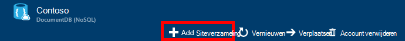

<properties 
    pageTitle="Maken van een database DocumentDB en collectie | Microsoft Azure" 
    description="Informatie over het maken van NoSQL databases en verzamelingen van JSON-document met behulp van de portal online-service voor Azure DocumentDB, document database op basis van een wolk. Een gratis proefversie vandaag krijgen." 
    services="documentdb" 
    authors="mimig1" 
    manager="jhubbard" 
    editor="monicar" 
    documentationCenter=""/>

<tags 
    ms.service="documentdb" 
    ms.workload="data-services" 
    ms.tgt_pltfrm="na" 
    ms.devlang="na" 
    ms.topic="article" 
    ms.date="10/17/2016" 
    ms.author="mimig"/>

# Het maken van een DocumentDB verzamelen en de database met behulp van de Azure-portal

Als u wilt gebruiken in Microsoft Azure DocumentDB, moet u een [DocumentDB-account](documentdb-create-account.md), een database, een siteverzameling en documenten. In dit onderwerp wordt beschreven hoe een verzameling DocumentDB maken in de portal van Azure. 

Weet u niet zeker wat een siteverzameling is? Zie [Wat is een verzameling DocumentDB?](#what-is-a-documentdb-collection)

1.  Klik in de [portal van Azure](https://portal.azure.com/)in de Jumpbar, op **DocumentDB (NoSQL)**en selecteer vervolgens het account voor het toevoegen van een siteverzameling in het blad **DocumentDB (NoSQL)** . Als u geen accounts wordt vermeld, moet u [een DocumentDB-account maken](documentdb-create-account.md).

    
    
    Als **DocumentDB (NoSQL)** niet zichtbaar zijn in de Jumpbar is, klik op **Meer Services** en klik vervolgens op **DocumentDB (NoSQL)**. Als u geen accounts wordt vermeld, moet u [een DocumentDB-account maken](documentdb-create-account.md).

2. Klik in het blad **DocumentDB account** voor het geselecteerde account, op **Siteverzameling toevoegen**.

    

3. Voer in het blad **Siteverzameling toevoegen** , klikt u in het vak **ID** , de ID voor de nieuwe verzameling. Namen van de siteverzameling moet liggen tussen 1 en 255 tekens en mogen geen bevatten `/ \ # ?` of een spatie. Wanneer de naam is gevalideerd, wordt een groen vinkje weergegeven in het vak ID.

    

4. **Prijzen laag** is standaard ingesteld op **Standard** zodat u de gegevensdoorvoer en de opslagruimte voor uw siteverzameling kunt aanpassen. Zie voor meer informatie over de prijzen laag, [prestatieniveaus in DocumentDB](documentdb-performance-levels.md).  

5. Selecteer een **modus partitionering** voor de collectie, **Één Partition** of **Partitioned**. 

    Een **enkel partition** een gereserveerde opslagcapaciteit van 10 GB heeft en doorvoer niveaus van 400-10.000 verzoek eenheden/tweede (RU/s). Eén RU overeenkomt met de doorvoer van het lezen van een document 1KB. Zie voor meer informatie over het verzoek eenheden [verzoek eenheden](documentdb-request-units.md). 

    Een **gepartitioneerde siteverzameling** kan schalen dat voor het verwerken van een onbeperkte hoeveelheid opslagruimte over meerdere partities en doorvoer niveaus beginnen bij 10,100 RU/s kan hebben. Klik in de portal de grootste opslag die kunt u reserveren is 250 GB en de meeste doorvoer die kunt u reserveren is 250.000 RU/s. Als u wilt vergroten beide quotum, een verzoek om het bestand zoals is beschreven in het [verzoek om betere DocumentDB account quota](documentdb-increase-limits.md). Zie voor meer informatie over gepartitioneerde verzamelingen [één Partition en gepartitioneerde verzamelingen](documentdb-partition-data.md#single-partition-and-partitioned-collections).

    De doorvoer voor een nieuwe één partition-verzameling is standaard ingesteld op 1000 RU/s met een opslagcapaciteit van 10 GB. Voor een gepartitioneerde verzameling, is de doorvoer siteverzameling ingesteld op 10100 RU/s met een opslagcapaciteit van 250 GB. U kunt de gegevensdoorvoer en de opslagruimte voor de collectie wijzigen nadat de verzameling is gemaakt. 

6. Als u een gepartitioneerde siteverzameling maakt, selecteert u de **Partition-toets** voor de siteverzameling. Voor het selecteren van de juiste partitiesleutel is belangrijk bij het maken van een siteverzameling zodat. Zie [voor partitioneren ontwerpen](documentdb-partition-data.md#designing-for-partitioning)voor meer informatie over het selecteren van een partitiesleutel.

7. Een nieuwe database maken of een bestaande eigenschap te gebruiken in het blad **Database** . Databasenamen moet liggen tussen 1 en 255 tekens en mogen geen bevatten `/ \ # ?` of een spatie. De naam valideren, klikt u buiten het tekstvak. Wanneer de naam is gevalideerd, wordt een groen vinkje weergegeven in het vak.

8. Klik op **OK** onder aan het scherm om de nieuwe verzameling te maken. 

9. Nu de nieuwe siteverzameling wordt weergegeven in de lens voor **siteverzamelingen** op het blad **Overzicht** .
 
    

10. **Optioneel:** Als u wilt de doorvoer van de siteverzameling in de portal wijzigen, klikt u op **schaal** in het menu van de Resource. 

    

## Wat is een verzameling DocumentDB? 

Een verzameling is een container van JSON-documenten en de bijbehorende logica voor JavaScript-toepassing. Een verzameling is een factureerbare entiteit, waarbij de [kosten](documentdb-performance-levels.md) worden bepaald door de ingerichte doorvoer van de siteverzameling. Verzamelingen kunnen een of meer partities/servers omvatten en kunnen schalen om af te handelen vrijwel onbeperkte hoeveelheden opslag of doorvoer.

Verzamelingen worden automatisch ondergebracht in een of meer fysieke servers door DocumentDB. Wanneer u een siteverzameling maakt, kunt u de ingerichte doorvoer tussen aanvraag eenheden per seconde en een belangrijke eigenschap partition opgeven. De waarde van deze eigenschap worden door DocumentDB distributie van documenten tussen partities en route aanvragen zoals query's worden gebruikt. De waarde van de partition sleutel fungeert ook als de transactiegrens voor opgeslagen procedures en triggers. Elke siteverzameling heeft een gereserveerde hoeveelheid doorvoer specifiek aan die verzameling, die niet worden gedeeld met andere siteverzamelingen in hetzelfde account. U kunt er daarom schalen out van uw toepassing zowel opslag-en doorvoer. 

Verzamelingen is niet hetzelfde als de tabellen in relationele databases. Verzamelingen schema niet afdwingen, in feite DocumentDB schema's niet afdwingen, kunt u een database schema-vrij te geven. Daarom kunt u verschillende soorten documenten met diverse schema's opslaan in dezelfde collectie. U kunt verzamelingen gebruiken om op te slaan objecten uit één type zoals u zou met tabellen doen. Het beste model afhankelijk alleen hoe de gegevens samen in query's en transacties weergegeven.

## Andere manieren om te maken van een siteverzameling DocumentDB

Verzamelingen hoeft te worden gemaakt met behulp van de portal, kunt u deze met de [DocumentDB SDK's](documentdb-sdk-dotnet.md) en de REST API ook maken. 

- Zie voor een steekproef C#-code, in de [voorbeelden van C#-siteverzameling](documentdb-dotnet-samples.md#collection-examples). 
- Zie voor een steekproef van de code Node.js de [Node.js siteverzameling voorbeelden](documentdb-nodejs-samples.md#collection-examples).
- Zie voor een steekproef van de code Python [Python collectie voorbeelden](documentdb-python-samples.md#collection-examples).
- Zie voor een steekproef REST API, [een siteverzameling maken](https://msdn.microsoft.com/library/azure/mt489078.aspx).

## Problemen oplossen

Als **Toevoegen verzameling** is uitgeschakeld in de portal van Azure, betekent dit dat uw account momenteel is uitgeschakeld, die doorgaans optreedt wanneer u alle voordelen tegoeden voor de maand gebruikt.   

## Volgende stappen

Nu dat u een siteverzameling hebt, is de volgende stap documenten toevoegen of importeren van documenten in de siteverzameling. Wanneer u gaat naar de documenten toevoegen aan een siteverzameling, hebt u enkele mogelijkheden:

- U kunt [documenten toevoegen](documentdb-view-json-document-explorer.md) met behulp van de Verkenner Document in de portal.
- U kunt [documenten importeren en gegevens](documentdb-import-data.md) met behulp van het migratieprogramma DocumentDB gegevens, waarmee u JSON en CSV-bestanden importeren, evenals de gegevens uit SQL Server, MongoDB Azure-tabelopslag en andere siteverzamelingen DocumentDB. 
- Of u kunt documenten toevoegen met behulp van een van de [DocumentDB SDK's](documentdb-sdk-dotnet.md). DocumentDB heeft .NET, Java Python, Node.js en JavaScript-API SDK's. Zie voor voorbeelden C#-code laat zien hoe u werken met documenten met behulp van de DocumentDB .NET SDK, in de [voorbeelden van C#-document](documentdb-dotnet-samples.md#document-examples). Zie voor voorbeelden van Node.js-code laat zien hoe u werken met documenten met behulp van de DocumentDB Node.js SDK, de [Node.js document voorbeelden](documentdb-nodejs-samples.md#document-examples).

Nadat u een verzameling documenten hebt, kunt u [DocumentDB SQL](documentdb-sql-query.md) uitvoeren van [query's](documentdb-sql-query.md#executing-queries) ten opzichte van uw documenten met behulp van de [Query Explorer](documentdb-query-collections-query-explorer.md) in de portal, de [REST API](https://msdn.microsoft.com/library/azure/dn781481.aspx)of een van de [SDK's](documentdb-sdk-dotnet.md). 
