<properties 
    pageTitle="DocumentDB en Azure App Service Web Apps met behulp van een sjabloon van Azure resourcemanager implementeren | Microsoft Azure" 
    description="Leer hoe u een account DocumentDB, Azure App Service Web Apps en een voorbeeld-webtoepassing met een sjabloon van Azure resourcemanager implementeren." 
    services="documentdb, app-service\web" 
    authors="h0n" 
    manager="jhubbard" 
    editor="monicar" 
    documentationCenter=""/>

<tags 
    ms.service="documentdb" 
    ms.workload="data-services" 
    ms.tgt_pltfrm="na" 
    ms.devlang="na" 
    ms.topic="article" 
    ms.date="08/02/2016" 
    ms.author="hawong"/>

# DocumentDB en Azure App Service Web Apps met behulp van een sjabloon van Azure resourcemanager implementeren

Deze zelfstudie ziet u hoe u een sjabloon Azure Resource Manager gebruiken om te implementeren en het integreren van [Microsoft Azure DocumentDB](https://azure.microsoft.com/services/documentdb/), een [Azure-Service voor App](http://go.microsoft.com/fwlink/?LinkId=529714) -web-app en een voorbeeld-webtoepassing.

Azure resourcemanager sjablonen gebruiken, kunt u eenvoudig automatiseren de implementatie en configuratie van uw Azure resources.  Deze zelfstudie leert hoe u een webtoepassing implementeren en automatisch configureren DocumentDB-accountgegevens verbinding.

Na het voltooien van deze zelfstudie, kunt u wel de volgende vragen beantwoorden:  

-   Hoe kan ik een sjabloon Azure Resource Manager gebruiken om te implementeren en het integreren van een DocumentDB-account en een web-app in Azure App-Service?
-   Hoe kan ik een sjabloon Azure Resource Manager gebruiken om te implementeren en het integreren van een DocumentDB-account, een web-app in Web-Apps voor App-Service en een Webdeploy-toepassing?

## Vereisten voor
> [AZURE.TIP] Terwijl deze zelfstudie niet wordt ervan uitgegaan ervaring met Azure resourcemanager sjablonen of JSON dat wordt, worden moet dat u wilt wijzigen van de sjablonen voor waarnaar wordt verwezen of distributieopties, klikt u vervolgens kennis van elk van deze gebieden moeten uitgevoerd.

Voordat u de instructies in deze zelfstudie te volgen, moet u zorgen dat u het volgende hebt:

- Een Azure-abonnement. Azure is een platform op basis van abonnement.  Zie voor meer informatie over het verkrijgen van een abonnement [Koopt](https://azure.microsoft.com/pricing/purchase-options/), [Lid biedt](https://azure.microsoft.com/pricing/member-offers/)of [Gratis proefversie](https://azure.microsoft.com/pricing/free-trial/).

##Stap 1: De sjabloonbestanden downloaden ##
Laten we beginnen door te downloaden van de sjabloonbestanden die we in deze zelfstudie gebruiken.

1. Download de sjabloon [een DocumentDB-account, Web Apps, maken en implementeren van een steekproef van de toepassing demo](https://portalcontent.blob.core.windows.net/samples/DocDBWebsiteTodo.json) naar een lokale map (bijvoorbeeld C:\DocumentDBTemplates). Deze sjabloon implementeert een DocumentDB-account, een App Service web-app en een webtoepassing.  Dit wordt ook automatisch de webtoepassing verbinden met de DocumentDB-account configureren.

2. Download de sjabloon [een DocumentDB-account maken en Web Apps voorbeeld](https://portalcontent.blob.core.windows.net/samples/DocDBWebSite.json) naar een lokale map (bijvoorbeeld C:\DocumentDBTemplates). Deze sjabloon een DocumentDB-account, een App Service-web-app, implementeert en van de site toepassingsinstellingen om eenvoudig oppervlak DocumentDB verbindingsgegevens wordt wijzigen, maar is niet inbegrepen bij een webtoepassing.  

##Stap 2: De DocumentDB-account, een voorbeeld uit de App Service web app en demo-toepassing implementeren

Nu we onze eerste sjabloon implementeren.

> [AZURE.TIP] De sjabloon valideert niet dat de naam van de web-app en DocumentDB accountnaam ingevoerd onder een) geldig en b) beschikbaar zijn.  Het wordt ten zeerste aanbevolen dat u controleren of de beschikbaarheid van de namen die u opgeven wilt voordat de implementatie indienen.

1. Meld u aan bij van de [Azure-Portal](https://portal.azure.com), klik op Nieuw en zoeken naar 'sjabloonimplementatie'.
    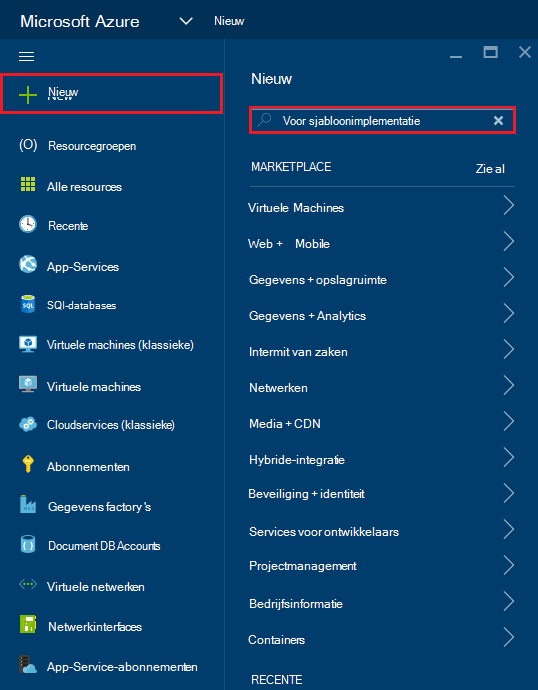

2. Selecteer het item van de implementatie van sjabloon en klik op **maken**
    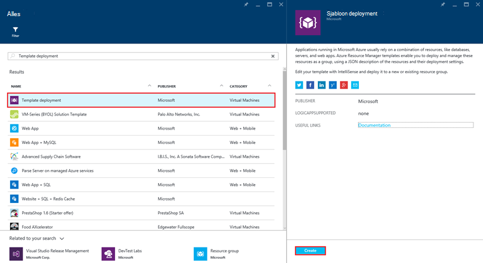

3.  Klik op **sjabloon bewerken**, de inhoud van het sjabloonbestand DocDBWebsiteTodo.json plakken en klik op **Opslaan**.
    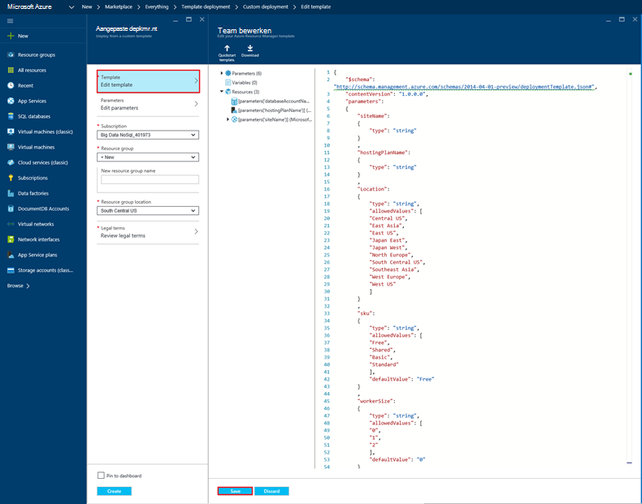

4. Klik op **bewerken van parameters**, Verstrek waarden voor elk van de verplichte parameters en klik op **OK**.  De parameters zijn als volgt:

    1. SITENAAM: Hiermee geeft u de naam van de App Service-web-app en wordt gebruikt om de URL die u gebruiken wilt voor toegang tot de WebApp maken (bijvoorbeeld als u 'mydemodocdbwebapp' opgeeft, is de URL waarmee u toegang de web-app tot altijd mydemodocdbwebapp.azurewebsites.net).

    2. HOSTINGPLANNAME: Hiermee geeft u de naam van de App Service hostingprovider wilt gaan maken.

    3. LOCATIE: Geeft de Azure waarin de DocumentDB en web app-resources maken.

    4. DATABASEACCOUNTNAME: Hiermee geeft u de naam van het account DocumentDB maken.   

    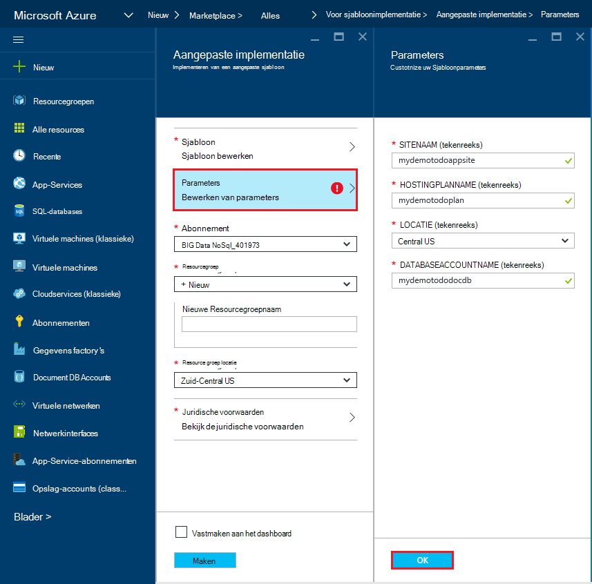

5. Kies een bestaande resourcegroep of geef een naam om een nieuwe resourcegroep te maken en kies een locatie voor de resourcegroep.
    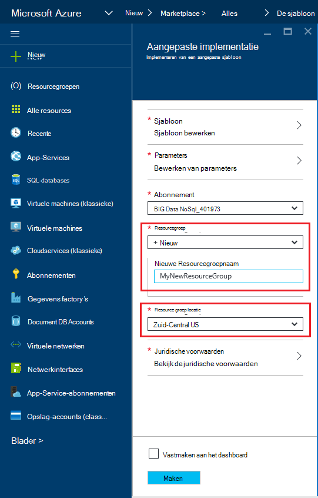
  
6.  Klik op **de juridische voorwaarden controleren**, **aanschaffen**, en klik vervolgens op **maken** om te beginnen met de implementatie.  Selecteer **vastmaken aan dashboard** zodat de resulterende implementatie gemakkelijk zichtbaar is op uw startpagina voor Azure portal is.
    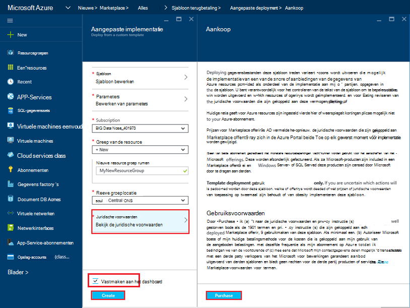

7.  Als de implementatie is voltooid, wordt het blad van de groep Resource wordt geopend.
    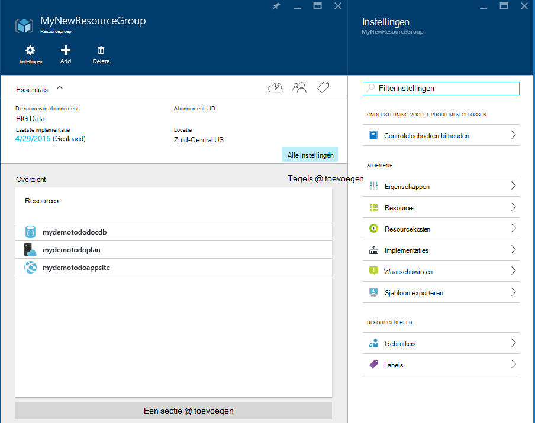  

8.  Als u wilt de toepassing gebruikt, en navigeer gewoon naar de URL van de web-app (in het bovenstaande voorbeeld wordt de URL zou http://mydemodocdbwebapp.azurewebsites.net).  Hier ziet u de volgende webtoepassing:

    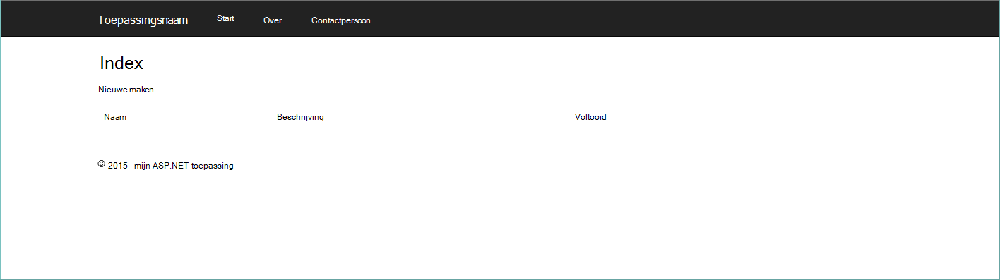

9. Verdergaan en een aantal taken maken in de web-app en Ga terug naar het blad Resource groep in de portal van Azure. Klik op de resource DocumentDB account in de lijst Resources en klik vervolgens op **Query Explorer**.
    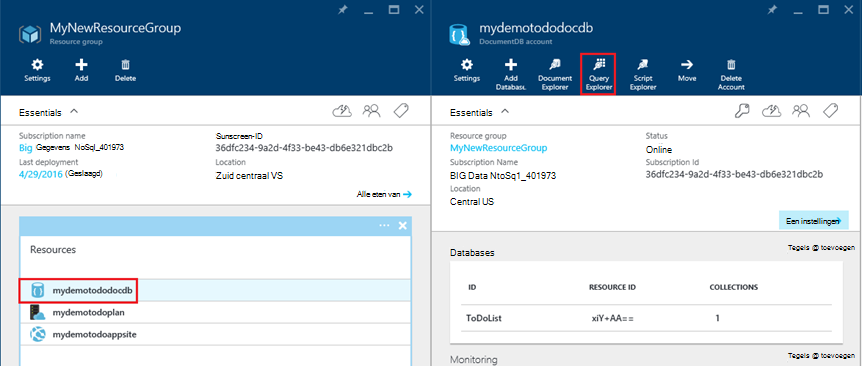  

10. De standaardquery, "SELECT *FROM c" uitvoeren en de resultaten te controleren.  Zoals u ziet dat de JSON-weergave van de items die u hebt gemaakt in stap 7 hierboven heeft opgehaald door de query.  Je mag rustig om te experimenteren met query's. bijvoorbeeld, probeer uit te voeren Selecteer* uit c WHERE c.isComplete = true om terug te keren alle taak-items die zijn gemarkeerd als voltooid.

    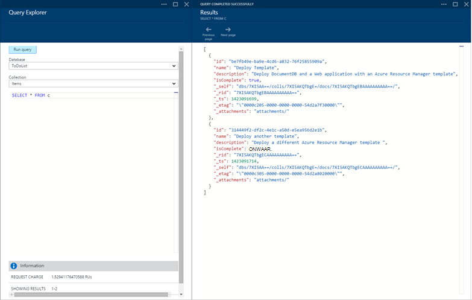

11. Je mag rustig verkennen van de portal ervaring DocumentDB of wijzigen van de steekproef doen-toepassing.  Wanneer u klaar bent, laten we een andere sjabloon te implementeren.
    
 
## Stap 3: De Document-account en web app-steekproef implementeren

Nu we onze tweede sjabloon implementeren.  Deze sjabloon is handig om weer te geven hoe u kunt invoeren DocumentDB verbindingsgegevens zoals account eindpunt en outmodel-toets in een web-app als toepassingsinstellingen of een aangepaste verbindingsreeks. Bijvoorbeeld misschien hebt u uw eigen webtoepassing die u wilt implementeren met een DocumentDB-account en de verbindingsgegevens automatisch ingevuld tijdens de implementatie hebben.

> [AZURE.TIP] De sjabloon valideert niet dat de naam van de web-app en DocumentDB accountnaam ingevoerd onder een) geldig en b) beschikbaar zijn.  Het wordt ten zeerste aanbevolen dat u controleren of de beschikbaarheid van de namen die u opgeven wilt voordat de implementatie indienen.

1. Klik in de [Portal van Azure](https://portal.azure.com)op Nieuw en zoek naar 'sjabloonimplementatie'.
    

2. Selecteer het item van de implementatie van sjabloon en klik op **maken**
    

3.  Klik op **sjabloon bewerken**, de inhoud van het sjabloonbestand DocDBWebSite.json plakken en klik op **Opslaan**.
    

4. Klik op **bewerken van parameters**, Verstrek waarden voor elk van de verplichte parameters en klik op **OK**.  De parameters zijn als volgt:

    1. SITENAAM: Hiermee geeft u de naam van de App Service-web-app en wordt gebruikt om de URL die u gebruiken wilt voor toegang tot de WebApp maken (bijvoorbeeld als u 'mydemodocdbwebapp' opgeeft, is de URL waarmee u toegang de web-app tot altijd mydemodocdbwebapp.azurewebsites.net).

    2. HOSTINGPLANNAME: Hiermee geeft u de naam van de App Service hostingprovider wilt gaan maken.

    3. LOCATIE: Geeft de Azure waarin de DocumentDB en web app-resources maken.

    4. DATABASEACCOUNTNAME: Hiermee geeft u de naam van het account DocumentDB maken.   

    

5. Kies een bestaande resourcegroep of geef een naam om een nieuwe resourcegroep te maken en kies een locatie voor de resourcegroep.
    
  
6.  Klik op **de juridische voorwaarden controleren**, **aanschaffen**, en klik vervolgens op **maken** om te beginnen met de implementatie.  Selecteer **vastmaken aan dashboard** zodat de resulterende implementatie gemakkelijk zichtbaar is op uw startpagina voor Azure portal is.
    

7.  Als de implementatie is voltooid, wordt het blad van de groep Resource wordt geopend.
      

8. Klik op het Web App-resource in de lijst Resources en klik vervolgens op **Toepassingsinstellingen**
      

9. Houd er rekening mee hoe er toepassingsinstellingen presenteren voor het eindpunt DocumentDB en de DocumentDB outmodel sleutels.
    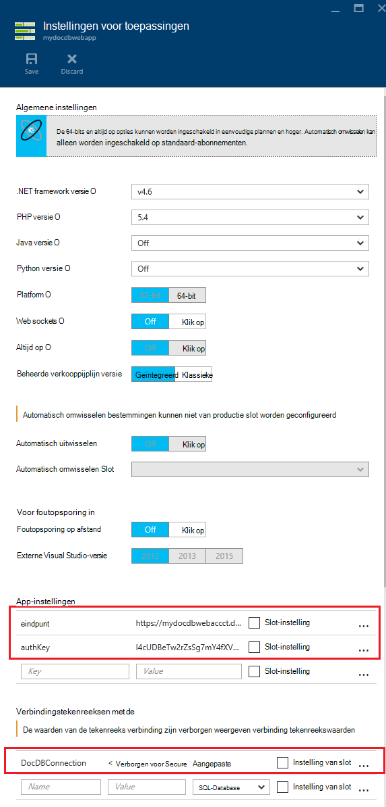  

10. Je mag rustig kunt doorgaan met het verkennen van de Portal Azure of volg een van onze DocumentDB [voorbeelden](http://go.microsoft.com/fwlink/?LinkID=402386) om uw eigen DocumentDB-toepassing te maken.

    
    

## Volgende stappen

Gefeliciteerd! U kunt DocumentDB, App Service WebApp en een voorbeeld-webtoepassing met Azure resourcemanager sjablonen hebt geïmplementeerd.

- Meer informatie over DocumentDB, klikt u op [hier](http://azure.com/docdb).
- Meer informatie over Azure App Service Web apps, klikt u op [hier](http://go.microsoft.com/fwlink/?LinkId=325362).
- Meer informatie over resourcemanager Azure-sjablonen, klikt u op [hier](https://msdn.microsoft.com/library/azure/dn790549.aspx).

## Wat er gewijzigd
* Zie voor een handleiding voor het wijzigen van Websites naar App Service: [Azure App-Service en de invloed op bestaande Azure-Services](http://go.microsoft.com/fwlink/?LinkId=529714)
* Zie voor een handleiding voor het wijzigen van de oude portal naar de nieuwe portal: [overzicht van het navigeren in de klassieke Azure-Portal](http://go.microsoft.com/fwlink/?LinkId=529715)

>[AZURE.NOTE] Als u aan de slag met Azure App Service wilt voordat u zich registreert voor een Azure-account, gaat u naar de [App-Service probeert](http://go.microsoft.com/fwlink/?LinkId=523751), waar u direct een tijdelijk starter in de browser in de App-Service maken kunt. Geen creditcards vereist; geen verplichtingen.
 
