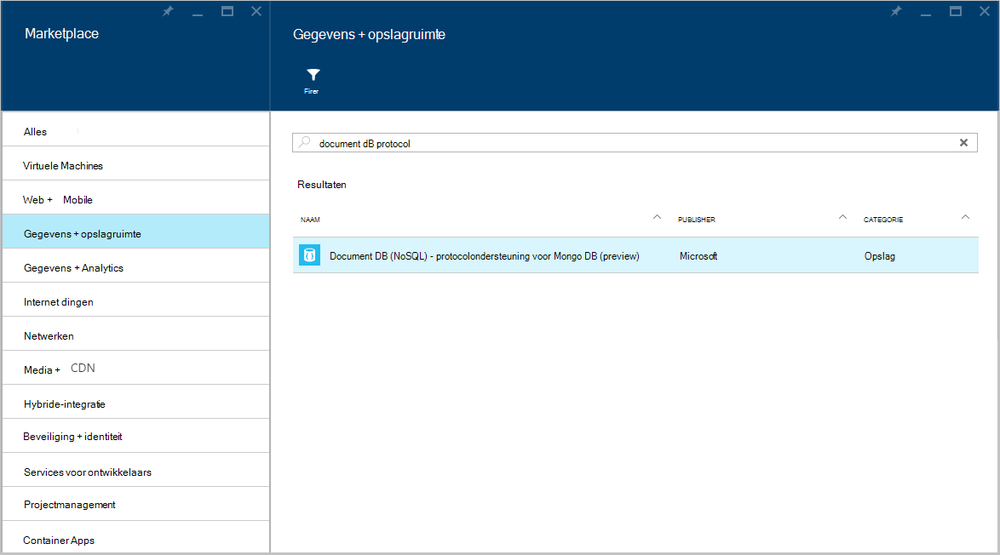
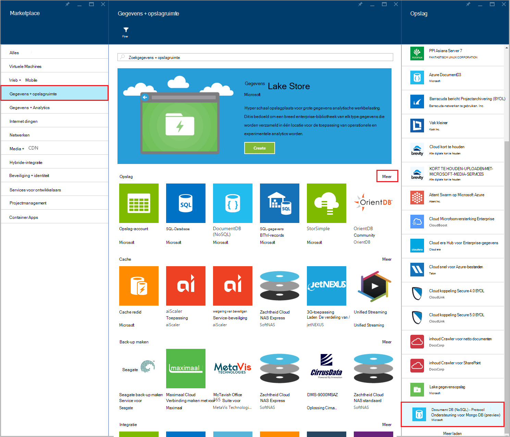
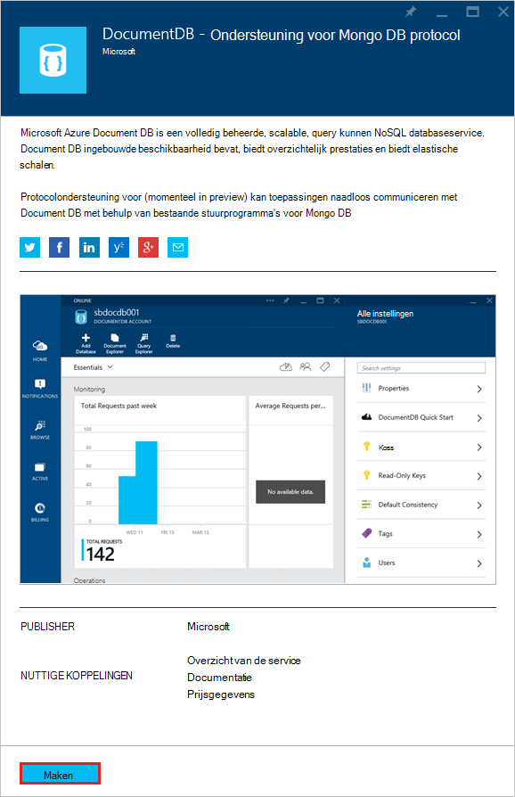
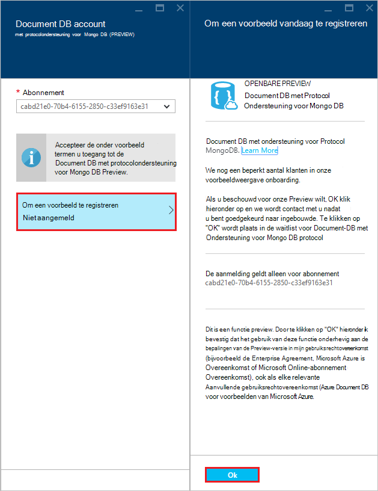
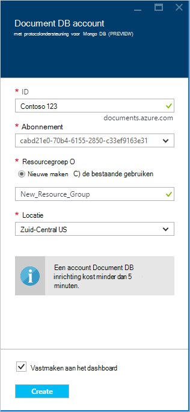
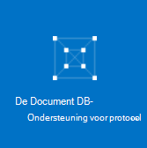
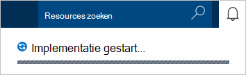
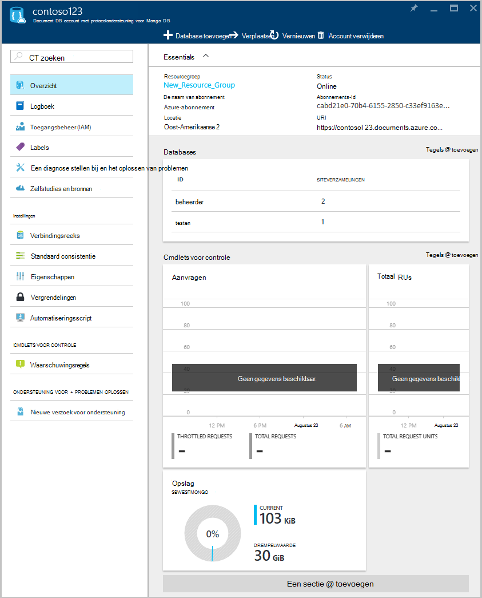

<properties 
    pageTitle="Een DocumentDB-account maken met de ondersteuning van protocol voor MongoDB | Microsoft Azure" 
    description="Leer hoe u een DocumentDB-account maken met de ondersteuning van protocol voor MongoDB, nu beschikbaar voor de Preview-versie." 
    services="documentdb" 
    authors="AndrewHoh" 
    manager="jhubbard" 
    editor="" 
    documentationCenter=""/>

<tags 
    ms.service="documentdb" 
    ms.workload="data-services" 
    ms.tgt_pltfrm="na" 
    ms.devlang="na" 
    ms.topic="article" 
    ms.date="10/20/2016" 
    ms.author="anhoh"/>

# Het maken van een account DocumentDB met protocolondersteuning voor MongoDB met behulp van de Azure portal

Als u wilt een DocumentDB Azure-account maken met de ondersteuning van protocol voor MongoDB, moet u het volgende doen:

- Een Azure-account hebt. Als u nog niet hebt, kunt u een [gratis Azure-account](https://azure.microsoft.com/free/) verkrijgen.

## Het account maken  

Als u wilt een DocumentDB-account maken met de ondersteuning van protocol voor MongoDB, moet u de volgende stappen uitvoeren.

1. In een nieuw venster, meld u aan bij de [Portal van Azure](https://portal.azure.com).
2. Klik op **Nieuw**op **gegevens + opslagruimte**, klikt u op **Alle bekijken**en zoek naar de categorie **gegevens + opslagruimte** voor 'DocumentDB protocol'. Klik op **DocumentDB - protocolondersteuning voor MongoDB**.

    

3. U kunt ook in de categorie **gegevens + opslagruimte** onder **opslag**, klikt u op **meer**, en klik op **meer laden** een of meer malen om **DocumentDB - protocolondersteuning voor MongoDB**weer te geven. Klik op **DocumentDB - protocolondersteuning voor MongoDB**.

    

4. Klik op **maken** om het aanmeldingsproces preview starten in het blad **DocumentDB - protocolondersteuning voor MongoDB (preview)** .

    

5. Klik in het blad **DocumentDB account** op **om een voorbeeld te registreren**. Lees de informatie en klik vervolgens op **OK**.

    

6.  Nadat de bepalingen van de Preview-versie is geaccepteerd, keert u terug naar het blad maken.  Geef in het blad **DocumentDB account** op de gewenste configuratie voor het account.

    

    - Voer een naam voor het account in het vak **ID** .  Wanneer de **ID** is gevalideerd, wordt een groen vinkje weergegeven in het vak **ID** . De waarde **ID** wordt de hostnaam van de in de URI. De **ID** kan alleen kleine letters, cijfers bevatten en de '-' karakter en moet liggen tussen 3 en 50 tekens bevatten. Houd er rekening mee dat *documents.azure.com* wordt toegevoegd aan de naam van het die u kiest, het resultaat van de plaats waar uw account-eindpunt worden.

    - Selecteer het Azure abonnement die u wilt gebruiken voor het account voor **abonnement**. Als uw account slechts één abonnement heeft, is dat account al dan niet standaard geselecteerd.

    - Selecteer in de **Resourcegroep**of een resourcegroep voor het account maken.  Standaard wordt een bestaande resourcegroep onder het Azure abonnement gekozen.  U kan echter kiezen om te selecteren om te maken van een nieuwe resourcegroep waaraan u wilt toevoegen van het account. Zie [met behulp van de Azure portal als u wilt uw Azure resources beheren](resource-group-portal.md)voor meer informatie.

    - Met **locatie** kunt u opgeven van de geografische locatie waarin u voor het hosten van het account.
    
    - Optioneel: Selectievakje **vastmaken aan het dashboard**. Als vastgemaakt aan dashboard, volgt u **stap 8** hieronder om uw nieuwe account linkernavigatievenster weer te geven.

7.  Nadat het nieuwe accountopties zijn geconfigureerd, klikt u op **maken**.  Het kan enkele minuten duren om het account te maken.  Als vastgemaakt aan het dashboard, kunt u de inrichten voortgang van de Startboard kunt controleren.  
      

    Als u niet vastgemaakt aan het dashboard, kunt u de voortgang van de hub meldingen kunt controleren.  

      

    

8.  Voor toegang tot uw nieuwe account op **DocumentDB (NoSQL)** in het menu van de linkerkant. Klik in uw lijst met normale DocumentDB en DocumentDB met Mongo protocol ondersteuning accounts, op de naam van uw nieuwe account.

9.  Dit is nu klaar voor gebruik met de standaardinstellingen. 

    
    

## Volgende stappen

- Leer hoe om [verbinding maken](documentdb-connect-mongodb-account.md) met een account DocumentDB met protocol te ondersteunen voor MongoDB.

 
