<properties 
    pageTitle="ASP.NET-MVC zelfstudie voor DocumentDB: ontwikkeling van webtoepassingen | Microsoft Azure" 
    description="ASP.NET-MVC zelfstudie om een MVC webtoepassing DocumentDB gebruik te maken. U kunt het opslaan van JSON en toegang tot gegevens van een taak-app die worden gehost op Azure Websites - ASP NET MVC zelfstudie stap voor stap." 
    keywords="ASP.NET mvc zelfstudie, ontwikkeling van webtoepassingen, webtoepassing mvc, asp netto mvc zelfstudie stap voor stap"
    services="documentdb" 
    documentationCenter=".net" 
    authors="syamkmsft" 
    manager="jhubbard" 
    editor="cgronlun"/>

<tags 
    ms.service="documentdb" 
    ms.workload="data-services" 
    ms.tgt_pltfrm="na" 
    ms.devlang="dotnet" 
    ms.topic="hero-article" 
    ms.date="08/25/2016" 
    ms.author="syamk"/>

# ASP.NET-MVC zelfstudie: Van webtoepassingen met DocumentDB

> [AZURE.SELECTOR]
- [.NET](documentdb-dotnet-application.md)
- [Node.js](documentdb-nodejs-application.md)
- [Java](documentdb-java-application.md)
- [Python](documentdb-python-application.md) 

In dit artikel vindt u hoe u kunt efficiënt gebruikmaken van Azure DocumentDB om op te slaan en query JSON documenten markeren door een end-to-end-overzicht waarin u wordt weergegeven hoe een taak-app met Azure DocumentDB maken. De taken worden opgeslagen als JSON-documenten in Azure DocumentDB.

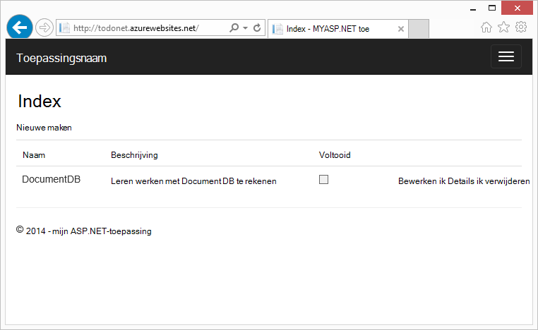

In dit overzicht ziet u hoe u de service DocumentDB van Azure gebruiken om te slaan en toegang tot gegevens van een ASP.NET-MVC webtoepassing die worden gehost op Azure. Als u een zelfstudie die is alleen op DocumentDB en de onderdelen ASP.NET MVC gericht zoekt, raadpleegt u [een DocumentDB C# consoletoepassing maken](documentdb-get-started.md).

> [AZURE.TIP] Deze zelfstudie wordt ervan uitgegaan dat u vorige ervaring hebt met ASP.NET MVC en Azure-Websites. Als u nog niet eerder naar ASP.NET of de [vereiste extra](#_Toc395637760), wordt u aangeraden downloaden van het voorbeeldproject voltooid van [GitHub][] en volg de instructies in dit voorbeeld. Nadat u deze ingebouwd hebt, kunt u dit artikel om inzicht in de code in de context van het project bekijken.

## Vereisten voor deze zelfstudie database

Voordat u de instructies in dit artikel te volgen, moet u ervoor zorgen dat u het volgende hebt:

- Een actieve Azure-account. Als u geen account hebt, kunt u een gratis proefabonnement-account maken in een paar minuten. Zie [Azure gratis proefversie](https://azure.microsoft.com/pricing/free-trial/)voor meer informatie.
- [Visual Studio-2015](http://www.visualstudio.com/) of Visual Studio 2013 Update 4 of hoger. Als Visual Studio-2013 gebruikt, moet u het [Microsoft.Net.Compilers nuget pakket](https://www.nuget.org/packages/Microsoft.Net.Compilers/) als u wilt toevoegen van ondersteuning voor C# 6.0 installeren. 
- Azure SDK voor .NET versie 2.5.1 of hoger, beschikbaar via het [Installatieprogramma van Microsoft Web Platform][].

De schermopnamen in dit artikel is gehouden met Visual Studio 2013 met Update 4 toegepast en de SDK Azure voor .NET versie 2.5.1. Als uw systeem is geconfigureerd met verschillende versies is het mogelijk dat uw schermen en de opties niet overeenkomen met volledig, maar als u de bovenstaande voorwaarden voldoen aan deze oplossing moet werken.

## Stap 1: Maak een account van de database DocumentDB

Laten we beginnen met het maken van een DocumentDB-account. Als u al een account hebt, kunt u doorgaan met [een nieuwe MVC ASP.NET-toepassing maken](#_Toc395637762).

[AZURE.INCLUDE [documentdb-create-dbaccount](../../includes/documentdb-create-dbaccount.md)]

[AZURE.INCLUDE [documentdb-keys](../../includes/documentdb-keys.md)]

 
We nu doorlopen hoe u een nieuwe MVC ASP.NET-toepassing maakt van a t/m. 

## Stap 2: Maak een nieuwe MVC ASP.NET-toepassing

Nu dat u een account hebt, laten we onze nieuw ASP.NET-project te maken.

1. In Visual Studio, in het menu **bestand** , wijs **Nieuw**aan en klik vervolgens op **Project**.

    Het dialoogvenster **Nieuw Project** wordt weergegeven.
2. Klik in het deelvenster **projecttypen** Vouw **sjablonen**, **Visual C#**, **Web**en selecteer vervolgens **ASP.NET-webtoepassing**.

    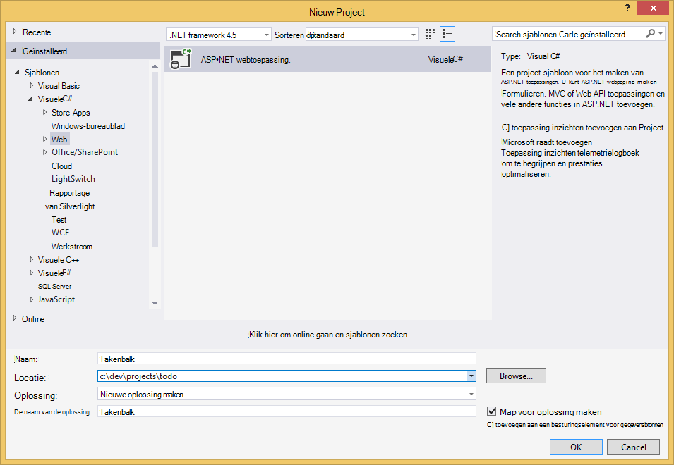

3. Typ in het vak **naam** de naam van het project. Deze zelfstudie gebruikt de naam 'doen'. Als u gebruiken op een ander nummer dan dit wilt, waar deze zelfstudie moment over de naamruimte doen spreekt, moet u de voorbeelden van de opgegeven code als u wilt gebruiken wat u met de naam uw toepassing aanpassen. 

4. Klik op **Bladeren** om te navigeren naar de map waar u wilt naartoe maken van het project en klik vervolgens op **OK**.

    Het dialoogvenster **Nieuw ASP.NET-Project** wordt weergegeven.

    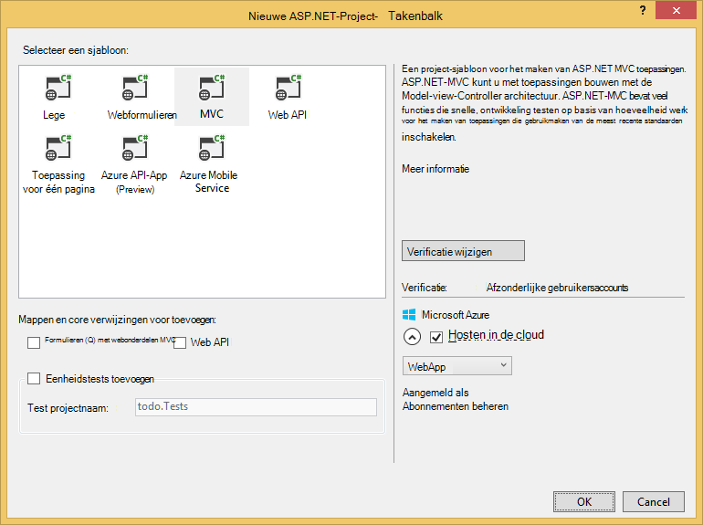

5. Selecteer in het deelvenster sjablonen **MVC**.

6. Als u van plan bent om uw toepassing in Azure wordt aangegeven te hosten, selecteer vervolgens **Host in de cloud** in de rechterbenedenhoek om te laten Azure host voor de toepassing. We hebt geselecteerd voor het hosten van in de cloud en de toepassing die worden gehost op een Website Azure uit te voeren. U deze optie selecteert, wordt een Azure-Website preprovision voor u en leven veel eenvoudiger maken wanneer u gaat naar de laatste werken-toepassing implementeren. Als u wilt deze elders hosten of niet wilt Azure voorhand configureren, net Schakel **Host in de Cloud**.

7. Klik op **OK** en laat Visual Studio de doen rond de lege sjabloon met ASP.NET MVC scaffolding. 

8. Als u ervoor hebt gekozen voor het hosten van dit in de cloud ziet u ten minste één extra weergegeven waarin u zich aanmeldt bij uw Azure-account en verstrek enkele waarden voor uw nieuwe website. Alle andere waarden en doorgaan. 

    Ik een 'databaseserver"hier omdat we een Azure SQL Database-Server hier niet werkt met dit nog niet hebt gekozen, gaan we maakt een nieuw account voor Azure DocumentDB later in de Portal Azure.

    Zie voor meer informatie over het kiezen van een **App-abonnement** en **resourcegroep** [uitgebreide overzicht van Azure App-Service plannen](../app-service/azure-web-sites-web-hosting-plans-in-depth-overview.md).

    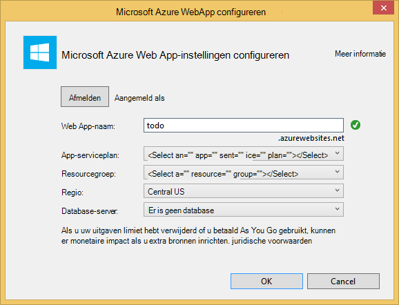

9. Nadat de Visual Studio is voltooid met het maken van de standaardtekst MVC toepassing hebt u een lege ASP.NET-toepassing die u lokaal kunt uitvoeren.

    Wordt overgeslagen uitgevoerd van het project lokaal omdat ik precies iedereen kent de ASP.NET "Hallo wereld" toepassing. In dit artikel Ga rechtstreeks naar DocumentDB toevoegen aan dit project en het bouwen van de toepassing.

## Stap 3: DocumentDB toevoegen aan uw MVC web application-project

We gaan naar het reële doel van deze zelfstudie Azure DocumentDB toevoegen aan de webtoepassing van onze MVC nu dat we meestal de ASP.NET MVC sanitair die we nodig voor deze oplossing hebben.

1. De DocumentDB .NET SDK is verpakt en gedistribueerd als een pakket NuGet. Als u het pakket NuGet in Visual Studio, gebruikt u de NuGet pakket manager in Visual Studio door met de rechtermuisknop op het project in **Solution Explorer** en klik vervolgens op **NuGet-pakketten beheren**.

    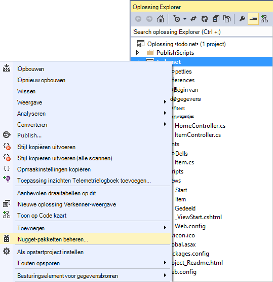

    Het dialoogvenster **NuGet-pakketten beheren** wordt weergegeven.

2. Typ in het vak NuGet **Blader** ***Azure DocumentDB***.
    
    Installeer het pakket **Microsoft Azure DocumentDB clientbibliotheek** uit de resultaten kunt. Hiermee wordt download en installeer het pakket DocumentDB, evenals alle afhankelijkheden, zoals Newtonsoft.Json. Klik op **OK** in **het voorbeeldvenster** en **ik ga akkoord** in het venster van de **Knop verwijderen** als u wilt de installatie te voltooien.

    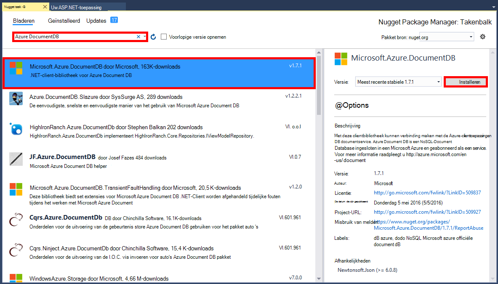

    U kunt ook de Console Package Manager gebruiken voor het installeren van het pakket. Klik hiervoor in het menu **Extra** op **NuGet Package Manager**en klik vervolgens op **Package Manager-Console**. Klik bij de prompt typt u het volgende.

        Install-Package Microsoft.Azure.DocumentDB

3. Wanneer het pakket is geïnstalleerd, uw Visual Studio-oplossing moet als volgt uitzien met twee nieuwe verwijzingen toegevoegd, Microsoft.Azure.Documents.Client en Newtonsoft.Json.

    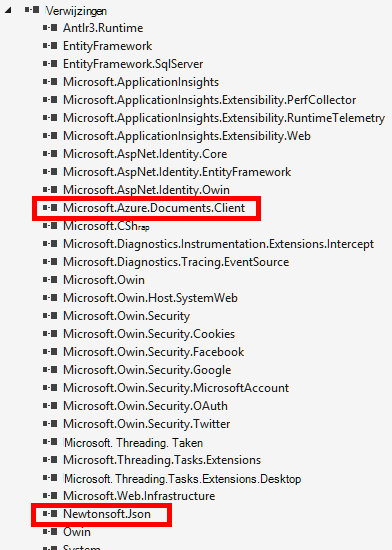

##Stap 4: De toepassing ASP.NET MVC instellen
 
Nu we de modellen, weergaven en controllers toevoegen aan deze toepassing MVC:

- [Een model toevoegen](#_Toc395637764).
- [Een controller toevoegen](#_Toc395637765).
- [Weergaven toevoegen](#_Toc395637766).

### Een gegevensmodel JSON toevoegen

Laten we beginnen door te maken van de **M** in MVC, het model. 

1. In **Solution Explorer**met de rechtermuisknop op de map **modellen** , klikt u op **toevoegen**en klik vervolgens op **Class**.

    Het dialoogvenster **Nieuw Item toevoegen** wordt weergegeven.

2. Geef uw nieuwe klasse **Item.cs** naam en klik op **toevoegen**. 

3. In dit nieuwe **Item.cs** -bestand, kunt u de volgende na de laatste *instructie*toevoegen.
        
        using Newtonsoft.Json;
    
4. Nu deze code vervangen 
        
        public class Item
        {
        }

    met de volgende code.

        public class Item
        {
            [JsonProperty(PropertyName = "id")]
            public string Id { get; set; }
             
            [JsonProperty(PropertyName = "name")]
            public string Name { get; set; }

            [JsonProperty(PropertyName = "description")]
            public string Description { get; set; }

            [JsonProperty(PropertyName = "isComplete")]
            public bool Completed { get; set; }
        }

    Alle gegevens in DocumentDB is doorgegeven via het netwerk en opgeslagen als JSON. Als u wilt bepalen hoe zijn uw objecten serienummer/gedeserialiseerd door JSON.NET kunt u het kenmerk **JsonProperty** zoals u in het **Item** class dat we zojuist hebt gemaakt. U niet **hebt** moet dit maar ik wil de geldende mijn eigenschappen de naamgeving van JSON camelCase. 
    
    Niet alleen kunt u bepalen de opmaak van de naam van de eigenschap wanneer deze worden opgeslagen in JSON, maar u de eigenschappen van uw .NET geheel wijzigen kunt zoals ik hebben gedaan met de eigenschap **Description** . 
    

### Een controller toevoegen

Die zorgt voor de **M**, nu we de **C** in MVC, een klasse controller maken.

1. Met de rechtermuisknop op de map **Controllers** in **Solution Explorer**, klikt u op **toevoegen**en klik vervolgens op **Controller**.

    Het dialoogvenster **Scaffold toevoegen** wordt weergegeven.

2. Selecteer **MVC 5 Controller - leegmaken** en klik vervolgens op **toevoegen**.

    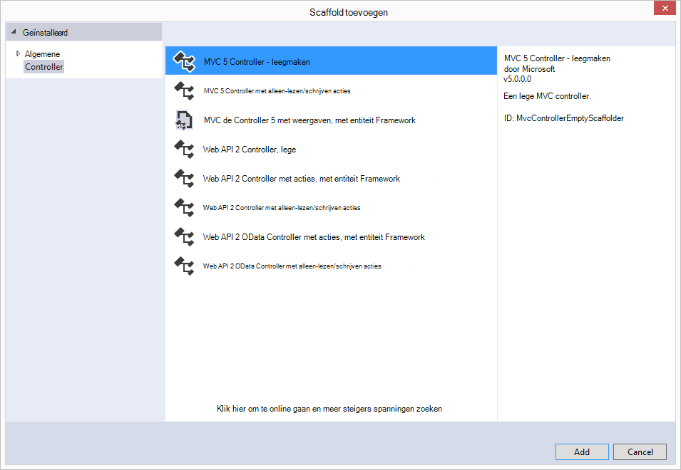

3. Naam van de nieuwe Controller, **ItemController.**

    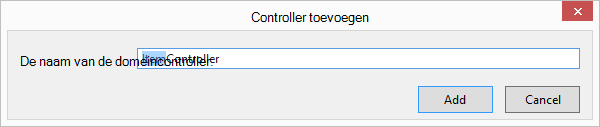

    Nadat het bestand is gemaakt, moet uw Visual Studio-oplossing lijken op de volgende handelingen uit met de nieuwe ItemController.cs-bestand in **Oplossingverkenner**. Het nieuwe Item.cs-bestand eerder hebt gemaakt, wordt ook weergegeven.

    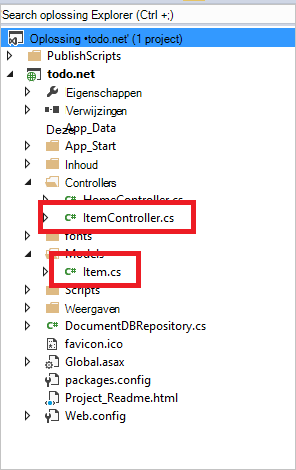

    U kunt ItemController.cs sluiten, we wordt keert u terug naar deze later. 

### Weergaven toevoegen

Nu kunnen we de **V** in MVC, de weergaven maken:

- [De weergave van een Item Index toevoegen](#AddItemIndexView).
- [De weergave van een nieuw Item toevoegen](#AddNewIndexView).
- [De weergave van een Item bewerken toevoegen](#_Toc395888515).

#### De weergave van een Item Index toevoegen

1. Vouw de map **weergaven** in **Solution Explorer**, met de rechtermuisknop op de map leegmaken **Item** die Visual Studio voor u gemaakt wanneer u de **ItemController** eerder hebt toegevoegd, klikt u op **toevoegen**en klik vervolgens op **weergave**.

    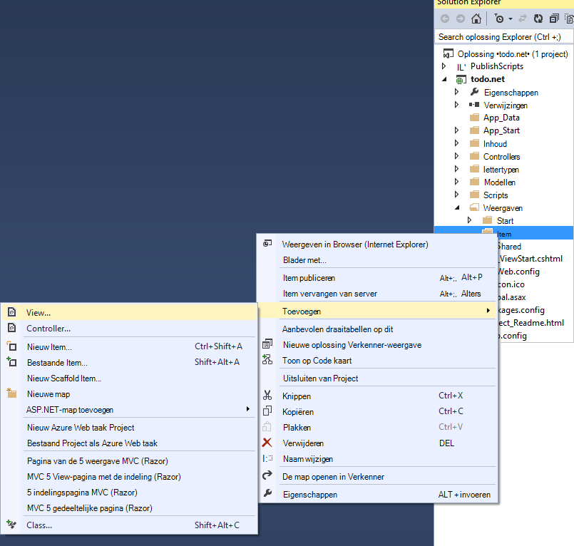

2. Ga als volgt te werk in het dialoogvenster **Weergave toevoegen** :
    - Typ in het vak **weergavenaam** ***Index***.
    - Selecteer in het vak **sjabloon** ***lijst***.
    - Selecteer in het vak **Model class** ***Item (doen. Modellen)***.
    - Laat het vak **gegevens context klasse** leeg. 
    - Typ in het vak van de pagina indeling ***~/Views/Shared/_Layout.cshtml***.
    
    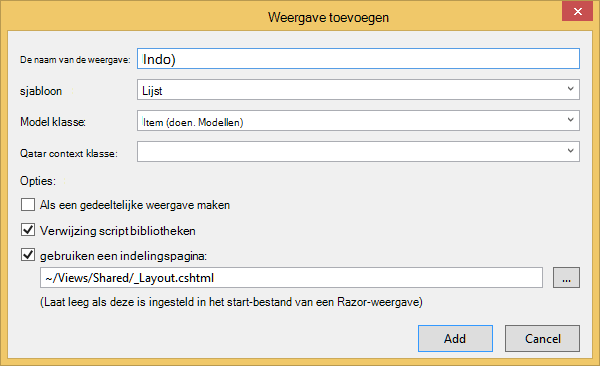

3. Wanneer al deze waarden zijn ingesteld, klikt u op **toevoegen** en laat van Visual Studio nieuwe sjabloon wilt weergeven. Als deze is ingevuld, wordt deze geopend de cshtml-bestand dat is gemaakt. We kunnen dat bestand in Visual Studio close we wordt keert u terug naar deze later.

#### De weergave van een nieuw Item toevoegen

Net zoals bij hoe we de weergave van een **Item Index** hebt gemaakt, Maak nu een nieuwe weergave voor het maken van nieuwe **Items**.

1. In **Solution Explorer**opnieuw met de rechtermuisknop op de map **Item** , klikt u op **toevoegen**en klik vervolgens op **weergave**.

2. Ga als volgt te werk in het dialoogvenster **Weergave toevoegen** :
    - Typ in het vak **naam van de weergave** ***maken***.
    - Selecteer in het vak **sjabloon** ***maken***.
    - Selecteer in het vak **Model class** ***Item (doen. Modellen)***.
    - Laat het vak **gegevens context klasse** leeg.
    - Typ in het vak van de pagina indeling ***~/Views/Shared/_Layout.cshtml***.
    - Klik op **toevoegen**.

#### De weergave van een Item bewerken toevoegen

En ten slotte één laatste weergave voor het bewerken van een **Item** op dezelfde manier als voordat toevoegen.

1. In **Solution Explorer**opnieuw met de rechtermuisknop op de map **Item** , klikt u op **toevoegen**en klik vervolgens op **weergave**.

2. Ga als volgt te werk in het dialoogvenster **Weergave toevoegen** :
    - Typ ***bewerken***in het vak **weergavenaam** .
    - Selecteer ***bewerken***in het vak **sjabloon** .
    - Selecteer in het vak **Model class** ***Item (doen. Modellen)***.
    - Laat het vak **gegevens context klasse** leeg. 
    - Typ in het vak van de pagina indeling ***~/Views/Shared/_Layout.cshtml***.
    - Klik op **toevoegen**.

Als dit is ingevuld, sluit u alle documenten cshtml in Visual Studio terwijl we later keert terug naar deze weergaven.

## Stap 5: Bedradingsdiagrammen omhoog DocumentDB

Nu gaan we nu dat de standaard MVC items is afgehandeld, op het toevoegen van de code voor DocumentDB. 

In deze sectie, zullen we de code voor het verwerken van de volgende toevoegen:

- [Overzicht van onvoltooide Items](#_Toc395637770).
- [Items toe te voegen](#_Toc395637771).
- [Items bewerken](#_Toc395637772).

### Overzicht van onvoltooide Items in uw webtoepassing MVC

Het eerste wat u doet is een klasse waarin de logica verbinden en het gebruik van DocumentDB toevoegen. Voor deze zelfstudie hebt we alle deze logica in naar een bibliotheek klasse DocumentDBRepository onderbrengen. 

1. In **Oplossingverkenner**met de rechtermuisknop op het project, klikt u op **toevoegen**en klik vervolgens op **Class**. Geef de nieuwe klasse **DocumentDBRepository** naam en klik op **toevoegen**.
 
2. In de zojuist gemaakte **DocumentDBRepository** klasse en de volgende *instructies* boven de declaratie van de *naamruimte* toevoegen
        
        using Microsoft.Azure.Documents; 
        using Microsoft.Azure.Documents.Client; 
        using Microsoft.Azure.Documents.Linq; 
        using System.Configuration;
        using System.Linq.Expressions;
        using System.Threading.Tasks;

    Nu deze code vervangen 

        public class DocumentDBRepository
        {
        }

    met de volgende code.

        public static class DocumentDBRepository<T> where T : class
        {
            private static readonly string DatabaseId = ConfigurationManager.AppSettings["database"];
            private static readonly string CollectionId = ConfigurationManager.AppSettings["collection"];
            private static DocumentClient client;
    
            public static void Initialize()
            {
                client = new DocumentClient(new Uri(ConfigurationManager.AppSettings["endpoint"]), ConfigurationManager.AppSettings["authKey"]);
                CreateDatabaseIfNotExistsAsync().Wait();
                CreateCollectionIfNotExistsAsync().Wait();
            }
    
            private static async Task CreateDatabaseIfNotExistsAsync()
            {
                try
                {
                    await client.ReadDatabaseAsync(UriFactory.CreateDatabaseUri(DatabaseId));
                }
                catch (DocumentClientException e)
                {
                    if (e.StatusCode == System.Net.HttpStatusCode.NotFound)
                    {
                        await client.CreateDatabaseAsync(new Database { Id = DatabaseId });
                    }
                    else
                    {
                        throw;
                    }
                }
            }
    
            private static async Task CreateCollectionIfNotExistsAsync()
            {
                try
                {
                    await client.ReadDocumentCollectionAsync(UriFactory.CreateDocumentCollectionUri(DatabaseId, CollectionId));
                }
                catch (DocumentClientException e)
                {
                    if (e.StatusCode == System.Net.HttpStatusCode.NotFound)
                    {
                        await client.CreateDocumentCollectionAsync(
                            UriFactory.CreateDatabaseUri(DatabaseId),
                            new DocumentCollection { Id = CollectionId },
                            new RequestOptions { OfferThroughput = 1000 });
                    }
                    else
                    {
                        throw;
                    }
                }
            }
        }

    > [AZURE.TIP] Bij het maken van een nieuwe DocumentCollection kunt u een optionele RequestOptions-parameter van OfferType, waarmee u het prestatieniveau van de nieuwe siteverzameling opgeven kunt opgeven. De standaardeenheid voor de aanbieding wordt gebruikt als deze parameter is verstreken. Voor meer informatie over DocumentDB Raadpleeg aanbieding typen [DocumentDB prestaties](documentdb-performance-levels.md)

3. We leest enkele waarden uit de configuratie, dus open het bestand **Web.config** van uw toepassing en voeg de volgende regels onder de `<AppSettings>` sectie.
    
        <add key="endpoint" value="enter the URI from the Keys blade of the Azure Portal"/>
        <add key="authKey" value="enter the PRIMARY KEY, or the SECONDARY KEY, from the Keys blade of the Azure  Portal"/>
        <add key="database" value="ToDoList"/>
        <add key="collection" value="Items"/>
    
4. De waarden voor *eindpunt* en *authKey* met het blad toetsen van de Portal Azure nu bijwerken. De **URI** van het blad toetsen gebruiken als de waarde van de instelling van het eindpunt en de **Primaire sleutel**, of **Secundaire sleutel** uit het blad toetsen als de waarde van de instelling authKey gebruiken.

    Dat zorgt voor bekabeling up van de bibliotheek DocumentDB nu we onze toepassingslogica toevoegen.

5. Het eerste wat u wilt kunnen doen met een toepassing voor de lijst van de taak is om de onvoltooide items weer te geven.  Kopieer en plak de volgende codefragment overal in de klas **DocumentDBRepository** .

        public static async Task<IEnumerable<T>> GetItemsAsync(Expression<Func<T, bool>> predicate)
        {
            IDocumentQuery<T> query = client.CreateDocumentQuery<T>(
                UriFactory.CreateDocumentCollectionUri(DatabaseId, CollectionId))
                .Where(predicate)
                .AsDocumentQuery();

            List<T> results = new List<T>();
            while (query.HasMoreResults)
            {
                results.AddRange(await query.ExecuteNextAsync<T>());
            }

            return results;
        }

6. Open de **ItemController** we eerder hebt toegevoegd en de volgende *instructies* boven de declaratie van de naamruimte toevoegen.

        using System.Net;
        using System.Threading.Tasks;
        using todo.Models;

    Als uw project niet de naam 'doen', moet u te werken met 'doen. Modellen"; aan de naam van uw project.

    Nu deze code vervangen

        //GET: Item
        public ActionResult Index()
        {
            return View();
        }

    met de volgende code.

        [ActionName("Index")]
        public async Task<ActionResult> IndexAsync()
        {
            var items = await DocumentDBRepository<Item>.GetItemsAsync(d => !d.Completed);
            return View(items);
        }
    
7. Open **Global.asax.cs** en voeg de volgende regel met de methode **Application_Start** 
 
        DocumentDBRepository<todo.Models.Item>.Initialize();
    
Uw oplossing zou nu moeten kunnen maken zonder fouten.

Als u de toepassing nu uitgevoerd, zou u Ga naar de **HomeController** en de **Index** -weergave van controller. Dit is de standaardinstelling voor het MVC sjabloonproject dat we hebben gekozen aan het begin, maar we niet wilt dat! Laten we wijzigen de routering op deze toepassing MVC dit kunt wijzigen.

Open ***App\_Start\RouteConfig.cs*** en zoek de regel die beginnen met ' standaardwaarden: "en wijzig de er dan ongeveer als volgt te werk.

        defaults: new { controller = "Item", action = "Index", id = UrlParameter.Optional }

In dit nu ASP.NET-MVC dat als u een waarde niet hebt opgegeven in de URL voor de routering besturen dat in plaats daarvan voor **Start**, gebruikt **Item** als de controller en de gebruiker **Index** als de weergave worden vermeld.

Nu als u de toepassing uitvoert, wordt deze inbellen bij uw **ItemController** inbellen bij de klas opslagplaats en gebruikt u de methode GetItems om terug te keren alle onvoltooide items aan de **weergaven**\\**Item**\\**Index** weergave. 

Als u maken en dit project nu uitvoeren, moet u iets dat eruit dit ziet nu zien.    

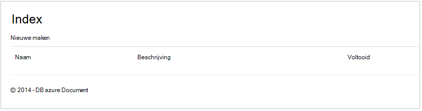

### Items toe te voegen

Laten we eens sommige items plaatst in onze database, zodat er iets meer dan een leeg raster nagaan.

Laten we eens enkele code toevoegen aan DocumentDBRepository en ItemController om de record in DocumentDB.

1.  De volgende methode toevoegen aan uw klas **DocumentDBRepository** .

        public static async Task<Document> CreateItemAsync(T item)
        {
            return await client.CreateDocumentAsync(UriFactory.CreateDocumentCollectionUri(DatabaseId, CollectionId), item);
        }

    Deze methode wordt een object doorgegeven gewoon en deze in DocumentDB zich blijft voordoen.

2. Open het bestand ItemController.cs en het volgende codefragment binnen de klas toevoegen. Dit is hoe ASP.NET MVC weet wat u moet doen voor de actie **maken** . In dit geval worden alleen weergegeven de gekoppelde Create.cshtml weergave eerder hebt gemaakt.

        [ActionName("Create")]
        public async Task<ActionResult> CreateAsync()
        {
            return View();
        }

    Nu moeten we enkele meer-code in deze controller waarin de indiening vanuit de weergave **maken** .

2. Het volgende blok met code toevoegen aan de ItemController.cs klasse die ASP.NET MVC wordt uitgelegd wat u moet doen met een formulier bericht voor deze controller.
    
        [HttpPost]
        [ActionName("Create")]
        [ValidateAntiForgeryToken]
        public async Task<ActionResult> CreateAsync([Bind(Include = "Id,Name,Description,Completed")] Item item)
        {
            if (ModelState.IsValid)
            {
                await DocumentDBRepository<Item>.CreateItemAsync(item);
                return RedirectToAction("Index");
            }

            return View(item);
        }

    Deze code roept in naar de DocumentDBRepository en gebruikt de methode CreateItemAsync aanhouden van het nieuwe item doen met de database. 
 
    **Opmerking over de beveiliging**: het kenmerk **ValidateAntiForgeryToken** Hier wordt gebruikt om u te helpen beveiligen van deze toepassing tegen op meerdere sites verzoek voorkoming aanvallen. Er is niet alleen dit kenmerk toe te voegen, uw weergaven moeten werken met deze ter voorkoming token ook. Voor meer informatie over het onderwerp en voorbeelden van hoe u dit correct implementeert, raadpleegt u [Meerdere sites aanvragen voorkoming voorkomen][]. De broncode die u op [GitHub][] heeft de volledige uitvoering op hun plaats staan.

    **Opmerking over de beveiliging**: We gebruiken ook het kenmerk **afhankelijk** van de methodeparameter om te beschermen tegen aanvallen te weinig posten. Zie [Eenvoudige CRUD-bewerkingen in ASP.NET MVC][]voor meer informatie.

Hiermee wordt de code vereist om nieuwe Items toevoegen aan onze database afgesloten.

### Items bewerken

Er is een laatste wat wij kunnen en die is toe te voegen van de mogelijkheid om **Items** te bewerken in de database en om deze te markeren als voltooid. De weergave voor het bewerken van is al toegevoegd aan het project, zodat we hoeft u alleen bepaalde code voor onze controller en voor de klas **DocumentDBRepository** opnieuw toevoegen.

1. De volgende toevoegen aan de klasse **DocumentDBRepository** .

        public static async Task<Document> UpdateItemAsync(string id, T item)
        {
            return await client.ReplaceDocumentAsync(UriFactory.CreateDocumentUri(DatabaseId, CollectionId, id), item);
        }

        public static async Task<T> GetItemAsync(string id)
        {
            try
            {
                Document document = await client.ReadDocumentAsync(UriFactory.CreateDocumentUri(DatabaseId, CollectionId, id));
                return (T)(dynamic)document;
            }
            catch (DocumentClientException e)
            {
                if (e.StatusCode == HttpStatusCode.NotFound)
                {
                    return null;
                }
                else
                {
                    throw;
                }
            }
        }
    
    De eerste van de volgende manieren, **GetItem** op te halen een Item uit DocumentDB dat wordt doorgegeven terug naar de **ItemController** en klik vervolgens op de weergave **bewerken** .
    
    De seconden van de methoden we vervangt die het **Document** in DocumentDB met de versie van het **Document** vanuit de **ItemController doorgegeven**zojuist hebt toegevoegd.

2. De volgende toevoegen aan de klasse **ItemController** .

        [HttpPost]
        [ActionName("Edit")]
        [ValidateAntiForgeryToken]
        public async Task<ActionResult> EditAsync([Bind(Include = "Id,Name,Description,Completed")] Item item)
        {
            if (ModelState.IsValid)
            {
                await DocumentDBRepository<Item>.UpdateItemAsync(item.Id, item);
                return RedirectToAction("Index");
            }

            return View(item);
        }

        [ActionName("Edit")]
        public async Task<ActionResult> EditAsync(string id)
        {
            if (id == null)
            {
                return new HttpStatusCodeResult(HttpStatusCode.BadRequest);
            }

            Item item = await DocumentDBRepository<Item>.GetItemAsync(id);
            if (item == null)
            {
                return HttpNotFound();
            }

            return View(item);
        }
    
    De eerste methode omgaat met Http GET die optreedt wanneer de gebruiker op de koppeling **bewerken** vanuit de weergave van de **Index** . Deze methode ophaalt van een [**Document**](http://msdn.microsoft.com/library/azure/microsoft.azure.documents.document.aspx) uit DocumentDB en wordt doorgegeven aan de weergave **bewerken** .

    De weergave **bewerken** klikt u vervolgens doet op de **IndexController**een Http-POST. 
    
    De tweede methode die we hebben toegevoegd omgaat met de bijgewerkte object doorgeven aan DocumentDB om te worden doorgevoerd in de database.

Dat is het, dat is alles moeten we onze toepassing wordt uitgevoerd, onvolledig **Items**een lijst met nieuwe **Items**toevoegen en **Items**bewerken.

## Stap 6: De toepassing lokaal uitvoeren

Als u wilt testen van de toepassing op uw lokale computer, doet u het volgende:

1. Druk op F5 in Visual Studio om de toepassing in de foutopsporingsmodus voor te maken. Dit moet de toepassing bouwen en een browser met de leeg raster-pagina die hebt gezien voordat starten:

    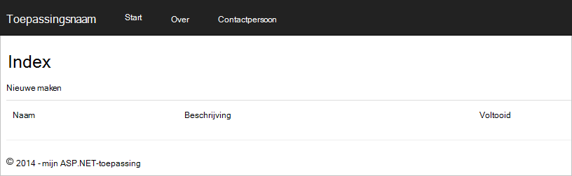

    Als u Visual Studio 2013 gebruikt en wordt het foutbericht "Kan geen wacht tot in de hoofdtekst van een variabel-component." u moet het [Microsoft.Net.Compilers nuget pakket](https://www.nuget.org/packages/Microsoft.Net.Compilers/)installeren. U kunt ook uw code ten opzichte van het voorbeeldproject op [GitHub][]vergelijken. 

2. Klik op de koppeling **Nieuwe maken** en waarden toevoegen aan de velden **naam** en **Beschrijving** . Laat de **voltooid** selectievakje uitgeschakeld anders het nieuwe **Item** in een voltooide staat, worden toegevoegd en wordt niet weergegeven op de eerste lijst.

    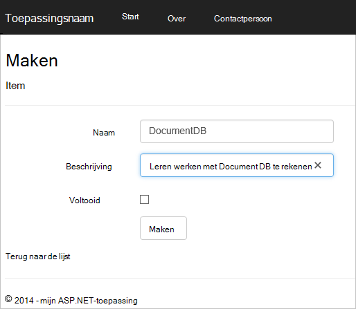

3. Klik op **maken** en wordt u omgeleid terug naar de weergave **Index** en uw **Item** wordt weergegeven in de lijst.

    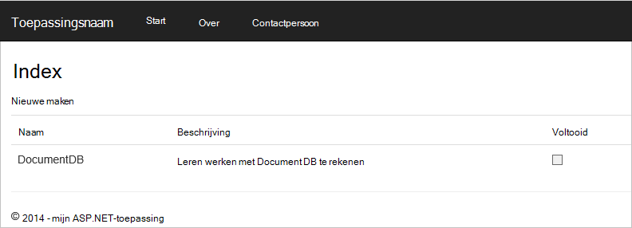

    Je mag rustig enkele meer **Items** toevoegen aan uw takenlijst.

3. Klik op **bewerken** naast een **Item** in de lijst en u worden in de weergave **bewerken** waarin u een eigenschap van het object, met inbegrip van de vlag **voltooid** kunt bijwerken. Als u het markeren als **voltooid** en klik op **Opslaan**, wordt het **Item** verwijderd uit de lijst met onvoltooide taken.

    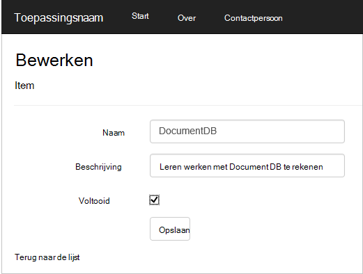

4. Eenmaal getest en de app, druk op Ctrl + F5 om te stoppen voor foutopsporing in de app. U bent klaar om te implementeren!

## Stap 7: De toepassing naar Azure Websites implementeren

Nu dat u hebt de volledige toepassing goed werkt met DocumentDB gaan we deze WebApp implementeren naar Azure-Websites. Als u **Host in de cloud** hebt geselecteerd bij het maken van het lege MVC ASP.NET-project Visual Studio is dit heel eenvoudig en doet het werk dat de meeste voor u. 

1. Als u wilt publiceren van deze toepassing is alle u moet doen met de rechtermuisknop op het project in **Solution Explorer** en klik op **publiceren**.

    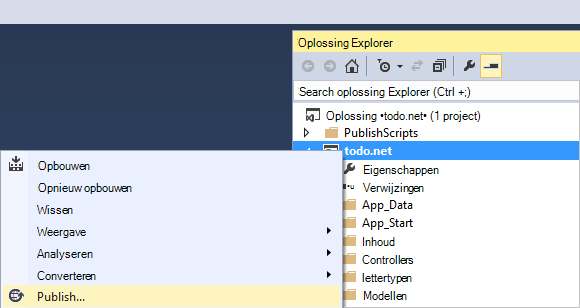

2. Alles moet al geconfigureerd worden op basis van uw referenties; in feite is de website al gemaakt in Azure wordt aangegeven voor u op de **Doel-URL** wordt weergegeven, hoeft u is, klik op **publiceren**.

    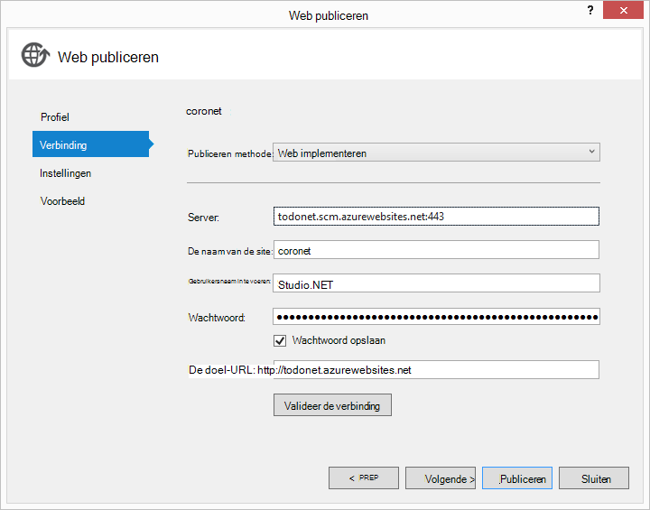

In een paar seconden wordt Visual Studio klaar bent met uw webtoepassing te publiceren en starten van een browser waar u uw handige werk uitgevoerd in Azure kunt zien!

## Volgende stappen

Gefeliciteerd! U zojuist hebt gemaakt van uw eerste ASP.NET-MVC webtoepassing met Azure DocumentDB en deze naar Azure Websites die zijn gepubliceerd. De broncode voor het volledige-toepassing, inclusief de functionaliteit voor details en verwijderen die niet zijn opgenomen in deze zelfstudie kan worden gedownload of [GitHub][]gekopieerd. Als u geïnteresseerd die aan uw app toe te voegen bent, zodat de code pak en toe te voegen aan deze app.

Als u wilt toevoegen van extra functionaliteit in uw toepassing, Controleer de API's beschikbaar in de [DocumentDB .NET-bibliotheek](https://msdn.microsoft.com/library/azure/dn948556.aspx) en je mag rustig bijdragen aan de bibliotheek DocumentDB .NET op [GitHub][]. 

[\*]: https://microsoft.sharepoint.com/teams/DocDB/Shared%20Documents/Documentation/Docs.LatestVersions/PicExportError
[Visual Studio Express]: http://www.visualstudio.com/products/visual-studio-express-vs.aspx
[Microsoft Web Platform Installer]: http://www.microsoft.com/web/downloads/platform.aspx
[Meerdere sites verzoek voorkoming voorkomen]: http://go.microsoft.com/fwlink/?LinkID=517254
[Eenvoudige CRUD-bewerkingen in ASP.NET MVC]: http://go.microsoft.com/fwlink/?LinkId=317598
[GitHub]: https://github.com/Azure-Samples/documentdb-net-todo-app
