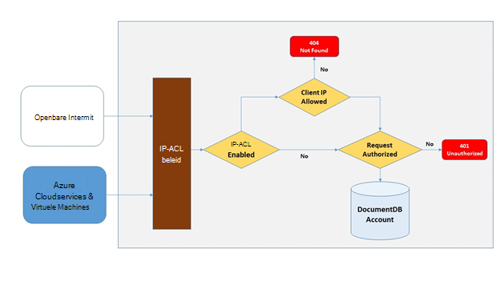
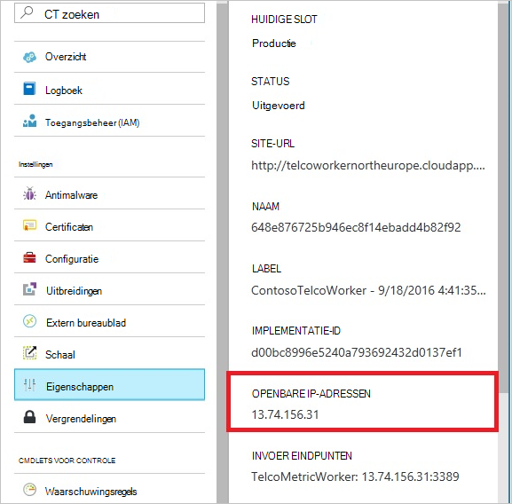
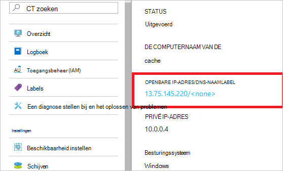
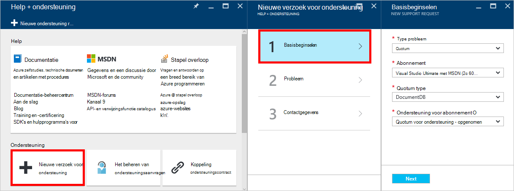
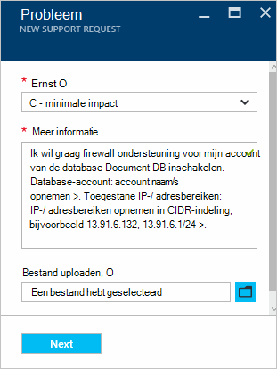

<properties
    pageTitle="Ondersteuning voor DocumentDB firewall | Microsoft Azure"
    description="Leer hoe u gebruikmaken van het IP-besturingselement clienttoegangsbeleid voor firewall support op Azure DocumentDB database accounts."
    keywords="IP-toegangsbeheer, firewall ondersteuning"
    services="documentdb"
    authors="shahankur11"
    manager="jhubbard"
    editor=""
    tags="azure-resource-manager"
    documentationCenter=""/>

<tags 
    ms.service="documentdb" 
    ms.workload="data-services" 
    ms.tgt_pltfrm="na" 
    ms.devlang="na" 
    ms.topic="article" 
    ms.date="10/17/2016" 
    ms.author="ankshah; kraman"/>

# DocumentDB firewall ondersteuning

Als u wilt beveiligen gegevens die zijn opgeslagen in een account van de database Azure DocumentDB, biedt DocumentDB ondersteuning voor een geheime gebaseerd [autorisatie model](https://msdn.microsoft.com/library/azure/dn783368.aspx) die gebruikmaakt van een bericht van sterke Hash gebaseerde verificatiecode (HMAC). Naast het model geheime gebaseerd autorisatie ondersteunt DocumentDB nu beleid basis van hoeveelheid werk IP gebaseerde toegang tot besturingselementen voor binnenkomende firewall ondersteuning. Dit model is vergelijkbaar met de firewallregels van een systeem traditionele database en een extra beveiligingsniveau met het account van de database DocumentDB bevat. Met dit model, kunt u nu een account van de database DocumentDB om te worden alleen toegankelijk vanaf een goedgekeurde set machines en/of cloud services configureren. Toegang tot DocumentDB resources uit deze goedgekeurde sets met computers en services vereisen nog steeds de beller een geldige Autorisatietoken presenteren.

## IP-Toegangsbeheer-overzicht

Standaard is een account van de database DocumentDB toegankelijk zijn vanuit de openbare internet zo lang maken als het verzoek wordt geleverd met een geldig Autorisatietoken. Als u wilt configureren IP-toegangsbeheer op basis van het beleid, de gebruiker moet ondersteuning bieden voor de reeks IP-adressen of IP-adresbereiken in CIDR formulier moeten worden opgenomen als de lijst met toegestane van client IP-adressen voor een opgegeven databaseaccount. Nadat deze configuratie is toegepast, worden alle aanvragen die afkomstig zijn van computers buiten deze lijst met toegestane worden geblokkeerd door de server.  De verbinding processing stroom voor het IP-gebaseerd toegangsbeheer wordt beschreven in het volgende diagram.

## Verbindingen vanuit de cloudservices

In Azure wordt aangegeven zijn cloudservices van een zeer gebruikelijke manier voor het hosten van de middelste laag service logica DocumentDB gebruiken. Als u wilt inschakelen access met een account van de database DocumentDB vanuit een cloudservice, moet het openbare IP-adres van de cloudservice worden toegevoegd aan de lijst met toegestane IP-adressen die is gekoppeld aan uw account van de database DocumentDB contact opnemen met [ondersteuning voor Azure](#configure-ip-policy).  Dit zorgt ervoor dat alle exemplaren van de rol van cloudservices toegang tot uw account van de database DocumentDB hebben. Zoals in de volgende schermafbeelding, kunt u IP-adressen voor de cloudservices in de portal Azure ophalen. 

Wanneer u uw cloudservice uit met het toevoegen van extra rol instanties verkleinen, hebben deze nieuwe exemplaren automatisch toegang tot het account van de database DocumentDB aangezien ze deel van de dezelfde cloudservice uitmaken.

## Verbindingen vanuit virtuele machines

[Virtuele machines](https://azure.microsoft.com/services/virtual-machines/) of [VM schaal instelt](../virtual-machine-scale-sets/virtual-machine-scale-sets-overview.md) , kan ook worden gebruikt voor het hosten van de middelste laag services met DocumentDB.  Als u wilt configureren de DocumentDB moet databaseaccount om toegang te krijgen van virtuele machines, openbare IP-adressen van virtuele machine en/of VM schaal instellen als een van de toegestane IP-adressen voor uw account van de database DocumentDB worden geconfigureerd door [contact opneemt met Azure ondersteuning](#configure-ip-policy). U kunt IP-adressen voor virtuele machines in de portal Azure kunt ophalen, zoals wordt weergegeven in de volgende schermafbeelding.

Als u extra VM exemplaren aan de groep toevoegt, worden ze automatisch toegang tot uw account van de database DocumentDB gegeven.

## Verbindingen van internet

Wanneer u een account van de database DocumentDB vanaf een computer op internet, moet de client IP-adres of de IP-adresbereiken van de computer worden toegevoegd aan de lijst met toegestane IP-adres voor het account van de database DocumentDB. 

## Het IP-besturingselement beleid configureren

Gebruik de Azure-portal naar het bestand een aanvraag met [Azure-ondersteuning](https://portal.azure.com/?#blade/Microsoft_Azure_Support/HelpAndSupportBlade) voor het inschakelen van het IP-besturingselement beleid van uw databaseaccount.

1. Selecteer de **nieuwe ondersteuning verzoek**in het blad [Help + ondersteuning](https://portal.azure.com/?#blade/Microsoft_Azure_Support/HelpAndSupportBlade) .
2. Selecteer in het blad **nieuwe ondersteuning verzoek** **Basisbeginselen**.
3. Selecteer de volgende opties in het blad **Basisbeginselen** :
    - **Type probleem**: quotum
    - **Abonnement**: het abonnement dat is gekoppeld aan het account waarin de IP-besturingselement beleid toevoegen.
    - **Quotum voor type**: DocumentDB
    - **Ondersteuning voor abonnement**: quotum ondersteuning - opgenomen.
4. Ga als volgt te werk in het blad **probleem** :
    - **Ernst**: Selecteer C - minimale impact
    - **Meer informatie**: Kopieer de volgende tekst in het vak en opnemen van uw account naam/s en het IP-adres/es: "Ik wil graag firewall ondersteuning voor mijn account van de database DocumentDB inschakelen. Database-account: *opnemen account naam/s*. Toegestane IP-/ adresbereiken: *opnemen IP-/ adresbereiken in CIDR-indeling, bijvoorbeeld 13.91.6.132, 13.91.6.1/24*. "
    - Klik op **volgende**. 
5. Vul uw contactgegevens in het blad **informatie over de contactpersoon** en klikt u op **maken**. 

Nadat uw aanvraag wordt ontvangen, moet IP-toegangsbeheer binnen 24 uur zijn ingeschakeld. U krijgt zodra de aanvraag voltooid is.

## Problemen met het IP-besturingselement beleid

### Portal bewerkingen

Doordat IP-beleid voor uw account van de database DocumentDB toegestaan alle toegang tot uw account van de database DocumentDB van computers buiten de geconfigureerde lijst met IP-adresbereiken worden geblokkeerd. Op grond van dit model, worden de gegevens vlak-bewerking van de portal bladeren ook geblokkeerd om ervoor te zorgen de integriteit van toegangsbeheer. 

### SDK & Rest API

Voor toegang via SDK of REST API van computers niet op de lijst met toegestane veiligheidsoverwegingen het resultaat van algemene 404 niet gevonden zonder extra details. Controleer of de IP-lijst die is geconfigureerd voor uw account van de database DocumentDB toegestaan om ervoor te zorgen dat de configuratie van de juiste beleid wordt toegepast op uw account van de database DocumentDB.

## Volgende stappen

Tips voor gerelateerde betere prestaties, Zie voor informatie over het netwerk [tips voor betere prestaties](documentdb-performance-tips.md).