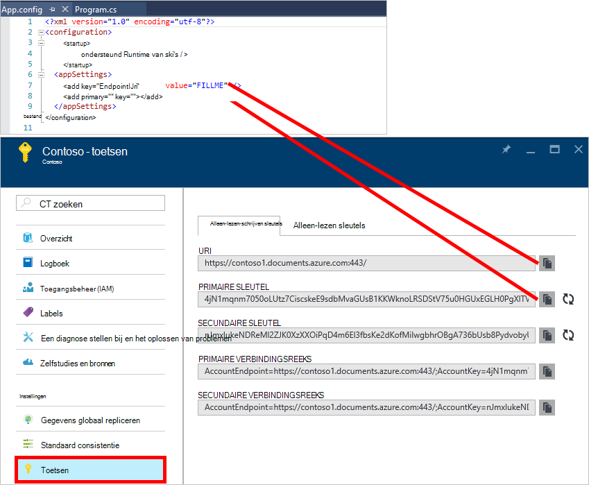
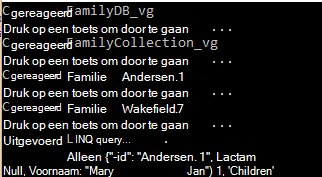
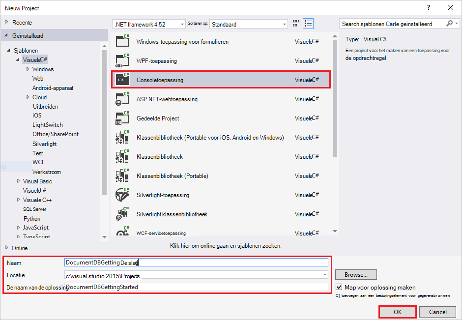
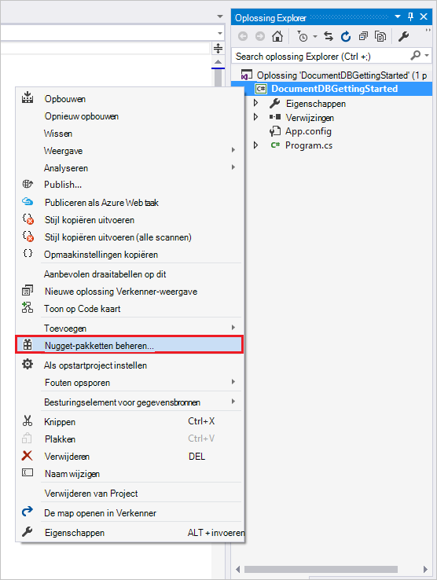
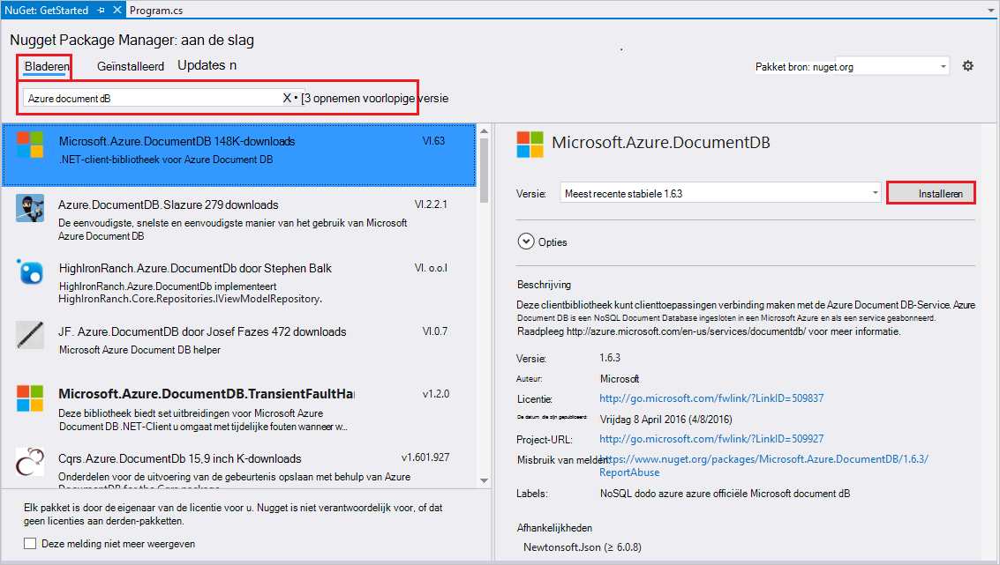
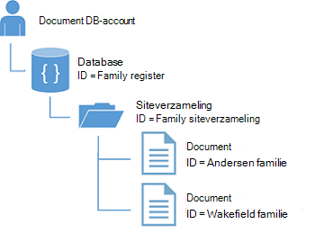
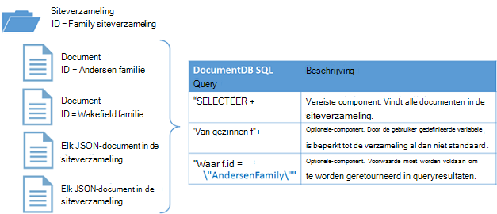

<properties
    pageTitle="NoSQL zelfstudie: DocumentDB .NET SDK | Microsoft Azure"
    description="Een NoSQL zelfstudie's die een onlinedatabase en C#-console-toepassing via de DocumentDB .NET SDK gemaakt. DocumentDB is een database NoSQL voor JSON."
    keywords="nosql zelfstudie onlinedatabase, c#-console-toepassing"
    services="documentdb"
    documentationCenter=".net"
    authors="AndrewHoh"
    manager="jhubbard"
    editor="monicar"/>

<tags
    ms.service="documentdb"
    ms.workload="data-services"
    ms.tgt_pltfrm="na"
    ms.devlang="dotnet"
    ms.topic="hero-article"
    ms.date="09/01/2016"
    ms.author="anhoh"/>

# NoSQL zelfstudie: maken een DocumentDB C# consoletoepassing

> [AZURE.SELECTOR]
- [.NET](documentdb-get-started.md)
- [Node.js](documentdb-nodejs-get-started.md)

Welkom bij de zelfstudie NoSQL voor de SDK van Azure DocumentDB .NET! Na het project QuickStart komen of de zelfstudie, hebt u een consoletoepassing die wordt gemaakt en query's DocumentDB resources.

- **[Snelstartgids](#quickstart)**: downloaden van de steekproef-project, de verbindingsgegevens kunt toevoegen en een DocumentDB-app met meer dan 10 minuten hebt.
- **[Zelfstudie](#tutorial)**: maken van de app QuickStart helemaal in 30 minuten.

## Vereisten voor

- Een actieve Azure-account. Als u deze niet hebt, kunt u zich kunt aanmelden voor een [gratis-account](https://azure.microsoft.com/free/).
- [Visual Studio 2013 of Visual Studio-2015](http://www.visualstudio.com/).
- .NET framework 4.6

## Snelstartgids

1. Downloaden van de steekproef project .zip van [GitHub](https://github.com/Azure-Samples/documentdb-dotnet-getting-started-quickstart/archive/master.zip) of de cessies‑retrocessies [documentdb-dotnet-ophalen-gestart-quickstart](https://github.com/Azure-Samples/documentdb-dotnet-getting-started-quickstart) klonen.
2. Gebruik de Azure-portal om een DocumentDB-account te [maken](documentdb-create-account.md).
3. Klik in het bestand App.config, kunt u de waarden EndpointUri en PrimaryKey vervangen door de waarden opgehaald uit de [Azure-portal](https://portal.azure.com/), door te gaan blade **DocumentDB (NoSQL)** , en vervolgens te klikken op de **naam van het Account**en vervolgens te klikken op **toetsen** in het menu van de resource.
    
4. Het project maakt. Het consolevenster ziet u de nieuwe resources worden gemaakt, een query wordt uitgevoerd en vervolgens afgewerkt.
    
    

## Zelfstudie

Deze zelfstudie begeleidt u bij het maken van een database DocumentDB, een verzameling DocumentDB en JSON-documenten. U vervolgens de verzameling, query en opschonen en de database verwijderen. Deze zelfstudie genereert hetzelfde project als het project QuickStart, maar u kunt deze stapsgewijs bouwen en ontvangt uitleg over de code die u aan het project toevoegt.

## Stap 1: Een DocumentDB-account maken

Laten we een DocumentDB-account maken. Als u al een account dat u wilt gebruiken, kunt u verder gaan om [uw Visual Studio-oplossing in te stellen](#SetupVS).

[AZURE.INCLUDE [documentdb-create-dbaccount](../../includes/documentdb-create-dbaccount.md)]

## Stap 2: Stel uw Visual Studio-oplossing

1. Open **Visual Studio-2015** op uw computer.
2. Klik in het menu **bestand** , selecteert u daarna **Nieuw**en kies vervolgens **Project**.
3. Selecteer in het dialoogvenster **Nieuw Project** **sjablonen** / **Visual C#** / **Console-toepassing**, naam van uw project en klik vervolgens op **OK**.

4. Klik in de **Oplossing Explorer**, klik met de rechtermuisknop op uw nieuwe consoletoepassing, dat wil onder uw Visual Studio-oplossing zeggen.
5. Zonder het menu, klik op **Beheren NuGet-pakketten...** 
 
6. Op het tabblad **Nuget** , klikt u op **Bladeren**en **azure documentdb** Typ in het zoekvak.
7. In de resultaten, zoek **Microsoft.Azure.DocumentDB** en klik op **installeren**.
Het pakket-ID voor de bibliotheek van de Client DocumentDB is [Microsoft.Azure.DocumentDB](https://www.nuget.org/packages/Microsoft.Azure.DocumentDB)

Uitstekende! Nu we klaar bent met de configuratie, laten we beginnen met code schrijven. Een voltooide CodeProject van deze zelfstudie kunt u op [GitHub](https://github.com/Azure-Samples/documentdb-dotnet-getting-started/blob/master/src/Program.cs)vinden.

## Stap 3: Verbinding maken met een DocumentDB-account

Eerst toevoegen deze verwijzingen naar het begin van uw C#-toepassing, in het bestand Program.cs:

    using System;
    using System.Linq;
    using System.Threading.Tasks;

    // ADD THIS PART TO YOUR CODE
    using System.Net;
    using Microsoft.Azure.Documents;
    using Microsoft.Azure.Documents.Client;
    using Newtonsoft.Json;

> [AZURE.IMPORTANT] Voordat u deze zelfstudie NoSQL voltooien, moet dat u de bovenstaande afhankelijkheden toevoegen.

Nu deze twee constanten en de variabele *client* onder uw openbare klas *programma*toevoegen.

    public class Program
    {
        // ADD THIS PART TO YOUR CODE
        private const string EndpointUri = "<your endpoint URI>";
        private const string PrimaryKey = "<your key>";
        private DocumentClient client;

Volgende kop bij de [Portal van Azure](https://portal.azure.com) om op te halen uw URI en de primaire sleutel. De DocumentDB URI en de primaire sleutel zijn vereist voor uw toepassing voor meer informatie over waar u verbinding maakt met, en voor DocumentDB te vertrouwen van uw toepassing verbinding.

Klik in de Portal Azure Ga naar uw account DocumentDB en klik op **toetsen**.

De URI van de portal kopieert en plakt u deze in `<your endpoint URI>` in het bestand program.cs. De primaire sleutel in de portal Kopieer en plak deze in `<your key>`.

![Schermafbeelding van de Azure-Portal wordt gebruikt door de zelfstudie NoSQL voor het maken van een C#-console-toepassing. Ziet u een account DocumentDB, met de actieve hub gemarkeerd, de knop TOETSEN is gemarkeerd op het blad DocumentDB-account en de URI, de primaire sleutel en de tweede sleutel waarden die zijn gemarkeerd op het blad toetsen][keys]

We beginnen de ophalen gestart toepassing door te maken van een nieuw exemplaar van de **DocumentClient**.

Voeg onder de methode **Hoofdgegeven** deze nieuwe asynchrone taak **GetStartedDemo**, waarin wordt een exemplaar van onze nieuwe **DocumentClient**genoemd.

    static void Main(string[] args)
    {
    }

    // ADD THIS PART TO YOUR CODE
    private async Task GetStartedDemo()
    {
        this.client = new DocumentClient(new Uri(EndpointUri), PrimaryKey);
    }

Voeg de volgende code als u wilt uw asynchrone taak uitvoeren vanaf uw methode **Main** . De methode **Main** wordt onderschept uitzonderingen en schrijft u ze aan de console.

    static void Main(string[] args)
    {
            // ADD THIS PART TO YOUR CODE
            try
            {
                    Program p = new Program();
                    p.GetStartedDemo().Wait();
            }
            catch (DocumentClientException de)
            {
                    Exception baseException = de.GetBaseException();
                    Console.WriteLine("{0} error occurred: {1}, Message: {2}", de.StatusCode, de.Message, baseException.Message);
            }
            catch (Exception e)
            {
                    Exception baseException = e.GetBaseException();
                    Console.WriteLine("Error: {0}, Message: {1}", e.Message, baseException.Message);
            }
            finally
            {
                    Console.WriteLine("End of demo, press any key to exit.");
                    Console.ReadKey();
            }

Druk op **F5** om uw toepassing te starten.

Gefeliciteerd! U verbinding met een DocumentDB-account hebt gemaakt, laten we nu raadpleegt u werken met DocumentDB resources.  

## Stap 4: Een database maken
Voordat u de code voor het maken van een database toevoegen, moet u een helpmethode voor het schrijven van aan de console toevoegen.

Kopieer en plak de methode **WriteToConsoleAndPromptToContinue** onder de methode **GetStartedDemo** .

    // ADD THIS PART TO YOUR CODE
    private void WriteToConsoleAndPromptToContinue(string format, params object[] args)
    {
            Console.WriteLine(format, args);
            Console.WriteLine("Press any key to continue ...");
            Console.ReadKey();
    }

Uw DocumentDB- [database](documentdb-resources.md#databases) kan worden gemaakt met behulp van de methode [CreateDatabaseAsync](https://msdn.microsoft.com/library/microsoft.azure.documents.client.documentclient.createdatabaseasync.aspx) van de klasse **DocumentClient** . Een database is de logische container JSON document opslag partities over siteverzamelingen.

Kopieer en plak de methode **CreateDatabaseIfNotExists** onder de methode **WriteToConsoleAndPromptToContinue** .

    // ADD THIS PART TO YOUR CODE
    private async Task CreateDatabaseIfNotExists(string databaseName)
    {
            // Check to verify a database with the id=FamilyDB does not exist
            try
            {
                    await this.client.ReadDatabaseAsync(UriFactory.CreateDatabaseUri(databaseName));
                    this.WriteToConsoleAndPromptToContinue("Found {0}", databaseName);
            }
            catch (DocumentClientException de)
            {
                    // If the database does not exist, create a new database
                    if (de.StatusCode == HttpStatusCode.NotFound)
                    {
                            await this.client.CreateDatabaseAsync(new Database { Id = databaseName });
                            this.WriteToConsoleAndPromptToContinue("Created {0}", databaseName);
                    }
                    else
                    {
                            throw;
                    }
            }
    }

Kopieer en plak de volgende code naar uw **GetStartedDemo** methode onder het maken van de client. Hiermee maakt u een database met de naam *FamilyDB*.

    private async Task GetStartedDemo()
    {
        this.client = new DocumentClient(new Uri(EndpointUri), PrimaryKey);

        // ADD THIS PART TO YOUR CODE
        await this.CreateDatabaseIfNotExists("FamilyDB_va");

Druk op **F5** om uw toepassing te starten.

Gefeliciteerd! U hebt een DocumentDB-database gemaakt.  

## Stap 5: Een verzameling maken  

> [AZURE.WARNING] **CreateDocumentCollectionAsync** maakt een nieuwe siteverzameling met gereserveerde doorvoer, met prijzen consequenties. Ga naar onze [pagina prijzen](https://azure.microsoft.com/pricing/details/documentdb/)voor meer informatie.

Een [siteverzameling](documentdb-resources.md#collections) kan worden gemaakt met behulp van de methode [CreateDocumentCollectionAsync](https://msdn.microsoft.com/library/microsoft.azure.documents.client.documentclient.createdocumentcollectionasync.aspx) van de klasse **DocumentClient** . Een verzameling is een container van JSON-documenten en bijbehorende logica voor JavaScript-toepassing.

Kopieer en plak de methode **CreateDocumentCollectionIfNotExists** onder uw **CreateDatabaseIfNotExists** -methode.

    // ADD THIS PART TO YOUR CODE
    private async Task CreateDocumentCollectionIfNotExists(string databaseName, string collectionName)
    {
        try
        {
            await this.client.ReadDocumentCollectionAsync(UriFactory.CreateDocumentCollectionUri(databaseName, collectionName));
            this.WriteToConsoleAndPromptToContinue("Found {0}", collectionName);
        }
        catch (DocumentClientException de)
        {
            // If the document collection does not exist, create a new collection
            if (de.StatusCode == HttpStatusCode.NotFound)
            {
                DocumentCollection collectionInfo = new DocumentCollection();
                collectionInfo.Id = collectionName;

                // Configure collections for maximum query flexibility including string range queries.
                collectionInfo.IndexingPolicy = new IndexingPolicy(new RangeIndex(DataType.String) { Precision = -1 });

                // Here we create a collection with 400 RU/s.
                await this.client.CreateDocumentCollectionAsync(
                    UriFactory.CreateDatabaseUri(databaseName),
                    collectionInfo,
                    new RequestOptions { OfferThroughput = 400 });

                this.WriteToConsoleAndPromptToContinue("Created {0}", collectionName);
            }
            else
            {
                throw;
            }
        }
    }

Kopieer en plak de volgende code naar uw **GetStartedDemo** methode onder het maken van de database. Hiermee maakt u een documentverzameling met de naam *FamilyCollection_va*.

        this.client = new DocumentClient(new Uri(EndpointUri), PrimaryKey);

        await this.CreateDatabaseIfNotExists("FamilyDB_oa");

        // ADD THIS PART TO YOUR CODE
        await this.CreateDocumentCollectionIfNotExists("FamilyDB_va", "FamilyCollection_va");

Druk op **F5** om uw toepassing te starten.

Gefeliciteerd! U hebt een verzameling DocumentDB documenten gemaakt.  

## Stap 6: JSON-documenten maken
Een [document](documentdb-resources.md#documents) kan worden gemaakt met behulp van de methode [CreateDocumentAsync](https://msdn.microsoft.com/library/microsoft.azure.documents.client.documentclient.createdocumentasync.aspx) van de klasse **DocumentClient** . Documenten zijn door gebruiker gedefinieerde (willekeurige) JSON-inhoud. We kunnen nu een of meer documenten invoegen. Als u de gegevens die u wilt opslaan in uw database al hebt, kunt u de DocumentDB [migratieprogramma van gegevens](documentdb-import-data.md).

Eerst moeten we een **familie** klasse maken die objecten die in dit voorbeeld zijn opgeslagen in DocumentDB vertegenwoordigt. We gaan ook **bovenliggende**, **onderliggende**, **huisdier**, **adres** subcategorieën die worden gebruikt in **familie**maken. Houd er rekening mee dat documenten een eigenschap **Id** serienummer als **id** in JSON moeten hebben. Maak deze klassen door toe te voegen van de volgende interne onderliggend klassen na de methode **GetStartedDemo** .

Kopieer en plak de **familie**, **bovenliggende** **onderliggende**, **huisdier**en **adres** klassen onder de methode **WriteToConsoleAndPromptToContinue** .

    private void WriteToConsoleAndPromptToContinue(string format, params object[] args)
    {
        Console.WriteLine(format, args);
        Console.WriteLine("Press any key to continue ...");
        Console.ReadKey();
    }

    // ADD THIS PART TO YOUR CODE
    public class Family
    {
        [JsonProperty(PropertyName = "id")]
        public string Id { get; set; }
        public string LastName { get; set; }
        public Parent[] Parents { get; set; }
        public Child[] Children { get; set; }
        public Address Address { get; set; }
        public bool IsRegistered { get; set; }
        public override string ToString()
        {
                return JsonConvert.SerializeObject(this);
        }
    }

    public class Parent
    {
        public string FamilyName { get; set; }
        public string FirstName { get; set; }
    }

    public class Child
    {
        public string FamilyName { get; set; }
        public string FirstName { get; set; }
        public string Gender { get; set; }
        public int Grade { get; set; }
        public Pet[] Pets { get; set; }
    }

    public class Pet
    {
        public string GivenName { get; set; }
    }

    public class Address
    {
        public string State { get; set; }
        public string County { get; set; }
        public string City { get; set; }
    }

Kopieer en plak de methode **CreateFamilyDocumentIfNotExists** onder uw **CreateDocumentCollectionIfNotExists** -methode.

    // ADD THIS PART TO YOUR CODE
    private async Task CreateFamilyDocumentIfNotExists(string databaseName, string collectionName, Family family)
    {
        try
        {
            await this.client.ReadDocumentAsync(UriFactory.CreateDocumentUri(databaseName, collectionName, family.Id));
            this.WriteToConsoleAndPromptToContinue("Found {0}", family.Id);
        }
        catch (DocumentClientException de)
        {
            if (de.StatusCode == HttpStatusCode.NotFound)
            {
                await this.client.CreateDocumentAsync(UriFactory.CreateDocumentCollectionUri(databaseName, collectionName), family);
                this.WriteToConsoleAndPromptToContinue("Created Family {0}", family.Id);
            }
            else
            {
                throw;
            }
        }
    }

En twee documenten, één voor elke voor het gezin Andersen en de familie Wakefield invoegen.

Kopieer en plak de volgende code naar uw **GetStartedDemo** methode onder het maken van een siteverzameling document.

    await this.CreateDatabaseIfNotExists("FamilyDB_va");

    await this.CreateDocumentCollectionIfNotExists("FamilyDB_va", "FamilyCollection_va");

    // ADD THIS PART TO YOUR CODE
    Family andersenFamily = new Family
    {
            Id = "Andersen.1",
            LastName = "Andersen",
            Parents = new Parent[]
            {
                    new Parent { FirstName = "Thomas" },
                    new Parent { FirstName = "Mary Kay" }
            },
            Children = new Child[]
            {
                    new Child
                    {
                            FirstName = "Henriette Thaulow",
                            Gender = "female",
                            Grade = 5,
                            Pets = new Pet[]
                            {
                                    new Pet { GivenName = "Fluffy" }
                            }
                    }
            },
            Address = new Address { State = "WA", County = "King", City = "Seattle" },
            IsRegistered = true
    };

    await this.CreateFamilyDocumentIfNotExists("FamilyDB_va", "FamilyCollection_va", andersenFamily);

    Family wakefieldFamily = new Family
    {
            Id = "Wakefield.7",
            LastName = "Wakefield",
            Parents = new Parent[]
            {
                    new Parent { FamilyName = "Wakefield", FirstName = "Robin" },
                    new Parent { FamilyName = "Miller", FirstName = "Ben" }
            },
            Children = new Child[]
            {
                    new Child
                    {
                            FamilyName = "Merriam",
                            FirstName = "Jesse",
                            Gender = "female",
                            Grade = 8,
                            Pets = new Pet[]
                            {
                                    new Pet { GivenName = "Goofy" },
                                    new Pet { GivenName = "Shadow" }
                            }
                    },
                    new Child
                    {
                            FamilyName = "Miller",
                            FirstName = "Lisa",
                            Gender = "female",
                            Grade = 1
                    }
            },
            Address = new Address { State = "NY", County = "Manhattan", City = "NY" },
            IsRegistered = false
    };

    await this.CreateFamilyDocumentIfNotExists("FamilyDB_va", "FamilyCollection_va", wakefieldFamily);

Druk op **F5** om uw toepassing te starten.

Gefeliciteerd! U hebt twee DocumentDB documenten gemaakt.  

##Stap 7: Query DocumentDB resources

DocumentDB ondersteunt uitgebreide [query's](documentdb-sql-query.md) ten opzichte van de JSON-documenten die zijn opgeslagen in elke siteverzameling.  De volgende code ziet u verschillende query's - met beide DocumentDB SQL-syntaxis evenals LINQ - dat we kan worden uitgevoerd ten opzichte van de documenten wordt ingevoegd in de vorige stap.

Kopieer en plak de methode **ExecuteSimpleQuery** onder uw **CreateFamilyDocumentIfNotExists** -methode.

    // ADD THIS PART TO YOUR CODE
    private void ExecuteSimpleQuery(string databaseName, string collectionName)
    {
        // Set some common query options
        FeedOptions queryOptions = new FeedOptions { MaxItemCount = -1 };

            // Here we find the Andersen family via its LastName
            IQueryable<Family> familyQuery = this.client.CreateDocumentQuery<Family>(
                    UriFactory.CreateDocumentCollectionUri(databaseName, collectionName), queryOptions)
                    .Where(f => f.LastName == "Andersen");

            // The query is executed synchronously here, but can also be executed asynchronously via the IDocumentQuery<T> interface
            Console.WriteLine("Running LINQ query...");
            foreach (Family family in familyQuery)
            {
                    Console.WriteLine("\tRead {0}", family);
            }

            // Now execute the same query via direct SQL
            IQueryable<Family> familyQueryInSql = this.client.CreateDocumentQuery<Family>(
                    UriFactory.CreateDocumentCollectionUri(databaseName, collectionName),
                    "SELECT * FROM Family WHERE Family.LastName = 'Andersen'",
                    queryOptions);

            Console.WriteLine("Running direct SQL query...");
            foreach (Family family in familyQueryInSql)
            {
                    Console.WriteLine("\tRead {0}", family);
            }

            Console.WriteLine("Press any key to continue ...");
            Console.ReadKey();
    }

Kopieer en plak de volgende code naar uw **GetStartedDemo** methode onder het tweede document maken.

    await this.CreateFamilyDocumentIfNotExists("FamilyDB_va", "FamilyCollection_va", wakefieldFamily);

    // ADD THIS PART TO YOUR CODE
    this.ExecuteSimpleQuery("FamilyDB_va", "FamilyCollection_va");

Druk op **F5** om uw toepassing te starten.

Gefeliciteerd! U hebt met succes opgevraagd ten opzichte van een siteverzameling DocumentDB.

In het volgende diagram ziet u hoe de DocumentDB SQL-querysyntaxis van de heet ten opzichte van de siteverzameling die u hebt gemaakt en dezelfde logica van toepassing op de query LINQ ook.

Het sleutelwoord [FROM](documentdb-sql-query.md#from-clause) is optioneel in de query omdat DocumentDB query's al zijn beperkt tot één collectie. Daarom 'van gezinnen f"kan worden vervangen door 'Van hoofdmap r' of een andere variabele naam u kiest. DocumentDB wordt leiden dat gezinnen, het hoofd of de naam van de variabele die u hebt gekozen, verwijzen naar de huidige verzameling al dan niet standaard.

##Stap 8: Vervangen JSON-document

DocumentDB ondersteunt vervangen JSON-documenten.  

Kopieer en plak de methode **ReplaceFamilyDocument** onder uw **ExecuteSimpleQuery** -methode.

    // ADD THIS PART TO YOUR CODE
    private async Task ReplaceFamilyDocument(string databaseName, string collectionName, string familyName, Family updatedFamily)
    {
        try
        {
            await this.client.ReplaceDocumentAsync(UriFactory.CreateDocumentUri(databaseName, collectionName, familyName), updatedFamily);
            this.WriteToConsoleAndPromptToContinue("Replaced Family {0}", familyName);
        }
        catch (DocumentClientException de)
        {
            throw;
        }
    }

Kopieer en plak de volgende code naar uw **GetStartedDemo** methode onder uitvoering van de query. Na het vervangen van het document, wordt dezelfde query opnieuw als u wilt bekijken van het gewijzigde document uitgevoerd.

    await this.CreateFamilyDocumentIfNotExists("FamilyDB_va", "FamilyCollection_va", wakefieldFamily);

    this.ExecuteSimpleQuery("FamilyDB_va", "FamilyCollection_va");

    // ADD THIS PART TO YOUR CODE
    // Update the Grade of the Andersen Family child
    andersenFamily.Children[0].Grade = 6;

    await this.ReplaceFamilyDocument("FamilyDB_va", "FamilyCollection_va", "Andersen.1", andersenFamily);

    this.ExecuteSimpleQuery("FamilyDB_va", "FamilyCollection_va");

Druk op **F5** om uw toepassing te starten.

Gefeliciteerd! U hebt een document DocumentDB heeft vervangen.

##Stap 9: JSON document verwijderen

DocumentDB ondersteunt verwijderen JSON-documenten.  

Kopieer en plak de methode **DeleteFamilyDocument** onder uw **ReplaceFamilyDocument** -methode.

    // ADD THIS PART TO YOUR CODE
    private async Task DeleteFamilyDocument(string databaseName, string collectionName, string documentName)
    {
        try
        {
            await this.client.DeleteDocumentAsync(UriFactory.CreateDocumentUri(databaseName, collectionName, documentName));
            Console.WriteLine("Deleted Family {0}", documentName);
        }
        catch (DocumentClientException de)
        {
            throw;
        }
    }

Kopieer en plak de volgende code naar uw **GetStartedDemo** methode onder de uitvoering van de tweede query.

    await this.ReplaceFamilyDocument("FamilyDB_va", "FamilyCollection_va", "Andersen.1", andersenFamily);

    this.ExecuteSimpleQuery("FamilyDB_va", "FamilyCollection_va");

    // ADD THIS PART TO CODE
    await this.DeleteFamilyDocument("FamilyDB_va", "FamilyCollection_va", "Andersen.1");

Druk op **F5** om uw toepassing te starten.

Gefeliciteerd! U hebt een document DocumentDB verwijderd.

##Stap 10: De database verwijderen

De gemaakte database verwijdert, de database en alle onderliggende termen resources (verzamelingen, documenten, enzovoort).

Kopieer en plak de volgende code naar uw **GetStartedDemo** methode onder het document de gehele database en alle onderliggende termen resources verwijderen om te verwijderen.

    this.ExecuteSimpleQuery("FamilyDB_va", "FamilyCollection_va");

    await this.DeleteFamilyDocument("FamilyDB_va", "FamilyCollection_va", "Andersen.1");

    // ADD THIS PART TO CODE
    // Clean up/delete the database
    await this.client.DeleteDatabaseAsync(UriFactory.CreateDatabaseUri("FamilyDB_va"));

Druk op **F5** om uw toepassing te starten.

Gefeliciteerd! U hebt een database DocumentDB verwijderd.

##Stap 11: Uitvoeren uw C#-console-toepassing alle samen!

Druk op F5 in Visual Studio om de toepassing in de foutopsporingsmodus voor te maken.

Hier ziet u de uitvoer van de slag te gaan get-app. De uitvoer, wordt de uitkomst van de query's wordt toegevoegd en moet overeenkomen met het onderstaande voorbeeldtekst weergegeven.

    Created FamilyDB_va
    Press any key to continue ...
    Created FamilyCollection_va
    Press any key to continue ...
    Created Family Andersen.1
    Press any key to continue ...
    Created Family Wakefield.7
    Press any key to continue ...
    Running LINQ query...
        Read {"id":"Andersen.1","LastName":"Andersen","District":"WA5","Parents":[{"FamilyName":null,"FirstName":"Thomas"},{"FamilyName":null,"FirstName":"Mary Kay"}],"Children":[{"FamilyName":null,"FirstName":"Henriette Thaulow","Gender":"female","Grade":5,"Pets":[{"GivenName":"Fluffy"}]}],"Address":{"State":"WA","County":"King","City":"Seattle"},"IsRegistered":true}
    Running direct SQL query...
        Read {"id":"Andersen.1","LastName":"Andersen","District":"WA5","Parents":[{"FamilyName":null,"FirstName":"Thomas"},{"FamilyName":null,"FirstName":"Mary Kay"}],"Children":[{"FamilyName":null,"FirstName":"Henriette Thaulow","Gender":"female","Grade":5,"Pets":[{"GivenName":"Fluffy"}]}],"Address":{"State":"WA","County":"King","City":"Seattle"},"IsRegistered":true}
    Replaced Family Andersen.1
    Press any key to continue ...
    Running LINQ query...
        Read {"id":"Andersen.1","LastName":"Andersen","District":"WA5","Parents":[{"FamilyName":null,"FirstName":"Thomas"},{"FamilyName":null,"FirstName":"Mary Kay"}],"Children":[{"FamilyName":null,"FirstName":"Henriette Thaulow","Gender":"female","Grade":6,"Pets":[{"GivenName":"Fluffy"}]}],"Address":{"State":"WA","County":"King","City":"Seattle"},"IsRegistered":true}
    Running direct SQL query...
        Read {"id":"Andersen.1","LastName":"Andersen","District":"WA5","Parents":[{"FamilyName":null,"FirstName":"Thomas"},{"FamilyName":null,"FirstName":"Mary Kay"}],"Children":[{"FamilyName":null,"FirstName":"Henriette Thaulow","Gender":"female","Grade":6,"Pets":[{"GivenName":"Fluffy"}]}],"Address":{"State":"WA","County":"King","City":"Seattle"},"IsRegistered":true}
    Deleted Family Andersen.1
    End of demo, press any key to exit.

Gefeliciteerd! U klaar bent met deze zelfstudie NoSQL en een werken C#-consoletoepassing hebt!

## Volgende stappen

- Wilt u een complexere ASP.NET MVC NoSQL zelfstudie bekijken? Zie [een webtoepassing met ASP.NET MVC met DocumentDB maken](documentdb-dotnet-application.md).
- Wilt u de schaal en prestaties testen met DocumentDB uitvoeren? Zie [prestaties en schaal testen met Azure DocumentDB](documentdb-performance-testing.md)
-   Leer hoe u [een account DocumentDB monitor](documentdb-monitor-accounts.md).
-   Query's voor ons voorbeeld gegevensset in de [Query Speelplaats](https://www.documentdb.com/sql/demo)uitgevoerd.
-   Meer informatie over het programmeren model in de sectie ontwikkelen van de [DocumentDB documentatiepagina](https://azure.microsoft.com/documentation/services/documentdb/).

[documentdb-create-account]: documentdb-create-account.md
[documentdb-manage]: documentdb-manage.md
[keys]: media/documentdb-get-started-quickstart/nosql-tutorial-keys.png

