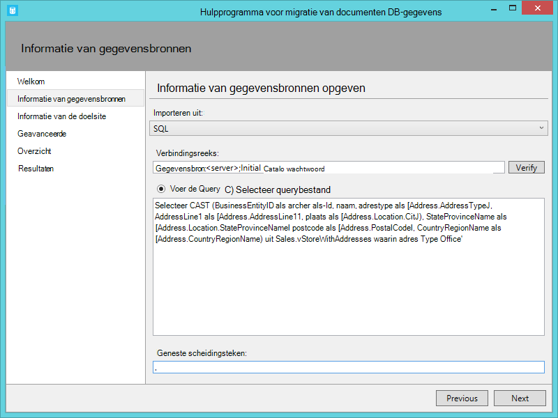
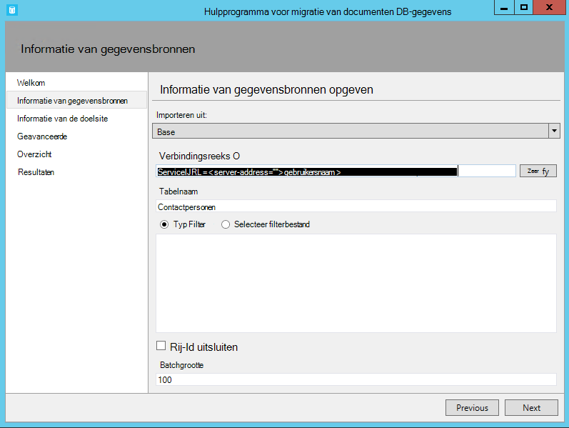

<properties
    pageTitle="Database-Migratiehulpmiddel voor DocumentDB | Microsoft Azure"
    description="Informatie over het gebruik van de bron openen DocumentDB gegevens migratiehulpprogramma's DocumentDB gegevens importeren uit verschillende bronnen, inclusief MongoDB, SQL Server, tabel opslag, Amazon DynamoDB, CSV- en JSON-bestanden. CSV naar JSON-conversie."
    keywords="CSV naar json, hulpmiddelen voor de migratie van databases converteren csv naar json"
    services="documentdb"
    authors="andrewhoh"
    manager="jhubbard"
    editor="monicar"
    documentationCenter=""/>

<tags
    ms.service="documentdb"
    ms.workload="data-services"
    ms.tgt_pltfrm="na"
    ms.devlang="na"
    ms.topic="article"
    ms.date="10/06/2016"
    ms.author="anhoh"/>

# Gegevens importeren in DocumentDB met het migratieprogramma van Database

In dit artikel leest u hoe u het hulpprogramma voor migratie van officiële bron openen DocumentDB gegevens gebruiken om gegevens te importeren naar [Microsoft Azure DocumentDB](https://azure.microsoft.com/services/documentdb/) uit verschillende bronnen, inclusief JSON-bestanden, CSV-bestanden, SQL, MongoDB, Azure-tabelopslag, Amazon DynamoDB en DocumentDB verzamelingen.

Lees dit artikel en kunt u wel de volgende vragen beantwoorden:  

-   Hoe kan ik JSON-bestand, CSV-bestand, SQL Server-gegevens of MongoDB gegevens importeren in DocumentDB?
-   Hoe kan ik gegevens importeren uit de tabel Azure opslag, Amazon DynamoDB en HBase naar DocumentDB?
-   Hoe kan ik gegevens tussen DocumentDB verzamelingen migreren?

##Vereisten voor

Voordat u de instructies in dit artikel te volgen, moet u ervoor zorgen dat u het volgende geïnstalleerd hebt:

- [Microsoft .NET Framework 4,51](https://www.microsoft.com/download/developer-tools.aspx) of hoger.

##Overzicht van het migratieprogramma DocumentDB gegevens

Het migratieprogramma van DocumentDB gegevens is een bron openen-oplossing waarmee gegevens naar DocumentDB uit een verscheidenheid aan bronnen, waaronder:

- JSON-bestanden
- MongoDB
- SQL Server
- CSV-bestanden
- Azure-tabelopslag
- Amazon DynamoDB
- HBase
- DocumentDB verzamelingen

Terwijl het hulpprogramma voor importeren bevat een grafische gebruikersinterface (dtui.exe), kan deze ook worden bepaald vanaf de opdrachtregel (dt.exe). Er is in feite een optie om de uitvoer van de bijbehorende opdracht na het instellen van een import via de gebruikersinterface. In tabelvorm brongegevens (bijvoorbeeld een SQL Server- of CSV-bestanden) kan worden omgezet, zodat de hiërarchische relaties (subdocumenten) kunnen worden gemaakt tijdens het importeren. Lees verder voor meer informatie over de opties van de bronsite, voorbeeld van de lijnen van de opdracht om te importeren uit elke bron, de opties van de doelsite en de weergave importeren resultaten.

##Installatie van het migratieprogramma van DocumentDB gegevens

De migratie hulpmiddel-broncode is beschikbaar op GitHub in [deze bibliotheek](https://github.com/azure/azure-documentdb-datamigrationtool) en een gecompileerde versie is verkrijgbaar via [Microsoft Downloadcentrum](http://www.microsoft.com/downloads/details.aspx?FamilyID=cda7703a-2774-4c07-adcc-ad02ddc1a44d). U kunt de oplossing compileren of gewoon downloaden en extraheren van de gecompileerde versie naar een map van uw keuze. Voer een:

- **Dtui.exe**: grafische gebruikersinterface-versie van het hulpprogramma
- **DT.exe**: opdrachtregel versie van het hulpprogramma

##De JSON-bestanden importeren

De optie importeur JSON voor bron kunt u importeren in een of meer één document JSON bestanden of JSON-bestanden dat elk een matrix van JSON documenten bevatten. Bij het toevoegen van mappen met JSON-bestanden importeren, hebt u de optie van recursief bestanden zoeken in submappen.

Hier volgen enkele voorbeelden van de opdrachtregel JSON-bestanden importeren:

    #Import a single JSON file
    dt.exe /s:JsonFile /s.Files:.\Sessions.json /t:DocumentDBBulk /t.ConnectionString:"AccountEndpoint=<DocumentDB Endpoint>;AccountKey=<DocumentDB Key>;Database=<DocumentDB Database>;" /t.Collection:Sessions /t.CollectionThroughput:2500

    #Import a directory of JSON files
    dt.exe /s:JsonFile /s.Files:C:\TESessions\*.json /t:DocumentDBBulk /t.ConnectionString:" AccountEndpoint=<DocumentDB Endpoint>;AccountKey=<DocumentDB Key>;Database=<DocumentDB Database>;" /t.Collection:Sessions /t.CollectionThroughput:2500

    #Import a directory (including sub-directories) of JSON files
    dt.exe /s:JsonFile /s.Files:C:\LastFMMusic\**\*.json /t:DocumentDBBulk /t.ConnectionString:" AccountEndpoint=<DocumentDB Endpoint>;AccountKey=<DocumentDB Key>;Database=<DocumentDB Database>;" /t.Collection:Music /t.CollectionThroughput:2500

    #Import a directory (single), directory (recursive), and individual JSON files
    dt.exe /s:JsonFile /s.Files:C:\Tweets\*.*;C:\LargeDocs\**\*.*;C:\TESessions\Session48172.json;C:\TESessions\Session48173.json;C:\TESessions\Session48174.json;C:\TESessions\Session48175.json;C:\TESessions\Session48177.json /t:DocumentDBBulk /t.ConnectionString:"AccountEndpoint=<DocumentDB Endpoint>;AccountKey=<DocumentDB Key>;Database=<DocumentDB Database>;" /t.Collection:subs /t.CollectionThroughput:2500

    #Import a single JSON file and partition the data across 4 collections
    dt.exe /s:JsonFile /s.Files:D:\\CompanyData\\Companies.json /t:DocumentDBBulk /t.ConnectionString:"AccountEndpoint=<DocumentDB Endpoint>;AccountKey=<DocumentDB Key>;Database=<DocumentDB Database>;" /t.Collection:comp[1-4] /t.PartitionKey:name /t.CollectionThroughput:2500

##Importeren uit MongoDB

De optie MongoDB bron importeur kunt u importeren uit een afzonderlijke MongoDB verzameling en filter optioneel documenten met behulp van een query en/of de documentstructuur wijzigen met behulp van een raming.  

De verbindingsreeks is in de standaardindeling van MongoDB:

    mongodb://<dbuser>:<dbpassword>@<host>:<port>/<database>

> [AZURE.NOTE] Gebruik de opdracht verifiëren om ervoor te zorgen dat het exemplaar MongoDB is opgegeven in het veld van de tekenreeks verbinding kan worden geopend.

Voer de naam van de verzameling waaruit gegevens worden geïmporteerd. U kunt desgewenst opgeven of bieden van een bestand voor een query (bijvoorbeeld {pop: {$gt: 5000}}) en/of een raming (bijvoorbeeld {loc:0}) zowel filteren en de gegevens worden geïmporteerd.

Hier volgen enkele voorbeelden van de opdrachtregel uit MongoDB importeren:

    #Import all documents from a MongoDB collection
    dt.exe /s:MongoDB /s.ConnectionString:mongodb://<dbuser>:<dbpassword>@<host>:<port>/<database> /s.Collection:zips /t:DocumentDBBulk /t.ConnectionString:"AccountEndpoint=<DocumentDB Endpoint>;AccountKey=<DocumentDB Key>;Database=<DocumentDB Database>;" /t.Collection:BulkZips /t.IdField:_id /t.CollectionThroughput:2500

    #Import documents from a MongoDB collection which match the query and exclude the loc field
    dt.exe /s:MongoDB /s.ConnectionString:mongodb://<dbuser>:<dbpassword>@<host>:<port>/<database> /s.Collection:zips /s.Query:{pop:{$gt:50000}} /s.Projection:{loc:0} /t:DocumentDBBulk /t.ConnectionString:"AccountEndpoint=<DocumentDB Endpoint>;AccountKey=<DocumentDB Key>;Database=<DocumentDB Database>;" /t.Collection:BulkZipsTransform /t.IdField:_id/t.CollectionThroughput:2500

##MongoDB exporteren bestanden importeren

De optie MongoDB exporteren JSON bestand bron importeur kunt u een of meer JSON-bestanden vanuit het hulpprogramma mongoexport geproduceerd importeren.  

Bij het toevoegen van mappen met MongoDB exporteren JSON-bestanden voor importeren, hebt u de optie van recursief bestanden zoeken in submappen.

Hier volgt een voorbeeld van de opdrachtregel uit MongoDB exporteren JSON-bestanden importeren:

    dt.exe /s:MongoDBExport /s.Files:D:\mongoemployees.json /t:DocumentDBBulk /t.ConnectionString:"AccountEndpoint=<DocumentDB Endpoint>;AccountKey=<DocumentDB Key>;Database=<DocumentDB Database>;" /t.Collection:employees /t.IdField:_id /t.Dates:Epoch /t.CollectionThroughput:2500

##Importeren uit SQL Server

De optie SQL bron importeur kunt u importeren uit een afzonderlijke SQL Server-database en filter optioneel de records moeten worden geïmporteerd met behulp van een query. Bovendien kunt u de documentstructuur wijzigen door op te geven van een nesten scheidingsteken (meer op die in even).  

De opmaak van de verbindingsreeks is standaard SQL indeling van de verbindingsreeks.

> [AZURE.NOTE] Gebruik de opdracht verifiëren om ervoor te zorgen dat de SQL Server-instantie die is opgegeven in het veld van de tekenreeks verbinding kan worden geopend.

De nesten scheidingsteken eigenschap gebruikt voor het maken van hiërarchische relaties (onderliggend documenten) tijdens het importeren. Houd rekening met de volgende SQL-query:

*CAST (BusinessEntityID als varchar) selecteert als-Id, naam, adrestype als [Address.AddressType], AddressLine1 als [Address.AddressLine1], plaats als [Address.Location.City], StateProvinceName als [Address.Location.StateProvinceName], postcode als [Address.PostalCode], CountryRegionName als [Address.CountryRegionName] uit Sales.vStoreWithAddresses waar adrestype = 'Hoofdgegeven kantoor'*

Welke geeft als resultaat de volgende (gedeeltelijke) resultaten:

Opmerking de aliassen zoals Address.AddressType en Address.Location.StateProvinceName. Door het opgeven van een scheidingsteken nesten van '.', adres en Address.Location subdocumenten tijdens het importeren Hiermee maakt u het hulpprogramma voor het importeren. Hier volgt een voorbeeld van een document resulterende in DocumentDB:

*{"-id": "956", "naam": "Betere verkoop en Service", "Adres": {"Adrestype": "Hoofdkantoor", "AddressLine1": "#500-75 O'Connor straat", "Locatie": {"Stad": "Canada Ottawa", "StateProvinceName": "Ontario"}, "Postcode": "K4B 1S2", "CountryRegionName": "Canada"}}*

Hier volgen enkele voorbeelden van de opdrachtregel om te importeren uit SQL Server:

    #Import records from SQL which match a query
    dt.exe /s:SQL /s.ConnectionString:"Data Source=<server>;Initial Catalog=AdventureWorks;User Id=advworks;Password=<password>;" /s.Query:"select CAST(BusinessEntityID AS varchar) as Id, * from Sales.vStoreWithAddresses WHERE AddressType='Main Office'" /t:DocumentDBBulk /t.ConnectionString:" AccountEndpoint=<DocumentDB Endpoint>;AccountKey=<DocumentDB Key>;Database=<DocumentDB Database>;" /t.Collection:Stores /t.IdField:Id /t.CollectionThroughput:2500

    #Import records from sql which match a query and create hierarchical relationships
    dt.exe /s:SQL /s.ConnectionString:"Data Source=<server>;Initial Catalog=AdventureWorks;User Id=advworks;Password=<password>;" /s.Query:"select CAST(BusinessEntityID AS varchar) as Id, Name, AddressType as [Address.AddressType], AddressLine1 as [Address.AddressLine1], City as [Address.Location.City], StateProvinceName as [Address.Location.StateProvinceName], PostalCode as [Address.PostalCode], CountryRegionName as [Address.CountryRegionName] from Sales.vStoreWithAddresses WHERE AddressType='Main Office'" /s.NestingSeparator:. /t:DocumentDBBulk /t.ConnectionString:" AccountEndpoint=<DocumentDB Endpoint>;AccountKey=<DocumentDB Key>;Database=<DocumentDB Database>;" /t.Collection:StoresSub /t.IdField:Id /t.CollectionThroughput:2500

##CSV-bestanden - CSV-converteren naar JSON importeren

De optie CSV-bestand bron importeur kunt u een of meer CSV-bestanden importeren. Bij het toevoegen van mappen met CSV-bestanden voor importeren, hebt u de optie van recursief bestanden zoeken in submappen.

Vergelijkbaar met de SQL-bron, de nesten scheidingsteken eigenschap mogelijk hiërarchische om relaties te maken (onderliggend documenten) tijdens het importeren van worden gebruikt. Houd rekening met de volgende CSV-header rij en gegevensrijen:

Opmerking de aliassen zoals DomainInfo.Domain_Name en RedirectInfo.Redirecting. Door het opgeven van een scheidingsteken nesten van '.', maakt het hulpprogramma voor importeren DomainInfo en RedirectInfo subdocumenten tijdens het importeren. Hier volgt een voorbeeld van een document resulterende in DocumentDB:

*{"DomainInfo": {'Domeinnaam': "ACUS.GOV", "Domain_Name_Address": "http://www.ACUS.GOV"}, "Federale instantie": "administratief vergadering van de Verenigde Staten", "RedirectInfo": {'Omleiden': "0', 'Redirect_Destination": ""}, "-id": "9cc565c5-ebcd-1c03-ebd3-cc3e2ecd814d"}*

Het hulpprogramma voor importeren probeert te leiden van gegevens voor de zonder aanhalingstekens waarden in de CSV-bestanden (tussen aanhalingstekens waarden worden altijd behandeld als tekenreeksen).  Typen in de volgende volgorde worden aangeduid: getal, datum-/, Booleaanse waarde.  

Er zijn twee andere dingen te weten over het CSV-importeren:

1.  Standaard zonder aanhalingstekens waarden zijn altijd bijgesneden voor tabs en spaties, terwijl tussen aanhalingstekens waarden als behouden blijven-is. Dit probleem kan worden overschreven met de opties van de opdrachtregel /s.TrimQuoted of het selectievakje spaties.wissen tussen aanhalingstekens waarden.

2.  Standaard wordt een zonder aanhalingstekens null-waarden worden behandeld als een null-waarde. Dit probleem kan worden overschreven (dat wil zeggen een zonder aanhalingstekens null-waarden beschouwd als een tekenreeks 'null') met de geen onderscheid maken zonder aanhalingstekens null-waarden als het selectievakje tekenreeks of de schakeloptie /s.NoUnquotedNulls.

Hier volgt een voorbeeld van de opdrachtregel voor CSV-importeren:

    dt.exe /s:CsvFile /s.Files:.\Employees.csv /t:DocumentDBBulk /t.ConnectionString:"AccountEndpoint=<DocumentDB Endpoint>;AccountKey=<DocumentDB Key>;Database=<DocumentDB Database>;" /t.Collection:Employees /t.IdField:EntityID /t.CollectionThroughput:2500

##Importeren uit Azure-tabelopslag

De optie voor de bron importeur van Azure-tabel opslag kunt u importeren uit een afzonderlijke Azure opslag tabel en filter optioneel de entiteiten tabel moet worden geïmporteerd.  

De opmaak van de verbindingsreeks van de tabel Azure-opslag luidt als volgt:

    DefaultEndpointsProtocol=<protocol>;AccountName=<Account Name>;AccountKey=<Account Key>;

> [AZURE.NOTE] Gebruik de opdracht verifiëren om ervoor te zorgen dat het Azure tabel opslag exemplaar is opgegeven in het veld van de tekenreeks verbinding kan worden geopend.

Voer de naam van de Azure tabel waaruit gegevens worden geïmporteerd. U kunt desgewenst een [filter](https://msdn.microsoft.com/library/azure/ff683669.aspx)opgeven.

De optie tabel Azure opslag bron importeur heeft de volgende extra opties:

1. Interne velden opnemen
    2. All - opnemen alle interne velden (PartitionKey, RowKey en tijdstempel)
    3. Geen: alle interne velden uitsluiten
    4. RowKey - alleen het veld RowKey opnemen
3. Selecteer kolommen
    1. Opslag van Azure tabelfilters bieden geen ondersteuning voor prognoses. Als u importeren alleen specifieke Azure entiteit tabeleigenschappen wilt, kunt u ze aan de lijst kolommen selecteren toevoegt. Alle andere entiteitseigenschappen worden genegeerd.

Hier volgt een voorbeeld van de opdrachtregel uit Azure-tabelopslag importeren:

    dt.exe /s:AzureTable /s.ConnectionString:"DefaultEndpointsProtocol=https;AccountName=<Account Name>;AccountKey=<Account Key>" /s.Table:metrics /s.InternalFields:All /s.Filter:"PartitionKey eq 'Partition1' and RowKey gt '00001'" /s.Projection:ObjectCount;ObjectSize  /t:DocumentDBBulk /t.ConnectionString:" AccountEndpoint=<DocumentDB Endpoint>;AccountKey=<DocumentDB Key>;Database=<DocumentDB Database>;" /t.Collection:metrics /t.CollectionThroughput:2500

##Importeren uit de Amazon DynamoDB

De optie Amazon DynamoDB bron importeur kunt u importeren uit een afzonderlijke Amazon DynamoDB-tabel en filter optioneel de entiteiten moeten worden geïmporteerd. Diverse sjablonen zijn bedoeld om het instellen van een import is zo eenvoudig mogelijk.

De opmaak van de verbindingsreeks Amazon DynamoDB luidt als volgt:

    ServiceURL=<Service Address>;AccessKey=<Access Key>;SecretKey=<Secret Key>;

> [AZURE.NOTE] Gebruik de opdracht verifiëren om ervoor te zorgen dat het exemplaar Amazon DynamoDB is opgegeven in het veld van de tekenreeks verbinding kan worden geopend.

Hier volgt een voorbeeld van de opdrachtregel uit de Amazon DynamoDB importeren:

    dt.exe /s:DynamoDB /s.ConnectionString:ServiceURL=https://dynamodb.us-east-1.amazonaws.com;AccessKey=<accessKey>;SecretKey=<secretKey> /s.Request:"{   """TableName""": """ProductCatalog""" }" /t:DocumentDBBulk /t.ConnectionString:"AccountEndpoint=<DocumentDB Endpoint>;AccountKey=<DocumentDB Key>;Database=<DocumentDB Database>;" /t.Collection:catalogCollection /t.CollectionThroughput:2500

##Bestanden importeren uit Azure-blobopslag

De JSON-bestand, MongoDB exportbestand en CSV-bestand bron importeur opties kunnen u een of meer bestanden importeren uit Azure-blobopslag. Nadat u een Blob container URL en de Accountsleutel, vindt u gewoon een reguliere expressie om te selecteren van de bestanden te importeren.

Hier ziet u een voorbeeld van de opdrachtregel JSON-bestanden van Azure-blobopslag importeren:

    dt.exe /s:JsonFile /s.Files:"blobs://<account key>@account.blob.core.windows.net:443/importcontainer/.*" /t:DocumentDBBulk /t.ConnectionString:"AccountEndpoint=<DocumentDB Endpoint>;AccountKey=<DocumentDB Key>;Database=<DocumentDB Database>;" /t.Collection:doctest

##Importeren uit DocumentDB

De optie DocumentDB bron importeur kunt u gegevens importeren uit een of meer DocumentDB verzamelingen en filter optioneel documenten met behulp van een query.  

De opmaak van de verbindingsreeks DocumentDB luidt als volgt:

    AccountEndpoint=<DocumentDB Endpoint>;AccountKey=<DocumentDB Key>;Database=<DocumentDB Database>;

De DocumentDB account verbindingsreeks uit het blad toetsen van de Azure portal kan worden opgehaald, zoals wordt beschreven in [het beheren van een DocumentDB-account](documentdb-manage-account.md), echter de naam van de database moet worden toegevoegd aan de verbindingsreeks in de volgende indeling:

    Database=<DocumentDB Database>;

> [AZURE.NOTE] Gebruik de opdracht verifiëren om ervoor te zorgen dat het exemplaar DocumentDB is opgegeven in het veld van de tekenreeks verbinding kan worden geopend.

Als u wilt importeren uit een enkel DocumentDB verzameling, voer de naam van de verzameling waaruit gegevens worden geïmporteerd. Als u wilt importeren vanuit meerdere DocumentDB verzamelingen, bieden u een reguliere expressie zodat deze overeenkomen met een of meer namen van de siteverzameling (bijvoorbeeld collection01 | collection02 | collection03). U kunt desgewenst opgeven of bieden van een bestand voor een query in zowel filteren en vormen de gegevens die moeten worden geïmporteerd.

> [AZURE.NOTE] Aangezien het veld siteverzameling reguliere expressies, accepteert als u wilt importeren uit een enkele verzameling waarvan de naam reguliere expressietekens bevat, moeten klikt u vervolgens deze tekens worden voorafgegaan dienovereenkomstig gewijzigd.

De optie DocumentDB bron importeur heeft de volgende geavanceerde opties:

1. Interne velden bevatten: Hiermee geeft u al dan niet te DocumentDB document Systeemeigenschappen opnemen in de export (bijvoorbeeld _rid, _ts).
2. Aantal nieuwe pogingen op mislukt: Hiermee wordt opgegeven hoe vaak de verbinding met DocumentDB voor het geval tijdelijke fouten (bijvoorbeeld netwerk connectivity onderbroken) opnieuw uit te voeren.
3. Interval voor nieuwe pogingen: Geeft aan hoe lang wachten tussen opnieuw de verbinding met DocumentDB voor het geval tijdelijke fouten (bijvoorbeeld netwerk connectivity onderbroken).
4. Verbindingsmodus: Hiermee geeft u de verbindingsmodus voor gebruik met DocumentDB. De beschikbare opties zijn DirectTcp, DirectHttps en Gateway. De opties voor de directe verbinding zijn sneller, terwijl de gateway-modus meer firewall beschrijvende, is zoals alleen poort 443 wordt.

> [AZURE.TIP] Het hulpprogramma voor importeren standaard verbindingsmodus DirectTcp. Als u firewall problemen ondervindt, overschakelen naar verbindingsmodus Gateway, zoals alleen poort 443 hoeft.

Hier volgen enkele voorbeelden van de opdrachtregel uit DocumentDB importeren:

    #Migrate data from one DocumentDB collection to another DocumentDB collections
    dt.exe /s:DocumentDB /s.ConnectionString:"AccountEndpoint=<DocumentDB Endpoint>;AccountKey=<DocumentDB Key>;Database=<DocumentDB Database>;" /s.Collection:TEColl /t:DocumentDBBulk /t.ConnectionString:" AccountEndpoint=<DocumentDB Endpoint>;AccountKey=<DocumentDB Key>;Database=<DocumentDB Database>;" /t.Collection:TESessions /t.CollectionThroughput:2500

    #Migrate data from multiple DocumentDB collections to a single DocumentDB collection
    dt.exe /s:DocumentDB /s.ConnectionString:"AccountEndpoint=<DocumentDB Endpoint>;AccountKey=<DocumentDB Key>;Database=<DocumentDB Database>;" /s.Collection:comp1|comp2|comp3|comp4 /t:DocumentDBBulk /t.ConnectionString:"AccountEndpoint=<DocumentDB Endpoint>;AccountKey=<DocumentDB Key>;Database=<DocumentDB Database>;" /t.Collection:singleCollection /t.CollectionThroughput:2500

    #Export a DocumentDB collection to a JSON file
    dt.exe /s:DocumentDB /s.ConnectionString:"AccountEndpoint=<DocumentDB Endpoint>;AccountKey=<DocumentDB Key>;Database=<DocumentDB Database>;" /s.Collection:StoresSub /t:JsonFile /t.File:StoresExport.json /t.Overwrite /t.CollectionThroughput:2500

##Importeren uit HBase

De optie HBase bron importeur kunt u gegevens importeren uit een tabel HBase en desgewenst de gegevens te filteren. Diverse sjablonen zijn bedoeld om het instellen van een import is zo eenvoudig mogelijk.

De opmaak van de verbindingsreeks HBase Stargate luidt als volgt:

    ServiceURL=<server-address>;Username=<username>;Password=<password>

> [AZURE.NOTE] Gebruik de opdracht verifiëren om ervoor te zorgen dat het exemplaar HBase is opgegeven in het veld van de tekenreeks verbinding kan worden geopend.

Hier volgt een voorbeeld van de opdrachtregel uit HBase importeren:

    dt.exe /s:HBase /s.ConnectionString:ServiceURL=<server-address>;Username=<username>;Password=<password> /s.Table:Contacts /t:DocumentDBBulk /t.ConnectionString:"AccountEndpoint=<DocumentDB Endpoint>;AccountKey=<DocumentDB Key>;Database=<DocumentDB Database>;" /t.Collection:hbaseimport

##Importeren naar DocumentDB (bulksgewijs importeren)

De importeur DocumentDB bulksgewijs kunt u importeren uit een van de bronopties beschikbaar, met behulp van een DocumentDB opgeslagen procedure voor efficiency. Het hulpmiddel ondersteunt importeren aan één enkel partitioneren DocumentDB verzameling, maar ook een laptopgeheugen importeren, waarbij de gegevens in meerdere siteverzamelingen van één partitioneren DocumentDB is partitioneren. Zie voor meer informatie over het partitioneren van gegevens, [partitionering en schaal in Azure DocumentDB](documentdb-partition-data.md). Het hulpmiddel wordt maken, uitvoeren en vervolgens de opgeslagen procedure uit de doellijst collection(s) verwijdert.  

De opmaak van de verbindingsreeks DocumentDB luidt als volgt:

    AccountEndpoint=<DocumentDB Endpoint>;AccountKey=<DocumentDB Key>;Database=<DocumentDB Database>;

De DocumentDB account verbindingsreeks uit het blad toetsen van de Azure portal kan worden opgehaald, zoals wordt beschreven in [het beheren van een DocumentDB-account](documentdb-manage-account.md), echter de naam van de database moet worden toegevoegd aan de verbindingsreeks in de volgende indeling:

    Database=<DocumentDB Database>;

> [AZURE.NOTE] Gebruik de opdracht verifiëren om ervoor te zorgen dat het exemplaar DocumentDB is opgegeven in het veld van de tekenreeks verbinding kan worden geopend.

Als u wilt importeren in één collectie, voer de naam van de verzameling waaraan gegevens worden geïmporteerd en klik op de knop toevoegen. Als u wilt importeren in meerdere siteverzamelingen, voer de naam van elke siteverzameling afzonderlijk of gebruik de volgende syntaxis om op te geven van meerdere siteverzamelingen: *collection_prefix*[beginindex - einde-index]. Wanneer u meerdere siteverzamelingen via de syntaxis van de bovengenoemde opgeeft, houd u het volgende in gedachten:

1. Alleen geheel getal bereik naam patronen worden ondersteund. Bijvoorbeeld siteverzameling [0-3] geven de volgende collecties zullen produceren: collection0, collection1, collection2, collection3.
2. U kunt een verkorte syntaxis: [3] siteverzameling dezelfde reeks verzamelingen die worden genoemd in stap 1 worden verzonden.
3. Meer dan één vervanging kan worden verstrekt. Siteverzameling [0-1] [0-9] genereert bijvoorbeeld 20 siteverzamelingen namen met voorloopnullen (collection01, … 02... 03).

Wanneer u de namen van de siteverzameling zijn opgegeven, kiest u de gewenste doorvoer van de collection(s) (400 RUs naar 10.000 RUs). Voor de beste prestaties importeren, kies een sneller worden verwerkt. Zie voor meer informatie over prestaties, [prestatieniveaus in DocumentDB](documentdb-performance-levels.md).

> [AZURE.NOTE] De prestaties doorvoer instelling geldt alleen voor maken van een siteverzameling. Als de opgegeven siteverzameling al bestaat, wordt de doorvoer niet worden gewijzigd.

Wanneer u in meerdere siteverzamelingen importeert, wordt in de importeren hulpmiddel ondersteunt hash sharding gebaseerd. Geef in dit scenario de documenteigenschap die u wilt gebruiken als de sleutel Partition (als partitiesleutel leeg is, documenten nog niet een laptopgeheugen willekeurig in de doel-verzamelingen).

U kunt desgewenst opgeven welk veld in de bron van het importeren moet worden gebruikt als de eigenschap DocumentDB document-id tijdens het importeren (Let erop dat als documenten deze eigenschap niet bevatten, klikt u vervolgens het hulpprogramma voor importeren een GUID als de waarde van de eigenschap id genereert).

Er zijn een aantal geavanceerde opties beschikbaar tijdens het importeren. Eerst terwijl het hulpmiddel bevat een standaard-bulksgewijs importeren opgeslagen procedure (BulkInsert.js), u kunt uw eigen importeren die zijn opgeslagen procedure opgeven:

 

Daarnaast kunnen bij het importeren van datumtypen (bijvoorbeeld van SQL Server of MongoDB), kunt u kiezen tussen drie opties voor importeren:

 

-   Tekenreeks: Opgeslagen als een tekenreekswaarde
-   Epoche: Opgeslagen als een getal dat wordt opgehaald epoche
-   Beide: Tekenreeks zowel epoche getalwaarden behouden. Deze optie maakt u een subdocument, bijvoorbeeld: "date_joined": {"Value": "2013-10-21T21:17:25.2410000Z", "epoche": 1382390245}

De importeur DocumentDB bulksgewijs heeft de volgende handelingen uit als u meer geavanceerde opties:

1. Batchgrootte: Het hulpprogramma's voor de batchgrootte van een van 50 is standaard.  Als de documenten moeten worden geïmporteerd groot zijn, kunt u de batchgrootte verlagen. Als de documenten die u wilt importeren kleine zijn, moet u daarentegen kunt de batchgrootte verhogen.
2. Max Script grootte (bytes): het hulpmiddel standaardinstellingen voor een script op maximale grootte van 512KB
3. Automatische-Id-generatie uitschakelen: Als elk document moet worden geïmporteerd, een id-veld bevat, klikt u vervolgens op deze optie kunt prestaties verbeteren. Ontbrekende een unieke id-veld worden niet geïmporteerd.
4. Update bestaande documenten: Het hulpmiddel standaard niet vervangen door een bestaande documenten ID-conflicten. U deze optie selecteert, wordt alle bestaande documenten overschrijven met identieke id's toestaan. Deze functie is handig voor geplande gegevens-mailmigraties die bijwerken van bestaande documenten.
5. Aantal nieuwe pogingen op mislukt: Hiermee wordt opgegeven hoe vaak de verbinding met DocumentDB voor het geval tijdelijke fouten (bijvoorbeeld netwerk connectivity onderbroken) opnieuw uit te voeren.
6. Interval voor nieuwe pogingen: Geeft aan hoe lang wachten tussen opnieuw de verbinding met DocumentDB voor het geval tijdelijke fouten (bijvoorbeeld netwerk connectivity onderbroken).
7. Verbindingsmodus: Hiermee geeft u de verbindingsmodus voor gebruik met DocumentDB. De beschikbare opties zijn DirectTcp, DirectHttps en Gateway. De opties voor de directe verbinding zijn sneller, terwijl de gateway-modus meer firewall beschrijvende, is zoals alleen poort 443 wordt.

> [AZURE.TIP] Het hulpprogramma voor importeren standaard verbindingsmodus DirectTcp. Als u firewall problemen ondervindt, overschakelen naar verbindingsmodus Gateway, zoals alleen poort 443 hoeft.

##Importeren naar DocumentDB (opeenvolgende Record importeren)

De DocumentDB opeenvolgende record importeur kunt u importeren uit een van de bronopties beschikbaar op basis van de record na record. U kunt deze optie als u wilt importeren naar een bestaande collectie die zijn quotum van opgeslagen procedures heeft bereikt. Het hulpmiddel ondersteunt importeren met een afzonderlijke (enkel-partition en meerdere partition) DocumentDB siteverzameling, ook als een laptopgeheugen waarbij gegevens in meerdere siteverzamelingen voor één partition en/of meerdere partition DocumentDB is partitioneren importeren. Zie voor meer informatie over het partitioneren van gegevens, [partitionering en schaal in Azure DocumentDB](documentdb-partition-data.md).

De opmaak van de verbindingsreeks DocumentDB luidt als volgt:

    AccountEndpoint=<DocumentDB Endpoint>;AccountKey=<DocumentDB Key>;Database=<DocumentDB Database>;

De DocumentDB account verbindingsreeks uit het blad toetsen van de Azure portal kan worden opgehaald, zoals wordt beschreven in [het beheren van een DocumentDB-account](documentdb-manage-account.md), echter de naam van de database moet worden toegevoegd aan de verbindingsreeks in de volgende indeling:

    Database=<DocumentDB Database>;

> [AZURE.NOTE] Gebruik de opdracht verifiëren om ervoor te zorgen dat het exemplaar DocumentDB is opgegeven in het veld van de tekenreeks verbinding kan worden geopend.

Als u wilt importeren in één collectie, voer de naam van de verzameling waaraan gegevens worden geïmporteerd en klik op de knop toevoegen. Als u wilt importeren in meerdere siteverzamelingen, voer de naam van elke siteverzameling afzonderlijk of gebruik de volgende syntaxis om op te geven van meerdere siteverzamelingen: *collection_prefix*[beginindex - einde-index]. Wanneer u meerdere siteverzamelingen via de syntaxis van de bovengenoemde opgeeft, houd u het volgende in gedachten:

1. Alleen geheel getal bereik naam patronen worden ondersteund. Bijvoorbeeld siteverzameling [0-3] geven de volgende collecties zullen produceren: collection0, collection1, collection2, collection3.
2. U kunt een verkorte syntaxis: [3] siteverzameling dezelfde reeks verzamelingen die worden genoemd in stap 1 worden verzonden.
3. Meer dan één vervanging kan worden verstrekt. Siteverzameling [0-1] [0-9] genereert bijvoorbeeld 20 siteverzamelingen namen met voorloopnullen (collection01, … 02... 03).

Wanneer u de namen van de siteverzameling zijn opgegeven, kiest u de gewenste doorvoer van de collection(s) (400 RUs naar 250.000 RUs). Voor de beste prestaties importeren, kies een sneller worden verwerkt. Zie voor meer informatie over prestaties, [prestatieniveaus in DocumentDB](documentdb-performance-levels.md). Een importeren collecties met doorvoer > 10.000 RUs vereist een partitiesleutel. Als u besluit om meer dan 250.000 RUs hebt, raadpleegt u [limieten van DocumentDB verhoogd aanvragen](documentdb-increase-limits.md).

> [AZURE.NOTE] De instelling doorvoer geldt alleen voor maken van een siteverzameling. Als de opgegeven siteverzameling al bestaat, wordt de doorvoer niet worden gewijzigd.

Wanneer u in meerdere siteverzamelingen importeert, wordt in de importeren hulpmiddel ondersteunt hash sharding gebaseerd. Geef in dit scenario de documenteigenschap die u wilt gebruiken als de sleutel Partition (als partitiesleutel leeg is, documenten nog niet een laptopgeheugen willekeurig in de doel-verzamelingen).

U kunt desgewenst opgeven welk veld in de bron van het importeren moet worden gebruikt als de eigenschap DocumentDB document-id tijdens het importeren (Let erop dat als documenten deze eigenschap niet bevatten, klikt u vervolgens het hulpprogramma voor importeren een GUID als de waarde van de eigenschap id genereert).

Er zijn een aantal geavanceerde opties beschikbaar tijdens het importeren. Eerst bij het importeren van datumtypen (bijvoorbeeld van SQL Server of MongoDB), kunt u kiezen tussen drie opties voor importeren:

 

-   Tekenreeks: Opgeslagen als een tekenreekswaarde
-   Epoche: Opgeslagen als een getal dat wordt opgehaald epoche
-   Beide: Tekenreeks zowel epoche getalwaarden behouden. Deze optie maakt u een subdocument, bijvoorbeeld: "date_joined": {"Value": "2013-10-21T21:17:25.2410000Z", "epoche": 1382390245}

De DocumentDB - opeenvolgende record importeur heeft de volgende extra geavanceerde opties:

1. Aantal parallelle aanvragen: het hulpmiddel standaard 2 parallelle aanvragen. Als de documenten die moeten worden geïmporteerd klein zijn, kunt u het aantal parallelle aanvragen verhogen. Houd er rekening mee dat als dit nummer te veel wordt verheven, het importeren beperken waarnemen.
2. Automatische-Id-generatie uitschakelen: Als elk document moet worden geïmporteerd, een id-veld bevat, klikt u vervolgens op deze optie kunt prestaties verbeteren. Ontbrekende een unieke id-veld worden niet geïmporteerd.
3. Update bestaande documenten: Het hulpmiddel standaard niet vervangen door een bestaande documenten ID-conflicten. U deze optie selecteert, wordt alle bestaande documenten overschrijven met identieke id's toestaan. Deze functie is handig voor geplande gegevens-mailmigraties die bijwerken van bestaande documenten.
4. Aantal nieuwe pogingen op mislukt: Hiermee wordt opgegeven hoe vaak de verbinding met DocumentDB voor het geval tijdelijke fouten (bijvoorbeeld netwerk connectivity onderbroken) opnieuw uit te voeren.
5. Interval voor nieuwe pogingen: Geeft aan hoe lang wachten tussen opnieuw de verbinding met DocumentDB voor het geval tijdelijke fouten (bijvoorbeeld netwerk connectivity onderbroken).
6. Verbindingsmodus: Hiermee geeft u de verbindingsmodus voor gebruik met DocumentDB. De beschikbare opties zijn DirectTcp, DirectHttps en Gateway. De opties voor de directe verbinding zijn sneller, terwijl de gateway-modus meer firewall beschrijvende, is zoals alleen poort 443 wordt.

> [AZURE.TIP] Het hulpprogramma voor importeren standaard verbindingsmodus DirectTcp. Als u firewall problemen ondervindt, overschakelen naar verbindingsmodus Gateway, zoals alleen poort 443 hoeft.

##Een indexing beleid opgeven bij het maken van DocumentDB verzamelingen

Wanneer u het migratiehulpprogramma uitvoert siteverzamelingen maken tijdens het importeren van toestaat, kunt u het indexeren beleid van de verzamelingen opgeven. In de geavanceerde opties gedeelte van de DocumentDB bulksgewijs importeren en DocumentDB opeenvolgende record opties, navigeer naar de sectie beleid voor het indexeren.

Het indexeren beleid geavanceerde optie gebruikt, kunt u selecteren een indexing beleidsbestand, handmatig een indexing beleid invoeren of kiezen uit een reeks standaardsjablonen (met de rechtermuisknop te klikken in het tekstvak met de indexing beleid).

De sjablonen voor die het hulpmiddel biedt zijn:

- Standaard. Dit beleid wordt aangeraden wanneer u uitvoeren van query's gelijke ten opzichte van tekenreeksen en ORDER BY, bereik en gelijkheidstype: query's gebruikt voor getallen. Dit beleid heeft een lagere index opslag realiseren dan bereik.
- Bereik. Dit beleid is aanbevolen dat u ORDER BY, bereik en gelijkheidstype: query's gebruikt op zowel getallen als tekenreeksen. Dit beleid heeft een hogere index opslag realiseren dan standaard of Hash.

> [AZURE.NOTE] Als u een indexing beleid niet opgeeft, wordt het standaardbeleid worden toegepast. Zie voor meer informatie over indexing beleid [DocumentDB indexing beleid](documentdb-indexing-policies.md).

## Exporteren naar JSON-bestand

De exporteur DocumentDB JSON kunt u een van de bronopties beschikbaar exporteren naar een JSON-bestand dat een matrix van JSON documenten bevat. Het hulpmiddel verwerkt de export voor u of u kunt kiezen om te bekijken van de resulterende migratie-opdracht en voert u de opdracht zelf. De resulterende JSON-bestand kan worden opgeslagen lokaal of in Azure-blobopslag.

U kunt desgewenst de resulterende JSON, waarin de grootte van het uiteindelijke document neemt, terwijl u de inhoud meer prettify leesbaar.

    Standard JSON export
    [{"id":"Sample","Title":"About Paris","Language":{"Name":"English"},"Author":{"Name":"Don","Location":{"City":"Paris","Country":"France"}},"Content":"Don's document in DocumentDB is a valid JSON document as defined by the JSON spec.","PageViews":10000,"Topics":[{"Title":"History of Paris"},{"Title":"Places to see in Paris"}]}]

    Prettified JSON export
    [
    {
    "id": "Sample",
    "Title": "About Paris",
    "Language": {
      "Name": "English"
    },
    "Author": {
      "Name": "Don",
      "Location": {
        "City": "Paris",
        "Country": "France"
      }
    },
    "Content": "Don's document in DocumentDB is a valid JSON document as defined by the JSON spec.",
    "PageViews": 10000,
    "Topics": [
      {
        "Title": "History of Paris"
      },
      {
        "Title": "Places to see in Paris"
      }
    ]
    }]

## Geavanceerde configuratie

Geef de locatie van het logboekbestand waarop u eventuele fouten geschreven wilt laten in het scherm Geavanceerde configuratie. De volgende regels van toepassing op deze pagina:

1.  Als een bestandsnaam is opgegeven, worden alle fouten op de pagina resultaten worden geretourneerd.
2.  Als een bestandsnaam wordt geleverd zonder een map, wordt klikt u vervolgens het bestand gemaakt (of overschreven) in de huidige map van de omgeving.
3.  Als u een bestaand bestand en klik op het bestand wordt overschreven, er is geen toevoegquery.

Kies of u aan te melden, kritieke, of er geen foutberichten. Tot slot kunt u bepalen hoe vaak de aan scherm doorverbinden bericht wordt bijgewerkt met de voortgang daarvan.

    

## Controleer of importinstellingen en de opdrachtregel weergeven

1. Nadat u de informatie van gegevensbronnen, doelinformatie en geavanceerde configuratie, Controleer de migratie samenvatting en, (optioneel) / kopie weergeven de resulterende migratie-opdracht (de opdracht kopiëren is handig om te automatiseren importbewerkingen):

    

    

2. Als u tevreden met de bronsite en doelsites opties bent, klik op **importeren**. De verstreken tijd, overgedragen tellen en mislukt gegevens (als u een bestandsnaam in de geavanceerde configuratie niet opgeeft) worden bijgewerkt via tijdens het importeren uitgevoerd wordt. Als voltooid, kunt u de resultaten exporteren (bijvoorbeeld te handelen eventuele fouten importeren).

    

3. U mogelijk ook een nieuwe importeren starten te behouden de bestaande instellingen (bijvoorbeeld verbinding tekenreeks informatie, bronsite en doelsites keuze, enzovoort) of opnieuw instellen van alle waarden.

    

## Volgende stappen

- Meer informatie over DocumentDB, raadpleegt u het [Leerpad](https://azure.microsoft.com/documentation/learning-paths/documentdb/).
