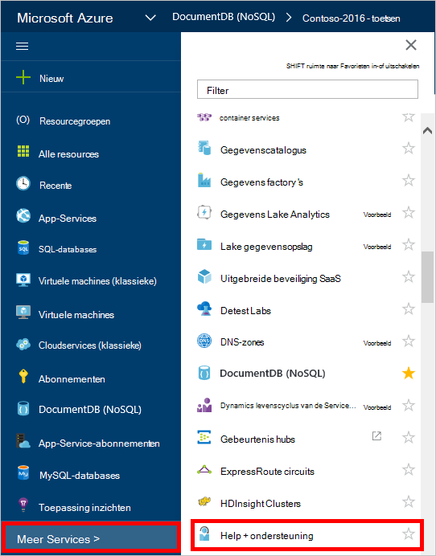
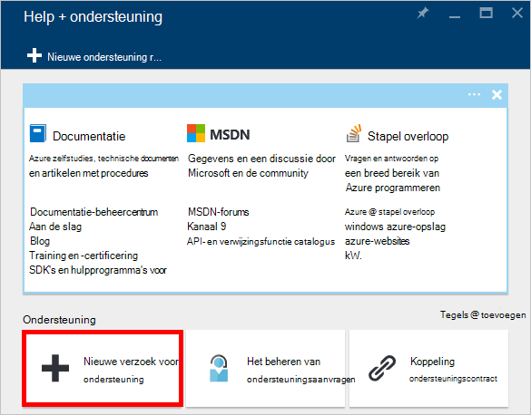
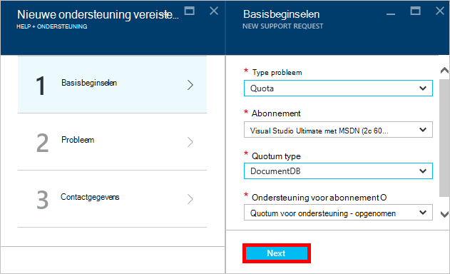
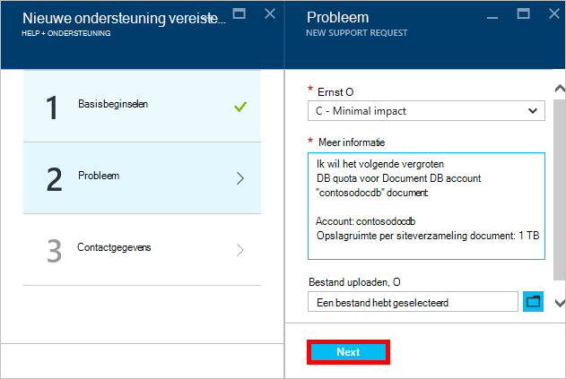
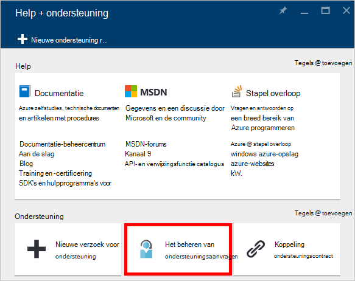

<properties
    pageTitle="Verzoek om betere DocumentDB account quota | Microsoft Azure"
    description="Meer informatie over het aanvragen van een aanpassing DocumentDB database quota's zoals opslag van documenten en doorvoer per siteverzameling."
    services="documentdb"
    authors="AndrewHoh"
    manager="jhubbard"
    editor="monicar"
    documentationCenter=""/>

<tags
    ms.service="documentdb"
    ms.workload="data-services"
    ms.tgt_pltfrm="na"
    ms.devlang="na"
    ms.topic="article"
    ms.date="08/25/2016"
    ms.author="anhoh"/>

# Verbeterde DocumentDB limieten aanvragen

[Microsoft Azure DocumentDB](https://azure.microsoft.com/services/documentdb/) heeft een reeks standaard quota's die kunnen worden gecorrigeerd door contact opneemt met Azure ondersteuning.  In dit artikel leest over het aanvragen van een stijging van het quotum.

Lees dit artikel en kunt u wel de volgende vragen beantwoorden:  

-   Welke DocumentDB database quota's kunnen worden aangepast contact opnemen met ondersteuning voor Azure?
-   Hoe kan ik een correctie DocumentDB rekening quotum aanvragen?

##Quota voor DocumentDB-account

De volgende tabel beschrijft de quota DocumentDB. De quota's met een sterretje (*) kunnen worden gecorrigeerd door contact opneemt met Azure ondersteuning:

[AZURE.INCLUDE [azure-documentdb-limits](../../includes/azure-documentdb-limits.md)]

##Een correctie quotum aanvragen
De volgende stappen weergeven over het aanvragen van een correctie quotum.

1. Klik in de [portal van Azure](https://portal.azure.com)op **Meer Services**en klik vervolgens op **Help + ondersteuning**.

    

2. Klik in het blad **Help + ondersteuning** op **nieuwe aanvraag ondersteuning**.

    

3. Klik in het blad **nieuwe aanvraag ondersteuning** op **Basisbeginselen**. Volgende, ingestelde **type probleem** naar **Quotum**, **abonnement** aan uw abonnement waarop uw DocumentDB-account, **Quotum type** naar **DocumentDB**, en **ondersteuning voor abonnement** naar de **Quota ondersteuning - opgenomen**. Klik vervolgens op **volgende**.

    

4. In het blad **probleem** , kiest u een ernst en informatie over uw grotere quotum opnemen in **Details**. Klik op **volgende**.

    

5. Ten slotte Vul uw contactgegevens in het blad **informatie over de contactpersoon** en klik op **maken**.

Zodra de ondersteuningsticket is gemaakt, moet u het nummer van de aanvraag ondersteuning via e-mail ontvangen.  U kunt ook het verzoek voor ondersteuning weergeven door te klikken op **beheren ondersteuning aanvragen** in het blad **Help + ondersteuning** .

##Volgende stappen
- Meer informatie over DocumentDB, klikt u op [hier](http://azure.com/docdb).
