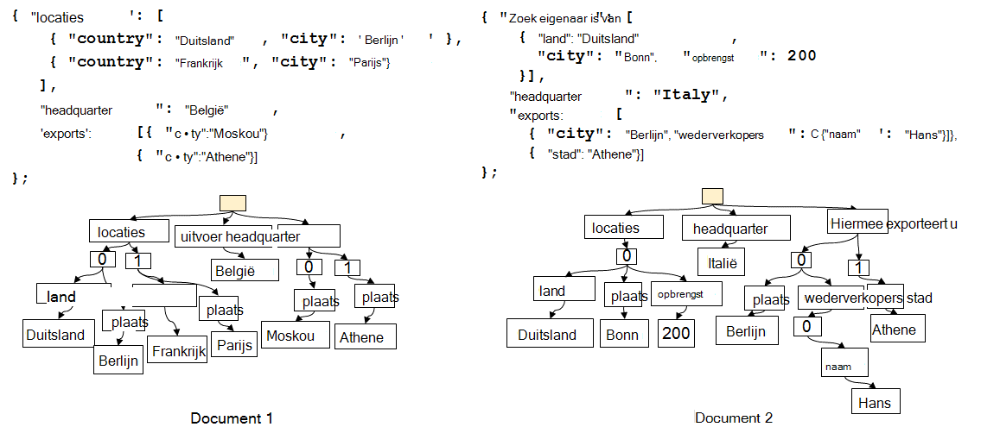
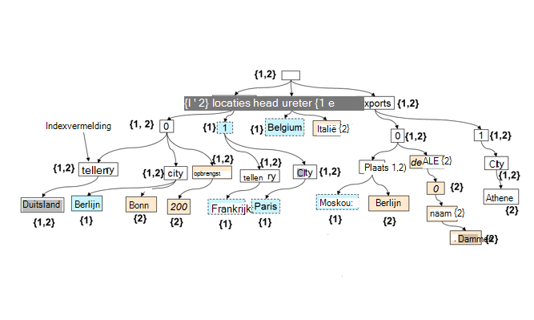

<properties 
    pageTitle="Automatische indexering in DocumentDB | Microsoft Azure" 
    description="Meer informatie over hoe automatische indexing werkt in Azure DocumentDB." 
    services="documentdb" 
    authors="arramac" 
    manager="jhubbard" 
    editor="mimig" 
    documentationCenter=""/>

<tags 
    ms.service="documentdb" 
    ms.workload="data-services" 
    ms.tgt_pltfrm="na" 
    ms.devlang="na" 
    ms.topic="article" 
    ms.date="10/27/2016" 
    ms.author="arramac"/>
    
# Automatische indexering in Azure DocumentDB

In dit artikel is overgenomen van het papier [' Schema Agnostic indexeren met Azure DocumentDB '](http://www.vldb.org/pvldb/vol8/p1668-shukla.pdf) , die wordt weergegeven op de [41e interne vergadering op zeer grote Databases](http://www.vldb.org/2015/) tussen 31 augustus - September 4 2015 verlengt, en wordt een inleiding in het indexeren werkt in Azure DocumentDB. 

Lees dit en wordt u de volgende vragen beantwoorden:

- Hoe DocumentDB het schema van een document JSON afgeleid?
- Hoe DocumentDB een index maken in verschillende documenten?
- Hoe voert DocumentDB automatische indexeren bij het op schaal?

##Hoe DocumentDB indexeren werkt

[Microsoft Azure DocumentDB](https://azure.microsoft.com/services/documentdb/) is een waar schema-vrije database doel die is ingebouwd voor JSON. Deze niet verwacht of een schema of secundaire index definities index gegevens op schaal vereisen. Hiermee kunt u snel wilt definiëren en doorgaan met het ontwikkelen van toepassingen gegevensmodellen DocumentDB gebruiken. Als u documenten aan een siteverzameling toevoegen, indexeert DocumentDB automatisch alle documenteigenschappen zodat ze beschikbaar voor u op query zijn. Automatische indexering, kunt u voor het opslaan van documenten die horen bij volledig willekeurige schema's zonder bang schema's maken of secundaire indexen.

Met een doel om zo de impedantie verkeerde combinaties tussen de database en de application programming modellen te onderdrukken, misbruik DocumentDB de eenvoudig te JSON en bijbehorende gebrek aan een schemaspecificatie. Dit zorgt ervoor dat er geen hypothesen over de documenten en kan documenten binnen een verzameling DocumentDB naar variëren in schema, naast de specifieke exemplaarwaarden. In tegenstelling tot andere databases document werkt DocumentDB van database-engine rechtstreeks op het niveau van JSON grammatica resterende agnostische het concept van een documentschema en vervaging van de rand tussen de structuur en exemplaar waarden van documenten. Deze, in omslaan, kunnen deze moeten worden automatisch geïndexeerd documenten zonder schema of secundaire indexen.

Het indexeren in DocumentDB maakt gebruik van het feit dat documenten kunnen worden **weergegeven als bomen**in JSON grammatica is toegestaan. Een pop hoofdsite knooppunt moet worden gemaakt waarin de rest van de werkelijke knooppunten in het document onder parents voor een JSON-document wordt weergegeven als een structuur. Elk etiket met inbegrip van de matrix indexen worden in een document JSON wordt een knooppunt in de boomstructuur. De onderstaande afbeelding ziet u een voorbeeld JSON-document en de bijbehorende boomstructuur.

>[AZURE.NOTE] Aangezien JSON XML gebruikgemaakt van codes dat wil zeggen elk document bevat zowel de schema (metagegevens) en de gegevens, bijvoorbeeld `{"locationId": 5, "city": "Moscow"}` klikt, worden er zijn twee eigenschappen `locationId` en `city`, en dat ze een eigenschap tekenreeks en numerieke waarden hebben. DocumentDB kan leiden van het schema van documenten en indexeren ze wanneer ze worden ingevoegd of vervangen, zonder dat u ooit om schema's maken of secundaire indexen te definiëren.

**JSON-documenten als bomen:**

Bijvoorbeeld in het bovenstaande voorbeeld:

- De JSON-eigenschap `{"headquarters": "Belgium"}` eigenschap in het bovenstaande voorbeeld komt overeen met het pad/headquarters/België.
- De JSON-matrix `{"exports": [{"city": “Moscow"}`, `{"city": Athens"}]}` overeenkomt met de paden `/exports/[]/city/Moscow` en `/exports/[]/city/Athens`.

Met automatisch indexeren, (1) elke pad in de documentstructuur van een wordt geïndexeerd (tenzij de ontwikkelaar heeft expliciet geconfigureerd voor het indexeren beleid als u wilt uitsluiten van bepaalde patronen pad). (2) elke update van een document aan een verzameling DocumentDB leidt tot het bijwerken van de structuur van de index (dat wil zeggen oorzaken toevoegen of verwijderen van knooppunten). Een van de primaire vereisten van automatische indexeren van documenten is om ervoor te zorgen dat de kosten als u wilt indexeren en een document met zeer geneste structuur query, zeg 10 niveaus, is hetzelfde als die van een platte JSON-document, bestaande uit sleutel-waardeparen slechts één niveau. Een weergave genormaliseerde pad dus het fundament waarop beide automatische indexering en query subsystemen worden gemaakt.

Een belangrijke implicatie van verwerking van beide met de waarden van het schema en exemplaar dat gelijkmatig tussen paden is dat logisch net als de afzonderlijke documenten, een index van de twee documenten weergegeven die een kaart tussen paden blijft en de document-id's met die pad kunnen ook worden weergegeven als een structuur. DocumentDB wordt dit feit voor het maken van een index-structuur die wordt opgesteld afmelden bij de Unie van alle bomen dat staat voor afzonderlijke documenten binnen de verzameling. De structuur van de index in DocumentDB verzamelingen in omvang groeit na verloop van tijd wanneer nieuwe documenten krijgen toegevoegd of naar de siteverzameling bijgewerkt.

**DocumentDB Index als een structuur:**

Ondanks dat wordt schema-vrij te geven, DocumentDB van SQL- en JavaScript query talen relationele prognoses en filters, hiërarchische navigatie bieden over documenten, ruimte bewerkingen en aanroep van UDF's geheel in JavaScript geschreven. Van de DocumentDB query runtime kan deze query's ondersteunen omdat deze tegen deze index boomstructuur van de gegevens rechtstreeks kunt werken.

Het standaardbeleid voor indexing automatisch indexeert alle eigenschappen van alle documenten en biedt consistente query's (dat wil zeggen de index synchroon wordt bijgewerkt met het schrijven van het document). Hoe ondersteunt DocumentDB consistente updates voor de index-structuur bij het op schaal? DocumentDB schrijven geoptimaliseerd gebruikt, lock gratis en log gestructureerd index onderhoud technieken. Dit betekent dat DocumentDB een continue hoeveelheid snel schrijven terwijl nog steeds consistente query's kunt ondersteunen. 

DocumentDB van indexering is bedoeld voor de opslag efficiency en u omgaat met meerdere pachtadres. Voor de kosteneffectiviteit is de realiseren op schijf opslag van de index lage en overzichtelijk. Index-updates worden ook uitgevoerd binnen het budget van systeembronnen toegewezen per DocumentDB siteverzameling.

##Volgende stappen
- Download [' Schema Agnostic indexeren met Azure DocumentDB '](http://www.vldb.org/pvldb/vol8/p1668-shukla.pdf), worden weergegeven op de 41e interne conferentie op zeer grote Databases, 31 augustus - 4 September 2015.
- [Query met DocumentDB SQL](documentdb-sql-query.md)
- Meer informatie over het aanpassen van de index DocumentDB [hier](documentdb-indexing-policies.md)
 
