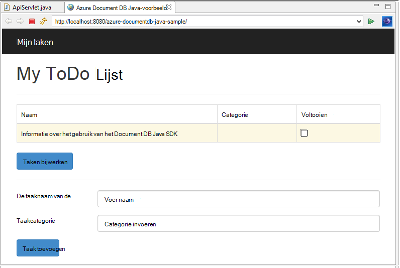
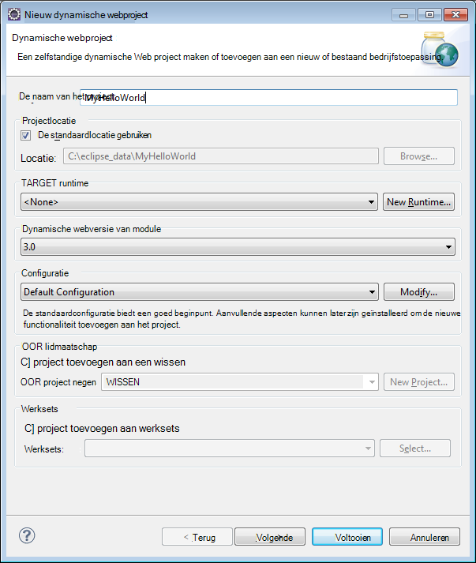
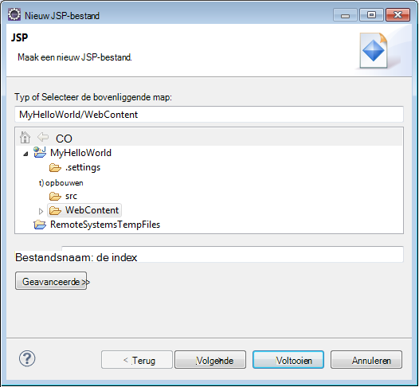
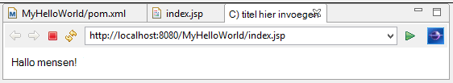
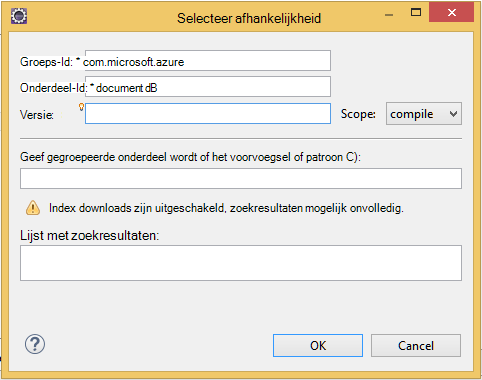

<properties
    pageTitle="Java-toepassing ontwikkeling zelfstudie met DocumentDB | Microsoft Azure"
    description="Deze zelfstudie Java web application ziet u hoe u het gebruik van de service Azure DocumentDB om op te slaan en access-gegevens uit een Java-toepassing die worden gehost op Azure-Websites."
    keywords="Ontwikkelen van toepassingen, zelfstudie, java-toepassing, java web application zelfstudie, documentdb, azure, Microsoft azure"
    services="documentdb"
    documentationCenter="java"
    authors="dennyglee"
    manager="jhubbard"
    editor="mimig"/>

<tags
    ms.service="documentdb"
    ms.devlang="java"
    ms.topic="hero-article"
    ms.tgt_pltfrm="NA"
    ms.workload="data-services"
    ms.date="08/24/2016"
    ms.author="denlee"/>

# Een Java-webtoepassing met DocumentDB maken

> [AZURE.SELECTOR]
- [.NET](documentdb-dotnet-application.md)
- [Node.js](documentdb-nodejs-application.md)
- [Java](documentdb-java-application.md)
- [Python](documentdb-python-application.md)

Deze zelfstudie Java web application ziet u hoe u het gebruik van de service [Microsoft Azure DocumentDB](https://portal.azure.com/#gallery/Microsoft.DocumentDB) om op te slaan en access-gegevens uit een Java-toepassing die worden gehost op Azure-Websites. In dit onderwerp wordt beschreven:

- Het maken van een eenvoudige JSP-toepassing in Eclips.
- Klik hier voor meer informatie over het werken met de DocumentDB Azure-service met de [DocumentDB Java SDK](https://github.com/Azure/azure-documentdb-java).

Deze zelfstudie Java-toepassing ziet u hoe u een web gebaseerde Taakbeheer toepassing maken waarmee u kunt maken, ophalen en taken als voltooid markeert, zoals wordt weergegeven in de volgende afbeelding. Elk van de taken in de takenlijst worden opgeslagen als JSON-documenten in Azure DocumentDB.

> [AZURE.TIP] Deze toepassing ontwikkeling zelfstudie wordt ervan uitgegaan dat u vorige ervaring hebt met Java. Als u nog niet eerder en Java of de [vereiste extra](#Prerequisites), raden downloaden van het project voltooid [doen](https://github.com/Azure-Samples/documentdb-java-todo-app) uit GitHub en het bouwen van deze volgens [de instructies aan het einde van dit artikel](#GetProject). Nadat u deze ingebouwd hebt, kunt u het artikel om inzicht in de code in de context van het project bekijken.  

##Vereisten voor deze zelfstudie Java web-toepassing
Voordat u deze toepassing ontwikkeling zelfstudie begint, hebt u het volgende:

- Een actieve Azure-account. Als u geen account hebt, kunt u een gratis proefabonnement-account maken in een paar minuten. Zie [Azure gratis proefversie](https://azure.microsoft.com/pricing/free-trial/)voor meer informatie.
- [Java Development Kit (JDK 7 +)](http://www.oracle.com/technetwork/java/javase/downloads/index.html).
- [Eclips IDE voor Java EE ontwikkelaars.](http://www.eclipse.org/downloads/packages/eclipse-ide-java-ee-developers/lunasr1)
- [Een Azure-Website met een Java runtime-omgeving (bijvoorbeeld Tomcat of Jetty) ingeschakeld.](../app-service-web/web-sites-java-get-started.md)

Als u deze hulpprogramma's voor de eerste keer installeert, coreservlets.com biedt een overzicht van het installatieproces in het gedeelte Snel starten van hun [Zelfstudie: TomCat7 installeren en u deze met Eclips](http://www.coreservlets.com/Apache-Tomcat-Tutorial/tomcat-7-with-eclipse.html) artikel.

##Stap 1: Maak een account van de database DocumentDB

Laten we beginnen met het maken van een DocumentDB-account. Als u al een account hebt, kunt u doorgaan met [stap 2: de Java JSP-toepassing maken](#CreateJSP).

[AZURE.INCLUDE [documentdb-create-dbaccount](../../includes/documentdb-create-dbaccount.md)]

[AZURE.INCLUDE [documentdb-keys](../../includes/documentdb-keys.md)]

##Stap 2: De Java JSP-toepassing maken

De toepassing JSP maken:

1. Eerst beginnen we uitschakelen door een Java-project te maken. Eclips, starten en vervolgens klikt u op **bestand**, klikt u op **Nieuw**en klik vervolgens op **Dynamische Web Project**. Als u **Dynamische Web Project** vermeld als een beschikbare project niet ziet, als volgt: klik op **bestand**, klikt u op **Nieuw**, klik op **Project**..., **Web**uitvouwen, klik op **Dynamische Web Project**en klik op **volgende**.

    

2. Voer de naam van een project in het vak **Projectnaam** en in de vervolgkeuzelijst **Target Runtime** , (optioneel) Selecteer een waarde (bijvoorbeeld Apache Tomcat v7.0) en klik vervolgens op **Voltooien**. Een doeltoepassing runtime kunt u uw project lokaal uitvoeren via Eclips.
3. Vouw in Eclips, in de weergave Projectverkenner van uw project. Met de rechtermuisknop op **webinhoud**, klikt u op **Nieuw**en klik vervolgens op **JSP-bestand**.
4. Klik in het dialoogvenster **Nieuw JSP-bestand** een naam geven het bestand **index.jsp**. De bovenliggende map behouden als **webinhoud**, zoals wordt weergegeven in de volgende afbeelding en klik vervolgens op **volgende**.

    

5. Klik in het dialoogvenster **JSP sjabloon selecteren** voor de toepassing van deze zelfstudie selecteert u **Nieuw JSP-bestand (html)**en klik vervolgens op **Voltooien**.

6. Als het bestand index.jsp in Eclips wordt geopend, voegt u weer te geven tekst **Hallo wereld!** binnen de bestaande <body> element. Uw bijgewerkte <body> inhoud ziet er als de volgende code:

        <body>
            <% out.println("Hello World!"); %>
        </body>

8. Sla het bestand index.jsp.
9. Als u een doel-runtime in stap 2 hebt ingesteld, kunt u **Project** en klik vervolgens **uitvoeren** als u wilt uw toepassing JSP lokaal uitvoeren:

    

##Stap 3: De DocumentDB Java SDK installeren ##

De eenvoudigste manier om op te halen in de DocumentDB Java SDK en de bijbehorende afhankelijkheden is tot en met [Apache Maven](http://maven.apache.org/).

Hiervoor moet u uw project converteren naar een project maven door de volgende stappen uit:

1. Met de rechtermuisknop op uw project in de Projectverkenner, klikt u op **configureren**, klik op **converteren naar Maven Project**.
2. Accepteer de standaardinstellingen in het venster **nieuwe POM maken** en klik op **Voltooien**.
3. Open het bestand pom.xml in **Projectverkenner**.
4. Klik op het tabblad **afhankelijkheden** in het deelvenster **Objectafhankelijkheden** op **toevoegen**.
4. Ga als volgt te werk in het venster **Afhankelijkheid selecteren** :
 - Voer in het vak **groeps-id** com.microsoft.azure.
 - Voer in het vak **Onderdeel Id** azure-documentdb.
 - Voer in het vak **versie** 1.5.1.

    

    Of de afhankelijkheid XML voor groeps-id en ArtifactId rechtstreeks toevoegen aan de pom.xml via een teksteditor:

        <dependency>
            <groupId>com.microsoft.azure</groupId>
            <artifactId>azure-documentdb</artifactId>
            <version>1.5.1</version>
        </dependency>

5. Klik op **Ok** en Maven wordt de DocumentDB Java SDK installeren.
6. Sla het bestand pom.xml.

##Stap 4: De service DocumentDB gebruiken in een Java-toepassing

1. Eerst, laten we het object TodoItem definiëren:

        @Data
        @Builder
        public class TodoItem {
            private String category;
            private boolean complete;
            private String id;
            private String name;
        }

    In dit project, we [Project Lombok](http://projectlombok.org/) gebruiken om te genereren van de constructor, getters setters en een opbouwfunctie. U kunt ook kunt u deze code handmatig schrijven of de IDE laten genereren.

2. Als u wilt de service DocumentDB aanroepen, moet u een nieuwe **DocumentClient**exemplaar maken. In het algemeen, is het beste opnieuw gebruiken de **DocumentClient** - in plaats van een nieuwe client voor elke volgende aanvraag maken. We kunnen de client opnieuw gebruiken door de client voor tekstterugloop in een **DocumentClientFactory**. Dit is ook waar u nodig hebt voor het plakken van de URI en primaire sleutel waarde die u naar het Klembord in [stap 1](#CreateDB)hebt opgeslagen. Vervang [uw\_EINDPUNT\_hier] met uw URI en vervangen [uw\_sleutel\_hier] met uw primaire sleutel.

        private static final String HOST = "[YOUR_ENDPOINT_HERE]";
        private static final String MASTER_KEY = "[YOUR_KEY_HERE]";

        private static DocumentClient documentClient;

        public static DocumentClient getDocumentClient() {
            if (documentClient == null) {
                documentClient = new DocumentClient(HOST, MASTER_KEY,
                        ConnectionPolicy.GetDefault(), ConsistencyLevel.Session);
            }

            return documentClient;
        }

3. Nu een Data Access-Object (DAO) als u wilt abstracte persistent maken van onze items die aan DocumentDB maken.

    Om te kunnen items die in een siteverzameling hebt opgeslagen, de client moet weten welke database en de siteverzameling naar persistent (waarnaar wordt verwezen door zelf gekoppeld). In het algemeen, is het aanbevolen om de database en de verzameling indien mogelijk is om te voorkomen aanvullende gegevens van en naar de database in cache.

    De volgende code ziet u hoe ophalen van onze database en de siteverzameling, indien aanwezig of een nieuw account te maken als deze niet bestaat:

        public class DocDbDao implements TodoDao {
            // The name of our database.
            private static final String DATABASE_ID = "TodoDB";

            // The name of our collection.
            private static final String COLLECTION_ID = "TodoCollection";

            // The DocumentDB Client
            private static DocumentClient documentClient = DocumentClientFactory
                    .getDocumentClient();

            // Cache for the database object, so we don't have to query for it to
            // retrieve self links.
            private static Database databaseCache;

            // Cache for the collection object, so we don't have to query for it to
            // retrieve self links.
            private static DocumentCollection collectionCache;

            private Database getTodoDatabase() {
                if (databaseCache == null) {
                    // Get the database if it exists
                    List<Database> databaseList = documentClient
                            .queryDatabases(
                                    "SELECT * FROM root r WHERE r.id='" + DATABASE_ID
                                            + "'", null).getQueryIterable().toList();

                    if (databaseList.size() > 0) {
                        // Cache the database object so we won't have to query for it
                        // later to retrieve the selfLink.
                        databaseCache = databaseList.get(0);
                    } else {
                        // Create the database if it doesn't exist.
                        try {
                            Database databaseDefinition = new Database();
                            databaseDefinition.setId(DATABASE_ID);

                            databaseCache = documentClient.createDatabase(
                                    databaseDefinition, null).getResource();
                        } catch (DocumentClientException e) {
                            // TODO: Something has gone terribly wrong - the app wasn't
                            // able to query or create the collection.
                            // Verify your connection, endpoint, and key.
                            e.printStackTrace();
                        }
                    }
                }

                return databaseCache;
            }

            private DocumentCollection getTodoCollection() {
                if (collectionCache == null) {
                    // Get the collection if it exists.
                    List<DocumentCollection> collectionList = documentClient
                            .queryCollections(
                                    getTodoDatabase().getSelfLink(),
                                    "SELECT * FROM root r WHERE r.id='" + COLLECTION_ID
                                            + "'", null).getQueryIterable().toList();

                    if (collectionList.size() > 0) {
                        // Cache the collection object so we won't have to query for it
                        // later to retrieve the selfLink.
                        collectionCache = collectionList.get(0);
                    } else {
                        // Create the collection if it doesn't exist.
                        try {
                            DocumentCollection collectionDefinition = new DocumentCollection();
                            collectionDefinition.setId(COLLECTION_ID);

                            collectionCache = documentClient.createCollection(
                                    getTodoDatabase().getSelfLink(),
                                    collectionDefinition, null).getResource();
                        } catch (DocumentClientException e) {
                            // TODO: Something has gone terribly wrong - the app wasn't
                            // able to query or create the collection.
                            // Verify your connection, endpoint, and key.
                            e.printStackTrace();
                        }
                    }
                }

                return collectionCache;
            }
        }

4. De volgende stap is sommige code behouden de TodoItems in aan de collectie schrijven. In dit voorbeeld we [Gson](https://code.google.com/p/google-gson/) serialiseren en terugconverteren TodoItem simpel oude Java-objecten (POJOs) naar JSON documenten gebruiken. [Jackson](http://jackson.codehaus.org/) of uw eigen aangepaste serialisatiefunctie zijn ook goede alternatieven voor POJOs serialiseren.

        // We'll use Gson for POJO <=> JSON serialization for this example.
        private static Gson gson = new Gson();

        @Override
        public TodoItem createTodoItem(TodoItem todoItem) {
            // Serialize the TodoItem as a JSON Document.
            Document todoItemDocument = new Document(gson.toJson(todoItem));

            // Annotate the document as a TodoItem for retrieval (so that we can
            // store multiple entity types in the collection).
            todoItemDocument.set("entityType", "todoItem");

            try {
                // Persist the document using the DocumentClient.
                todoItemDocument = documentClient.createDocument(
                        getTodoCollection().getSelfLink(), todoItemDocument, null,
                        false).getResource();
            } catch (DocumentClientException e) {
                e.printStackTrace();
                return null;
            }

            return gson.fromJson(todoItemDocument.toString(), TodoItem.class);
        }

5. Net als DocumentDB databases en siteverzamelingen, documenten ook wordt verwezen door zelf koppelingen. De volgende helperfunctie kunt ons ophalen van documenten door een ander kenmerk (bijvoorbeeld "id") in plaats van zelf koppelen:

        private Document getDocumentById(String id) {
            // Retrieve the document using the DocumentClient.
            List<Document> documentList = documentClient
                    .queryDocuments(getTodoCollection().getSelfLink(),
                            "SELECT * FROM root r WHERE r.id='" + id + "'", null)
                    .getQueryIterable().toList();

            if (documentList.size() > 0) {
                return documentList.get(0);
            } else {
                return null;
            }
        }

6. We kunt ophalen van een document TodoItem JSON op id en deze vervolgens terugconverteren naar een POJO, kunt u de helpmethode gebruiken in stap 5:

        @Override
        public TodoItem readTodoItem(String id) {
            // Retrieve the document by id using our helper method.
            Document todoItemDocument = getDocumentById(id);

            if (todoItemDocument != null) {
                // De-serialize the document in to a TodoItem.
                return gson.fromJson(todoItemDocument.toString(), TodoItem.class);
            } else {
                return null;
            }
        }

7. We kunt ook de DocumentClient kom ik aan een siteverzameling of een lijst met TodoItems met DocumentDB SQL gebruiken:

        @Override
        public List<TodoItem> readTodoItems() {
            List<TodoItem> todoItems = new ArrayList<TodoItem>();

            // Retrieve the TodoItem documents
            List<Document> documentList = documentClient
                    .queryDocuments(getTodoCollection().getSelfLink(),
                            "SELECT * FROM root r WHERE r.entityType = 'todoItem'",
                            null).getQueryIterable().toList();

            // De-serialize the documents in to TodoItems.
            for (Document todoItemDocument : documentList) {
                todoItems.add(gson.fromJson(todoItemDocument.toString(),
                        TodoItem.class));
            }

            return todoItems;
        }

8. Er zijn tal van manieren bijwerken van een document met de DocumentClient. In de toepassing van onze doen-lijst willen we kunnen kiezen of een TodoItem voltooid is. Dit u kunt doen door in het document het "voltooid" kenmerk bij te werken:

        @Override
        public TodoItem updateTodoItem(String id, boolean isComplete) {
            // Retrieve the document from the database
            Document todoItemDocument = getDocumentById(id);

            // You can update the document as a JSON document directly.
            // For more complex operations - you could de-serialize the document in
            // to a POJO, update the POJO, and then re-serialize the POJO back in to
            // a document.
            todoItemDocument.set("complete", isComplete);

            try {
                // Persist/replace the updated document.
                todoItemDocument = documentClient.replaceDocument(todoItemDocument,
                        null).getResource();
            } catch (DocumentClientException e) {
                e.printStackTrace();
                return null;
            }

            return gson.fromJson(todoItemDocument.toString(), TodoItem.class);
        }

9. Ten slotte, willen we de mogelijkheid om te verwijderen van een TodoItem van onze lijst. Klik hiertoe we de beschikking over de helpmethode geschreven kunt ophalen de selfservice koppelen en geef vervolgens op de client om deze te verwijderen:

        @Override
        public boolean deleteTodoItem(String id) {
            // DocumentDB refers to documents by self link rather than id.

            // Query for the document to retrieve the self link.
            Document todoItemDocument = getDocumentById(id);

            try {
                // Delete the document by self link.
                documentClient.deleteDocument(todoItemDocument.getSelfLink(), null);
            } catch (DocumentClientException e) {
                e.printStackTrace();
                return false;
            }

            return true;
        }

##Stap 5: Bekabeling voor de rest van de van samen Java application development-project

Nu dat we het plezier bits - alle dat naar links is het bouwen van een snelle gebruiker gebruikersinterface en deze tot onze DAO wire hebt voltooid.

1. Eerst, laten we beginnen met het samenstellen van een controller om te bellen van onze DAO:

        public class TodoItemController {
            public static TodoItemController getInstance() {
                if (todoItemController == null) {
                    todoItemController = new TodoItemController(TodoDaoFactory.getDao());
                }
                return todoItemController;
            }

            private static TodoItemController todoItemController;

            private final TodoDao todoDao;

            TodoItemController(TodoDao todoDao) {
                this.todoDao = todoDao;
            }

            public TodoItem createTodoItem(@NonNull String name,
                    @NonNull String category, boolean isComplete) {
                TodoItem todoItem = TodoItem.builder().name(name).category(category)
                        .complete(isComplete).build();
                return todoDao.createTodoItem(todoItem);
            }

            public boolean deleteTodoItem(@NonNull String id) {
                return todoDao.deleteTodoItem(id);
            }

            public TodoItem getTodoItemById(@NonNull String id) {
                return todoDao.readTodoItem(id);
            }

            public List<TodoItem> getTodoItems() {
                return todoDao.readTodoItems();
            }

            public TodoItem updateTodoItem(@NonNull String id, boolean isComplete) {
                return todoDao.updateTodoItem(id, isComplete);
            }
        }

    In een meer complexe-toepassing, kan de controller ingewikkeld bedrijfslogica boven aan de DAO opnemen.

2. Vervolgens maken we een servlet naar route HTTP aanvragen voor de controller uit:

        public class TodoServlet extends HttpServlet {
            // API Keys
            public static final String API_METHOD = "method";

            // API Methods
            public static final String CREATE_TODO_ITEM = "createTodoItem";
            public static final String GET_TODO_ITEMS = "getTodoItems";
            public static final String UPDATE_TODO_ITEM = "updateTodoItem";

            // API Parameters
            public static final String TODO_ITEM_ID = "todoItemId";
            public static final String TODO_ITEM_NAME = "todoItemName";
            public static final String TODO_ITEM_CATEGORY = "todoItemCategory";
            public static final String TODO_ITEM_COMPLETE = "todoItemComplete";

            public static final String MESSAGE_ERROR_INVALID_METHOD = "{'error': 'Invalid method'}";

            private static final long serialVersionUID = 1L;
            private static final Gson gson = new Gson();

            @Override
            protected void doGet(HttpServletRequest request,
                    HttpServletResponse response) throws ServletException, IOException {

                String apiResponse = MESSAGE_ERROR_INVALID_METHOD;

                TodoItemController todoItemController = TodoItemController
                        .getInstance();

                String id = request.getParameter(TODO_ITEM_ID);
                String name = request.getParameter(TODO_ITEM_NAME);
                String category = request.getParameter(TODO_ITEM_CATEGORY);
                boolean isComplete = StringUtils.equalsIgnoreCase("true",
                        request.getParameter(TODO_ITEM_COMPLETE)) ? true : false;

                switch (request.getParameter(API_METHOD)) {
                case CREATE_TODO_ITEM:
                    apiResponse = gson.toJson(todoItemController.createTodoItem(name,
                            category, isComplete));
                    break;
                case GET_TODO_ITEMS:
                    apiResponse = gson.toJson(todoItemController.getTodoItems());
                    break;
                case UPDATE_TODO_ITEM:
                    apiResponse = gson.toJson(todoItemController.updateTodoItem(id,
                            isComplete));
                    break;
                default:
                    break;
                }

                response.getWriter().println(apiResponse);
            }

            @Override
            protected void doPost(HttpServletRequest request,
                    HttpServletResponse response) throws ServletException, IOException {
                doGet(request, response);
            }
        }

3. Moeten we een Web-gebruikersinterface weer te geven voor de gebruiker. Laten we opnieuw schrijven de index.jsp dat we eerder hebt gemaakt:

        <html>
        <head>
          <meta http-equiv="Content-Type" content="text/html; charset=ISO-8859-1">
          <meta http-equiv="X-UA-Compatible" content="IE=edge;" />
          <title>Azure DocumentDB Java Sample</title>

          <!-- Bootstrap -->
          <link href="//ajax.aspnetcdn.com/ajax/bootstrap/3.2.0/css/bootstrap.min.css" rel="stylesheet">

          
        </head>
        <body>
          <!-- Nav Bar -->
          

            

              

                <a class="navbar-brand" href="#">My Tasks</a>
              

            

          

          <!-- Body -->
          

            <h1>My ToDo List</h1>

            

            <!-- The ToDo List -->
            

              <table class="table table-bordered table-striped" id="todoItems">
                <thead>
                  <tr>
                    <th>Name</th>
                    <th>Category</th>
                    <th>Complete</th>
                  </tr>
                </thead>
                <tbody>
                </tbody>
              </table>

              <!-- Update Button -->
              

                <form class="form-horizontal" role="form">
                  <button type="button" class="btn btn-primary">Update Tasks</button>
                </form>
              

            

            

            <!-- Item Input Form -->
            

              <form class="form-horizontal" role="form">
                

                  <label for="inputItemName" class="col-sm-2">Task Name</label>
                  

                    <input type="text" class="form-control" id="inputItemName" placeholder="Enter name">
                  

                

                

                  <label for="inputItemCategory" class="col-sm-2">Task Category</label>
                  

                    <input type="text" class="form-control" id="inputItemCategory" placeholder="Enter category">
                  

                

                <button type="button" class="btn btn-primary">Add Task</button>
              </form>
            

          

          <!-- Placed at the end of the document so the pages load faster -->
          
          
          
        </body>
        </html>

4. En ten slotte schrijven sommige Javascript aan de clientzijde als u wilt de web-gebruikersinterface en de servlet met elkaar verbinden:

        var todoApp = {
          /*
           * API methods to call Java backend.
           */
          apiEndpoint: "api",

          createTodoItem: function(name, category, isComplete) {
            $.post(todoApp.apiEndpoint, {
                "method": "createTodoItem",
                "todoItemName": name,
                "todoItemCategory": category,
                "todoItemComplete": isComplete
              },
              function(data) {
                var todoItem = data;
                todoApp.addTodoItemToTable(todoItem.id, todoItem.name, todoItem.category, todoItem.complete);
              },
              "json");
          },

          getTodoItems: function() {
            $.post(todoApp.apiEndpoint, {
                "method": "getTodoItems"
              },
              function(data) {
                var todoItemArr = data;
                $.each(todoItemArr, function(index, value) {
                  todoApp.addTodoItemToTable(value.id, value.name, value.category, value.complete);
                });
              },
              "json");
          },

          updateTodoItem: function(id, isComplete) {
            $.post(todoApp.apiEndpoint, {
                "method": "updateTodoItem",
                "todoItemId": id,
                "todoItemComplete": isComplete
              },
              function(data) {},
              "json");
          },

          /*
           * UI Methods
           */
          addTodoItemToTable: function(id, name, category, isComplete) {
            var rowColor = isComplete ? "active" : "warning";

            todoApp.ui_table().append($("<tr>")
              .append($("<td>").text(name))
              .append($("<td>").text(category))
              .append($("<td>")
                .append($("<input>")
                  .attr("type", "checkbox")
                  .attr("id", id)
                  .attr("checked", isComplete)
                  .attr("class", "isComplete")
                ))
              .addClass(rowColor)
            );
          },

          /*
           * UI Bindings
           */
          bindCreateButton: function() {
            todoApp.ui_createButton().click(function() {
              todoApp.createTodoItem(todoApp.ui_createNameInput().val(), todoApp.ui_createCategoryInput().val(), false);
              todoApp.ui_createNameInput().val("");
              todoApp.ui_createCategoryInput().val("");
            });
          },

          bindUpdateButton: function() {
            todoApp.ui_updateButton().click(function() {
              // Disable button temporarily.
              var myButton = $(this);
              var originalText = myButton.text();
              $(this).text("Updating...");
              $(this).prop("disabled", true);

              // Call api to update todo items.
              $.each(todoApp.ui_updateId(), function(index, value) {
                todoApp.updateTodoItem(value.name, value.value);
                $(value).remove();
              });

              // Re-enable button.
              setTimeout(function() {
                myButton.prop("disabled", false);
                myButton.text(originalText);
              }, 500);
            });
          },

          bindUpdateCheckboxes: function() {
            todoApp.ui_table().on("click", ".isComplete", function(event) {
              var checkboxElement = $(event.currentTarget);
              var rowElement = $(event.currentTarget).parents('tr');
              var id = checkboxElement.attr('id');
              var isComplete = checkboxElement.is(':checked');

              // Toggle table row color
              if (isComplete) {
                rowElement.addClass("active");
                rowElement.removeClass("warning");
              } else {
                rowElement.removeClass("active");
                rowElement.addClass("warning");
              }

              // Update hidden inputs for update panel.
              todoApp.ui_updateForm().children("input[name='" + id + "']").remove();

              todoApp.ui_updateForm().append($("<input>")
                .attr("type", "hidden")
                .attr("class", "updateComplete")
                .attr("name", id)
                .attr("value", isComplete));

            });
          },

          /*
           * UI Elements
           */
          ui_createNameInput: function() {
            return $(".todoForm #inputItemName");
          },

          ui_createCategoryInput: function() {
            return $(".todoForm #inputItemCategory");
          },

          ui_createButton: function() {
            return $(".todoForm button");
          },

          ui_table: function() {
            return $(".todoList table tbody");
          },

          ui_updateButton: function() {
            return $(".todoUpdatePanel button");
          },

          ui_updateForm: function() {
            return $(".todoUpdatePanel form");
          },

          ui_updateId: function() {
            return $(".todoUpdatePanel .updateComplete");
          },

          /*
           * Install the TodoApp
           */
          install: function() {
            todoApp.bindCreateButton();
            todoApp.bindUpdateButton();
            todoApp.bindUpdateCheckboxes();

            todoApp.getTodoItems();
          }
        };

        $(document).ready(function() {
          todoApp.install();
        });

5. Prima! Alle die er nog is nu om de toepassing te testen. Voer de toepassing lokaal en sommige items die moeten worden toevoegen door te vullen in de categorie en de itemnaam van het en te klikken op **Taak toevoegen**.

6. Wanneer het item wordt weergegeven, kunt u bijwerken of deze door het selectievakje in te schakelen en te klikken op **Taken bijwerken**is voltooid.

##Stap 6: Uw Java-toepassing naar Azure Websites implementeren

Azure Websites zorgt ervoor dat implementeert Java-toepassingen net zo eenvoudig als uw toepassing exporteren als een WAR-bestand en op uploaden via een besturingselement voor gegevensbronnen (bijvoorbeeld cijfer) of FTP.

1. Als u wilt uw toepassing exporteren als een WAR, met de rechtermuisknop op uw project in **Project Explorer**, klik op **exporteren**en klik vervolgens op **WAR-bestand**.
2. Ga als volgt te werk in het venster **WAR exporteren** :
 - Voer in het vak project Web azure-documentdb-java-voorbeeld.
 - Kies in het vak Destination een doel het WAR-bestand wilt opslaan.
 - Klik op **Voltooien**.

3. Nu dat u een WAR-bestand in de hand hebt, kunt u deze gewoon naar van de Website van uw Azure **webapps** directory uploaden. Zie [een toepassing naar uw website Java op Azure toe te voegen](../app-service-web/web-sites-java-add-app.md)voor instructies over het uploaden van het bestand.

    Zodra het WAR-bestand wordt geüpload naar de map webapps, wordt de runtime-omgeving wordt gedetecteerd dat u deze hebt toegevoegd en automatisch wordt geladen.
4. Als u wilt uw eindproduct bekijken, gaat u naar http://YOUR\_SITE\_NAME.azurewebsites.net/azure-documentdb-java-sample/ en start uw taken toe te voegen!

##Het project ophalen uit GitHub

In de voorbeelden in deze zelfstudie worden opgenomen in het project [doen](https://github.com/Azure-Samples/documentdb-java-todo-app) op GitHub. Als u wilt importeren het project doen in Eclips, zorgen dat u hebt de software en resources die worden weergegeven in de sectie [vereisten](#Prerequisites) , en vervolgens als volgt te werk:

1. [Project-Lombok](http://projectlombok.org/)installeren. Lombok wordt gebruikt voor het genereren van constructors, getters, setters in het project. Nadat u het bestand lombok.jar hebt gedownload, dubbelklikt u erop om te installeren of installeren vanaf de opdrachtregel.
2. Als Eclips geopend is, sluit u deze en opnieuw als u wilt laden Lombok.
3. Klik in Eclips, klik in het menu **bestand** op **importeren**.
4. Klik in het venster **importeren** **cijfer**klikt u op, klik op **projecten uit cijfer**en klik vervolgens op **volgende**.
5. Klik op het scherm **Opslagplaats bron selecteren** op **Klonen URI**.
6. In het scherm **Bron cijfer opslagplaats** in het vak **URI** https://github.com/Azure-Samples/documentdb-java-todo-app.git invoeren en klik vervolgens op **volgende**.
7. Zorg ervoor dat **basispagina** is geselecteerd en klik vervolgens op **volgende**op het scherm **Tak selectie** .
8. Klik op het scherm **Lokale bestemming** op **Bladeren** om te selecteren van een map waarin de opslagplaats kunnen worden gekopieerd en klik vervolgens op **volgende**.
9. Zorg ervoor dat **bestaande projecten importeren** is geselecteerd en klik vervolgens op **volgende**op het scherm **selecteren van een wizard gebruiken voor het importeren van projecten** .
10. Klik op het scherm **Importeren projecten** Hef de selectie van het project **DocumentDB** en klik vervolgens op **Voltooien**. Het project DocumentDB bevat de DocumentDB Java-SDK, die we wordt toegevoegd als een afhankelijkheid in plaats daarvan.
11. Navigeer naar azure-documentdb-java-sample\src\com.microsoft.azure.documentdb.sample.dao\DocumentClientFactory.java in **Projectverkenner**de HOST en MASTER_KEY waarden vervangen door de URI en de primaire sleutel voor uw account DocumentDB en sla het bestand. Zie voor meer informatie [stap 1. Maak een account van de database DocumentDB](#CreateDB).
12. In **Projectverkenner**Klik met de rechtermuisknop op het **azure-documentdb-java-voorbeeld**, klikt u op **Pad maken**en klik vervolgens op **Maken pad configureren**.
13. Klik op het scherm **Java bouwen pad** in het rechterdeelvenster, selecteer het tabblad **bibliotheken** en klik op **Externe potten toevoegen**. Navigeer naar de locatie van het bestand lombok.jar, en klik op **openen**en klik vervolgens op **OK**.
14. Stap 12 gebruiken om het venster **Eigenschappen** opnieuw openen en klik vervolgens in het linkerdeelvenster op **Runtimes bedoeld**.
15. In het scherm **Gericht Runtimes** klikt u op **Nieuw**, selecteert u **Apache Tomcat v7.0**en klik vervolgens op **OK**.
16. Stap 12 gebruiken om het venster **Eigenschappen** opnieuw openen en klik vervolgens in het linkerdeelvenster op **Aspecten van Project**.
17. Klik op het scherm **Project aspecten** **Dynamische Web Module** en **Java**selecteren en klik vervolgens op **OK**.
18. Klik op het tabblad **Servers** onderaan in het scherm met de rechtermuisknop op **Tomcat v7.0 localhost-Server** en klik vervolgens op **toevoegen en verwijderen**.
19. Klik in het venster **toevoegen en verwijderen** **azure documentdb-java-steekproeven** verplaatsen naar het **geconfigureerd** in en klik vervolgens op **Voltooien**.
20. Klik in het tabblad **Server** , met de rechtermuisknop op **Tomcat v7.0 localhost-Server**en klik op **opnieuw starten**.
21. In een browser, gaat u naar http://localhost:8080/azure-documentdb-java-sample / en toe te voegen aan uw takenlijst. Er gebeurt als u uw poort standaardwaarden gewijzigd 8080 wijzigen naar de waarde die u hebt geselecteerd.
22. Als u wilt uw project implementeren naar een website Azure, raadpleegt u [stap 6. Uw toepassing naar Azure Websites Implementeer](#Deploy).

[1]: media/documentdb-java-application/keys.png
