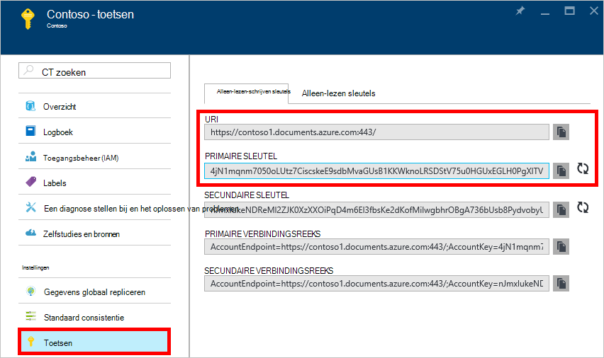
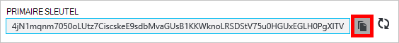
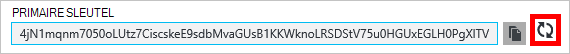
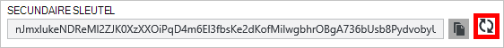
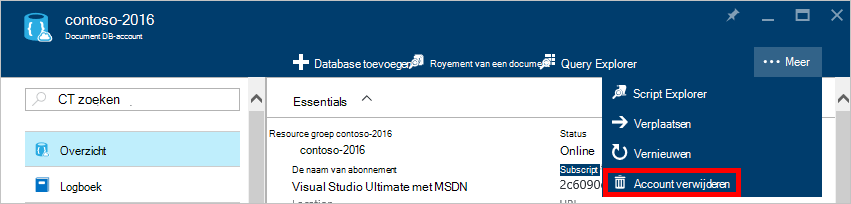
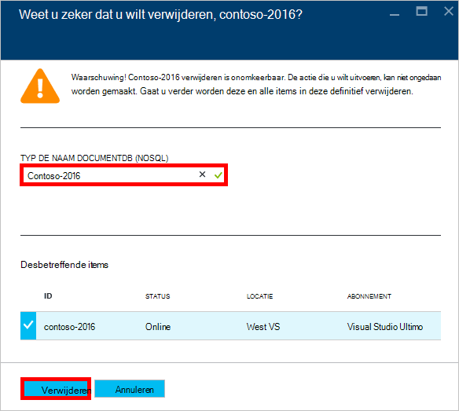

<properties
    pageTitle="Een account DocumentDB via de Portal Azure beheren | Microsoft Azure"
    description="Informatie over het beheren van uw account DocumentDB via de Portal Azure. Zoek een handleiding over het gebruik van de Portal Azure bekijken, kopiëren, verwijderen en toegang tot accounts."
    keywords="Azure-Portal documentdb, azure, Microsoft azure"
    services="documentdb"
    documentationCenter=""
    authors="kirillg"
    manager="jhubbard"
    editor="cgronlun"/>

<tags
    ms.service="documentdb"
    ms.workload="data-services"
    ms.tgt_pltfrm="na"
    ms.devlang="na"
    ms.topic="article"
    ms.date="10/14/2016"
    ms.author="kirillg"/>

# Het beheren van een DocumentDB-account

Informatie over het instellen van globale consistentie, werken met de toetsen en verwijderen van een DocumentDB-account in de portal van Azure.

## DocumentDB consistentie instellingen beheren

Het niveau van de juiste consistentie selecteren, is afhankelijk van de semantiek van uw toepassing. Moet u vertrouwd raken met de beschikbare consistentie niveaus in DocumentDB door te [werken met consistentie niveaus voor maximaal beschikbaarheid en prestaties in DocumentDB]lezen [consistency]. DocumentDB biedt consistentie, beschikbaarheid en prestaties garanties, op elk niveau consistentie beschikbaar voor uw databaseaccount. Het configureren van uw databaseaccount met een niveau consistentie van sterke is vereist dat uw gegevens naar een enkel Azure gebied beperkt en globaal niet beschikbaar is. Klik op de andere hand, beperkte consistentie niveaus - gebonden staleness, session of eventuele inschakelen u niet het getal van Azure regio's koppelen aan uw databaseaccount. De volgende eenvoudige stappen uitgelegd hoe u het niveau van de consistentie standaard voor uw databaseaccount te selecteren. 

### De consistentie standaard voor een account DocumentDB opgeven

1. Klik in de [portal van Azure](https://portal.azure.com/)toegang tot uw account DocumentDB.
2. Klik in het blad account op **consistentie standaard**.
3. In het blad **Consistentie standaard** het niveau van de nieuwe consistentie en klik op **Opslaan**.
    ![Standaard consistentie sessie][5]

## Bekijken, kopiëren en toegangstoetsen genereren
Wanneer u een account DocumentDB maakt, genereert de service twee basispagina toegangstoetsen die kunnen worden gebruikt voor verificatie wanneer het account DocumentDB wordt geopend. Door twee toegangstoetsen, kunt DocumentDB u de toetsen met niet onderbroken bij uw account DocumentDB genereren. 

Klik in de [portal van Azure](https://portal.azure.com/)toegang krijgen tot het blad **toetsen** in het menu van de resource op het blad **DocumentDB account** bekijken, kopiëren en de toegangstoetsen die worden gebruikt voor toegang tot uw account DocumentDB genereren.

> [AZURE.NOTE] Het blad **toetsen** bevat ook primaire en secundaire verbindingstekenreeksen die kunnen worden gebruikt om verbinding met uw account uit het [Migratieprogramma van gegevens](documentdb-import-data.md).

Alleen-lezen sleutels zijn ook beschikbaar op deze blade. Lees- en query's zijn alleen-lezen-bewerkingen tijd wordt gemaakt, verwijderen, en vervangt niet.

### Een access-sleutel in de Portal Azure kopiëren

Klik op het blad **toetsen** op de knop **kopiëren** naar rechts van de sleutel die u wilt kopiëren.

### Toegangstoetsen genereren

U moet de toegangstoetsen wijzigen bij uw account DocumentDB regelmatig om uw verbindingen meer te beveiligen. Twee toegangstoetsen zijn toegewezen waarmee u kunt voor het behoud van verbindingen met de DocumentDB-account met behulp van een access-toets ingedrukt terwijl u de andere access-sleutel opnieuw genereren.

> [AZURE.WARNING] Uw toegangstoetsen genereren van invloed op alle toepassingen die afhankelijk van de huidige sleutel zijn. Alle clients die de access-toets gebruiken voor toegang tot het account DocumentDB moeten worden bijgewerkt als de nieuwe sleutel wilt gebruiken.

Als u toepassingen of cloudservices via de DocumentDB-account hebt, gaan verloren de verbindingen als u toetsen, tenzij u uw sleutels implementeren. Het proces voor het schuivend uw sleutels een overzicht van de volgende stappen uit.

1. De access-toets in uw toepassingscode als u verwijst naar de secundaire toegangstoets van het account DocumentDB bijwerken.
2. De primaire toegangstoets voor uw account DocumentDB genereren. Klik in de [Portal van Azure](https://portal.azure.com/)toegang tot uw account DocumentDB.
3. Klik op **toetsen**in het blad **DocumentDB-Account** .
4. Op het blad **toetsen** klikt u op de knop opnieuw genereren, klik op **Ok** om te bevestigen dat u wilt een nieuwe sleutel genereren.
    

5. De access-toets in uw toepassingscode als u verwijst naar de nieuwe primaire toegangstoets bijwerken nadat u hebt bevestigd dat de nieuwe sleutel beschikbaar voor gebruik (ongeveer 5 minuten na opnieuw genereren is),
6. De secundaire toegangstoets genereren.

    

> [AZURE.NOTE] Het kan enkele minuten duren voordat u een nieuwe gegenereerde sleutel kan worden gebruikt om toegang tot uw account DocumentDB.

## De verbindingsreeks ophalen

Ga als volgt te werk als u wilt de verbindingsreeks ophalen: 

1. Klik in de [portal van Azure](https://portal.azure.com)toegang tot uw account DocumentDB.
2. Klik op **toetsen**in het menu resource.
3. Klik op de knop **kopiëren** naast het vak **Primaire verbindingsreeks** of **Secundaire verbindingsreeks** . 

Als u de verbindingsreeks in het [Migratieprogramma van DocumentDB Database](documentdb-import-data.md)gebruikt, voegt u de naam van de database toe aan het einde van de verbindingsreeks. `AccountEndpoint=< >;AccountKey=< >;Database=< >`.

## Een account DocumentDB verwijderen
Als u wilt een DocumentDB-account verwijderen uit de Azure-Portal dat u niet langer gebruikt, gebruikt u de opdracht **Account verwijderen** op het blad **DocumentDB-account** .

1. Klik in de [portal van Azure](https://portal.azure.com/)toegang tot het DocumentDB-account dat u wilt verwijderen.
2. Klik op het blad **DocumentDB-account** , klikt u op **meer**en klik vervolgens op **Account verwijderen**. Of, met de rechtermuisknop op de naam van de database en klik op **Account verwijderen**.
3. Typ op het resulterende bevestiging blad, de naam van het DocumentDB-account om te bevestigen dat u wilt het account verwijderen.
4. Klik op de knop **verwijderen** .

## Volgende stappen

Leer hoe u [aan de slag met uw account DocumentDB](http://go.microsoft.com/fwlink/p/?LinkId=402364).

Meer informatie over DocumentDB, raadpleegt u de documentatie Azure DocumentDB op [azure.com](http://go.microsoft.com/fwlink/?LinkID=402319&clcid=0x409).

<!--Image references-->
[1]: ./media/documentdb-manage-account/documentdb_add_region-1.png
[2]: ./media/documentdb-manage-account/documentdb_add_region-2.png
[3]: ./media/documentdb-manage-account/documentdb_change_write_region-1.png
[4]: ./media/documentdb-manage-account/documentdb_change_write_region-2.png
[5]: ./media/documentdb-manage-account/documentdb_change_consistency-1.png
[6]: ./media/documentdb-manage-account/chooseandsaveconsistency.png

<!--Reference style links - using these makes the source content way more readable than using inline links-->
[bcdr]: https://azure.microsoft.com/documentation/articles/best-practices-availability-paired-regions/
[consistency]: https://azure.microsoft.com/documentation/articles/documentdb-consistency-levels/
[azureregions]: https://azure.microsoft.com/en-us/regions/#services
[offers]: https://azure.microsoft.com/en-us/pricing/details/documentdb/
