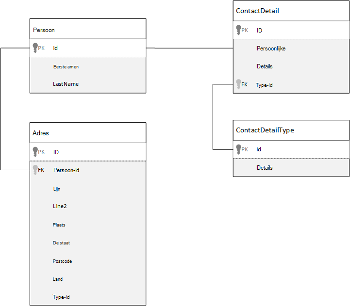
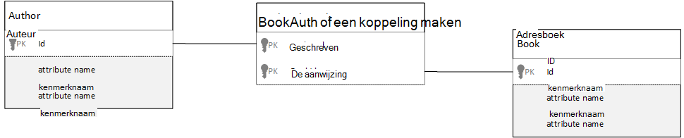

<properties 
    pageTitle="Gegevens in Azure DocumentDB Modeling | Microsoft Azure" 
    description="Meer informatie over het modelleren van gegevens voor DocumentDB, een NoSQL document-database." 
    keywords="gegevens modelleren"
    services="documentdb" 
    authors="kiratp" 
    manager="jhubbard" 
    editor="mimig1" 
    documentationCenter=""/>

<tags 
    ms.service="documentdb" 
    ms.workload="data-services" 
    ms.tgt_pltfrm="na" 
    ms.devlang="na" 
    ms.topic="article" 
    ms.date="08/05/2016" 
    ms.author="kipandya"/>

#Gegevens in DocumentDB Modeling#
Terwijl schema-vrije-databases, zoals Azure DocumentDB, zodat heel eenvoudig naar Profiteer van wijzigingen in uw gegevensmodel u moet nog steeds besteedt sommige tijd na te denken over uw gegevens. 

Hoe dient gegevens moeten worden opgeslagen? Is uw toepassing gang kunt ophalen en query gegevens? Is uw toepassing dik lezen of schrijven dik? 

Lees dit artikel en kunnen u de volgende vragen beantwoorden:

- Hoe moet ik een document in een document-database nadenken?
- Wat is gegevensmodellering en waarom moet ik belangrijk? 
- Welke manier verschilt modellering gegevens in de database van een document met een relationele database?
- Hoe ik gegevensrelaties in een niet-relationele database express?
- Wanneer insluiten gegevens en wanneer ik een koppeling maken naar gegevens?

##Gegevens insluiten##
Wanneer u begint met het modelleren van gegevens in een document opslaan, zoals DocumentDB, probeert te uw entiteiten als **zelfstandig documenten** weergegeven in JSON behandelen.

Voordat we meteen aan de slag te veel verder laat ons een paar stappen terugnemen en nog eens kijken hoe we iets in een relationele database, een onderwerp veel van ons al bekend met bent mogelijk model. Het volgende voorbeeld ziet hoe een persoon mogelijk zijn opgeslagen in een relationele database. 

Als u werkt met relationele databases, hebt we geleerd jaar normaliseren, normaliseren, normaliseren.

Meestal normaliseren van uw gegevens heeft betrekking op een entiteit, zoals een persoon, maken en deze te splitsen op afzonderlijke gegevens. In het bovenstaande voorbeeld hebben van een persoon meerdere records van de details van contactpersonen, evenals meerdere adresrecords. We nog een stap verder gaan en uitsplitsen naar contactgegevens verdere ophalen van de gemeenschappelijke velden, zoals een type. Dezelfde voor adres, heeft elke record hier een type zoals *Start* of *en grote ondernemingen* 

De leidt premises wanneer gegevens normaliseren is **Bewaar redundante gegevens** op elke record en liever verwijzen naar gegevens. In dit voorbeeld als u wilt lezen van een persoon, met alle hun contactgegevens en adressen, moet u JOINS gebruiken om samen te voegen effectief gegevens tijdens runtime.

    SELECT p.FirstName, p.LastName, a.City, cd.Detail
    FROM Person p
    JOIN ContactDetail cd ON cd.PersonId = p.Id
    JOIN ContactDetailType on cdt ON cdt.Id = cd.TypeId
    JOIN Address a ON a.PersonId = p.Id

Één persoon bijwerken met de contactgegevens en adressen moet schrijven bewerkingen over een groot aantal afzonderlijke tabellen. 

Nu eens kijken hoe we van dezelfde gegevens als een zelfstandig entiteit in een document-database modelleren wilt.
        
    {
        "id": "1",
        "firstName": "Thomas",
        "lastName": "Andersen",
        "addresses": [
            {            
                "line1": "100 Some Street",
                "line2": "Unit 1",
                "city": "Seattle",
                "state": "WA",
                "zip": 98012
            }
        ],
        "contactDetails": [
            {"email: "thomas@andersen.com"},
            {"phone": "+1 555 555-5555", "extension": 5555}
        ] 
    }

Met de bovenstaande methode, zijn er nu **gedenormaliseerde** degene opnemen waar we **ingesloten** alle informatie met betrekking tot deze persoon, zoals hun contactgegevens en adressen, in naar een enkel JSON-document.
Aangezien we niet tot een vaste schema beperkt bent hebben we bovendien de flexibiliteit acties alsof u contactgegevens van verschillende vormen helemaal uit te voeren. 

Een persoonsrecord voltooid ophalen uit de database is nu één bewerking tegen één collectie en voor één document lezen. Een persoonsrecord bijwerken met hun contactgegevens en adressen, is ook een bewerking één schrijven ten opzichte van één document.

Uw toepassing mogelijk denormalizing gegevens, hoeft te verlenen minder query's en updates om algemene bewerkingen te voltooien. 

###Wanneer u kunt insluiten

Ingesloten gegevens in het algemeen gebruiken model wanneer:

- Er zijn **bevat** relaties tussen entiteiten.
- Zijn er **één te weinig** relaties tussen entiteiten.
- Er zijn ingesloten gegevens die **niet vaak veranderen**.
- Er is ingesloten gegevens won't groeien **zonder gebonden**.
- Er zijn ingesloten gegevens die is **integraal** naar gegevens in een document.

> [AZURE.NOTE] Meestal bieden gedenormaliseerde gegevensmodellen betere prestaties **lezen** .

###Wanneer u niet wilt insluiten

Terwijl de vuistregel in een document-database is denormalize alles en alle gegevens in één document insluiten, kan dit leiden tot soms dat moeten worden voorkomen.

Volg deze JSON-fragment.

    {
        "id": "1",
        "name": "What's new in the coolest Cloud",
        "summary": "A blog post by someone real famous",
        "comments": [
            {"id": 1, "author": "anon", "comment": "something useful, I'm sure"},
            {"id": 2, "author": "bob", "comment": "wisdom from the interwebs"},
            …
            {"id": 100001, "author": "jane", "comment": "and on we go ..."},
            …
            {"id": 1000000001, "author": "angry", "comment": "blah angry blah angry"},
            …
            {"id": ∞ + 1, "author": "bored", "comment": "oh man, will this ever end?"},
        ]
    }

Dit kan zijn hoe een bericht entiteit met ingesloten opmerkingen eruitziet als we zijn modeling een typisch blog of CMS, systeem. Het probleem met dit voorbeeld is dat de opmerkingen matrix is **niet-gebonden**, wat betekent dat er geen () limiet voor het aantal opmerkingen eventuele één bericht kan hebben. Hiermee worden een probleem zoals de grootte van het document aanzienlijk kan toenemen.

> [AZURE.TIP] Documenten in DocumentDB hebben een maximale grootte. Raadpleeg voor meer informatie over dit [DocumentDB limieten](documentdb-limits.md).

Als de grootte van het document in omvang functionaliteit groeit voor het verzenden van de gegevens over de kabel, evenals lezen en bijwerken van het document, klikt u op schaal worden beïnvloed.

In dit geval zou zij betere aandachtspunten van het volgende model.
        
    Post document:
    {
        "id": "1",
        "name": "What's new in the coolest Cloud",
        "summary": "A blog post by someone real famous",
        "recentComments": [
            {"id": 1, "author": "anon", "comment": "something useful, I'm sure"},
            {"id": 2, "author": "bob", "comment": "wisdom from the interwebs"},
            {"id": 3, "author": "jane", "comment": "....."}
        ]
    }

    Comment documents:
    {
        "postId": "1"
        "comments": [
            {"id": 4, "author": "anon", "comment": "more goodness"},
            {"id": 5, "author": "bob", "comment": "tails from the field"},
            ...
            {"id": 99, "author": "angry", "comment": "blah angry blah angry"}
        ]
    },
    {
        "postId": "1"
        "comments": [
            {"id": 100, "author": "anon", "comment": "yet more"},
            ...
            {"id": 199, "author": "bored", "comment": "will this ever end?"}
        ]
    }

Dit model heeft de meest recente drie opmerkingen die zijn ingesloten op het bericht, dat wil een matrix met een vaste zeggen ditmaal afhankelijke waarden. De andere opmerkingen zijn gegroepeerd naar batches van 100 opmerkingen en die zijn opgeslagen in afzonderlijke documenten. De grootte van de batch is gekozen als 100 omdat onze factitief toepassing kan de gebruiker 100 opmerkingen tegelijk laden.  

Een andere hoofdletters/kleine letters waar insluiten gegevens niet een goed idee is is wanneer de ingesloten gegevens vaak in documenten gebruikt wordt en vaak worden gewijzigd. 

Volg deze JSON-fragment.

    {
        "id": "1",
        "firstName": "Thomas",
        "lastName": "Andersen",
        "holdings": [
            {
                "numberHeld": 100,
                "stock": { "symbol": "zaza", "open": 1, "high": 2, "low": 0.5 }
            },
            {
                "numberHeld": 50,
                "stock": { "symbol": "xcxc", "open": 89, "high": 93.24, "low": 88.87 }
            }
        ]
    }

Dit kan leiden tot de voorraad portfolio van een persoon. We hebt gekozen om de voorraad informatie in elk overzicht van portfolio-document insluiten. In een omgeving waarin gerelateerde gegevens regelmatig worden gewijzigd, dient zoals een aandelengrafiek handelsdag van toepassing, het insluiten van gegevens die regelmatig veranderen betekent dat u elk document portfolio voortdurend bijwerken wilt telkens wanneer een aandelengrafiek wordt verkocht.

Voorraad *zaza* mogen worden verhandeld honderden tijden in één dag en duizenden gebruikers *zaza* op hun portefeuille kunnen hebben. Met een gegevensmodel, zoals de bovenstaande we moet bijwerken duizenden portfolio documenten vaak elke dag waardoor een systeem die won't schaal uitstekend. 

##Verwijst naar gegevens##

Zo is, gegevens insluiten aangepast voor veel gevallen werkt, maar het is wissen van te zijn dat er scenario's als uw gegevens denormalizing meer problemen dan de zegt. Dus wat we nu doen? 

Relationele databases zijn niet de enige plaats waar u de relaties tussen entiteiten kunt maken. U kunt de gegevens in één document die daadwerkelijk verband met de gegevens in andere documenten houden hebben in een document-database. Nu ben ik niet pleiten zelfs een minuut dat we systemen die zou geschikter een relationele database in DocumentDB, of een andere database in het document maken, maar eenvoudige relaties zijn fijn en kunnen bijzonder nuttig zijn. 

In de onderstaande JSON we hebben gekozen om te gebruiken in het voorbeeld van een voorraad portfolio van eerder maar klik nu verwijzen we naar de voorraad item in de portfolio in plaats van deze insluiten. Wanneer de voorraad item wordt vaak hele dag het enige document die moet worden bijgewerkt, is het één voorraad document. 

    Person document:
    {
        "id": "1",
        "firstName": "Thomas",
        "lastName": "Andersen",
        "holdings": [
            { "numberHeld":  100, "stockId": 1},
            { "numberHeld":  50, "stockId": 2}
        ]
    }
    
    Stock documents:
    {
        "id": "1",
        "symbol": "zaza",
        "open": 1,
        "high": 2,
        "low": 0.5,
        "vol": 11970000,
        "mkt-cap": 42000000,
        "pe": 5.89
    },
    {
        "id": "2",
        "symbol": "xcxc",
        "open": 89,
        "high": 93.24,
        "low": 88.87,
        "vol": 2970200,
        "mkt-cap": 1005000,
        "pe": 75.82
    }
    

Een onmiddellijke nadeel deze benadering is echter als uw toepassing verplicht is voor het weergeven van informatie over elke voorraad die is opgeslagen bij het weergeven van een persoon portfolio; in dit geval zou u nodig hebt meerdere reizen aanbrengen in de database voor het laden van de gegevens voor elke voorraad document. Hier hebt we besloten om de efficiëntie van schrijven bewerkingen, die vaak hele dag gebeurt, maar op zijn beurt is gehackt op de lees-bewerkingen die mogelijk minder invloed op de prestaties van dit bepaalde systeem hebben te verbeteren.

> [AZURE.NOTE] Genormaliseerde gegevensmodellen **kunnen vereisen meer interactie** met de server.

### Hoe zit het met refererende sleutels?
Omdat er momenteel geen concept van een beperking is, refererende sleutel of anderszins, relaties tussen document dat u in documenten hebt zijn effectief "zwakke koppelingen" en wordt niet gecontroleerd door de database zelf. Als u ervoor zorgen dat de gegevens die een document is verwijzen wilt naar daadwerkelijk bestaat, moet u dit wilt doen in uw toepassing of met behulp van serverzijde triggers of opgeslagen procedures op DocumentDB.

###Wanneer u verwijst naar
In het algemeen, genormaliseerde gegevens gebruiken model wanneer:

- Dat staat voor **een-op-veel** -relaties.
- Dat staat voor **veel-op-veel** -relaties.
- Gerelateerde gegevens **regelmatig worden gewijzigd**.
- Gegevens waarnaar wordt verwezen zijn mogelijk **niet-gebonden**.

> [AZURE.NOTE] Meestal normaliseren biedt betere prestaties **schrijven** .

###Waar ik de relatie hebt opgeslagen?
De groei van de relatie kunt u bepalen in welk document voor de opslag van de verwijzing.

Als we naar de onderstaande JSON die uitgevers en boeken kijken modellen.

    Publisher document:
    {
        "id": "mspress",
        "name": "Microsoft Press",
        "books": [ 1, 2, 3, ..., 100, ..., 1000]
    }

    Book documents:
    {"id": "1", "name": "DocumentDB 101" }
    {"id": "2", "name": "DocumentDB for RDBMS Users" }
    {"id": "3", "name": "Taking over the world one JSON doc at a time" }
    ...
    {"id": "100", "name": "Learn about Azure DocumentDB" }
    ...
    {"id": "1000", "name": "Deep Dive in to DocumentDB" }

Als het nummer van de boeken per publisher kleine met beperkte groei is, kan klikt u vervolgens de verwijzing adresboek in de publisher-document opslaan nuttig zijn. Echter als het aantal boeken per publisher niet-gebonden is, leidt klikt u vervolgens deze gegevensmodel tot veranderlijke, groeiende matrices, zoals in het bovenstaande voorbeeld publisher document. 

Overstappen van zaken rond iets resulteert in een model dat nog steeds vertegenwoordigt dezelfde gegevens, maar nu deze groot veranderlijke collecties vermijdt.

    Publisher document: 
    {
        "id": "mspress",
        "name": "Microsoft Press"
    }
    
    Book documents: 
    {"id": "1","name": "DocumentDB 101", "pub-id": "mspress"}
    {"id": "2","name": "DocumentDB for RDBMS Users", "pub-id": "mspress"}
    {"id": "3","name": "Taking over the world one JSON doc at a time"}
    ...
    {"id": "100","name": "Learn about Azure DocumentDB", "pub-id": "mspress"}
    ...
    {"id": "1000","name": "Deep Dive in to DocumentDB", "pub-id": "mspress"}

In het bovenstaande voorbeeld hebben we de niet-gebonden verzameling niet weergegeven op de publisher-document. In plaats daarvan we zojuist hebben een een verwijzing naar de uitgever op elk document adresboek.

###Hoe ik veel: veel-relaties model?
*Veel: veel* -relaties worden in een relationele database vaak gebaseerd met join-tabellen, zodat alleen deelnemen samen aan records in andere tabellen. 

Wilt u misschien geneigd repliceren hetzelfde met documenten en kunnen produceren een gegevensmodel dat ziet er ongeveer als volgt uit.

    Author documents: 
    {"id": "a1", "name": "Thomas Andersen" }
    {"id": "a2", "name": "William Wakefield" }
    
    Book documents:
    {"id": "b1", "name": "DocumentDB 101" }
    {"id": "b2", "name": "DocumentDB for RDBMS Users" }
    {"id": "b3", "name": "Taking over the world one JSON doc at a time" }
    {"id": "b4", "name": "Learn about Azure DocumentDB" }
    {"id": "b5", "name": "Deep Dive in to DocumentDB" }
    
    Joining documents: 
    {"authorId": "a1", "bookId": "b1" }
    {"authorId": "a2", "bookId": "b1" }
    {"authorId": "a1", "bookId": "b2" }
    {"authorId": "a1", "bookId": "b3" }

Dit in zijn werk. Echter moet beide auteur met hun boeken laden of het laden van een boek met de auteur, altijd ten minste twee extra query's op de database. Een query naar het gekoppelde document en klikt u vervolgens een andere query kunt u het document die worden samengevoegd ophalen. 

Als u alle in deze tabel join doet is samen twee gegevenselementen lijmen, klikt u vervolgens waarom niet zet deze neer volledig?
Houd rekening met het volgende.

    Author documents:
    {"id": "a1", "name": "Thomas Andersen", "books": ["b1, "b2", "b3"]}
    {"id": "a2", "name": "William Wakefield", "books": ["b1", "b4"]}
    
    Book documents: 
    {"id": "b1", "name": "DocumentDB 101", "authors": ["a1", "a2"]}
    {"id": "b2", "name": "DocumentDB for RDBMS Users", "authors": ["a1"]}
    {"id": "b3", "name": "Learn about Azure DocumentDB", "authors": ["a1"]}
    {"id": "b4", "name": "Deep Dive in to DocumentDB", "authors": ["a2"]}

Nu, als ik had een auteur, ik direct weet welke boeken deze geschreven en als ik een document adresboek geladen had zou ik omgekeerd de id van de auteur kent. Hiermee wordt opgeslagen die tussenliggende query ten opzichte van de verkleinen van de join tabel het nummer van server uw toepassing heeft om te bezoeken afronden. 

##Hybride gegevensmodellen##
We nu hebt bekeken insluiten (of denormalizing) en de gegevens naar verwijst (of normaliseren), elk hebben hun upsides en elk compromissen zoals we hebt gezien. 

Deze geen altijd kan of niet worden Blazende naar dingen iets verwisselt. 

Op basis van de specifieke gebruikspatronen en werkbelasting kunnen er zaken waar mengen ingesloten van uw toepassing en relevant is gegevens waarnaar wordt verwezen en kan leiden tot eenvoudiger toepassingslogica met minder server reizen afronden behoud van nog steeds een goed niveau van de prestaties.

Houd rekening met de volgende JSON. 

    Author documents: 
    {
        "id": "a1",
        "firstName": "Thomas",
        "lastName": "Andersen",     
        "countOfBooks": 3,
        "books": ["b1", "b2", "b3"],
        "images": [
            {"thumbnail": "http://....png"}
            {"profile": "http://....png"}
            {"large": "http://....png"}
        ]
    },
    {
        "id": "a2",
        "firstName": "William",
        "lastName": "Wakefield",
        "countOfBooks": 1,
        "books": ["b1"],
        "images": [
            {"thumbnail": "http://....png"}
        ]
    }
    
    Book documents:
    {
        "id": "b1",
        "name": "DocumentDB 101",
        "authors": [
            {"id": "a1", "name": "Thomas Andersen", "thumbnailUrl": "http://....png"},
            {"id": "a2", "name": "William Wakefield", "thumbnailUrl": "http://....png"}
        ]
    },
    {
        "id": "b2",
        "name": "DocumentDB for RDBMS Users",
        "authors": [
            {"id": "a1", "name": "Thomas Andersen", "thumbnailUrl": "http://....png"},
        ]
    }

Hier hebt we het ingesloten gegevensmodel, waarin gegevens uit andere entiteiten zijn ingesloten in het document op het hoogste niveau, maar andere gegevens wordt verwezen (voornamelijk) gevolgd. 

Als u het document adresboek bekijkt, zien we een paar velden interessant als we naar de matrix van auteurs kijken. Er is een veld *-id* , dat wil zeggen het veld dat we gebruiken om te verwijzen terug naar een document van de auteur, standaardprocedure in een genormaliseerde model, maar klikt u vervolgens we hebben ook *de naam* en *thumbnailUrl*. We zojuist kan hebt hangen met *-id* en links van de toepassing aan eventuele aanvullende informatie deze op van het desbetreffende auteur document via de "koppeling', maar omdat onze toepassing wordt weergegeven, de naam van de auteur en een miniatuur met elke adresboek weergegeven kunt we een retour opslaan op de server per adresboek in een lijst door **Sommige** gegevens van de auteur denormalizing.

Weet u, als de naam van de auteur gewijzigd of ze wilde bijwerken van de foto die we zou moeten gaat u een update elke adresboek ze ooit gepubliceerd maar voor onze-toepassing, op basis van aangenomen dat auteurs niet hun namen vaak veranderen, is dit een besluit acceptabel ontwerpen.  

In het voorbeeld zijn **vooraf berekend aggregaties** waarden dure verwerking opslaan in een lees-bewerking. In het voorbeeld zijn enkele van de gegevens die zijn ingesloten in het document auteur gegevens die tijdens de uitvoering wordt berekend. Telkens wanneer een nieuw rapport wordt gepubliceerd, is een adresboek-document gemaakt **en** die de countOfBooks-veld is ingesteld op een berekende waarde op basis van het aantal adresboek-documenten die beschikbaar zijn voor een bepaalde auteur. Deze optimalisatie zou goede lees dik systemen bij waar we vast berekeningen bij het schrijven doen om te lezen optimaliseren.

De mogelijkheid om een model met vooraf berekende velden is mogelijk hebben gemaakt omdat DocumentDB **meerdere document transacties ondersteunt**. Veel NoSQL winkels niet doen van transacties in documenten en kunnen daarom pleiten ontwerpbeslissingen, zoals 'altijd insluiten alles', vanwege deze beperking. Met DocumentDB, kunt u aan de clientzijde triggers of opgeslagen procedures, die invoegen boeken en auteurs allemaal in een ZURE transactie bijwerken. Nu u niet **hebt** wilt insluiten alles in één document alleen om ervoor te zorgen dat uw gegevens consistent blijft.

##Volgende stappen

De grootste takeaways van dit artikel is om te begrijpen dat gegevens modelleren in de wereld schema-vrije even belangrijk als ooit is. 

Net zoals het er is geen enkele manier om aan te geven van een deel van de gegevens op een scherm, is er geen enkele manier om het modelleren van uw gegevens. U nodig hebt voor meer informatie over uw toepassing en hoe deze zullen produceren, gebruiken en de gegevens verwerken. Vervolgens kunt u door toe te passen enkele van de richtlijnen gepresenteerd hier ook instellen over het maken van een model dat de onmiddellijke aan uw toepassing behoeften. Als uw toepassingen wijzigen wilt, kunt u gebruikmaken van de flexibiliteit van een schema-vrije database voor het Profiteer die wijzigen en uw gegevensmodel eenvoudig ontwikkelen. 

Meer informatie over Azure DocumentDB, raadpleegt u van de service [documentatie](https://azure.microsoft.com/documentation/services/documentdb/) pagina. 

Voor meer informatie over afstemmen indexen in Azure DocumentDB, raadpleegt u het artikel over het [beleid voor het indexeren](documentdb-indexing-policies.md).

Voor meer informatie over hoe naar shard uw gegevens op verschillende partities verwijzen naar [Gegevens in DocumentDB partitioneren](documentdb-partition-data.md). 

En ten slotte voor hulp bij modellering gegevens en sharding voor meerdere tenant-toepassingen, raadpleegt u [een toepassing voor multi-Tenant met Azure DocumentDB schaalbaarheid](http://blogs.msdn.com/b/documentdb/archive/2014/12/03/scaling-a-multi-tenant-application-with-azure-documentdb.aspx).
 
