<properties 
    pageTitle="MongoChef gebruiken met een account DocumentDB met protocolondersteuning voor MongoDB | Microsoft Azure" 
    description="Informatie over het gebruik van MongoChef met een account DocumentDB met protocolondersteuning voor MongoDB, nu beschikbaar voor de Preview-versie." 
    keywords="mongochef"
    services="documentdb" 
    authors="AndrewHoh" 
    manager="jhubbard" 
    editor="" 
    documentationCenter=""/>

<tags 
    ms.service="documentdb" 
    ms.workload="data-services" 
    ms.tgt_pltfrm="na" 
    ms.devlang="na" 
    ms.topic="article" 
    ms.date="08/25/2016" 
    ms.author="anhoh"/>

# MongoChef gebruiken met een account DocumentDB met protocolondersteuning voor MongoDB

Voor verbinding met een account Azure DocumentDB met protocolondersteuning voor MongoDB MongoChef gebruiken, moet u het volgende doen:

- Download en installeer [MongoChef](http://3t.io/mongochef)
- Hebt u uw account DocumentDB met protocolondersteuning voor MongoDB [verbindingsreeks](documentdb-connect-mongodb-account.md) informatie

## De verbinding in MongoChef maken  

Als u wilt uw account DocumentDB met protocolondersteuning voor MongoDB toevoegen aan de MongoChef connection manager, kunt u de volgende stappen uitvoeren.

1. Uw DocumentDB met protocolondersteuning voor informatie over de databaseverbinding MongoDB volgens de instructies ophalen [hier](documentdb-connect-mongodb-account.md).

    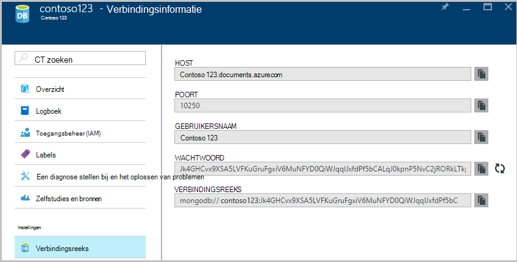

2. Klik op **verbinding maken** om de Connection Manager openen en klik op **Nieuwe verbinding**

    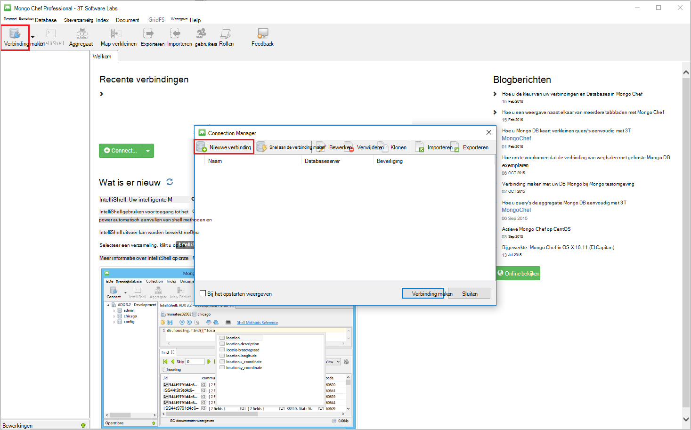
    
2. Voer in het venster **Nieuwe verbinding** op het tabblad **Server** , de HOST (FQDN) van de account DocumentDB met protocolondersteuning voor MongoDB en de poort.
    
    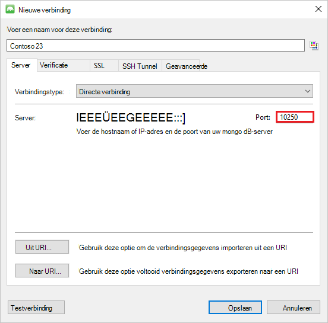

3. In het venster **Nieuwe verbinding** op het tabblad **verificatie** kiest u verificatiemodus **standaard (MONGODB-CR of SCARM-SHA-1)** en voer de gebruikersnaam en wachtwoord.  Accepteer de standaard verificatie db (admin) of uw eigen waarde opgeven.

    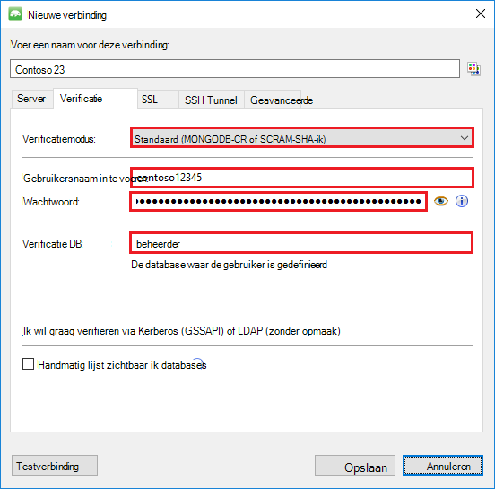

4. Schakel het selectievakje **protocol SSL gebruiken om verbinding te maken** en het keuzerondje **zelfondertekend SSL-certificaten accepteren** in het venster **Nieuwe verbinding** op het tabblad **SSL** .

    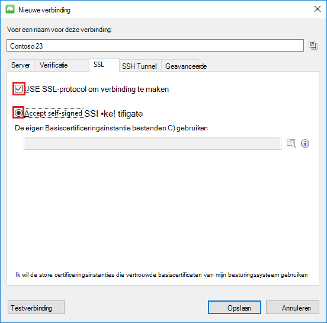

5. Klik op de knop **Verbinding testen** om de verbindingsgegevens valideren, klikt u op **OK** om terug te keren naar het venster nieuwe verbinding en klik vervolgens op **Opslaan**.

    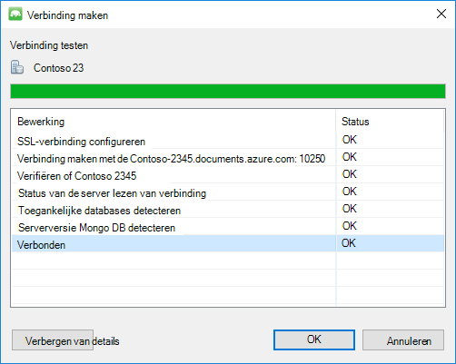

## MongoChef gebruiken om te maken van een database, siteverzamelingen en documenten  

Als u wilt maken van een database, siteverzamelingen en documenten met MongoChef, moet u de volgende stappen uitvoeren.

1. **Connection Manager**, markeer de verbinding en klik op **verbinding maken**.

    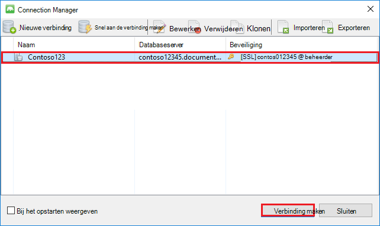

2. Klik met de rechtermuisknop op de host en kies **Database toevoegen**.  Geef een databasenaam en klik op **OK**.
    
    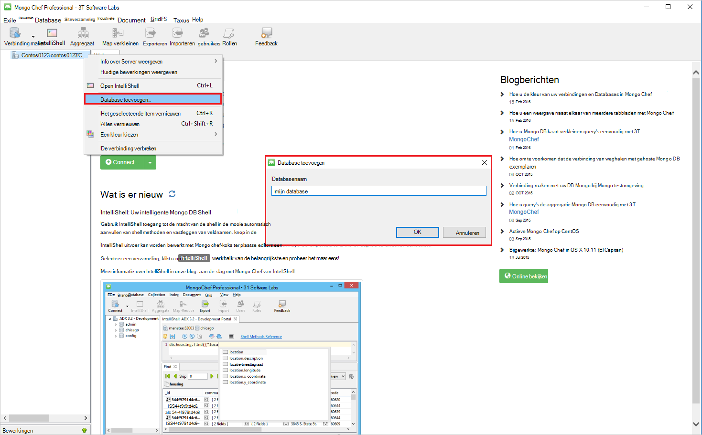

3. Klik met de rechtermuisknop op de database en kies **Verzameling toevoegen**.  Geef een naam voor de siteverzameling en klik op **maken**.

    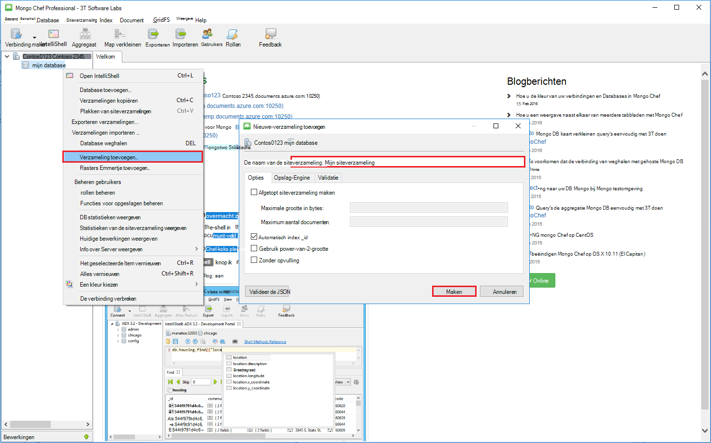

4. Klik op de menuopdracht **siteverzameling** en klik op **Document toevoegen**.

    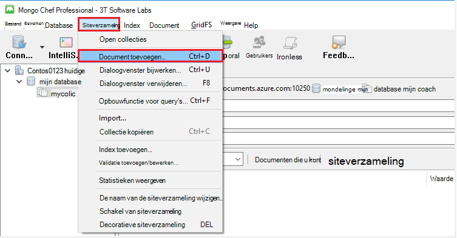

5. Plak de volgende in het dialoogvenster Document toevoegen en klik op **Document toevoegen**.

        {
        "_id": "AndersenFamily",
        "lastName": "Andersen",
        "parents": [
            { "firstName": "Thomas" },
            { "firstName": "Mary Kay"}
        ],
        "children": [
        {
            "firstName": "Henriette Thaulow", "gender": "female", "grade": 5,
            "pets": [{ "givenName": "Fluffy" }]
        }
        ],
        "address": { "state": "WA", "county": "King", "city": "seattle" },
        "isRegistered": true
        }

    
6. Een ander document, deze tijd met de volgende inhoud toevoegen.

        {
        "_id": "WakefieldFamily",
        "parents": [
            { "familyName": "Wakefield", "givenName": "Robin" },
            { "familyName": "Miller", "givenName": "Ben" }
        ],
        "children": [
            {
                "familyName": "Merriam", 
                "givenName": "Jesse", 
                "gender": "female", "grade": 1,
                "pets": [
                    { "givenName": "Goofy" },
                    { "givenName": "Shadow" }
                ]
            },
            { 
                "familyName": "Miller", 
                "givenName": "Lisa", 
                "gender": "female", 
                "grade": 8 }
        ],
        "address": { "state": "NY", "county": "Manhattan", "city": "NY" },
        "isRegistered": false
        }

7. Van voorbeeldquery's uitvoeren. Bijvoorbeeld gezinnen met de achternaam 'Andersen' zoeken en terug te keren ouders en staat velden.

    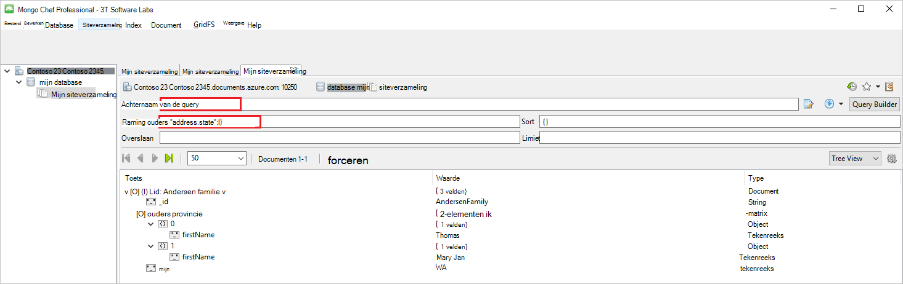
    

## Volgende stappen

- Uitzoeken DocumentDB met protocolondersteuning voor MongoDB [voorbeelden](documentdb-mongodb-samples.md).

 
