<properties
    pageTitle="De DocumentDB aanvragen en opslag monitoren | Microsoft Azure"
    description="Leer hoe u uw account DocumentDB voor prestatiegegevens, zoals aanvragen en serverfouten, en gebruik de doelstellingen, zoals opslag verbruik controleren."
    services="documentdb"
    documentationCenter=""
    authors="mimig1"
    manager="jhubbard"
    editor="cgronlun"/>

<tags
    ms.service="documentdb"
    ms.workload="data-services"
    ms.tgt_pltfrm="na"
    ms.devlang="na"
    ms.topic="article"
    ms.date="10/17/2016"
    ms.author="mimig"/>

# Controleren DocumentDB aanvragen, gebruik en opslag

U kunt uw Azure DocumentDB-accounts in de [portal van Azure](https://portal.azure.com/)controleren. Voor elk account DocumentDB zijn beide prestatiegegevens, zoals aanvragen en serverfouten en gebruik de doelstellingen, zoals opslag verbruik, beschikbaar.

Aan de doelstellingen kunnen worden gecontroleerd op het blad Account of op het nieuwe blad voor de doelstellingen.

## Prestatiegegevens weergave op het blad de doelstellingen

1. In een nieuw venster, open de [portal van Azure](https://portal.azure.com/)op **Meer Services**, klikt u op **DocumentDB (NoSQL)**, en klik vervolgens op de naam van de DocumentDB-account waarvoor u wilt bekijken van prestatiegegevens.
2. Klik in het menu resource op **aan de doelstellingen**.

Hiermee opent u het blad de doelstellingen en kunt u de verzameling moet worden gereviseerd. U kunt beschikbaarheid, aanvragen, doorvoer en opslag bekijken en deze vergelijken met de serviceovereenkomsten DocumentDB.

## Prestatiegegevens weergave op het blad account
1.  In een nieuw venster, open de [portal van Azure](https://portal.azure.com/)op **Meer Services**, klikt u op **DocumentDB (NoSQL)**, en klik vervolgens op de naam van de DocumentDB-account waarvoor u wilt bekijken van prestatiegegevens.

2.  De lens voor **controle** wordt standaard de volgende tegels weergegeven:
    *   Totaal aantal aanvragen voor de huidige dag.
    *   Opslagruimte gebruikt.

    Als uw tabel **geen gegevens beschikbaar worden** en u denkt dat er gegevens in uw database, raadpleegt u de sectie [Probleemoplossing](#troubleshooting) .

    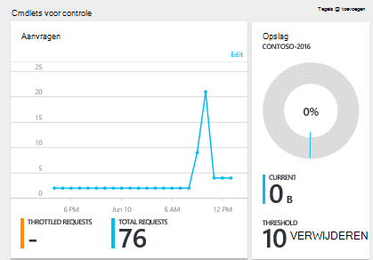

3.  Klikken op de **serviceaanvragen** of **opslag** tegel wordt geopend een gedetailleerde **Metrisch** blade.
4.  Het blad **Metrisch** leest u meer informatie over de criteria die u hebt geselecteerd.  Aan de bovenkant van het blad is een grafiek met aanvragen per uur uitgezet en daaronder dat is tabel waarin de aggregatie waarden voor vertraagd en totale aanvragen.  Het metrische blad ziet u ook de lijst met waarschuwingen die zijn gedefinieerd, gefilterd op de criteria die worden weergegeven op het huidige metrische blad (op deze manier hebt u een aantal waarschuwingen, ziet u alleen de relevante kleuren die hier worden gepresenteerd).   

    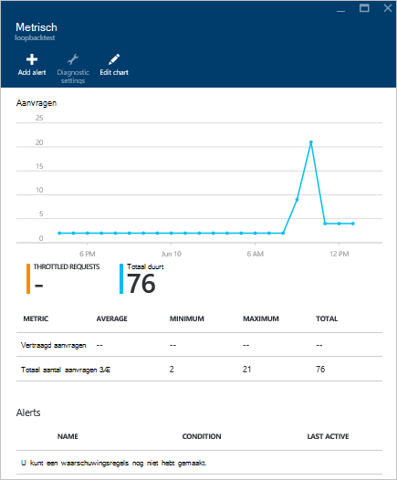

## Prestaties metrische weergaven in de portal aanpassen

1.  Als u wilt aanpassen aan de de doelstellingen die worden weergegeven in een bepaalde grafiek, klik op de grafiek om deze te openen in het blad **Metrisch** en klik vervolgens op **grafiek bewerken**.  
    

2.  Klik op het blad **Grafiek bewerken** , zijn er opties voor het wijzigen van de criteria die worden weergegeven in de grafiek, evenals hun tijdsbereik.  
    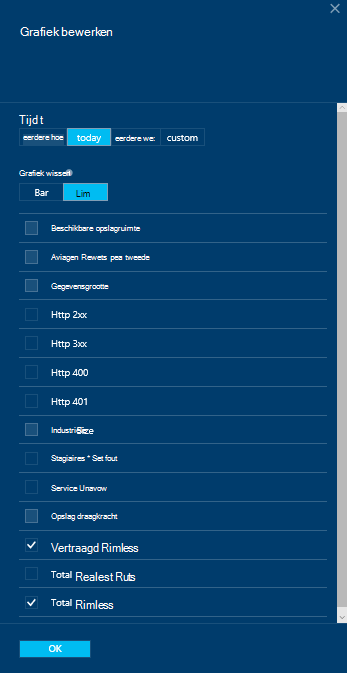

3.  Als u wilt wijzigen van de weergegeven in het gedeelte van de doelstellingen, selecteert u of de beschikbare prestatiegegevens wissen en klik vervolgens op **OK** onderaan in het blad.  
4.  Als u wilt het tijdsbereik wijzigen, kiest u een ander bereik (bijvoorbeeld **aangepaste**) en klik vervolgens op **OK** onderaan in het blad.  

    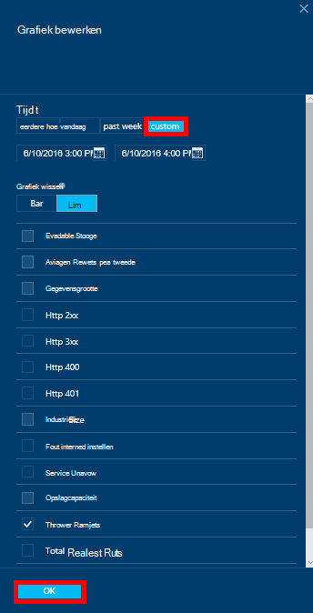

## Naast elkaar grafieken maken in de portal
De Portal Azure kunt u naast elkaar metrische grafieken maken.  

1.  Eerst, met de rechtermuisknop op de grafiek die u wilt kopiëren en selecteer **aanpassen**.

    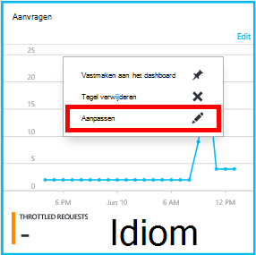

2.  Klik op **klonen** in het menu om te kopiëren het onderdeel en klik vervolgens op **Gereed aan te passen**.

    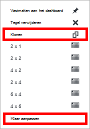  

U mogelijk dit onderdeel nu behandelen als andere metrische delen, het aan de doelstellingen en tijdbereik op weergegeven in het gedeelte aan te passen.  Dit doet, ziet u twee verschillende aan de doelstellingen grafiek-elkaar op hetzelfde moment.  
    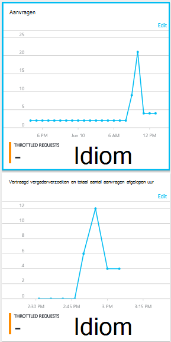  

## Waarschuwingen in de portal instellen
1.  In de [Azure-portal](https://portal.azure.com/), klik op **Meer Services**, klikt u op **DocumentDB (NoSQL)**en klik vervolgens op de naam van de DocumentDB-account waarvoor u wil instellen om prestaties metrische waarschuwingen.

2.  Klik in het menu resource op **Waarschuwingsregels** voor het openen van het blad waarschuwingsregels.  
    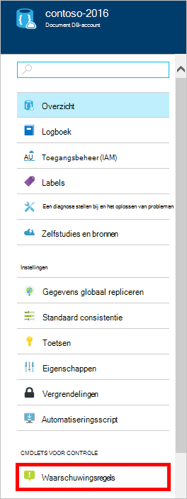

3.  Klik in het blad **waarschuwingsregels** op **melding toevoegen**.  
    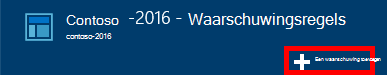

4.  Geef in het blad **een waarschuwing regel toevoegen** :
    *   De naam van de huidige regel die u instelt.
    *   Een beschrijving van de nieuwe waarschuwing regel.
    *   De meetwaarde voor de huidige regel.
    *   De voorwaarde, drempel en periode die bepalen wanneer de melding wordt geactiveerd. Een serverfout tellen bijvoorbeeld groter is dan 5 via de laatste 15 minuten.
    *   Opgeven of de service-beheerder en coadministrators per e-mail verzonden worden wanneer de melding wordt uitgevoerd.
    *   Extra e-mailadressen voor waarschuwingen.  
    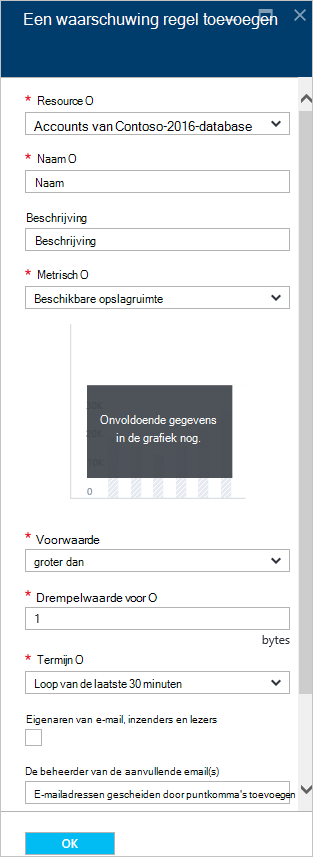

## DocumentDB via programmacode controleren
Het niveau account parameters die beschikbaar zijn in de portal, zoals account opslag gebruik en totaal aanvragen, zijn niet beschikbaar via de DocumentDB APIs. U kunt echter gebruiksgegevens op het niveau van de siteverzameling ophalen met behulp van de DocumentDB APIs. Ga als volgt te werk om op te halen niveau gegevens te verzamelen:

- Gebruik van de REST API, [een ophalen op de verzameling uitvoeren](https://msdn.microsoft.com/library/mt489073.aspx). Gegevens over de quota en gebruik voor de collectie wordt geretourneerd in de x-ms--quotum voor serverbronnen en x-ms--Resourcegebruik koppen in de reactie.
- Om de .NET SDK de methode [DocumentClient.ReadDocumentCollectionAsync](https://msdn.microsoft.com/library/microsoft.azure.documents.client.documentclient.readdocumentcollectionasync.aspx) , die als resultaat een [ResourceResponse](https://msdn.microsoft.com/library/dn799209.aspx) met een aantal eigenschappen van gebruik zoals **CollectionSizeUsage**, **DatabaseUsage**, **DocumentUsage**en meer te gebruiken.

Voor toegang tot extra statistieken, gebruikt u de [SDK van Azure Monitor](https://www.nuget.org/packages/Microsoft.Azure.Insights). Beschikbare metrische definities kunnen worden opgehaald door te bellen:

    https://management.azure.com/subscriptions/{SubscriptionId}/resourceGroups/{ResourceGroup}/providers/Microsoft.DocumentDb/databaseAccounts/{DocumentDBAccountName}/metricDefinitions?api-version=2015-04-08

Query's om op te halen afzonderlijke aan de doelstellingen gebruik de volgende indeling:

    https://management.azure.com/subscriptions/{SubecriptionId}/resourceGroups/{ResourceGroup}/providers/Microsoft.DocumentDb/databaseAccounts/{DocumentDBAccountName}/metrics?api-version=2015-04-08&$filter=%28name.value%20eq%20%27Total%20Requests%27%29%20and%20timeGrain%20eq%20duration%27PT5M%27%20and%20startTime%20eq%202016-06-03T03%3A26%3A00.0000000Z%20and%20endTime%20eq%202016-06-10T03%3A26%3A00.0000000Z

Zie [De Resource doelstellingen ophalen via het Azure Monitor REST API](https://blogs.msdn.microsoft.com/cloud_solution_architect/2016/02/23/retrieving-resource-metrics-via-the-azure-insights-api/)voor meer informatie. Houd er rekening mee dat "Azure Inights" gewijzigd "Azure Monitor".  In dit blogbericht verwijst naar de oudere naam.

## Problemen oplossen
Als uw controleren tegels het bericht **geen gegevens beschikbaar** weergeven en u onlangs hebt aangebracht aanvragen of gegevens toegevoegd aan de database, kunt u de tegel zodat de recente gebruik kunt bewerken.

### Een tegel als huidige gegevens wilt vernieuwen bewerken
1.  Als u wilt de statistieken die worden weergegeven in een bepaald gedeelte aanpassen, klikt u op de grafiek om te openen van het blad **Metrisch** en klik op **Grafiek bewerken**.  
    

2.  Klik op het blad **Grafiek bewerken** , klikt u in de sectie **Tijdsbereik** op **eerdere uur**en klik vervolgens op **OK**.  
    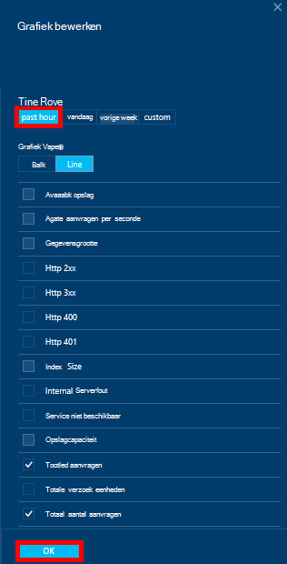

3.  De tegel moet nu vernieuwen met uw huidige gegevens en het gebruik.  
    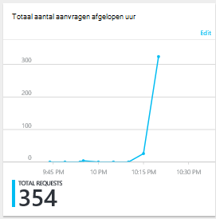

## Volgende stappen
Zie voor meer informatie over DocumentDB capaciteit, [capaciteit DocumentDB beheren](documentdb-manage.md).
