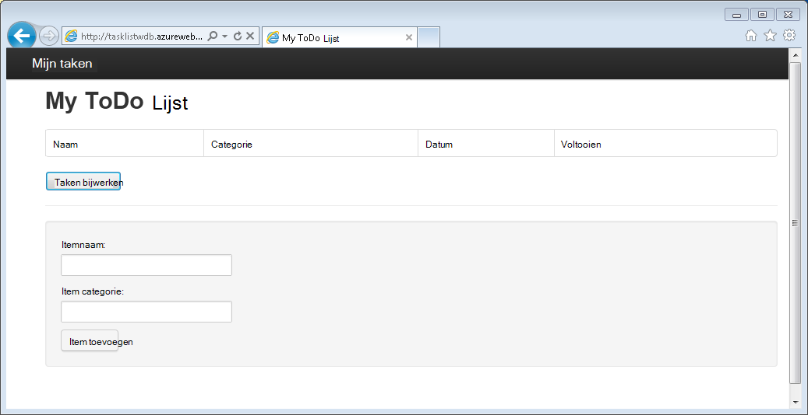
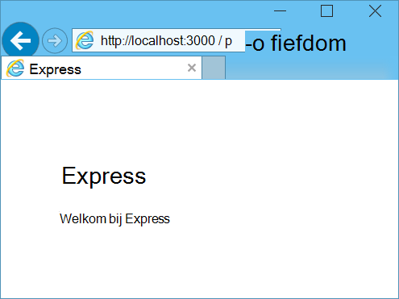
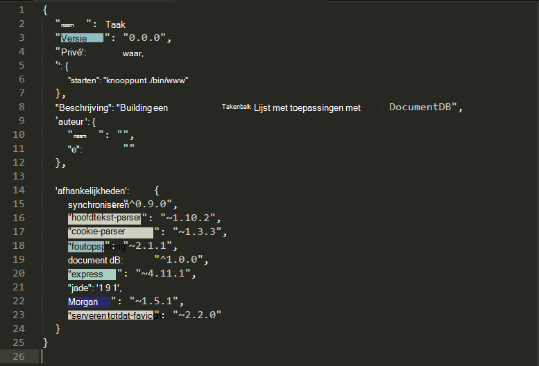
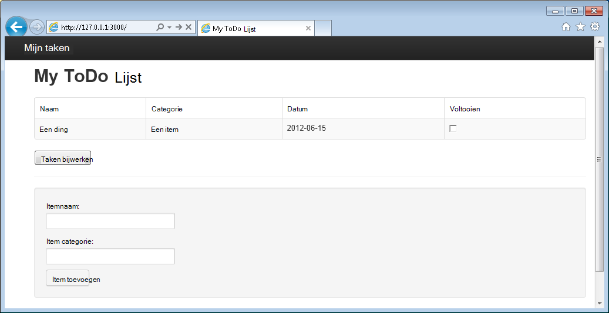

<properties 
    pageTitle="Meer Node.js - DocumentDB Node.js zelfstudie | Microsoft Azure" 
    description="Informatie over Node.js! Zelfstudie behandelt het gebruik van Microsoft Azure DocumentDB om op te slaan en access-gegevens uit een Node.js Express-webtoepassing die worden gehost op Azure-Websites." 
    keywords="Ontwikkelen van toepassingen, zelfstudie, meer node.js, node.js zelfstudie, documentdb, azure, Microsoft azure"
    services="documentdb" 
    documentationCenter="nodejs" 
    authors="syamkmsft" 
    manager="jhubbard" 
    editor="cgronlun"/>

<tags 
    ms.service="documentdb" 
    ms.workload="data-services" 
    ms.tgt_pltfrm="na" 
    ms.devlang="nodejs" 
    ms.topic="hero-article" 
    ms.date="08/25/2016" 
    ms.author="syamk"/>

# Een Node.js webtoepassing met DocumentDB maken

> [AZURE.SELECTOR]
- [.NET](documentdb-dotnet-application.md)
- [Node.js](documentdb-nodejs-application.md)
- [Java](documentdb-java-application.md)
- [Python](documentdb-python-application.md)

Deze zelfstudie Node.js ziet u hoe u het gebruik van de service Azure DocumentDB om op te slaan en access-gegevens uit een Node.js Express-toepassing die worden gehost op Azure-Websites.

Het is raadzaam om aan de slag door de volgende video, waar u hoe leert u een account van de database Azure DocumentDB inrichten en JSON-documenten opslaan in uw toepassing Node.js te bekijken. 

> [AZURE.VIDEO azure-demo-getting-started-with-azure-documentdb-on-nodejs-in-linux]

Vervolgens terug naar deze zelfstudie Node.js waar leert u de antwoorden op de volgende vragen:

- Hoe werk ik met gebruik van de documentdb npm module DocumentDB?
- Hoe kan ik de webtoepassing Azure Websites implementeren?

Door deze zelfstudie te volgen, stelt u een eenvoudige web gebaseerde-Taakbeheer-toepassing waarmee kunt maken, ophalen en voltooien van taken. De taken worden opgeslagen als JSON-documenten in Azure DocumentDB.

Geen tijd in beslag de zelfstudie hebt en u wilt ophalen van de volledige oplossing? Geen probleem, kunt u de oplossing voltooid voorbeeld krijgen van [GitHub][].

## Vereisten voor

> [AZURE.TIP] Deze zelfstudie Node.js wordt ervan uitgegaan dat er enkele ervaring met Node.js en Azure-Websites.

Voordat u de instructies in dit artikel te volgen, moet u ervoor zorgen dat u het volgende hebt:

- Een actieve Azure-account. Als u geen account hebt, kunt u een gratis proefabonnement-account maken in een paar minuten. Zie [Azure gratis proefversie](https://azure.microsoft.com/pricing/free-trial/)voor meer informatie.
- [Node.js][] versie v0.10.29 of hoger.
- [Express genereren](http://www.expressjs.com/starter/generator.html) (u kunt dit via installeren `npm install express-generator -g`)
- [Cijfer][].

## Stap 1: Maak een account van de database DocumentDB

Laten we beginnen met het maken van een DocumentDB-account. Als u al een account hebt, kunt u doorgaan met [stap 2: Maak een nieuwe Node.js-toepassing](#_Toc395783178).

[AZURE.INCLUDE [documentdb-create-dbaccount](../../includes/documentdb-create-dbaccount.md)]

[AZURE.INCLUDE [documentdb-keys](../../includes/documentdb-keys.md)]

## Stap 2: Leer hoe u een nieuwe Node.js-toepassing maken

Nu we Leer hoe u een eenvoudige Hallo wereld Node.js project met het framework [Express](http://expressjs.com/) maken.

1. Open uw favoriete terminal.

2. Gebruik de express genereren om een nieuwe toepassing met de naam van de **taak**.

        express todo

3. Open het telefoonboek van uw nieuwe **taak** en afhankelijkheden te installeren.

        cd todo
        npm install

4. Voer uw nieuwe toepassing uit.

        npm start

5. U kunt u uw nieuwe toepassing weergeven door te gaan van uw browser naar [http://localhost:3000](http://localhost:3000).

    

## Stap 3: Aanvullende modules installeren

Het bestand **package.json** is een van de bestanden die zijn gemaakt in de hoofdmap van het project. Dit bestand bevat een lijst met extra modules die vereist voor uw toepassing Node.js zijn. Later, wanneer u deze toepassing naar een Azure-Websites implementeert, dit bestand wordt gebruikt om te bepalen welke modules moeten worden geïnstalleerd op Azure ter ondersteuning van uw toepassing. Nog steeds moeten we twee meer pakketten voor deze zelfstudie te installeren.

1. Installeer de module **asynchrone** via npm terug in de terminal.

        npm install async --save

1. Installeer de module **documentdb** via npm. Dit is de module waarbij alle de DocumentDB magie gebeurt.

        npm install documentdb --save

3. Een snelle controle van het bestand **package.json** van de toepassing moet de aanvullende modules worden weergegeven. Dit bestand kunt Azure nagaan welke pakketten downloaden en installeren wanneer u de toepassing uitvoeren. Dit moet er dan ongeveer in het onderstaande voorbeeld:

    

    Hiermee wordt aangegeven knooppunt (en later Azure) dat uw toepassing afhankelijk van deze extra modules is.

## Stap 4: De service DocumentDB gebruiken in een toepassing voor knooppunt.

Die zorgt voor de eerste installatie en configuratie, nu we get omlaag naar waarom we u hier graag en die is voor het schrijven van Azure DocumentDB met code.

### Het model maken

1. Maak een nieuwe map met de naam **modellen**in de adreslijst project.
2. Maak een nieuw bestand met de naam **taskDao.js**in de adreslijst **modellen** . Dit bestand bevat het model voor de taken die zijn gemaakt door de toepassing.
3. In dezelfde map **modellen** , een andere nieuwe-bestand met de naam **docdbUtils.js**te maken. Dit bestand bevat enkele nuttige, herbruikbare, code die we in onze toepassing gebruiken. 
4. Kopieer de volgende code in naar **docdbUtils.js**

        var DocumentDBClient = require('documentdb').DocumentClient;
            
        var DocDBUtils = {
            getOrCreateDatabase: function (client, databaseId, callback) {
                var querySpec = {
                    query: 'SELECT * FROM root r WHERE r.id= @id',
                    parameters: [{
                        name: '@id',
                        value: databaseId
                    }]
                };
        
                client.queryDatabases(querySpec).toArray(function (err, results) {
                    if (err) {
                        callback(err);
        
                    } else {
                        if (results.length === 0) {
                            var databaseSpec = {
                                id: databaseId
                            };
        
                            client.createDatabase(databaseSpec, function (err, created) {
                                callback(null, created);
                            });
        
                        } else {
                            callback(null, results[0]);
                        }
                    }
                });
            },
        
            getOrCreateCollection: function (client, databaseLink, collectionId, callback) {
                var querySpec = {
                    query: 'SELECT * FROM root r WHERE r.id=@id',
                    parameters: [{
                        name: '@id',
                        value: collectionId
                    }]
                };             
                
                client.queryCollections(databaseLink, querySpec).toArray(function (err, results) {
                    if (err) {
                        callback(err);
        
                    } else {        
                        if (results.length === 0) {
                            var collectionSpec = {
                                id: collectionId
                            };
                            
                            client.createCollection(databaseLink, collectionSpec, function (err, created) {
                                callback(null, created);
                            });
        
                        } else {
                            callback(null, results[0]);
                        }
                    }
                });
            }
        };
                
        module.exports = DocDBUtils;

    > [AZURE.TIP] createCollection kent een optioneel requestOptions-parameter die kan worden gebruikt om op te geven van het Type bieden voor de siteverzameling. Als er geen waarde requestOptions.offerType wordt opgegeven, wordt er de verzameling worden gemaakt met behulp van de Type bieden.
    >
    > Raadpleeg voor meer informatie over DocumentDB bieden typen [prestatieniveaus in DocumentDB](documentdb-performance-levels.md) 
        
3. Opslaan en sluit het bestand **docdbUtils.js** .

4. Voeg de volgende code om te verwijzen naar de **DocumentDBClient** en de **docdbUtils.js** die we hebben gemaakt boven aan het begin van het bestand **taskDao.js** :

        var DocumentDBClient = require('documentdb').DocumentClient;
        var docdbUtils = require('./docdbUtils');

4. Vervolgens voegt u code om te definiëren en exporteren van het object taak. Dit is verantwoordelijk voor initialisatie van onze object taak en het instellen van de Database en de verzameling documenten die we gebruiken.

        function TaskDao(documentDBClient, databaseId, collectionId) {
          this.client = documentDBClient;
          this.databaseId = databaseId;
          this.collectionId = collectionId;
        
          this.database = null;
          this.collection = null;
        }
        
        module.exports = TaskDao;

5. Voeg nu de volgende code om extra methoden definiëren op het object taak, waardoor interacties met de gegevens die zijn opgeslagen in DocumentDB.

        TaskDao.prototype = {
            init: function (callback) {
                var self = this;
        
                docdbUtils.getOrCreateDatabase(self.client, self.databaseId, function (err, db) {
                    if (err) {
                        callback(err);
                    } else {
                        self.database = db;
                        docdbUtils.getOrCreateCollection(self.client, self.database._self, self.collectionId, function (err, coll) {
                            if (err) {
                                callback(err);
        
                            } else {
                                self.collection = coll;
                            }
                        });
                    }
                });
            },
        
            find: function (querySpec, callback) {
                var self = this;
        
                self.client.queryDocuments(self.collection._self, querySpec).toArray(function (err, results) {
                    if (err) {
                        callback(err);
        
                    } else {
                        callback(null, results);
                    }
                });
            },
        
            addItem: function (item, callback) {
                var self = this;
        
                item.date = Date.now();
                item.completed = false;
        
                self.client.createDocument(self.collection._self, item, function (err, doc) {
                    if (err) {
                        callback(err);
        
                    } else {
                        callback(null, doc);
                    }
                });
            },
        
            updateItem: function (itemId, callback) {
                var self = this;
        
                self.getItem(itemId, function (err, doc) {
                    if (err) {
                        callback(err);
        
                    } else {
                        doc.completed = true;
        
                        self.client.replaceDocument(doc._self, doc, function (err, replaced) {
                            if (err) {
                                callback(err);
        
                            } else {
                                callback(null, replaced);
                            }
                        });
                    }
                });
            },
        
            getItem: function (itemId, callback) {
                var self = this;
        
                var querySpec = {
                    query: 'SELECT * FROM root r WHERE r.id = @id',
                    parameters: [{
                        name: '@id',
                        value: itemId
                    }]
                };
        
                self.client.queryDocuments(self.collection._self, querySpec).toArray(function (err, results) {
                    if (err) {
                        callback(err);
        
                    } else {
                        callback(null, results[0]);
                    }
                });
            }
        };

6. Opslaan en sluit het bestand **taskDao.js** . 

### De domeincontroller maakt

1. Maak een nieuw bestand met de naam **tasklist.js**in de adreslijst **routes** van uw project. 
2. Voeg de volgende code toe **tasklist.js**. Hiermee wordt de DocumentDBClient en asynchrone modules, die worden gebruikt door **tasklist.js**geladen. Dit ook de functie **TaskList** , die een exemplaar van de **taak** -object die zoals eerder gedefinieerd wordt doorgegeven gedefinieerd:

        var DocumentDBClient = require('documentdb').DocumentClient;
        var async = require('async');
        
        function TaskList(taskDao) {
          this.taskDao = taskDao;
        }
        
        module.exports = TaskList;

3. Gaat u verder toe te voegen aan het bestand **tasklist.js** door toe te voegen van de gebruikte **showTasks, addTask**en **completeTasks**methoden:
        
        TaskList.prototype = {
            showTasks: function (req, res) {
                var self = this;
        
                var querySpec = {
                    query: 'SELECT * FROM root r WHERE r.completed=@completed',
                    parameters: [{
                        name: '@completed',
                        value: false
                    }]
                };
        
                self.taskDao.find(querySpec, function (err, items) {
                    if (err) {
                        throw (err);
                    }
        
                    res.render('index', {
                        title: 'My ToDo List ',
                        tasks: items
                    });
                });
            },
        
            addTask: function (req, res) {
                var self = this;
                var item = req.body;
        
                self.taskDao.addItem(item, function (err) {
                    if (err) {
                        throw (err);
                    }
        
                    res.redirect('/');
                });
            },
        
            completeTask: function (req, res) {
                var self = this;
                var completedTasks = Object.keys(req.body);
        
                async.forEach(completedTasks, function taskIterator(completedTask, callback) {
                    self.taskDao.updateItem(completedTask, function (err) {
                        if (err) {
                            callback(err);
                        } else {
                            callback(null);
                        }
                    });
                }, function goHome(err) {
                    if (err) {
                        throw err;
                    } else {
                        res.redirect('/');
                    }
                });
            }
        };

4. Opslaan en sluit het bestand **tasklist.js** .
 
### Config.js toevoegen

1. Maak een nieuw bestand met de naam **config.js**in het telefoonboek van uw project.
2. Voeg de volgende **config.js**. Hiermee definieert u configuratie-instellingen en waarden die u nodig hebt voor de toepassing.

        var config = {}
        
        config.host = process.env.HOST || "[the URI value from the DocumentDB Keys blade on http://portal.azure.com]";
        config.authKey = process.env.AUTH_KEY || "[the PRIMARY KEY value from the DocumentDB Keys blade on http://portal.azure.com]";
        config.databaseId = "ToDoList";
        config.collectionId = "Items";
        
        module.exports = config;

3. In het bestand **config.js** , moet u de waarden van HOST en AUTH_KEY met de waarden die zijn gevonden in het blad toetsen van uw account DocumentDB op de [Portal van Microsoft Azure](https://portal.azure.com)bijwerken:

4. Opslaan en sluit het bestand **config.js** .
 
### App.js wijzigen

1. Open het bestand **app.js** in de projectmap. Dit bestand is eerder hebt gemaakt wanneer de webtoepassing Express is gemaakt.
2. De volgende code toevoegen aan de bovenkant van **app.js**
    
        var DocumentDBClient = require('documentdb').DocumentClient;
        var config = require('./config');
        var TaskList = require('./routes/tasklist');
        var TaskDao = require('./models/taskDao');

3. Deze code definieert het configuratiebestand moet worden gebruikt, en verloopt de waarden uit dit bestand in op sommige variabelen die we spoedig gebruiken lezen.
4. Vervang de volgende twee regels in **app.js** bestand:

        app.use('/', routes);
        app.use('/users', users); 

      met het volgende fragment:

        var docDbClient = new DocumentDBClient(config.host, {
            masterKey: config.authKey
        });
        var taskDao = new TaskDao(docDbClient, config.databaseId, config.collectionId);
        var taskList = new TaskList(taskDao);
        taskDao.init();
        
        app.get('/', taskList.showTasks.bind(taskList));
        app.post('/addtask', taskList.addTask.bind(taskList));
        app.post('/completetask', taskList.completeTask.bind(taskList));
        app.set('view engine', 'jade');

6. Deze regels definiëren van een nieuw exemplaar van onze **TaskDao** -object, met een nieuwe verbinding met DocumentDB (met de waarden uit de **config.js**lezen), de taakobject geïnitialiseerd en maak vervolgens afhankelijk formulieracties methoden op de controller van onze **TaskList** . 

7. Ten slotte, opslaan en sluit het bestand **app.js** , we bijna klaar bent.
 
## Stap 5: Een gebruikersinterface maken

Nu gaan we kijken tot het bouwen van de gebruikersinterface, zodat een gebruiker daadwerkelijk met de toepassing werken kunt. De Express-toepassing die u hebt gemaakt, gebruikt als de weergave-engine **Jade** . Raadpleeg voor meer informatie over Jade [http://jade-lang.com/](http://jade-lang.com/).

1. Het bestand **layout.jade** in de map **weergaven** wordt gebruikt als een globale sjabloon voor andere **.jade** -bestanden. In deze stap wijzigt u, zodat het gebruiken van [Twitter-Bootstrap](https://github.com/twbs/bootstrap), namelijk een toolkit die kunt u heel gemakkelijk een nette ogende website te ontwerpen. 
2. Open het bestand **layout.jade** zijn gevonden in de map **weergaven** en de inhoud vervangen door het volgende voorbeeld:
    
        doctype html
        html
          head
            title= title
            link(rel='stylesheet', href='//ajax.aspnetcdn.com/ajax/bootstrap/3.3.2/css/bootstrap.min.css')
            link(rel='stylesheet', href='/stylesheets/style.css')
          body
            nav.navbar.navbar-inverse.navbar-fixed-top
              div.navbar-header
                a.navbar-brand(href='#') My Tasks
            block content
            script(src='//ajax.aspnetcdn.com/ajax/jQuery/jquery-1.11.2.min.js')
            script(src='//ajax.aspnetcdn.com/ajax/bootstrap/3.3.2/bootstrap.min.js')

    Hiermee effectief Hiermee wordt aan de **Jade** engine om HTML voor de toepassing weer te geven en Hiermee maakt u een **blok** genoemd **inhoud** waarmee we de lay-out kunt leveren voor onze inhoudspagina's.
    Opslaan en sluit dit bestand **layout.jade** .

4. Nu opent u het bestand **index.jade** , de weergave die worden gebruikt door de toepassing en de inhoud van het bestand te vervangen door het volgende:

        extends layout
        
        block content
          h1 #{title}
          br
        
          form(action="/completetask", method="post")
            table.table.table-striped.table-bordered
              tr
                td Name
                td Category
                td Date
                td Complete
              if (typeof tasks === "undefined")
                tr
                  td
              else
                each task in tasks
                  tr
                    td #{task.name}
                    td #{task.category}
                    - var date  = new Date(task.date);
                    - var day   = date.getDate();
                    - var month = date.getMonth() + 1;
                    - var year  = date.getFullYear();
                    td #{month + "/" + day + "/" + year}
                    td
                      input(type="checkbox", name="#{task.id}", value="#{!task.completed}", checked=task.completed)
            button.btn(type="submit") Update tasks
          hr
          form.well(action="/addtask", method="post")
            label Item Name:
            input(name="name", type="textbox")
            label Item Category:
            input(name="category", type="textbox")
            br
            button.btn(type="submit") Add item

    Dit breidt de mogelijkheden indeling en inhoud voor de tijdelijke aanduiding voor de **inhoud** die hebt gezien in het bestand **layout.jade** eerder bevat.
    
    In deze indeling die u hebt gemaakt twee HTML-formulieren. 
    Het eerste formulier bevat een tabel voor onze gegevens en een knop waarmee wij items via de methode **/completetask** van onze controller bijwerken.
    Het tweede formulier bevat twee invoervelden en een knop waarmee wij een nieuw item maken via de methode **/addtask** van onze controller.
    
    Dit moet alle die we nodig voor de toepassing om te werken.

5. Open het bestand **style.css** in **public\stylesheets** directory en de code vervangen door het volgende:

        body {
          padding: 50px;
          font: 14px "Lucida Grande", Helvetica, Arial, sans-serif;
        }
        a {
          color: #00B7FF;
        }
        .well label {
          display: block;
        }
        .well input {
          margin-bottom: 5px;
        }
        .btn {
          margin-top: 5px;
          border: outset 1px #C8C8C8;
        }

    Opslaan en sluit dit bestand **style.css** .

## Stap 6: Uw toepassing lokaal uitvoeren

1. Als u wilt testen van de toepassing op uw lokale computer, worden uitgevoerd `npm start` in een terminal uw toepassing te starten en een browser met een pagina die op de onderstaande afbeelding lijkt starten:

    

2. De betreffende velden voor het Item, de naam van het Item en categorie gebruiken om gegevens te voeren en klik vervolgens op **Item toevoegen**.

3. De pagina moet bijwerken zodat het nieuwe item in de takenlijst.

    

4. Het uitvoeren van een taak, schakelt u gewoon het selectievakje in de kolom voltooid en klik op **taken bijwerken**.

## Stap 7: Uw toepassing ontwikkelingsproject implementeren naar Azure-Websites

1. Als u nog niet is gedaan, kunt u een cijfer opslagplaats voor uw Website Azure. U vindt instructies over hoe u dit wilt doen in het onderwerp [Lokaal cijfer te implementeren naar Azure App-Service](../app-service-web/app-service-deploy-local-git.md) .

2. Voeg uw Azure-Website als een externe cijfer.

        git remote add azure https://username@your-azure-website.scm.azurewebsites.net:443/your-azure-website.git

3. Door te drukken naar de externe implementeren.

        git push azure master

4. In een paar seconden wordt cijfer klaar bent met uw webtoepassing te publiceren en starten van een browser waar u uw handige werk uitgevoerd in Azure kunt zien!

## Volgende stappen

Gefeliciteerd! U hebt alleen uw eerste Node.js Express webtoepassing met Azure DocumentDB ingebouwd en deze naar Azure Websites die zijn gepubliceerd.

De broncode voor de volledige verwijzing-toepassing kan worden gedownload van [GitHub][].

Zie het [Node.js Developer Center](https://azure.microsoft.com/develop/nodejs/)voor meer informatie.

[Node.js]: http://nodejs.org/
[Cijfer]: http://git-scm.com/
[Github]: https://github.com/Azure-Samples/documentdb-node-todo-app
 
