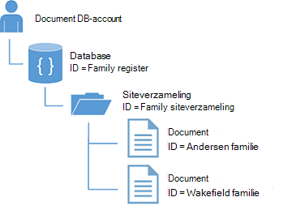
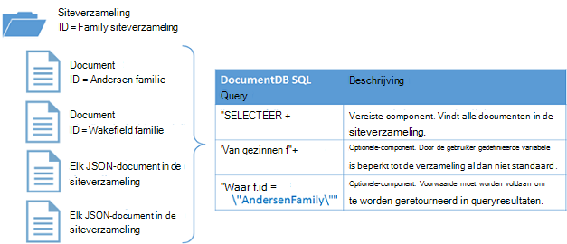

<properties
  pageTitle="NoSQL Node.js zelfstudie voor DocumentDB | Microsoft Azure"
  description="Een NoSQL Node.js zelfstudie waarmee een knooppunt-database en console-toepassing met behulp van de DocumentDB Node.js SDK. DocumentDB is een database NoSQL voor JSON."
    keywords="node.js zelfstudie knooppunt-database"
  services="documentdb"
  documentationCenter="node.js"
  authors="AndrewHoh"
  manager="jhubbard"
  editor="monicar"/>

<tags
  ms.service="documentdb"
  ms.workload="data-services"
  ms.tgt_pltfrm="na"
  ms.devlang="node"
  ms.topic="hero-article"
  ms.date="08/11/2016"
  ms.author="anhoh"/>

# <a name="nosql-nodejs-tutorial-documentdb-nodejs-console-application"></a>NoSQL Node.js zelfstudie: DocumentDB Node.js console-toepassing  

> [AZURE.SELECTOR]
- [.NET](documentdb-get-started.md)
- [Node.js](documentdb-nodejs-get-started.md)

Welkom bij de zelfstudie Node.js voor de SDK van Azure DocumentDB Node.js! Na het uitvoeren van deze zelfstudie, hebt u een consoletoepassing die wordt gemaakt en query's DocumentDB bronnen, waaronder databases knooppunt.

Besproken:

- Maken en de verbinding met een account DocumentDB
- Bij het instellen van uw toepassing
- Maken van een database knooppunt
- Een siteverzameling maken
- JSON-documenten maken
- Query's uitvoeren van de siteverzameling
- Een document vervangen
- Een document verwijderen
- Verwijderen van de database knooppunt

Geen tijd hebt? Maak je niet druk! De volledige oplossing is beschikbaar op [GitHub](https://github.com/Azure-Samples/documentdb-node-getting-started). Zie [de volledige oplossing ophalen](#GetSolution) voor snelle instructies.

Nadat u de zelfstudie Node.js hebt uitgevoerd, gebruik de stemknoppen boven en onder aan deze pagina om ons feedback. Als u wij rechtstreeks contact met u opnemen dat wilt, je mag rustig opnemen van uw e-mailadres in uw opmerkingen.

Nu we aan de slag!

## <a name="prerequisites-for-the-nodejs-tutorial"></a>Vereisten voor de zelfstudie Node.js

Zorg ervoor dat u hebt het volgende:

- Een actieve Azure-account. Als u deze niet hebt, kunt u zich registreren voor een [Gratis proefversie van Azure](https://azure.microsoft.com/pricing/free-trial/).
- [Node.js](https://nodejs.org/) versie v0.10.29 of hoger.

## <a name="step-1-create-a-documentdb-account"></a>Stap 1: Een DocumentDB-account maken

Laten we een DocumentDB-account maken. Als u al een account dat u wilt gebruiken, kunt u verder gaan om [uw Node.js-toepassing in te stellen](#SetupNode).

[AZURE.INCLUDE [documentdb-create-dbaccount](../../includes/documentdb-create-dbaccount.md)]

## <a id="SetupNode"></a>Stap 2: Stel uw Node.js-toepassing

1. Open uw favoriete terminal.
2. Zoek de map of de map waar u naartoe wilt opslaan van uw Node.js-toepassing.
3. Maak twee lege JavaScript-bestanden met de volgende opdrachten:
  - Windows:
      * ```fsutil file createnew app.js 0```
        * ```fsutil file createnew config.js 0```
  - Linux/OS X:
      * ```touch app.js```
        * ```touch config.js```
4. Installeer de module documentdb via npm. Gebruik de volgende opdracht uit:
    * ```npm install documentdb --save```

Uitstekende! Nu u klaar bent met het instellen van, laten we beginnen met code schrijven.

## <a id="Config"></a>Stap 3: Stel van uw app configuraties

Open ```config.js``` in uw favoriete teksteditor.

Typt u vervolgens, kopiëren en plakken in het onderstaande codefragment en eigenschappen instellen ```config.endpoint``` en ```config.primaryKey``` aan uw DocumentDB eindpunt uri en de primaire sleutel. Beide deze configuraties vindt u in de [Portal van Azure](https://portal.azure.com).

![Node.js zelfstudie - schermafbeelding van de Azure-Portal met een account DocumentDB, met de actieve hub gemarkeerd, de knop TOETSEN is gemarkeerd op het blad DocumentDB-account en de URI, de primaire sleutel en de tweede sleutel waarden die zijn gemarkeerd op het blad toetsen - knooppunt-database][keys]

    // ADD THIS PART TO YOUR CODE
    var config = {}

    config.endpoint = "~your DocumentDB endpoint uri here~";
    config.primaryKey = "~your primary key here~";

Kopieer en plak de ```database id```, ```collection id```, en ```JSON documents``` naar uw ```config``` object waarin u instellen onder uw ```config.endpoint``` en ```config.authKey``` eigenschappen. Als u de gegevens die u wilt opslaan in uw database al hebt, kunt u de DocumentDB [migratieprogramma van gegevens](documentdb-import-data.md) in plaats van de documentdefinities toevoegen.

    config.endpoint = "~your DocumentDB endpoint uri here~";
    config.primaryKey = "~your primary key here~";

    // ADD THIS PART TO YOUR CODE
    config.database = {
        "id": "FamilyDB"
    };

    config.collection = {
        "id": "FamilyColl"
    };

    config.documents = {
        "Andersen": {
            "id": "Anderson.1",
            "lastName": "Andersen",
            "parents": [{
                "firstName": "Thomas"
            }, {
                    "firstName": "Mary Kay"
                }],
            "children": [{
                "firstName": "Henriette Thaulow",
                "gender": "female",
                "grade": 5,
                "pets": [{
                    "givenName": "Fluffy"
                }]
            }],
            "address": {
                "state": "WA",
                "county": "King",
                "city": "Seattle"
            }
        },
        "Wakefield": {
            "id": "Wakefield.7",
            "parents": [{
                "familyName": "Wakefield",
                "firstName": "Robin"
            }, {
                    "familyName": "Miller",
                    "firstName": "Ben"
                }],
            "children": [{
                "familyName": "Merriam",
                "firstName": "Jesse",
                "gender": "female",
                "grade": 8,
                "pets": [{
                    "givenName": "Goofy"
                }, {
                        "givenName": "Shadow"
                    }]
            }, {
                    "familyName": "Miller",
                    "firstName": "Lisa",
                    "gender": "female",
                    "grade": 1
                }],
            "address": {
                "state": "NY",
                "county": "Manhattan",
                "city": "NY"
            },
            "isRegistered": false
        }
    };


De database, siteverzamelingen en documentdefinities fungeert als uw DocumentDB ```database id```, ```collection id```, en gegevens van documenten.

Tot slot exporteren uw ```config``` object, zodat u kunt verwijzen naar binnen de ```app.js``` bestand.

            },
            "isRegistered": false
        }
    };

    // ADD THIS PART TO YOUR CODE
    module.exports = config;

##<a id="Connect"></a>Stap 4: Verbinding maken met een DocumentDB-account

Open uw leegmaken ```app.js``` bestand in de teksteditor. Kopieer en plak de code hieronder om te importeren de ```documentdb``` module en uw nieuwe ```config``` module.

    // ADD THIS PART TO YOUR CODE
    "use strict";

    var documentClient = require("documentdb").DocumentClient;
    var config = require("./config");
    var url = require('url');

Kopieer en plak de code als u wilt gebruiken het eerder opgeslagen ```config.endpoint``` en ```config.primaryKey``` maken van een nieuwe DocumentClient.

    var config = require("./config");
    var url = require('url');

    // ADD THIS PART TO YOUR CODE
    var client = new documentClient(config.endpoint, { "masterKey": config.primaryKey });

Nu dat u de code hebt initialisatie van de client documentdb, we even verder kijken bij het werken met DocumentDB resources.

## <a name="step-5-create-a-node-database"></a>Stap 5: Een knooppunt-database maken
Kopieer en plak de code hieronder om in te stellen de HTTP-status niet wordt gevonden, de url van de database en de url van de siteverzameling. Deze URL's hoe de client DocumentDB vindt u de juiste database en de siteverzameling.

    var client = new documentClient(config.endpoint, { "masterKey": config.primaryKey });

    // ADD THIS PART TO YOUR CODE
    var HttpStatusCodes = { NOTFOUND: 404 };
    var databaseUrl = `dbs/${config.database.id}`;
    var collectionUrl = `${databaseUrl}/colls/${config.collection.id}`;

Een [database](documentdb-resources.md#databases) kan worden gemaakt met behulp van de functie [createDatabase](https://azure.github.io/azure-documentdb-node/DocumentClient.html) van de klasse **DocumentClient** . Een database is de logische container document opslag partities over siteverzamelingen.

Kopiëren en plakken van de functie **getDatabase** voor het maken van uw nieuwe database in het bestand app.js met de ```id``` opgegeven in de ```config``` object. De functie moeten worden gecontroleerd als de database met dezelfde ```FamilyRegistry``` id nog niet bestaat. Als deze bestaat nog, keert we die database in plaats van een nieuwe id maken.

    var collectionUrl = `${databaseUrl}/colls/${config.collection.id}`;

    // ADD THIS PART TO YOUR CODE
    function getDatabase() {
        console.log(`Getting database:\n${config.database.id}\n`);

        return new Promise((resolve, reject) => {
            client.readDatabase(databaseUrl, (err, result) => {
                if (err) {
                    if (err.code == HttpStatusCodes.NOTFOUND) {
                        client.createDatabase(config.database, (err, created) => {
                            if (err) reject(err)
                            else resolve(created);
                        });
                    } else {
                        reject(err);
                    }
                } else {
                    resolve(result);
                }
            });
        });
    }

Kopieer en plak de code onder waarin u de functie **getDatabase** om toe te voegen de helper functie **Afsluiten** die het bericht afsluiten en de oproep door naar **getDatabase** -functie wordt afgedrukt instellen.

                } else {
                    resolve(result);
                }
            });
        });
    }

    // ADD THIS PART TO YOUR CODE
    function exit(message) {
        console.log(message);
        console.log('Press any key to exit');
        process.stdin.setRawMode(true);
        process.stdin.resume();
        process.stdin.on('data', process.exit.bind(process, 0));
    }

    getDatabase()
    .then(() => { exit(`Completed successfully`); })
    .catch((error) => { exit(`Completed with error ${JSON.stringify(error)}`) });

Zoek in uw terminal uw ```app.js``` bestands- en voert u de opdracht:```node app.js```

Gefeliciteerd! U hebt een DocumentDB-database gemaakt.

##<a id="CreateColl"></a>Stap 6: Een verzameling maken  

> [AZURE.WARNING] **CreateDocumentCollectionAsync** maakt een nieuwe collectie, die consequenties prijzen. Ga naar onze [pagina prijzen](https://azure.microsoft.com/pricing/details/documentdb/)voor meer informatie.

Een [siteverzameling](documentdb-resources.md#collections) kan worden gemaakt met behulp van de functie [createCollection](https://azure.github.io/azure-documentdb-node/DocumentClient.html) van de klasse **DocumentClient** . Een verzameling is een container van JSON-documenten en bijbehorende logica voor JavaScript-toepassing.

Kopiëren en plakken van de functie **getCollection** onder de **getDatabase** -functie voor het maken van de nieuwe verzameling met de ```id``` opgegeven in de ```config``` object. Klik nogmaals we wordt controleert u of een siteverzameling met dezelfde ```FamilyCollection``` id nog niet bestaat. Als deze bestaat nog, keert we die verzameling in plaats van een nieuwe id maken.

                } else {
                    resolve(result);
                }
            });
        });
    }

    // ADD THIS PART TO YOUR CODE
    function getCollection() {
        console.log(`Getting collection:\n${config.collection.id}\n`);

        return new Promise((resolve, reject) => {
            client.readCollection(collectionUrl, (err, result) => {
                if (err) {
                    if (err.code == HttpStatusCodes.NOTFOUND) {
                        client.createCollection(databaseUrl, config.collection, { offerThroughput: 400 }, (err, created) => {
                            if (err) reject(err)
                            else resolve(created);
                        });
                    } else {
                        reject(err);
                    }
                } else {
                    resolve(result);
                }
            });
        });
    }

Kopieer en plak de code onder de oproep door naar **getDatabase** uitvoeren van de functie **getCollection** .

    getDatabase()

    // ADD THIS PART TO YOUR CODE
    .then(() => getCollection())
    // ENDS HERE

    .then(() => { exit(`Completed successfully`); })
    .catch((error) => { exit(`Completed with error ${JSON.stringify(error)}`) });

Zoek in uw terminal naar uw ```app.js``` bestands- en voert u de opdracht:```node app.js```

Gefeliciteerd! U hebt een verzameling DocumentDB gemaakt.

##<a id="CreateDoc"></a>Stap 7: Een document maken
Een [document](documentdb-resources.md#documents) kan worden gemaakt met behulp van de functie [createDocument](https://azure.github.io/azure-documentdb-node/DocumentClient.html) van de klasse **DocumentClient** . Documenten zijn door gebruiker gedefinieerde (willekeurige) JSON-inhoud. U kunt nu een document in DocumentDB invoegen.

Kopiëren en plakken van de functie **getFamilyDocument** onder de **getCollection** -functie voor het maken van de documenten die met de JSON-gegevens opgeslagen in de ```config``` object. We wordt opnieuw controleren om ervoor te zorgen dat een document met dezelfde id nog niet bestaat.

                } else {
                    resolve(result);
                }
            });
        });
    }

    // ADD THIS PART TO YOUR CODE
    function getFamilyDocument(document) {
        let documentUrl = `${collectionUrl}/docs/${document.id}`;
        console.log(`Getting document:\n${document.id}\n`);

        return new Promise((resolve, reject) => {
            client.readDocument(documentUrl, { partitionKey: document.district }, (err, result) => {
                if (err) {
                    if (err.code == HttpStatusCodes.NOTFOUND) {
                        client.createDocument(collectionUrl, document, (err, created) => {
                            if (err) reject(err)
                            else resolve(created);
                        });
                    } else {
                        reject(err);
                    }
                } else {
                    resolve(result);
                }
            });
        });
    };

Kopieer en plak de code onder de oproep door naar **getCollection** uitvoeren van de functie **getFamilyDocument** .

    getDatabase()
    .then(() => getCollection())

    // ADD THIS PART TO YOUR CODE
    .then(() => getFamilyDocument(config.documents.Andersen))
    .then(() => getFamilyDocument(config.documents.Wakefield))
    // ENDS HERE

    .then(() => { exit(`Completed successfully`); })
    .catch((error) => { exit(`Completed with error ${JSON.stringify(error)}`) });

Zoek in uw terminal uw ```app.js``` bestands- en voert u de opdracht:```node app.js```

Gefeliciteerd! U hebt een documenten DocumentDB gemaakt.



##<a id="Query"></a>Stap 8: Query DocumentDB resources

DocumentDB ondersteunt [uitgebreide query's](documentdb-sql-query.md) ten opzichte van de JSON-documenten die zijn opgeslagen in elke siteverzameling. De volgende code ziet u een query die u op de documenten in uw siteverzameling uitvoeren kunt.

Kopieer en plak de functie **queryCollection** onder de functie **getFamilyDocument** . DocumentDB ondersteunt SQL-achtige query's, zoals hieronder wordt weergegeven. Voor meer informatie over het samenstellen van complexe query's, raadpleegt u de [Query Speelplaats](https://www.documentdb.com/sql/demo) en de [querydocumentatie](documentdb-sql-query.md).

                } else {
                    resolve(result);
                }
            });
        });
    }

    // ADD THIS PART TO YOUR CODE
    function queryCollection() {
        console.log(`Querying collection through index:\n${config.collection.id}`);

        return new Promise((resolve, reject) => {
            client.queryDocuments(
                collectionUrl,
                'SELECT VALUE r.children FROM root r WHERE r.lastName = "Andersen"'
            ).toArray((err, results) => {
                if (err) reject(err)
                else {
                    for (var queryResult of results) {
                        let resultString = JSON.stringify(queryResult);
                        console.log(`\tQuery returned ${resultString}`);
                    }
                    console.log();
                    resolve(results);
                }
            });
        });
    };


In het volgende diagram ziet u hoe de syntaxis van de DocumentDB SQL-query heet ten opzichte van de verzameling u hebt gemaakt.



Het sleutelwoord [FROM](documentdb-sql-query.md#from-clause) is optioneel in de query omdat DocumentDB query's al zijn beperkt tot één collectie. Daarom 'van gezinnen f"kan worden vervangen door 'Van hoofdmap r' of een andere variabele naam u kiest. DocumentDB wordt leiden dat gezinnen, het hoofd of de naam van de variabele die u hebt gekozen, verwijzen naar de huidige verzameling al dan niet standaard.

Kopieer en plak de code onder de oproep door naar **getFamilyDocument** uitvoeren van de functie **queryCollection** .

    .then(() => getFamilyDocument(config.documents.Andersen))
    .then(() => getFamilyDocument(config.documents.Wakefield))

    // ADD THIS PART TO YOUR CODE
    .then(() => queryCollection())
    // ENDS HERE

    .then(() => { exit(`Completed successfully`); })
    .catch((error) => { exit(`Completed with error ${JSON.stringify(error)}`) });

Zoek in uw terminal uw ```app.js``` bestands- en voert u de opdracht:```node app.js```

Gefeliciteerd! U hebt met succes opgevraagd DocumentDB documenten.

##<a id="ReplaceDocument"></a>Stap 9: Een document vervangen
DocumentDB ondersteunt vervangen JSON-documenten.

Kopieer en plak de functie **replaceDocument** onder de functie **queryCollection** .

                    }
                    console.log();
                    resolve(result);
                }
            });
        });
    }

    // ADD THIS PART TO YOUR CODE
    function replaceFamilyDocument(document) {
        let documentUrl = `${collectionUrl}/docs/${document.id}`;
        console.log(`Replacing document:\n${document.id}\n`);
        document.children[0].grade = 6;

        return new Promise((resolve, reject) => {
            client.replaceDocument(documentUrl, document, (err, result) => {
                if (err) reject(err);
                else {
                    resolve(result);
                }
            });
        });
    };

Kopieer en plak de code onder de oproep door naar **queryCollection** uitvoeren van de functie **replaceDocument** . Voeg ook de code om te bellen **queryCollection** opnieuw om te bevestigen dat het document heeft gewijzigd.

    .then(() => getFamilyDocument(config.documents.Andersen))
    .then(() => getFamilyDocument(config.documents.Wakefield))
    .then(() => queryCollection())

    // ADD THIS PART TO YOUR CODE
    .then(() => replaceFamilyDocument(config.documents.Andersen))
    .then(() => queryCollection())
    // ENDS HERE

    .then(() => { exit(`Completed successfully`); })
    .catch((error) => { exit(`Completed with error ${JSON.stringify(error)}`) });

Zoek in uw terminal uw ```app.js``` bestands- en voert u de opdracht:```node app.js```

Gefeliciteerd! U hebt een document DocumentDB heeft vervangen.

##<a id="DeleteDocument"></a>Stap 10: Een document verwijderen
DocumentDB ondersteunt verwijderen JSON-documenten.

Kopieer en plak de functie **deleteDocument** onder de functie **replaceDocument** .

                else {
                    resolve(result);
                }
            });
        });
    };

    // ADD THIS PART TO YOUR CODE
    function deleteFamilyDocument(document) {
        let documentUrl = `${collectionUrl}/docs/${document.id}`;
        console.log(`Deleting document:\n${document.id}\n`);

        return new Promise((resolve, reject) => {
            client.deleteDocument(documentUrl, (err, result) => {
                if (err) reject(err);
                else {
                    resolve(result);
                }
            });
        });
    };

Kopieer en plak de code onder de oproep door naar de tweede **queryCollection** uitvoeren van de functie **deleteDocument** .

    .then(() => queryCollection())
    .then(() => replaceFamilyDocument(config.documents.Andersen))
    .then(() => queryCollection())

    // ADD THIS PART TO YOUR CODE
    .then(() => deleteFamilyDocument(config.documents.Andersen))
    // ENDS HERE

    .then(() => { exit(`Completed successfully`); })
    .catch((error) => { exit(`Completed with error ${JSON.stringify(error)}`) });

Zoek in uw terminal uw ```app.js``` bestands- en voert u de opdracht:```node app.js```

Gefeliciteerd! U hebt een document DocumentDB verwijderd.

##<a id="DeleteDatabase"></a>Stap 11: De knooppunt-database verwijderen

De gemaakte database verwijdert, de database en alle onderliggende termen resources (verzamelingen, documenten, enzovoort).

Kopieer en plak de volgende codefragment (functie **opruimen**) verwijderen van de database en alle onderliggende termen resources.

                else {
                    resolve(result);
                }
            });
        });
    };

    // ADD THIS PART TO YOUR CODE
    function cleanup() {
        console.log(`Cleaning up by deleting database ${config.database.id}`);

        return new Promise((resolve, reject) => {
            client.deleteDatabase(databaseUrl, (err) => {
                if (err) reject(err)
                else resolve(null);
            });
        });
    }

Kopieer en plak de code onder de oproep door naar **deleteDocument** uitvoeren van de functie **opruimen** .

    .then(() => deleteFamilyDocument(config.documents.Andersen))

    // ADD THIS PART TO YOUR CODE
    .then(() => cleanup())
    // ENDS HERE

    .then(() => { exit(`Completed successfully`); })
    .catch((error) => { exit(`Completed with error ${JSON.stringify(error)}`) });

##<a id="Run"></a>Stap 12: Uitvoeren uw toepassing Node.js alle samen!

Helemaal, de volgorde voor het bellen van uw functies ziet er als volgt:

    getDatabase()
    .then(() => getCollection())
    .then(() => getFamilyDocument(config.documents.Andersen))
    .then(() => getFamilyDocument(config.documents.Wakefield))
    .then(() => queryCollection())
    .then(() => replaceFamilyDocument(config.documents.Andersen))
    .then(() => queryCollection())
    .then(() => deleteFamilyDocument(config.documents.Andersen))
    .then(() => cleanup())
    .then(() => { exit(`Completed successfully`); })
    .catch((error) => { exit(`Completed with error ${JSON.stringify(error)}`) });

Zoek in uw terminal uw ```app.js``` bestands- en voert u de opdracht:```node app.js```

Hier ziet u de uitvoer van de slag te gaan get-app. De uitvoer moet overeenkomen met het onderstaande voorbeeldtekst.

    Getting database:
    FamilyDB

    Getting collection:
    FamilyColl

    Getting document:
    Anderson.1

    Getting document:
    Wakefield.7

    Querying collection through index:
    FamilyColl
        Query returned [{"firstName":"Henriette Thaulow","gender":"female","grade":5,"pets":[{"givenName":"Fluffy"}]}]

    Replacing document:
    Anderson.1

    Querying collection through index:
    FamilyColl
        Query returned [{"firstName":"Henriette Thaulow","gender":"female","grade":6,"pets":[{"givenName":"Fluffy"}]}]

    Deleting document:
    Anderson.1

    Cleaning up by deleting database FamilyDB
    Completed successfully
    Press any key to exit

Gefeliciteerd! U hebt gemaakt u klaar bent met de zelfstudie Node.js en hebben uw eerste DocumentDB console-toepassing!

## <a id="GetSolution"></a>De volledige Node.js Zelfstudievideo oplossing ophalen
Als u de oplossing GetStarted die in de voorbeelden in dit artikel bevat, moet u het volgende:

-   [DocumentDB account][documentdb-create-account].
-   De [GetStarted](https://github.com/Azure-Samples/documentdb-node-getting-started) oplossing is beschikbaar op GitHub.

Installeer de module **documentdb** via npm. Gebruik de volgende opdracht uit:
* ```npm install documentdb --save```

Vervolgens gaat u naar de ```config.js``` bestand, de waarden config.endpoint en config.authKey werk volgens de beschrijving [stap 3: instellen van uw app configuraties](#Config).

## <a name="next-steps"></a>Volgende stappen

-   Wilt u een complexere Node.js steekproef? Zie [een Node.js webtoepassing met DocumentDB maken](documentdb-nodejs-application.md).
-  Leer hoe u [een account DocumentDB monitor](documentdb-monitor-accounts.md).
-  Query's voor ons voorbeeld gegevensset in de [Query Speelplaats](https://www.documentdb.com/sql/demo)uitgevoerd.
-  Meer informatie over het programmeren model in de sectie ontwikkelen van de [DocumentDB documentatiepagina](https://azure.microsoft.com/documentation/services/documentdb/).

[documentdb-create-account]: documentdb-create-account.md
[documentdb-manage]: documentdb-manage.md

[keys]: media/documentdb-nodejs-get-started/node-js-tutorial-keys.png
