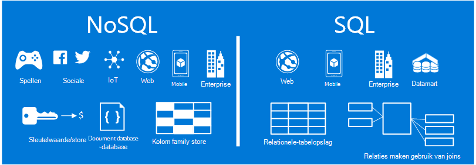
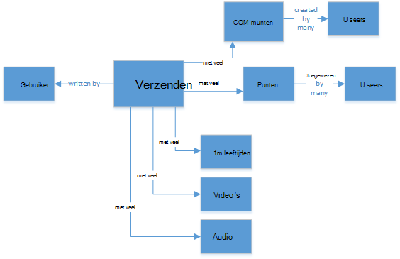
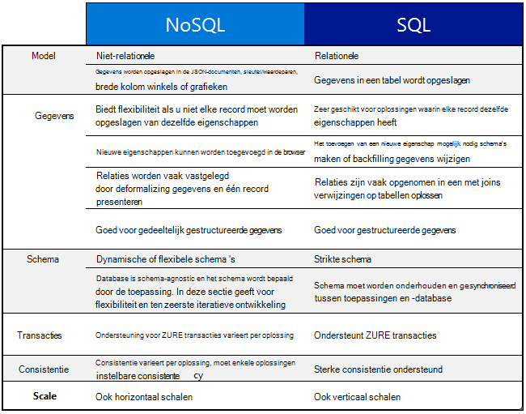
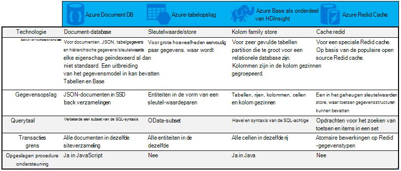

<properties
    pageTitle="Wanneer gebruikt u NoSQL tegenover SQL | Microsoft Azure"
    description="Vergelijk de voordelen van het gebruik van de niet-relationele oplossingen NoSQL versus SQL-oplossingen. Informatie over of een van de services van Microsoft Azure NoSQL of SQL Server beste past bij uw scenario."
    keywords="nosql tegenover sql, wanneer gebruikt u NoSQL, sql tegenover nosql"
    services="documentdb"
    documentationCenter=""
    authors="mimig1"
    manager="jhubbard"
    editor=""/>

<tags
    ms.service="documentdb"
    ms.workload="data-services"
    ms.tgt_pltfrm="na"
    ms.devlang="dotnet"
    ms.topic="article" 
    ms.date="06/24/2016"
    ms.author="mimig"/>

# NoSQL tegenover SQL

SQL Server en relationele databases (RDBMS) zijn de databases Ga naar meer dan 20 jaar. De verbeterde nodig hoger volumes en soorten gegevens met een snelle snelheid verwerken is echter de aard van gegevens opslagbehoeften voor softwareontwikkelaars gewijzigd. Om dit scenario, hebben NoSQL-databases die kunnen opslaan ongestructureerde en heterogene gegevens bij het op schaal in populariteit gewonnen. 

NoSQL is een categorie van databases die sterk uiteenlopende uit SQL-databases. NoSQL wordt vaak gebruikt om te verwijzen naar de data management systemen die 'Niet SQL' of een methode die u wilt beheren van gegevens met "niet alleen SQL". Er zijn een aantal technologieën in de categorie van NoSQL, inclusief document databases, sleutelwaarde winkels, kolom family winkels en graph-databases, met spellen, sociale, populair zijn en IoT apps.

Het doel van dit artikel is om te helpen u meer informatie over de verschillen tussen NoSQL en SQL en u voorzien van een introductie over de NoSQL en SQL-aanbiedingen van Microsoft.  

## Wanneer gebruikt u NoSQL?

Stel we dat u maakt een nieuwe sociale betrokkenheid-site. Gebruikers kunnen maken van berichten en afbeeldingen, video's en muziek aan toevoegen. Andere gebruikers kunnen de berichten becommentariëren en punten (vind ik leuks) de berichten waarderen geven. De openingspagina heeft een feed van berichten die gebruikers kunnen delen en ermee. 

Hoe slaat u deze gegevens? Als u bekend met SQL bent, kunt u beginnen met het tekenen van ongeveer zo uitziet:

Dus uiterst goed, maar nu Denk na over de structuur van een enkel bericht en hoe u dit kunt weergeven. Als u weergeven van het bericht en de bijbehorende afbeeldingen, audio, video, opmerkingen, punten en gebruikersgegevens op een website of toepassing wilt, moet u uitvoeren van een query met acht tabel joins gewoon om de inhoud wordt opgehaald. Stel nu een reeks berichten met dynamische laden en op het scherm worden weergegeven en u kunt eenvoudig voorspellen dat deze wil vereisen duizenden query's en veel joins om de taak te voltooien.

Nu u een relationele oplossing zoals SQL Server kunt gebruiken voor de opslag van de gegevens - maar er is een andere optie, een optie voor NoSQL waardoor het eenvoudiger de methode wordt. Om het bericht in een document JSON als volgt en slaan in DocumentDB, een service van de database in de Azure NoSQL document, kunt u de prestaties verbeteren en het hele bericht met een query en geen joins te halen. Dit is een eenvoudiger en meer eenvoudige manier en meer zodat het resultaat.

    {
        "id":"ew12-res2-234e-544f",
        "title":"post title",
        "date":"2016-01-01",
        "body":"this is an awesome post stored on NoSQL",
        "createdBy":User,
        "images":["http://myfirstimage.png","http://mysecondimage.png"],
        "videos":[
            {"url":"http://myfirstvideo.mp4", "title":"The first video"},
            {"url":"http://mysecondvideo.mp4", "title":"The second video"}
        ],
        "audios":[
            {"url":"http://myfirstaudio.mp3", "title":"The first audio"},
            {"url":"http://mysecondaudio.mp3", "title":"The second audio"}
        ]
    }

Deze gegevens kunt bovendien partitioneren door post-id waarmee de gegevens wilt schalen natuurlijk en profiteren van NoSQL schaal kenmerken kan worden verleend. NoSQL systemen kunnen ook ontwikkelaars losraken consistentie en bieden ten zeerste beschikbare apps.  Ten slotte, is deze oplossing geen ontwikkelaars definiëren, beheren en onderhouden van schema in de gegevenslaag toestaan voor snelle iteratie vereist.

U kunt vervolgens maken op deze oplossing met behulp van andere Azure services:

- [Azure zoeken](https://azure.microsoft.com/services/search/) kan zodat gebruikers kunnen zoeken naar berichten via de WebApp worden gebruikt.
- [Azure App Services](https://azure.microsoft.com/services/app-service/) kan worden gebruikt voor het hosten van toepassingen en achtergrondprocessen.
- [Azure-blobopslag](https://azure.microsoft.com/services/storage/) kan worden gebruikt voor de opslag van de volledige gebruikersprofielen ook afbeeldingen.
- [Azure SQL-Database](https://azure.microsoft.com/services/sql-database/) kan worden gebruikt voor de opslag van grote hoeveelheden gegevens zoals aanmeldingsgegevens en gegevens voor gebruiksanalyse.
- [Azure Machine Learning](https://azure.microsoft.com/services/machine-learning/) kan worden gebruikt om knowledge en bedrijfsinformatie die kunt Geef feedback aan het proces en helpen bij het geven van de juiste inhoud naar de juiste gebruikers te maken.

Deze site sociale betrokkenheid is slechts een in één scenario waarin een NoSQL-database het juiste gegevensmodel voor de taak is. Als u geïnteresseerd Lees meer over dit scenario en hoe bent u het modelleren van uw gegevens voor DocumentDB in sociale media-toepassingen, raadpleegt u [sociale met DocumentDB gaan](documentdb-social-media-apps.md). 

## NoSQL tegenover SQL-vergelijking

De volgende tabel worden de belangrijkste verschillen tussen NoSQL en SQL vergeleken. 

Als u een aanbevolen NoSQL-database aan uw eisen voldoet, kunt u verder met de volgende sectie voor meer informatie over de services NoSQL verkrijgbaar via Azure. Als u een aanbevolen SQL-database aan uw behoeften voldoet, anders, gaat u verder met [Wat zijn de Microsoft SQL-aanbiedingen?](#what-are-the-microsoft-sql-offerings)

## Wat zijn de aanbiedingen van Microsoft Azure NoSQL?

Azure heeft vier volledig beheerde NoSQL services: 

- [Azure DocumentDB](https://azure.microsoft.com/services/documentdb/)
- [Azure-tabelopslag](https://azure.microsoft.com/services/storage/)
- [Azure HBase als onderdeel van HDInsight](https://azure.microsoft.com/services/hdinsight/)
- [Cache Azure bestand Vgx.](https://azure.microsoft.com/services/cache/)

De volgende vergelijkingsdiagram wordt aangegeven de belangrijkste differentiators voor elke service. Welke beste overeenkomt geeft de behoeften van uw toepassing? 

Als een of meer van de volgende services met de behoeften van uw toepassing overeenkomen mogelijk, meer met de volgende bronnen: 

- [Leerpad DocumentDB](https://azure.microsoft.com/documentation/learning-paths/documentdb/) en [DocumentDB gevallen gebruiken](documentdb-use-cases.md)
- [Aan de slag met Azure-tabelopslag](../storage/storage-dotnet-how-to-use-tables.md)
- [Wat is HBase in HDInsight](../hdinsight/hdinsight-hbase-overview.md)
- [Bestand Cache leerpad Vgx.](https://azure.microsoft.com/documentation/learning-paths/redis-cache/)

Ga vervolgens naar de [volgende stappen](#next-steps) voor gratis proefabonnement informatie.

## Wat zijn de Microsoft SQL-aanbiedingen?

Microsoft heeft vijf SQL aanbiedingen: 

- [Azure SQL-Database](https://azure.microsoft.com/services/sql-database/)
- [SQL Server Azure virtuele Machines](https://azure.microsoft.com/services/virtual-machines/sql-server/)
- [SQL Server](https://www.microsoft.com/server-cloud/products/sql-server-2016/)
- [Azure SQL datawarehouse (Preview)](https://azure.microsoft.com/services/sql-data-warehouse/)
- [Platform analysesysteem (on-premises implementatie toestel)](https://www.microsoft.com/en-us/server-cloud/products/analytics-platform-system/)

Wanneer u geïnteresseerd in SQL Server op een virtuele Machine of SQL-Database bent, wordt gelezen [een wolk SQL Server-optie kiezen: (PaaS) van Azure SQL-Database of SQL Server Azure VMs (IaaS)](../sql-database/sql-database-paas-vs-sql-server-iaas.md) voor meer informatie over de verschillen tussen de twee.

SQL-geluiden als de beste optie, ga vervolgens naar [SQL Server](https://www.microsoft.com/server-cloud/products/) voor meer informatie over onze Microsoft SQL-producten en services hebben om te bieden.

Ga vervolgens naar de [volgende stappen](#next-steps) gratis proefversie en evaluatie koppelingen.

## Volgende stappen

We uitnodigen u voor meer informatie over onze producten SQL versus NoSQL door deze gratis wilt uitproberen. 

- Voor alle Azure-services, kunt u zich registreren voor een [gratis proefabonnement van één maand](https://azure.microsoft.com/pricing/free-trial/) en ontvangen van $200 tot besteden aan een van de Azure services.
    - [Azure DocumentDB](https://azure.microsoft.com/services/documentdb/)
    - [Azure HBase als onderdeel van HDInsight](https://azure.microsoft.com/services/hdinsight/)
    - [Cache Azure bestand Vgx.](https://azure.microsoft.com/services/cache/)
    - [Azure SQL datawarehouse (Preview)](https://azure.microsoft.com/services/sql-data-warehouse/)
    - [Azure SQL-Database](https://azure.microsoft.com/services/sql-database/)
    - [Azure-tabelopslag](https://azure.microsoft.com/services/storage/)

- U kunt een [evaluatieversie van SQL Server-2016 op een virtuele machine](https://azure.microsoft.com/marketplace/partners/microsoft/sqlserver2016ctp33evaluationwindowsserver2012r2/) draaien of downloaden van een [evaluatieversie van SQL Server](https://www.microsoft.com/en-us/evalcenter/evaluate-sql-server-2016).
    - [SQL Server](https://www.microsoft.com/server-cloud/products/sql-server-2016/)
    - [SQL Server Azure virtuele Machines](https://azure.microsoft.com/services/virtual-machines/sql-server/)

