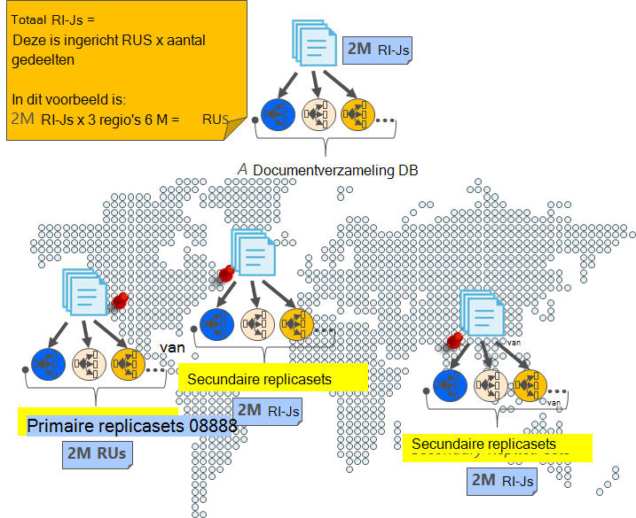
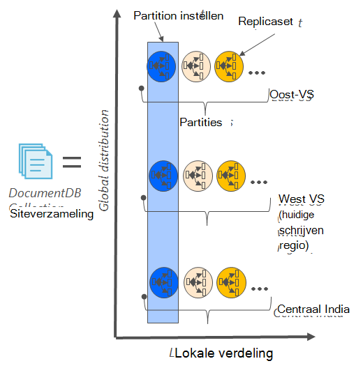
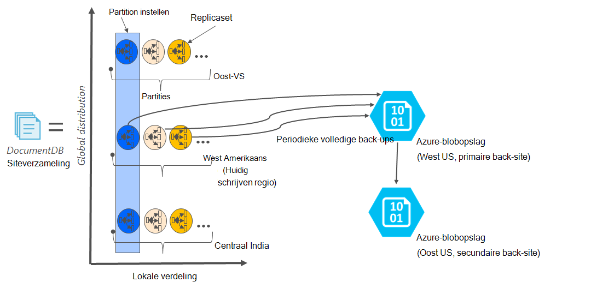

<properties
    pageTitle="Online back-up en herstellen met DocumentDB | Microsoft Azure"
    description="Leer hoe u automatische back-up en herstellen van NoSQL-databases met Azure DocumentDB uitvoeren."
    keywords="back-up en herstellen, online back-up"
    services="documentdb"
    documentationCenter=""
    authors="RahulPrasad16"
    manager="jhubbard"
    editor="monicar"/>

<tags
    ms.service="documentdb"
    ms.workload="data-services"
    ms.tgt_pltfrm="na"
    ms.devlang="multiple"
    ms.topic="article"
    ms.date="09/23/2016"
    ms.author="raprasa"/>

# Automatische online back-up en herstellen met DocumentDB 

Azure DocumentDB gaat automatisch back-ups van al uw gegevens met regelmatige tussenpozen. De automatische back-ups zijn die u hebt gemaakt zonder dat dit gevolgen heeft voor de prestaties en de beschikbaarheid van uw activiteiten van de database NoSQL. Uw back-ups afzonderlijk worden opgeslagen in een andere storage-service en deze back-ups globaal voor tolerantie ten opzichte van regionale systeemfouten worden gerepliceerd. De automatische back-ups zijn bedoeld voor scenario's als u per ongeluk de verzameling DocumentDB verwijdert en later nodig herstel van gegevens of een noodgevallen hersteloplossing hebt.  

In dit artikel begint met een snelle recap van de overbodige en beschikbaar is in DocumentDB en wordt vervolgens besproken back-ups. 

## Beschikbaarheid met DocumentDB - een recap

DocumentDB is zo ontworpen dat [globaal distributed](documentdb-distribute-data-globally.md) : u kunt de schaal van doorvoer tussen meerdere Azure regio's samen met beleid basis van hoeveelheid werk failover en transparante meervoudige homing API's. Als een databasesysteem aanbod [99,99% beschikbaarheid serviceovereenkomsten](https://azure.microsoft.com/support/legal/sla/documentdb/v1_0/), zijn alle schrijven in DocumentDB blijvend vastgelegde naar lokale schijven door een quorum van replica's binnen een lokale Datacenter voordat bevestigd naar de klant. Houd er rekening mee dat de beschikbaarheid van DocumentDB is afhankelijk van de lokale opslag en is niet afhankelijk van een externe opslagtechnologieën. Als uw databaseaccount gekoppeld aan meer dan één Azure regio is, worden uw schrijft bovendien gerepliceerd in als u ook andere regio's. Als uw doorvoer en access-gegevens bij lage vertragingstijden wilt verkleinen, kunt u veel regio's die zijn gekoppeld aan uw databaseaccount als u wilt lezen hebben. In de lees regio's wordt blijvend de (gerepliceerde) gegevens behouden over een replicaset.  

Zoals u in het volgende diagram, is een verzameling met één DocumentDB [horizontaal partitioneren](documentdb-partition-data.md). Een "partition" wordt aangeduid met een cirkel in het volgende diagram en elke partition ten zeerste beschikbaar is via een replicaset is gemaakt. Dit is de lokale verdeling binnen een enkel Azure (aangeduid met de X-as). Elke partition (met de bijbehorende replicaset) is verder, klikt u vervolgens globaal verdeeld over meerdere regio's die zijn gekoppeld aan uw databaseaccount (bijvoorbeeld in deze afbeelding de drie regio's – Oost VS, West Amerikaans en centraal India). De partitieset"" is een globaal verdeelde entiteit opgemaakt die meerdere kopieën van uw gegevens in elke regio (aangeduid met de Y-as). U kunt prioriteit toewijzen aan de regio's die zijn gekoppeld aan uw databaseaccount en DocumentDB wordt transparant failover naar het volgende gebied voor het geval noodgevallen. U kunt ook handmatig simuleren failover als u wilt testen van de end-to-end-beschikbaarheid van de toepassing.  

De volgende afbeelding ziet u de hoge mate van redundantie met DocumentDB.

## De back-ups van een volledige, automatische, online

Bestaande, ik heb verwijderd mijn siteverzameling of een database! Met DocumentDB, niet alleen uw gegevens, maar de back-ups van uw gegevens ook in worden aangebracht ten zeerste overtollige en robuust regionale systeemfouten. Deze automatische back-ups worden momenteel ongeveer elke 4 uur genomen. 

De back-ups zijn die u hebt gemaakt zonder dat dit gevolgen heeft voor de prestaties en de beschikbaarheid van uw database-activiteiten. DocumentDB gaat de back-up op de achtergrond, zonder uw ingerichte RUs verbruikt of dat dit gevolgen heeft de prestaties en zonder dat dit gevolgen heeft de beschikbaarheid van uw database NoSQL. 

In tegenstelling tot de gegevens die zijn opgeslagen in DocumentDB, worden de automatische back-ups opgeslagen in Azure Blob Storage-service. Om te garanderen de lage latentie/efficiënt upload, wordt de momentopname van de back-up geüpload naar een exemplaar van Azure-blobopslag in hetzelfde gebied, als het huidige gebied schrijven van uw account van de database DocumentDB. Voor tolerantie ten opzichte van regionale, wordt elke momentopname van uw back-gegevens in Azure-blobopslag opnieuw gerepliceerd via geografische-redundante opslag (GRS) naar een andere regio. In het volgende diagram ziet u dat de hele verzameling DocumentDB (met alle drie primaire partities in West VS, in dit voorbeeld) back-up in een externe Azure-blobopslag-account in West VS gemaakt is en vervolgens GRS gerepliceerd naar Oost VS. 

De volgende afbeelding ziet u periodieke volledige back-ups van alle DocumentDB entiteiten in GRS Azure opslag.

## Bewaarperiode voor een bepaald momentopname

Zoals hierboven is beschreven, we regelmatig momentopnamen van uw gegevens en per onze regelgeving, we de meest recente momentopname omhoog behouden tot 90 dagen voordat deze uiteindelijk wordt verwijderd. Als een account voor siteverzameling of wordt verwijderd, wordt in DocumentDB de laatste back-up opgeslagen 90 dagen.

## Database herstellen vanuit de online back-up

Als u de gegevens per ongeluk hebt verwijderd, kunt u [een ondersteuningsticket bestand](https://portal.azure.com/?#blade/Microsoft_Azure_Support/HelpAndSupportBlade) of [Azure ondersteuning bellen](https://azure.microsoft.com/support/options/) de gegevens van de laatste automatische back-up wilt terugzetten. Voor een specifieke momentopname van de back-up wilt terugzetten, vereist DocumentDB dat de gegevens voor de duur van de back-cyclus voor die momentopname ten minste beschikbaar voor communicatie met ons opnemen is.

## Volgende stappen

Als wilt repliceren uw database NoSQL in meerdere datacenters, raadpleegt u [uw gegevens globaal met DocumentDB distribueren](documentdb-distribute-data-globally.md). 

Naar bestand contactpersoon Azure-ondersteuning, [bestand een tickets van de Azure-portal](https://portal.azure.com/?#blade/Microsoft_Azure_Support/HelpAndSupportBlade).