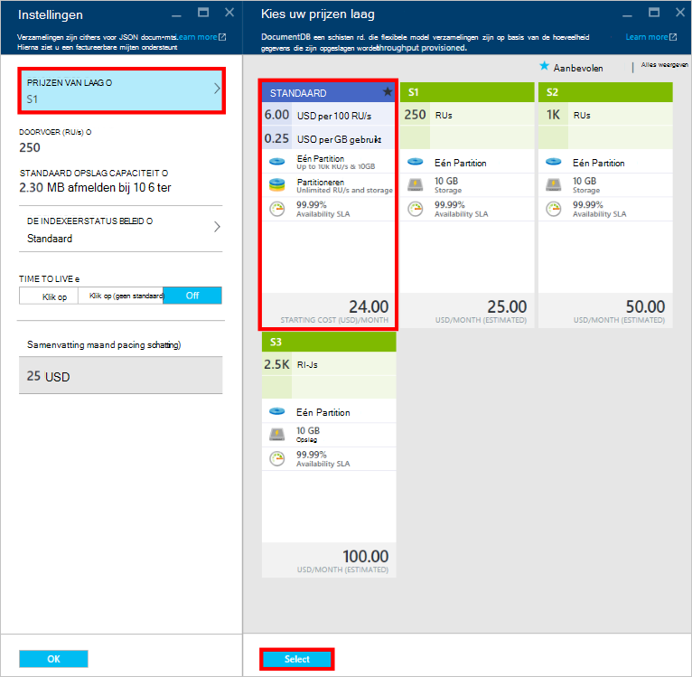

<properties
    pageTitle="Prestatieniveaus in DocumentDB | Microsoft Azure"
    description="Meer informatie over hoe prestatieniveaus in DocumentDB u tijdens het basis per siteverzameling reserveren."
    services="documentdb"
    authors="mimig1"
    manager="jhubbard"
    editor="monicar"
    documentationCenter=""/>

<tags
    ms.service="documentdb"
    ms.workload="data-services"
    ms.tgt_pltfrm="na"
    ms.devlang="na"
    ms.topic="article"
    ms.date="08/26/2016"
    ms.author="mimig"/>

# Prestatieniveaus in DocumentDB

Dit artikel bevat een overzicht van het niveau van de prestaties in [Microsoft Azure DocumentDB](https://azure.microsoft.com/services/documentdb/).

Lees dit artikel en kunt u wel de volgende vragen beantwoorden:  

-   Wat is een prestatieniveau?
-   Hoe is doorvoer gereserveerd voor een databaseaccount?
-   Hoe werk ik met prestaties?
-   Hoe ben ik gefactureerd voor prestaties?

## Inleiding tot prestaties

Elke DocumentDB collectie onder een standaardaccount gemaakt is met een gekoppeld prestatieniveau ingericht. Elke siteverzameling in een database kunt hebben een andere prestatieniveau zodat u kunt meer doorvoer minder doorvoer voor weinig gebruikte siteverzamelingen en voor veelgebruikte verzamelingen aanwijzen. DocumentDB ondersteunt beide door de gebruiker gedefinieerde prestaties en vooraf gedefinieerde prestaties.  

Elk prestatieniveau heeft een limiet van gekoppeld [verzoek eenheid (RU)](documentdb-request-units.md) . Dit is de doorvoer die voor een siteverzameling op basis van de prestatieniveau gereserveerd, en is uitsluitend beschikbaar voor gebruik door die verzameling.

<table border="0" cellspacing="0" cellpadding="0">
    <tbody>
        <tr>
            <td valign="top">

</td>
            <td valign="top">
Meer informatie
</td>
            <td valign="top">
Doorvoer limieten
</td>
            <td valign="top">
Opslaglimieten
</td>
            <td valign="top">
Versie
</td>
            <td valign="top">
API 's
</td>            
        </tr>
        <tr>
            <td valign="top">
De gebruiker gedefinieerde prestaties
</td>
            <td valign="top">
Opslagruimte met datalimiet op basis van gebruik in GB.

Doorvoersnelheid in eenheden van 100 RU/s
</td>
            <td valign="top">
Onbeperkt. 400 - boven de 250.000 aanvragen eenheden/s al dan niet standaard (hogere door aanvraag)
</td>
            <td valign="top">
Onbeperkt. 250 GB al dan niet standaard (hogere door aanvraag) 
</td>
            <td valign="top">
V2
</td>
            <td valign="top">
API-2015-12-16 en nieuwere
</td>  
        </tr>
        <tr>
            <td valign="top">
Vooraf gedefinieerde prestaties
</td>
            <td valign="top">
10 GB gereserveerd opslagruimte.

S1 = 250 RU/s, S2 = 1000 RU/s, S3 = 2500 RU/s
</td>
            <td valign="top">
2500 RU/s
</td>
            <td valign="top">
10 GB
</td>
            <td valign="top">
V1
</td>
            <td valign="top">
Een
</td>  
        </tr>        
    </tbody>
</table>                

DocumentDB kunt voor een uitgebreide set van databasebewerkingen query's, query's met de gebruiker gedefinieerde functies (UDF), opgeslagen procedures en triggers. De van verwerkingskosten die is gekoppeld aan elk van deze bewerkingen varieert afhankelijk van de processor, IO en geheugen vereist om de bewerking te voltooien. In plaats daarvan van nadenkt over en beheren van hardware resources, u kunt een aanvraag eenheid zien als een één maateenheid voor de resources moeten verschillende databasebewerkingen uitvoeren en service-opdracht van een toepassing.

Siteverzamelingen kunnen via de [portal van Microsoft Azure](https://portal.azure.com), de [REST API](https://msdn.microsoft.com/library/azure/mt489078.aspx) of een van de [DocumentDB SDK's](https://msdn.microsoft.com/library/azure/dn781482.aspx)worden gemaakt. De DocumentDB APIs kunt u het prestatieniveau van een siteverzameling opgeven.

> [AZURE.NOTE] Het prestatieniveau van een siteverzameling kan worden gecorrigeerd door de API's of de [portal van Microsoft Azure](https://portal.azure.com/). Prestaties verandert verwachting kan worden uitgevoerd binnen de 3 minuten.

## Prestaties van de instelling voor siteverzamelingen
Nadat een siteverzameling is gemaakt, worden de volledige toewijzing van RUs op basis van de aangewezen prestatieniveau gereserveerd voor de siteverzameling.

Houd er rekening mee dat met beide niveau van de gebruiker gedefinieerde en vooraf gedefinieerde prestaties, DocumentDB op basis van het reserveren van doorvoer werkt. Als u een siteverzameling maakt, is een toepassing heeft gereserveerd, en wordt gefactureerd gereserveerde worden verwerkt ongeacht hoeveel van waarop doorvoer actief wordt gebruikt. Met de gebruiker gedefinieerde prestaties; opslag is met datalimiet op basis van verbruik, maar met vooraf gedefinieerde prestaties; 10 GB opslagruimte op het moment van maken van een siteverzameling is gereserveerd.  

Nadat siteverzamelingen worden gemaakt, kunt u het prestatieniveau van de tot en met de DocumentDB SDK's of via de Portal van Azure-klassieke wijzigen.

> [AZURE.IMPORTANT] DocumentDB standaard verzamelingen worden gefactureerd per uur en elke siteverzameling die u hebt gemaakt voor een minimaal één uur na gebruik wordt gefactureerd.

Als u het prestatieniveau van een siteverzameling binnen een uur aanpast, wordt u voor de hoogste prestatieniveau instellen tijdens het uur gefactureerd. Bijvoorbeeld als u uw prestatieniveau voor een siteverzameling om 8:53 am vergroot moet u betalen voor het nieuwe niveau, beginnend bij 8:00 am. Als u uw prestatieniveau om 8:53 am verkleint, wordt ook het tarief weer dat nieuwe toegepast om 9:00 am.

Aanvraag eenheden zijn gereserveerd voor elke siteverzameling op basis van de prestaties is ingesteld. Aanvraag eenheidsverbruik wordt geëvalueerd als een per tweede rente. Pas het tarief weer dat de gereserveerde hebben voor die siteverzameling wordt de toepassingen die groter is dan de ingerichte verzoek eenheid rente (of prestatieniveau) op een verzameling snelheid. Als uw toepassing een hoger niveau doorvoer vereist, kunt u het prestatieniveau van de voor elke siteverzameling verhogen.

> [AZURE.NOTE] Wanneer uw toepassing groter is dan het niveau van de prestaties voor een of meerdere siteverzamelingen, wordt de aanvragen snelheid op basis van de per siteverzameling. Dit betekent dat sommige aanvragen terwijl de anderen kunnen worden vertraagd kans van slagen. Het wordt aanbevolen om toe te voegen een klein aantal pogingen wanneer vertraagd pieken in het verzoek om verkeer verwerken.

## Werken met prestaties
DocumentDB verzamelingen kunnen u uw gegevens op basis van de query patronen en de prestatiebehoeften van uw toepassing wilt laten groeperen. Met de DocumentDB automatische indexering en Queryondersteuning wordt meestal helemaal heterogene documenten binnen de verzameling dezelfde collocate. Er zijn de belangrijkste overwegingen bij het bepalen of de afzonderlijke siteverzamelingen moeten worden gebruikt:

- Query's: een verzameling is het bereik voor de uitvoering van de query. Als u moet de query met betrekking tot een verzameling documenten, is de efficiëntste gelezen patronen afkomstig zijn uit collocating documenten in een één siteverzameling.
- Transacties – alle transacties zijn beperkt tot binnen één collectie. Als u documenten dat moeten worden bijgewerkt vanuit een één opgeslagen procedure of trigger, moeten ze binnen de verzameling dezelfde worden opgeslagen. Specifieke taken is een partitiesleutel binnen een verzameling de transactiegrens. Zie [partitionering in DocumentDB](documentdb-partition-data.md) voor meer informatie.
- Prestaties moeten worden geïsoleerd – een siteverzameling heeft een gekoppeld prestatieniveau. Dit zorgt ervoor dat elke siteverzameling een overzichtelijk prestaties tot en met gereserveerde RUs heeft. Gegevens kunnen worden toegewezen aan verschillende siteverzamelingen, met afwijkende prestaties, op basis van de frequentie van access.

> [AZURE.IMPORTANT] Het is belangrijk om te begrijpen dat u bij volledige standaardtarieven op basis van het aantal siteverzamelingen die zijn gemaakt door de toepassing wordt gefactureerd.

Het wordt aanbevolen dat uw toepassing maakt gebruik van een klein aantal verzamelingen tenzij u beschikt over grote opslag of doorvoer voldoet. Zorg ervoor dat u toepassing patronen voor het maken van nieuwe collecties goed hebt begrepen. U kunt maken van een siteverzameling als management actie afgehandeld buiten uw toepassing reserveren. Aanpassen van het prestatieniveau voor een siteverzameling wordt ook het tarief weer dat per uur waarop de verzameling wordt gefactureerd wijzigen. Als uw toepassing wordt aangepast deze dynamisch moet u de prestaties van de siteverzameling controleren.

## De gebruiker gedefinieerde prestaties van S1, S2, S3 wijzigen

Volg deze stappen om te wijzigen door gebruiker gedefinieerd doorvoer niveaus in de portal van Azure via vooraf gedefinieerde doorvoer niveaus. Met behulp van de gebruiker gedefinieerde doorvoer niveaus, kunt u uw doorvoer aanpassen aan uw wensen voldoet. En als u nog steeds een S1-account gebruikt, kunt u uw standaard doorvoersnelheid van 250 RU/s 400 RU/s met een paar muisklikken verhogen.

Zie het blogbericht voor meer informatie over de prijzen wijzigingen gerelateerd aan de gebruiker gedefinieerde en vooraf gedefinieerde doorvoer, [DocumentDB: alles wat u weten moet over het gebruik van de nieuwe opties voor prijzen](https://azure.microsoft.com/blog/documentdb-use-the-new-pricing-options-on-your-existing-collections/).

> [AZURE.VIDEO changedocumentdbcollectionperformance]

1. Ga in uw browser naar de [**Azure-portal**](https://portal.azure.com).
2. Klik op **Bladeren** -> **DocumentDB Accounts**en selecteer het account DocumentDB om te wijzigen.   
3. In de lens voor **Databases** , selecteer de database te wijzigen en selecteer vervolgens in het blad **Database** de verzameling om te wijzigen. Gebruik vooraf gedefinieerde doorvoer-accounts zijn een prijzen laag van S1, S2 of S3.

      

4. Klik in het blad **verzamelingen** op **meer**, vervolgens **Instellingen** op de bovenste balk.   
5. Klik in het blad **Instellingen** op **Laag prijzen** en de maandelijkse schatting van de kosten voor elk plan wordt weergegeven in het blad **de prijzen laag Kies** . Als u wilt wijzigen aan de gebruiker gedefinieerde doorvoer, klik op **standaard**en klik vervolgens op **selecteren** om op te slaan uw wijziging.

      

6. Terug in het blad **Instellingen voor** de **Laag prijzen** wordt gewijzigd in **Standard** en het vak **doorvoer (RU/s)** wordt weergegeven met een standaardwaarde van 400. Stel de doorvoer tussen 400 en 10.000 [aanvragen eenheden](documentdb-request-units.md)/second (RU/s). De **Prijzen overzicht** onder aan de pagina wordt automatisch bijgewerkt op te geven van een schatting van de maandelijkse kosten. Klik op **OK** om uw wijzigingen op te slaan.

    

7. U kunt de nieuwe doorvoer van de siteverzameling controleren weer op het blad **Database** .

    

Als u constateert dat u meer doorvoer (groter dan 10.000 RU/s) of nodig meer opslagruimte (groter dan 10GB) kunt u een gepartitioneerde collectie kunt maken. Zie [een siteverzameling maken](documentdb-create-collection.md)een gepartitioneerde siteverzameling maken.

>[AZURE.NOTE] Wijzigen van de prestaties van een siteverzameling kan maximaal 2 minuten duren.

## Prestaties met de SDK .NET wijzigen

Er is een andere optie voor het wijzigen van de collecties prestaties tot en met onze SDK's. Deze sectie bevat alleen de niveau van de prestaties van een siteverzameling met behulp van onze [.NET SDK](https://msdn.microsoft.com/library/azure/dn948556.aspx)wijzigen, maar gaat op dezelfde manier voor onze andere [SDK's](https://msdn.microsoft.com/library/azure/dn781482.aspx). Als u eerder met onze .NET-SDK, gaat u naar onze [handleiding aan de slag](documentdb-get-started.md).

Hier volgt een codefragment voor het wijzigen van de aanbieding doorvoer in 50.000 verzoek eenheden per seconde:

    //Fetch the resource to be updated
    Offer offer = client.CreateOfferQuery()
                      .Where(r => r.ResourceLink == collection.SelfLink)    
                      .AsEnumerable()
                      .SingleOrDefault();

    // Set the throughput to 5000 request units per second
    offer = new OfferV2(offer, 5000);

    //Now persist these changes to the database by replacing the original resource
    await client.ReplaceOfferAsync(offer);

    // Set the throughput to S2
    offer = new Offer(offer);
    offer.OfferType = "S2";

    //Now persist these changes to the database by replacing the original resource
    await client.ReplaceOfferAsync(offer);

> [AZURE.NOTE] Deze is ingericht met onder 10.000 verzoek eenheden per verzamelingen kunnen tweede tussen aanbiedingen met de gebruiker gedefinieerde doorvoer en vooraf gedefinieerde doorvoer (S1, S2, S3) op elk gewenst moment worden gemigreerd. Verzamelingen die is ingericht met hierboven 10.000 verzoek eenheden per kunnen niet tweede worden geconverteerd naar vooraf gedefinieerde doorvoer niveaus.

Ga naar [MSDN](https://msdn.microsoft.com/library/azure/microsoft.azure.documents.client.documentclient.aspx) om te bekijken als u meer voorbeelden en meer informatie over onze methoden aanbieding:

- [**ReadOfferAsync**](https://msdn.microsoft.com/library/azure/microsoft.azure.documents.client.documentclient.readofferasync.aspx)
- [**ReadOffersFeedAsync**](https://msdn.microsoft.com/library/azure/microsoft.azure.documents.client.documentclient.readoffersfeedasync.aspx)
- [**ReplaceOfferAsync**](https://msdn.microsoft.com/library/azure/microsoft.azure.documents.client.documentclient.replaceofferasync.aspx)
- [**CreateOfferQuery**](https://msdn.microsoft.com/library/azure/microsoft.azure.documents.linq.documentqueryable.createofferquery.aspx)

## De doorvoer van een siteverzameling wijzigen

Als u de gebruiker gedefinieerde prestaties al gebruikt, kunt u de doorvoer van uw siteverzameling wijzigen door het volgende te doen. Als u wijzigen van een prestatieniveau S1, S2 of S3 (vooraf gedefinieerde prestaties) naar de gebruiker gedefinieerde prestaties wilt, raadpleegt u [veranderd ten opzichte van S1, S2, S3 aan de gebruiker gedefinieerde prestaties](#changing-performance-levels-using-the-azure-portal).

1. Ga in uw browser naar de [**Azure-portal**](https://portal.azure.com).
2. Klik op **Bladeren** -> **DocumentDB Accounts**en selecteer het account DocumentDB om te wijzigen.   
3. Op het blad **DocumentDB-account** , klikt u in de lens voor **Databases** , selecteer de database te wijzigen en selecteer vervolgens in het blad **Database** de verzameling om te wijzigen.
4. Klik op **Instellingen** op de bovenste balk in het blad **siteverzamelingen** .   
5. Verhoog de waarde in het vak **doorvoer (RU/s)** in het blad **Instellingen** en klik vervolgens op **OK** om op te slaan uw wijziging. Het **Overzicht prijzen** onderaan in het blad bijgewerkt om aan te geven de nieuwe Geschatte maandelijkse kosten van die verzameling in één regio.

    

Als u niet weet hoeveel om uit te breiden uw doorvoer bent, raadpleegt u [Estimating doorvoer nodig heeft](documentdb-request-units.md#estimating-throughput-needs) en de [eenheid Rekenmachine aanvragen](https://www.documentdb.com/capacityplanner).

## Volgende stappen

Meer informatie over prijzen en beheren van gegevens met Azure DocumentDB weten over deze resources:

- [DocumentDB prijzen](https://azure.microsoft.com/pricing/details/documentdb/)
- [DocumentDB capaciteit beheren](documentdb-manage.md)
- [Gegevens in DocumentDB Modeling](documentdb-modeling-data.md)
- [Gegevens in DocumentDB partitioneren](documentdb-partition-data.md)
- [Eenheden aanvragen](http://go.microsoft.com/fwlink/?LinkId=735027)

Meer informatie over DocumentDB, raadpleegt u de Azure DocumentDB [documentatie](https://azure.microsoft.com/documentation/services/documentdb/).

Zie [prestaties en schaal met Azure DocumentDB testen](documentdb-performance-testing.md)om te beginnen met schaal en prestaties testen met DocumentDB.

[1]: ./media/documentdb-performance-levels/documentdb-change-collection-performance7-9.png
[2]: ./media/documentdb-performance-levels/documentdb-change-collection-performance10-11.png
