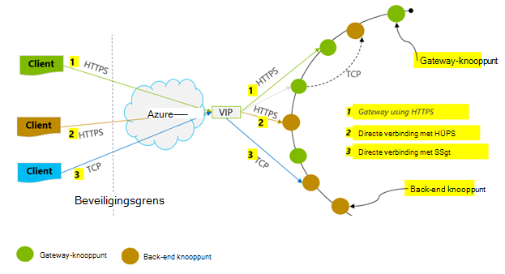
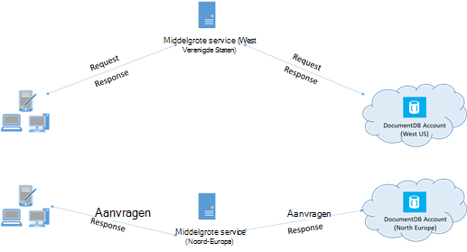

<properties 
    pageTitle="Tips voor betere prestaties DocumentDB | Microsoft Azure" 
    description="Informatie over client configuratieopties Azure DocumentDB databaseprestaties te verbeteren"
    keywords="databaseprestaties verbeteren"
    services="documentdb" 
    authors="mimig1" 
    manager="jhubbard" 
    editor="" 
    documentationCenter=""/>

<tags 
    ms.service="documentdb" 
    ms.workload="data-services" 
    ms.tgt_pltfrm="na" 
    ms.devlang="na" 
    ms.topic="article" 
    ms.date="10/17/2016" 
    ms.author="mimig"/>

# Tips voor betere prestaties voor DocumentDB

Azure DocumentDB is een snelle en flexibele gedistribueerde database die afhankelijk zijn naadloos van gegarandeerd latentie en doorvoer. U hoeft niet te wijzigen van de belangrijkste architectuur of schrijven van complexe code als u de database met de DocumentDB wilt verkleinen. Omhoog en omlaag schaalbaarheid net zo eenvoudig als het een enkele API-oproep of [SDK methode bellen](documentdb-performance-levels.md#changing-performance-levels-using-the-net-sdk)zetten. Omdat DocumentDB is geraadpleegd via het netwerk oproepen zijn er echter aan de clientzijde optimalisaties toe die u aanbrengen kunt in de prestaties van piek.

Dus als u vraagt "hoe kan ik mijn databaseprestaties verbeteren?" Houd rekening met de volgende opties:

## Netwerken

1. **Verbindingsbeleid: directe verbinding-modus gebruiken**
    
    Hoe een client verbinding maakt met Azure DocumentDB heeft belangrijke gevolgen voor de prestaties, met name in waargenomen aan de clientzijde latentie. Er zijn twee belangrijke configuratieinstellingen beschikbaar voor het configureren van de client verbindingsbeleid de verbinding- *modus* en de [verbinding- *protocol*](#connection-protocol).  De twee beschikbare modi zijn:

    1. Gateway-modus (standaard)
    2. Directe modus

    Aangezien DocumentDB een gedistribueerde opslagsysteem is, DocumentDB resources zoals verzamelingen op meerdere computers zijn partities en elke partition beschikbaarheid worden gerepliceerd. De logische fysiek adres vertaling wordt in een tabel routeren, die ook intern beschikbaar als een resource bewaard.

    In de modus van de Gateway uitvoeren de DocumentDB gateway machines deze routering, waardoor clientcode eenvoudige en compacte. Een clienttoepassing problemen aanvragen tot de computers van de gateway DocumentDB, die de logische URI in de aanvraag voor het fysiek adres van de backend-knooppunt vertalen en stuurt de aanvraag correct.  Omgekeerd in de modus Direct clients moeten onderhouden – en regelmatig vernieuwen – een kopie van deze tabel routeren en vervolgens rechtstreeks verbinding maken met de backend DocumentDB knooppunten.

    Gateway-modus wordt ondersteund op alle SDK platforms en geconfigureerde standaard.  Als uw toepassing wordt uitgevoerd in een bedrijfsnetwerk met strikte firewall beperkingen worden ingeschakeld, is Gateway-modus de beste keuze, omdat deze de standaardpoort HTTPS en een enkelvoudig eindpunt gebruikt. De verhouding prestaties is echter dat Gateway modus heeft betrekking op een extra netwerk hop telkens wanneer gegevens wordt gelezen of naar DocumentDB geschreven.   Reden biedt de modus Direct betere prestaties vanwege minder netwerk hops.

2. **Verbindingsbeleid: gebruikmaken van het TCP-protocol**

    Als gebruikmaken van de modus Direct, zijn er twee protocolopties beschikbaar:

    - TCP
    - HTTPS

    DocumentDB biedt eenvoudige en open RESTful programming model via HTTPS. Bovendien biedt een efficiënte TCP-protocol dat is ook van RESTful in het communicatiemodel en is beschikbaar via de .NET-client SDK. Zowel directe TCP en HTTP's moet u SSL gebruiken voor de eerste verificatie en codering-verkeer is toegestaan. Gebruik voor de beste prestaties het TCP-protocol indien mogelijk. 

    Wanneer u met TCP in Gateway-modus, TCP poort 443 is de poort DocumentDB en 10250 is de poort MongoDB API. Wanneer u TCP in de modus Direct, naast de Gateway-poorten, moet u zorgen dat de poort bereik tussen 10000 en 20000 is geopend, omdat DocumentDB dynamische TCP-poorten gebruikt. Als deze poorten niet geopend zijn en u probeert te gebruiken, TCP, ontvangt u een 503 Service niet beschikbaar is opgetreden. 

    De modus Connectivity is tijdens de bouw van het exemplaar DocumentClient met de parameter ConnectionPolicy geconfigureerd. Als de modus Direct wordt gebruikt, kan het Protocol ook binnen de parameter ConnectionPolicy worden ingesteld.

        var serviceEndpoint = new Uri("https://contoso.documents.net");
        var authKey = new "your authKey from Azure Mngt Portal";
        DocumentClient client = new DocumentClient(serviceEndpoint, authKey, 
        new ConnectionPolicy
        {
            ConnectionMode = ConnectionMode.Direct,
            ConnectionProtocol = Protocol.Tcp
        });

    Omdat TCP wordt alleen ondersteund in de modus Direct, als Gateway-modus wordt gebruikt, klikt u vervolgens de HTTPS-protocol wordt altijd gebruikt om te communiceren met de Gateway en de waarde Protocol in de ConnectionPolicy, wordt die genegeerd.

    

3. **OpenAsync om te voorkomen dat de latentie opstarten op eerste verzoek bellen**

    Standaard, wordt het eerste verzoek een hogere latentie is omdat er voor het ophalen van de tabel voor het routeren van adres. Als u wilt voorkomen dat dit latentie opstarten op de eerste aanvraag, moet u OpenAsync() als volgt eenmaal tijdens initialisatie bellen.

        await client.OpenAsync();

4. **Collocate-clients in dezelfde Azure regio voor de prestaties**

    Indien mogelijk, zet u alle toepassingen DocumentDB belt in hetzelfde gebied, als de database DocumentDB. Voor een niet-geheel exacte vergelijking, voert u oproepen naar DocumentDB binnen dezelfde regio binnen 1-2-ms, maar de latentie tussen de West en oostkust van de VS is > 50 ms. Deze latentie kan waarschijnlijk uit om aan te vragen varieert afhankelijk van de route die u hebt gemaakt door de aanvraag wanneer dit van de client naar de grens Azure datacenter. De laagste mogelijke latentie wordt bereikt door ervoor zorgen dat de bellen toepassing bevindt zich in hetzelfde Azure gebied, als het ingerichte DocumentDB-eindpunt. Zie voor een lijst met beschikbare regio's, [Azure regio's](https://azure.microsoft.com/regions/#services).

    

5. **Aantal threads/taken vergroten**

    Aangezien oproepen naar DocumentDB worden aangebracht via het netwerk, moet u mogelijk de mate van parallellisme van uw aanvragen variëren zodat de clienttoepassing besteedt niet veel tijd wachten tussen aanvragen. Stel dat u gebruikt. NET van [Taak parallelle bibliotheek](https://msdn.microsoft.com//library/dd460717.aspx), in de volgorde van 100s van taken lezen of schrijven naar DocumentDB maken.

## SDK gebruik

1. **Installeer de meest recente SDK**

    De DocumentDB SDK's zijn voortdurend wordt verbeterd voor de beste prestaties. Zie de [SDK van DocumentDB](documentdb-sdk-dotnet.md) pagina's om te bepalen de meest recente SDK en controleren van verbeteringen in. 

2. **Een singleton DocumentDB-client gebruiken voor de levensduur van uw toepassing**
  
    Houd er rekening mee dat elk exemplaar DocumentClient thread-veilige en efficiënt beheer en adres caching in directe modus uitvoert. Als u wilt toestaan dat efficiënt beheer en betere prestaties door DocumentClient, wordt het aanbevolen een enkel exemplaar van DocumentClient per AppDomain gebruiken voor de levensduur van de toepassing.

3. **Grotere System.Net MaxConnections per host**

    DocumentDB aanvragen via HTTPS/REST al dan niet standaard zijn doorgevoerd en worden onderworpen aan de standaardbeperking voor verbinding per hostname of IP-adres. Mogelijk moet u de MaxConnections ingesteld op een hogere waarde (100-1000), zodat meerdere gelijktijdige verbindingen met DocumentDB van de clientbibliotheek gebruikmaken kunt. In de .NET SDK 1.8.0 en hierboven, wordt de standaardwaarde voor [ServicePointManager.DefaultConnectionLimit](https://msdn.microsoft.com/library/system.net.servicepointmanager.defaultconnectionlimit.aspx) is 50 en wordt de waarde wilt wijzigen, kunt u de [Documents.Client.ConnectionPolicy.MaxConnectionLimit](https://msdn.microsoft.com/en-us/library/azure/microsoft.azure.documents.client.connectionpolicy.maxconnectionlimit.aspx) instellen op een hogere waarde.  

4. **Parallelle query's voor gepartitioneerde verzamelingen optimaliseren**

     DocumentDB .NET SDK versie 1.9.0 en hoger ondersteuning parallelle query's waarmee u kunt een gepartitioneerde siteverzameling parallel query (Zie [werken met de SDK's](documentdb-partition-data.md#working-with-the-sdks) en de gerelateerde [voorbeelden van code](https://github.com/Azure/azure-documentdb-dotnet/blob/master/samples/code-samples/Queries/Program.cs) voor meer informatie). Parallelle query's zijn ontworpen voor het verbeteren van Querylatentie en doorvoer via hun seriële die beschikbaar zijn. Parallelle query's bieden twee parameters die gebruikers om hun vereisten, a MaxDegreeOfParallelism met aangepaste aanpassen kunnen afstemmen: om te bepalen het maximum aantal partities dan kunnen worden opgezocht in parallel en (b) MaxBufferedItemCount: om het aantal vooraf opgehaalde resultaten te bepalen. 
    
    a ***afstemmen MaxDegreeOfParallelism\: *** 
    parallelle query werkt door meerdere partities parallel opvragen. Gegevens uit een afzonderlijke gepartitioneerde verzamelen is echter serie opgehaald met betrekking tot de query. Zo is, de MaxDegreeOfParallelism instellen voor het aantal partities heeft de maximale kans op de meeste zodat-query, mits voor alle andere systeem voorwaarden ongewijzigd blijven. Als u het aantal partities niet weet, kunt u de MaxDegreeOfParallelism instellen op een hoog getal en het systeem wordt de minimum (aantal partities, invoer van de gebruiker opgegeven) als de MaxDegreeOfParallelism kiezen. 
    
    Het is belangrijk te weten dat parallelle query's het beste voordelen produceren als de gegevens gelijkmatig wordt verdeeld over alle partities met betrekking tot de query. Als de gepartitioneerde verzameling zodanig dat alle of een grootste deel van de gegevens die het resultaat van een query voornamelijk in een paar partities (één partition in slechtste) en vervolgens de prestaties van de query zou doen door deze partities worden knelpunt is partitioneren. 
    
    (b) ***afstemmen MaxBufferedItemCount\: *** 
    parallelle query is ontworpen voor vooraf resultaten ophalen terwijl de huidige batch met resultaten wordt verwerkt door de client. Het vooraf ophalen helpt algemene latentie verbetering van een query. MaxBufferedItemCount is de parameter om de hoeveelheid vooraf opgehaalde resultaten te beperken. Instelling MaxBufferedItemCount op het verwachte aantal resultaten geretourneerd (of een hoger aantal), kunt de query om te profiteren van de vooraf ophalen ontvangen. 
    
    Houd er rekening mee dat vooraf ophalen werkt op dezelfde manier ongeacht de MaxDegreeOfParallelism en er een enkele buffer voor de gegevens van alle partities is.  

5. **Aan de clientzijde globale Catalogus inschakelen**
    
    De frequentie van opschonen wordt afgetrokken mogelijk helpen in sommige gevallen. Stel in .NET, [gcServer](https://msdn.microsoft.com/library/ms229357.aspx) op waar.

6. **Backoff RetryAfter tijdsintervallen implementeren**
 
    Tijdens het prestaties testen, moet u laden verhogen totdat een kleine frequentie van aanvragen ophalen vertraagd. Als vertraagd, moet de clienttoepassing backoff op beperking voor het interval nieuwe server opgegeven. De backoff respecteren zorgt ervoor dat u minimale hoeveelheid tijd wachten tussen nieuwe pogingen besteedt. Opnieuw Beleidsondersteuning is opgenomen in versie 1.8.0 en hoger van de DocumentDB [.NET](documentdb-sdk-dotnet.md) - en [Java](documentdb-sdk-java.md)- en versie 1.9.0 of meer van de [Node.js](documentdb-sdk-node.md) en [Python](documentdb-sdk-python.md). Zie [Exceeding gereserveerde doorvoer bestandsgrootten](documentdb-request-units.md#exceeding-reserved-throughput-limits) en [RetryAfter](https://msdn.microsoft.com/library/microsoft.azure.documents.documentclientexception.retryafter.aspx)voor meer informatie.

7. **De schaal van uw client-werkbelasting aanpassen**

    Als u op hoog doorvoer niveaus testen wilt (> 50.000 RU/s), de clienttoepassing mogelijk de knelpunt vanwege de machine beperking af op processor of gebruik geworden. Als u dit punt bereikt, kunt u blijven push van het account van DocumentDB verder door uw clienttoepassingen schalen over meerdere servers.

8. **Cache-document URI's voor lagere gelezen latentie**

    Cache document URI's zo veel mogelijk voor de beste prestaties gelezen.

9. **Het paginaformaat voor query's / gelezen-feeds voor betere prestaties afstemmen**

    Wanneer het uitvoeren van een groot aantal lezen van documenten met alleen feed functionaliteit (dat wil zeggen ReadDocumentFeedAsync) of bij het verlenen van een DocumentDB SQL-query, de resultaten worden weergegeven in een gesegmenteerde manier als het resultaat te groot is is. Standaard resultaten worden geretourneerd in stukken 100 items of 1 MB, ongeacht limiet is bereikt, eerste. 

    Beperk het aantal netwerk afronden reizen nodig is om alle toepasselijke resultaten te halen, kunt u het paginaformaat met behulp van de header x-ms-max--aantal items verzoek op tot 1000 vergroten. In zaken waar u nodig hebt om alleen een paar resultaten weer te verplaatsen, bijvoorbeeld als de gebruiker interface of een toepassing API retourneert alleen 10 resultaten per keer, kunt u ook het paginaformaat tot en met 10 verkleinen van de doorvoer verbruikt voor lees- en query's te verminderen.

    U kunt ook het paginaformaat met de beschikbare DocumentDB SDK's instellen.  Bijvoorbeeld:
    
        IQueryable<dynamic> authorResults = client.CreateDocumentQuery(documentCollection.SelfLink, "SELECT p.Author FROM Pages p WHERE p.Title = 'About Seattle'", new FeedOptions { MaxItemCount = 1000 });

10. **Aantal threads/taken vergroten**

    Zie [aantal threads/taken vergroten](#increase-threads) in de sectie netwerken.

## Beleid indexeren

1. **Gebruik fikse indexeren voor snellere piek tijd opname tarieven**

    DocumentDB kunt u opgeven – op het niveau van de siteverzameling – een indexing beleid, waarmee u kunt kiezen als u wilt dat de documenten in een verzameling moeten worden automatisch geïndexeerd of niet.  Bovendien kunt u ook tussen synchroon (consistente) en asynchroon (Lazy) index-updates. De index wordt standaard synchroon bijgewerkt op elke invoegen, vervangen of verwijderen van een document aan de collectie. Modus kunnen synchroon de query's ingaan op hetzelfde [niveau van de consistentie](documentdb-consistency-levels.md) als gelezen document zonder eventuele vertraging voor de index beluisteren "".
    
    Fikse indexeren geacht voor scenario's waarin de gegevens in bursts is geschreven en u wilt om het werk dat nodig is om te index inhoud via een langere periode af te schrijven. Fikse indexeren kunt u de ingerichte doorvoer effectief gebruiken en dienen schrijven aanvragen piek tijde met minimale latentie. Het is belangrijk om te Bedenk wel dat wanneer fikse indexeren is ingeschakeld, queryresultaten zal uiteindelijk consistente ongeacht het niveau van de consistentie geconfigureerd voor het account DocumentDB.

    Daarom consistente indexing-modus (IndexingPolicy.IndexingMode is ingesteld op consistente) de hoogste verzoek eenheid kosten per schrijven, terwijl Lazy indexeren modus (IndexingPolicy.IndexingMode is ingesteld op Lazy) en geen indexeren bijhoudt (IndexingPolicy.Automatic is ingesteld op ONWAAR) hebt nul indexing kosten op het moment van schrijven.

2. **Niet-gebruikte paden uitsluiten van het indexeren voor snellere schrijven**

    De DocumentDB indexing beleid kunt u opgeven welke paden document als u wilt opnemen of uitsluiten van het indexeren door gebruik te maken van indexering paden (IndexingPolicy.IncludedPaths en IndexingPolicy.ExcludedPaths). Het gebruik van het indexeren paden kunt bieden verbeterde schrijven prestaties en lagere index opslag voor scenario's waarin de query-patronen vooraf, bekend als indexing kosten rechtstreeks elkaar zijn gekoppeld aan het aantal unieke paden geïndexeerd.  De volgende code bevat bijvoorbeeld een hele sectie met de documenten (ook uitsluiten een substructuur) vanuit indexing met de "*" jokertekens.

        var collection = new DocumentCollection { Id = "excludedPathCollection" };
        collection.IndexingPolicy.IncludedPaths.Add(new IncludedPath { Path = "/*" });
        collection.IndexingPolicy.ExcludedPaths.Add(new ExcludedPath { Path = "/nonIndexedContent/*");
        collection = await client.CreateDocumentCollectionAsync(UriFactory.CreateDatabaseUri("db"), excluded);

    Zie [DocumentDB indexing beleidsregels](documentdb-indexing-policies.md)voor meer informatie.

## Doorvoer

1. **Meten en afstemmen voor een lagere aangevraagde eenheden/tweede gebruik**

    DocumentDB biedt een uitgebreide set van databasebewerkingen relationele en hiërarchische query's met UDF's, opgeslagen procedures en triggers – alle operationele aan de documenten binnen de verzameling van een database. De kosten van elk van deze bewerkingen hangen af van de processor, IO en geheugen vereist om de bewerking te voltooien. In plaats van na te denken over en om hardware resources te beheren, kunt u een verzoek eenheid (RU) beschouwen als een één maateenheid voor de resources die zijn vereist voor het uitvoeren van verschillende databasebewerkingen en service-opdracht van een toepassing.

    [Aanvragen eenheden](documentdb-request-units.md) is ingericht voor elke databaseaccount op basis van het aantal eenheden voor capaciteit dat u zich aanmeldt. Aanvraag eenheidsverbruik wordt geëvalueerd als een percentage per seconde. Toepassingen die groter is dan het tarief weer dat eenheid ingerichte verzoek voor hun rekening beperkt is tot het tarief weer lager is dan de gereserveerde hebben voor het account. Als uw toepassing een hoger niveau doorvoer vereist, kunt u extra capaciteitseenheden aanschaffen.

    De complexiteit van een query van invloed op hoeveel aanvragen eenheden worden verbruikt voor een bewerking. Het aantal predicaten, aard van de predicaten, aantal UDF's en de grootte van de gegevensverzameling bron alle invloed hebben op de kosten van querybewerkingen.

    De realiseren van elke willekeurige bewerking meten (maken, bijwerken of verwijderen), controleren van de x-ms-verzoek-boete voor koptekst (of de overeenkomstige RequestCharge eigenschap in ResourceResponse<T> of FeedResponse<T> in de .NET SDK) het aantal verzoek eenheden dat door deze bewerkingen meten.

        // Measure the performance (request units) of writes
        ResourceResponse<Document> response = await client.CreateDocumentAsync(collectionSelfLink, myDocument);
        Console.WriteLine("Insert of document consumed {0} request units", response.RequestCharge);
        // Measure the performance (request units) of queries
        IDocumentQuery<dynamic> queryable = client.CreateDocumentQuery(collectionSelfLink, queryString).AsDocumentQuery();
        while (queryable.HasMoreResults)
             {
                  FeedResponse<dynamic> queryResponse = await queryable.ExecuteNextAsync<dynamic>();
                  Console.WriteLine("Query batch consumed {0} request units", queryResponse.RequestCharge);
             }
        
    Het verzoek boete geretourneerd door deze kop is een deel van uw ingerichte doorvoer (dat wil zeggen 2000 RUs / tweede). Als de bovenstaande query 1000 1KB documenten retourneert, worden de kosten van de bewerking bijvoorbeeld 1000 zijn. Als zodanig binnen één seconde respecteert de server slechts twee dergelijke aanvragen voor het beperken van de volgende aanvragen. Zie [verzoek eenheden](documentdb-request-units.md) en de [aanvraag eenheid Rekenmachine](https://www.documentdb.com/capacityplanner)voor meer informatie.

2. **Greep tarief beperken/verzoek tarief te groot**

    Wanneer een client probeert de gereserveerde doorvoer voor een account overschrijden, zijn er geen systeemprestaties op de server en geen gebruik van doorvoercapaciteit voorbij het gereserveerde niveau. De server worden preemptively beëindigen van de aanvraag met RequestRateTooLarge (HTTP-statuscode 429) en de kop van de x-ms-opnieuw-na-ms waarin wordt aangegeven dat de hoeveelheid tijd in milliseconden, die de gebruiker wachten moet voordat deze opnieuw proberen van de aanvraag terug te keren.
 
        HTTP Status 429,
        Status Line: RequestRateTooLarge
        x-ms-retry-after-ms :100

    De SDK's alle impliciet onderschept dit antwoord respecteren van de server opgegeven opnieuw na de koptekst en probeer het verzoek. Tenzij uw account is gelijktijdig door meerdere klanten wordt geopend, slagen de volgende poging.

    Als u meer dan één client cumulatief werken consistente boven het tarief weer dat aanvraag hebt, wordt het standaard aantal nieuwe pogingen die momenteel zijn ingesteld tot en met 9 intern door de client mogelijk niet voldoende; in dit geval genereert de client een DocumentClientException met statuscode 429 met de toepassing. Het aantal van de nieuwe pogingen standaard kan worden gewijzigd door in te stellen van de RetryOptions op het exemplaar ConnectionPolicy. Standaard wordt de DocumentClientException met statuscode 429 na een cumulatieve wachttijd van 30 seconden geretourneerd, als het verzoek blijft werken boven het tarief weer dat verzoek. Dit gebeurt, zelfs wanneer het huidige aantal nieuwe pogingen kleiner is dan het aantal max nieuwe pogingen, zijn dit de standaardinstelling van 9 of een waarde door gebruiker gedefinieerd.

    Terwijl het gedrag geautomatiseerde opnieuw helpt om tolerantie en bruikbaarheid voor de meeste toepassingen te verbeteren, deze zich mogelijk voordoen bij in odds bij het uitvoeren van prestatiebenchmarks, met name bij het meten van latentie.  De client waargenomen latentie wordt oploopt als het experiment de beperking van de server raakt en zorgt ervoor dat de client SDK stilte opnieuw uit te voeren. Meet de kosten die het resultaat van elke bewerking en zorg ervoor dat aanvragen onder het tarief weer dat gereserveerde verzoek werkt om te voorkomen latentie pieken tijdens prestaties experimenten. Zie [eenheden aanvragen](documentdb-request-units.md)voor meer informatie.
   
3. **Ontwerp voor kleinere documenten voor sneller worden verwerkt**

    De kosten van de aanvraag (dat wil zeggen verwerking van vergaderverzoeken kosten) van een bepaalde bewerking gerelateerd is rechtstreeks naar het formaat van het document. Bewerkingen op grote documenten kosten meer dan bewerkingen voor kleine documenten.

## Consistentie niveaus

1. **Zwakkere consistentie niveaus voor betere gelezen vertragingstijden gebruiken**

    Een andere belangrijke factor rekening te houden tijdens het optimaliseren van de prestaties van DocumentDB toepassingen is consistentie niveau. De keuze van consistentie niveau heeft prestaties gevolgen voor lezen en schrijven. U kunt het niveau van de consistentie standaard configureren voor de databaseaccount en het niveau van de door u gekozen consistentie wordt toegepast op alle collecties (in alle databases) binnen het DocumentDB-account. Met schrijven bewerkingen uitvoeren, is de invloed van het wijzigen van de consistentie niveau waargenomen als verzoek latentie. Zoals sterker consistentie niveaus worden gebruikt, wordt schrijven vertragingstijden vergroten. Aan de andere kant, is de invloed van consistentie niveau op meer bewerkingen waargenomen in doorvoer. Zwakkere consistentie niveaus toestaan hoger Lees doorvoersnelheid worden gerealiseerd door de klant.

    Standaard worden alle lees- en query's uitgegeven ten opzichte van de gebruiker gedefinieerde bronnen het standaard consistentie niveau is opgegeven voor de databaseaccount gebruikt. U kunt het niveau van de consistentie van een verzoek voor een specifieke gelezen/query echter verlagen door het opgeven van de kop van de x-ms-consistentie-niveau verzoek. Zie [consistentie niveaus in DocumentDB](documentdb-consistency-levels.md)voor meer informatie.

## Volgende stappen

Zie [prestaties en schaal testen met Azure DocumentDB](documentdb-performance-testing.md)voor een steekproef toepassing gebruikt om te evalueren DocumentDB voor krachtige scenario's in een paar clientcomputers.

Zie ook voor meer informatie over het ontwerpen van uw toepassing voor schaal en krachtige, [partitionering en schaal in Azure DocumentDB](documentdb-partition-data.md).
