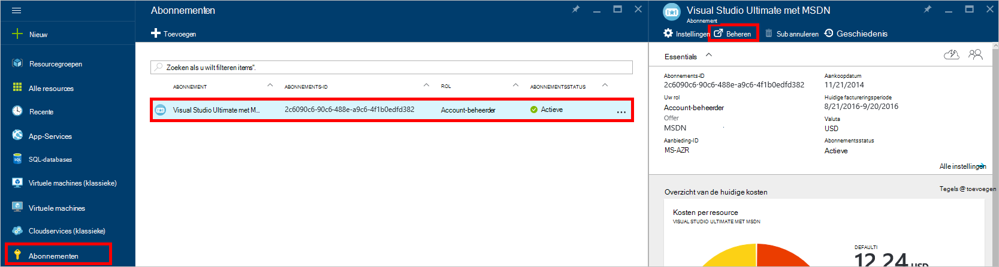
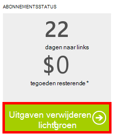

<properties
    pageTitle="Problemen met DocumentDB portal oplossen | Microsoft Azure"
    description="Bekijk problemen in de portal DocumentDB Azure op te lossen." 
    services="documentdb"
    documentationCenter=""
    authors="mimig1"
    manager="jhubbard"
    editor="monicar"/>

<tags
    ms.service="documentdb"
    ms.workload="data-services"
    ms.tgt_pltfrm="na"
    ms.devlang="na"
    ms.topic="article"
    ms.date="08/29/2016"
    ms.author="mimig"/>

# Azure DocumentDB portal tips voor probleemoplossing

In dit artikel wordt beschreven hoe DocumentDB problemen in de portal van Azure op te lossen. 

## Resources zijn verdwenen

**Symptoom**: Databases of verzamelingen ontbreken in de portal bladen.

**Oplossing**: toepassingsgebruik te kunnen uitvoeren onder het quotum maximumdoorvoer voor de collectie Verlaag. 

**Uitleg**: de portal is een toepassing zoals enig ander, kunt bellen aan uw DocumentDB database en de siteverzameling. Als uw aanvragen zijn momenteel wordt vertraagd vanwege oproepen uit een andere toepassing, kan de portal ook worden vertraagd, veroorzaakt door resources niet worden weergegeven in de portal. Het probleem is opgelost, het adres van de oorzaak van het gebruik van hoge doorvoer en vernieuw vervolgens het portal blad. Informatie over hoe u meten en het gebruik van lagere doorvoer vindt u in het gedeelte [Doorloop](documentdb-performance-tips.md#throughput) van het artikel [tips voor betere prestaties](documentdb-performance-tips.md) .
 
## Pagina's of bladen niet geladen

**Symptoom**: pagina's en bladen in de portal worden niet weergegeven.

**Oplossing**: toepassingsgebruik te kunnen uitvoeren onder het quotum maximumdoorvoer voor de collectie verlagen. 

**Uitleg**: de portal is een toepassing zoals enig ander, kunt bellen aan uw DocumentDB database en de siteverzameling. Als uw aanvragen zijn momenteel wordt vertraagd vanwege oproepen uit een andere toepassing, kan de portal ook worden vertraagd, veroorzaakt door resources niet worden weergegeven in de portal. Het probleem is opgelost, het adres van de oorzaak van het gebruik van hoge doorvoer en vernieuw vervolgens het portal blad. Informatie over hoe u meten en het gebruik van lagere doorvoer vindt u in het gedeelte [Doorloop](documentdb-performance-tips.md#throughput) van het artikel [tips voor betere prestaties](documentdb-performance-tips.md) .

## Knop verzameling is uitgeschakeld toevoegen

**Symptoom**: klik op het blad Database, de knop **Verzameling toevoegen** is uitgeschakeld.

**Uitleg**: als uw Azure-abonnement gekoppeld aan voordeel tegoeden, is zoals tegoeden gratis wordt aangeboden via een MSDN-abonnement en u al uw tegoeden voor de maand gebruikt hebt, bent u niet kunt maken van alle aanvullende verzamelingen in DocumentDB.

**Oplossing**: de limiet van uitgaven verwijderen uit uw account.

1. Klik in de portal Azure in de Jumpbar, klik op **abonnementen**het abonnement dat is gekoppeld aan de database DocumentDB op en klik vervolgens in het blad **abonnement** op **beheren**. 
    

2. In het nieuwe browservenster ziet u dat er geen resterende tegoeden. Klik op de knop **budget verwijderen** als u wilt verwijderen voor alleen de huidige factureringsperiode of voor onbepaalde tijd besteden. Voltooi de wizard voor het toevoegen of uw creditcardgegevens bevestigen. 
    

 
## Query Explorer is voltooid met fouten

Zie [problemen met Query Explorer](documentdb-query-collections-query-explorer.md#troubleshoot).

## Geen gegevens beschikbaar zijn in monitoring tegels

Zie [problemen oplossen met de tegels controleren](documentdb-monitor-accounts.md#troubleshooting).

## Geen documenten die zijn geretourneerd door een Document Explorer

Zie [problemen met Document Explorer](documentdb-view-json-document-explorer.md#troubleshoot).

## Volgende stappen

Als u steeds problemen in de portal ondervindt nog, neemt u via e-mail verzenden [askdocdb@microsoft.com](mailto:askdocdb@microsoft.com) voor hulp of bestand een ondersteuning aanvragen in de portal door te klikken op **Bladeren**, **Help + ondersteuning**, en vervolgens te klikken op **verzoek voor ondersteuning van maken**.
