<properties
    pageTitle="Power BI zelfstudie voor DocumentDB verbindingslijn | Microsoft Azure"
    description="Gebruik deze zelfstudie Power BI om te importeren JSON begrijpelijke manier mee rapporten maken en gegevens visualiseren met de verbindingslijn DocumentDB en Power BI."
    keywords="Power bi zelfstudie, gegevens, power bi-connector visualiseren"
    services="documentdb"
    authors="h0n"
    manager="jhubbard"
    editor="mimig"
    documentationCenter=""/>

<tags
    ms.service="documentdb"
    ms.workload="data-services"
    ms.tgt_pltfrm="na"
    ms.devlang="na"
    ms.topic="article"
    ms.date="09/22/2016"
    ms.author="hawong"/>

# Power BI zelfstudie voor DocumentDB: gegevens visualiseren met de Power BI-connector

[PowerBI.com](https://powerbi.microsoft.com/) is een onlineservice waar u kunt maken en delen van dashboards en rapporten met gegevens die belangrijk voor u en uw organisatie.  Power BI Desktop is een speciaal programma waarmee u kunt gegevens ophalen uit verschillende gegevensbronnen samenvoegen en de gegevens transformeren, krachtige rapporten en visualisaties maken en de rapporten publiceren naar Power BI voor het ontwerpen van rapporten.  Met de meest recente versie van Power BI Desktop, u kunt nu verbinding maken met uw account DocumentDB via de verbindingslijn DocumentDB voor Power BI.   

In deze zelfstudie Power BI we Doorloop de stappen voor het verbinding maken met een account DocumentDB in Power BI Desktop, navigeer naar een siteverzameling waar we wilt extraheren van de gegevens met de Navigator, JSON gegevens transformeren in tabelvorm met Power BI Desktop Query-Editor, maken en publiceren van een rapport naar de PowerBI.com.

Na het voltooien van deze zelfstudie Power BI, kunt u wel de volgende vragen beantwoorden:  

-   Hoe kan ik-rapporten samenstelt met gegevens uit DocumentDB Power BI Desktop gebruiken?
-   Hoe kan ik verbinding maken met een account DocumentDB in Power BI Desktop?
-   Hoe kan ik gegevens ophalen uit een siteverzameling in Power BI Desktop?
-   Hoe kan ik geneste JSON-gegevens in Power BI Desktop transformeren?
-   Hoe kan ik publiceren en delen van mijn rapporten in PowerBI.com?

## Vereisten voor

Voordat u de instructies te volgen in deze zelfstudie Power BI, moet u zorgen dat u het volgende hebt:

- [De nieuwste versie van Power BI Desktop](https://powerbi.microsoft.com/desktop).
- Toegang tot onze demo-account of de gegevens in uw account Azure DocumentDB.
    - Het account demo wordt gevuld met de Vulkaan gegevens weergegeven in deze zelfstudie. Dit account demo afhankelijk is niet van eventuele serviceovereenkomsten en alleen ter demonstratie is bedoeld.  We reserveren rechts wijzigingen aan deze demo voor het inclusief te brengen, maar niet beperkt tot het account beëindigen, het wijzigen van de sleutel, beperken van toegang, wijzigen en verwijderen van de gegevens, op elk gewenst moment zonder tevoren of reden dan ook.
        - URL: https://analytics.documents.azure.com
        - Alleen-lezen-toets: MSr6kt7Gn0YRQbjd6RbTnTt7VHc5ohaAFu7osF0HdyQmfR + YhwCH2D2jcczVIR1LNK3nMPNBD31losN7lQ/fkw ==
    - Of als u wilt uw eigen account maken, raadpleegt u [een DocumentDB databaseaccount met behulp van de Azure portal maken](https://azure.microsoft.com/documentation/articles/documentdb-create-account/). Vervolgens als u de steekproef Vulkaan gegevens die lijkt op wat wordt gebruikt in deze zelfstudie (maar geen de blokken GeoJSON bevat), raadpleegt u de [NOAA site](https://www.ngdc.noaa.gov/nndc/struts/form?t=102557&s=5&d=5) en vervolgens de gegevens importeren via het [migratieprogramma van DocumentDB gegevens](https://azure.microsoft.com/documentation/articles/documentdb-import-data/).

Als u wilt uw rapporten in PowerBI.com delen, moet u een account in PowerBI.com hebben.  Meer informatie over Power BI voor gratis en Power BI Pro, gaat u naar [https://powerbi.microsoft.com/pricing](https://powerbi.microsoft.com/pricing).

## Laten we aan de slag
In deze zelfstudie, laten we Stel dat u een geologist studie vulkanen overal ter wereld zijn.  De Vulkaan gegevens worden opgeslagen in een DocumentDB-account en de JSON-documenten er zoals de onderstaande.

    {
        "Volcano Name": "Rainier",
        "Country": "United States",
        "Region": "US-Washington",
        "Location": {
            "type": "Point",
            "coordinates": [
            -121.758,
            46.87
            ]
        },
        "Elevation": 4392,
        "Type": "Stratovolcano",
        "Status": "Dendrochronology",
        "Last Known Eruption": "Last known eruption from 1800-1899, inclusive"
    }

U wilt de gegevens Vulkaan van het account DocumentDB ophalen en gegevens visualiseren in een interactief Power BI-rapport zoals hieronder.

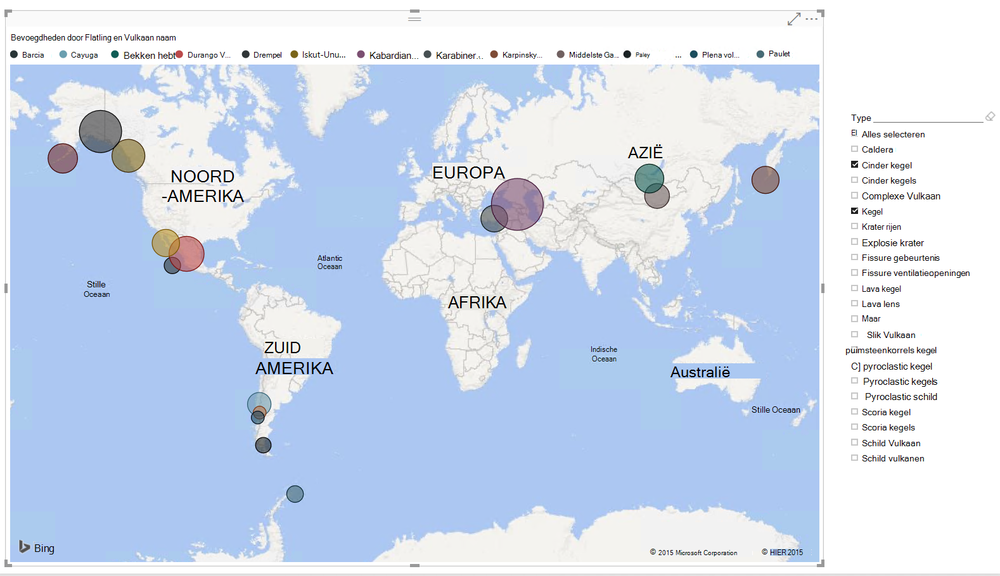

Klaar om zelf proberen? Laten we aan de slag.

1. Power BI Desktop worden uitgevoerd op uw werkstation.
2. Nadat Power BI Desktop wordt gestart, wordt *een welkomstscherm* wordt weergegeven.

    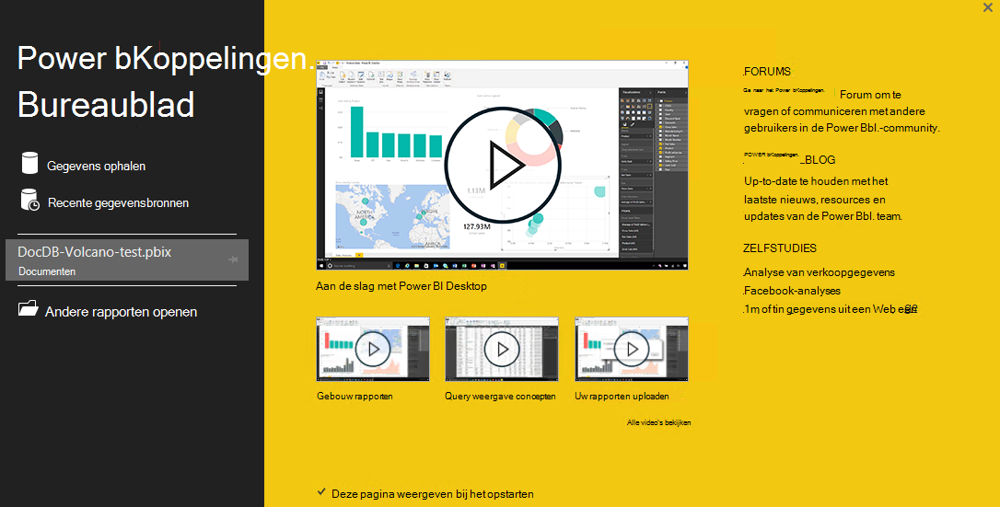

3. U kunt **Gegevens ophalen**, Zie **Recente bronnen**of **Andere rapporten openen** rechtstreeks vanuit *het welkomstscherm* .  Klik op de X aan de rechterbovenhoek om te sluiten van het scherm. De weergave van het **rapport** van Power BI Desktop wordt weergegeven.

    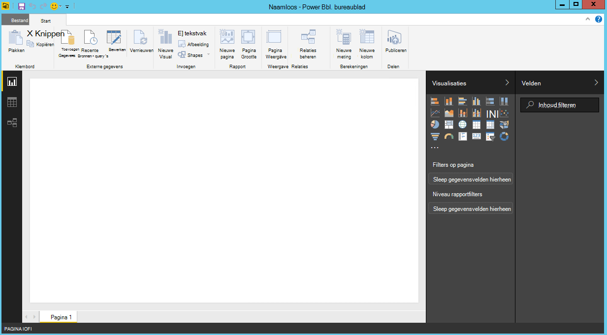

4. Selecteer het lint **Start** , klik op **Gegevens ophalen**.  Het venster **Gegevens ophalen** moet worden weergegeven.

5. Klik op **Azure**, selecteert u **Microsoft Azure DocumentDB (Beta)**en klik op **verbinding maken**.  Het venster **Microsoft Azure DocumentDB verbinding** moet worden weergegeven.

    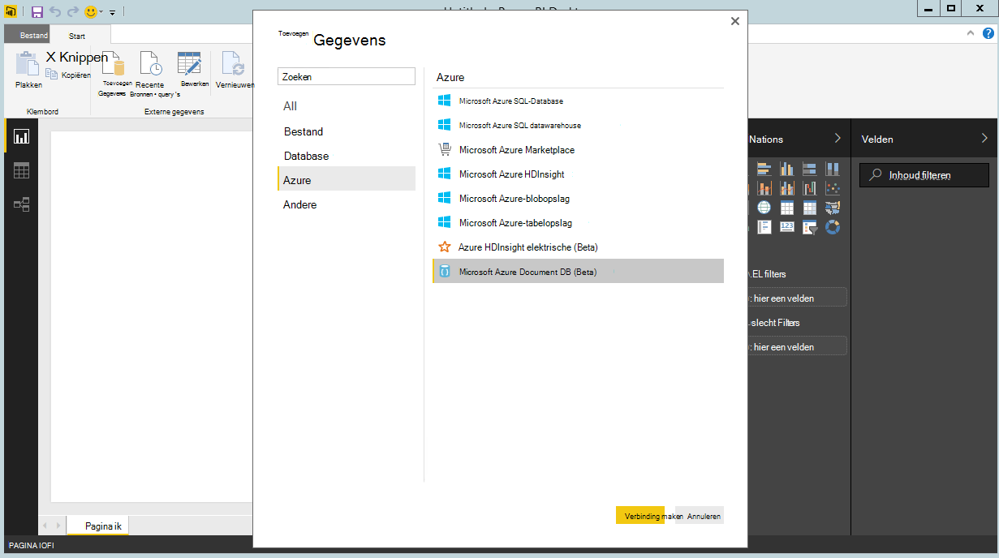

6. Geef de eindpunt URL van een DocumentDB-account dat u wilt de gegevens ophalen, zoals hieronder wordt weergegeven en klik vervolgens op **OK**. U kunt de URL ophalen uit het vak URI in het blad **[toetsen](documentdb-manage-account.md#keys)** van de Azure portal of kunt u het account demo, in dat geval moeten de URL is `https://analytics.documents.azure.com`. 

    Laat de databasenaam, de naam van de siteverzameling en SQL-instructie leeg terwijl deze velden optioneel zijn.  We gebruiken in plaats daarvan de Navigator om de Database en siteverzameling aan te geven waar de gegevens vandaan te selecteren.

    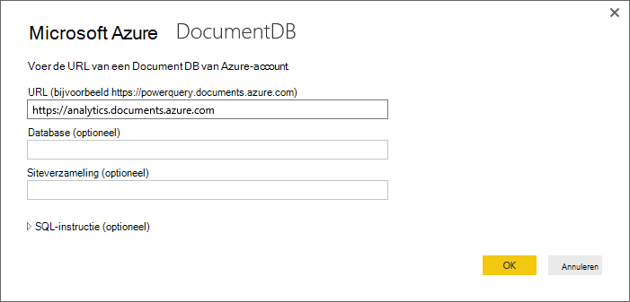

7. Als u verbinding met dit eindpunt voor de eerste keer maakt, wordt u gevraagd voor de accountsleutel.  U kunt de sleutel ophalen uit het vak van de **Primaire sleutel** in het blad **[alleen-lezen toetsen](documentdb-manage-account.md#keys)** van de Azure-portal of kunt u de demo-account, waarin de hoofdletters/kleine letters de sleutel is `RcEBrRI2xVnlWheejXncHId6QRcKdCGQSW6uSUEgroYBWVnujW3YWvgiG2ePZ0P0TppsrMgscoxsO7cf6mOpcA==`. De accountsleutel en klik op **verbinding maken**.

    Het is raadzaam dat u de alleen-lezen-toets gebruiken bij het maken van rapporten.  Hierdoor kunnen onnodige weergeven van de sleutel outmodel aan mogelijke beveiligingsrisico's. De alleen-lezen-toets beschikbaar is op het blad [toetsen](documentdb-manage-account.md#keys) van de Azure-portal of kunt u de demo-accountgegevens hierboven beschreven.

    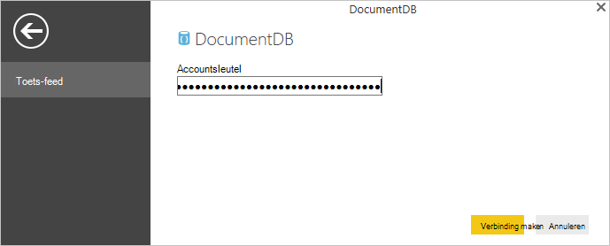

8. Wanneer het account is verbonden, wordt de **Navigator** wordt weergegeven.  De **Navigator** ziet een lijst met databases onder het account.
9. Klik op en Ga op de database waar de gegevens voor het rapport wordt vandaan, als u de demo-account, selecteer **volcanodb**gebruikt.   

10. Selecteer nu een verzameling waarin u de gegevens uit worden opgehaald. Als u de demo-account gebruikt, selecteert u **volcano1**.

    Het deelvenster voorbeeld ziet u een lijst met items voor **Record** .  Een Document wordt weergegeven als een **Record** type in Power BI. Een geneste JSON-blok in een document is op dezelfde manier ook een **Record**.

    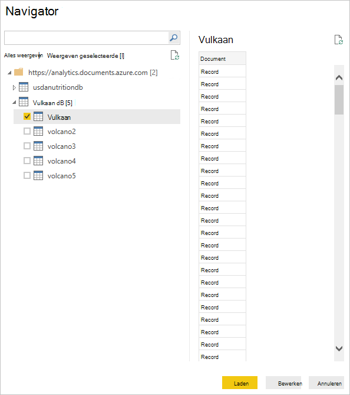

11. Klik op **bewerken** om de Query-Editor starten zodat we de gegevens kunt transformeren.

## Samenvoegen en transformeren JSON-documenten
1. In de Power BI-Queryeditor, ziet u een **Document** -kolom in het middelste deelvenster.
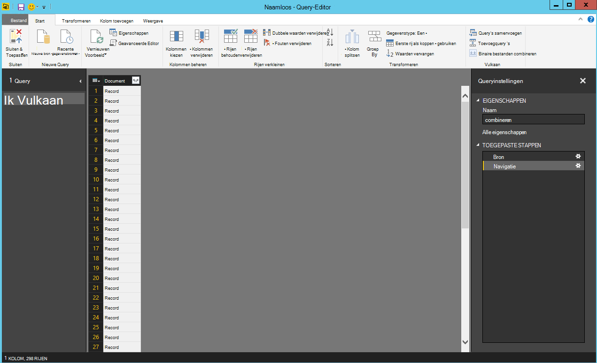

2. Klik op het expander aan de rechterkant van de kolomkop van het **Document** .  Het contextmenu met een lijst met velden wordt weergegeven.  Selecteer de velden die u nodig voor het rapport, bijvoorbeeld Vulkaan naam, land, regio, locatie, leiden tot onrechtmatige uitbreiding, Type, Status en laatste weten uitbreken hebt, en klik vervolgens op **OK**.

    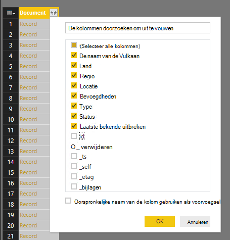

3. Het middelste deelvenster van weergegeven een voorbeeld van het resultaat met de velden die is geselecteerd.

    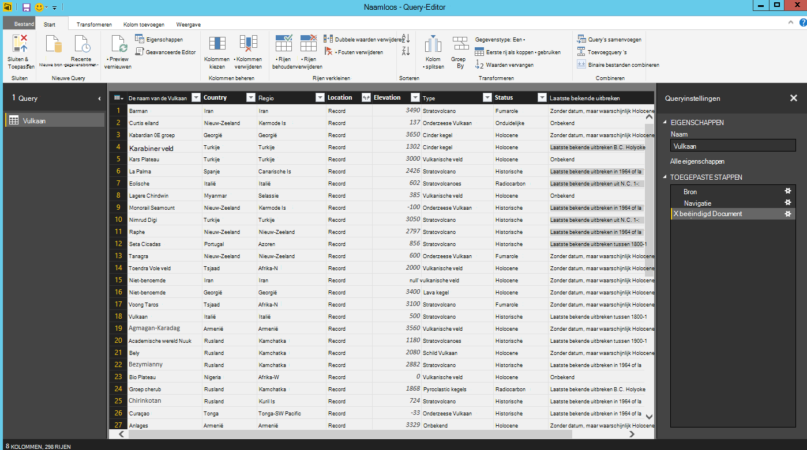

4. In ons voorbeeld is de eigenschap locatie een GeoJSON-blok in een document.  Zoals u ziet, worden locatie wordt weergegeven als een **Record** type in Power BI Desktop.  
5. Klik op de expander aan de rechterkant van de kolomkop locatie.  Het contextmenu waaraan de velden type en coördinaten wordt weergegeven.  Laten we het veld coördinaten en klik op **OK**.

    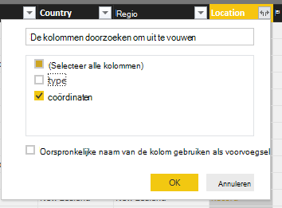

6. Een kolom coördinaten van type **lijst** wordt nu weergegeven in het middelste deelvenster.  Zoals u aan het begin van de zelfstudie, is de GeoJSON gegevens in deze zelfstudie van punt type met breedte- en lengtegegevens waarden die zijn opgenomen in de matrix coördinaten.

    Het element coördinaten [0] betekent lengtegegevens en coördinaten [1] breedtegraad.
    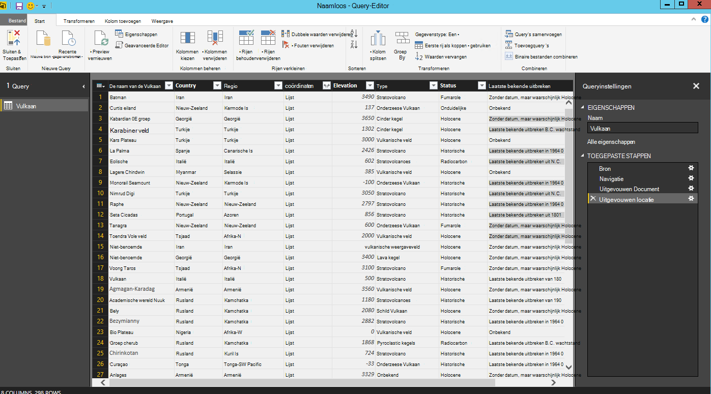

7. Als u wilt samenvoegen in de matrix coördinaten, gaan we een **Aangepaste kolom** LatLong maken.  Selecteer het lint van de **Kolom toevoegen** en klik op **Aangepaste kolom toevoegen**.  Het venster **Aangepaste kolom toevoegen** wordt weergegeven.

8. Geef een naam voor de nieuwe kolom, bijvoorbeeld LatLong.

9. Geef vervolgens de aangepaste formule voor de nieuwe kolom.  In dit voorbeeld wordt de breedte- en lengtegegevens waarden, gescheiden door komma's zoals hieronder met de volgende formule wordt concatenate: `Text.From([Document.Location.coordinates]{1})&","&Text.From([Document.Location.coordinates]{0})`. Klik op **OK**.

    Voor meer informatie over Data Analysis Expressions (DAX) inclusief DAX-functies, gaat u naar [Eenvoudige DAX in Power BI Desktop](https://support.powerbi.com/knowledgebase/articles/554619-dax-basics-in-power-bi-desktop).

    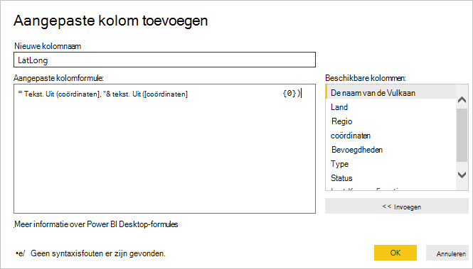

10. Nu ziet het middelste deelvenster van de nieuwe LatLong kolom gevuld met de breedte en lengte waarden, gescheiden door komma's.

    

    Als u een fout in de nieuwe kolom ontvangt, zorg dat de toegepaste stappen onder Queryinstellingen overeenkomen met de volgende afbeelding:

    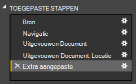

    Als uw stappen verschillen, de extra stappen verwijderen en probeert u de aangepaste kolom opnieuw toe te voegen. 

11. We hebben nu voltooid samenvoegen van de gegevens in tabelvorm.  U kunt profiteren van alle functies die beschikbaar zijn in de Query-Editor op vorm en transformeren van gegevens in DocumentDB.  Als u het voorbeeld gebruikt, het gegevenstype wijzigen voor bevoegdheden op **gehele getal** door het **Gegevenstype** op het lint **Start** te wijzigen.

    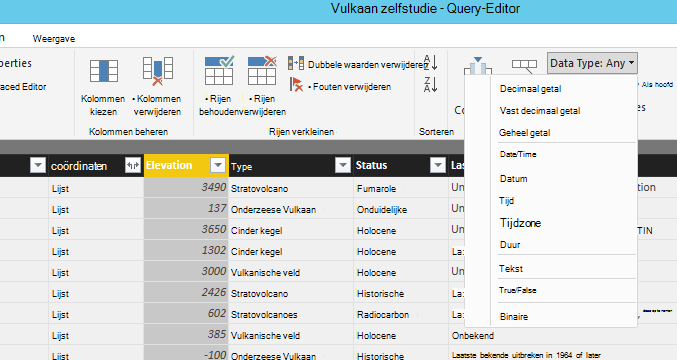

12. Klik op **sluiten en toepassen** om op te slaan het gegevensmodel.

    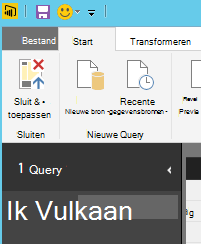

## De rapporten maken
Power BI Desktop rapportweergave is waar u kunt beginnen maken van rapporten gegevens kunt visualiseren.  U kunt rapporten maken door velden in het **rapport** canvas te slepen.

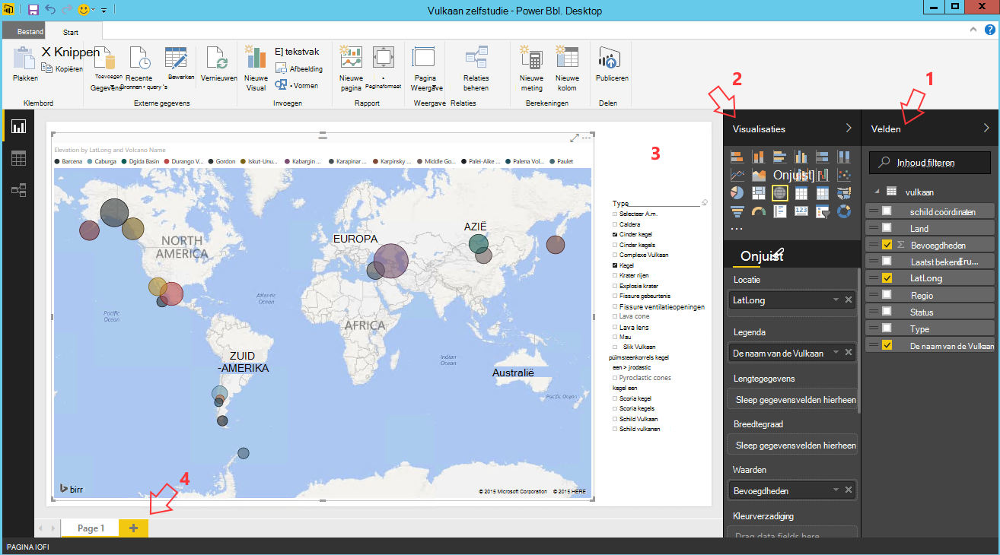

In de rapportweergave, moet u het volgende vinden:

 1. Het deelvenster **velden** dit is waar u ziet een lijst met gegevensmodellen met velden die u voor uw rapporten gebruiken kunt.

 2. Het deelvenster **Visualisaties** . Een rapport kan één of meerdere visualisaties bevatten.  Kies de visuele typen passend maken van uw behoeften vanuit het deelvenster **Visualisaties** .

 3. Het canvas **rapport** dit is waar u de visuele elementen wordt maken voor het rapport.

 4. **De rapportpagina.** U kunt meerdere rapportpagina's toevoegen in Power BI Desktop.

Hieronder ziet u de basisstappen voor het maken van een eenvoudige interactieve kaart view-rapport.

1. In ons voorbeeld gaan we een map-weergave met de locatie van elke Vulkaan maken.  Klik op de kaart visuele type als gemarkeerde in de bovenstaande schermopname in het deelvenster **Visualisaties** .  Hier ziet u de kaart visuele type op het canvas **rapport** getekend.  Het deelvenster **visualisatie** moet een set met eigenschappen die betrekking hebben op het type visuele ook worden weergegeven.

2. Nu slepen en neerzetten van het veld LatLong vanuit het deelvenster **velden** aan de eigenschap **locatie** in het deelvenster **Visualisaties** .
3. Vervolgens slepen en neerzetten van het veld Vulkaan naam aan de eigenschap **legenda** .  

4. Vervolgens slepen en neerzetten van het veld leiden tot onrechtmatige uitbreiding toe aan de eigenschap **grootte** .  

5. U ziet nu de kaart visuele met een reeks die aangeeft dat u de locatie van elke Vulkaan met de grootte van de bel correleren tot de misbruik van Vulkaan bellen.

6. U hebt nu een basisrapport gemaakt.  U kunt het rapport verder aanpassen door u meer visualisaties toevoegt.  In ons geval we een slicer Vulkaan Type zodat het rapport interactieve toegevoegd.  

    

## Publiceren en delen van het rapport
Als u wilt uw rapport wilt delen, moet u een account in PowerBI.com hebben.

1. Klik op het lint **Start** in de Power BI Desktop.
2. Klik op **publiceren**.  U wordt gevraagd om in te voeren de gebruikersnaam en wachtwoord voor uw PowerBI.com-account.
3. Zodra de referentie is geverifieerd, wordt het rapport wordt gepubliceerd naar uw bestemming die u hebt geselecteerd.
4. Klik op **openen 'PowerBITutorial.pbix' in Power BI** om te zien en uw rapport op PowerBI.com delen.

    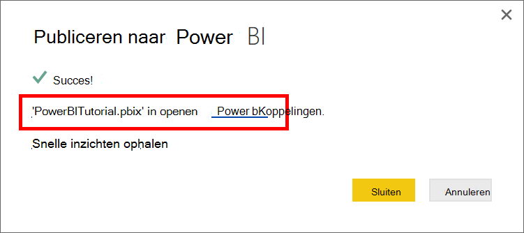

## Een dashboard in PowerBI.com maken

Nu dat u een rapport hebt, kunnen dit delen in PowerBI.com

Wanneer u uw rapport van Power BI Desktop naar de PowerBI.com publiceert, wordt een **rapport** en een **gegevensset** in de PowerBI.com-tenant gegenereerd. Bijvoorbeeld nadat u een rapport genaamd **PowerBITutorial** naar de PowerBI.com gepubliceerd, ziet u PowerBITutorial in zowel de **rapporten** en **gegevenssets** secties op PowerBI.com.

   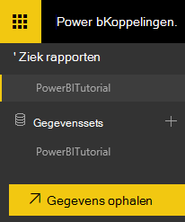

Als u wilt maken van een dashboard worden gedeeld, klikt u op de knop **Vastmaken Live pagina** in uw rapport PowerBI.com.

   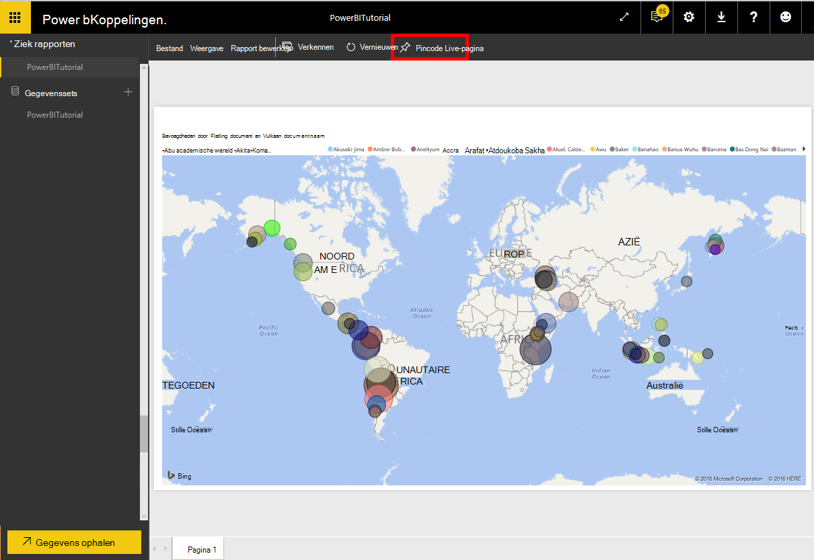

Volg de instructies in de [pincode een tegel uit een rapport](https://powerbi.microsoft.com/documentation/powerbi-service-pin-a-tile-to-a-dashboard-from-a-report/#pin-a-tile-from-a-report) Maak een nieuwe dashboard. 

U kunt ook ad-hoc wijzigingen aan het rapport doen voordat u een dashboard maken. Het wordt aanbevolen dat u Power BI Desktop gebruiken voor de wijzigingen aan te brengen en opnieuw publiceren van het rapport op PowerBI.com.

## Gegevens vernieuwen in PowerBI.com

Er zijn twee manieren om gegevens, ad-hoc en geplande te vernieuwen.

Klik op het eclipses (...) door de **gegevensset**, bijvoorbeeld PowerBITutorial voor een ad-hoc vernieuwen. U ziet een lijst met acties inclusief **Nu vernieuwen**. Klik op **Nu vernieuwen** als de gegevens wilt vernieuwen.

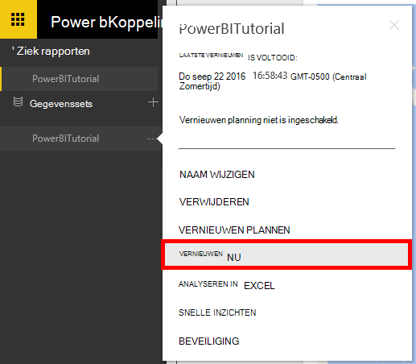

Ga als volgt te werk voor een gepland vernieuwen.

1. Klik op **Vernieuwen plannen** in de actielijst. 
    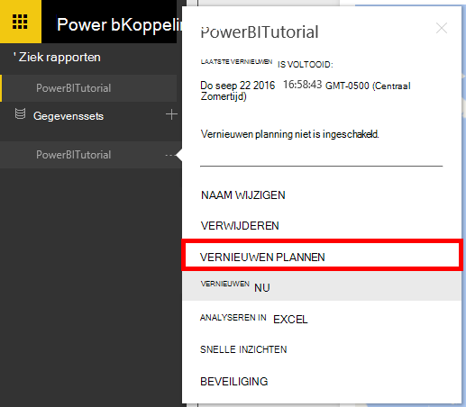

2. Vouw in de pagina **Instellingen** uit de **referenties voor gegevensbronnen**. 

3. Klik op **referenties bewerken**. 

    De pop-up configureren wordt weergegeven. 

4. Voer de code verbinding maken met het account DocumentDB voor die gegevensverzameling in en klik op **aanmelden**. 

5. Vouw **Vernieuwen plannen** en instellen van de planning die u wilt vernieuwen van de gegevensset. 
  
6. Klik op **toepassen** en u klaar bent met het gepland vernieuwen instellen.

## Volgende stappen
- Zie meer informatie over Power BI, [aan de slag met Power BI](https://powerbi.microsoft.com/documentation/powerbi-service-get-started/).
- Meer informatie over DocumentDB, raadpleegt u de [documentatie van DocumentDB lossen pagina](https://azure.microsoft.com/documentation/services/documentdb/).
