<properties
    pageTitle="Python kolf van webtoepassingen met DocumentDB | Microsoft Azure"
    description="Bekijk een zelfstudie over het gebruik van DocumentDB opslaan en openen van gegevens uit een Python van webtoepassing die worden gehost op Azure. Oplossingen voor het ontwikkelen van toepassingen zoeken." 
    keywords="Ontwikkelen van toepassingen, zelfstudie, python kolf, webtoepassing python, python webontwikkeling, documentdb, azure, Microsoft azure"
    services="documentdb"
    documentationCenter="python"
    authors="syamkmsft"
    manager="jhubbard"
    editor="cgronlun"/>

<tags
    ms.service="documentdb"
    ms.workload="data-management"
    ms.tgt_pltfrm="na"
    ms.devlang="python"
    ms.topic="hero-article"
    ms.date="08/25/2016"
    ms.author="syamk"/>

# <a name="python-flask-web-application-development-with-documentdb"></a>Python kolf van webtoepassingen met DocumentDB

> [AZURE.SELECTOR]
- [.NET](documentdb-dotnet-application.md)
- [Node.js](documentdb-nodejs-application.md)
- [Java](documentdb-java-application.md)
- [Python](documentdb-python-application.md)

Deze zelfstudie ziet u hoe u het Azure DocumentDB gebruiken om op te slaan en access-gegevens uit een Python webtoepassing die worden gehost op Azure en wordt ervan uitgegaan dat er enkele ervaring met Python en Azure websites.

Deze zelfstudie database worden de volgende onderwerpen besproken:

1. Maken en inrichten van een DocumentDB-account.
2. Maken van een toepassing Python MVC.
3. Verbinding maakt met en Azure DocumentDB vanuit uw webtoepassing.
4. De webtoepassing Azure Websites implementeren.

Door deze zelfstudie te volgen, wordt u een eenvoudige stemknoppen toepassing waarmee u stemmen voor een peiling maken.

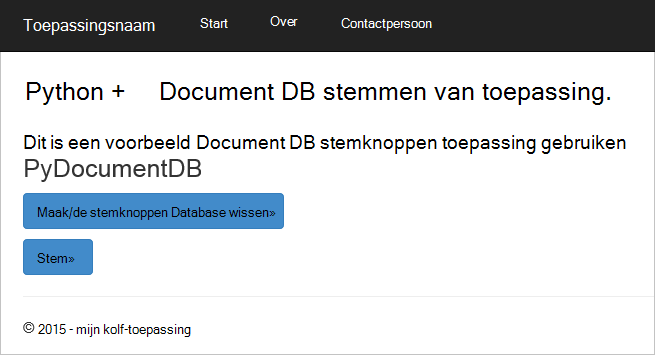


## <a name="database-tutorial-prerequisites"></a>Zelfstudievideo vereisten voor database

Voordat u de instructies in dit artikel te volgen, moet u ervoor zorgen dat u het volgende geïnstalleerd hebt:

- Een actieve Azure-account. Als u geen account hebt, kunt u een gratis proefabonnement-account maken in een paar minuten. Zie [Azure gratis proefversie](https://azure.microsoft.com/pricing/free-trial/)voor meer informatie.
- [Visual Studio 2013](http://www.visualstudio.com/) of hoger, of [Visual Studio Express](), dat wil de gratis versie zeggen. De instructies in deze zelfstudie zijn specifiek voor Visual Studio-2015 zijn geschreven. 
- Python hulpprogramma's voor Visual Studio uit [GitHub](http://microsoft.github.io/PTVS/). In deze zelfstudie wordt Python hulpprogramma's voor tegenover 2015. 
- Azure Python SDK voor Visual Studio, versie 2,4 of hoger verkrijgbaar via [azure.com](https://azure.microsoft.com/downloads/). We Microsoft Azure SDK voor Python 2.7 gebruikt.
- Python 2.7 uit [python.org][2]. We Python 2.7.11 gebruikt. 

> [AZURE.IMPORTANT] Als u Python 2.7 voor de eerste keer installeert, controleert u dat in het scherm aanpassen Python 2.7.11 u **python.exe aan het pad naar toevoegen**.
> 
>    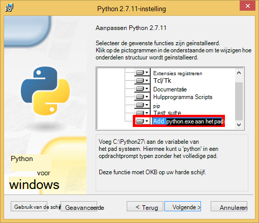

- Microsoft Visual C++ compileerprogramma voor Python 2.7 vanuit het [Microsoft Download Center][3].

## <a name="step-1-create-a-documentdb-database-account"></a>Stap 1: Maak een account van de database DocumentDB

Laten we beginnen met het maken van een DocumentDB-account. Als u al een account hebt, kunt u doorgaan met [stap 2: Maak een nieuwe webtoepassing van Python van](#step-2:-create-a-new-python-flask-web-application).

[AZURE.INCLUDE [documentdb-create-dbaccount](../../includes/documentdb-create-dbaccount.md)]

<br/>
We nu doorlopen het maken van een nieuwe Python van webtoepassing helemaal omhoog.

## <a name="step-2-create-a-new-python-flask-web-application"></a>Stap 2: Maak een nieuwe Python van webtoepassing

1. In Visual Studio, in het menu **bestand** , wijs **Nieuw**aan en klik vervolgens op **Project**.

    Het dialoogvenster **Nieuw Project** wordt weergegeven.

2. **Sjablonen** en klik vervolgens op **Python**uitvouwen in het linkerdeelvenster en klik vervolgens op **Web**. 

3. Selecteer **Van Web Project** in het middelste deelvenster, drukt u in de **naam** vak type **zelfstudie**, en klik vervolgens op **OK**. Houd er rekening mee dat Python pakket namen alle kleine letters, worden moeten zoals wordt beschreven in de [Stijl handleiding voor Python Code](https://www.python.org/dev/peps/pep-0008/#package-and-module-names).

    Voor de nieuwe in Python van is dit een web application development framework waarmee u sneller webtoepassingen in Python samen.

    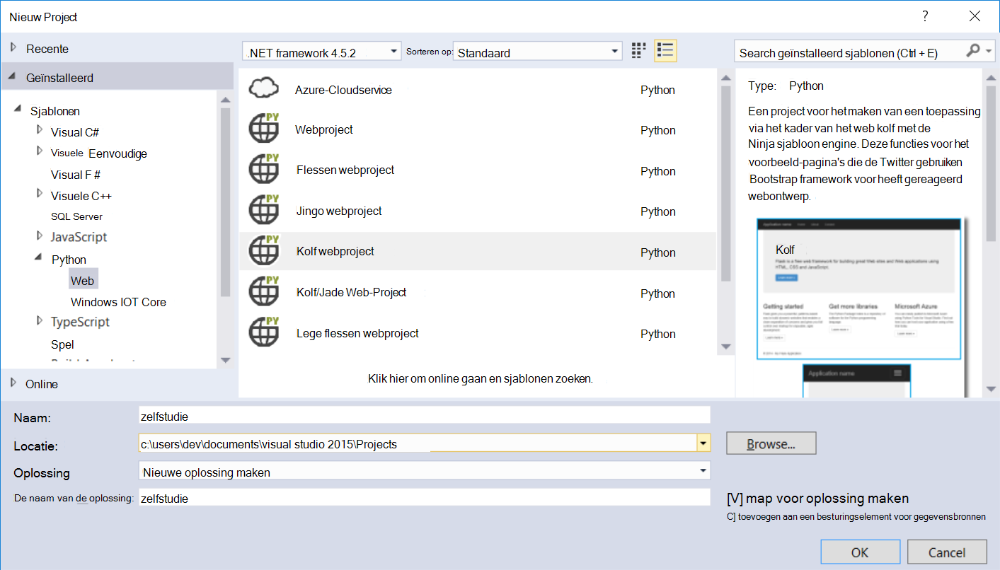

4. In het venster **Python Tools voor Visual Studio** , klikt u op **installeren in een omgeving die is virtual**. 

    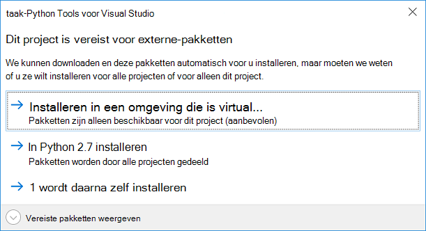

5. Klik in het venster **Virtuele omgeving toevoegen** kunt u accepteer de standaardinstellingen en Python 2.7 gebruiken als de basis-omgeving omdat PyDocumentDB worden momenteel niet ondersteund voor Python 3.x, en klik op **maken**. Hiermee wordt ingesteld om de vereiste Python virtuele omgeving voor uw project.

    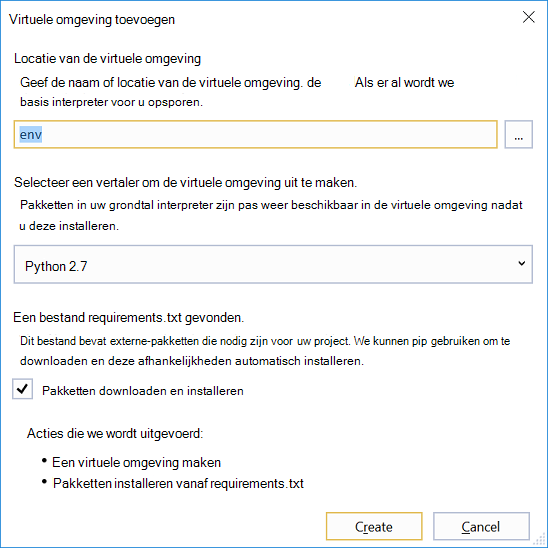

    Geeft het uitvoervenster `Successfully installed Flask-0.10.1 Jinja2-2.8 MarkupSafe-0.23 Werkzeug-0.11.5 itsdangerous-0.24 'requirements.txt' was installed successfully.` wanneer de omgeving is geïnstalleerd.

## <a name="step-3-modify-the-python-flask-web-application"></a>Stap 3: De webtoepassing Python van wijzigen

### <a name="add-the-python-flask-packages-to-your-project"></a>De pakketten Python van toevoegen aan uw project

Nadat u uw project is ingesteld, moet u de vereiste kolf-pakketten toevoegen aan uw project, inclusief pydocumentdb, het pakket Python voor DocumentDB.

1. Open het bestand met de naam **requirements.txt** in Solution Explorer en de inhoud vervangen door het volgende:

        flask==0.9
        flask-mail==0.7.6
        sqlalchemy==0.7.9
        flask-sqlalchemy==0.16
        sqlalchemy-migrate==0.7.2
        flask-whooshalchemy==0.55a
        flask-wtf==0.8.4
        pytz==2013b
        flask-babel==0.8
        flup
        pydocumentdb>=1.0.0

2. Sla het bestand **requirements.txt** . 
3. Oplossingverkenner met de rechtermuisknop op de **Envelop** en klik op **installeren vanaf requirements.txt**.

    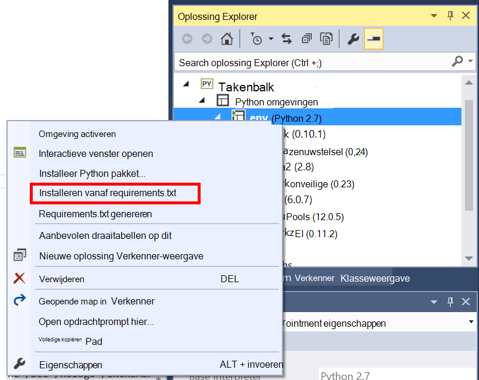

    Het uitvoervenster wordt weergegeven na de installatie is geslaagd, het volgende:

        Successfully installed Babel-2.3.2 Tempita-0.5.2 WTForms-2.1 Whoosh-2.7.4 blinker-1.4 decorator-4.0.9 flask-0.9 flask-babel-0.8 flask-mail-0.7.6 flask-sqlalchemy-0.16 flask-whooshalchemy-0.55a0 flask-wtf-0.8.4 flup-1.0.2 pydocumentdb-1.6.1 pytz-2013b0 speaklater-1.3 sqlalchemy-0.7.9 sqlalchemy-migrate-0.7.2

    > [AZURE.NOTE] In sommige gevallen ziet u mogelijk een fout in het uitvoervenster. Als dit gebeurt, controleert u als de fout zijn gerelateerd aan opruimen. Soms kan het opruimen is mislukt, maar de installatie nog steeds niet slaagt (Schuif omhoog in het uitvoervenster om dit te controleren). U kunt uw installatie door te [verifiëren de virtuele-omgeving](#verify-the-virtual-environment)controleren. Als de installatie is mislukt, maar de verificatie gelukt is, is het OK om door te gaan.

### <a name="verify-the-virtual-environment"></a>Controleer of de virtuele omgeving

Laten we Zorg dat alles juist is geïnstalleerd.

1. Maak de oplossing door **CTRL**+**Shift**+**B**.
2. Zodra de build is uitgevoerd, start u de website door drukt u op **F5**. Hiermee wordt geopend de kolf development-server en start uw webbrowser. Hier ziet u de volgende pagina.

    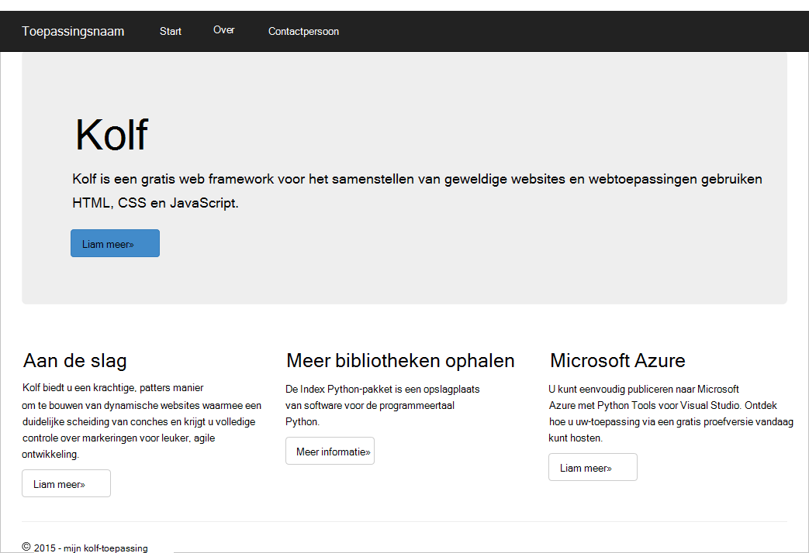

3. Stop de foutopsporing van de website door **Shift**ingedrukt+**F5** in Visual Studio.

### <a name="create-database-collection-and-document-definitions"></a>Database, siteverzamelingen en documentdefinities van een maken

Nu uw stemknoppen toepassing maken door nieuwe bestanden toevoegen en bijwerken van anderen.

1. Klik in Solution Explorer met de rechtermuisknop op het project **zelfstudie** , klikt u op **toevoegen**en klik vervolgens op **Nieuw Item**. Selecteer **Lege Python-bestand** en de naam van het bestand **forms.py**.  
2. De volgende code toevoegen aan het bestand forms.py en sla het bestand.

```python
from flask.ext.wtf import Form
from wtforms import RadioField

class VoteForm(Form):
    deploy_preference  = RadioField('Deployment Preference', choices=[
        ('Web Site', 'Web Site'),
        ('Cloud Service', 'Cloud Service'),
        ('Virtual Machine', 'Virtual Machine')], default='Web Site')
```


### <a name="add-the-required-imports-to-viewspy"></a>De vereiste invoer toevoegen aan views.py

1. Vouw de map **zelfstudie** in Solution Explorer en open het bestand **views.py** . 
2. Voeg de volgende beweringen importeren naar het begin van het bestand **views.py** en vervolgens het bestand opslaat. Deze DocumentDB van PythonSDK en de kolf-pakketten importeren.

    ```python
    from forms import VoteForm
    import config
    import pydocumentdb.document_client as document_client
    ```


### <a name="create-database-collection-and-document"></a>Database, siteverzamelingen en document maken

- Nog steeds in **views.py**, de volgende code hebt toegevoegd aan het einde van het bestand. Dit zorgt voor het maken van de database die wordt gebruikt door het formulier. Een van de bestaande code in **views.py**niet verwijderen. Dit gewoon toevoegen aan het einde.

```python
@app.route('/create')
def create():
    """Renders the contact page."""
    client = document_client.DocumentClient(config.DOCUMENTDB_HOST, {'masterKey': config.DOCUMENTDB_KEY})

    # Attempt to delete the database.  This allows this to be used to recreate as well as create
    try:
        db = next((data for data in client.ReadDatabases() if data['id'] == config.DOCUMENTDB_DATABASE))
        client.DeleteDatabase(db['_self'])
    except:
        pass

    # Create database
    db = client.CreateDatabase({ 'id': config.DOCUMENTDB_DATABASE })

    # Create collection
    collection = client.CreateCollection(db['_self'],{ 'id': config.DOCUMENTDB_COLLECTION })

    # Create document
    document = client.CreateDocument(collection['_self'],
        { 'id': config.DOCUMENTDB_DOCUMENT,
          'Web Site': 0,
          'Cloud Service': 0,
          'Virtual Machine': 0,
          'name': config.DOCUMENTDB_DOCUMENT 
        })

    return render_template(
       'create.html',
        title='Create Page',
        year=datetime.now().year,
        message='You just created a new database, collection, and document.  Your old votes have been deleted')
```

> [AZURE.TIP] De methode **CreateCollection** gebruikt een optioneel **RequestOptions** als de derde parameter. Dit kan worden gebruikt om op te geven van het Type bieden voor de siteverzameling. Als geen waarde offerType wordt opgegeven, wordt klikt u vervolgens de verzameling gemaakt met behulp van de Type bieden. Zie voor meer informatie over DocumentDB bieden typen, [prestatieniveaus in DocumentDB](documentdb-performance-levels.md).


### <a name="read-database-collection-document-and-submit-form"></a>Lees database, siteverzamelingen, document, formulier en verzenden

- Nog steeds in **views.py**, de volgende code hebt toegevoegd aan het einde van het bestand. Dit zorgt voor het instellen van het formulier voor het lezen van de database, siteverzameling of document. Een van de bestaande code in **views.py**niet verwijderen. Dit gewoon toevoegen aan het einde.

```python
@app.route('/vote', methods=['GET', 'POST'])
def vote(): 
    form = VoteForm()
    replaced_document ={}
    if form.validate_on_submit(): # is user submitted vote  
        client = document_client.DocumentClient(config.DOCUMENTDB_HOST, {'masterKey': config.DOCUMENTDB_KEY})

        # Read databases and take first since id should not be duplicated.
        db = next((data for data in client.ReadDatabases() if data['id'] == config.DOCUMENTDB_DATABASE))

        # Read collections and take first since id should not be duplicated.
        coll = next((coll for coll in client.ReadCollections(db['_self']) if coll['id'] == config.DOCUMENTDB_COLLECTION))

        # Read documents and take first since id should not be duplicated.
        doc = next((doc for doc in client.ReadDocuments(coll['_self']) if doc['id'] == config.DOCUMENTDB_DOCUMENT))

        # Take the data from the deploy_preference and increment our database
        doc[form.deploy_preference.data] = doc[form.deploy_preference.data] + 1
        replaced_document = client.ReplaceDocument(doc['_self'], doc)

        # Create a model to pass to results.html
        class VoteObject:
            choices = dict()
            total_votes = 0

        vote_object = VoteObject()
        vote_object.choices = {
            "Web Site" : doc['Web Site'],
            "Cloud Service" : doc['Cloud Service'],
            "Virtual Machine" : doc['Virtual Machine']
        }
        vote_object.total_votes = sum(vote_object.choices.values())

        return render_template(
            'results.html', 
            year=datetime.now().year, 
            vote_object = vote_object)

    else :
        return render_template(
            'vote.html', 
            title = 'Vote',
            year=datetime.now().year,
            form = form)
```


### <a name="create-the-html-files"></a>De HTML-bestanden maken

1. Klik met de rechtermuisknop op de map **sjablonen** in Solution Explorer, klik in de map **zelfstudie** , klikt u op **toevoegen**en klik vervolgens op **Nieuw Item**. 
2. Selecteer **HTML-pagina**en typ vervolgens in het naamvak **create.html**. 
3. Herhaal stap 1 en 2 voor het maken van twee extra HTML-bestanden: results.html en vote.html.
4. Voeg de volgende code toe **create.html** in de `<body>` element. Er wordt een bericht weergegeven dat we hebben gemaakt een nieuwe database, siteverzameling of document.

    ```html
    
    
    <h2>{{ title }}.</h2>
    <h3>{{ message }}</h3>
    <p><a href="{{ url_for('vote') }}" class="btn btn-primary btn-large">Vote &raquo;</a></p>
    
    ```

5. Voeg de volgende code toe **results.html** in de `<body`> element. De resultaten van de peiling wordt weergegeven.

    ```html
    
    
    <h2>Results of the vote</h2>
        <br />
        
    
    <div class="row">
        <div class="col-sm-5">{{choice}}</div>
            <div class="col-sm-5">
                <div class="progress">
                    <div class="progress-bar" role="progressbar" aria-valuenow="{{vote_object.choices[choice]}}" aria-valuemin="0" aria-valuemax="{{vote_object.total_votes}}" style="width: {{(vote_object.choices[choice]/vote_object.total_votes)*100}}%;">
                                {{vote_object.choices[choice]}}
                </div>
            </div>
            </div>
    </div>
    
    
    <br />
    <a class="btn btn-primary" href="{{ url_for('vote') }}">Vote again?</a>
    
    ```

6. Voeg de volgende code toe **vote.html** in de `<body`> element. Er wordt weergegeven in de peiling en de stemmen geaccepteerd. Voor het registreren van de stemmen, is het besturingselement doorgegeven via views.py waar we de cast stem herkennen en toevoegen van het document dienovereenkomstig gewijzigd.

    ```html
    
    
    <h2>What is your favorite way to host an application on Azure?</h2>
    <form action="" method="post" name="vote">
        {{form.hidden_tag()}}
            {{form.deploy_preference}}
            <button class="btn btn-primary" type="submit">Vote</button>
    </form>
    
    ```

7. Vervang de inhoud van **index.html** met de volgende items in de map **sjablonen** . Dit is de aantekening toevoegen voor uw toepassing.
    
    ```html
    
    
    <h2>Python + DocumentDB Voting Application.</h2>
    <h3>This is a sample DocumentDB voting application using PyDocumentDB</h3>
    <p><a href="{{ url_for('create') }}" class="btn btn-primary btn-large">Create/Clear the Voting Database &raquo;</a></p>
    <p><a href="{{ url_for('vote') }}" class="btn btn-primary btn-large">Vote &raquo;</a></p>
    
    ```

### <a name="add-a-configuration-file-and-change-the-initpy"></a>Voeg een configuratiebestand en wijzig de \_ \_initialisatie\_\_.py

1. In Solution Explorer met de rechtermuisknop op het project **zelfstudie** , klikt u op **toevoegen**, klik op **Nieuw Item**, selecteer **Lege Python-bestand**en geef een naam op het bestand **config.py**. In dit configuratiebestand is vereist voor formulieren in kolf. U kunt deze op te geven als u ook een geheime sleutel. Deze toets niet is nodig voor deze zelfstudie door.

2. Voeg de volgende code toe config.py, moet u de waarden van wijzigen **DOCUMENTDB\_HOST** en **DOCUMENTDB\_sleutel** in de volgende stap.

    ```python
    CSRF_ENABLED = True
    SECRET_KEY = 'you-will-never-guess'
    
    DOCUMENTDB_HOST = 'https://YOUR_DOCUMENTDB_NAME.documents.azure.com:443/'
    DOCUMENTDB_KEY = 'YOUR_SECRET_KEY_ENDING_IN_=='
    
    DOCUMENTDB_DATABASE = 'voting database'
    DOCUMENTDB_COLLECTION = 'voting collection'
    DOCUMENTDB_DOCUMENT = 'voting document'
    ```

3. Klik in de [portal van Azure](https://portal.azure.com/)Ga naar het blad **toetsen** door te klikken op **Bladeren**, **DocumentDB Accounts**, dubbelklik op de naam van het account te gebruiken en klik vervolgens op de knop **toetsen** in het gebied **Essentials** . Kopieer in het blad **toetsen** de waarde **URI** en plak deze in het bestand **config.py** , als de waarde voor de **DOCUMENTDB\_HOST** eigenschap. 
4. Terug in de portal Azure in het blad **toetsen** , kopieert u de waarde van de **Primaire sleutel** of de **Secundaire sleutel**en plak deze in het bestand **config.py** , als de waarde voor de **DOCUMENTDB\_sleutel** eigenschap.
5. In de ** \_ \_initialisatie\_\_.py** bestand, de volgende regel toevoegen. 

        app.config.from_object('config')

    Zodat de inhoud van het bestand is:

    ```python
    from flask import Flask
    app = Flask(__name__)
    app.config.from_object('config')
    import tutorial.views
    ```

6. Na het toevoegen van alle bestanden, ziet Solution Explorer er als volgt:

    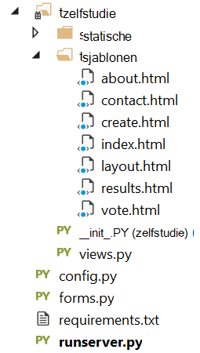


## <a name="step-4-run-your-web-application-locally"></a>Stap 4: Uw webtoepassing lokaal uitvoeren

1. Maak de oplossing door **CTRL**+**Shift**+**B**.
2. Zodra de build is uitgevoerd, start u de website door drukt u op **F5**. Ziet u de volgende handelingen uit op het scherm.

    

3. Klik op **De Database stemmen maken bevestigen/wissen** om te genereren van de database.

    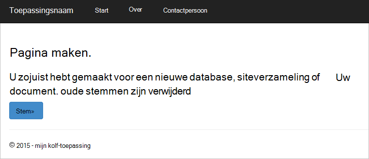

4. Vervolgens klikt u op **stemming** en selecteer de optie.

    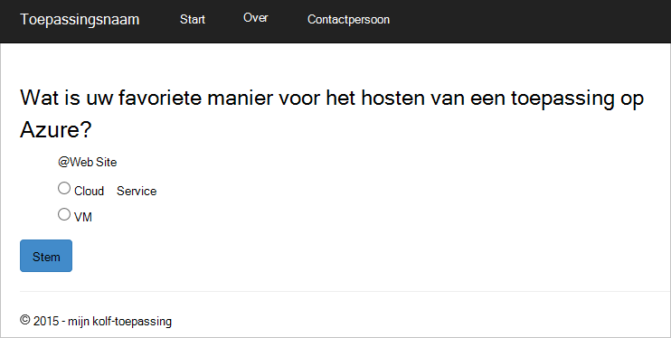

5. Voor elke stem u, wordt het betreffende item verhoogd.

    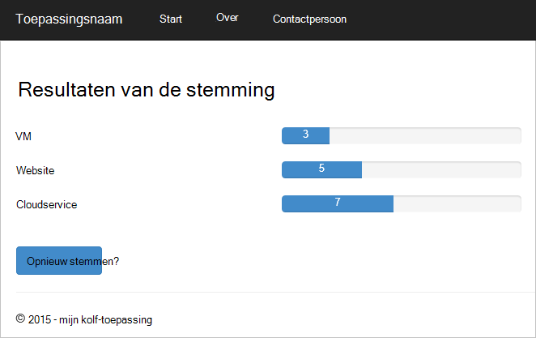

6. Stop de foutopsporing van het project door op Shift + F5 te drukken.

## <a name="step-5-deploy-the-web-application-to-azure-websites"></a>Stap 5: De webtoepassing Azure Websites implementeren

Nu dat u de volledige toepassing goed werkt tegen DocumentDB hebt, gaan we distribueren naar Azure-Websites.

1. Met de rechtermuisknop op het project in Solution Explorer (Zorg ervoor dat u niet bent nog steeds lokaal uitgevoerd) en selecteer **publiceren**.  

    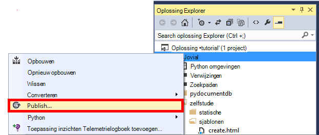

2. Selecteer **Microsoft Azure Web Apps**in het venster **Web publiceren** en klik vervolgens op **volgende**.

    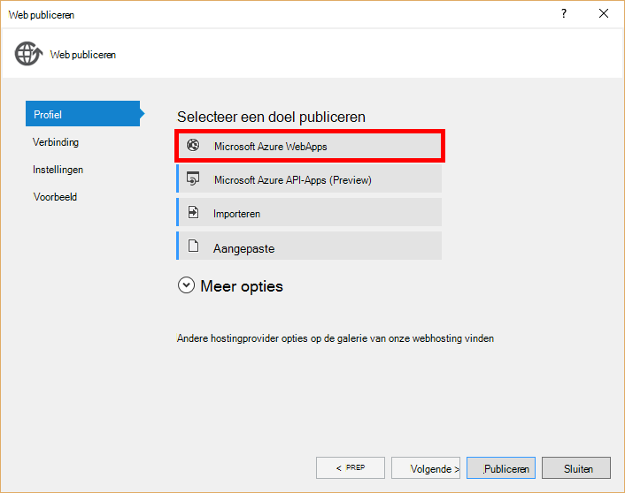

3. Klik in het venster **Microsoft Azure Web Apps-venster** op **Nieuw**.

    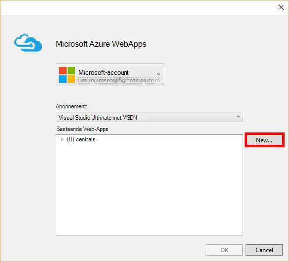

4. Klik in het venster **site maken op Microsoft Azure** Voer een **naam van de Web-app**, **App-abonnement**, **resourcegroep**en **regio**en klik op **maken**.

    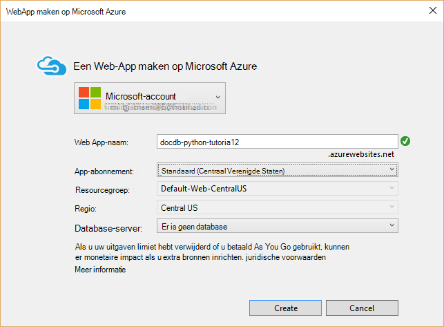

5. Klik in het venster **Web publiceren** op **publiceren**.

    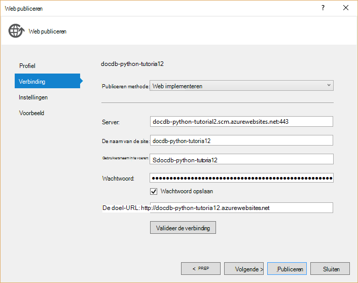

3. In een paar seconden wordt Visual Studio klaar bent met uw webtoepassing te publiceren en starten van een browser waar u uw handige werk uitgevoerd in Azure kunt zien!

## <a name="troubleshooting"></a>Problemen oplossen

Als dit de eerste Python-app die u hebt uitgevoerd op uw computer, moet u ervoor zorgen dat de volgende mappen (of de installatielocaties equivalente) worden opgenomen in uw variabele pad:

    C:\Python27\site-packages;C:\Python27\;C:\Python27\Scripts;

Als u een foutbericht weergegeven op de pagina van uw stem en naam van uw project een ander nummer dan **zelfstudie**, zorg ervoor dat ** \_ \_initialisatie\_\_.py** verwijst naar de projectnaam van de juiste in de regel: `import tutorial.view`.

## <a name="next-steps"></a>Volgende stappen

Gefeliciteerd! U hebt alleen uw eerste Python webtoepassing met Azure DocumentDB voltooid en deze naar Azure Websites die zijn gepubliceerd.

We werken en te verbeteren in dit onderwerp regelmatig op basis van uw feedback.  Wanneer u klaar bent met de zelfstudie gaat met de stemknoppen boven en onder aan deze pagina en zorg ervoor dat u uw mening over wat die u wilt zien verbeterd. Als u wij rechtstreeks contact met u opnemen dat wilt, je mag rustig opnemen van uw e-mailadres in uw opmerkingen.

Bekijk de API's beschikbaar in de [DocumentDB Python SDK](documentdb-sdk-python.md)wilt extra functionaliteit toevoegen aan uw webtoepassing.

Zie voor meer informatie over Azure, Visual Studio en Python, het [Python Developer Center](https://azure.microsoft.com/develop/python/). 

Zie voor aanvullende Python van zelfstudies, [het van Mega-zelfstudie deel I: Hallo, wereld!](http://blog.miguelgrinberg.com/post/the-flask-mega-tutorial-part-i-hello-world). 

  [Visual Studio Express]: http://www.visualstudio.com/products/visual-studio-express-vs.aspx
  [2]: https://www.python.org/downloads/windows/
  [3]: https://www.microsoft.com/download/details.aspx?id=44266
  [Microsoft Web Platform Installer]: http://www.microsoft.com/web/downloads/platform.aspx
  [Azure portal]: http://portal.azure.com
