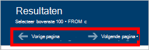

<properties
    pageTitle="DocumentDB Query Explorer: Een SQL query-editor | Microsoft Azure"
    description="Meer informatie over de DocumentDB Query Explorer, een SQL-query-editor in de portal van Azure voor SQL-query's schrijven en uitvoeren van deze ten opzichte van een siteverzameling NoSQL DocumentDB."
    keywords="sql-query's schrijft sql-query-editor"
    services="documentdb"
    authors="kirillg"
    manager="jhubbard"
    editor="monicar"
    documentationCenter=""/>

<tags
    ms.service="documentdb"
    ms.workload="data-services"
    ms.tgt_pltfrm="na"
    ms.devlang="na"
    ms.topic="article"
    ms.date="08/30/2016"
    ms.author="kirillg"/>

# Schrijven, bewerken en SQL-query's uitvoeren voor DocumentDB Query Verkenner 

Dit artikel bevat een overzicht van de [Microsoft Azure DocumentDB](https://azure.microsoft.com/services/documentdb/) Query Explorer, een Azure portal hulpmiddel waarmee u kunt schrijven, bewerken en SQL-query's voor een [siteverzameling DocumentDB](documentdb-create-collection.md)uitgevoerd.

1. Klik in de portal Azure in de Jumpbar, klikt u op **DocumentDB (NoSQL)**. Als **DocumentDB (NoSQL)** niet zichtbaar is, klikt u op **Meer Services** en klik vervolgens op **DocumentDB (NoSQL)**.

2. Klik in het menu resource op **Query Explorer**. 

    

3. In het blad **Query Explorer** , selecteert u de **Databases** en **siteverzamelingen** op query in de vervolgkeuzelijsten en typ de query om uit te voeren. 

    De vervolgkeuzelijsten **Databases** en **verzamelingen** zijn ingevuld afhankelijk van de context waarin u de Query Explorer starten. 

    Een standaardquery van `SELECT TOP 100 * FROM c` is opgegeven.  U kunt de standaardquery accepteren of uw eigen query maken met de SQL-querytaal die worden beschreven in de [SQL-query cheats blad](documentdb-sql-query-cheat-sheet.md) of de [SQL-query en SQL-syntaxis](documentdb-sql-query.md) artikel maken.

    Klik op **query uitvoeren** om de resultaten weer te geven.

    

4. De uitvoer van de query wordt weergegeven in het blad **resultaten** . 

    

## Werken met resultaten

Standaard retourneert Query Explorer resultaten in sets van 100.  Als uw query meer dan 100 resultaten oplevert, gebruikt u de **volgende pagina** en **vorige pagina** opdrachten gewoon navigeren door de resultatenset.

**In het Informatiedeelvenster** bevat zoals de kosten van de aanvraag, het nummer van de query hebt aangebracht, interactie de set met resultaten op dat moment wordt weergegeven, aan de doelstellingen voor geslaagde query's, en of er meer resultaten, die vervolgens kunnen worden geraadpleegd via de opdracht **volgende pagina zijn** als eerder is vermeld.

## Meerdere query's gebruiken

Als u meerdere query's gebruikt en u wilt snel schakelen tussen de notitieblokken, kunt u alle query's in het tekstvak query van het blad **Query Explorer** invoeren en vervolgens Markeer degene die u wilt uitvoeren en klik vervolgens op **query uitvoeren** om de resultaten weer te geven.

## Query's uit een bestand toevoegen in de SQL-query-editor

U kunt de inhoud van een bestaand bestand met de opdracht **Bestand laden** laden.

## Problemen met

Als een query is voltooid met fouten, wordt de Query Explorer een lijst met fouten die helpen kunnen bij het oplossen van problemen.

## DocumentDB SQL-query's buiten de portal uitvoeren

De Verkenner Query in de portal van Azure is slechts één manier om de SQL-query's voor DocumentDB uitgevoerd. U kunt ook met de [client SDK's](documentdb-sdk-dotnet.md)of de [REST API](https://msdn.microsoft.com/library/azure/dn781481.aspx) SQL-query's uitvoeren. Zie voor meer informatie over het gebruik van deze andere methoden [uitvoeren SQL-query 's](documentdb-sql-query.md#executing-sql-queries)

## Volgende stappen

Zie het artikel [SQL-query en SQL-syntaxis](documentdb-sql-query.md) voor meer informatie over de DocumentDB SQL-grammatica ondersteund in Query Explorer, of af te drukken de [SQL-query cheats blad](documentdb-sql-query-cheat-sheet.md).
U kunt ook profiteren van experimenteren met de [Query Speelplaats](https://www.documentdb.com/sql/demo) waar u query's online met een gegevensset voorbeeld kunt testen.
