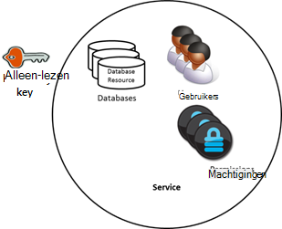
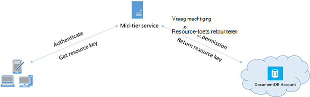

<properties 
    pageTitle="Meer informatie over het beveiligen van toegang tot gegevens in DocumentDB | Microsoft Azure" 
    description="Meer informatie over access besturingselement concepten in DocumentDB, inclusief outmodel toetsen, alleen-lezen sleutels, gebruikers en machtigingen." 
    services="documentdb" 
    authors="kiratp" 
    manager="jhubbard" 
    editor="monicar" 
    documentationCenter=""/>

<tags 
    ms.service="documentdb" 
    ms.workload="data-services" 
    ms.tgt_pltfrm="na" 
    ms.devlang="na" 
    ms.topic="article" 
    ms.date="09/19/2016" 
    ms.author="kipandya"/>

# Toegang tot DocumentDB gegevens beveiligen

Dit artikel bevat een overzicht van de toegang tot gegevens die zijn opgeslagen in [Microsoft Azure DocumentDB](https://azure.microsoft.com/services/documentdb/)beveiligen.

Lees dit overzicht en kunt u wel de volgende vragen beantwoorden:  

-   Wat zijn DocumentDB outmodel toetsen?
-   Wat zijn de alleen-lezen sleutels DocumentDB?
-   Wat zijn DocumentDB resource tokens?
-   Hoe kan ik DocumentDB gebruikers en machtigingen voor het beveiligen van toegang tot DocumentDB gegevens gebruiken?

## DocumentDB access besturingselement concepten

DocumentDB bevat eerste-klas concepten om te kunnen de toegang tot DocumentDB bronnen beheren.  DocumentDB resources zijn voor de toepassing van dit onderwerp worden gegroepeerd in twee categorieën:

- Administratieve resources
    - Account
    - Database
    - Gebruiker
    - Machtiging
- Toepassing resources
    - Siteverzameling
    - Aanbieding
    - Document
    - Bijlage
    - Opgeslagen procedure
    - Trigger
    - De gebruiker gedefinieerde functie

In de context van deze twee categorieën, DocumentDB ondersteunt drie typen access besturingselement personas: beheerder, alleen-lezen-beheerder en databasegebruiker-account.  De rechten voor elke access besturingselement persona zijn:
 
- Accountbeheerder: volledige toegang tot alle bronnen (administratieve en toepassingen) binnen een bepaald DocumentDB-account.
- Alleen-lezen-beheerder: alleen-lezen toegang tot alle bronnen (administratieve en toepassing binnen een bepaald DocumentDB-account. 
- Databasegebruiker: het DocumentDB gebruiker een resource die is gekoppeld aan een specifieke reeks DocumentDB database resources (bijvoorbeeld verzamelingen, documenten, scripts).  Er kan een of meer Gebruikersresources die zijn gekoppeld aan een bepaalde database, en elke resource gebruiker wellicht een of meer machtigingen die zijn gekoppeld.

Met de bovengenoemde categorieën en bronnen in gedachten definieert het model voor toegangsbeheer DocumentDB drie soorten access constructies:

- Basispagina sleutels: bij het maken van een account DocumentDB twee outmodel sleutels (primaire en secundaire) worden gemaakt.  Deze toetsen u volledige administratieve toegang tot alle bronnen binnen het DocumentDB-account.

- Alleen-lezen sleutels: bij het maken van een account DocumentDB twee alleen-lezen sleutels (primaire en secundaire) worden gemaakt.  Deze toetsen u alleen-lezen toegang tot alle bronnen binnen het DocumentDB-account.

- Resource-tokens: een token resource is gekoppeld aan een resource van de machtiging DocumentDB en vastleggen van de relatie tussen de gebruiker van een database en moet de machtiging die gebruiker heeft voor een specifieke bron DocumentDB-toepassing (bijvoorbeeld siteverzameling, document).

## Werken met DocumentDB modelweergave en alleen-lezen-toetsen

Zoals eerder is vermeld, bieden DocumentDB outmodel toetsen volledige beheerderstoegang tot alle bronnen binnen een DocumentDB-account, terwijl de alleen-lezen sleutels leestoegang voor alle bronnen binnen het account inschakelen.  Het volgende codefragment ziet u hoe u met een DocumentDB account eindpunt en een basispagina sleutel exemplaar maken van een DocumentClient en een nieuwe database maken. 

    //Read the DocumentDB endpointUrl and authorization keys from config.
    //These values are available from the Azure Classic Portal on the DocumentDB Account Blade under "Keys".
    //NB > Keep these values in a safe and secure location. Together they provide Administrative access to your DocDB account.
    
    private static readonly string endpointUrl = ConfigurationManager.AppSettings["EndPointUrl"];
    private static readonly SecureString authorizationKey = ToSecureString(ConfigurationManager.AppSettings["AuthorizationKey"]);
        
    client = new DocumentClient(new Uri(endpointUrl), authorizationKey);
    
    // Create Database
    Database database = await client.CreateDatabaseAsync(
        new Database
        {
            Id = databaseName
        });

## Overzicht van DocumentDB resource tokens

U kunt een token resource (door het maken van DocumentDB gebruikers en machtigingen) wanneer u toegang wilt verlenen aan resources in uw account DocumentDB aan een client die niet kan vertrouwd met de toets basispagina worden. Uw DocumentDB outmodel sleutels zijn zowel primaire en secundaire toets heeft, die elk beheerderstoegang tot uw account en alle bronnen in deze worden toegewezen. Een van de toetsen van uw model weergeeft, wordt uw account met de mogelijkheid van schadelijke of uit nalatigheid gebruik geopend. 

Ook DocumentDB alleen-lezen sleutels alleen toegang bieden tot alle resources - behalve de machtiging resources, uiteraard - binnen een DocumentDB-account en kunnen niet worden gebruikt voor meer gedetailleerde toegang tot specifieke DocumentDB resources.

DocumentDB resource tokens bieden een veilige alternatief waarmee clients kunnen lezen, schrijven en bronnen in uw account DocumentDB op basis van de machtigingen die u hebt verleend en zonder dat u een diamodel of de lezen alleen belangrijke verwijderen.

Hier ziet u een ontwerppatroon typische waarbij tokens van de resource kunnen worden aangevraagd, gegenereerd en bezorgd bij clients:

1. Een middelgrote-service is ingesteld voor een mobiele toepassing delen van foto's van gebruikers.
2. De service middelgrote beschikt over de sleutel outmodel van het account DocumentDB.
3. De foto-app is geïnstalleerd op mobiele apparaten van eindgebruiker. 
4. Klik op aanmelden, de app foto tot stand brengt de identiteit van de gebruiker met de middelgrote-service. Deze methode van identiteit inrichting is zuiver snel aan de toepassing.
5. Wanneer de identiteit is gemaakt, vraagt de service middelgrote machtigingen op basis van de identiteit.
6. De service middelgrote stuurt een token resource terug naar de telefoon-app.
7. De app phone kunt blijven gebruiken van de resource token rechtstreeks toegang krijgen tot DocumentDB resources met de machtigingen die zijn gedefinieerd door de resource token en voor het interval dat is toegestaan door de resource token. 
8. Als het token resource verloopt, is het volgende aanvragen ontvangt een 401 onbevoegde uitzondering.  Op dit moment het telefoon-app opnieuw tot stand brengt de identiteit en om een nieuwe resource token vraagt.

## Werken met DocumentDB gebruikers en machtigingen
Een gebruiker DocumentDB resource is gekoppeld aan een database DocumentDB.  Elke database kan nul of meer DocumentDB gebruikers bevatten.  Het volgende codefragment ziet u hoe u een bron van de gebruiker DocumentDB maken.

    //Create a user.
    User docUser = new User
    {
        Id = "mobileuser"
    };

    docUser = await client.CreateUserAsync(UriFactory.CreateDatabaseUri("db"), docUser);

> [AZURE.NOTE] Elke gebruiker DocumentDB heeft een PermissionsLink-eigenschap die kan worden gebruikt voor het ophalen van de lijst met machtigingen die zijn gekoppeld aan de gebruiker.

Een DocumentDB machtiging resource is gekoppeld aan een gebruiker DocumentDB.  Elke gebruiker kan nul of meer DocumentDB machtigingen bevatten.  Een resource machtiging biedt toegang tot een beveiligingstoken dat de gebruiker moet wanneer u probeert te krijgen tot een specifieke toepassingsbron.
Er zijn twee beschikbare toegangsniveaus die door een resource machtiging worden gegeven:

- Alle: De gebruiker volledig machtiging heeft voor de resource
- Lezen: De gebruiker de inhoud van de resource kan alleen worden gelezen, maar niet kan worden uitgevoerd schrijven, bijwerken of verwijderbewerkingen in de resource.

> [AZURE.NOTE] Om te kunnen uitvoeren DocumentDB opgeslagen procedures die de gebruiker moet de machtiging All hebben op de verzameling waarin u de opgeslagen procedure wordt uitgevoerd.

Het volgende codefragment ziet u hoe u een resource machtiging maakt, het token resource van de resource machtiging lezen en de machtigingen koppelen aan de gebruiker die hierboven hebt gemaakt.

    // Create a permission.
    Permission docPermission = new Permission
    {
        PermissionMode = PermissionMode.Read,
        ResourceLink = documentCollection.SelfLink,
        Id = "readperm"
    };
            
  docPermission = afwachting van de client. CreatePermissionAsync (UriFactory.CreateUserUri ("db", "gebruiker"), docPermission); Console.WriteLine (docPermission.Id + "heeft token van:" + docPermission.Token);
  
Als u een partitiesleutel voor uw siteverzameling en klik vervolgens de machtiging voor siteverzameling hebt opgegeven, is document en bijlage resources omvat tevens de ResourcePartitionKey naast de ResourceLink.

Om te kunnen eenvoudig verkrijgen alle machtiging resources die zijn gekoppeld aan een bepaalde gebruiker, feed beschikking DocumentDB stelt een machtiging voor elke gebruikersobject.  Het volgende codefragment ziet hoe u de machtiging die is gekoppeld aan de gebruiker gemaakt boven ophalen, maken van een lijst met machtigingen en exemplaar te maken van een nieuwe DocumentClient namens de gebruiker.

    //Read a permission feed.
    FeedResponse<Permission> permFeed = await client.ReadPermissionFeedAsync(
      UriFactory.CreateUserUri("db", "myUser"));

    List<Permission> permList = new List<Permission>();
      
    foreach (Permission perm in permFeed)
    {
        permList.Add(perm);
    }
            
    DocumentClient userClient = new DocumentClient(new Uri(endpointUrl), permList);

> [AZURE.TIP] Resource-tokens hebben een geldige tijdspanne standaard 1 uur.  Levensduur van tokens, echter mogelijk worden expliciet is opgegeven, tot maximaal vijf uur aan.

## Volgende stappen

- Meer informatie over DocumentDB, klikt u op [hier](http://azure.com/docdb).
- Voor meer informatie over het beheren van toetsen basispagina en alleen-lezen, klikt u op [hier](documentdb-manage-account.md).
- Als u wilt weten hoe u DocumentDB autorisatie tokens maken, klikt u op [hier](https://msdn.microsoft.com/library/azure/dn783368.aspx)
 
