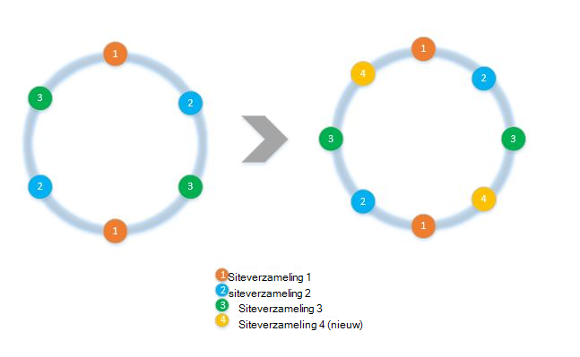
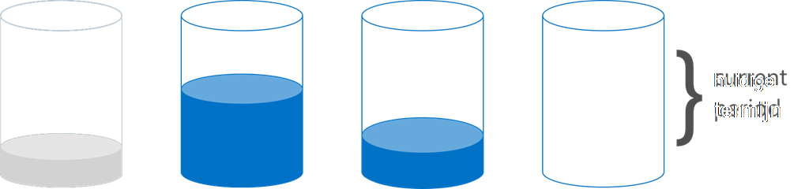

<properties 
    pageTitle="Het implementeren van client kant partitioneren met de SDK's | Microsoft Azure" 
    description="Informatie over het gebruik van de Azure DocumentDB SDK's op partition (shard) gegevens en route aanvragen in meerdere siteverzamelingen" 
    services="documentdb" 
    authors="arramac" 
    manager="jhubbard" 
    editor="cgronlun" 
    documentationCenter=""/>

<tags 
    ms.service="documentdb" 
    ms.workload="data-services" 
    ms.tgt_pltfrm="na" 
    ms.devlang="na" 
    ms.topic="article" 
    ms.date="10/27/2016" 
    ms.author="arramac"/>

# <a name="how-to-partition-data-using-client-side-support-in-documentdb"></a>Gegevens met behulp van client-ondersteuning in DocumentDB partitioneren

Azure DocumentDB ondersteunt [Automatische partitioneren van siteverzamelingen](documentdb-partition-data.md). Er zijn echter gebruik zaken waar is het nuttig om fijn korrelig controle over het gedrag partitioneren hebt. Om te verkleinen de standaardcontracttekst kunt code vereist voor het partitioneren van taken, hebben we functionaliteit toegevoegd in het .NET, Node.js en Java-SDK's waardoor het eenvoudiger toepassingen maken die af zijn schaal in meerdere siteverzamelingen.

In dit artikel wordt we kost, bekijkt de klassen en interfaces in de .NET SDK en hoe u ze kunt gebruiken voor het ontwikkelen van gepartitioneerde toepassingen. Andere SDK's zoals Java, Node.js en Python ondersteuning vergelijkbare methoden en -interfaces voor het aan de clientzijde partitioneren.

## <a name="client-side-partitioning-with-the-documentdb-sdk"></a>Aan de clientzijde partitioneren met de SDK DocumentDB

Voordat we achtergrondinformatie over partitioneren, moet u laten we eens enkele DocumentDB basisbegrippen die betrekking op partitioneren hebben samenvatting. Elke DocumentDB Azure-database-account bestaat uit een reeks-databases, elk met meerdere siteverzamelingen, die elk opgeslagen procedures, triggers UDF's, documenten en gerelateerde bijlagen kan bevatten. Verzamelingen kunnen worden één partition of gepartitioneerde zichzelf en de volgende eigenschappen hebben:

- Verzamelingen bieden prestaties moeten worden geïsoleerd. Er is dus een voordeel prestaties in vergelijkbare documenten binnen de verzameling dezelfde sorteervolgorde. Bijvoorbeeld time reeksgegevens, u mogelijk wilt plaatsen van gegevens voor de laatste maand, die vaak, binnen een verzameling met sneller ingerichte worden verwerkt doorzocht is dat oudere gegevens binnen collecties met lage ingerichte doorvoersnelheid is geplaatst.
- ZURE transacties dat wil zeggen opgeslagen procedures en triggers niet meerdere omvatten een siteverzameling. Transacties zijn beperkt binnen een enkel partition sleutelwaarde binnen een verzameling.
- Verzamelingen afdwingen niet een schema, zodat ze kunnen worden gebruikt voor JSON documenten van het hetzelfde type of verschillende typen.

Beginnen met versie [1.5.x van de Azure DocumentDB SDK's](documentdb-sdk-dotnet.md), kunt u document-bewerkingen rechtstreeks op een database uitvoeren. De [DocumentClient](https://msdn.microsoft.com/library/azure/microsoft.azure.documents.client.documentclient.aspx) gebruikt intern de PartitionResolver die u hebt opgegeven voor de database voor het routeren aanvragen voor de desbetreffende siteverzameling.

>[AZURE.NOTE] [Aan de clientzijde partitioneren](documentdb-partition-data.md) geïntroduceerd in REST API 2015-12-16 en SDK's 1.6.0+ deprecates de aan de clientzijde partition resolvercache methode voor het geval van eenvoudige gebruiken. Aan de clientzijde partitioneren echter is flexibeler en kunt u bepalen prestaties moeten worden geïsoleerd over partition toetsen, mate van parallellisme tijdens het lezen van resultaten van meerdere partities bepalen en bereik/ruimte partitioneren methoden vergeleken met hash gebruiken.

In .NET, bijvoorbeeld is elke klasse PartitionResolver een concrete implementatie van een [IPartitionResolver](https://msdn.microsoft.com/library/azure/microsoft.azure.documents.client.ipartitionresolver.aspx) -interface met drie methoden - [GetPartitionKey](https://msdn.microsoft.com/library/azure/microsoft.azure.documents.client.ipartitionresolver.getpartitionkey.aspx), [ResolveForCreate](https://msdn.microsoft.com/library/azure/microsoft.azure.documents.client.ipartitionresolver.resolveforcreate.aspx) en [ResolveForRead](https://msdn.microsoft.com/library/azure/microsoft.azure.documents.client.ipartitionresolver.resolveforread.aspx). LINQ query's en ReadFeed iterators gebruikt u de methode ResolveForRead intern worden herhaald voor alle siteverzamelingen die overeenkomen met de toets partition voor het verzoek. Ook maakt gebruik van bewerkingen Hiermee maakt u de methode ResolveForCreate om te leiden naar de juiste partition. Er zijn geen wijzigingen die zijn vereist voor vervangen, verwijderen en lezen, aangezien ze documenten die al de verwijzing naar de bijbehorende verzameling bevatten gebruiken.

De SDK's bevat ook twee klassen die ondersteuning bieden voor de twee canonieke partities technieken, hashing en bereik lookups, via een [HashPartitionResolver](https://msdn.microsoft.com/library/azure/microsoft.azure.documents.partitioning.hashpartitionresolver.aspx) en een [RangePartitionResolver](https://msdn.microsoft.com/library/azure/mt126047.aspx). U kunt deze klassen eenvoudig partities logica toevoegen aan uw toepassing.  

## <a name="add-partitioning-logic-and-register-the-partitionresolver"></a>Partities logica toevoegen en de PartitionResolver registreren 

Hier ziet u een fragment laat zien hoe u een [HashPartitionResolver](https://msdn.microsoft.com/library/azure/microsoft.azure.documents.partitioning.hashpartitionresolver.aspx) maken en registreert met de DocumentClient voor een database.

```cs
// Create some collections to partition data.
DocumentCollection collection1 = await client.CreateDocumentCollectionAsync(...);
DocumentCollection collection2 = await client.CreateDocumentCollectionAsync(...);

// Initialize a HashPartitionResolver using the "UserId" property and the two collection self-links.
HashPartitionResolver hashResolver = new HashPartitionResolver(
    u => ((UserProfile)u).UserId, 
    new string[] { collection1.SelfLink, collection2.SelfLink });

// Register the PartitionResolver with the database.
this.client.PartitionResolvers[database.SelfLink] = hashResolver;

```

## <a name="create-documents-in-a-partition"></a>Documenten maken in een partition  

Zodra de PartitionResolver is geregistreerd, kunt u uitvoeren wordt gemaakt en rechtstreeks ten opzichte van de database-query's zoals hieronder wordt weergegeven. In dit voorbeeld wordt de SDK de PartitionResolver gebruikt extraheren van de gebruikers-id, hash deze en gebruikt u deze waarde om te leiden van de bewerking maken aan de juiste verzameling.

```cs
Document johnDocument = await this.client.CreateDocumentAsync(
    database.SelfLink, new UserProfile("J1", "@John", Region.UnitedStatesEast));
Document ryanDocument = await this.client.CreateDocumentAsync(
    database.SelfLink, new UserProfile("U4", "@Ryan", Region.AsiaPacific, UserStatus.AppearAway));
```

## <a name="create-queries-against-partitions"></a>Query's ten opzichte van de partities maken  

Met de methode [CreateDocumentQuery](https://msdn.microsoft.com/library/azure/microsoft.azure.documents.linq.documentqueryable.createdocumentquery.aspx) als doorgeven in de database en een partitiesleutel, kunt u zoeken. De query retourneert een enkel resultatenset voor alle siteverzamelingen in de database die zijn toegewezen aan de partition-toets.  

```cs
// Query for John's document by ID - uses PartitionResolver to restrict the query to the partitions 
// containing @John. Again the query uses the database self link, and relies on the hash resolver 
// to route the appropriate collection.
var query = this.client.CreateDocumentQuery<UserProfile>(
    database.SelfLink, null, partitionResolver.GetPartitionKey(johnProfile))
    .Where(u => u.UserName == "@John");
johnProfile = query.AsEnumerable().FirstOrDefault();
```

## <a name="create-queries-against-all-collections-in-the-database"></a>Query's op alle siteverzamelingen in de database maken 

U kunt ook alle siteverzamelingen in de database query en de resultaten zoals hieronder weergeven door het partition belangrijke argument overslaan opsommen.

```cs
// Query for all "Available" users. Here since there is no partition key, the query is serially executed 
// across each partition/collection and returns a single result-set. 
query = this.client.CreateDocumentQuery<UserProfile>(database.SelfLink)
    .Where(u => u.Status == UserStatus.Available);
foreach (UserProfile activeUser in query)
{
    Console.WriteLine(activeUser);
}
```

## <a name="hash-partition-resolver"></a>Hash Partition resolvercache
Partities zijn toegewezen op basis van de waarde van een hash-functie, zodat u kunt het gelijkmatig verdelen vergaderverzoeken en gegevens over een aantal partities met hash partitioneren. Deze methode wordt gebruikt bij het partition gegevens geproduceerd of uit een groot aantal afzonderlijke clients verbruikt en is handig voor het opslaan van gebruikersprofielen, catalogusitems en telemetriegegevens IoT ('Internet van dingen'). Hash partitioneren wordt ook gebruikt door de DocumentDB serverzijde partities ondersteuning binnen een verzameling.

**Hash partitionering:**


Een eenvoudige hash kleurenschema partitioneren over *N* verzamelingen zou zijn om te maken van een document, *hash(d) mod N* om te bepalen welke siteverzameling die is opgeslagen op berekenen. Maar een probleem met deze eenvoudige techniek is dat het werkt niet goed wanneer u nieuwe collecties toevoegen of verwijderen van siteverzamelingen, zoals hiervoor bijna alle de gegevens wilt ophalen reshuffled. [Consistente hashing] (http://citeseerx.ist.psu.edu/viewdoc/summary?doi=10.1.1.23.3738) is een bekend algoritme die dit adressen door het implementeren van een hashing-schema die de hoeveelheid gegevens verplaatsen vereist tijdens toevoegen of verwijderen van verzamelingen minimaliseert.

De klasse [HashPartitionResolver](https://msdn.microsoft.com/library/azure/microsoft.azure.documents.partitioning.hashpartitionresolver.aspx) implementeert logica voor het maken van een belsignaal consistente hash via de functie hash is opgegeven in de interface [IHashGenerator](https://msdn.microsoft.com/library/azure/microsoft.azure.documents.partitioning.ihashgenerator.aspx) . Standaard de HashPartitionResolver gebruikt een MD5 hash-functie, maar u kunt dit uit uitwisselen met uw eigen hashing-implementatie. De HashPartitionResolver intern maakt 16 hashes of "virtuele knooppunten" binnen de bellen hash voor elke siteverzameling in het oog een meer gelijkmatige verdeling van documenten in de verzamelingen, maar u kunt dit nummer voor de handel uitschakelen gegevens mate van asymmetrie met de hoeveelheid client kant berekening variëren.

**Consistente hashing met HashPartitionResolver:**


## <a name="range-partition-resolver"></a>Bereik Partition resolvercache

In het bereik partitioneren, partities toegewezen afhankelijk van of de toets partition binnen een bepaald bereik. Dit wordt vaak gebruikt voor het partitioneren met tijdstempel eigenschappen (bijvoorbeeld eventTime tussen 1 Apr 2015 en Apr 14 december 2015). De klasse [RangePartitionResolver](https://msdn.microsoft.com/library/azure/mt126047.aspx) helpt u voor het behoud van een toewijzing tussen een bereik\<T\> en siteverzameling selfservice koppelen. 

[Bereik\<T\> ](https://msdn.microsoft.com/library/azure/mt126048.aspx) is een eenvoudige klasse die worden beheerd bereiken met alle typen die IComparable implementeren\<T\> en IEquatable\<T\> zoals tekenreeksen of getallen. Voor leest en maakt, kunt u in een willekeurige bereik doorgeven en de resolvercache identificeert alle candidate collecties door te identificeren de bereiken van de partities die elkaar overlappen met het gewenste bereik. Deze functionaliteit is handig bij het uitvoeren van query's bereik tegen time reeksgegevens.

**Reeks partitioneren:**  

  

Een speciaal hoofdletters/kleine letters van het bereik partitioneren is als het bereik slechts één afzonderlijke waarde, ook wel genoemd "opzoeken partitioneren". Dit is gewoonlijk gebruikt voor het partitioneren per regio (bijvoorbeeld de partition voor Scandinavië bevat Noorwegen, Denemarken en Zweden) of voor het partitioneren van tenants in een toepassing voor meerdere tenant.

## <a name="samples"></a>Voorbeelden 

Bekijk het [DocumentDB partitioneren voorbeelden Github project](https://github.com/Azure/azure-documentdb-dotnet/tree/287acafef76ad223577759b0170c8f08adb45755/samples/code-samples/Partitioning) met codefragmenten over het gebruik van deze PartitionResolvers en uitbreiden ze willen implementeren van uw eigen resolvers aanpassen aan specifieke gebruik gevallen, als volgt uit: 

* Hoe u een willekeurige lambda-expressie opgeven voor GetPartitionKey en deze gebruiken om te implementeren samengestelde partities toetsen of verschillende typen objecten anders partitioneren.
* Het maken van een eenvoudige [LookupPartitionResolver](https://github.com/Azure/azure-documentdb-dotnet/blob/287acafef76ad223577759b0170c8f08adb45755/samples/code-samples/Partitioning/Partitioners/LookupPartitionResolver.cs) die gebruikmaakt van een handmatige opzoektabel om uit te voeren partitioneren. Dit patroon wordt meestal gebruikt voor het partitioneren op basis van afzonderlijke waarden zoals regio, de tenant-ID of de toepassing naam.
* Het maken van een [ManagedPartitionResolver](https://github.com/Azure/azure-documentdb-dotnet/blob/287acafef76ad223577759b0170c8f08adb45755/samples/code-samples/Partitioning/Partitioners/ManagedHashPartitionResolver.cs) waarmee verzamelingen automatisch op basis van een sjabloon die een schema voor naamgeving, IndexingPolicy en opgeslagen procedures die moeten worden geregistreerd ten opzichte van de nieuwe collecties definieert.
* Het maken van een kleurenschema minder [SpilloverPartitionResolver](https://github.com/Azure/azure-documentdb-dotnet/blob/287acafef76ad223577759b0170c8f08adb45755/samples/code-samples/Partitioning/Partitioners/SpilloverPartitionResolver.cs) die gewoon nieuwe siteverzamelingen worden gemaakt terwijl de oude verzamelingen opvullen.
* Hoe serialiseren en de status van uw PartitionResolver terugconverteren als JSON, zodat u tussen processen en over afsluiten delen kunt. U kunt deze in configuratiebestanden of zelfs in een verzameling DocumentDB behouden.
* Een klasse [DocumentClientHashPartitioningManager](https://github.com/Azure/azure-documentdb-dotnet/blob/287acafef76ad223577759b0170c8f08adb45755/samples/code-samples/Partitioning/Util/DocumentClientHashPartitioningManager.cs) voor dynamisch toevoegen en verwijderen van de partities die u wilt een database partitioneren gebaseerd op consistente hashing. Intern wordt gebruikt een [TransitionHashPartitionResolver](https://github.com/Azure/azure-documentdb-dotnet/blob/287acafef76ad223577759b0170c8f08adb45755/samples/code-samples/Partitioning/Partitioners/TransitionHashPartitionResolver.cs) naar route gelezen en geschreven tijdens de migratie met een van de vier modi - lezen uit het oude partities schema (ReadCurrent), de nieuwe sectie (ReadNext), samenvoegen resultaten van beide (ReadBoth) of niet beschikbaar tijdens de migratie (geen).

In de voorbeelden zijn bron openen en is het raadzaam om in te dienen halen aanvragen met bijdragen aan goede doelen die andere ontwikkelaars DocumentDB kunnen profiteren. Raadpleeg de [bijdrage richtlijnen](https://github.com/Azure/azure-documentdb-net/blob/master/Contributing.md) voor instructies over het bijdragen.  

>[AZURE.NOTE] Hiermee maakt u siteverzameling zijn rente-beperkt door DocumentDB, zodat u enkele van de steekproef methoden Hier wordt getoond kan een paar minuten duren.

##<a name="faq"></a>FAQ
**DocumentDB ondersteunt servers partitioneren?**

Ja, ondersteunt DocumentDB [servers partitioneren](documentdb-partition-data.md). DocumentDB ondersteunt ook aan de clientzijde partitioneren via aan de clientzijde partition resolvers voor geavanceerdere gebruik gevallen.

**Wanneer moet ik serverzijde versus aan de clientzijde partitioneren gebruiken?**
Voor de meeste gevallen gebruiken, wordt aangeraden het gebruik van de serverzijde partitioneren sinds het de beheertaken van partitioneren van gegevens en routering van aanvragen verwerkt. Als u nodig hebt bereik partitioneren of een gespecialiseerde use-case voor prestaties moeten worden geïsoleerd tussen verschillende waarden van partitiesleutels hebben, klikt u vervolgens aan de clientzijde partitioneren mogelijk wel de beste manier.

**Hoe ik toevoegen of verwijderen van een siteverzameling naar Mijn partities kleurenschema?**

Kijk op de implementatie van DocumentClientHashPartitioningManager in het project voorbeelden voor een voorbeeld van hoe u opnieuw partitioneren implementeren kunt.

**Hoe persistent of ik mijn configuratie delen met andere clients?**

U kunt de partitioner staat als JSON serialiseren en opslaan in de van configuratiebestanden of zelfs in DocumentDB verzamelingen. Bekijk de methode RunSerializeDeserializeSample in het project voorbeelden voor een voorbeeld.

**Hoe ik partities bladwijzers koppelen?**

U kunt PartitionResolvers koppelen door het implementeren van uw eigen IPartitionResolver die een of meer bestaande resolvers intern gebruikt. Bekijk een TransitionHashPartitionResolver in het project voorbeelden voor een voorbeeld.

##<a name="references"></a>Verwijzingen
* [Servers partitioneren in DocumentDB](documentdb-partition-data.md)
* [DocumentDB verzamelingen en prestaties](documentdb-performance-levels.md)
* [Voorbeelden van de code op Github partitioneren](https://github.com/Azure/azure-documentdb-dotnet/tree/287acafef76ad223577759b0170c8f08adb45755/samples/code-samples/Partitioning)
* [DocumentDB .NET SDK documentatie op MSDN](https://msdn.microsoft.com/library/azure/dn948556.aspx)
* [Voorbeelden van DocumentDB .NET](https://github.com/Azure/azure-documentdb-net)
* [DocumentDB limieten](documentdb-limits.md)
* [DocumentDB Blog op Tips voor betere prestaties](https://azure.microsoft.com/blog/2015/01/20/performance-tips-for-azure-documentdb-part-1-2/)
 
