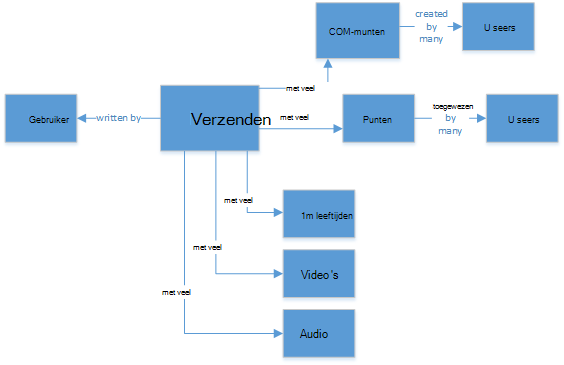
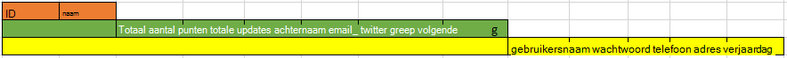
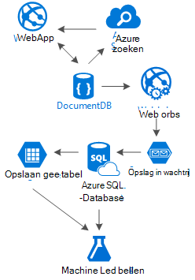

<properties 
    pageTitle="DocumentDB ontwerppatroon: sociale media apps | Microsoft Azure" 
    description="Informatie over een ontwerppatroon voor sociale netwerken door gebruikmaken van de flexibiliteit opslag van DocumentDB en andere Azure services." 
    keywords="sociale media-apps"
    services="documentdb" 
    authors="ealsur" 
    manager="jhubbard" 
    editor="" 
    documentationCenter=""/>

<tags 
    ms.service="documentdb" 
    ms.workload="data-services" 
    ms.tgt_pltfrm="na" 
    ms.devlang="na" 
    ms.topic="article" 
    ms.date="09/27/2016" 
    ms.author="mimig"/>

# Sociale met DocumentDB gaan

Dat in een society massively onderling verbonden betekent dat op een gegeven moment in leven, u deel uitmaakt van een **sociaal netwerk**geworden. We sociale netwerken gebruiken om te houden met vrienden, collega's, familie of soms onze passie delen met personen met gemeenschappelijke interesses.

Als engineers of ontwikkelaars, wordt mogelijk hebt afgevraagd hoe deze netwerken opslaan en verbinding van onze gegevens, of mogelijk hebben zelfs de taak gekregen wilt maken of een nieuw sociale netwerk voor een specifieke specialistische markt uzelf ontwerpen. Als de grote vraag ontstaat: hoe worden al deze gegevens opgeslagen?

Stel dat we een nieuwe en glanzend sociaal netwerk maakt, waar gebruikers artikelen met gerelateerde media zoals afbeeldingen, video's of zelfs muziek kunnen posten. Gebruikers kunnen becommentariëren berichten en punten geven voor classificaties. Er is een feed van berichten die gebruikers zien en kunnen werken met op de website van de belangrijkste aantekening toevoegen. Dit niet echt complexe geluid (bij de eerste), maar omdat dit eenvoudiger, laten we dat er (we aangepaste feeds beïnvloed door relaties kan dieper, maar deze groter is dan het doel van dit artikel).

Zo is, hoe kan we dit opslaan en waar?

Veel van u ervaring hebben op SQL-databases of hebt u ten minste begrip van [relationele gegevens modeling](https://en.wikipedia.org/wiki/Relational_model) kunnen ontstaan en wilt u misschien geneigd om te beginnen met het tekenen van ongeveer zo uitziet:

 

Een perfect genormaliseerde en mooie gegevensstructuur... die niet schaal. 

Niet, krijgt u mij gegaan, ik heb gewerkt om alle mijn leven met SQL-databases, ze zijn zeer geschikt, maar zoals elke platform patroon, oefenen en software, het is niet perfect voor elke scenario.

Waarom SQL is niet om de beste keuze in dit scenario? Bekijk de structuur van een enkel bericht als ik wil dat bericht weergeven in een website of toepassing, dat ik zou u hoeft te doen een query met... 8 tabel joins (!) just om weer te geven van één enkel-bericht nu afbeelding een reeks berichten die dynamisch laden en worden weergegeven op het scherm en u ziet mogelijk waar ik ga.

We kan een Giga SQL-exemplaar uiteraard kunt gebruiken met voldoende voor het oplossen van query's met deze veel joins moet fungeren onze inhoud, maar behoorlijk, zou Waarom doen we wanneer er bestaat een eenvoudiger oplossing duizenden?

## De weg NoSQL

Er zijn speciale graph-databases die [worden uitgevoerd op Azure kunnen](http://neo4j.com/developer/guide-cloud-deployment/#_windows_azure) , maar ze zijn niet goedkoop en hoeft IaaS services (infrastructuur-als-een-Service, virtuele Machines voornamelijk) en onderhoud. Ik ga naar dit artikel bij een lagere kosten-oplossing die geschikt is voor de meeste scenario's van Azure NoSQL database [DocumentDB](https://azure.microsoft.com/services/documentdb/)waarop gericht. Een [NoSQL](https://en.wikipedia.org/wiki/NoSQL) aanpak, gegevens opslaat in de indeling van JSON en [denormalization](https://en.wikipedia.org/wiki/Denormalization), toe te passen met worden onze eerder ingewikkeld bericht omgezet in één [Document](https://en.wikipedia.org/wiki/Document-oriented_database):

    {
        "id":"ew12-res2-234e-544f",
        "title":"post title",
        "date":"2016-01-01",
        "body":"this is an awesome post stored on NoSQL",
        "createdBy":User,
        "images":["http://myfirstimage.png","http://mysecondimage.png"],
        "videos":[
            {"url":"http://myfirstvideo.mp4", "title":"The first video"},
            {"url":"http://mysecondvideo.mp4", "title":"The second video"}
        ],
        "audios":[
            {"url":"http://myfirstaudio.mp3", "title":"The first audio"},
            {"url":"http://mysecondaudio.mp3", "title":"The second audio"}
        ]
    }

En deze kan worden verkregen met één query, en geen joins. Dit is veel meer eenvoudige en duidelijke en budget-wise, er minder bronnen om een betere resultaat te bereiken moeten.

Azure DocumentDB zorgt ervoor dat alle de eigenschappen worden geïndexeerd met de [Automatische indexeren](documentdb-indexing.md)die u kunt zelfs [aangepast worden](documentdb-indexing-policies.md). De methode schema-vrije kunt ons documenten met verschillende en dynamische structuren, wellicht morgen die we berichten in een lijst met categorieën of hashtags die zijn gekoppeld wilt opslaan, DocumentDB de nieuwe documenten met de toegevoegde kenmerken zonder extra werk dat is vereist door ons worden verwerkt.

Opmerkingen op een bericht kunnen worden behandeld als alleen andere berichten met een bovenliggende eigenschap (Hierdoor wordt de toewijzing van onze object vereenvoudigd). 

    {
        "id":"1234-asd3-54ts-199a",
        "title":"Awesome post!",
        "date":"2016-01-02",
        "createdBy":User2,
        "parent":"ew12-res2-234e-544f"
    }

    {
        "id":"asd2-fee4-23gc-jh67",
        "title":"Ditto!",
        "date":"2016-01-03",
        "createdBy":User3,
        "parent":"ew12-res2-234e-544f"
    }

En alle sociale interacties kunnen worden opgeslagen in een afzonderlijk object als items:

    {
        "id":"dfe3-thf5-232s-dse4",
        "post":"ew12-res2-234e-544f",
        "comments":2,
        "likes":10,
        "points":200
    }

Maken van feeds is alleen een kwestie van het maken van documenten die een lijst met bericht-id's met een bepaalde relevantie volgorde kunnen bevatten:

    [
        {"relevance":9, "post":"ew12-res2-234e-544f"},
        {"relevance":8, "post":"fer7-mnb6-fgh9-2344"},
        {"relevance":7, "post":"w34r-qeg6-ref6-8565"}
    ]

Kan er een "meest recente" stream met berichten gesorteerd op aanmaakdatum, "gegevensbeheer" stream deze berichten met meer leuk in de afgelopen 24 uur en we een aangepaste stream voor elke gebruiker op basis van logica zoals Volgers en interesses zelfs kan implementeren het is nog steeds een lijst met berichten. Dit is een kwestie van het maken van deze lijsten, maar de prestaties lezen concurrerende blijft. Als we een van deze lijsten aanschaffen, we een één query verstuurt naar DocumentDB met het [IN-operator](documentdb-sql-query.md#where-clause) om pagina's van berichten op een moment verkrijgen.

De feed streams kunnen worden gemaakt met [Azure App Services](https://azure.microsoft.com/services/app-service/) achtergrondprocessen: [Webjobs](../app-service-web/web-sites-create-web-jobs.md). Nadat een bericht is gemaakt, kan achtergrondverwerking met behulp van [Azure Storage](https://azure.microsoft.com/services/storage/) [wachtrijen](../storage/storage-dotnet-how-to-use-queues.md) en Webjobs geactiveerd met behulp van de [Azure Webjobs SDK](../app-service-web/websites-dotnet-webjobs-sdk.md), uitvoering van de bericht-doorgifte binnen stromen op basis van onze eigen aangepaste logica worden geactiveerd. 

Punten en vind ik leuks via een bericht kunnen worden verwerkt, met een uitgestelde en deze dezelfde methode gebruiken om een uiteindelijk consistente omgeving te maken.

Volgers zijn lastiger. DocumentDB heeft de bestandslimiet van een document van 512Kb, zodat u mogelijk nadenken Volgers opslaan als een document met deze structuur:

    {
        "id":"234d-sd23-rrf2-552d",
        "followersOf": "dse4-qwe2-ert4-aad2",
        "followers":[
            "ewr5-232d-tyrg-iuo2",
            "qejh-2345-sdf1-ytg5",
            //...
            "uie0-4tyg-3456-rwjh"
        ]
    }

Dit werkt mogelijk voor een gebruiker met een paar duizendtallen Volgers, maar als sommige beroemdheden onze classificeert, deze methode wordt uiteindelijk verbindt raken de initiaal van de grootte van document.

Om dit op te lossen, kunnen we een gemengde aanpak gebruiken. Als onderdeel van het document gebruikersstatistieken kunt we het aantal Volgers opslaan:

    {
        "id":"234d-sd23-rrf2-552d",
        "user": "dse4-qwe2-ert4-aad2",
        "followers":55230,
        "totalPosts":452,
        "totalPoints":11342
    }

En de werkelijke grafiek van Volgers kan worden opgeslagen op Azure opslag tabellen met een andere [extensie](https://github.com/richorama/AzureStorageExtensions#azuregraphstore) waarmee voor eenvoudige "A-volgt-B" opslaan en ophalen. Deze manier kunt we het proces voor het ophalen van de exacte Volgers lijst (als we deze nodig hebt) tot Azure opslag tabellen, maar voor het opzoeken van een snelle getallen delegeren, blijven we DocumentDB gebruiken.

## Het "Ladder" patroon en gegevens dupliceren

Als u in het document JSON dat verwijst naar een bericht opgevallen mogelijk, zijn er meerdere exemplaren van een gebruiker. En u zou hebben raden rechts, dat dit betekent dat de gegevens die een gebruiker, gegeven van deze denormalization, vertegenwoordigt die mogelijk aanwezig zijn in meer dan één locatie.

Als u wilt toestaan voor snellere query's, maken wij dubbele gegevens. Het probleem met deze kant-effect is dat als door een bepaalde wijzigingen aan de gegevens van een gebruiker, moeten we zoeken van alle activiteiten hij ooit hebt en deze allemaal bijwerken. Geluid zeer handige, op rechts niet?

Graph databases los deze op hun eigen manier, gaan we dit oplossen door het identificeren van de sleutel kenmerken van een gebruiker die we in de toepassing voor elke activiteit weergeven. Als wij visueel weergeven van een bericht in de toepassing en alleen degene die de naam en afbeelding weergeven, waarom u alle gegevens van de gebruiker opgeslagen in het kenmerk 'createdBy'? Als voor elke opmerking we zojuist afbeelding wordt weergegeven van de gebruiker, moeten we niet echt de rest van de gegevens zijn. Dit is waar iets dat ik het patroon"Ladder" bellen komt in beeld.

Eens gebruikersgegevens als voorbeeld:

    {
        "id":"dse4-qwe2-ert4-aad2",
        "name":"John",
        "surname":"Doe",
        "address":"742 Evergreen Terrace",
        "birthday":"1983-05-07",
        "email":"john@doe.com",
        "twitterHandle":"@john",
        "username":"johndoe",
        "password":"some_encrypted_phrase",
        "totalPoints":100,
        "totalPosts":24
    }
    
Door te kijken deze informatie, kunnen we snel die cruciale informatie en die niet, waardoor een "Ladder" detecteren:

De kleinste stap heet een UserChunk, de minimale stuk informatie die een gebruiker aangeeft en deze worden gebruikt voor het kopiëren van gegevens. De grootte van de gedupliceerde gegevens beperken tot alleen de informatie die we 'weergeven wordt', beperken we de mogelijkheid van enorme updates.

De middelste stap wordt de gebruiker genoemd, kunt u de volledige gegevens die worden gebruikt op de meeste prestaties taalafhankelijk-query's op DocumentDB, de meest gebruikte en kritieke. Het bevat de informatie die wordt voorgesteld door een UserChunk.

De grootste is de gebruiker uitgebreid. Het bevat de kritieke gebruikersgegevens plus andere gegevens die niet echt noodzakelijk is om te worden gelezen snel of gebruik de uiteindelijke (zoals de aanmelding) is. Deze gegevens kan worden opgeslagen buiten DocumentDB, in Azure SQL-Database of Azure opslag tabellen.

Waarom zou doen we splitsen van de gebruiker en zelfs opslaan van deze gegevens op verschillende plaatsen? Omdat de opslagruimte in DocumentDB is [niet oneindig](documentdb-limits.md) en van een prestaties wijst u weergave, het groter te maken van de documenten, het costlier de query's. Documenten dun, met de juiste informatie beschikt om al uw prestaties taalafhankelijk-query voor uw sociale netwerk op, voer en de andere extra informatie voor eventuele scenario's zoals volledig profiel bewerkingen, aanmeldingen opslaan, datamining voor gebruiksanalyses en Big Data initiatieven, zelfs te houden. We echt niet van belang als de gegevens verzamelen voor datamining langzamer afspelen omdat deze wordt uitgevoerd op Azure SQL-Database, we hebben betrekking hebben op maar dat onze gebruikers een snelle en dunne ervaring hebben. Een gebruiker, die is opgeslagen op DocumentDB, er als volgt uit:

    {
        "id":"dse4-qwe2-ert4-aad2",
        "name":"John",
        "surname":"Doe",
        "username":"johndoe"
        "email":"john@doe.com",
        "twitterHandle":"@john"
    }

En een bericht eruit als:

    {
        "id":"1234-asd3-54ts-199a",
        "title":"Awesome post!",
        "date":"2016-01-02",
        "createdBy":{
            "id":"dse4-qwe2-ert4-aad2",
            "username":"johndoe"
        }
    }

En wanneer een bewerken zich waar een van de kenmerken van het segment wordt beïnvloed voordoet, is het gemakkelijk te vinden van de desbetreffende documenten met behulp van query's die naar de geïndexeerde kenmerken verwijzen (Selecteer * FROM berichten p waar p.createdBy.id == "edited_user_id") en vervolgens de stukken bij te werken.

## Het zoekvak

Gebruikers wordt gegenereerd, gelukkig veel inhoud. We moet kunnen bieden de mogelijkheid om te zoeken en inhoud zoeken die inhoud mogelijk niet rechtstreeks in hun inhoud stromen, wellicht omdat we niet u de makers volgt en wellicht we zojuist probeert te zoeken dat oude bericht we hebben gedaan 6 maanden geleden.

Gelukkig, en omdat we Azure DocumentDB gebruikt, we kunt op eenvoudige wijze een zoekmachine met [Azure zoeken](https://azure.microsoft.com/services/search/) in een paar minuten en zonder het typen van één regel met code (andere dan duidelijk, de zoeken-proces en UI).

Waarom is dit zo eenvoudig?

Azure zoeken implementeert wat ze bellen [indexeerfuncties](https://msdn.microsoft.com/library/azure/dn946891.aspx), achtergrondprocessen die in uw gegevens opslagplaatsen koppelen en automagically toevoegen, bijwerken of verwijderen van uw objecten in de indexen. Ze ondersteunen een [Azure SQL Database-indexeerfuncties](https://blogs.msdn.microsoft.com/kaevans/2015/03/06/indexing-azure-sql-database-with-azure-search/), [Azure BLOB's indexeerfuncties](../search/search-howto-indexing-azure-blob-storage.md) en gelukkig [Azure DocumentDB indexeerfuncties](../documentdb/documentdb-search-indexer.md). De overgang van gegevens uit DocumentDB Azure zoeken eenvoudig is, als beide winkelgegevens in de indeling van JSON, net moeten we [onze Index maken](../search/search-create-index-portal.md) en map welke kenmerken van onze documenten die we horen geïndexeerde en dat is het, in een kwestie van minuten (afhangt van de grootte van onze gegevens), alle onze inhoud moet worden gezocht na, door de beste oplossing zoeken-als-een-Service in de cloudinfrastructuur beschikbaar zijn. 

U kunt de [Hitchhiker de handleiding voor het zoeken](https://blogs.msdn.microsoft.com/mvpawardprogram/2016/02/02/a-hitchhikers-guide-to-search/)bezoeken voor meer informatie over het zoeken van Azure.

## De onderliggende kennis

Na het opslaan van alle inhoud die in omvang groeit en wordt elke dag, kunnen we onszelf denkt vinden: wat kan ik doen met deze stroom van gegevens van mijn gebruikers?

Het antwoord eenvoudig is: plaatsen om te werken om te zien uit.

Maar wat kunnen we leren? Een paar eenvoudige voorbeelden hiervan zijn [sentiment analyse](https://en.wikipedia.org/wiki/Sentiment_analysis), inhoud aanbevelingen op basis van gebruikersvoorkeuren of zelfs een geautomatiseerde inhoud toezichthouder die zorgt ervoor dat alle inhoud wordt gepubliceerd door onze sociale netwerk voor het gezin veilig is.

Nu dat ik u aangesloten hebt, hebt u waarschijnlijk moet u enkele PhD in wiskundige wetenschappelijke om deze patronen en informatie afmelden bij eenvoudige databases en bestanden te halen, maar u wordt verkeerde beschouwen.

[Azure Machine Learning](https://azure.microsoft.com/services/machine-learning/), onderdeel van de [Cortana Intelligence Suite](https://www.microsoft.com/en/server-cloud/cortana-analytics-suite/overview.aspx), is het een volledig beheerde cloudservice waarmee u werkstromen algoritmen gebruiken in een eenvoudige slepen en neerzetten-interface maken code van uw eigen algoritmen in [R](https://en.wikipedia.org/wiki/R_(programming_language)) of enkele van de al gemaakt en klaar voor gebruik API's zoals gebruiken: [Tekst analyses](https://gallery.cortanaanalytics.com/MachineLearningAPI/Text-Analytics-2), [Inhoud moderators](https://www.microsoft.com/moderator) of [aanbevelingen](https://gallery.cortanaanalytics.com/MachineLearningAPI/Recommendations-2).

Als u wilt bereiken een van deze Machine Learning-scenario's, kunnen we [Azure gegevens Lake](https://azure.microsoft.com/services/data-lake-store/) gebruiken om op te nemen van de gegevens uit verschillende bronnen, en [U-SQL](https://azure.microsoft.com/documentation/videos/data-lake-u-sql-query-execution/) gebruiken om de gegevens en te genereren van een uitvoer dat kan worden verwerkt door Azure Machine Learning.

Er is een andere beschikbare optie [Microsoft cognitieve Services](https://www.microsoft.com/cognitive-services) gebruiken om te analyseren van onze gebruikers inhoud; niet alleen kunnen we begrijpen ze beter (via het analyseren van wat ze schrijven met [Tekst Analytics-API](https://www.microsoft.com/cognitive-services/en-us/text-analytics-api)), maar we ook kan detecteren ongewenste of volwaardige inhoud en overeenkomstig kunnen handelen met [Computer Vision API](https://www.microsoft.com/cognitive-services/en-us/computer-vision-api). Cognitieve Services bevatten een groot aantal out-van-het-box-oplossingen die niet is vereist voor elk type Machine Learning kennis wilt gebruiken.

## Sluiten

In dit artikel wil verderhelpen in de alternatieven sociale netwerken volledig op Azure maken met lage kosten services weergegeven en prachtige resultaten door moedigen van het gebruik van een oplossing en gegevens verdeling van meerlagige opslag 'Ladder' genoemd.

De waarheid is dat er is geen zilver opsommingsteken voor dit type scenario's beschreven, kunt u de synergie gemaakt door een combinatie van geweldige services die kunnen we bouwen geweldige ervaringen: de snelheid en vrije Azure DocumentDB op te geven van een geweldige sociale toepassing, de intelligence achter een zoekoplossing eersteklas zoals Azure zoeken, de flexibiliteit van Azure App Services aan host niet even taal-agnostic-toepassingen, maar krachtige achtergrondprocessen en de uitgevouwen Azure-opslag en Azure SQL-Database voor opslag van grote hoeveelheden gegevens en de analytische kracht van Azure Machine Learning om knowledge en bedrijfsinformatie die kunt Geef feedback aan onze processen en help ons bij het geven van de juiste inhoud naar de juiste gebruikers te maken.

## Volgende stappen

Meer informatie over gegevensmodellering Lees het artikel [modellering gegevens in DocumentDB](documentdb-modeling-data.md) . Als u geïnteresseerd in andere gevallen gebruiken voor DocumentDB bent, raadpleegt u [veelvoorkomende DocumentDB gevallen gebruiken](documentdb-use-cases.md).

Of lees meer informatie over DocumentDB het [DocumentDB leerpad](https://azure.microsoft.com/documentation/learning-paths/documentdb/)te volgen.
