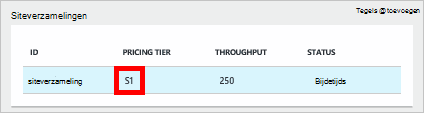
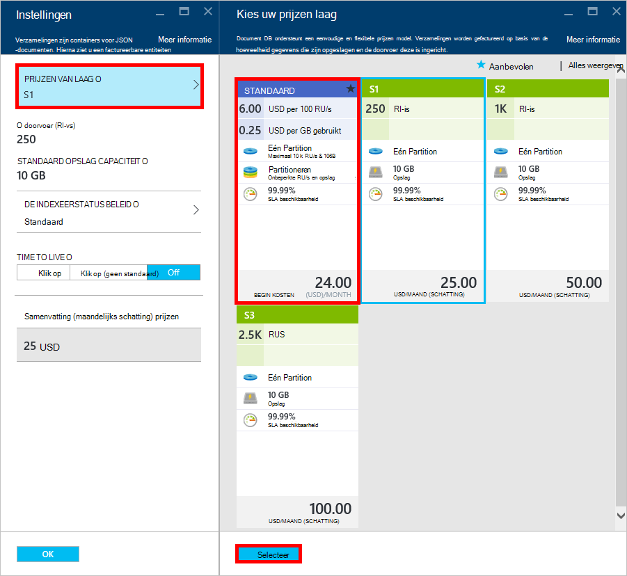
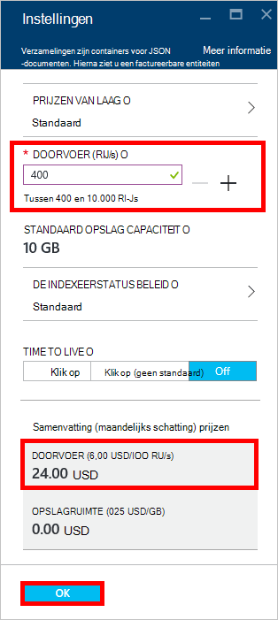
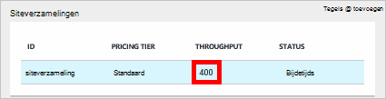

<properties 
    pageTitle="Geef uw account DocumentDB S1 boost | Microsoft Azure" 
    description="Maak gebruik van grotere gegevensdoorvoer in uw account DocumentDB S1 door enkele eenvoudige wijzigingen in de portal van Azure." 
    services="documentdb" 
    authors="mimig1" 
    manager="jhubbard" 
    editor="monicar" 
    documentationCenter=""/>

<tags 
    ms.service="documentdb" 
    ms.workload="data-services" 
    ms.tgt_pltfrm="na" 
    ms.devlang="na" 
    ms.topic="article" 
    ms.date="08/25/2016" 
    ms.author="mimig"/>

# Geef uw account DocumentDB boost

Volg deze stappen om te profiteren van grotere gegevensdoorvoer voor uw account Azure DocumentDB S1. Met weinig zonder extra kosten, kunt u de doorvoer van uw bestaande S1-account van 250 [RU/s](documentdb-request-units.md) tot 400 RU/s of meer vergroten!  

> [AZURE.VIDEO changedocumentdbcollectionperformance]

## Wijzig in prestaties door gebruiker gedefinieerd in de portal van Azure

1. Ga in uw browser naar de [**Azure-portal**](https://portal.azure.com). 
2. Klik op **Bladeren** -> **DocumentDB (NoSQL)**en selecteer het account DocumentDB om te wijzigen.   
3. In de lens voor **Databases** , selecteer de database te wijzigen en selecteer vervolgens in het blad **Database** de verzameling met de prijzen laag S1.

      

4. In het blad **collectie** , klikt u op **meer**en klik vervolgens op **Instellingen**.   
5. Klik in het blad **Instellingen** op **Laag prijzen** en de maandelijkse schatting van de kosten voor elk plan wordt weergegeven. In het blad **kiezen uw prijzen laag** , klikt u op **standaard**en klik vervolgens op **selecteren** om op te slaan uw wijziging.

      

6. Terug in het blad **Instellingen voor** de **Laag prijzen** wordt gewijzigd in **Standard** en het vak **doorvoer (RU/s)** wordt weergegeven met een standaardwaarde van 400. Klik op **OK** om uw wijzigingen op te slaan. 

    > [AZURE.NOTE] U kunt instellen dat de doorvoer tussen 400 en 10.000 [aanvragen eenheden](../articles/documentdb/documentdb-request-units.md)/second (RU/s). De **Prijzen overzicht** onder aan de pagina wordt automatisch bijgewerkt op te geven van een schatting van de maandelijkse kosten.
    
    

8. U kunt de drukvulling doorvoer van de siteverzameling controleren weer op het blad **Database** . 

    

Zie het blogbericht voor meer informatie over de wijzigingen die zijn gerelateerd aan de gebruiker gedefinieerde en vooraf gedefinieerde doorvoer, [DocumentDB: alles wat u weten moet over het gebruik van de nieuwe opties voor prijzen](https://azure.microsoft.com/blog/documentdb-use-the-new-pricing-options-on-your-existing-collections/).

## Volgende stappen

Als u constateert dat u meer doorvoer (groter dan 10.000 RU/s) of nodig meer opslagruimte (groter dan 10GB) kunt u een gepartitioneerde siteverzameling maken. Zie [een siteverzameling maken](documentdb-create-collection.md)een gepartitioneerde siteverzameling maken.