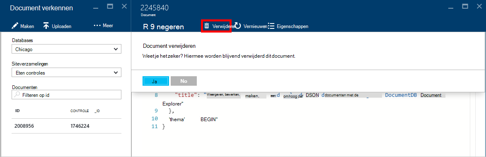
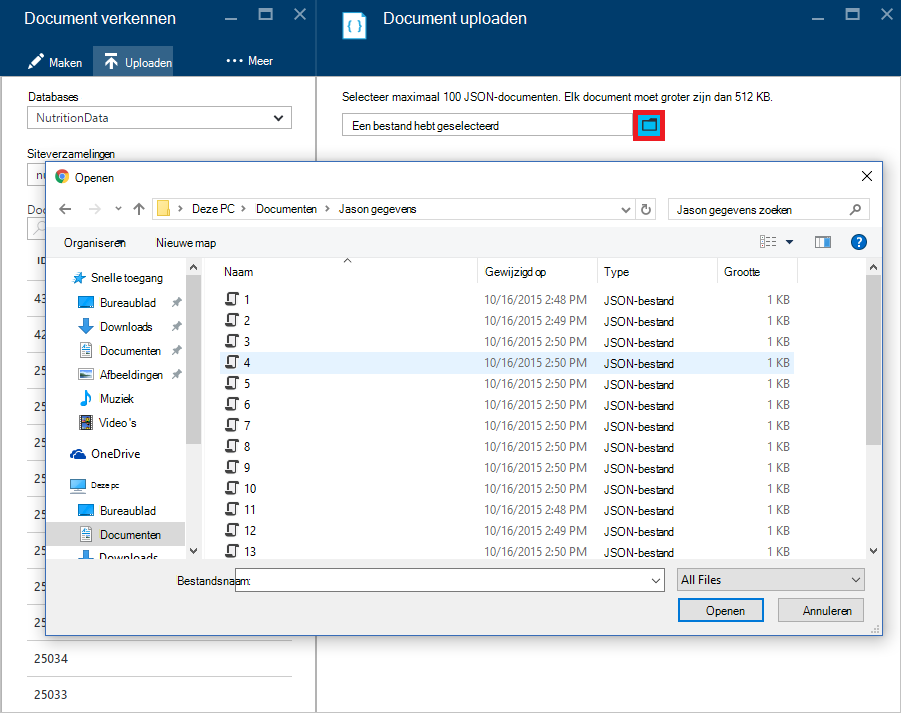

<properties
    pageTitle="DocumentDB Document Explorer om weer te geven van JSON | Microsoft Azure"
    description="Meer informatie over de DocumentDB Document Explorer, een hulpprogramma Azure-Portal JSON weergeven, bewerken, maken en JSON-documenten met DocumentDB, een database van NoSQL document uploaden."
        keywords="json weergeven"
    services="documentdb"
    authors="kirillg"
    manager="jhubbard"
    editor="monicar"
    documentationCenter=""/>

<tags
    ms.service="documentdb"
    ms.workload="data-services"
    ms.tgt_pltfrm="na"
    ms.devlang="na"
    ms.topic="article"
    ms.date="08/30/2016"
    ms.author="kirillg"/>

# Weergeven, bewerken, maken en uploaden JSON-documenten met DocumentDB documentverkenner

Dit artikel bevat een overzicht van de [Microsoft Azure DocumentDB](https://azure.microsoft.com/services/documentdb/) Document Explorer, een Azure portal hulpmiddel waarmee u kunt weergeven, bewerken, maken, uploaden en JSON-documenten met DocumentDB filteren. 

Houd er rekening mee dat Document Explorer DocumentDB accounts met protocolondersteuning voor MongoDB niet is ingeschakeld. Deze pagina wordt bijgewerkt als deze functie is ingeschakeld.

## Document Explorer starten

1. Klik in de portal Azure in de Jumpbar, klikt u op **DocumentDB (NoSQL)**. Als **DocumentDB (NoSQL)** niet zichtbaar is, klikt u op **Meer Services** en klik vervolgens op **DocumentDB (NoSQL)**.

2. Selecteer de naam van het account. 

3. Klik in het menu resource op **Document Explorer**. 
 
    

    De vervolgkeuzelijsten **Databases** en **siteverzamelingen** worden in het blad **Document Explorer** vooraf ingevuld afhankelijk van de context waarin u Document Explorer hebt gestart. 

## Een document maken

1. [Document Explorer starten](#launch-document-explorer).

2. Klik in het blad **Document Explorer** op **Document maken**. 

    Een minimale JSON-fragment is opgegeven in het **Document** blad.

    

2. In het **Document** blad, typ of plak in de inhoud van de JSON-document dat u wilt maken en klik vervolgens op **Opslaan** als wilt doorvoeren van uw document in de database en de siteverzameling die zijn opgegeven in het **Document Explorer** -blad.

    

    > [AZURE.NOTE] Als u een eigenschap "id" niet opgeeft, klikt u vervolgens Document Explorer automatisch wordt toegevoegd een eigenschap id en genereert een GUID als de waarde-id.

    Als u al hebt gegevens uit de JSON-bestanden, MongoDB, SQL Server, CSV-bestanden, Azure-tabelopslag, Amazon DynamoDB, HBase, of u kunt vanuit andere collecties DocumentDB van DocumentDB [migratieprogramma van gegevens](documentdb-import-data.md) gebruiken om snel uw gegevens te importeren.

## Een document bewerken

1. [Document Explorer starten](#launch-document-explorer).

2. Als u wilt een bestaand document bewerken, selecteert u deze in het **Document Explorer** blad, het document in het blad **Document** bewerken en klik vervolgens op **Opslaan**.

    

    Als u een document aan het bewerken bent en u besluit dat u wilt verwijderen van de huidige set bewerkingen, gewoon klikt u op **verwijderen** in het **Document** blad, de actie verwijderen te bevestigen en de status van het document opnieuw wordt geladen.

    

## Een document verwijderen

1. [Document Explorer starten](#launch-document-explorer).

2. Selecteer het document in **Document Explorer**, klikt u op **verwijderen**en klikt u vervolgens het verwijderen te bevestigen. Het document wordt onmiddellijk na acceptatie van, verwijderd uit de lijst van het Document Explorer.

    

## Werken met documenten die JSON

Document Explorer worden gevalideerd dat elk document nieuwe of bewerkte geldige JSON bevat.  U kunt zelfs weergave JSON fouten door de muisaanwijzer boven de onjuiste sectie voor informatie over de fout in de.

Daarnaast kunnen Document Explorer voorkomt dat u een document met ongeldige JSON-inhoud op te slaan.

Tot slot kunt Document Explorer u gemakkelijk de Systeemeigenschappen van de momenteel geladen document door te klikken op de opdracht **Eigenschappen** weergeven.

> [AZURE.NOTE] De eigenschap tijdstempel (_ts) intern als epoche tijd wordt weergegeven, maar Document Explorer wordt de waarde in een menselijke leesbare GMT-indeling.

## Filteren van documenten
Document Explorer ondersteunt een aantal Navigatieopties te klikken en geavanceerde instellingen.

Standaard laadt Document Explorer omhoog naar de eerste 100 documenten in de geselecteerde verzameling, door hun aanmaakdatum van vroegste naar laatste.  U kunt aanvullende documenten (in batches van 100) door de optie **laden meer** onderaan in het Document Explorer blad laden. U kunt kiezen welke documenten laden tot en met de opdracht **Filter** .

1. [Document Explorer starten](#launch-document-explorer).

2. Aan de bovenkant van het blad **Document Explorer** , klikt u op **Filter**.  

    
  
3.  De filterinstellingen onder de opdrachtbalk worden weergegeven. In de filterinstellingen, Geef een WHERE-component en/of een ORDER BY-component en klik vervolgens op **Filter**.

    

    Document Explorer worden de resultaten automatisch vernieuwd met documenten die overeenkomen met de filterquery. Lees meer informatie over de grammatica DocumentDB SQL in de [SQL-query en SQL-syntaxis](documentdb-sql-query.md) artikel of een kopie van de [SQL-query cheats blad](documentdb-sql-query-cheat-sheet.md)af te drukken.

    De vakken van de vervolgkeuzelijst **Database** en **siteverzameling** kunnen worden gebruikt eenvoudig wijzigen de verzameling waaruit zijn momenteel documenten zonder te hoeven sluiten en opnieuw starten Document Explorer wordt weergegeven.  

    Document Explorer ondersteunt ook de geladen set documenten filteren op hun eigenschap id.  Alleen te typen in het vak id documenten Formulierfilter.

    

    De resultaten in het Document Explorer lijst zijn gefilterd op basis van de opgegeven criteria.

    

    > [AZURE.IMPORTANT] Het Document Explorer filter functionaliteit enige filters die uit de ***momenteel*** geladen set documenten en voert een query ten opzichte van de momenteel geselecteerde verzameling geen.

4. Als u wilt de lijst met documenten die zijn geladen door Document Explorer vernieuwen, klikt u op **vernieuwen** aan de bovenkant van het blad.

    

## Bulksgewijs documenten toevoegen

Document Explorer ondersteunt bulksgewijs opname van een of meer bestaande JSON documenten, maximaal 100 bestanden van JSON per uploaden.  

1. [Document Explorer starten](#launch-document-explorer).

2. Als u wilt uploaden, klikt u op **Document uploaden**.

    

    Hiermee opent u het blad **Document uploaden** . 

2. Klik op de bladerknop om een bestand explorer-venster openen, selecteer een of meer JSON documenten uploaden en klik vervolgens op **openen**.

    

    > [AZURE.NOTE] Document Explorer ondersteunt momenteel maximaal 100 JSON documenten per afzonderlijke uploaden.

3. Als u tevreden met uw selectie bent, klik op de knop **uploaden** .  De documenten worden automatisch toegevoegd aan het raster Document Explorer en de Uploadresultaten worden weergegeven als de bewerking vordert. Fouten bij worden voor afzonderlijke bestanden opgegeven.

    

4. Zodra de bewerking voltooid is, kunt u snel aan de andere 100 documenten uploaden.

## Werken met documenten die JSON buiten de portal

De Verkenner Document in de portal van Azure is slechts één manier om te werken met documenten in DocumentDB. U kunt ook werken met documenten in de [REST API](https://msdn.microsoft.com/library/azure/mt489082.aspx) of de [client SDK's](documentdb-sdk-dotnet.md). Bijvoorbeeld code, raadpleegt u de [.NET SDK document voorbeelden](documentdb-dotnet-samples.md#document-examples) en de [Node.js SDK document voorbeelden](documentdb-nodejs-samples.md#document-examples).

Als u wilt importeren of bestanden migreren van een andere bron (JSON-bestanden, MongoDB, SQL Server, CSV-bestanden, Azure tabel opslag, Amazon DynamoDB of HBase), kunt u het DocumentDB [migratieprogramma van de gegevens](documentdb-import-data.md) snel uw gegevens importeren in DocumentDB.

## Problemen met

**Symptoom**: Document Explorer geeft **geen documenten die zijn gevonden**.

**Oplossing**: Zorg ervoor dat u het juiste abonnement, de database en de siteverzameling waarin de documenten die zijn ingevoegd hebt geselecteerd. Raadpleeg ook om ervoor te zorgen dat u in uw doorvoer quota's werkt. Als u werkt aan vertraagd uw maximumdoorvoer niveau en ophalen, onderste toepassingsgebruik te kunnen uitvoeren onder het quotum voor maximumdoorvoer voor de siteverzameling.

**Uitleg**: de portal is een toepassing zoals enig ander, kunt bellen aan uw DocumentDB database en de siteverzameling. Als uw aanvragen zijn momenteel wordt vertraagd vanwege oproepen uit een andere toepassing, kan de portal ook worden vertraagd, veroorzaakt door resources niet worden weergegeven in de portal. Het probleem is opgelost, het adres van de oorzaak van het gebruik van hoge doorvoer en vernieuw vervolgens het portal blad. Informatie over hoe u meten en het gebruik van lagere doorvoer vindt u in het gedeelte [Doorloop](documentdb-performance-tips.md#throughput) van het artikel [tips voor betere prestaties](documentdb-performance-tips.md) .

## Volgende stappen

Zie het artikel [SQL-query en SQL-syntaxis](documentdb-sql-query.md) voor meer informatie over de DocumentDB SQL-grammatica ondersteund in Document Explorer, of af te drukken de [SQL-query cheats blad](documentdb-sql-query-cheat-sheet.md).

Het [leerpad](https://azure.microsoft.com/documentation/learning-paths/documentdb/) is ook een handige resource om u te helpen als u meer informatie over DocumentDB. 
