<properties
    pageTitle="DocumentDB Script Explorer, een JavaScript-editor | Microsoft Azure"
    description="Meer informatie over de DocumentDB Script Explorer, een Azure-Portal hulpmiddel voor het beheren van DocumentDB serverzijde programming onderdelen zoals opgeslagen procedures, triggers en de gebruiker gedefinieerde functies."
    keywords="JavaScript-editor"
    services="documentdb"
    authors="kirillg"
    manager="jhubbard"
    editor="monicar"
    documentationCenter=""/>

<tags
    ms.service="documentdb"
    ms.workload="data-services"
    ms.tgt_pltfrm="na"
    ms.devlang="na"
    ms.topic="article"
    ms.date="08/30/2016"
    ms.author="kirillg"/>

# Maken en uitvoeren van opgeslagen procedures, triggers en de gebruiker gedefinieerde functies DocumentDB Script Verkenner

Dit artikel bevat een overzicht van [Microsoft Azure DocumentDB](https://azure.microsoft.com/services/documentdb/) Script Explorer, dat wil een JavaScript-editor in de portal van Azure waarmee u zeggen kunt bekijken en DocumentDB serverzijde programming onderdelen zoals opgeslagen procedures, triggers en de gebruiker gedefinieerde functies uit. Lees meer over DocumentDB serverzijde programmeren in het artikel [opgeslagen procedures, databasetriggers, en UDF's](documentdb-programming.md) .

## Script Explorer starten

1. Klik in de portal Azure in de Jumpbar, klikt u op **DocumentDB (NoSQL)**. Als **DocumentDB Accounts** niet zichtbaar is, klikt u op **Meer Services** en klik vervolgens op **DocumentDB (NoSQL)**.

2. Klik in het menu resources op **Script Explorer**.

    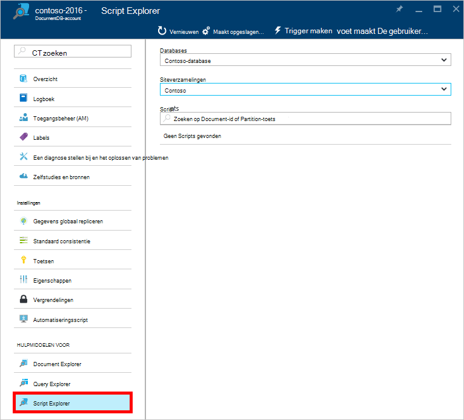
 
    De vakken van de vervolgkeuzelijst **Database** en **siteverzameling** zijn vooraf gevuld afhankelijk van de context waarin u Script Explorer starten.  Bijvoorbeeld als u uit een database blade starten, is klikt u vervolgens de huidige database ingevuld.  Als u van een siteverzameling blade starten, klikt u vervolgens is de huidige verzameling ingevuld.

4.  Gebruik de vakken van de vervolgkeuzelijst **Database** en **siteverzameling** eenvoudig wijzigen de verzameling waaruit zijn momenteel scripts zonder te hoeven sluiten en opnieuw starten Script Explorer wordt weergegeven.  

5. Script Explorer ondersteunt ook het filteren van de momenteel geladen set scripts op hun eigenschap id.  Alleen te typen in het filtervak en de resultaten in de lijst Script Explorer zijn gefilterd op basis van de opgegeven criteria.

    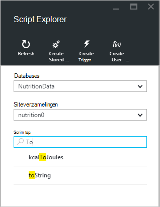

    > [AZURE.IMPORTANT] Het Script Explorer functionaliteit enige filters uit de set ***momenteel*** geladen van scripts filteren en wordt niet automatisch vernieuwen van de momenteel geselecteerde verzameling.

5. Als u wilt vernieuwt u de lijst van scripts door Script Explorer geladen, klikt u op de opdracht **vernieuwen** aan de bovenkant van het blad.

    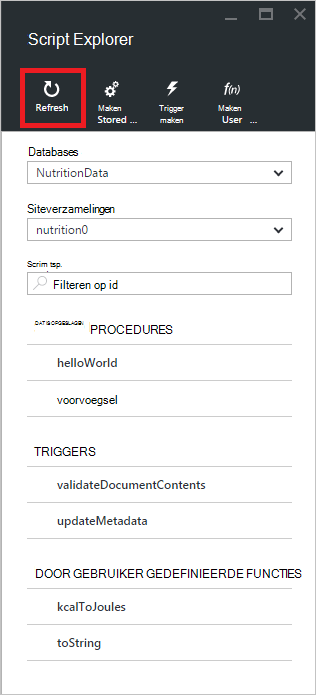

## Maken, bekijken en bewerken van opgeslagen procedures, triggers en de gebruiker gedefinieerde functies

Script Explorer kunt u eenvoudig CRUD-bewerkingen op DocumentDB serverzijde programming onderdelen uitvoeren.  

- Als u wilt een script maken, klikt u op de toepasselijke opdracht in script explorer maken, een id, voert u de inhoud van het script, en klik op **Opslaan**.

    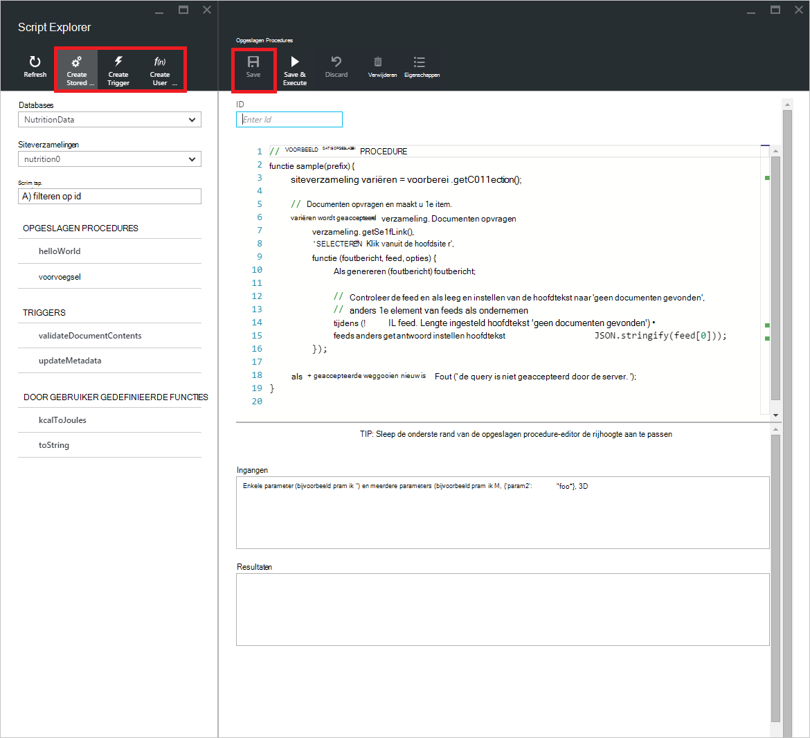

- Wanneer u een trigger maakt, moet u ook de bewerking trigger type en de inwerkingtreding opgeven

    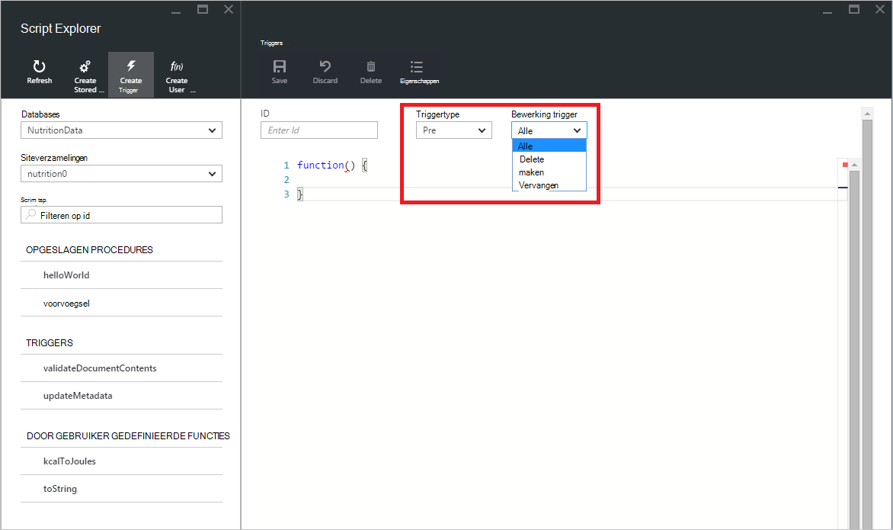

- Als u wilt weergeven in een script, klikt u op het script waarin u geïnteresseerd bent.

    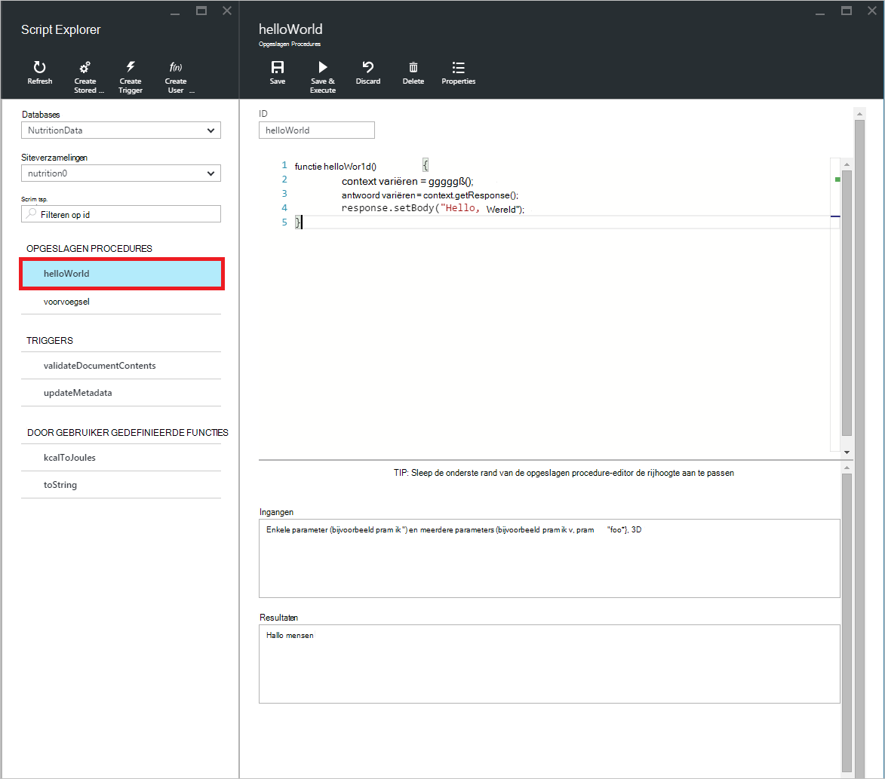

- Als u wilt bewerken in een script, breng de gewenste wijzigingen in de JavaScript editor en klik op **Opslaan**.

    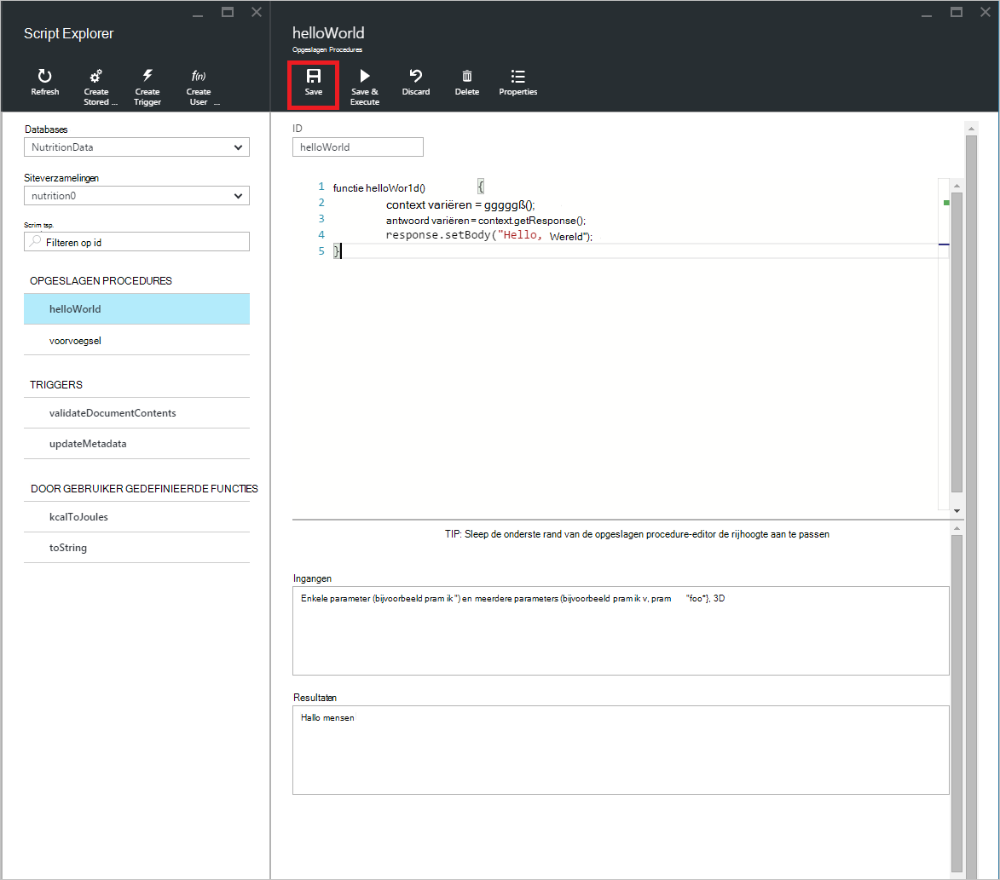

- Als u wilt alle wachtende wijzigingen in een script verwijderd, klikt u op de opdracht **verwijderen** .

    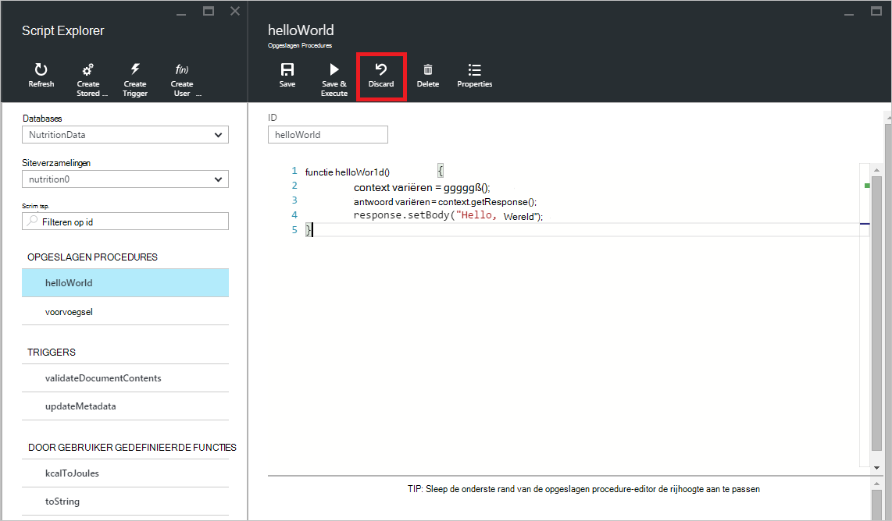

- Script Explorer kunt u gemakkelijk de Systeemeigenschappen van het geladen script door te klikken op de opdracht **Eigenschappen** weergeven.

    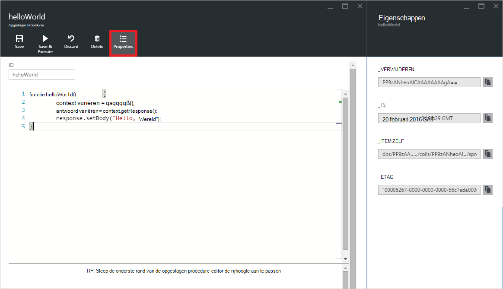

    > [AZURE.NOTE] De eigenschap tijdstempel (_ts) intern als epoche tijd wordt weergegeven, maar Script Explorer wordt de waarde in een menselijke leesbare GMT-indeling.

- U verwijdert een script, selecteert u deze in Script Explorer en klik op de opdracht **verwijderen** .

    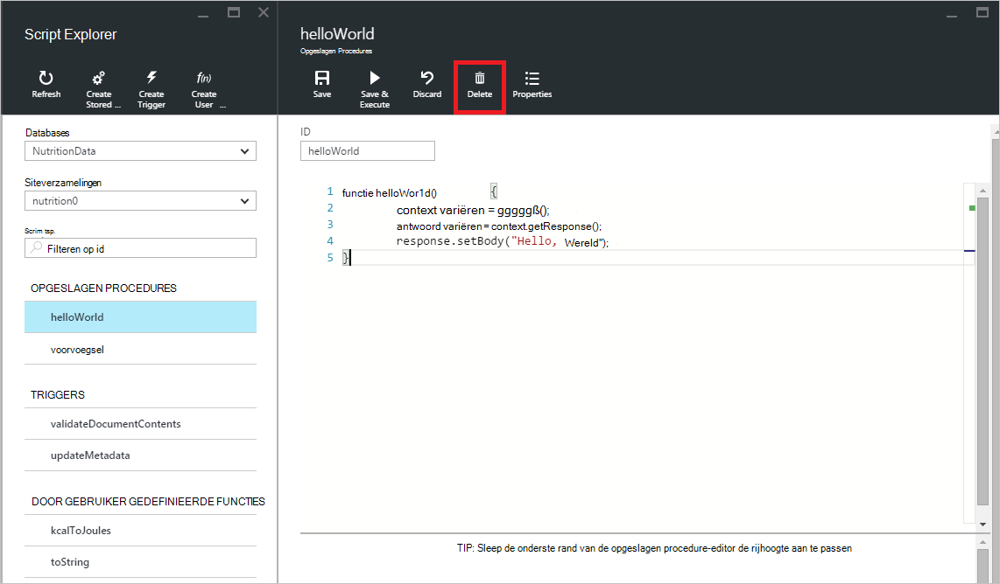

- Bevestig de verwijderactie door te klikken op **Ja** of de verwijderactie annuleren door te klikken op **geen**.

    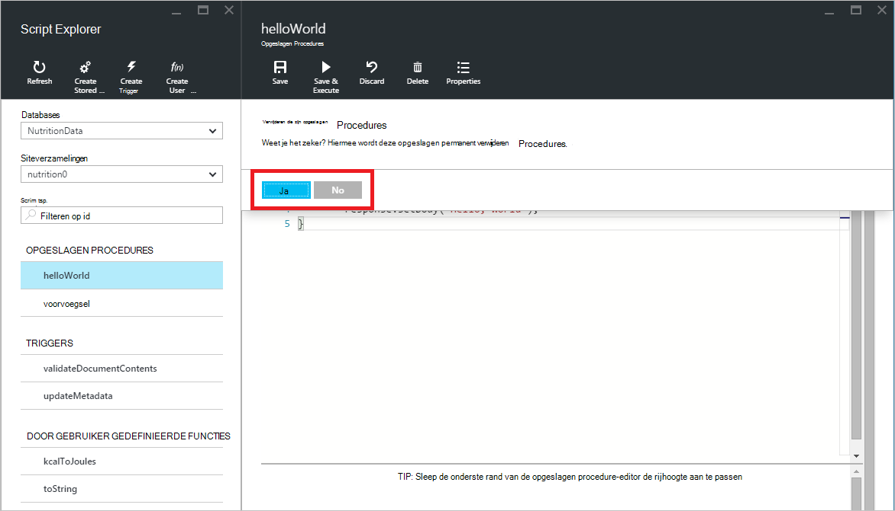

## Een opgeslagen procedure uitvoeren

> [AZURE.WARNING] Opgeslagen procedures wordt uitgevoerd in Script Explorer is nog niet ondersteund voor de server kant partitioneren siteverzamelingen. Ga naar [partitionering en schaal in DocumentDB](documentdb-partition-data.md)voor meer informatie.

Script Explorer kunt u aan de clientzijde opgeslagen procedures uitvoeren vanuit de Azure-portal.

- Bij het openen van een nieuwe maken die zijn opgeslagen procedure blade, een Standaardscript (*voorvoegsel*) al krijgt. Om te kunnen het *voorvoegsel* -script of uw eigen script uitvoeren, moet u een *id* en *invoeritems*toevoegen. Voor opgeslagen procedures die meerdere parameters accepteren, moeten alle invoer in een matrix (bijvoorbeeld *["foo", "balk"]*).

    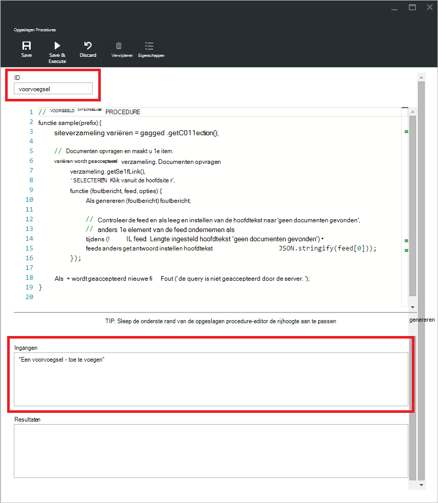

- Als u wilt een opgeslagen procedure uitvoeren, klikt u op de opdracht **Opslaan en uitvoeren** in script editor-veld.

    > [AZURE.NOTE] De opdracht **Opslaan en uitvoeren** , wordt uw opgeslagen procedure voordat wordt uitgevoerd, wat betekent dat de laatst opgeslagen versie van de opgeslagen procedure worden overschreven opslaan.

- Succesvolle opgeslagen procedure executions heeft een status *is opgeslagen en de opgeslagen procedure uitgevoerd* en de geretourneerde resultaten wordt gevuld in het deelvenster *resultaten* .

    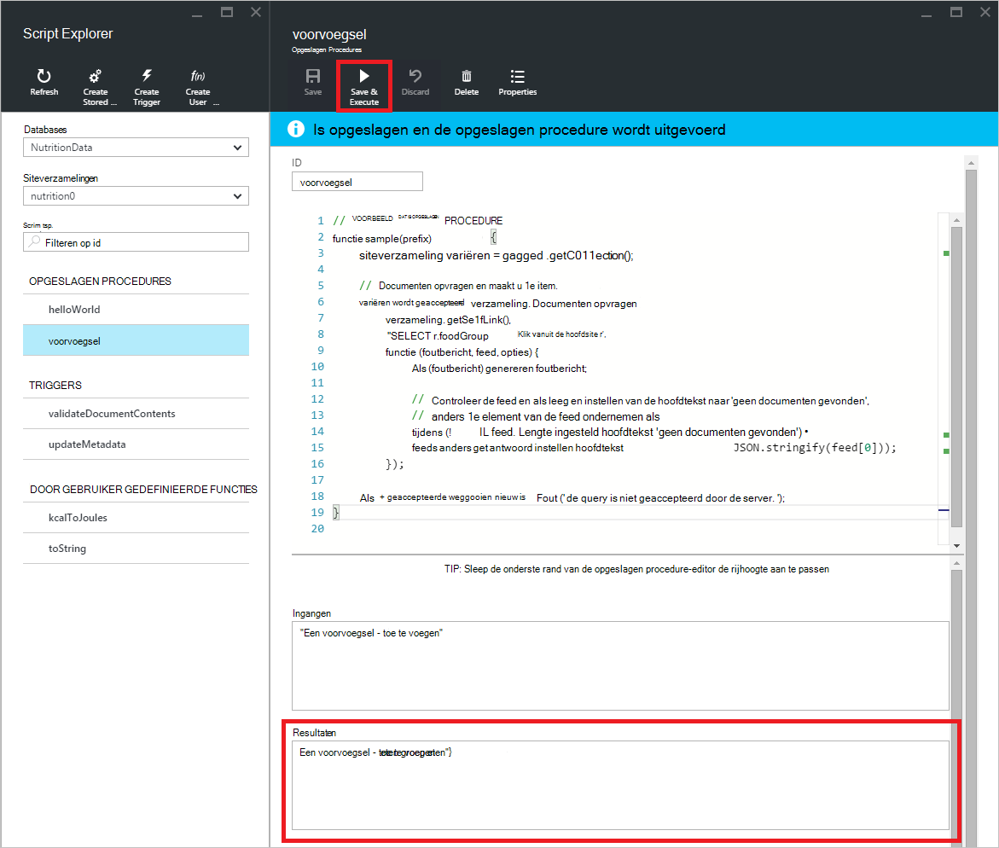

- Als de uitvoering een fout optreedt, wordt de fout in het deelvenster *resultaten* worden gevuld.

    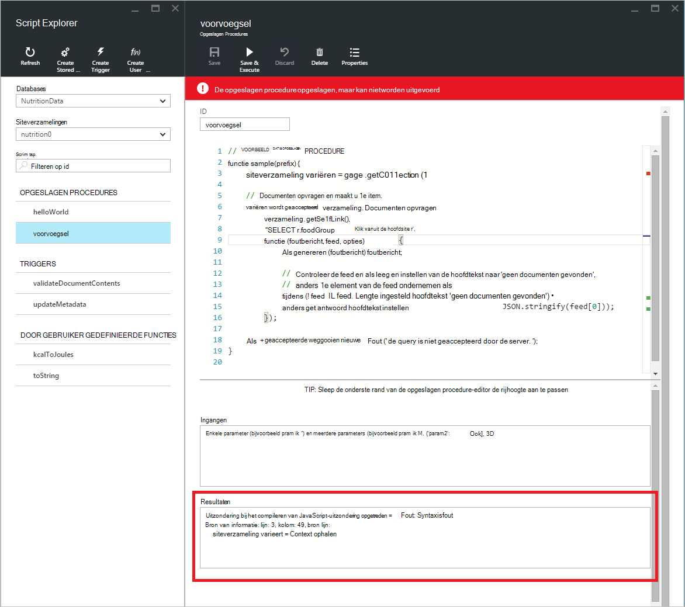

## Werken met scripts buiten de portal

De Explorer Script in de portal van Azure is slechts één manier om te werken met opgeslagen procedures, triggers en de gebruiker gedefinieerde functies in DocumentDB. U kunt ook werken met scripts met de de REST API en de [client SDK's](documentdb-sdk-dotnet.md). De REST API-documentatie bevat voorbeelden voor het werken met [opgeslagen procedures met REST](https://msdn.microsoft.com/library/azure/mt489092.aspx)en [triggers REST gebruiken](https://msdn.microsoft.com/library/azure/mt489116.aspx) [door gebruiker gedefinieerde functies REST gebruiken](https://msdn.microsoft.com/library/azure/dn781481.aspx). Voorbeelden zijn ook beschikbaar waarin het [werken met behulp van C# scripts](documentdb-dotnet-samples.md#server-side-programming-examples) en [werken met behulp van Node.js scripts](documentdb-nodejs-samples.md#server-side-programming-examples).

## Volgende stappen

Meer informatie over DocumentDB serverzijde hoeft te programmeren in het artikel [opgeslagen procedures, databasetriggers, en UDF's](documentdb-programming.md) .

Het [leerpad](https://azure.microsoft.com/documentation/learning-paths/documentdb/) is ook een handige resource om u te helpen als u meer informatie over DocumentDB.  
