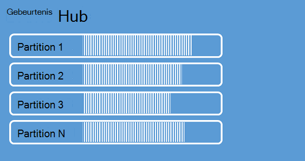
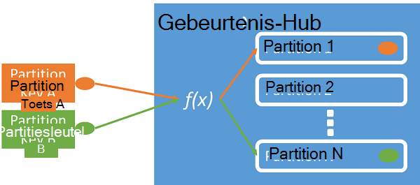

<properties 
    pageTitle="Overzicht van Azure gebeurtenis Hubs | Microsoft Azure"
    description="Inleiding en overzicht van Azure gebeurtenis Hubs."
    services="event-hubs"
    documentationCenter="na"
    authors="sethmanheim"
    manager="timlt"
    editor="" />
<tags 
    ms.service="event-hubs"
    ms.devlang="na"
    ms.topic="get-started-article"
    ms.tgt_pltfrm="na"
    ms.workload="na"
    ms.date="08/16/2016"
    ms.author="sethm" />

# Azure gebeurtenis Hubs-overzicht

Oplossingen voor veel moderne van plan bent om geavanceerde klantervaringen of voor het verbeteren producten tot en met continue feedback en geautomatiseerde telemetrielogboek. Deze oplossingen zijn geconfronteerd met de uitdaging van hoe veilig en betrouwbaar verwerkingstijd van zeer grote hoeveelheden gegevens uit veel gelijktijdige uitgevers. Microsoft Azure gebeurtenis Hubs is een beheerde platform-service waarmee u een foundation grootschalige gegevens opname in tal van scenario's. Voorbeelden van dergelijke scenario's zijn gedrag bijhouden in mobiele apps, verkeer gegevens uit de web-farms, spel gebeurtenis vastleggen in console spellen, of telemetriegegevens verzameld van industriële machines of voertuigen verbonden. De algemene rol die gebeurtenis Hubs geschikt is voor oplossing architecturen is dat deze als de "deur' voor een gebeurtenis pijplijn fungeert, ook bekend als een *gebeurtenis ingestor*. Een gebeurtenis ingestor is een onderdeel of service die bevindt zich tussen gebeurtenisuitgevers en gebeurtenis consumenten loskoppelen van de hoeveelheid een gebeurtenis stream vanaf het verbruik van deze gebeurtenissen.

Azure gebeurtenis Hubs is een gebeurtenis service waarmee de gebeurtenis en telemetrielogboek ingress in de cloud op grote schaal met lage latentie en hoge betrouwbaarheid verwerken. Deze service gebruikt met andere services volgende, is vooral handig in toepassing instrumentation, gebruiker ervaring of werkstroom verwerking en scenario's voor Internet van dingen (IoT). Gebeurtenis Hubs biedt de berichtenstroom van een de mogelijkheid voor de verwerking en hoewel de Hub van een gebeurtenis een vergelijkbaar met wachtrijen en onderwerpen entiteit is, heeft dit kenmerken die sterk afwijkt van traditionele enterprise messaging zijn. SMS-berichten scenario's voor Enterprise meestal is vereist geavanceerde mogelijkheden zoals volgordebepaling, dode-letters, transactie-ondersteuning en sterke bezorging garanties, terwijl de dominante belangstelling bij gebeurtenis opname is hoog doorvoer en flexibiliteit voor gebeurtenis gegevensstromen verwerken. Daarom, gebeurtenis Hubs mogelijkheden verschillen van Service Bus onderwerpen in dat ze ten zeerste zijn gericht op hoog doorvoer en scenario's verwerking van gebeurtenis. Als zodanig Implementeer gebeurtenis Hubs enkele van de SMS-functies die beschikbaar voor onderwerpen zijn. Als u deze mogelijkheden nodig, blijven onderwerpen de optimale keuze.

Een gebeurtenis-Hub is gemaakt op de gebeurtenis Hubs naamruimte niveau, vergelijkbaar met de Service Bus wachtrijen en onderwerpen. Gebeurtenis Hubs gebruikt AMQP en HTTP als de primaire API-interfaces. In het volgende diagram ziet u de relatie tussen gebeurtenis Hubs en Service Bus.

## Conceptueel overzicht

Gebeurtenis Hubs biedt bericht streaming tot en met een patroon gepartitioneerde consumenten. Gebruik een [Consumenten dat](https://msdn.microsoft.com/library/dn568101.aspx) model waarin elke consumenten probeert te lezen dezelfde wachtrij of resource wachtrijen en onderwerpen. Deze competitie voor resources levert uiteindelijk complexiteit en schaal limieten voor de verwerking van toepassingen stream. Gebeurtenis Hubs maakt gebruik van een gepartitioneerde consumenten patroon waarin elke consumenten alleen leest een specifiek deel of partition, van de stream bericht. Dit patroon kunt horizontale schaal voor de verwerking van de gebeurtenis en biedt andere stream gerichte functies die niet beschikbaar in wachtrijen en onderwerpen zijn.

### Partities

Een partition is een geordende reeks gebeurtenissen die in de Hub van een gebeurtenis wordt bewaard. Zodra nieuwere gebeurtenissen binnenkomen, worden ze toegevoegd aan het einde van deze reeks. Een partition kan worden beschouwd als een 'doorvoeren logboek."

Partities behouden gegevens voor een geconfigureerde bewaarbeleid tijd die is ingesteld op het niveau van de Hub van de gebeurtenis. Deze instelling past in alle partities in het logboek Hub. Gebeurtenissen verloopt op basis van; niet verwijderen expliciet. Een gebeurtenis-Hub bevat meerdere partities. Elke partition onafhankelijk is en een eigen reeks gegevens bevat. Hierdoor groter partities vaak verschillende tussenpozen.

Het aantal partities is opgegeven bij de aanmaaktijd van een gebeurtenis Hub en moet liggen tussen 2 en 32 (de standaardinstelling is 4). Partities zijn van een organisatie-om gegevens en meer zijn gerelateerd aan de mate van volgende parallellisme vereist in door andere programma's dan aan gebeurtenis Hubs doorvoer. Hierdoor wordt de keuze van het aantal partities in de Hub van een gebeurtenis rechtstreeks zijn gerelateerd aan het aantal gelijktijdige lezers die u verwacht te hebben. Nadat de gebeurtenis Hub is gemaakt is het aantal partities niet mag worden gewijzigd; Overweeg dit nummer in de lange termijn verwachte schaal. U kunt de limiet van 32 partition vergroten door contact opneemt met het team Service Bus.

Hoewel partities zijn en rechtstreeks naar worden verzonden, is het aanbevolen om te voorkomen dat gegevens worden verzonden naar specifieke partities. In plaats daarvan kunt u een hoger niveau constructies geïntroduceerd in de secties [gebeurtenis publisher](#event-publisher) en [Beleid van Publisher](#capacity-and-security) gebruiken.

In de context van de gebeurtenis Hubs, worden berichten worden *gebeurtenisgegevens*genoemd. Laad de hoofdtekst van de gebeurtenis, een gebruiker gedefinieerd eigenschap zak en verschillende metagegevens over de gebeurtenis, zoals de verschuiving in de partition en het getal in de volgorde van de stream. Partities worden ingevuld in een reeks gebeurtenisgegevens.

## Gebeurtenis publisher

Een entiteit die gebeurtenissen of gegevens naar een gebeurtenis-Hub, is een *gebeurtenis publisher*. Gebeurtenisuitgevers kunnen gebeurtenissen met HTTPS of AMQP 1.0 publiceren. Gebeurtenisuitgevers gebruiken een token gedeeld Access handtekening (SA's) om te identificeren zichzelf een gebeurtenis-Hub, en een unieke identiteit, of u een algemene SA's token, afhankelijk van de vereisten van het scenario gebruiken.

Zie voor meer informatie over het werken met SA's [Access handtekening-verificatie gedeeld met Service Bus](../service-bus-messaging/service-bus-shared-access-signature-authentication.md).

### Algemene publisher-taken

Dit onderwerp vindt algemene taken voor de gebeurtenisuitgevers.

#### In het bezit van een token SA 's

Gedeelde Access handtekening (SA's) is de verificatie om gebeurtenis Hubs. Service Bus biedt SA's beleid op de naamruimte en de gebeurtenis Hub niveau. Een token SA's is gegenereerd op basis van een sleutel SA's en is een hash SHA van een URL, codering in een specifieke notatie. De naam van de sleutel (beleid) en de token gebruikt, kan Service Bus de hash genereren en kan dus de afzender wilt verifiëren. Normaal gesproken vergt zijn SA's tokens voor gebeurtenisuitgevers gemaakt met alleen **verzenden** bevoegdheden op een specifieke Hub voor de gebeurtenis. Deze methode voor token-URL van SA's is de basis voor publisher identificatie geïntroduceerd in het beleid van publisher. Zie voor meer informatie over het werken met SA's [Access handtekening-verificatie gedeeld met Service Bus](../service-bus-messaging/service-bus-shared-access-signature-authentication.md).

#### Een gebeurtenis publiceren

U kunt een gebeurtenis via AMQP 1.0 of HTTPS publiceren. Service Bus biedt een klasse [EventHubClient](https://msdn.microsoft.com/library/microsoft.servicebus.messaging.eventhubclient.aspx) voor publicerende gebeurtenissen op een gebeurtenis-Hub van .NET-clients. Voor andere runtimes en platforms, kunt u eventuele AMQP 1.0 mailclient gebruikt, zoals [Apache Qpid](http://qpid.apache.org/). U gebeurtenissen afzonderlijk kunt publiceren of batch verwerkt. Een publicatie (gebeurtenis gegevens exemplaar) geldt een limiet van 256KB, ongeacht of dit nu een eenmalige gebeurtenis of een batch. Publicatie van gebeurtenissen die groter is dan het resultaat is een fout. Het is een goede gewoonte voor uitgevers niet bewust van de partities binnen de Hub gebeurtenis en alleen opgeven een *toets partitioneren* (geïntroduceerd in het volgende gedeelte), of hun identiteit via hun token SA's.

De keuze gebruik AMQP of HTTPS hoort bij het gebruiksscenario. AMQP is vereist voor de inrichting van een permanente bidirectionele socket naast transport beveiliging (TLS) of SSL/TLS. Dit kan een dure bewerking netwerkverkeer, maar alleen gebeurt er aan het begin van een sessie AMQP. HTTPS heeft een lagere eerste realiseren, maar is belasting extra SSL vereist voor elke aanvraag. Voor uitgevers die regelmatig gebeurtenissen publiceren, biedt AMQP aanzienlijk prestaties, latentie en doorvoer te sparen.

### Partition-toets

Een partitiesleutel is een waarde die wordt gebruikt voor binnenkomende gebeurtenisgegevens in specifieke partities toewijzen voor de toepassing van de organisatie van de gegevens. De partitiesleutel is een afzender geleverde waarde doorgegeven aan de Hub van een gebeurtenis. Deze wordt verwerkt door een statische hashing functie, het resultaat van de plaats waar de toewijzing partition maakt. Als u niet een partitiesleutel opgeeft bij het publiceren van een gebeurtenis, wordt een toewijzing round robin wordt gebruikt. Wanneer u met de toetsen partition, is de uitgever gebeurtenis alleen op de hoogte van de partitiesleutel, niet de partition waarnaar de gebeurtenissen die zijn gepubliceerd. Deze ontkoppeling van de sleutel en partition schermt de afzender van het hoeft te weten te veel over de volgende verwerking en opslag van gebeurtenissen. Partitiesleutels zijn belangrijk is voor het ordenen van gegevens voor de verwerking van de volgende, maar zijn fundamenteel onverwante partities zelf. Een per apparaat of de gebruiker unieke identiteit is een goede partitiesleutel, maar u kunnen ook andere kenmerken zoals Geografie worden gebruikt voor het groeperen van gerelateerde gebeurtenissen in een enkel partition. De volgende afbeelding ziet u gebeurtenis afzenders met partition toetsen op vastmaken aan partities.

Gebeurtenis Hubs zorgt ervoor dat alle gebeurtenissen delen dezelfde partition sleutelwaarde in volgorde en de dezelfde partition worden geleverd. Is van belang dat als partition toetsen worden gebruikt met publisher-beleid, dat wordt beschreven in de volgende sectie, klikt u vervolgens de identiteit van de uitgever en de waarde van de partitiesleutel moeten overeenkomen. Anders optreedt een fout.

### Gebeurtenis consumenten

Een entiteit die gebeurtenisgegevens uit een Hub gebeurtenis ophaalt is een gebeurtenis consumer. Alle gebeurtenis consumenten Lees de stream gebeurtenis tot en met partities in een groep consumenten. Elke partition moet slechts één actieve lezer tegelijk hebben. Alle gebeurtenis Hubs consumenten verbinding via de AMQP 1.0-sessie, waarin gebeurtenissen worden bezorgd zodra deze beschikbaar. De client hoeft niet worden gecontroleerd op beschikbaarheid van gegevens.

#### Groepen consumenten

De regeling publicaties/abonnementen voor de gebeurtenis Hubs is ingeschakeld door consumenten groepen. Een groep consumenten is een weergave van een hele gebeurtenis Hub (staat, positie of verschuiving). Consumenten groepen inschakelen meerdere in beslag nemen toepassingen op elk hebben een afzonderlijke weergave van de stream gebeurtenis en de stream onafhankelijk in hun eigen tempo en met hun eigen verschuivingen lezen. In een stroom processing architectuur, is elke gekoppelde toepassing gelijk aan een groep consumenten. Desgewenst kunt u bij het wegschrijven van gebeurtenisgegevens met langdurige storage is die opslag schrijver-toepassing een groep consumenten. Verwerking van complexe gebeurtenis wordt uitgevoerd door een andere, afzonderlijke consumenten groep. U kunt alleen toegang tot partities via een groep consumenten. Er is altijd een standaardgroep voor consumenten in de Hub van een gebeurtenis en u kunt maximaal 20 consumenten groepen voor een standaard laag gebeurtenis Hub maken.

Hier volgen enkele voorbeelden van de overeenkomst van consumenten groep URI:

    //<my namespace>.servicebus.windows.net/<event hub name>/<Consumer Group #1>
    //<my namespace>.servicebus.windows.net/<event hub name>/<Consumer Group #2>

De volgende afbeelding ziet u de gebeurtenis consumenten binnen groepen consumenten.

#### Stream verschuivingen

Een verschuiving is de positie van een gebeurtenis binnen een partition. U kunt een verschuiving zien als een cursor aan de clientzijde. De verschuiving is een byte nummering van de gebeurtenis. Hierdoor wordt een gebeurtenis consumer (reader) om op te geven een punt in het logboek streamen waaruit ze wilt laten beginnen met het lezen van gebeurtenissen. Als een tijdstempel of als een waarde, kunt u de verschuiving opgeven. Consumenten bent verantwoordelijk voor het opslaan van hun eigen verschuivingswaarden buiten de gebeurtenis Hubs-service.

Binnen een partition bevat elke gebeurtenis een verschuiving. Deze verschuiving wordt gebruikt door consumenten ziet u de locatie in de Gebeurtenisvolgorde van de voor een bepaald partition. Verschuivingen kunnen worden doorgegeven aan de gebeurtenis Hub als beide een getal of als de waarde van een tijdstempel wanneer een lezer verbinding maakt.

#### Plaatst controlepunten

*Plaatst controlepunten* is een proces waarop lezers markeren of hun positie in een reeks van de gebeurtenis partition vast te leggen. Plaatst controlepunten is de verantwoordelijkheid van de consument en op basis van per partition binnen een groep consumenten plaatsvindt. Dit betekent dat voor iedere groep consumenten elke reader partition moet bijhouden van de huidige positie in het logboek streamen en kunt informeren dat de service hem de gegevensstroom voltooid. Als een partition, een lezer verbreekt wanneer deze opnieuw verbinding deze maakt begint met het lezen op de controlepunt die eerder is verzonden door de laatste lezer van die partition in die groep consumenten. Wanneer de lezer verbinding maakt, wordt deze verschuiving doorgegeven aan de gebeurtenis-Hub en geef de locatie waarop u wilt beginnen met lezen. Op deze manier kunt u plaatst controlepunten op beide gebeurtenissen markeren als 'voltooid' door de volgende toepassingen en op te geven tolerantie bij failover tussen verschillende computers waarop lezers. Omdat gebeurtenisgegevens voor het bewaarbeleid interval opgegeven op het moment dat de Hub gebeurtenis wordt gemaakt behouden blijven, is het mogelijk om terug te keren naar de oudere gegevens door het opgeven van een lagere verschoven ten opzichte van dit proces plaatst controlepunten. Dankzij deze methode kunt plaatst controlepunten failover tolerantie zowel beheerde gebeurtenis stream opnieuw afspelen.

#### Algemene taken voor consumenten

Dit onderwerp vindt algemene taken voor de gebeurtenis Hubs gebeurtenis consumenten of lezers. Alle gebeurtenis Hubs consumenten verbinding via AMQP 1.0. AMQP 1.0 is een sessie en staat hoogte bidirectionele communicatiekanaal. Elke partition heeft een sessie voor het koppelen van AMQP 1.0 die het transport van gebeurtenissen onderverdeeld per partition vergemakkelijkt.

##### Verbinding maken met een partition

Om te kunnen gebruiken gebeurtenissen van een gebeurtenis-Hub, moet een consumenten koppelen aan een partition. Zoals eerder is vermeld, u altijd toegang tot partities via een groep consumenten. Als onderdeel van het model gepartitioneerde consumenten, moet alleen een enkele lezer actief zijn op een partition op elk gewenst moment binnen een groep consumenten. Wanneer u verbinding maakt rechtstreeks naar partities hoeven te lease om te coördineren reader verbindingen met specifieke partities is gebruikelijk. Op deze manier is het mogelijk voor elke partition in een groep consumenten slechts één actieve reader. Beheer van de positie in de reeks voor een reader, is een belangrijke taak die via plaatst controlepunten wordt bereikt. Deze functionaliteit is eenvoudiger geworden met behulp van de klas [EventProcessorHost](https://msdn.microsoft.com/library/microsoft.servicebus.messaging.eventprocessorhost.aspx) voor .NET-clients. [EventProcessorHost](https://msdn.microsoft.com/library/microsoft.servicebus.messaging.eventprocessorhost.aspx) is een agent intelligente consumenten en wordt beschreven in het volgende gedeelte.

##### Gebeurtenissen lezen

Nadat een AMQP 1.0-sessie en de koppeling voor een specifieke partition wordt geopend, worden de gebeurtenissen naar de klant AMQP 1.0 door de service gebeurtenis Hubs bezorgd. Deze methode bezorging kan sneller worden verwerkt en lagere latentie dan halen gebaseerde regelingen zoals HTTP GET. Gebeurtenissen worden verzonden naar de klant, bevat elk exemplaar van de gegevens gebeurtenis belangrijke metagegevens, zoals het nummer van de verschuiving en sequentie die worden gebruikt om u te helpen gemakkelijker plaatst controlepunten op de Gebeurtenisvolgorde.

Het is uw verantwoordelijkheid voor het beheren van deze verschuiving zodanig dat aanbevolen mogelijk beheren voortgang maakt in het verwerken van de stream.

## Capaciteit en beveiliging

Gebeurtenis Hubs is een zeer scalable parallelle architectuur voor stream ingress. Als zodanig zijn opgedeeld in verschillende aspecten van belangrijke overwegingen bij het formaat wijzigen en een oplossing op basis van de gebeurtenis Hubs schaalbaarheid. De eerste van deze besturingselementen capaciteit heet *doorvoer eenheden*, die worden beschreven in de volgende sectie.

### Doorvoer eenheden

De doorvoercapaciteit van gebeurtenis Hubs wordt bepaald door doorvoer eenheden. Doorvoer zijn vooraf gekochte eenheden van capaciteit. Een eenheid doorvoer één omvat het volgende:

- Ingress: Maximaal 1 MB per tweede of 1000 gebeurtenissen per seconde.

- Egress: Maximaal 2 MB per seconde.

Ingress verminderd tot de hoeveelheid capaciteit verstrekt door het aantal doorvoer eenheden die zijn gekocht. Gegevens boven de resultaten van deze bedrag verzenden in een uitzondering 'limiet overschreden'. Dit bedrag is een van beide 1 MB per tweede of 1000 gebeurtenissen per seconde, afhankelijk van wat zich eerst. Egress levert geen bandbreedteregeling uitzonderingen, maar is beperkt tot het bedrag van de overdracht van gegevens is opgegeven voor door de eenheden die zijn gekochte doorvoer: 2 MB per seconde per eenheid doorvoer. Als u publicerende tarief uitzonderingen ontvangt of zijn verwacht te zien hoger egress Controleer hoeveel doorvoer eenheden die u hebt gekocht voor de naamruimte waarin de Hub gebeurtenis is gemaakt. Als u meer doorvoer eenheden, kunt u de instelling op de pagina **naamruimten** op het tabblad **schaal** in de [portal van Azure klassieke][]aanpassen. U kunt ook deze instelling voor het gebruik van de Azure-API's wijzigen.

Hoewel partities een concept van de organisatie gegevens zijn, zijn doorvoer eenheden zuiver een concept capaciteit. Doorvoer eenheden per uur zijn gefactureerd en zijn vooraf gekocht. Zodra u hebt gekocht, worden doorvoer eenheden gefactureerd ten minste één uur. Maximaal 20 doorvoer eenheden voor een gebeurtenis Hubs naamruimte kunnen worden aangeschaft en er is een limiet Azure-account van 20 doorvoer eenheden. Deze doorvoer-eenheden worden in een bepaalde naamruimte door alle gebeurtenis Hubs gedeeld.

Doorvoer eenheden is ingericht op basis van aanbevolen hoeveelheid en mogelijk altijd niet beschikbaar voor directe aankoop. Als u een specifieke capaciteit vereist, is het aanbevolen dat u deze eenheden doorvoer tijd vooraf aanschaffen. Als u meer dan 20 doorvoer eenheden vereist, kunt u contact opnemen met Azure ondersteuning om aan te schaffen meer doorvoer eenheden op basis van resourcebeperkingen in blokken van 20, tot aan de eerste 100 doorvoer eenheden. Verder kunt u ook blokken 100 doorvoer eenheden aanschaffen.

Het wordt aanbevolen dat u zorgvuldig saldo vanaf doorvoer eenheden en partities als u wilt bereiken optimale schalen met Hubs gebeurtenis. Een enkel partition heeft een maximum kleurenschaal van één doorvoer eenheid. Het aantal eenheden doorvoer moet kleiner dan of gelijk is aan het aantal partities in de Hub van een gebeurtenis.

Voor gedetailleerde informatie prijzen, raadpleegt u de [Gebeurtenis Hubs prijzen](https://azure.microsoft.com/pricing/details/event-hubs/).

### Publisher-beleid

Gebeurtenis Hubs kunt gedetailleerde controle over gebeurtenisuitgevers via het *beleid van publisher*. Publisher beleidsregels van een reeks Runtime-functies ter ondersteuning van grote aantallen onafhankelijke gebeurtenisuitgevers zijn. Elke uitgever gebruikt met publisher beleidsregels, een eigen unieke id wanneer gebeurtenissen publiceren naar een gebeurtenis-Hub, met behulp van de volgende om:

    //<my namespace>.servicebus.windows.net/<event hub name>/publishers/<my publisher name>

U hoeft te maken van publisher namen tijd vooraf, maar ze moeten overeenkomen met de SA's token gebruikt bij het publiceren van een gebeurtenis, om ervoor te zorgen onafhankelijke publisher identiteiten. Zie voor meer informatie over SA's, [Access handtekening-verificatie gedeeld met Service Bus](../service-bus-messaging/service-bus-shared-access-signature-authentication.md). Wanneer u een publisher-beleid gebruikt, wordt de waarde **PartitionKey** is ingesteld op de naam van de uitgever. Als u wilt goed werken, worden deze waarden moeten overeenkomen.

## Overzicht

Azure gebeurtenis Hubs biedt een hyper-schaal gebeurtenis en verwerken van de service die kan worden gebruikt voor algemene-toepassing en gebruiker werkstroom bewaken met een schaal telemetrielogboek. Met de mogelijkheid om aan te bieden publiceren abonnementen mogelijkheden met lage latentie en op grote schaal gebeurtenis Hubs fungeren als de "aan drempels" voor Big Data. Met publisher gebaseerde identiteits- en intrekkingsreferenties lijsten, zijn deze mogelijkheden verlengd naar veelvoorkomende scenario's van Internet van zaken. Zie voor meer informatie over het ontwikkelen van toepassingen van de gebeurtenis Hubs [gebeurtenis Hubs programming handleiding](event-hubs-programming-guide.md).

## Volgende stappen

U hebt geleerd over gebeurtenis Hubs concepten, kunt u op verplaatsen naar de volgende scenario's:

- Aan de slag met een [gebeurtenis Hubs zelfstudie].
- Een volledige [steekproef-toepassing die gebruikmaakt van gebeurtenis Hubs].

[Azure klassieke portal]: http://manage.windowsazure.com
[Gebeurtenis Hubs zelfstudie]: event-hubs-csharp-ephcs-getstarted.md
[voorbeeldtoepassing die gebruikmaakt van gebeurtenis Hubs]: https://code.msdn.microsoft.com/windowsazure/Service-Bus-Event-Hub-286fd097
