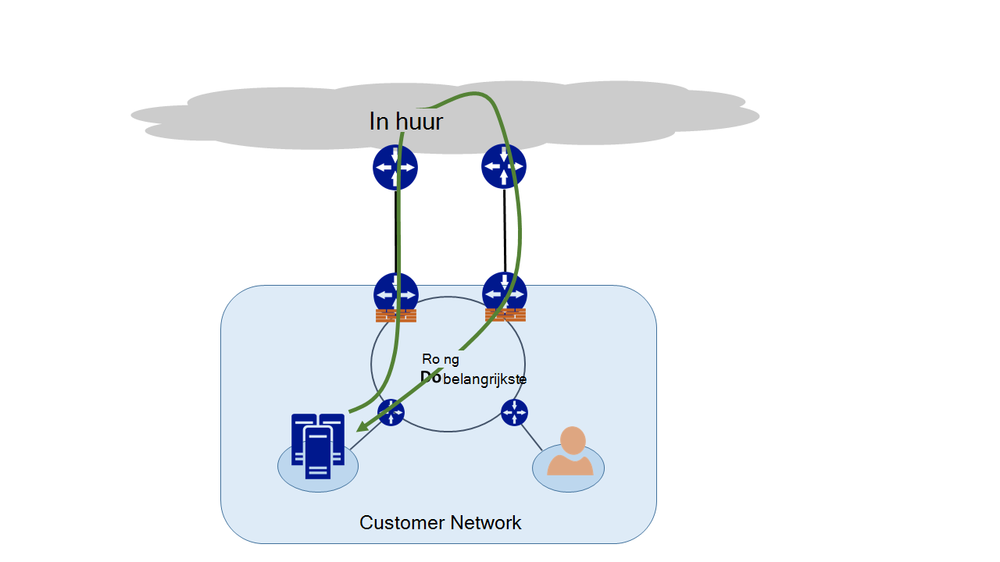
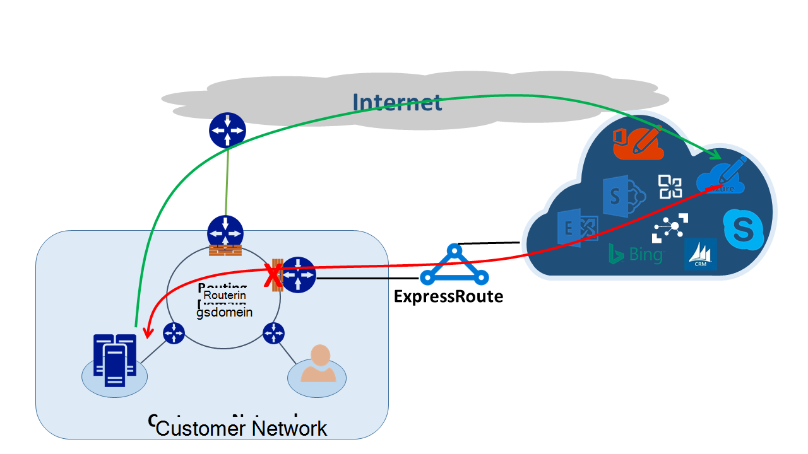
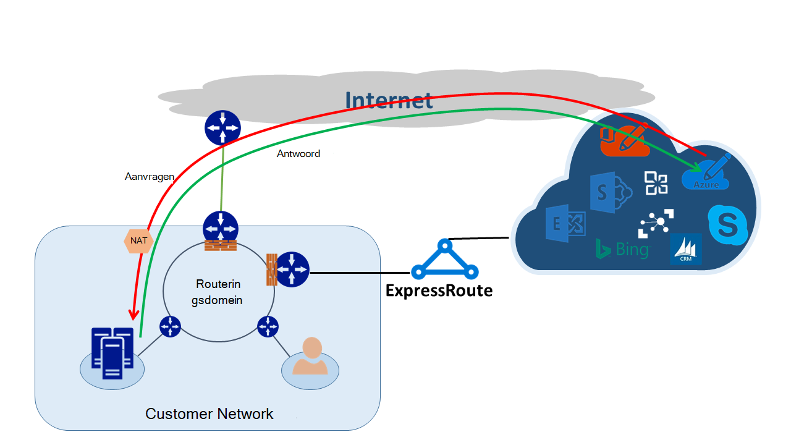

<properties
   pageTitle="Asymmetrische routering | Microsoft Azure"
   description="In dit artikel begeleidt u bij het oplossen die van een klant mogelijk geconfronteerd met asymmetrische mailroutering in een netwerk met meerdere koppelingen naar een bestemming."
   documentationCenter="na"
   services="expressroute"
   authors="osamazia"
   manager="carmonm"
   editor=""/>
<tags
   ms.service="expressroute"
   ms.devlang="na"
   ms.topic="get-started-article"
   ms.tgt_pltfrm="na"
   ms.workload="infrastructure-services"
   ms.date="10/10/2016"
   ms.author="osamazia"/>

# Asymmetrische routering met meerdere netwerkpaden

In dit artikel wordt uitgelegd hoe doorsturen en terug te keren netwerkverkeer mogelijk verschillende routes uitvoeren wanneer aan meerdere paden beschikbaar tussen netwerkbron- en doeltabellen zijn.

Het is belangrijk om te begrijpen twee concepten voor meer informatie over asymmetrische routering. Een is effect van meerdere netwerkpaden. De andere is hoe apparaten, zoals een firewall, staat houden. Dit soort apparaten heten statuscontrole apparaten. Scenario's waarvoor verkeer door een statuscontrole apparaat is verwijderd omdat het statuscontrole apparaat niet wordt gedetecteerd dat verkeer afkomstig met het apparaat zelf is Hiermee maakt u een combinatie van deze twee factoren.

## Meerdere netwerkpaden

Wanneer een enterprise-netwerk slechts één koppeling met Internet via hun internetprovider heeft, legt al het verkeer naar en vanuit Internet hetzelfde pad. Bedrijven kopen vaak meerdere circuits, als overtollige paden, naar het netwerk beschikbaarheid te verbeteren. Als dit gebeurt, is het mogelijk dat de verkeer die Hiermee gaat u buiten het netwerk, klikt u met Internet, via een koppeling loopt en de afzender verkeer doorloopt aan een andere koppeling. Dit is zogenaamde asymmetrische-mailroutering. In het asymmetrische routering duurt het omgekeerde netwerkverkeer een ander pad van de oorspronkelijke stroom.

Hoewel deze hoofdzakelijk op Internet plaatsvindt, asymmetrische routering ook van toepassing op andere combinaties van meerdere paden. IT is van toepassing, bijvoorbeeld zowel een internetpad en een privé pad dat gaat u naar dezelfde bestemming en naar meerdere privé paden die gaat u naar dezelfde bestemming.

Elke router langs de manier waarop, uit de bron op bestemming, berekent het beste pad om een bestemming te bereiken. Van de router bepaling van best mogelijke pad is gebaseerd op twee belangrijke factoren:

-   Routering tussen externe netwerken is gebaseerd op een routeren protocol, rand Gateway Protocol (BGP). BGP advertenties van neighbors wordt ingevoegd en wordt deze uitgevoerd door een reeks stappen om te bepalen de beste pad naar de opgegeven bestemming. Het beste pad wordt opgeslagen in de tabel mailroutering.
-   De lengte van een subnetmasker dat is gekoppeld aan een route van invloed op routeren paden. Als een router meerdere advertenties voor hetzelfde IP-adres, maar met een ander subnetmaskers ontvangt, wordt er in de router de advertentie met een langere subnetmasker voorkeur omdat een specifiekere route nieuwsbrief.

## Statuscontrole-apparaten

Routers kijkt u naar de IP-header van een pakket voor de routering. Sommige apparaten vindt u zelfs grondigere in het pakket. Meestal deze apparaten kijkt u naar Layer4 (Transmission Control Protocol, of TCP; of gebruiker datagramprotocol of UDP), of zelfs Layer7 (toepassingslaag) kopteksten. Dit soort apparaten zijn beveiligingsapparaten of optimalisatie van bandbreedte apparaten. 

Een firewall is een voorbeeld van een statuscontrole-apparaat. Een firewall kunt of al dan niet toestaan een pakket door de interfaces op basis van verschillende velden zoals protocol, TCP/UDP-poorten en URL kopteksten. In dit niveau van pakket controle levert een dik processing belasting op het apparaat. Prestaties verbeteren controleert de firewall het eerste pakket van een stroom. Als dit het pakket om verder te toestaat, blijft dit de stroomgegevens in de tabel staat. Alle volgende pakketten met betrekking tot deze stroom zijn toegestaan op basis van de eerste bepaling. Een pakket die deel uitmaakt van een bestaande stroom mogelijk aankomt op de firewall. Als de firewall geen vorige staat informatie over deze heeft, worden de firewall het pakket.

## Asymmetrische routering met ExpressRoute

Wanneer u verbinding via Azure ExpressRoute aan Microsoft maakt, wordt uw wijzigingen in het netwerk zo uit:

-   U hebt meerdere koppelingen naar Microsoft. Een koppeling is uw bestaande internetverbinding en de andere is via ExpressRoute. Sommige verkeer naar Microsoft mogelijk gaan via Internet, maar keert u terug via ExpressRoute, of omgekeerd.
-   Ontvangt u meer informatie over IP-adressen via ExpressRoute. Ja, voor verkeer in uw netwerk naar Microsoft voor services aangeboden via ExpressRoute, routers altijd liever ExpressRoute.

Als u wilt weten over het effect van deze twee wijzigingen in een netwerk, laten we eens enkele scenario's. Als u bijvoorbeeld u slechts één circuitlijnen met Internet hebt en u alle Microsoft-services via Internet gebruiken. Het verkeer van uw netwerk naar Microsoft en terug worden dezelfde Internet koppeling doorlopen en de firewall passeert. De firewall records de stroom terwijl dit de eerste pakket ziet en afzender pakketten zijn toegestaan omdat de stroom in de tabel staat bestaat.

Vervolgens ExpressRoute inschakelen en services van Microsoft via ExpressRoute in beslag nemen. Alle andere services van Microsoft worden verbruikt via Internet. U implementeren een aparte firewall aan uw rand die is gekoppeld aan ExpressRoute. Microsoft wordt specifiekere voorvoegsels voor eenheden met uw netwerk via ExpressRoute voor specifieke services. Uw infrastructuur voor de routering kiest ExpressRoute als de voorkeur pad voor deze voorvoegsels voor eenheden. Als u bent niet uw openbare IP-adressen naar Microsoft reclame via ExpressRoute wordt Microsoft communiceert met uw openbare IP-adressen via Internet. Doorsturen verkeer in uw netwerk naar Microsoft gebruikt ExpressRoute en omgekeerde verkeer van Microsoft Internet gebruikt. Wanneer de firewall op de rand een antwoordpakket voor een stroom die niet in de tabel staat gevonden, worden deze de retour-verkeer is toegestaan.

Als u besluit om de groep met hetzelfde netwerk adressen NAT (Translation) gebruiken voor ExpressRoute en voor Internet, ziet u soortgelijke problemen met de clients in uw netwerk op privé IP-adressen. Verzoeken om services zoals Windows Update Ga via Internet, omdat het IP-adressen voor deze services zijn niet aangekondigd via ExpressRoute. Echter terugkomt de afzender verkeer via ExpressRoute. Als u Microsoft ontvangt een IP-adres met het dezelfde subnetmasker van het Internet- en ExpressRoute, ExpressRoute moet gebruiken via Internet. Als een firewall of een ander statuscontrole apparaat die zich op de rand van uw netwerk en die tegenover elkaar liggen ExpressRoute geen voorafgaande informatie over de stroom heeft, worden deze de pakketten die deel uitmaakt van deze stroom.

## Asymmetrische routeren oplossingen

U hebt twee belangrijkste opties voor het oplossen van het probleem van asymmetrische routering. Een door de routering is en de andere is met behulp van de bron gebaseerde NAT (SNAT).

### Routering

Zorg ervoor dat uw openbare IP-adressen zijn aangekondigd naar de gewenste breed gedeelte WAN (network) koppelingen. Bijvoorbeeld als u gebruiken Internet voor verificatieverkeer en ExpressRoute voor uw e-mail-verkeer is toegestaan wilt, moet u niet aangekondigd uw Active Directory Federation Services (AD FS) openbare IP-adressen via ExpressRoute. Zorg ook niet om weer te geven van een on-premises AD FS-server IP-adressen die de router via ExpressRoute ontvangt. Routes ontvangen via ExpressRoute zijn specifiekere zodat ze ExpressRoute de voorkeur pad voor verificatieverkeer naar Microsoft. Hierdoor asymmetrische-mailroutering.

Als u gebruiken ExpressRoute voor verificatie wilt, controleert u of dat u AD FS openbare IP-adressen zijn advertenties via ExpressRoute zonder NAT Op deze manier verkeer die afkomstig zijn van Microsoft en gaat u naar een on-premises AD FS-server is gewijd aan ExpressRoute. Afzender verkeer van klant naar Microsoft gebruikt ExpressRoute omdat deze de voorkeur route via Internet.

### Bron gebaseerde NAT

Er is een andere manier voor het oplossen van problemen met asymmetrische routing via SNAT. U hebt bijvoorbeeld niet het openbare IP-adres van een on-premises Simple Mail Transfer Protocol (SMTP) server aangekondigd via ExpressRoute omdat u wilt gebruiken Internet voor dit type communicatie. Een aanvraag die afkomstig zijn bij Microsoft en wordt vervolgens naar uw on-premises implementatie SMTP-server web surft. U SNAT de inkomende aanvraag voor een interne IP-adres. Omgekeerde verkeer van de SMTP-server gaat naar de rand firewall (die u gebruikt voor NAT) in plaats van via ExpressRoute. De afzender verkeer gaan via Internet.

## Asymmetrische routeren detectie

Traceroute is de beste manier om ervoor te zorgen dat uw netwerkverkeer van het verwachte pad doorlopen. Als u verkeer uit uw on-premises implementatie SMTP-server naar Microsoft verwacht naar het pad Internet, wordt de verwachte traceroute is de SMTP-server naar Office 365. Het resultaat is gevalideerd dat verkeer uw netwerk naar Internet en niet naar ExpressRoute daadwerkelijk verlaat.
