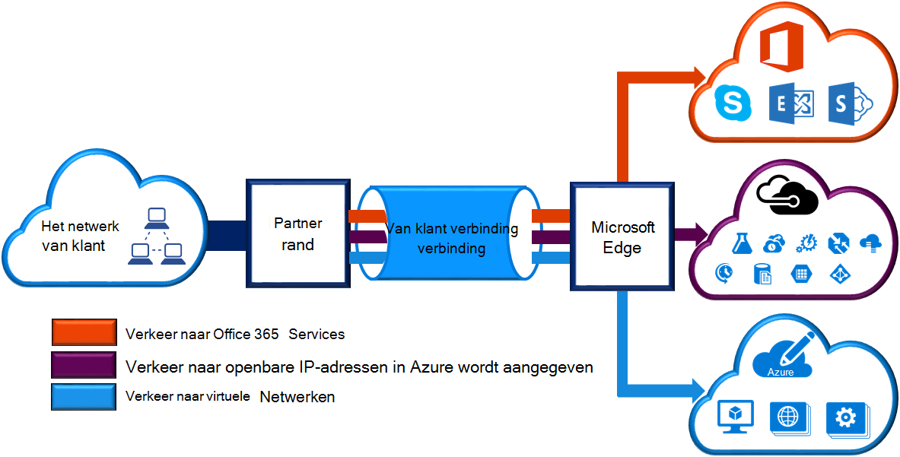
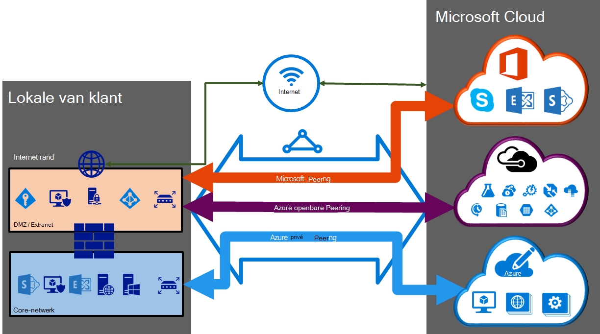

<properties 
   pageTitle="ExpressRoute circuits en routeren domeinen | Microsoft Azure"
   description="Deze pagina bevat een overzicht van ExpressRoute circuits en de domeinen van de mailroutering."
   documentationCenter="na"
   services="expressroute"
   authors="cherylmc"
   manager="carmonm"
   editor=""/>
<tags 
   ms.service="expressroute"
   ms.devlang="na"
   ms.topic="article" 
   ms.tgt_pltfrm="na"
   ms.workload="infrastructure-services" 
   ms.date="10/10/2016"
   ms.author="cherylmc"/>

# ExpressRoute circuits en routeren domeinen

 U moet een *ExpressRoute circuitlijnen* met de infrastructuur van uw on-premises implementatie zijn verbonden met Microsoft via een provider connectivity bestellen. De onderstaande afbeelding biedt een logische weergave van de connectiviteit tussen uw WAN- en Microsoft.

## ExpressRoute circuits

Een *ExpressRoute circuitlijnen* vertegenwoordigt een logische verbinding tussen uw on-premises implementatie-infrastructuur en Microsoft cloud-services via een provider connectivity. U kunt meerdere ExpressRoute circuits rangschikken. Elke circuitlijnen kan zijn in dezelfde of een andere regio's en kan niet worden verbonden met hun lokale tot en met verschillende connectivity providers. 

ExpressRoute circuits doen niet toewijzen aan een fysieke entiteiten. Een circuitlijnen wordt uniek aangeduid met een standaard die GUID aangeroepen als een service toets (s-). De servicesleutel is de enige informatie uitwisselen tussen Microsoft, de provider connectivity en u. De s-sleutel is niet een geheim om veiligheidsredenen. Er is een toewijzing 1:1 tussen een circuitlijnen ExpressRoute en de s-sleutel.

Een circuitlijnen ExpressRoute kan maximaal drie onafhankelijke peerings hebben: Azure openbare, Azure privé en Microsoft. Elke peering is een paar onafhankelijke BGP sessies van deze toch toe voor maximale beschikbaarheid worden geconfigureerd. Er is een 1: n (1 < = N < = 3) toewijzing tussen een circuitlijnen ExpressRoute en routering van domeinen. Een circuitlijnen ExpressRoute kunt hebben een, twee of alle drie peerings per ExpressRoute circuitlijnen ingeschakeld.
 
Elke circuitlijnen heeft een vaste bandbreedte (50 Mbps, 100 Mbps, 200 Mbps, 500 Mbps, 1 GB/s, 10 GB/s) en is toegewezen aan een connectivity-provider en een peering locatie. De bandbreedte die u selecteert in alle peerings voor de circuitlijnen worden gedeeld. 

### Quota's, grenzen en beperkingen

Standaardquota en limieten toepassen voor elk circuitlijnen ExpressRoute. Verwijzen naar de pagina [Azure-abonnement en limieten van de Service, quota's en beperkingen](../azure-subscription-service-limits.md) voor actuele informatie over quota.

## ExpressRoute routeren domeinen

Een circuitlijnen ExpressRoute heeft meerdere routeren domeinen die zijn gekoppeld: Azure openbare, Azure privé en Microsoft. Elk van de domeinen van de routering identiek is geconfigureerd op een paar routers (in actieve of laden delen configuratie) voor maximale beschikbaarheid. Azure services zijn gecategoriseerd als *Azure openbare* en *persoonlijke Azure* om aan te geven van de IP-adressen van schema's.

### Persoonlijke peering

Azure berekenen services, namelijk virtuele machines (IaaS) en cloudservices (PaaS), die zijn geïmplementeerd binnen een virtueel netwerk kunnen worden verbonden via het privé peering domein. Het privé peering domein wordt beschouwd als een vertrouwde uitbreiding van uw netwerk core in Microsoft Azure. U kunt bidirectionele verbinding tussen uw core netwerk en Azure virtuele netwerken (VNets) instellen. Deze peering, kunt u verbinding maken met virtuele machines en cloud services rechtstreeks op hun persoonlijke IP-adressen.  

U kunt meer dan één virtuele netwerk koppelen aan het privé peering domein. Lees de [Veelgestelde vragen over pagina](expressroute-faqs.md) voor meer informatie over beperkingen en tekortkomingen. U kunt de pagina [Azure-abonnement en limieten van de Service, quota's en beperkingen](../azure-subscription-service-limits.md) voor actuele informatie op limieten bezoeken.  Verwijzen naar de pagina [Routering](expressroute-routing.md) voor gedetailleerde informatie over de configuratie van de routering.

### Openbare peering

Services zoals Azure opslag, SQL-databases en Websites worden aangeboden op openbare IP-adressen. U kunt privé services die worden gehost op openbare IP-adressen, inclusief VIP's van uw cloudservices, via de openbare peering routeringsdomein verbinden. U kunt de openbare peering domein hebt gekoppeld aan uw DMZ en verbinding maken met alle Azure services op de openbare IP-adressen van uw WAN zonder dat u moet verbinding maken via internet. 

Connectiviteit wordt met Microsoft Azure services altijd vanaf uw WAN gestart. Microsoft Azure services worden niet op uw netwerk via deze routeringsdomein aangesloten initiëren. Als openbare peering is ingeschakeld, is mogelijk verbinding maken met alle Azure-services. We kunt u niet moet services waarvoor we routes naar kondigen selectief te kiezen. U kunt raadpleegt u de lijst van voorvoegsels die we reclame voor u maken via deze peering op de pagina [Microsoft Azure Datacenter IP-bereiken gebruikt](http://www.microsoft.com/download/details.aspx?id=41653) . De pagina wordt wekelijkse bijgewerkt.

U kunt aangepaste routefilters definiëren binnen uw netwerk alleen de routes die u nodig hebt in beslag neemt. Verwijzen naar de pagina [Routering](expressroute-routing.md) voor gedetailleerde informatie over de configuratie van de routering. U kunt aangepaste routefilters definiëren binnen uw netwerk alleen de routes die u nodig hebt in beslag neemt. 

Zie de [Veelgestelde vragen over pagina](expressroute-faqs.md) voor meer informatie op services die via de openbare peering routeringsdomein ondersteund. 
 
### Microsoft peering

[AZURE.INCLUDE [expressroute-office365-include](../../includes/expressroute-office365-include.md)]

Connectiviteit met alle andere Microsoft online services (zoals Office 365-services) is via de Microsoft-peering. We inschakelen bidirectionele verbinding tussen uw WAN- en Microsoft cloud-services via de Microsoft peering routeringsdomein. U moet verbinding maken met Microsoft cloudservices alleen via het openbare IP-adressen die door u of uw provider connectivity eigendom zijn en u moet voldoen aan de gedefinieerde regels. Zie de pagina [ExpressRoute vereisten](expressroute-prerequisites.md) voor meer informatie.

Zie de [Veelgestelde vragen over pagina](expressroute-faqs.md) voor meer informatie over services ondersteund, kosten en configuratiegegevens. Zie de pagina [Locaties ExpressRoute](expressroute-locations.md) voor informatie op de lijst met connectivity providers aanbod peering ondersteuning van Microsoft.

## Routeren domein-vergelijking

De onderstaande tabel worden de domeinen van de drie routeren vergeleken.

||**Persoonlijke Peering**|**Openbare Peering**|**Microsoft Peering**|
|---|---|---|---|
|**Max. # voorvoegsels voor eenheden per peering ondersteund**|4000 standaard 10.000 met ExpressRoute Premium|200|200|
|**IP-adresbereiken ondersteund**|Een geldig IPv4-adres binnen uw WAN.|Openbare IPv4-adressen eigendom van u of uw provider connectivity.|Openbare IPv4-adressen eigendom van u of uw provider connectivity.|
|**Als getal vereisten**|Persoonlijke en openbare als getallen. U moet eigenaar bent van het publiek als getal als u ervoor kiest om een te gebruiken. | Persoonlijke en openbare als getallen. U moet echter eigendom van openbare IP-adressen bewijzen.| Persoonlijke en openbare als getallen. U moet echter eigendom van openbare IP-adressen bewijzen.|
|**Routeren Interface IP-adressen**|RFC1918 en openbare IP-adressen|Openbare IP-adressen voor u is geregistreerd in routeren registervermeldingen.| Openbare IP-adressen voor u is geregistreerd in routeren registervermeldingen.|
|**MD5-Hash ondersteuning**| Ja|Ja|Ja|

U kunt een of meer van de domeinen van de routering inschakelen als onderdeel van hun circuitlijnen ExpressRoute. U kunt de routering domeinen op de dezelfde VPN plaatsen als u wilt samenvoegen tot één routeren domein hebt. U kunt ook overbrengen naar verschillende routeren domeinen, vergelijkbaar met het diagram. De aanbevolen configuratie is dat direct op het netwerk core privé peering is aangesloten en de openbare en Microsoft peering koppelingen zijn verbonden met uw DMZ.
 
Als u besluit om alle drie peering sessies hebt, moet u drie paren van BGP sessies (een paar voor elk type peering) hebben. De paren van de sessie BGP bieden een hoge beschikbaarheid koppeling. Als u verbinding via laag 2 connectivity providers maakt, kunt u bent verantwoordelijk voor het configureren en beheren van routering. U kunt meer informatie aan de hand van de [werkstromen](expressroute-workflows.md) voor het instellen van ExpressRoute.

## Volgende stappen

- Zoek een serviceprovider. Zie [ExpressRoute serviceprovider en locaties](expressroute-locations.md).
- Zorg ervoor dat alle voorwaarden wordt voldaan. Zie [ExpressRoute vereisten](expressroute-prerequisites.md).
- Configureer uw verbinding ExpressRoute.
    - [ExpressRoute circuits maken](expressroute-howto-circuit-classic.md)
    - [Routeren (circuitlijnen peerings) configureren](expressroute-howto-routing-classic.md)
    - [Een VNet koppelen aan een circuitlijnen ExpressRoute](expressroute-howto-linkvnet-classic.md)
