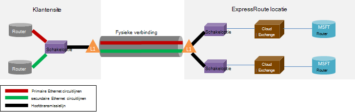

<properties
   pageTitle="ExpressRoute Veelgestelde vragen"
   description="De ExpressRoute Veelgestelde vragen over bevat informatie over ondersteunde Azure-Services, kosten, gegevens en verbindingen, SLA, Providers en locaties, bandbreedte en aanvullende technische Details."
   documentationCenter="na"
   services="expressroute"
   authors="cherylmc"
   manager="carmonm"
   editor=""/>
<tags
   ms.service="expressroute"
   ms.devlang="na"
   ms.topic="article" 
   ms.tgt_pltfrm="na"
   ms.workload="infrastructure-services"
   ms.date="10/10/2016"
   ms.author="cherylmc"/>

# ExpressRoute Veelgestelde vragen

## Wat is ExpressRoute?
ExpressRoute is een Azure-service waarmee u privé verbindingen maken tussen Microsoft datacenters en de infrastructuur van die beschikbaar is op uw locatie of in een faciliteit onderbrengen. ExpressRoute verbindingen niet eens openbare Internet en betere beveiliging, betrouwbaarheid en snelheden met lagere vertragingstijden dan de normale verbindingen bieden via Internet.

### Wat zijn de voordelen van het gebruik van ExpressRoute en particuliere netwerkverbindingen?
ExpressRoute verbindingen niet eens openbare Internet en betere beveiliging, betrouwbaarheid en snelheden met lagere en consistente vertragingstijden dan de normale verbindingen bieden via Internet. In sommige gevallen ExpressRoute verbindingen gebruiken om gegevens tussen te brengen on-premises apparaten en Azure aanzienlijk kostenvoordelen kan worden verkregen.

### Voor welke services van Microsoft cloud via ExpressRoute worden ondersteund?
ExpressRoute ondersteunt de meeste Microsoft Azure services vandaag inclusief Office 365.  Zoeken naar updates over de beschikbaarheid van de algemene binnenkort.

### Waar is de service beschikbaar?
Zie deze pagina voor de servicelocatie en beschikbaarheid: [ExpressRoute partners en locaties](expressroute-locations.md).

### Hoe kan ik verbinding maken met Microsoft als ik geen samenwerking met een van de partners ExpressRoute-carrier ExpressRoute gebruiken?
U kunt een regionale carrier selecteren en terechtkomt Ethernet-verbindingen naar een van de ondersteunde exchange provider locaties. U kunt vervolgens peer met Microsoft op de locatie van de provider. Controleer de laatste sectie van [ExpressRoute partners en locaties](expressroute-locations.md) om te controleren of uw provider presenteren in een van de exchange-locaties. U kunt een circuitlijnen ExpressRoute via de serviceprovider verbinding maken met Azure vervolgens ordenen.

### Wat kost ExpressRoute?
Controleer de [details prijzen](https://azure.microsoft.com/pricing/details/expressroute/) voor prijsinformatie.

### Als ik voor een circuitlijnen ExpressRoute van een bepaald bandbreedte betalen, de VPN-verbinding die ik bij mijn netwerkprovider kopen hoeft te zijn dezelfde snelheid?
Nee. U kunt een VPN-verbinding van elke snelheid van uw provider kopen. De verbinding met Azure is echter beperkt tot de ExpressRoute circuitlijnen bandbreedte dat u zich aanmeldt.

### Als ik voor een circuitlijnen ExpressRoute van een bepaald bandbreedte betalen, ik heb de mogelijkheid om te burst tot hogere snelheden indien nodig?
Ja. ExpressRoute circuits zijn geconfigureerd voor ondersteuning van zaken waar u kunt burst tot twee maal de Bandbreedtelimiet van de die u gratis aangebracht. Neem contact op met uw provider als deze functie wordt ondersteund.

### Kan ik tegelijk dezelfde privé netwerkverbinding met Virtual Network en andere Azure services gebruiken?
Ja. Een circuitlijnen ExpressRoute eenmaal instelling kunt u voor toegang tot services binnen een virtueel netwerk en andere Azure services tegelijk. U maakt verbinding met virtuele netwerken via het privé peering pad en andere services via de openbare peering pad.

### Biedt ExpressRoute een Service Level (Agreement)?
Raadpleeg de [ExpressRoute SLA pagina](https://azure.microsoft.com/support/legal/sla/) voor meer informatie.

## Ondersteunde services
Meest Azure services worden via ExpressRoute ondersteund.

- Connectiviteit met virtuele machines en cloudservices geïmplementeerd in virtuele netwerken boven het privé peering pad worden ondersteund.
- Azure-Websites worden ondersteund op de openbare peering pad.
- IoT Hub wordt ondersteund via de openbare peering pad.
- Office 365 wordt ondersteund via de Microsoft peering pad.
- Alle andere services zijn toegankelijk via de openbare peering pad. De uitzonderingen zijn als volgt.

    **De volgende services worden niet ondersteund:**

    - CDN
    - Visual Studio Team Services laden testen
    - Meervoudige verificatie
    - Verkeer Manager

## Gegevens en verbindingen

### Gelden er beperkingen ten aanzien van de hoeveelheid gegevens die ik kunt overbrengen ExpressRoute gebruiken?
We Stel niet een limiet van de hoeveelheid gegevens doorverbinden. Ga naar [details prijzen](https://azure.microsoft.com/pricing/details/expressroute/) voor meer informatie over de bandbreedte tarieven.

### Welke verbindingssnelheid worden ondersteund door ExpressRoute?
Bandbreedte aanbiedingen ondersteund:

| 50 Mbps, 100 Mbps, 200 Mbps, 500 Mbps, 1Gbps, 2 GB/s, 5 GB/s, 10Gbps |

### Welke serviceprovider zijn beschikbaar?
Zie [ExpressRoute partners en locaties](expressroute-locations.md) voor de lijst met serviceprovider en locaties.

## Technische details

### Wat zijn de technische vereisten voor de verbinding met mijn on-premises locatie Azure?
Zie [ExpressRoute vereisten pagina](expressroute-prerequisites.md) voor de vereisten voor.

### Verbindingen naar ExpressRoute overtollige zijn?
Ja. Elke circuitlijnen Express Route heeft een overtollige paar cross verbindingen geconfigureerd voor het beschikbaarheid.

### Ik verbinding kwijt als een van de koppelingen van mijn ExpressRoute mislukt?
U verliest connectivity als een van de cross verbindingen mislukt. Een overtollige verbinding is beschikbaar voor de ondersteuning voor het laden van uw netwerk. Bovendien kunt u meerdere circuits maken in een andere peering locatie om te bereiken flexibiliteit is mislukt.

### Als ik niet gezamenlijk bevindt op een exchange cloud ben en mijn serviceprovider puntverbinding biedt, heb ik nodig om twee fysieke verbindingen tussen mijn on-premises netwerk en Microsoft? 
Nee, hoeft u alleen een fysieke verbinding als uw provider twee Ethernet virtuele circuits via de fysieke verbinding kunt maken. De fysieke verbinding (bijvoorbeeld een Network) wordt beëindigd op een laag 1 (L1)-apparaat (Zie onderstaande afbeelding). De twee Ethernet virtuele circuits zijn gemarkeerd met verschillende VLAN-id's, één voor de primaire circuitlijnen en één voor de secundaire. Deze VLAN-id's zijn opgeslagen in de buitenste 802.1Q Ethernet koptekst. De binnenste 802.1Q Ethernet koptekst (niet wordt weergegeven) is toegewezen aan een specifieke [ExpressRoute routeringsdomein](expressroute-circuit-peerings.md). 

### Kan ik uitbreiden met een van mijn VLAN's naar Azure ExpressRoute gebruiken?
Nee. We ondersteunen geen laag 2 connectivity extensies in Azure.

### Kan ik meer dan één ExpressRoute circuitlijnen hebben in mijn abonnement?
Ja. U kunt meer dan één ExpressRoute circuitlijnen hebben in uw abonnement. De standaardbeperking voor het aantal speciale circuits is ingesteld op 10. U kunt contact opnemen met Microsoft Support Verhoog deze limiet indien nodig.

### Kan ik ExpressRoute circuits uit verschillende serviceproviders hebben?
Ja. U kunt ExpressRoute circuits hebben met veel serviceproviders. Elke circuitlijnen ExpressRoute is gekoppeld aan slechts één serviceprovider zijn.

### Hoe kan ik mijn virtuele netwerken verbinden met een circuitlijnen ExpressRoute
Onderstaand vindt u de basisstappen beschreven.

- U moet een circuitlijnen ExpressRoute stand te brengen en de serviceprovider deze inschakelen.
- U of de provider, moet de BGP peering (s) configureren.
- U moet het virtuele netwerk koppelen aan de circuitlijnen ExpressRoute.

Zie [ExpressRoute werkstromen voor de inrichting van circuitlijnen en circuitlijnen Staten](expressroute-workflows.md) voor meer informatie.

### Zijn er connectivity grenzen voor mijn circuitlijnen ExpressRoute?
Ja. [ExpressRoute partners en locaties](expressroute-locations.md) pagina bevat een overzicht van de grenzen connectivity voor een circuitlijnen ExpressRoute. Connectiviteit voor een circuitlijnen ExpressRoute is beperkt tot één geopolitieke regio. Connectiviteit kan worden uitgevouwen geopolitieke regio's kruiselings doordat de ExpressRoute premium-functie.

### Kan ik koppeling maken met meer dan één virtueel netwerk naar een circuitlijnen ExpressRoute?
Ja. U kunt maximaal 10 virtuele netwerken koppelen aan een circuitlijnen ExpressRoute.

### Ik heb meerdere Azure abonnementen die virtuele netwerken bevatten. Kan ik virtuele netwerken die in afzonderlijke abonnementen op een enkele ExpressRoute circuitlijnen zijn verbinding maken?
Ja. U kunt maximaal 10 andere Azure abonnementen op het gebruik van een enkel ExpressRoute circuitlijnen autoriseren. Deze limiet kan worden verhoogd doordat de ExpressRoute premium-functie.

Zie [een circuitlijnen ExpressRoute over meerdere abonnementen delen](expressroute-howto-linkvnet-arm.md)voor meer informatie.

### Virtuele netwerken verbonden zijn met de dezelfde circuitlijnen geïsoleerd uit elkaar?
Nee. Alle virtuele netwerken die zijn gekoppeld aan de dezelfde ExpressRoute circuitlijnen deel uitmaken van de dezelfde routeringsdomein en worden niet geïsoleerd van elkaar routeren vanuit het perspectief van. Als u route moeten worden geïsoleerd nodig hebt, moet u een aparte ExpressRoute circuits maken.

### Kan ik een virtueel netwerk verbonden met meer dan één ExpressRoute circuitlijnen hebben?
Ja. U kunt één virtuele netwerk met maximaal 4 ExpressRoute circuits koppelen. Ze moeten worden geordend tot en met 4 verschillende [ExpressRoute locaties](expressroute-locations.md).

### Kan ik internet uit mijn virtuele netwerken verbonden met ExpressRoute circuits openen?
Ja. Als u hebt geen standaardroutes (0.0.0.0/0) of internet route voorvoegsels voor eenheden via de sessie BGP aangekondigd, is mogelijk verbinding maken met internet vanaf een virtueel netwerk dat is gekoppeld aan een circuitlijnen ExpressRoute.

### Kan ik internetconnectiviteit met virtuele netwerken die zijn verbonden met ExpressRoute circuits blokkeren?
Ja. U kunt reclame maken voor standaardroutes (0.0.0.0/0) als u wilt blokkeren van alle internet-connectiviteit met virtuele machines geïmplementeerd binnen een virtueel netwerk en doorsturen van al het verkeer uit via het circuitlijnen ExpressRoute. Houd er rekening mee dat als u standaardroutes weergeven, we verkeer naar services aangeboden via openbare peering (zoals Azure opslag en SQL DB) weer naar uw lokale forceert. U moet uw Configureer om terug te keren verkeer naar Azure via de openbare peering pad of via internet.

### Kunnen virtuele netwerken die zijn gekoppeld aan de dezelfde ExpressRoute circuitlijnen met elkaar communiceren?
Ja. Virtuele machines geïmplementeerd in virtuele netwerken die zijn verbonden met het dezelfde ExpressRoute circuitlijnen kunnen met elkaar communiceren.

### Kan ik naar website connectivity voor virtuele netwerken te gebruiken in combinatie met ExpressRoute gebruiken?
Ja. ExpressRoute kan worden gecombineerd met site-naar-site VPN's.

### Kan ik een virtueel netwerk verplaatsen uit naar website / punt-naar-site configuratie ExpressRoute gebruiken?
Ja. U moet een gateway ExpressRoute binnen het netwerk van uw virtuele maken. Er is een kleine downtime die is gekoppeld aan het proces.

### Wat moet ik verbinding maken met Azure storage via ExpressRoute?
U moet een circuitlijnen ExpressRoute definiëren en routes configureren voor de openbare peering.

### Gelden er beperkingen ten aanzien van het aantal routes die ik reclame kunt maken?
Ja. We accepteren tot 4000 route voorvoegsels voor privé peering en 200 voor openbare peering en Microsoft peering. U kunt deze verhogen naar 10.000 routes voor privé peering als u de premium-functie van ExpressRoute inschakelen.

### Gelden er beperkingen voor IP-bereiken die ik reclame via de sessie BGP maken kunt?
We accepteren geen privé voorvoegsels voor eenheden (RFC1918) in de openbare en Microsoft peering BGP-sessie.

### Wat gebeurt er als ik de BGP overschrijdt bestandsgrootten?
Sessies met BGP wordt verwijderd. Ze worden hersteld nadat de voorvoegsel telling daaronder de limiet.

### Wat is de ExpressRoute BGP wachtruimte tijd? U kunt dit aanpassen?
De tijd wachtstand is 180. De permanente berichten worden verzonden om de 60 seconden. Deze worden instellingen opgelost aan de Microsoft-kant die niet worden gewijzigd.

### Nadat ik reclame maken voor de standaard-route (0.0.0.0/0) met mijn virtuele netwerken, kan ik niet mijn VMs Azure waarop Windows activeren. Hoe naar ik moet ik dit oplossen?
De volgende stappen helpen Azure het activeringsverzoek herkend:

1. Stand brengen van de openbare peering voor uw circuitlijnen ExpressRoute.
2. Een DNS-zoekopdracht uitvoeren en zoek het IP-adres van **kms.core.windows.net**
3. Voer een van de volgende twee items zodat de Key Management Service herkent u dat het activeringsverzoek afkomstig van Azure is en aan de aanvraag worden geaccepteerd.
    - Routeert de verkeer voor het IP-adres (verkregen in stap 2) terug naar Azure via de openbare peering op uw on-premises netwerk.
    - Hebben uw haar NSP provider-pincode het verkeer naar een Azure via de openbare peering.

### Kan ik de bandbreedte van een circuitlijnen ExpressRoute wijzigen?
Ja. U kunt de bandbreedte van een circuitlijnen ExpressRoute verhogen zonder dat u moet deze verwijderen. U moet opvolgen bij uw provider connectivity om ervoor te zorgen dat ze de throttles binnen hun netwerken ter ondersteuning van de toename van de bandbreedte bijwerken. Echter is niet mogelijk de bandbreedte van een circuitlijnen ExpressRoute verkleinen. Hoeven lager die de bandbreedte een tear naar beneden dat betekent en opnieuw gemaakt een circuitlijnen ExpressRoute.

### Hoe wijzig ik de bandbreedte van een circuitlijnen ExpressRoute?
U kunt de bandbreedte van de ExpressRoute circuitlijnen met de update specifiek circuitlijnen API en PowerShell-cmdlet bijwerken.

## ExpressRoute Premium

### Wat is ExpressRoute premium?
ExpressRoute premium is een verzameling onderstaande functies.

 - Verbeterde routeren tabel beperking van 4000 routes voor 10.000 routes voor privé peering.
 - Betere aantal VNets die kunnen worden verbonden aan de ExpressRoute circuitlijnen (de standaardinstelling is 10). Zie tabel hieronder voor meer informatie.
 - Globale connectivity via het Microsoft core-netwerk. Nu is mogelijk een VNet in één geopolitieke regio met een circuitlijnen ExpressRoute in een andere regio koppelen. **Voorbeeld:** U kunt een VNet gemaakt in Europa West naar een ExpressRoute circuitlijnen die is gemaakt in Silicon Valley koppelen.
 - Connectiviteit met Office 365-services en CRM Online.

### Hoeveel VNets kan ik een koppeling maken naar een circuitlijnen ExpressRoute als ik ExpressRoute premium ingeschakeld?
De onderstaande tabellen bevatten de limieten ExpressRoute en het aantal VNets per ExpressRoute circuitlijnen.

[AZURE.INCLUDE [expressroute-limits](../../includes/expressroute-limits.md)]

### Hoe schakel ik ExpressRoute premium?
ExpressRoute premium-functies kunnen worden ingeschakeld wanneer de functie is ingeschakeld en kan worden afgesloten door de staat circuitlijnen bij te werken. U kunt ExpressRoute premium inschakelen op de aanmaaktijd van een circuitlijnen of de update specifiek circuitlijnen API kunt bellen / PowerShell-cmdlet waarmee ExpressRoute premium.

### Hoe kan ik ExpressRoute premium uitschakelen?
U kunt de ExpressRoute premium uitschakelen door de ondersteuning van de update specifiek circuit API / PowerShell-cmdlet moet u ervoor zorgen dat u uw connectivity hebt aangepast wilt moet voldoen aan de standaardlimieten voordat u ExpressRoute premium uitschakelen. We mislukt verzoek ExpressRoute premium uitschakelen als uw gebruik buiten de standaardlimieten schalen.

### Kan ik kiezen de functies die ik wil dat uit het instellen van de functie premium?
Nee. Niet is mogelijk om te kiezen de functies die u nodig hebt. We inschakelen alle functies wanneer u ExpressRoute premium inschakelen.

### Wat kost ExpressRoute premium?
Ga naar [details prijzen](https://azure.microsoft.com/pricing/details/expressroute/) voor kosten.

### Ik betalen voor ExpressRoute premium naast standaard ExpressRoute kosten?
Ja. ExpressRoute premium gesprekskosten zijn van toepassing boven aan het ExpressRoute circuitlijnen kosten en kosten de connectivity-provider vereist.

## ExpressRoute en Office 365-Services en CRM Online

[AZURE.INCLUDE [expressroute-office365-include](../../includes/expressroute-office365-include.md)]

### Hoe maak ik een circuitlijnen ExpressRoute verbinding maken met Office 365-services en CRM Online?

1. Bekijk de pagina nieuwe [ExpressRoute vereisten](expressroute-prerequisites.md) om ervoor te zorgen dat u aan de vereisten voldoet.
2. Bekijk de lijst met serviceprovider en locaties op [ExpressRoute partners en locaties](expressroute-locations.md) om ervoor te zorgen dat uw behoeften connectivity wordt voldaan.
3. Plan uw capaciteitsvereisten voor aan de hand van [netwerkplanning en prestaties optimaliseren voor Office 365](http://aka.ms/tune/).
4. Volg de stappen in de onderstaande instellen connectivity [ExpressRoute werkstromen voor de inrichting van circuitlijnen en circuitlijnen Staten](expressroute-workflows.md)werkstromen.

>[AZURE.IMPORTANT] Zorg ervoor dat u ExpressRoute premium invoegtoepassing hebt ingeschakeld tijdens het configureren van connectiviteit met Office 365-services en CRM Online.

### Heb ik nodig om in te schakelen openbare Peering van Azure verbinding maken met Office 365-services en CRM Online?
Nee, hoeft u alleen Microsoft Peering inschakelen. Verificatieverkeer naar Azure AD worden verzonden via Microsoft Peering. 

### Mijn bestaande ExpressRoute circuits connectiviteit met Office 365-services en CRM Online ondersteunt?
Ja. Uw bestaande ExpressRoute circuitlijnen kan worden geconfigureerd connectiviteit met Office 365-services ondersteunen. Zorg ervoor dat er voldoende capaciteit verbinding maken met Office 365-services en zorg ervoor dat u premium-invoegtoepassing hebt ingeschakeld. [Netwerkplanning en prestaties optimaliseren voor Office 365](http://aka.ms/tune/) kunt u uw behoeften connectivity plannen. Zie ook [maken en wijzigen van een circuitlijnen ExpressRoute](expressroute-howto-circuit-classic.md).

### Welke Office 365 services kunnen worden geraadpleegd via een verbinding ExpressRoute?

Verwijzen naar de pagina [Office 365-URL's en IP-adresbereiken](http://aka.ms/o365endpoints) voor een up-to-date lijst met services ondersteund via ExpressRoute.

### Hoeveel kost ExpressRoute voor Office 365-services en CRM Online kosten?
Office 365-services en CRM Online vereist premium-invoegtoepassing wilt inschakelen. De [detailpagina van prijzen](https://azure.microsoft.com/pricing/details/expressroute/) vindt u details van kosten voor ExpressRoute.

### Welke regio's is ExpressRoute voor Office 365 ondersteund in?
Raadpleeg [ExpressRoute partners en locaties](expressroute-locations.md) voor meer informatie over de lijst van partners en locaties waar ExpressRoute wordt ondersteund.

### Kan ik Office 365 openen via internet evenzeer ExpressRoute is geconfigureerd voor mijn organisatie?
Ja. Office 365-service eindpunten zijn bereikbaar via internet Hoewel ExpressRoute is geconfigureerd voor uw netwerk. Als u op een locatie die is geconfigureerd voor verbinding met Office 365-services via ExpressRoute, wordt u verbinding maakt via ExpressRoute.

### Dynamics AX Online toegankelijk is via een verbinding ExpressRoute?
Nee, deze wordt niet ondersteund.
